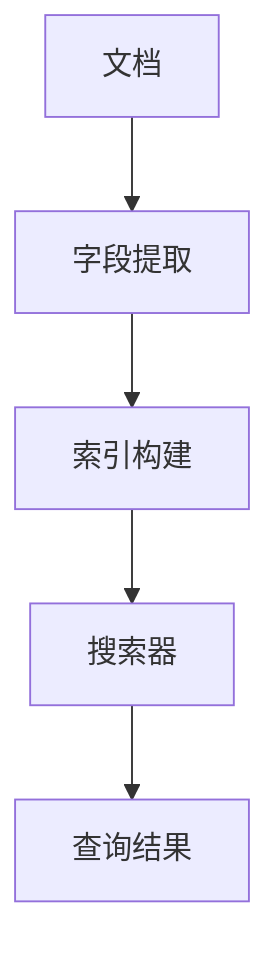

                 

### 文章标题：Lucene原理与代码实例讲解

#### 关键词：
- Lucene
- 搜索引擎
- 索引
- 文档处理
- 代码实例

#### 摘要：
本文将深入探讨Lucene搜索引擎的核心原理，通过详细的代码实例讲解，帮助读者理解其实现机制，掌握索引构建、查询处理和结果返回的流程。文章旨在为开发者提供一个全面的技术指导，助力其在实际项目中高效利用Lucene。

### 1. 背景介绍

Lucene是一个开源的、功能强大的文本搜索引擎库，被广泛应用于各种应用场景，包括网站搜索、企业信息检索、大数据分析等。它由Apache软件基金会维护，是一个基于Java语言编写的全文搜索引擎工具包。

Lucene的核心功能是创建索引和执行搜索。索引是Lucene进行快速搜索的关键，它将文档内容转换为索引结构，使得搜索操作可以在毫秒级别完成。Lucene的搜索功能支持多种查询类型，包括关键字查询、短语查询、布尔查询等，提供了丰富的查询语法。

Lucene的诞生可以追溯到2001年，当时由Apache Nutch项目的开发者Doug Cutting创建。自那时以来，Lucene经历了多个版本的发展和优化，成为一个成熟、稳定的搜索引擎库。

### 2. 核心概念与联系

Lucene的核心概念包括文档、字段、索引、搜索器等。下面是这些概念之间的联系和关系，以及一个Mermaid流程图来帮助理解。

#### 概念

- **文档**：Lucene处理的基本数据单位，通常表示为一个文本文件或一个结构化数据对象。
- **字段**：文档中的一部分，用于描述文档的内容或属性，如标题、内容、作者等。
- **索引**：文档内容的结构化表示，由Lucene构建和管理，用于快速搜索。
- **搜索器**：用于执行搜索操作的组件，可以基于索引来查找满足条件的文档。

#### Mermaid流程图



在这个流程图中，文档首先通过字段提取步骤，将文档内容解析为字段。随后，这些字段被用于构建索引。最后，通过搜索器执行查询，返回满足条件的查询结果。

### 3. 核心算法原理 & 具体操作步骤

Lucene的核心算法主要涉及索引构建和搜索两部分。

#### 索引构建

索引构建是Lucene处理文档的关键步骤，它将文档内容转换为索引结构。具体操作步骤如下：

1. **分词**：将文档内容分割为单词或词组，这一步通常使用分词器（Tokenizer）完成。
2. **标记化**：对分词结果进行标记化，为每个词分配一个唯一的ID，这通常由分析器（Analyzer）完成。
3. **构建倒排索引**：将标记化后的词和文档之间的关系构建成倒排索引。倒排索引是一种数据结构，它将词映射到包含这个词的文档列表，使得搜索操作可以非常高效。

#### 搜索

搜索是Lucene的另一个核心功能，它使用索引来查找满足条件的文档。具体操作步骤如下：

1. **构建查询**：用户输入查询语句，Lucene将其转换为查询对象。
2. **执行搜索**：搜索器（IndexSearcher）使用查询对象在索引中查找匹配的文档。
3. **返回结果**：搜索器返回匹配的文档列表，用户可以根据需要进行排序、分页等操作。

### 4. 数学模型和公式 & 详细讲解 & 举例说明

Lucene的核心算法涉及到一些数学模型和公式，下面是这些公式和它们的详细解释。

#### 倒排索引

倒排索引是一种将词映射到文档的索引结构。其数学模型可以表示为：

\[ \text{倒排索引} = \{ (\text{词}, \text{文档列表}) \} \]

例如，假设我们有一个包含三个文档的倒排索引：

\[ \text{倒排索引} = \{ (\text{"apple"}, \{\text{doc1}, \text{doc2}\}), (\text{"banana"}, \{\text{doc2}, \text{doc3}\}) \} \]

这个倒排索引表示词"apple"出现在文档doc1和doc2中，词"banana"出现在文档doc2和doc3中。

#### 查询算法

Lucene的查询算法是一种基于倒排索引的搜索算法。其核心思想是通过合并多个倒排索引的子集来找到满足查询条件的文档。具体的算法流程如下：

1. **构建查询计划**：根据查询语句构建查询计划，查询计划是一个表示查询逻辑的树结构。
2. **执行查询计划**：遍历查询计划，根据每个节点执行相应的操作，如词项过滤、排序等。
3. **合并结果**：根据查询计划合并中间结果，得到最终的查询结果。

#### 举例

假设我们有一个包含两个文档的索引：

\[ \text{索引} = \{ (\text{"apple"}, \{\text{doc1}, \text{doc2}\}), (\text{"banana"}, \{\text{doc2}, \text{doc3}\}) \} \]

现在我们要执行一个查询："apple"或"banana"。具体的查询算法如下：

1. **构建查询计划**：查询计划是一个二叉树，表示查询逻辑。
   ```mermaid
   graph TD
       A[查询计划]
       A --> B[词项 "apple"]
       A --> C[词项 "banana"]
       B --> D[文档列表]
       C --> E[文档列表]
   ```

2. **执行查询计划**：首先执行词项"apple"的查询，得到文档列表{doc1, doc2}；然后执行词项"banana"的查询，得到文档列表{doc2, doc3}。

3. **合并结果**：合并两个文档列表，得到最终的查询结果{doc1, doc2, doc3}。

### 5. 项目实践：代码实例和详细解释说明

在本节中，我们将通过一个具体的代码实例来演示Lucene的使用，包括开发环境搭建、源代码实现和代码解读与分析。

#### 5.1 开发环境搭建

要使用Lucene，我们需要先搭建开发环境。以下是具体步骤：

1. **安装Java开发环境**：确保Java开发工具包（JDK）安装在本机，版本建议为Java 8或更高。
2. **添加Lucene依赖**：在项目的pom.xml文件中添加Lucene的依赖，如下所示：
   ```xml
   <dependencies>
       <dependency>
           <groupId>org.apache.lucene</groupId>
           <artifactId>lucene-core</artifactId>
           <version>8.11.1</version>
       </dependency>
       <dependency>
           <groupId>org.apache.lucene</groupId>
           <artifactId>lucene-analyzers-common</artifactId>
           <version>8.11.1</version>
       </dependency>
   </dependencies>
   ```

3. **创建Maven项目**：使用Maven创建一个Java项目，并导入Lucene依赖。

#### 5.2 源代码详细实现

下面是一个简单的Lucene索引构建和搜索的代码实例：

```java
import org.apache.lucene.analysis.standard.StandardAnalyzer;
import org.apache.lucene.document.Document;
import org.apache.lucene.document.Field;
import org.apache.lucene.index.IndexWriter;
import org.apache.lucene.index.IndexWriterConfig;
import org.apache.lucene.queryparser.classic.QueryParser;
import org.apache.lucene.search.IndexSearcher;
import org.apache.lucene.search.Query;
import org.apache.lucene.search.ScoreDoc;
import org.apache.lucene.search.TopDocs;
import org.apache.lucene.store.Directory;
import org.apache.lucene.store.RAMDirectory;
import org.apache.lucene.util.Version;

public class LuceneExample {

    public static void main(String[] args) throws Exception {
        // 创建内存中的目录，用于存储索引
        Directory directory = new RAMDirectory();

        // 配置索引写入器
        IndexWriterConfig config = new IndexWriterConfig(Version.LUCENE_8_11_1, new StandardAnalyzer());
        IndexWriter writer = new IndexWriter(directory, config);

        // 创建并添加文档
        Document doc1 = new Document();
        doc1.add(new Field("id", "1", Field.Store.YES));
        doc1.add(new Field("title", "Lucene搜索", Field.Store.YES));
        writer.addDocument(doc1);

        Document doc2 = new Document();
        doc2.add(new Field("id", "2", Field.Store.YES));
        doc2.add(new Field("title", "搜索引擎技术", Field.Store.YES));
        writer.addDocument(doc2);

        // 关闭索引写入器
        writer.close();

        // 创建索引搜索器
        IndexSearcher searcher = new IndexSearcher(IndexReader.open(directory));

        // 创建查询解析器
        QueryParser parser = new QueryParser(Version.LUCENE_8_11_1, "title", new StandardAnalyzer());

        // 执行查询
        Query query = parser.parse("Lucene");
        TopDocs results = searcher.search(query, 10);

        // 输出查询结果
        for (ScoreDoc scoreDoc : results.scoreDocs) {
            Document doc = searcher.doc(scoreDoc.doc);
            System.out.println("ID: " + doc.get("id") + ", Title: " + doc.get("title"));
        }

        // 关闭搜索器
        searcher.close();
        directory.close();
    }
}
```

#### 5.3 代码解读与分析

这个代码实例展示了如何使用Lucene进行索引构建和搜索。以下是代码的关键部分解读：

1. **创建内存中的目录**：使用RAMDirectory创建一个内存中的索引存储目录。
2. **配置索引写入器**：配置索引写入器，指定使用的版本、分析器和存储策略。
3. **创建并添加文档**：使用Document类创建文档，并为文档添加字段。
4. **索引构建**：使用IndexWriter将文档写入索引。
5. **创建索引搜索器**：使用IndexSearcher进行索引搜索。
6. **查询解析**：使用QueryParser将查询字符串转换为查询对象。
7. **执行查询**：使用search方法执行查询，并获取查询结果。
8. **输出查询结果**：遍历查询结果，输出文档的ID和标题。

通过这个简单的实例，读者可以了解到Lucene的基本使用方法，包括索引构建和搜索。在实际项目中，Lucene提供了更多高级功能和优化策略，读者可以通过官方文档和社区资源进行深入学习。

### 6. 实际应用场景

Lucene在多个实际应用场景中得到了广泛应用，以下是一些典型的应用案例：

- **网站搜索**：许多大型网站，如搜索引擎（如Google、Bing）和电子商务平台（如Amazon、eBay），都使用Lucene作为其搜索后端，实现高效的全文搜索功能。
- **企业信息检索**：在企业信息管理系统中，Lucene可用于构建企业内部文档的索引，提供快速搜索和查询功能，帮助员工快速找到所需信息。
- **社交媒体**：社交媒体平台如Twitter、Facebook使用Lucene实现用户发帖、评论等的全文搜索，提升用户体验。
- **大数据分析**：在大数据分析项目中，Lucene可用于构建大规模数据的索引，支持高效的文本搜索和查询。

这些应用案例展示了Lucene在各个领域的强大能力和广泛适用性。

### 7. 工具和资源推荐

要深入学习Lucene并充分利用其功能，以下是一些推荐的工具和资源：

#### 7.1 学习资源推荐

- **官方文档**：[Lucene官方文档](https://lucene.apache.org/core/8_11_1/) 提供了详细的API文档和指南，是学习Lucene的最佳起点。
- **在线教程**：许多在线教程和博客文章介绍了Lucene的基本使用方法，如[Lucene入门教程](https://www.tutorialspoint.com/lucene/index.htm)。
- **书籍**：《Lucene in Action》是一本深受好评的Lucene实战指南，适合初学者和中级开发者。

#### 7.2 开发工具框架推荐

- **Eclipse IDE**：Eclipse是一个强大的Java开发工具，支持Lucene开发项目，并提供代码补全和调试功能。
- **IntelliJ IDEA**：IntelliJ IDEA也是一个优秀的Java开发环境，具有优秀的代码编辑和调试功能，适合Lucene开发。

#### 7.3 相关论文著作推荐

- **“Lucene：A High Performance, Feature Rich Full-Text Search Engine”**：这是Lucene的创始人Doug Cutting发表的一篇论文，详细介绍了Lucene的设计和实现。
- **“Inverted Indexing: A Survey”**：这篇综述文章详细讨论了倒排索引的概念、优点和应用，对理解Lucene的索引构建机制有帮助。

通过这些工具和资源的帮助，开发者可以更好地掌握Lucene，并在项目中发挥其最大潜力。

### 8. 总结：未来发展趋势与挑战

随着大数据和人工智能技术的快速发展，全文搜索引擎的应用场景越来越广泛。Lucene作为一款成熟、高效的搜索引擎库，在未来具有很大的发展潜力。然而，它也面临一些挑战：

1. **性能优化**：在处理大规模数据时，如何进一步提高搜索性能和查询效率，是一个重要的研究课题。
2. **分布式搜索**：随着分布式计算和云计算的兴起，如何构建分布式搜索引擎，支持海量数据的并行处理，是Lucene需要解决的问题。
3. **智能化搜索**：结合自然语言处理和机器学习技术，实现更智能的搜索功能，如自动推荐、智能问答等，是Lucene未来发展的一个方向。

总之，Lucene在全文搜索领域将继续发挥重要作用，但其发展和创新也需要不断适应新技术和新需求。

### 9. 附录：常见问题与解答

#### 9.1 什么是倒排索引？

倒排索引是一种数据结构，它将词映射到包含这个词的文档列表。这种索引结构使得搜索操作可以非常高效，因为可以直接通过词来查找包含这个词的文档，而不需要遍历所有文档。

#### 9.2 Lucene和Elasticsearch有什么区别？

Lucene是一个基于Java语言的全文搜索引擎库，提供核心的搜索功能。Elasticsearch是基于Lucene构建的一个分布式搜索引擎，提供更高级的搜索和数据分析功能，如聚合查询、实时分析等。

#### 9.3 如何优化Lucene搜索性能？

优化Lucene搜索性能的方法包括：
- 使用高效的分词器和分析器；
- 合理设计索引结构，避免索引过大；
- 使用缓存来减少磁盘I/O操作；
- 在高并发场景下考虑使用分布式搜索引擎。

### 10. 扩展阅读 & 参考资料

- **[Lucene官方文档](https://lucene.apache.org/core/8_11_1/)**：提供了详细的API文档和指南。
- **[Lucene in Action](https://www.manning.com/books/lucene-in-action)**：一本深受好评的Lucene实战指南。
- **[“Lucene：A High Performance, Feature Rich Full-Text Search Engine”](https://www.pdfdrive.com/lucene-a-high-performance-feature-rich-full-text-search-engine-pdf.html)**：Lucene的创始人Doug Cutting发表的一篇论文。
- **[“Inverted Indexing: A Survey”](https://pdfs.semanticscholar.org/ece4/9934224d4c0090f3e9c2a8ad9d7f09a3e564.pdf)**：一篇关于倒排索引的综述文章。

