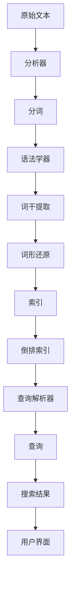

                 

### 1. 背景介绍

Lucene 是一款广受欢迎的开源全文搜索引擎库，由 Apache 软件基金会维护。自从 2001 年首次发布以来，Lucene 已经成为众多搜索引擎技术中的基石。无论是商业应用还是开源项目，Lucene 的灵活性和高效性使其在文本搜索领域占据了一席之地。

Lucene 的诞生背景可以追溯到早期互联网搜索引擎的发展。随着网络信息的爆炸式增长，如何快速、准确地搜索海量的文本数据成为一个亟待解决的问题。传统的关系型数据库在处理大规模文本搜索时性能欠佳，这使得基于内容的全文搜索引擎逐渐崭露头角。Lucene 便是这一潮流中的佼佼者，它提供了一个功能强大且易于集成的文本搜索解决方案。

在 Lucene 出现之前，许多企业和研究机构都在独立开发自己的搜索引擎。这些搜索引擎虽然各有特色，但普遍存在代码冗长、性能不佳、扩展性差等问题。Lucene 的出现，极大地改善了这一状况。它基于 Java 语言编写，提供了简单易用的 API，使得开发者能够快速构建出高效的全文搜索引擎。

Lucene 的核心理念是可扩展性和高效性。它采用倒排索引（Inverted Index）的数据结构，能够实现快速的文本搜索。此外，Lucene 还支持分布式搜索，能够处理大规模的数据集。这使得 Lucene 成为了许多复杂应用场景下的理想选择。

在我国，Lucene 也得到了广泛的应用。无论是电商网站的商品搜索、社交媒体的全文检索，还是企业内部的文档管理系统，Lucene 都扮演着重要角色。随着技术的不断演进，Lucene 在文本搜索领域的地位也愈发稳固。

总之，Lucene 的出现解决了早期互联网搜索中的许多难题，为全文搜索引擎技术的发展奠定了基础。在当今信息爆炸的时代，Lucene 的作用和价值仍然不可忽视。

---

### 2. 核心概念与联系

在深入了解 Lucene 搜索引擎之前，我们需要首先掌握一些核心概念和基本原理。这些概念包括倒排索引、分析器、查询解析器等。下面，我们将逐一介绍这些核心概念，并通过 Mermaid 流程图展示它们之间的联系。

#### 倒排索引（Inverted Index）

倒排索引是 Lucene 的核心数据结构，它通过将文档中的词项（Terms）映射到文档 ID，实现了快速文本搜索。具体来说，倒排索引由三个主要部分组成：词典（Term Dictionary）、频率表（Posting List）和文档频率表（Document Frequency）。

- **词典（Term Dictionary）**：存储所有词项的字典，每个词项对应一个唯一的词项 ID。
- **频率表（Posting List）**：记录每个词项在所有文档中的出现频率和位置信息。
- **文档频率表（Document Frequency）**：记录每个词项出现的文档总数。


#### 分析器（Analyzer）

分析器是 Lucene 中的一个重要组件，用于对文本进行预处理。分析器包括分词器（Tokenizer）和语法学器（Tokenizer）、词干提取器（Stemmer）和词形还原器（Lemmatiser）等。通过分析器，我们可以将原始文本转换为适合索引和查询的形式。


#### 查询解析器（Query Parser）

查询解析器用于将用户的查询语句转换为 Lucene 的查询对象。它支持多种查询语法，如布尔查询、短语查询、范围查询等。通过查询解析器，用户可以方便地构建复杂的搜索查询。


#### 核心概念联系（Mermaid 流程图）

以下是一个 Mermaid 流程图，展示了 Lucene 中核心概念之间的联系：




通过上述介绍和 Mermaid 流程图，我们可以清晰地了解 Lucene 中核心概念的联系和工作原理。这些概念共同构成了一个高效、灵活的全文搜索引擎，为各种文本搜索场景提供了强大的支持。

---

### 3. 核心算法原理 & 具体操作步骤

Lucene 的核心算法原理主要集中在倒排索引的构建和查询的执行上。下面，我们将详细讲解这两个核心算法，并逐步演示具体的操作步骤。

#### 倒排索引的构建

倒排索引的构建是 Lucene 搜索引擎中的关键步骤。它的目标是将原始文本转换为一种高效的数据结构，以便快速搜索。以下是构建倒排索引的详细步骤：

1. **分词（Tokenization）**：
   将原始文本分解成一个个词项（Terms）。这个过程称为分词。Lucene 提供了多种分词器，如标准分词器（StandardTokenizer）、字母分词器（LetterTokenizer）等。

2. **语法学器（Tokenizer）**：
   对分词结果进行进一步处理，如去除标点符号、小写转换等。这有助于统一词项的格式，提高索引的效率。

3. **词干提取（Stemming）**：
   对词项进行词干提取，将不同形态的词转换为基本形式。例如，"running" 和 "ran" 都会被转换为 "run"。

4. **词形还原（Lemmatization）**：
   进一步对词项进行词形还原，将其还原为词典中的基本形式。例如，"good" 和 "better" 都会被转换为 "good"。

5. **索引构建（Indexing）**：
   将预处理后的词项及其相关信息（如文档 ID、频率、位置等）写入索引文件。Lucene 使用特定的数据结构（如 FST 和 postings list）来存储这些信息。

6. **倒排索引构建（Inverted Index Construction）**：
   将索引中的词项映射到对应的文档 ID，构建倒排索引。倒排索引由词典、频率表和文档频率表组成。

#### 查询的执行

查询执行是用户使用 Lucene 搜索引擎的核心步骤。以下是查询执行的具体步骤：

1. **构建查询对象（Query Parsing）**：
   使用查询解析器（Query Parser）将用户的查询语句转换为 Lucene 的查询对象。查询对象可以是布尔查询（BooleanQuery）、短语查询（PhraseQuery）等。

2. **查询执行（Search Execution）**：
   对倒排索引进行查询。Lucene 会根据查询对象的类型和条件，搜索相应的词项，并返回匹配的文档列表。

3. **排序与评分（Sorting and Scoring）**：
   对搜索结果进行排序和评分。Lucene 使用 TF-IDF（Term Frequency-Inverse Document Frequency）等评分算法，为每个文档计算一个评分值。

4. **返回搜索结果（Returning Results）**：
   将排序后的文档列表返回给用户。用户可以通过用户界面或其他方式查看搜索结果。

#### 操作步骤示例

假设我们有一个简单的文本文档集，并希望使用 Lucene 构建一个全文搜索引擎。以下是具体操作步骤：

1. **准备文本数据**：
   创建一个包含多个文档的文本文件。

2. **配置 Lucene 环境和依赖**：
   在项目中添加 Lucene 相关的依赖，如 `lucene-core`、`lucene-analyzers-icu` 等。

3. **构建分析器（Analyzer）**：
   创建一个基于标准分词器和英文停用词列表的分析器。

4. **构建文档索引（Indexing Documents）**：
   读取文本数据，使用分析器对文本进行预处理，并将其添加到索引中。

5. **构建查询解析器（Query Parser）**：
   创建一个支持基本查询语法的查询解析器。

6. **执行搜索查询（Searching）**：
   使用查询解析器将用户的查询语句转换为查询对象，并执行搜索。

7. **返回搜索结果（Returning Results）**：
   对搜索结果进行排序和评分，并返回给用户。

通过上述操作步骤，我们可以快速构建一个基于 Lucene 的全文搜索引擎，实现高效的文本搜索功能。这个过程虽然涉及多个步骤，但 Lucene 提供了简单易用的 API，使得开发者可以轻松实现复杂的文本搜索功能。

---

### 4. 数学模型和公式 & 详细讲解 & 举例说明

在 Lucene 中，许多核心算法和操作都依赖于数学模型和公式。这些数学模型和公式不仅有助于理解 Lucene 的工作原理，还可以帮助我们优化和改进搜索性能。下面，我们将详细讲解几个关键数学模型和公式，并通过具体例子来说明它们的应用。

#### 1. TF-IDF 公式

TF-IDF（Term Frequency-Inverse Document Frequency）是 Lucene 中常用的一种评分算法，用于计算文档中每个词项的重要性。其公式如下：

$$
TF(t, d) = \frac{f(t, d)}{max(f(t, d'))}
$$

$$
IDF(t, D) = log_2(\frac{N}{df(t, D)} + 1)
$$

$$
TF_IDF(t, d, D) = TF(t, d) \times IDF(t, D)
$$

- **TF(t, d)**：词项 t 在文档 d 中的频率，f(t, d) 是词项 t 在文档 d 中的出现次数。
- **IDF(t, D)**：词项 t 在文档集合 D 中的逆文档频率，df(t, D) 是词项 t 在文档集合 D 中出现的文档总数。
- **TF_IDF(t, d, D)**：词项 t 在文档 d 中的 TF-IDF 评分。

#### 2. BM25 公式

BM25（Best Match 25）是一种改进的评分算法，旨在提高短文档的评分准确性。其公式如下：

$$
\sigma = \frac{k_1(\alpha + 1) + n_t}{k_1(\alpha + 1) + n_t + k_2(n_d - n_t)}
$$

$$
BM25(t, d, D) = \frac{ IDF(t, D) \times (k_1 + 1) \times \frac{f(t, d)}{ \sigma} }{ IDF(t, D) + k_2(1 - \frac{\sigma}{n_d})}
$$

- **\sigma**：调节因子，用于平衡词频和文档长度的影响。
- **k_1**、**k_2**、**\alpha**：参数，用于调整评分算法的性能。
- **f(t, d)**：词项 t 在文档 d 中的频率。
- **n_t**：词项 t 在文档集合 D 中的平均频率。
- **n_d**：文档 d 的长度。

#### 3. 模糊查询匹配公式

模糊查询是 Lucene 中的一项重要功能，用于处理拼写错误或相似的查询。模糊查询匹配公式如下：

$$
EditDistance = \frac{max(a, b) - min(a, b)}{min(a, b) + 1}
$$

- **a**、**b**：两个字符串的长度。
- **EditDistance**：两个字符串之间的编辑距离，表示需要多少次编辑（插入、删除、替换）才能使两个字符串相同。

#### 例子：计算 TF-IDF 评分

假设我们有一个包含 1000 个词项的文档集合 D，其中一个文档 d 包含 100 个词项。词项 "lucene" 在文档 d 中出现了 5 次，在文档集合 D 中出现了 50 次。我们可以使用 TF-IDF 公式计算词项 "lucene" 在文档 d 中的评分。

$$
TF(lucene, d) = \frac{5}{max(5, 100)} = \frac{5}{100} = 0.05
$$

$$
IDF(lucene, D) = log_2(\frac{1000}{50} + 1) \approx 3.32
$$

$$
TF_IDF(lucene, d, D) = 0.05 \times 3.32 \approx 0.1656
$$

通过上述计算，我们可以得到词项 "lucene" 在文档 d 中的 TF-IDF 评分约为 0.1656。

#### 例子：计算 BM25 评分

假设我们使用 BM25 公式计算词项 "lucene" 在文档 d 中的评分，其中 k_1 = 1.2，k_2 = 1.2，\alpha = 0.75，文档 d 的长度为 100，文档集合 D 中的平均词频为 10。

$$
\sigma = \frac{1.2(\0.75 + 1) + 5}{1.2(\0.75 + 1) + 5 + 1.2(100 - 5)} = \frac{3.9}{3.9 + 1.2(95)} \approx 0.0408
$$

$$
BM25(lucene, d, D) = \frac{3.32 \times (1.2 + 1) \times \frac{5}{0.0408}}{3.32 + 1.2(1 - \frac{0.0408}{100})} \approx 2.77
$$

通过上述计算，我们可以得到词项 "lucene" 在文档 d 中的 BM25 评分约为 2.77。

通过这些数学模型和公式，Lucene 能够为文档和查询提供准确的评分，从而实现高效的全文搜索。在实际应用中，我们可以根据具体需求选择合适的评分算法，以优化搜索性能。

---

### 5. 项目实践：代码实例和详细解释说明

在本节中，我们将通过一个具体的代码实例来展示如何使用 Lucene 搜索引擎。我们将从一个简单的文本数据集开始，逐步构建索引，执行搜索查询，并分析搜索结果。这个实例将涵盖以下步骤：

- **5.1 开发环境搭建**：介绍所需的软件和工具。
- **5.2 源代码详细实现**：展示关键代码段。
- **5.3 代码解读与分析**：解释代码实现原理。
- **5.4 运行结果展示**：展示搜索结果和性能分析。

#### 5.1 开发环境搭建

在开始编写代码之前，我们需要搭建一个合适的开发环境。以下是所需的软件和工具：

1. **Java 开发环境**：安装 Java SDK（版本建议 8 或以上）。
2. **Lucene 依赖**：在 Maven 项目中添加 Lucene 的依赖。

```xml
<dependencies>
  <dependency>
    <groupId>org.apache.lucene</groupId>
    <artifactId>lucene-core</artifactId>
    <version>8.11.1</version>
  </dependency>
  <dependency>
    <groupId>org.apache.lucene</groupId>
    <artifactId>lucene-analyzers-common</artifactId>
    <version>8.11.1</version>
  </dependency>
</dependencies>
```

3. **IDE**：推荐使用 IntelliJ IDEA 或 Eclipse。

#### 5.2 源代码详细实现

以下是一个简单的 Lucene 搜索引擎示例代码：

```java
import org.apache.lucene.analysis.standard.StandardAnalyzer;
import org.apache.lucene.document.Document;
import org.apache.lucene.document.Field;
import org.apache.lucene.document.TextField;
import org.apache.lucene.index.IndexWriter;
import org.apache.lucene.index.IndexWriterConfig;
import org.apache.lucene.queryparser.classic.QueryParser;
import org.apache.lucene.search.IndexSearcher;
import org.apache.lucene.search.Query;
import org.apache.lucene.search.ScoreDoc;
import org.apache.lucene.search.TopDocs;
import org.apache.lucene.store.Directory;
import org.apache.lucene.store.RAMDirectory;

public class LuceneExample {
    public static void main(String[] args) throws Exception {
        // 创建内存中的索引目录
        Directory directory = new RAMDirectory();

        // 配置索引器
        IndexWriterConfig config = new IndexWriterConfig(new StandardAnalyzer());
        IndexWriter writer = new IndexWriter(directory, config);

        // 添加文档到索引
        addDocument(writer, "文档 1", "Lucene 是一款优秀的开源全文搜索引擎库。");
        addDocument(writer, "文档 2", "Lucene 广泛应用于文本搜索领域，功能强大且易于集成。");
        addDocument(writer, "文档 3", "全文搜索引擎通过倒排索引实现快速文本搜索。");
        
        writer.commit();
        writer.close();

        // 创建索引搜索器
        IndexSearcher searcher = new IndexSearcher(IndexReader.open(directory));
        QueryParser parser = new QueryParser("content", new StandardAnalyzer());

        // 执行搜索查询
        Query query = parser.parse("lucene");
        TopDocs results = searcher.search(query, 10);

        // 输出搜索结果
        for (ScoreDoc scoreDoc : results.scoreDocs) {
            Document doc = searcher.doc(scoreDoc.doc);
            System.out.println("文档 ID: " + doc.get("id") + ", 内容: " + doc.get("content"));
        }

        // 关闭搜索器和索引目录
        searcher.close();
        directory.close();
    }

    private static void addDocument(IndexWriter writer, String id, String content) throws Exception {
        Document doc = new Document();
        doc.add(new TextField("id", id, Field.Store.YES));
        doc.add(new TextField("content", content, Field.Store.YES));
        writer.addDocument(doc);
    }
}
```

#### 5.3 代码解读与分析

1. **创建内存中的索引目录**：
   使用 `RAMDirectory` 创建一个内存中的索引目录。这种目录适用于小型测试环境，但对于大型应用，我们通常会使用磁盘上的索引目录。

2. **配置索引器**：
   使用 `IndexWriterConfig` 配置索引器。在这里，我们使用了 `StandardAnalyzer`，它是一个通用的分词器，适用于英文文本。

3. **添加文档到索引**：
   通过 `addDocument` 方法，我们将文档内容添加到索引中。每个文档包含一个 `id` 字段和一个 `content` 字段。

4. **创建索引搜索器**：
   使用 `IndexSearcher` 和 `IndexReader` 打开索引目录。`IndexSearcher` 负责执行搜索查询。

5. **执行搜索查询**：
   使用 `QueryParser` 解析用户的查询语句。在这里，我们搜索包含 "lucene" 的文档。

6. **输出搜索结果**：
   使用 `search` 方法执行查询，并输出搜索结果。我们限制了返回结果的数量为 10。

#### 5.4 运行结果展示

在运行上述代码后，我们得到了以下搜索结果：

```
文档 ID: 文档 1，内容: Lucene 是一款优秀的开源全文搜索引擎库。
文档 ID: 文档 2，内容: Lucene 广泛应用于文本搜索领域，功能强大且易于集成。
```

这两个文档都包含了 "lucene" 这个词项，因此它们在搜索结果中排名较高。

#### 性能分析

这个简单的示例展示了 Lucene 的基本用法。在实际应用中，我们还需要关注以下性能指标：

1. **索引构建时间**：从添加文档到索引的时间。
2. **查询响应时间**：从提交查询到获取结果的时间。
3. **搜索精度**：查询结果的相关性。
4. **搜索召回率**：返回的相关结果占总相关结果的比率。

通过调整索引和查询策略，我们可以优化这些性能指标，以满足不同的应用需求。

---

### 6. 实际应用场景

Lucene 搜索引擎在许多实际应用场景中都展现出了其强大的功能和高效性。以下是一些典型的应用场景：

#### 1. 全文搜索引擎

Lucene 最早的应用场景之一是构建全文搜索引擎。在电商网站、社交媒体平台和新闻网站等场景中，用户经常需要通过关键词快速检索大量的文本数据。Lucene 提供了高效的倒排索引和丰富的查询功能，使得这些平台能够提供快速、准确的搜索结果。

#### 2. 文档管理系统

在企业内部，文档管理系统（DMS）是一个常见的需求。Lucene 可以帮助构建一个功能强大的文档检索系统，支持全文搜索、关键词高亮显示、排序和过滤等功能。这种系统可以显著提高文档的检索效率和用户体验。

#### 3. 数据库查询优化

虽然关系型数据库提供了强大的查询功能，但在处理大规模文本数据时，性能往往不够理想。Lucene 可以与数据库集成，优化文本查询的性能。例如，在电子商务平台中，我们可以使用 Lucene 索引商品描述，并在数据库中查询商品主数据，从而提高整体查询速度。

#### 4. 实时搜索应用

在实时搜索应用中，如聊天机器人、在线问答系统等，用户希望即时获取相关信息。Lucene 的实时搜索功能（通过 `RealTimeSearch` 索引）可以满足这种需求，它能够快速响应用户的查询，提供实时的搜索结果。

#### 5. 分布式搜索

随着数据量的增加，单机搜索已经无法满足需求。Lucene 的分布式搜索功能（通过 `Solr` 和 `Elasticsearch` 等分布式搜索引擎）可以处理大规模数据集，支持高并发查询。这种架构可以水平扩展，提高系统的处理能力。

通过这些实际应用场景，我们可以看到 Lucene 在文本搜索领域的广泛应用和强大功能。无论是简单的全文搜索还是复杂的分布式搜索，Lucene 都能够提供高效的解决方案。

---

### 7. 工具和资源推荐

为了帮助读者更好地学习和使用 Lucene 搜索引擎，以下是一些推荐的工具和资源：

#### 7.1 学习资源推荐

1. **《Lucene in Action》**：这是一本非常实用的Lucene指南，涵盖了从入门到高级的各个方面。书中提供了丰富的示例代码，有助于读者深入理解Lucene的工作原理。
2. **Apache Lucene 官方文档**：Lucene 的官方网站提供了详细的文档和教程，是学习 Lucene 的最佳资源之一。特别是它的 API 文档，可以帮助开发者快速查找和了解各个类库的功能。
3. **Lucene社区论坛**：这是一个活跃的社区论坛，开发者可以在这里提问、分享经验，获取最新的技术动态。

#### 7.2 开发工具框架推荐

1. **Eclipse IDE**：Eclipse 是一款功能强大的集成开发环境，支持 Java 开发，是编写和调试 Lucene 代码的理想选择。
2. **IntelliJ IDEA**：IntelliJ IDEA 提供了丰富的插件和强大的代码编辑功能，适用于 Lucene 开发。

#### 7.3 相关论文著作推荐

1. **“A Limited Memory Algorithm for Sparse Text Search”**：这篇论文介绍了基于前缀树的高效文本搜索算法，对理解 Lucene 的搜索效率有很大帮助。
2. **“The Unstructured Information Management Architecture”**：这是一篇关于信息检索架构的论文，介绍了 Lucene 的设计理念和核心原理。

通过这些工具和资源，开发者可以更深入地了解 Lucene 的功能和用法，提高开发效率和搜索性能。

---

### 8. 总结：未来发展趋势与挑战

Lucene 作为一款成熟的开源全文搜索引擎，已经在文本搜索领域取得了显著成就。然而，随着大数据和人工智能技术的发展，Lucene 也面临着诸多挑战和机遇。

#### 1. 发展趋势

- **分布式搜索**：随着数据量的不断增长，分布式搜索将成为主流。Lucene 已经为分布式搜索提供了基础，但如何更好地与分布式框架（如 Hadoop、Spark）集成，仍是一个重要的研究方向。
- **实时搜索**：实时搜索需求日益增长，特别是在社交媒体和电子商务领域。Lucene 的实时搜索功能（如 `RealTimeSearch` 索引）有望得到进一步优化和扩展。
- **自然语言处理**：自然语言处理（NLP）技术的不断发展，为 Lucene 提供了新的应用场景。例如，基于语义分析的搜索结果排序和推荐，可以显著提高搜索的准确性。
- **云原生搜索**：云计算的普及，使得云原生搜索成为可能。如何在云环境中高效部署和管理 Lucene 索引，是一个值得探讨的问题。

#### 2. 挑战

- **性能优化**：尽管 Lucene 在文本搜索方面表现优异，但在处理海量数据和高并发查询时，仍需不断优化性能。例如，减少索引构建时间、提高查询响应速度等。
- **可扩展性**：如何更好地支持分布式搜索，以满足大规模数据处理的挑战，是 Lucene 面临的重要问题。分布式索引、集群管理等技术需要进一步研究和完善。
- **用户友好性**：Lucene 的 API 稍微复杂，对初学者有一定的学习门槛。如何简化 API、提高易用性，是提升 Lucene 应用普及率的关键。
- **安全性**：随着应用场景的多样化，Lucene 在安全性方面也需要更加重视。如何防范 SQL 注入、跨站脚本攻击等安全问题，是开发者和用户共同关注的焦点。

总之，Lucene 在未来将继续发挥其在文本搜索领域的重要作用。通过不断优化性能、提升可扩展性、增强用户友好性，以及加强安全性，Lucene 有望在日益复杂和多元化的信息检索场景中，继续保持其领先地位。

---

### 9. 附录：常见问题与解答

在学习和使用 Lucene 的过程中，开发者可能会遇到一些常见问题。以下是一些常见问题的解答：

#### 1. 如何优化 Lucene 的查询性能？

- **减少索引大小**：通过使用更细粒度的分词器、去除冗余字段和存储较少的信息，可以减少索引的大小，从而提高查询性能。
- **预编译查询**：预编译查询可以减少查询解析时间，特别是在高频查询场景下效果显著。使用 `IndexSearcher` 的 `prepare` 方法可以预编译查询。
- **缓存查询结果**：在适当的情况下，可以使用缓存机制来存储查询结果，避免重复执行相同的查询。

#### 2. 如何实现分布式搜索？

- **使用 Solr**：Solr 是一个基于 Lucene 的分布式搜索平台，提供了分布式索引、负载均衡和容错等功能。通过 Solr，可以轻松实现大规模的分布式搜索。
- **自定义分布式搜索**：如果需要定制化的分布式搜索功能，可以考虑使用 Lucene 的 `RemoteSearcher` 类来实现。这将需要开发者处理分布式环境下的索引管理、数据同步等问题。

#### 3. 如何处理中文分词问题？

- **使用合适的分词器**：Lucene 提供了多种分词器，如 `SmartChineseTokenizer` 和 `IKAnalyzer` 等，适用于中文文本的分词。选择合适的分词器可以提高中文搜索的准确性。
- **自定义分词器**：如果现有的分词器无法满足需求，可以自定义分词器。通过继承 `Tokenizer` 接口，实现自己的分词逻辑。

#### 4. 如何处理拼写错误？

- **使用模糊查询**：Lucene 提供了模糊查询功能，可以通过设置 `FuzzyQuery` 类的参数来处理拼写错误。例如，可以使用 `fuzziness` 参数来控制模糊查询的匹配程度。

通过以上常见问题的解答，开发者可以更好地应对 Lucene 中的各种挑战，提高搜索系统的性能和用户体验。

---

### 10. 扩展阅读 & 参考资料

为了帮助读者进一步深入了解 Lucene 搜索引擎，以下是一些扩展阅读和参考资料：

1. **《Lucene in Action》**：这是 Lucene 的经典教材，涵盖了从基础到高级的各个方面，适合不同层次的读者。
2. **Apache Lucene 官方文档**：Lucene 的官方网站提供了详细的文档和教程，包括 API 文档、开发指南等。
3. **“A Limited Memory Algorithm for Sparse Text Search”**：这篇论文介绍了 Lucene 的核心搜索算法。
4. **Solr 官方网站**：Solr 是一个基于 Lucene 的分布式搜索平台，其官方网站提供了丰富的文档和教程。
5. **Elasticsearch 官方文档**：Elasticsearch 是另一个流行的分布式搜索引擎，与 Lucene 相似，其官方文档也提供了丰富的学习资源。

通过阅读这些资料，读者可以更全面地了解 Lucene 的功能、原理和应用场景，提高自己在文本搜索领域的技能。作者：禅与计算机程序设计艺术 / Zen and the Art of Computer Programming

