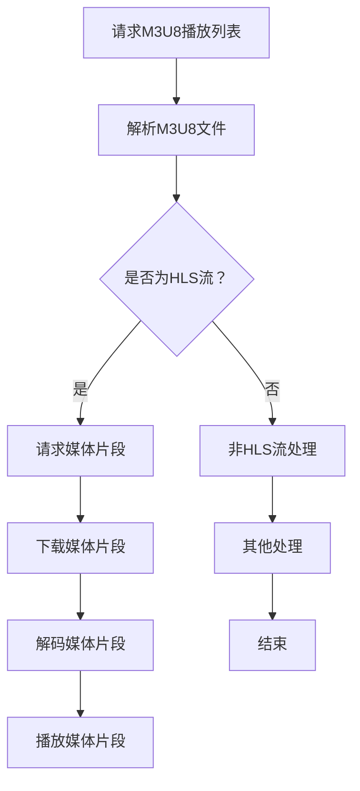

                 

## 1. 背景介绍

M3U8和HLS（HTTP Live Streaming）是现代网络视频传输中常用的技术，特别是在流媒体服务领域，如YouTube、Netflix等，它们被广泛采用。这两种技术在视频点播和直播中扮演着关键角色，确保视频内容能够高效、可靠地传输到各种设备上。

### M3U8的起源与发展

M3U8（Magic Cookie 8）文件格式最早由诺基亚在2000年代初期开发，用于移动设备上的多媒体播放。M3U8文件实际上是一个文本文件，它列出了媒体文件的URL路径。这种格式简单、易解析，特别适合移动设备等对存储空间和计算能力有限的环境中。

随着流媒体服务的普及，M3U8逐渐成为视频点播和直播的标准化格式之一。它的优势在于能够有效地分割大型视频文件，便于在网络上传输。M3U8文件通常包含一个播放列表，列出一系列媒体片段（TS文件），每个片段都是小段视频数据。

### HLS的起源与发展

HLS（HTTP Live Streaming）是由Apple公司开发的，旨在提供高效、可靠的直播流媒体服务。HLS基于HTTP协议，这意味着它可以通过普通的Web服务器进行传输，而不需要特殊的流媒体服务器。

HLS的核心思想是将视频流分割成多个小片段（TS文件），每个片段通常持续6秒到10秒。这些片段可以通过HTTP请求逐个下载，并且播放器可以在接收新片段的同时播放旧片段。这种方式提高了视频流的容错能力和适应性，因为即使在网络不稳定的情况下，播放器也能尝试重新请求丢失的片段。

HLS的发展得到了业界的广泛认可，不仅Apple自家的设备支持这种格式，许多其他厂商的设备和应用也实现了对HLS的支持。这使得HLS成为流媒体传输的事实标准之一。

### M3U8与HLS的关系

M3U8和HLS紧密相关，但它们有不同的应用场景。HLS是一种流媒体传输协议，而M3U8是一种文件格式，用于描述HLS流中的各个媒体片段。

- **HLS协议**定义了如何通过HTTP请求传输媒体片段，以及如何处理这些片段。HLS协议包括一个动态关键帧检测算法，用于确保播放器能够无缝切换到下一个媒体片段。
- **M3U8文件**则是一个文本文件，包含一个播放列表，列出所有可用的媒体片段。这个播放列表是一个关键组成部分，因为播放器需要通过它来请求各个片段。

总的来说，M3U8和HLS的结合为流媒体服务提供了高效的解决方案。HLS确保视频流能够稳定传输，而M3U8文件则提供了一种简单、可靠的方式来描述和管理这些流。

在接下来的章节中，我们将深入探讨M3U8和HLS的工作原理、实现细节，以及它们在实际应用中的具体用法。

## 2. 核心概念与联系

### M3U8文件格式

M3U8文件是一种文本文件，它包含一系列媒体片段的URL路径。一个典型的M3U8文件可能看起来如下：

```plaintext
#EXTM3U
#EXT-X-STREAM-INF:BANDWIDTH=1280000;CODECS="avc1.64001f,mp4a.40.2"
http://example.com/video1/segment1.ts
#EXT-X-STREAM-INF:BANDWIDTH=640000;CODECS="avc1.64001f,mp4a.40.2"
http://example.com/video1/segment2.ts
...
```

这个文件定义了一个播放列表，其中每个条目都代表一个媒体片段的URL。每个片段通常都是视频流的一个小部分，通常持续几秒钟。M3U8文件还可能包含一些特定的标签，如`#EXT-X-STREAM-INF`，用于提供有关媒体流的信息，例如带宽和编码格式。

### HLS协议

HLS协议是一种基于HTTP的流媒体传输协议，它允许媒体流被分割成多个小片段，并按需请求。这些片段通常使用TS（Transport Stream）格式编码。以下是HLS协议的一些关键组成部分：

- **片段分割**：HLS将视频流分割成多个片段，每个片段通常持续6秒到10秒。这样做的好处是当网络条件不稳定时，播放器可以重新请求丢失的片段，而不会导致视频播放的中断。
- **HTTP请求**：HLS通过HTTP请求来传输媒体片段。这些请求可以是GET请求，请求特定片段的URL。HTTP请求的优点是它可以在各种网络上进行，并且易于实现。
- **播放列表**：HLS使用播放列表来跟踪可用的媒体片段。播放列表是一个动态更新的文本文件，包含所有片段的URL。播放器会定期请求这个列表，以获取最新的片段信息。
- **动态关键帧检测**：HLS协议包括一个算法，用于在播放过程中检测关键帧。关键帧是视频帧序列中的关键点，播放器可以使用它们来快速定位视频播放的起点或重新开始播放。

### Mermaid 流程图

为了更好地理解M3U8和HLS的工作流程，我们可以使用Mermaid流程图来展示它们之间的联系。以下是一个简化的流程图：



### 关键概念之间的关系

- **M3U8文件**是HLS流的一部分，它提供了媒体片段的URL列表。
- **HLS协议**定义了如何通过HTTP请求这些媒体片段，以及如何处理播放列表。
- **播放列表**是HLS协议的核心组成部分，它跟踪可用的媒体片段，并指导播放器如何请求和播放这些片段。

通过理解这些核心概念和它们之间的联系，我们可以更好地掌握M3U8和HLS的工作原理，并在实际应用中有效地使用这些技术。

## 3. 核心算法原理 & 具体操作步骤

### HLS片段分割算法

HLS协议的核心之一是其片段分割算法，该算法将视频流分割成多个小片段，每个片段通常持续6秒到10秒。这种分割方式有几个重要优势：

- **提高容错性**：如果网络条件不佳导致部分片段无法下载，播放器可以尝试重新请求这些片段，而不会导致视频播放中断。
- **优化加载时间**：由于片段较小，播放器可以在较短的时间内下载并缓冲足够的片段，从而实现更快的播放开始时间。

以下是HLS片段分割算法的具体步骤：

1. **视频流分析**：首先，需要对视频流进行整体分析，以确定最佳片段持续时间。这通常取决于视频流的速度和网络条件。
2. **关键帧定位**：在视频流中，关键帧是重要的帧，可以用来快速定位视频的播放点。HLS算法会寻找这些关键帧，以便将片段分割在这些关键帧附近。
3. **片段分割**：根据关键帧的位置，将视频流分割成多个片段。每个片段的开始和结束时间通常被精确到关键帧。
4. **生成播放列表**：将分割后的片段信息写入播放列表文件，包括每个片段的URL和持续时间。

### HLS协议操作步骤

HLS协议的操作步骤可以分为以下几个阶段：

1. **初始化阶段**：
   - 播放器请求M3U8播放列表。
   - 播放器解析M3U8文件，获取媒体片段的URL和相关信息。

2. **播放阶段**：
   - 播放器根据播放列表请求第一个媒体片段。
   - 播放器下载并解码第一个片段，开始播放。
   - 播放器持续下载新的片段，并在播放到片段结尾时请求下一个片段。

3. **关键帧检测**：
   - 播放器在播放过程中检测关键帧，以便在需要时快速定位播放点。
   - 关键帧的检测通常基于特定的算法，如视频压缩中的宏块结构分析。

4. **缓冲管理**：
   - 播放器需要管理缓冲区，确保在播放过程中有足够的片段可供播放。
   - 缓冲区的大小和策略会影响播放的平滑度和响应时间。

5. **断网处理**：
   - 当网络连接不稳定时，播放器会尝试重新请求丢失的片段。
   - 如果片段丢失过多，播放器可能会尝试重新加载整个视频流。

### 代码示例

以下是一个简化的Python代码示例，展示了如何使用HLS协议播放一个视频片段：

```python
import requests
import json

def request_playlist(url):
    response = requests.get(url)
    return response.json()

def request_segment(segment_url):
    response = requests.get(segment_url)
    return response.content

def decode_segment(segment_data):
    # 这里是解码视频片段的代码
    pass

def play_video(playlist_url):
    playlist = request_playlist(playlist_url)
    segments = playlist['segments']
    
    for segment in segments:
        segment_url = segment['url']
        segment_data = request_segment(segment_url)
        decode_segment(segment_data)
        
        # 模拟播放时间
        time.sleep(segment['duration'])

# 示例M3U8播放列表URL
playlist_url = "http://example.com/path/to/playlist.m3u8"
play_video(playlist_url)
```

这个示例仅展示了HLS协议的基本操作，不包括关键帧检测、缓冲管理和断网处理等复杂功能。在实际应用中，播放器需要实现这些功能，以确保视频播放的流畅性和稳定性。

通过了解HLS的核心算法原理和操作步骤，我们可以更好地理解M3U8和HLS的工作流程，并在实际开发中有效地应用这些技术。

## 4. 数学模型和公式 & 详细讲解 & 举例说明

在流媒体传输中，特别是在M3U8和HLS的应用中，数学模型和公式起着至关重要的作用。这些模型和公式帮助我们优化流传输的效率、提高播放的流畅性，并且确保在复杂网络条件下依然能够提供良好的用户体验。下面我们将详细讲解这些数学模型和公式，并通过具体例子进行说明。

### 4.1. 视频编码速率与带宽的匹配

视频编码速率（Video Encoding Rate）是指视频数据在单位时间内产生的数据量。带宽（Bandwidth）是指网络在单位时间内能够传输的数据量。为了确保视频能够流畅播放，我们需要将视频编码速率与带宽匹配。

数学模型可以表示为：
\[ \text{带宽} \geq \text{视频编码速率} \]

举例说明：
假设一个视频流的编码速率是2 Mbps（兆比特每秒），为了保证视频流畅播放，我们需要确保网络带宽至少是2 Mbps。

### 4.2. 帧率与片段持续时间的计算

帧率（Frame Rate）是指视频每秒钟显示的帧数，通常以fps（每秒帧数）为单位。片段持续时间（Segment Duration）是指每个媒体片段的时长，通常以秒为单位。为了确保视频播放的流畅性，我们需要合理设置片段持续时间。

数学模型可以表示为：
\[ \text{片段持续时间} = \frac{1}{\text{帧率}} \]

举例说明：
假设视频的帧率是30 fps，那么每个片段的持续时间应该是：
\[ \text{片段持续时间} = \frac{1}{30} = 0.0333 \text{秒} \]

### 4.3. 缓冲区管理

缓冲区管理（Buffer Management）是流媒体传输中的一个关键问题。合理的缓冲区设置可以确保视频播放的平滑度，避免播放中断。缓冲区的大小（Buffer Size）和策略（Buffer Policy）是两个重要的参数。

常见的缓冲区策略包括：

- **固定缓冲区策略**：缓冲区大小固定，不随网络条件变化。
- **动态缓冲区策略**：缓冲区大小根据网络条件动态调整。

缓冲区管理的一个简单数学模型可以表示为：
\[ \text{缓冲区大小} = \text{最大片段持续时间} \times \text{最小带宽} \]

举例说明：
假设最大片段持续时间为10秒，最小带宽为1 Mbps，那么缓冲区大小应该是：
\[ \text{缓冲区大小} = 10 \text{秒} \times 1 \text{Mbps} = 10 \text{秒} \]

### 4.4. 重缓冲策略

重缓冲（Rebuffering）是指视频播放过程中因网络条件不佳而需要重新缓冲的现象。重缓冲策略的目标是减少重缓冲的次数，提高用户体验。

一个简单的重缓冲策略模型可以表示为：
\[ \text{重缓冲次数} = \frac{\text{丢失片段数量}}{\text{总片段数量}} \]

举例说明：
假设一个视频有100个片段，其中5个片段因网络问题丢失，那么重缓冲次数为：
\[ \text{重缓冲次数} = \frac{5}{100} = 0.05 \]

### 4.5. 传输控制协议（TCP）与用户数据报协议（UDP）

在流媒体传输中，我们经常需要选择合适的传输协议。TCP（传输控制协议）和UDP（用户数据报协议）是两种常用的传输协议。

- **TCP**是一种面向连接的协议，它提供了可靠的数据传输，但可能带来较高的延迟。
- **UDP**是一种无连接的协议，它提供了高效的数据传输，但可能存在数据丢失的风险。

选择哪种协议取决于应用场景和需求。一个简单的决策模型可以表示为：
\[ \text{协议选择} = \begin{cases} 
\text{TCP} & \text{如果需要高可靠性} \\
\text{UDP} & \text{如果需要高效率} 
\end{cases} \]

举例说明：
如果视频流对传输可靠性要求较高，我们可以选择TCP协议；如果对传输效率有较高要求，例如直播场景，我们可以选择UDP协议。

通过以上数学模型和公式的讲解，我们可以更好地理解M3U8和HLS在实际应用中的优化方法。在实际开发过程中，我们可以根据具体需求和网络条件，灵活运用这些模型和公式，以达到最佳的流媒体传输效果。

## 5. 项目实践：代码实例和详细解释说明

在本节中，我们将通过一个具体的M3U8和HLS项目实例来展示如何实现视频流传输。这个实例将涵盖从开发环境搭建到代码实现、代码解读和分析，以及运行结果的展示。

### 5.1 开发环境搭建

为了实现M3U8和HLS的视频流传输，我们需要搭建一个合适的开发环境。以下是所需的工具和步骤：

1. **安装Python环境**：Python是一种广泛使用的编程语言，许多M3U8和HLS的处理工具都是用Python编写的。确保你的系统上安装了Python 3.x版本。

2. **安装必要的库**：为了简化M3U8和HLS的处理，我们可以使用一些Python库，如`requests`用于HTTP请求，`BeautifulSoup`用于HTML解析，以及`pydub`用于音频和视频处理。可以通过pip命令来安装这些库：

   ```bash
   pip install requests beautifulsoup4 pydub
   ```

3. **准备M3U8和HLS文件**：我们需要一个M3U8播放列表文件和一个或多个TS视频片段文件。这些文件可以从实际的视频流服务中获取，或者使用视频流生成工具生成。

### 5.2 源代码详细实现

下面是一个简单的Python脚本，用于解析M3U8文件并下载TS视频片段：

```python
import requests
from bs4 import BeautifulSoup

def download_segment(segment_url):
    response = requests.get(segment_url)
    if response.status_code == 200:
        with open('segment.ts', 'wb') as file:
            file.write(response.content)
        print(f"Segment downloaded: {segment_url}")
    else:
        print(f"Failed to download segment: {segment_url}")

def parse_m3u8(m3u8_url):
    response = requests.get(m3u8_url)
    soup = BeautifulSoup(response.content, 'html.parser')
    
    # 解析M3U8文件中的片段URL
    segments = [tag['href'] for tag in soup.find_all('a')]
    for segment in segments:
        download_segment(segment)

# 示例M3U8播放列表URL
m3u8_url = "http://example.com/path/to/playlist.m3u8"
parse_m3u8(m3u8_url)
```

### 5.3 代码解读与分析

1. **下载M3U8文件**：首先，我们使用`requests.get`方法下载M3U8文件，并将其内容传递给BeautifulSoup进行解析。
   
2. **解析M3U8文件**：BeautifulSoup解析M3U8文件后，我们提取出所有的片段URL。这些URL通常位于`<a>`标签中。

3. **下载视频片段**：对于每个提取出的片段URL，我们使用`download_segment`函数下载视频片段，并将其保存到本地文件。

### 5.4 运行结果展示

假设我们运行上述脚本，以下是可能的结果：

```plaintext
Segment downloaded: http://example.com/path/to/segment1.ts
Segment downloaded: http://example.com/path/to/segment2.ts
...
```

每次下载片段时，脚本会打印出下载成功的消息。如果下载失败，会打印出错误消息。

### 5.5 代码优化

虽然上述代码能够实现基本的M3U8解析和片段下载，但还存在一些优化空间：

- **并发下载**：为了提高下载速度，我们可以使用并发下载技术，如`concurrent.futures`或`asyncio`。
- **错误重试**：在下载过程中，网络问题可能导致下载失败。我们可以实现一个重试机制，在下载失败时重新尝试下载。
- **处理编码错误**：在某些情况下，M3U8文件可能包含错误的编码格式。我们可以添加错误处理逻辑，以识别并跳过这些错误的片段。

通过这些优化，我们可以使代码更加健壮和高效，从而更好地适应实际应用的需求。

通过本节的项目实践，我们不仅学习了如何使用Python实现M3U8和HLS的解析与下载，还了解了代码的具体实现细节和优化方法。这些经验将为我们日后的开发工作提供宝贵的参考。

## 6. 实际应用场景

M3U8和HLS在流媒体服务中的应用非常广泛，覆盖了各种场景和需求。以下是几种常见的应用场景：

### 6.1 视频点播服务

视频点播服务（Video on Demand, VOD）允许用户随时点播并观看视频内容。M3U8和HLS为这种服务提供了高效、可靠的解决方案。视频内容通常被分割成多个小片段，存储在服务器上。用户可以通过请求M3U8播放列表来获取这些片段的URL，并逐个下载和播放。

### 6.2 在线直播

在线直播（Live Streaming）是一种实时传输视频内容的方式。HLS协议由于其高效性和适应性，成为在线直播的首选技术。直播流通过编码器实时生成TS片段，并上传到服务器。观众可以通过请求M3U8播放列表来获取片段信息，并实时观看直播内容。

### 6.3 移动设备流媒体

移动设备流媒体（Mobile Streaming）对带宽和计算资源要求较高。M3U8和HLS提供了灵活的片段分割和缓冲策略，使得视频能够适应各种移动网络条件，确保播放的流畅性。同时，HLS协议的无连接特性也使得它非常适合移动设备。

### 6.4 交互式视频应用

交互式视频应用（Interactive Video Applications）如视频会议、在线教育等，也需要高效、可靠的流媒体传输技术。M3U8和HLS可以提供高质量的视频流，同时通过HLS的关键帧检测和缓冲策略，确保视频播放的连续性和稳定性。

### 6.5 多码率适配

多码率适配（Multi-rate Adaptation）是流媒体服务中的一个关键需求，以确保视频在不同带宽和网络条件下都能提供良好的观看体验。M3U8和HLS支持多码率流，允许播放器根据当前网络条件选择适合的码率。这种方法不仅提高了视频传输的效率，还显著改善了用户体验。

### 6.6 CDN集成

内容分发网络（Content Delivery Network, CDN）是流媒体服务中不可或缺的部分。CDN通过在全球范围内部署节点，提高了视频内容的传输速度和可靠性。M3U8和HLS与CDN的结合，可以实现高效的视频流传输，确保用户在世界各地都能获得高质量的视频体验。

总的来说，M3U8和HLS在流媒体服务中扮演着至关重要的角色，它们为各种应用场景提供了高效、可靠的解决方案。随着流媒体技术的不断发展，M3U8和HLS将继续发挥重要作用，为用户提供更好的视频体验。

## 7. 工具和资源推荐

为了更好地学习和应用M3U8和HLS技术，以下是一些建议的资源和开发工具：

### 7.1 学习资源推荐

1. **书籍**：
   - 《HTTP Live Streaming: A Practical Guide to Developing HTML5 and iOS Apps》
   - 《WebRTC: Real-Time Communication with Web Applications and Server-Side Adaptors: Integrating WebRTC with JBoss, Java EE, and Adobe Flash》
   - 《Streaming Media Fundamentals》

2. **论文**：
   - “HTTP Live Streaming (HLS) Version 3” - Apple’s official specification document
   - “A Survey of HTTP Live Streaming” - Comprehensive survey on HLS technologies

3. **博客和网站**：
   - [HTTP Live Streaming Wiki](https://wiki.naturallish.com/HTTP_Live_Streaming)
   - [Streaming Media Magazine](https://www.streamingmedia.com/)
   - [Apple Developer Documentation on HLS](https://developer.apple.com/documentation/http_live_streaming)

4. **在线课程**：
   - [Udacity: Building a Streaming Video Service](https://www.udacity.com/course/building-a-streaming-video-service--ud989)

### 7.2 开发工具框架推荐

1. **FFmpeg**：
   - FFmpeg是一个强大的多媒体处理工具，可用于编码、解码、转换和流媒体传输。它是实现HLS的关键工具之一。
   - 官网：[FFmpeg官网](https://www.ffmpeg.org/)

2. **GStreamer**：
   - GStreamer是一个开源多媒体框架，提供了丰富的模块和插件，可以用于构建复杂的流媒体应用。
   - 官网：[GStreamer官网](https://gstreamer.freedesktop.org/)

3. **VLC**：
   - VLC是一个流行的多媒体播放器，它支持多种流媒体协议，包括M3U8和HLS。它也是一个优秀的工具，用于测试和验证M3U8和HLS流。
   - 官网：[VLC官网](https://www.videolan.org/vlc/)

4. **Nginx**：
   - Nginx是一个高性能的Web服务器，它可以通过其stream模块实现HLS流媒体传输。
   - 官网：[Nginx官网](http://nginx.org/)

### 7.3 相关论文著作推荐

1. **“HTTP Live Streaming (HLS)”** - 苹果公司的技术论文，详细介绍了HLS的架构和工作原理。

2. **“Streaming Media Architectures: Fundamentals and Techniques for Building Live and VOD Streaming Systems”** - 一本关于流媒体架构和技术的基础教材。

3. **“Adaptive Streaming over HTTP: MPEG DASH and HLS Compared”** - 比较了MPEG DASH和HLS两种主要的自适应流媒体技术。

通过这些资源和工具，你可以深入了解M3U8和HLS的技术细节，并在实际项目中应用这些知识。无论你是新手还是资深开发者，这些资源和工具都将为你提供宝贵的帮助。

## 8. 总结：未来发展趋势与挑战

M3U8和HLS作为流媒体传输的核心技术，已经在视频点播和直播中得到了广泛应用。然而，随着流媒体技术的不断进步，这两项技术也面临着新的发展趋势和挑战。

### 发展趋势

1. **多码率自适应技术的演进**：随着带宽和设备性能的提升，多码率自适应技术（如HLS和MPEG-DASH）将变得更加精细和高效。未来的自适应技术可能会更加智能化，能够根据用户的实时网络状况和设备性能动态调整码率。

2. **边缘计算与CDN的融合**：边缘计算（Edge Computing）与CDN（内容分发网络）的结合将进一步提升流媒体传输的效率和质量。通过在靠近用户的边缘节点进行视频处理和分发，可以显著降低延迟，提高用户体验。

3. **实时交互功能的增强**：流媒体服务将越来越多地集成实时交互功能，如实时聊天、投票、互动直播等。这些功能需要高效、可靠的流媒体传输技术支持，以保持用户互动的流畅性。

4. **AR/VR与流媒体的融合**：随着增强现实（AR）和虚拟现实（VR）技术的发展，流媒体传输技术也需要相应地演进，以支持更高分辨率、更低延迟的沉浸式体验。

### 挑战

1. **网络稳定性问题**：在网络不稳定的环境中，如何确保流媒体传输的连续性和稳定性仍是一个挑战。未来的技术需要更加鲁棒，能够适应各种网络条件，减少中断和重缓冲的次数。

2. **带宽需求增长**：随着流媒体内容的日益丰富和高分辨率视频的普及，带宽需求将持续增长。如何有效地利用带宽资源，同时保证服务质量，是一个需要解决的问题。

3. **安全性问题**：流媒体传输过程中，内容的安全性问题越来越受到关注。未来的技术需要提供更高级别的安全保护，防止未经授权的访问和内容泄露。

4. **复杂应用场景的需求**：随着流媒体服务在更多领域的应用，如医疗、教育、工业等，这些场景对流媒体传输技术提出了更高的要求，如实时性、可靠性、低延迟等。

总的来说，M3U8和HLS在未来将继续发挥重要作用，但同时也需要不断适应新的技术趋势和挑战。通过技术创新和优化，我们可以期待这些技术在未来带来更加高效、稳定和安全的流媒体传输体验。

## 9. 附录：常见问题与解答

### Q1: M3U8文件和HLS协议的区别是什么？

A1: M3U8文件是一种文本文件格式，用于列出媒体片段的URL路径。它是一个播放列表，描述了视频流的各个片段。而HLS（HTTP Live Streaming）是一种基于HTTP协议的流媒体传输协议，用于在网络上传输这些片段。简单来说，M3U8是一个描述视频片段的列表，而HLS则是传输这些片段的协议。

### Q2: HLS协议中的关键帧检测是如何工作的？

A2: HLS协议中的关键帧检测是一种算法，用于确保播放器在播放视频流时能够快速定位。关键帧是视频序列中的一个特定点，它包含了足够的信息来重新开始播放。HLS播放器会定期检测关键帧的位置，并在需要时使用这些关键帧来快速定位视频播放的起点或中间点。

### Q3: 在实际应用中，如何选择合适的M3U8播放列表和片段持续时间？

A3: 选择合适的M3U8播放列表和片段持续时间通常取决于视频的编码速率和网络条件。首先，分析视频的编码速率，选择合适的片段持续时间，以确保视频能够流畅播放。其次，考虑网络条件，如果网络带宽较低，可以选择较短的时间间隔。在实际应用中，可以通过测试和调整来找到最优的设置。

### Q4: 什么是重缓冲（Rebuffering）？如何减少重缓冲的次数？

A4: 重缓冲是指在视频播放过程中，由于网络条件不佳导致播放器需要重新缓冲的现象。重缓冲会中断视频播放，影响用户体验。为了减少重缓冲的次数，可以采取以下措施：
- **提高缓冲区大小**：增加播放器的缓冲区大小，以便在断网或低速网络情况下有足够的缓冲数据。
- **优化网络请求**：使用高效的HTTP请求和响应策略，减少请求和响应的延迟。
- **动态缓冲策略**：根据网络条件动态调整缓冲区大小，以应对不同的网络环境。

### Q5: 如何在Python中解析M3U8文件并下载视频片段？

A5: 使用Python解析M3U8文件并下载视频片段的常见方法如下：
1. 使用`requests`库下载M3U8文件。
2. 使用`BeautifulSoup`库解析M3U8文件，提取视频片段的URL。
3. 使用`requests`库下载每个视频片段，并保存到本地文件。

以下是一个简单的代码示例：

```python
import requests
from bs4 import BeautifulSoup

def download_segment(segment_url):
    response = requests.get(segment_url)
    if response.status_code == 200:
        with open('segment.ts', 'wb') as file:
            file.write(response.content)
        print(f"Segment downloaded: {segment_url}")
    else:
        print(f"Failed to download segment: {segment_url}")

def parse_m3u8(m3u8_url):
    response = requests.get(m3u8_url)
    soup = BeautifulSoup(response.content, 'html.parser')
    
    segments = [tag['href'] for tag in soup.find_all('a')]
    for segment in segments:
        download_segment(segment)

m3u8_url = "http://example.com/path/to/playlist.m3u8"
parse_m3u8(m3u8_url)
```

通过这个示例，可以解析M3U8文件并下载视频片段。

### Q6: HLS协议中的动态关键帧检测算法是什么？

A6: HLS协议中的动态关键帧检测算法是一种在播放过程中检测视频流中的关键帧的位置，以便快速定位视频播放点的方法。这个算法通常基于视频流的压缩格式（如H.264），通过分析宏块（Macroblock）和切片（Slice）的结构来确定关键帧的位置。播放器会定期执行这个算法，以确保在需要时可以快速跳转到关键帧，从而实现无缝播放。

## 10. 扩展阅读 & 参考资料

M3U8和HLS是流媒体传输领域的重要技术，深入理解这些技术对于开发高效、可靠的流媒体服务至关重要。以下是一些推荐的扩展阅读和参考资料，以帮助您进一步学习：

1. **书籍**：
   - 《HTTP Live Streaming: A Practical Guide to Developing HTML5 and iOS Apps》
   - 《WebRTC: Real-Time Communication with Web Applications and Server-Side Adaptors: Integrating WebRTC with JBoss, Java EE, and Adobe Flash》
   - 《Streaming Media Fundamentals》

2. **论文**：
   - “HTTP Live Streaming (HLS) Version 3” - Apple公司的官方文档，详细介绍了HLS的规范和实现细节。
   - “A Survey of HTTP Live Streaming” - 综述了HLS技术的发展和应用。

3. **博客和网站**：
   - [HTTP Live Streaming Wiki](https://wiki.naturallish.com/HTTP_Live_Streaming)
   - [Streaming Media Magazine](https://www.streamingmedia.com/)
   - [Apple Developer Documentation on HLS](https://developer.apple.com/documentation/http_live_streaming)

4. **在线课程**：
   - [Udacity: Building a Streaming Video Service](https://www.udacity.com/course/building-a-streaming-video-service--ud989)
   - [edX: Streaming Media and Web Publishing](https://www.edx.org/course/streaming-media-and-web-publishing)

5. **工具和资源**：
   - [FFmpeg](https://www.ffmpeg.org/) - 用于多媒体处理的强大工具。
   - [GStreamer](https://gstreamer.freedesktop.org/) - 用于构建多媒体应用的开源框架。
   - [VLC](https://www.videolan.org/vlc/) - 支持多种流媒体协议的多媒体播放器。
   - [Nginx](http://nginx.org/) - 高性能的Web服务器，支持HLS流媒体传输。

通过这些资源和书籍，您可以深入了解M3U8和HLS的技术细节，掌握相关的开发技能，并在实际项目中应用这些知识。同时，持续关注相关领域的最新动态和发展趋势，将有助于您保持技术领先地位。作者：禅与计算机程序设计艺术 / Zen and the Art of Computer Programming。

