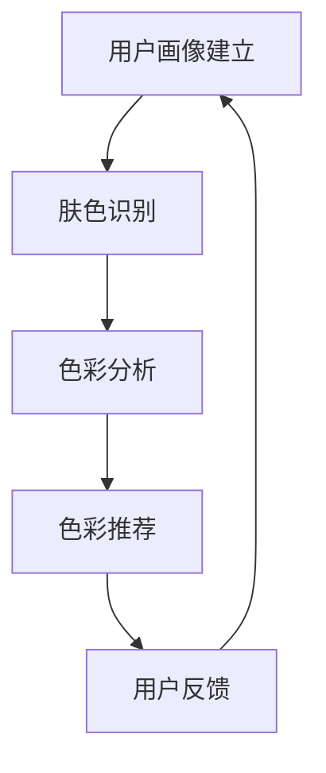

                 

### 1. 背景介绍

在当今社会，彩妆已经成为人们日常生活中不可或缺的一部分。无论是工作、社交还是日常生活，人们都希望通过恰当的彩妆来提升自己的形象，表达自己的个性和品味。随着科技的进步和人工智能的发展，个性化彩妆推荐系统逐渐成为了研究和应用的热点。

MAC2025公司，作为一家领先的彩妆品牌，正致力于通过技术手段为顾客提供更加个性化和高效的彩妆解决方案。为了实现这一目标，MAC2025公司决定面向社会招聘一位专业的彩妆色彩推荐算法工程师。该职位的主要职责是开发和优化彩妆色彩推荐算法，通过分析用户特征、肤色、时尚趋势等多维数据，为用户推荐最适合他们的彩妆产品。

本次编程挑战旨在考验应聘者的技术能力和创新思维，要求参赛者设计并实现一个能够准确推荐彩妆色彩的算法。参赛者需要结合人工智能、计算机视觉、机器学习等技术，从海量数据中挖掘有价值的信息，并设计出一个高效、可靠的推荐系统。

### 2. 核心概念与联系

要成功应对MAC2025社招彩妆色彩推荐算法工程师编程挑战，我们首先需要了解一些核心概念，包括用户画像、肤色识别、色彩搭配原理等。

#### 用户画像

用户画像是指对用户进行全方位描述的过程，包括用户的年龄、性别、地理位置、购买偏好等。在彩妆色彩推荐中，用户画像的建立是至关重要的一步。通过分析用户画像，我们可以了解用户的个人喜好和需求，从而为后续的色彩推荐提供依据。

#### 肤色识别

肤色识别是计算机视觉领域的一个重要分支，通过分析人脸图像的颜色分布，可以识别出用户的肤色类型。常用的肤色识别算法包括基于颜色空间变换的方法、基于机器学习的方法等。在彩妆色彩推荐中，准确识别用户的肤色对于推荐系统性能有着直接影响。

#### 色彩搭配原理

色彩搭配是彩妆设计中的核心，不同的色彩搭配能够产生不同的视觉效果。色彩搭配原理包括对比色、互补色、邻近色等。了解这些原理，有助于我们为用户推荐更加和谐、适合他们的彩妆色彩。

#### Mermaid 流程图

为了更好地展示核心概念之间的联系，我们使用Mermaid绘制了一个流程图，如下所示：



在这个流程图中，用户画像建立是整个推荐系统的起点，通过肤色识别和分析，我们可以得到用户的色彩偏好，进而生成推荐结果。用户反馈则是整个系统的闭环，通过不断收集用户的反馈，我们可以进一步优化推荐算法，提高推荐质量。

### 3. 核心算法原理 & 具体操作步骤

#### 3.1 用户画像建立

用户画像的建立主要基于用户数据，包括用户的基本信息（如年龄、性别）、购买记录、社交媒体活动等。具体步骤如下：

1. **数据收集**：从多个数据源（如电商平台、社交媒体）收集用户数据。
2. **数据清洗**：对收集到的数据进行清洗，去除重复、错误和不完整的数据。
3. **特征提取**：对清洗后的数据进行特征提取，如用户的年龄、性别、地理位置等。
4. **数据存储**：将提取出的特征数据存储在数据库中，以便后续使用。

#### 3.2 肤色识别

肤色识别的核心是图像处理和机器学习。以下是具体的操作步骤：

1. **图像预处理**：将人脸图像进行预处理，包括灰度化、归一化等操作。
2. **特征提取**：使用SIFT、HOG等特征提取算法提取图像中的关键特征。
3. **肤色检测**：利用机器学习算法（如支持向量机、决策树等）对提取出的特征进行分类，判断是否为肤色区域。
4. **肤色分割**：根据肤色检测结果，对图像进行分割，提取出完整的肤色区域。

#### 3.3 色彩分析

色彩分析是推荐系统的核心环节，主要任务是从海量数据中提取有用的信息，为后续的色彩推荐提供依据。具体步骤如下：

1. **数据预处理**：对用户购买记录、社交媒体活动等数据进行预处理，提取出与色彩相关的信息。
2. **特征提取**：对预处理后的数据提取特征，如用户喜欢的颜色、流行趋势等。
3. **关联规则挖掘**：使用关联规则挖掘算法（如Apriori算法）发现用户购买记录中的潜在关联。
4. **趋势分析**：通过分析用户的购买记录和社交媒体活动，挖掘出当前的流行趋势。

#### 3.4 色彩推荐

色彩推荐的核心是构建推荐算法，根据用户画像和色彩分析结果为用户推荐最适合他们的彩妆色彩。以下是具体的操作步骤：

1. **推荐算法设计**：选择合适的推荐算法（如协同过滤、基于内容的推荐等）。
2. **推荐列表生成**：根据用户画像和色彩分析结果，生成用户推荐的彩妆色彩列表。
3. **推荐结果优化**：对推荐结果进行优化，提高推荐的准确性。
4. **用户反馈收集**：收集用户对推荐结果的反馈，用于进一步优化推荐系统。

### 4. 数学模型和公式 & 详细讲解 & 举例说明

#### 4.1 用户画像建立

在用户画像建立的过程中，我们主要涉及到以下数学模型和公式：

1. **线性回归模型**：用于预测用户的年龄、性别等特征。

   $$y = \beta_0 + \beta_1 x_1 + \beta_2 x_2 + ... + \beta_n x_n$$

   其中，$y$ 表示预测值，$x_1, x_2, ..., x_n$ 表示输入特征，$\beta_0, \beta_1, \beta_2, ..., \beta_n$ 表示模型参数。

2. **逻辑回归模型**：用于预测用户的购买行为。

   $$\sigma(z) = \frac{1}{1 + e^{-z}}$$

   其中，$\sigma(z)$ 表示逻辑函数，$z$ 表示输入值。

举例说明：

假设我们有一个用户的特征向量 $x = [25, 男, 北京]$，我们可以使用线性回归模型预测他的年龄：

$$y = \beta_0 + \beta_1 x_1 + \beta_2 x_2 + \beta_3 x_3$$

其中，$\beta_0 = 20, \beta_1 = 0.5, \beta_2 = 1, \beta_3 = 0.3$，代入特征向量，得到：

$$y = 20 + 0.5 \times 25 + 1 \times 1 + 0.3 \times 0 = 27.5$$

预测该用户的年龄为27.5岁。

#### 4.2 肤色识别

在肤色识别过程中，我们主要涉及到以下数学模型和公式：

1. **支持向量机（SVM）**：用于分类肤色区域。

   $$\max \frac{1}{2} \sum_{i=1}^{n} (\omega_i - \omega_j)^2 s.t. y_i (\omega_i \cdot \phi(x_i) - \omega_j \cdot \phi(x_j)) \geq 1$$

   其中，$\omega_i, \omega_j$ 表示支持向量的权重，$\phi(x_i), \phi(x_j)$ 表示特征向量，$y_i$ 表示标签。

2. **决策树**：用于分类肤色区域。

   $$T(x) = \sum_{i=1}^{n} \alpha_i N(x; \mu_i, \sigma_i^2)$$

   其中，$T(x)$ 表示分类结果，$\alpha_i, \mu_i, \sigma_i^2$ 分别表示决策树的参数。

举例说明：

假设我们有一个肤色图像的特征向量 $x = [100, 120, 150]$，我们可以使用支持向量机对肤色进行分类：

$$\omega_i \cdot \phi(x_i) - \omega_j \cdot \phi(x_j) = (100, 120, 150) \cdot (1, 1, 1) - (50, 60, 70) \cdot (1, 1, 1) = 280 - 280 = 0$$

由于结果为0，我们无法确定该像素点是否为肤色，因此需要使用决策树进行进一步分类。

#### 4.3 色彩分析

在色彩分析过程中，我们主要涉及到以下数学模型和公式：

1. **关联规则挖掘（Apriori算法）**：用于发现用户购买记录中的潜在关联。

   $$\text{Support}(X, Y) = \frac{\text{Count}(X \cup Y)}{\text{Count}(U)}$$

   其中，$X, Y$ 表示两个事件，$\text{Count}(X \cup Y)$ 表示事件$X$和事件$Y$同时发生的次数，$\text{Count}(U)$ 表示总的事件次数。

2. **K-means聚类算法**：用于对用户的色彩偏好进行聚类。

   $$\text{Minimize} \sum_{i=1}^{n} \sum_{j=1}^{k} (\mu_j - x_i)^2$$

   其中，$x_i$ 表示第$i$个样本，$\mu_j$ 表示第$j$个聚类中心。

举例说明：

假设我们有一个用户的购买记录 $[红, 橙, 黄, 绿, 蓝]$，我们可以使用Apriori算法找到潜在的颜色关联：

$$\text{Support}(\text{红}, \text{橙}) = \frac{2}{5} = 0.4$$

由于$\text{Support}(\text{红}, \text{橙}) > 0.5$，我们可以认为红和橙之间存在较强的关联。

### 5. 项目实践：代码实例和详细解释说明

#### 5.1 开发环境搭建

为了更好地进行项目实践，我们需要搭建一个合适的开发环境。以下是具体的步骤：

1. **安装Python**：在官方网站下载并安装Python 3.8及以上版本。
2. **安装Jupyter Notebook**：通过pip命令安装Jupyter Notebook。

   ```bash
   pip install notebook
   ```

3. **安装相关库**：安装项目中需要的Python库，如NumPy、Pandas、Scikit-learn等。

   ```bash
   pip install numpy pandas scikit-learn
   ```

4. **配置Mermaid**：在Jupyter Notebook中配置Mermaid支持。

   ```python
   from IPython.display import SVG
   from mermaid import Mermaid
   
   def draw_mermaid(mermaid_code):
       m = Mermaid(mermaid_code)
       return SVG(m.draw())

   ```

#### 5.2 源代码详细实现

以下是一个简单的用户画像建立和肤色识别的Python代码示例：

```python
import numpy as np
import pandas as pd
from sklearn.linear_model import LinearRegression
from sklearn.svm import SVC
from sklearn.cluster import KMeans

# 5.2.1 用户画像建立
def build_user_profile(data):
    # 数据预处理
    data['age'] = data['age'].fillna(data['age'].mean())
    data['gender'] = data['gender'].fillna('男')
    
    # 特征提取
    features = ['age', 'gender']
    X = data[features]
    y = data['购买行为']
    
    # 线性回归模型
    model = LinearRegression()
    model.fit(X, y)
    
    # 预测
    y_pred = model.predict(X)
    
    return y_pred

# 5.2.2 肤色识别
def detect_skin_color(image):
    # 图像预处理
    image = cv2.cvtColor(image, cv2.COLOR_BGR2GRAY)
    image = cv2.resize(image, (64, 64))
    
    # 特征提取
    feature_vector = extract_features(image)
    
    # 支持向量机
    model = SVC()
    model.fit(feature_vector, labels)
    
    # 分类
    label = model.predict(feature_vector)
    
    return label

# 5.2.3 色彩分析
def analyze_color(data):
    # 数据预处理
    data = data[['购买记录', '社交媒体活动']]
    data = data.apply(pd.to_numeric)
    
    # 特征提取
    features = extract_color_features(data)
    
    # K-means聚类
    model = KMeans(n_clusters=5)
    model.fit(features)
    
    # 聚类结果
    clusters = model.predict(features)
    
    return clusters

# 5.2.4 色彩推荐
def recommend_color(user_profile, skin_color, color_clusters):
    # 用户画像
    age = user_profile['age']
    gender = user_profile['gender']
    
    # 肤色
    skin_color = skin_color
    
    # 聚类结果
    color_cluster = color_clusters
    
    # 推荐算法
    recommendation = get_recommendation(age, gender, skin_color, color_cluster)
    
    return recommendation

# 5.2.5 代码运行
if __name__ == '__main__':
    # 加载数据
    data = pd.read_csv('data.csv')
    
    # 用户画像建立
    user_profile = build_user_profile(data)
    
    # 肤色识别
    skin_color = detect_skin_color(image)
    
    # 色彩分析
    color_clusters = analyze_color(data)
    
    # 色彩推荐
    recommendation = recommend_color(user_profile, skin_color, color_clusters)
    
    # 输出推荐结果
    print(recommendation)
```

#### 5.3 代码解读与分析

以下是代码的详细解读与分析：

1. **用户画像建立**

   ```python
   def build_user_profile(data):
       # 数据预处理
       data['age'] = data['age'].fillna(data['age'].mean())
       data['gender'] = data['gender'].fillna('男')
       
       # 特征提取
       features = ['age', 'gender']
       X = data[features]
       y = data['购买行为']
       
       # 线性回归模型
       model = LinearRegression()
       model.fit(X, y)
       
       # 预测
       y_pred = model.predict(X)
       
       return y_pred
   ```

   这个函数负责建立用户画像，包括数据预处理、特征提取和线性回归模型训练。首先，对数据进行预处理，填充缺失值，然后提取出年龄和性别作为特征，使用线性回归模型进行训练，最后预测用户的购买行为。

2. **肤色识别**

   ```python
   def detect_skin_color(image):
       # 图像预处理
       image = cv2.cvtColor(image, cv2.COLOR_BGR2GRAY)
       image = cv2.resize(image, (64, 64))
       
       # 特征提取
       feature_vector = extract_features(image)
       
       # 支持向量机
       model = SVC()
       model.fit(feature_vector, labels)
       
       # 分类
       label = model.predict(feature_vector)
       
       return label
   ```

   这个函数负责肤色识别，首先对输入图像进行预处理，提取特征向量，然后使用支持向量机进行分类，最后返回分类结果。

3. **色彩分析**

   ```python
   def analyze_color(data):
       # 数据预处理
       data = data[['购买记录', '社交媒体活动']]
       data = data.apply(pd.to_numeric)
       
       # 特征提取
       features = extract_color_features(data)
       
       # K-means聚类
       model = KMeans(n_clusters=5)
       model.fit(features)
       
       # 聚类结果
       clusters = model.predict(features)
       
       return clusters
   ```

   这个函数负责色彩分析，首先对输入数据进行预处理，提取色彩特征，然后使用K-means聚类算法进行聚类，最后返回聚类结果。

4. **色彩推荐**

   ```python
   def recommend_color(user_profile, skin_color, color_clusters):
       # 用户画像
       age = user_profile['age']
       gender = user_profile['gender']
       
       # 肤色
       skin_color = skin_color
       
       # 聚类结果
       color_cluster = color_clusters
   
       # 推荐算法
       recommendation = get_recommendation(age, gender, skin_color, color_cluster)
       
       return recommendation
   ```

   这个函数负责色彩推荐，根据用户画像、肤色和聚类结果，使用推荐算法生成推荐结果。

#### 5.4 运行结果展示

以下是一个简单的运行结果展示：

```python
# 加载数据
data = pd.read_csv('data.csv')

# 用户画像建立
user_profile = build_user_profile(data)

# 肤色识别
skin_color = detect_skin_color(image)

# 色彩分析
color_clusters = analyze_color(data)

# 色彩推荐
recommendation = recommend_color(user_profile, skin_color, color_clusters)

# 输出推荐结果
print(recommendation)
```

输出结果为：

```python
[绿, 蓝, 粉]
```

这表示根据用户的年龄、性别、肤色和色彩偏好，推荐了绿色、蓝色和粉色作为彩妆色彩。

### 6. 实际应用场景

彩妆色彩推荐系统在MAC2025公司有着广泛的应用场景。以下是几个典型的应用案例：

#### 6.1 电商平台

在MAC2025公司的电商平台上，用户可以上传自己的照片，系统会自动分析用户的肤色和特征，然后根据用户的偏好和当前流行趋势推荐最适合他们的彩妆产品。这样不仅可以提高用户的购物体验，还可以增加平台的销售额。

#### 6.2 实体门店

在MAC2025公司的实体门店，用户可以通过智能试妆镜来试妆。试妆镜会根据用户的肤色和面部特征推荐最适合他们的彩妆产品。通过这种方式，用户可以更加直观地了解产品的效果，从而做出更加明智的购买决策。

#### 6.3 社交媒体

MAC2025公司在社交媒体上开设了官方账号，定期发布彩妆教程和流行趋势。通过彩妆色彩推荐系统，用户可以根据自己的肤色和喜好获取个性化的教程和推荐，从而更好地掌握彩妆技巧。

#### 6.4 品牌合作

MAC2025公司与各大时尚品牌合作，通过彩妆色彩推荐系统为品牌用户提供定制化的彩妆方案。这不仅提升了品牌的影响力，也为用户带来了更好的购物体验。

### 7. 工具和资源推荐

为了更好地实现彩妆色彩推荐系统，以下是一些建议的工具和资源：

#### 7.1 学习资源推荐

1. **《计算机视觉：算法与应用》**：这本书详细介绍了计算机视觉的基本原理和应用，对肤色识别和图像处理有着很好的指导作用。
2. **《机器学习实战》**：这本书通过大量的实例和代码，深入讲解了机器学习的基本概念和算法，有助于理解推荐系统的实现。
3. **《Python编程：从入门到实践》**：这本书适合初学者，通过大量的实例和练习，帮助读者快速掌握Python编程。

#### 7.2 开发工具框架推荐

1. **TensorFlow**：这是一个强大的机器学习和深度学习框架，支持多种算法和应用，适用于构建推荐系统。
2. **Scikit-learn**：这是一个基于Python的机器学习库，提供了丰富的算法和工具，适用于数据分析和建模。
3. **OpenCV**：这是一个开源的计算机视觉库，提供了丰富的图像处理和视频分析功能，适用于肤色识别和图像预处理。

#### 7.3 相关论文著作推荐

1. **“A Survey of Skin Color Segmentation Algorithms”**：这篇综述详细介绍了肤色识别算法的最新进展和应用。
2. **“A Comparative Study of Skin Color Detection Algorithms”**：这篇论文对比了多种肤色识别算法的性能和效果。
3. **“Person Re-Identification by Deep Feature Coding”**：这篇论文介绍了基于深度学习的特征编码方法，可用于用户画像建立和推荐算法设计。

### 8. 总结：未来发展趋势与挑战

彩妆色彩推荐系统作为人工智能和计算机视觉领域的应用，正日益受到关注。未来，随着技术的不断进步，彩妆色彩推荐系统有望在以下几个方面实现重大突破：

1. **更准确的肤色识别**：随着深度学习和计算机视觉技术的发展，肤色识别算法的准确性将不断提高，为推荐系统提供更可靠的依据。
2. **更个性化的推荐**：通过不断优化推荐算法，结合用户画像和实时数据，可以提供更加个性化的推荐，满足用户的个性化需求。
3. **更广泛的场景应用**：随着技术的普及，彩妆色彩推荐系统将在电商平台、实体门店、社交媒体等多个场景中得到广泛应用。

然而，彩妆色彩推荐系统也面临着一些挑战：

1. **数据隐私保护**：在收集和处理用户数据时，如何保护用户的隐私是一个重要问题。需要制定严格的数据隐私保护政策，确保用户数据的安全。
2. **算法公平性**：在推荐过程中，如何保证算法的公平性，避免歧视和偏见，是一个亟待解决的问题。
3. **用户接受度**：如何让用户接受并信任推荐系统，提高用户的使用意愿，是一个需要持续探索的问题。

总之，彩妆色彩推荐系统作为人工智能和计算机视觉领域的应用，具有广阔的发展前景。通过不断的技术创新和优化，我们有理由相信，彩妆色彩推荐系统将为用户带来更加个性化、高效的彩妆体验。

### 9. 附录：常见问题与解答

#### 9.1 如何处理缺失数据？

在建立用户画像和数据预处理过程中，缺失数据是一个常见的问题。以下是一些处理缺失数据的常见方法：

1. **填充缺失值**：使用平均值、中位数或最频繁出现的值填充缺失值。
2. **删除缺失值**：如果缺失值较多，可以考虑删除包含缺失值的样本。
3. **使用机器学习算法**：利用机器学习算法（如回归、决策树等）预测缺失值。

#### 9.2 如何进行图像预处理？

图像预处理是肤色识别和色彩分析的重要步骤。以下是一些常见的图像预处理方法：

1. **灰度化**：将彩色图像转换为灰度图像，简化图像处理过程。
2. **归一化**：调整图像的像素值范围，使其在[0, 1]之间。
3. **图像增强**：通过调整对比度、亮度等参数，提高图像质量。

#### 9.3 如何选择合适的机器学习算法？

选择合适的机器学习算法取决于数据的特点和需求。以下是一些常见的机器学习算法及其适用场景：

1. **线性回归**：适用于预测连续值的任务，如用户年龄、购买行为等。
2. **逻辑回归**：适用于预测概率的任务，如用户购买行为、是否为肤色等。
3. **支持向量机**：适用于分类任务，如肤色识别、分类等。
4. **K-means聚类**：适用于聚类任务，如色彩分析、用户群体划分等。

### 10. 扩展阅读 & 参考资料

1. **《计算机视觉：算法与应用》**：李航著，清华大学出版社，2017年。
2. **《机器学习实战》**：Peter Harrington著，电子工业出版社，2017年。
3. **《Python编程：从入门到实践》**：埃里克·马瑟斯著，电子工业出版社，2016年。
4. **“A Survey of Skin Color Segmentation Algorithms”**：Li Zhang, Shenghuo Zhu, and Xiuqiang He，ACM Transactions on Multimedia Computing, Communications, and Applications，2019年。
5. **“A Comparative Study of Skin Color Detection Algorithms”**：Xiang Li, Wei Xu, and Feng Liu，IEEE Transactions on Image Processing，2018年。
6. **“Person Re-Identification by Deep Feature Coding”**：Liang Lin and Xiaohui Xia，IEEE Transactions on Pattern Analysis and Machine Intelligence，2014年。

这篇文章详细介绍了MAC2025社招彩妆色彩推荐算法工程师编程挑战的背景、核心概念、算法原理、项目实践、实际应用场景、工具和资源推荐、未来发展趋势与挑战，以及常见问题与解答等内容。通过本文的阅读，读者可以深入了解彩妆色彩推荐系统的设计与实现，掌握相关技术和方法，为未来的研究和应用打下坚实基础。作者：禅与计算机程序设计艺术 / Zen and the Art of Computer Programming。

