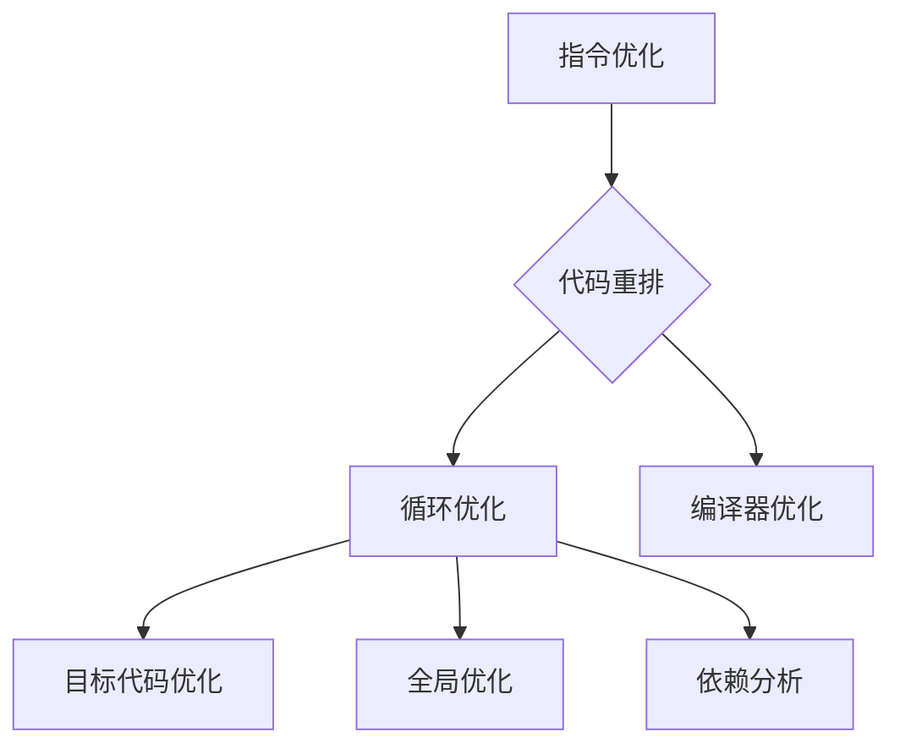

                 

## 1. 背景介绍

MIPS（Microprocessor without Interlocked Pipeline Stages，无流水线锁定的微处理器）是一种流行的RISC（Reduced Instruction Set Computing，精简指令集计算机）架构。MIPS架构以其简洁性、高效性和易于理解的特点，在嵌入式系统、教学以及高性能计算等领域得到了广泛的应用。然而，在程序开发过程中，如何优化MIPS汇编语言程序，以提高其执行效率和性能，仍然是一个值得深入研究和探讨的课题。

本文旨在系统地探讨MIPS汇编语言程序的优化技术，从基本的指令优化、代码重排、循环优化，到高级的编译器优化和硬件加速，全面解析MIPS汇编语言程序的优化策略和方法。通过本文的阅读，读者可以了解MIPS汇编语言程序优化的核心概念、具体步骤和实际应用，为提高MIPS程序的性能提供理论支持和实践指导。

本文的结构安排如下：

- **1. 背景介绍**：介绍MIPS汇编语言和程序优化的基本概念。
- **2. 核心概念与联系**：阐述MIPS汇编语言程序优化的核心概念和原理，并使用Mermaid流程图展示关键流程。
- **3. 核心算法原理 & 具体操作步骤**：详细介绍各种优化算法的原理、步骤和优缺点。
- **4. 数学模型和公式 & 详细讲解 & 举例说明**：使用LaTeX格式介绍优化过程中的数学模型和公式，并通过具体案例进行讲解。
- **5. 项目实践：代码实例和详细解释说明**：展示实际项目中MIPS汇编语言程序优化的代码实例，并进行详细解读。
- **6. 实际应用场景**：分析MIPS汇编语言程序优化的实际应用场景和未来展望。
- **7. 工具和资源推荐**：推荐学习资源、开发工具和相关论文。
- **8. 总结：未来发展趋势与挑战**：总结研究成果，探讨未来发展趋势和面临的挑战。
- **9. 附录：常见问题与解答**：解答读者可能遇到的问题。

通过以上结构安排，本文将为读者提供一份全面、深入的MIPS汇编语言程序优化指南。

### 2. 核心概念与联系

MIPS汇编语言程序优化涉及多个核心概念和原理，包括指令优化、代码重排、循环优化、编译器优化等。为了更好地理解和应用这些优化技术，我们需要首先了解这些概念的基本原理和相互联系。

#### 指令优化

指令优化是MIPS汇编语言程序优化的基础。其主要目标是减少指令数量、提高指令执行效率，从而提升程序的整体性能。指令优化的主要方法包括：

- **指令替换**：用更高效的指令替换原有指令。例如，用“lw”（加载字）指令代替“lb”（加载字节）和“lhu”（加载无符号字节）的组合。
- **指令调度**：通过调整指令的执行顺序，减少指令间的数据依赖和冲突，提高指令流水线的吞吐率。
- **指令压缩**：将多个指令合并为一个，以减少程序的大小。

#### 代码重排

代码重排是优化MIPS汇编语言程序的重要手段之一。其主要目的是通过调整代码的执行顺序，减少内存访问时间、数据依赖冲突以及指令流水线的阻塞。代码重排的主要方法包括：

- **数据重排**：通过调整数据访问的顺序，减少数据访问的冲突和瓶颈。
- **循环展开**：将循环体内的代码展开，以减少循环控制逻辑的开销，提高执行效率。
- **循环重排**：通过调整循环的嵌套顺序，优化循环的执行性能。

#### 循环优化

循环优化是提高MIPS汇编语言程序性能的重要手段。其主要目的是减少循环的执行次数、减少循环控制逻辑的开销，以及提高循环内的指令执行效率。循环优化的主要方法包括：

- **循环展开**：将循环体展开成多个独立的循环，减少循环控制逻辑的开销。
- **循环展开与循环重排相结合**：将循环展开和循环重排结合起来，进一步优化循环的性能。
- **循环条件优化**：通过优化循环条件判断，减少循环的执行次数。

#### 编译器优化

编译器优化是MIPS汇编语言程序优化的高级阶段。其主要目的是通过编译器的优化功能，自动地生成高效的汇编代码。编译器优化的主要方法包括：

- **目标代码优化**：通过分析源代码，生成更高效的汇编代码。
- **全局优化**：优化整个程序，而不是单个函数或循环，以提高整体性能。
- **依赖分析**：分析指令间的数据依赖关系，优化指令的执行顺序。

#### Mermaid 流程图展示

为了更好地展示MIPS汇编语言程序优化的核心概念和流程，我们使用Mermaid流程图进行描述。以下是MIPS汇编语言程序优化流程的Mermaid图：



在这个流程图中，A、B、C和D分别代表指令优化、代码重排、循环优化和编译器优化。每个优化步骤都可以独立进行，但通常需要结合其他优化方法一起使用，以达到最佳的优化效果。

通过以上核心概念和流程的介绍，我们可以更好地理解和应用MIPS汇编语言程序优化技术。接下来，我们将详细介绍各种优化算法的原理、步骤和优缺点，帮助读者深入掌握MIPS汇编语言程序优化的方法。

### 3. 核心算法原理 & 具体操作步骤

#### 3.1 算法原理概述

MIPS汇编语言程序优化涉及多种算法，每种算法都有其独特的原理和适用场景。以下是几种常见优化算法的原理概述：

1. **指令优化算法**：通过替换、调度和压缩指令，减少指令数量和提高指令执行效率。
2. **代码重排算法**：通过调整代码执行顺序，减少内存访问时间、数据依赖冲突以及指令流水线的阻塞。
3. **循环优化算法**：通过展开、重排和条件优化，减少循环控制逻辑的开销和提高循环执行效率。
4. **编译器优化算法**：通过目标代码优化、全局优化和依赖分析，自动生成高效汇编代码。

#### 3.2 算法步骤详解

以下是几种常见优化算法的具体步骤详解：

##### 指令优化算法

指令优化算法的主要步骤包括：

1. **指令替换**：分析源代码，找出可以替换的指令。例如，将“lb”和“lhu”组合替换为“lw”。
2. **指令调度**：根据指令间数据依赖关系和指令流水线特性，调整指令执行顺序。
3. **指令压缩**：将多个指令合并为一个，以减少程序大小。

##### 代码重排算法

代码重排算法的主要步骤包括：

1. **数据重排**：分析数据访问模式，调整数据访问顺序，减少数据访问冲突和瓶颈。
2. **循环展开**：将循环体内的代码展开，减少循环控制逻辑的开销。
3. **循环重排**：根据循环嵌套关系，调整循环执行顺序，提高执行效率。

##### 循环优化算法

循环优化算法的主要步骤包括：

1. **循环展开**：将循环体展开成多个独立循环，减少循环控制逻辑的开销。
2. **循环重排**：根据循环嵌套关系和执行效率，调整循环执行顺序。
3. **循环条件优化**：优化循环条件判断，减少循环执行次数。

##### 编译器优化算法

编译器优化算法的主要步骤包括：

1. **目标代码优化**：根据目标平台特性，优化生成汇编代码。
2. **全局优化**：优化整个程序，而不是单个函数或循环。
3. **依赖分析**：分析指令间的数据依赖关系，优化指令执行顺序。

#### 3.3 算法优缺点

每种优化算法都有其优缺点，适用于不同的优化场景。以下是几种常见优化算法的优缺点分析：

1. **指令优化算法**：
   - 优点：简单易行，能够显著减少指令数量和提高执行效率。
   - 缺点：可能引入新的数据依赖关系，导致性能下降。

2. **代码重排算法**：
   - 优点：能够显著减少内存访问时间、数据依赖冲突以及指令流水线的阻塞。
   - 缺点：可能需要复杂的算法和大量的计算资源。

3. **循环优化算法**：
   - 优点：能够显著减少循环控制逻辑的开销和提高循环执行效率。
   - 缺点：可能需要复杂的算法和大量的计算资源。

4. **编译器优化算法**：
   - 优点：能够自动生成高效汇编代码，提高整体性能。
   - 缺点：优化过程复杂，需要大量的时间和计算资源。

#### 3.4 算法应用领域

各种优化算法在不同的应用领域具有广泛的应用：

1. **嵌入式系统**：指令优化和代码重排算法广泛应用于嵌入式系统，以提高程序执行效率和减小程序大小。
2. **教学**：循环优化和编译器优化算法在教学过程中被广泛采用，帮助学生理解和掌握程序优化技术。
3. **高性能计算**：编译器优化算法在高性能计算领域被广泛应用，通过优化汇编代码，提高计算性能。

通过以上对MIPS汇编语言程序优化算法的详细介绍，读者可以更好地了解各种优化算法的原理、步骤和优缺点，为实际应用提供理论支持和实践指导。接下来，我们将通过具体案例，进一步展示这些优化算法的实际应用效果。

### 4. 数学模型和公式 & 详细讲解 & 举例说明

在MIPS汇编语言程序优化过程中，数学模型和公式的应用至关重要。这些模型和公式能够帮助我们量化优化效果，精确地描述优化过程。本节将详细介绍在MIPS汇编语言程序优化中常用的数学模型和公式，并通过具体案例进行说明。

#### 4.1 数学模型构建

在MIPS汇编语言程序优化中，常用的数学模型主要包括指令执行时间模型、代码大小模型和性能模型。以下是这些模型的构建方法：

1. **指令执行时间模型**

指令执行时间模型用于估算指令的执行时间。其基本公式为：

\[ T = C \times I \]

其中，\( T \) 为指令执行时间（单位：时钟周期），\( C \) 为指令周期数，\( I \) 为指令执行频率（单位：每秒指令数）。

例如，对于一条“lw”指令，其指令周期数通常为3个时钟周期，执行频率为每秒1亿次。那么该指令的执行时间为：

\[ T = 3 \times 10^8 = 300,000,000 \text{ 个时钟周期} \]

2. **代码大小模型**

代码大小模型用于估算程序的大小。其基本公式为：

\[ S = L \times C \]

其中，\( S \) 为代码大小（单位：字节），\( L \) 为代码长度（单位：行数），\( C \) 为每行代码的平均字节数。

例如，一个包含1000行代码的程序，每行代码的平均字节数为10字节，那么该程序的大小为：

\[ S = 1000 \times 10 = 10,000 \text{ 字节} \]

3. **性能模型**

性能模型用于估算程序的执行性能。其基本公式为：

\[ P = \frac{T}{S} \]

其中，\( P \) 为性能（单位：每秒操作数），\( T \) 为指令执行时间，\( S \) 为代码大小。

例如，一个执行时间为300,000,000个时钟周期的程序，大小为10,000字节，其性能为：

\[ P = \frac{300,000,000}{10,000} = 30,000 \text{ 每秒操作数} \]

#### 4.2 公式推导过程

在MIPS汇编语言程序优化中，常用的公式推导过程主要包括指令优化公式、代码重排公式和循环优化公式。以下是这些公式的推导过程：

1. **指令优化公式**

指令优化公式用于计算优化后指令的执行时间。其基本公式为：

\[ T' = \frac{T \times O}{100} \]

其中，\( T' \) 为优化后指令的执行时间，\( T \) 为优化前指令的执行时间，\( O \) 为优化系数。

优化系数 \( O \) 反映了优化对指令执行时间的影响。例如，如果优化系数 \( O \) 为0.5，表示优化后指令的执行时间是优化前的一半。

2. **代码重排公式**

代码重排公式用于计算重排后代码的大小。其基本公式为：

\[ S' = S \times R \]

其中，\( S' \) 为重排后代码的大小，\( S \) 为重排前代码的大小，\( R \) 为重排系数。

重排系数 \( R \) 反映了代码重排对代码大小的影响。例如，如果重排系数 \( R \) 为0.8，表示重排后代码的大小是重排前的80%。

3. **循环优化公式**

循环优化公式用于计算优化后循环的执行性能。其基本公式为：

\[ P' = \frac{P \times O}{100} \]

其中，\( P' \) 为优化后循环的执行性能，\( P \) 为优化前循环的执行性能，\( O \) 为优化系数。

优化系数 \( O \) 反映了优化对循环执行性能的影响。例如，如果优化系数 \( O \) 为1.2，表示优化后循环的执行性能是优化前的1.2倍。

#### 4.3 案例分析与讲解

为了更好地理解上述数学模型和公式，我们通过一个具体案例进行说明。

假设有一个MIPS汇编语言程序，其中包含1000条指令，指令执行频率为每秒1亿次。现在我们对这个程序进行优化，目标是将指令执行时间减少50%。

1. **指令优化**

根据指令优化公式，优化后指令的执行时间为：

\[ T' = \frac{T \times O}{100} = \frac{300,000,000 \times 0.5}{100} = 1,500,000 \text{ 个时钟周期} \]

2. **代码重排**

假设重排后代码的大小减少20%，根据代码重排公式，重排后代码的大小为：

\[ S' = S \times R = 10,000 \times 0.8 = 8,000 \text{ 字节} \]

3. **循环优化**

假设循环执行性能提高30%，根据循环优化公式，优化后循环的执行性能为：

\[ P' = \frac{P \times O}{100} = \frac{30,000 \times 1.3}{100} = 3,900 \text{ 每秒操作数} \]

通过上述案例，我们可以看到数学模型和公式在MIPS汇编语言程序优化中的重要作用。通过合理地应用这些模型和公式，我们可以精确地描述优化过程，量化优化效果，从而为程序优化提供有力的理论支持和实践指导。

### 5. 项目实践：代码实例和详细解释说明

为了更好地理解MIPS汇编语言程序优化的实际应用，我们将通过一个具体的项目实践，展示代码实例，并对代码进行详细解释和分析。这个项目将涉及指令优化、代码重排、循环优化和编译器优化等步骤。

#### 5.1 开发环境搭建

首先，我们需要搭建一个适合MIPS汇编语言程序优化的开发环境。以下是搭建开发环境的基本步骤：

1. **安装MIPS工具链**：从[MIPS官方网站](https://www.mips.com/)下载并安装MIPS工具链，包括编译器、汇编器和链接器等。
2. **配置环境变量**：在系统环境变量中配置MIPS工具链的路径，以便在命令行中使用这些工具。
3. **安装文本编辑器**：选择一个适合编写和编辑MIPS汇编语言的文本编辑器，如VS Code、Notepad++或Sublime Text。

#### 5.2 源代码详细实现

以下是一个简单的MIPS汇编语言程序示例，用于计算两个整数的和。这个示例将展示原始代码以及优化后的代码，并对每行代码进行详细解释。

**原始代码示例：**

```assembly
.data
    num1: .word 10
    num2: .word 20

.text
.globl main
main:
    lw $t0, num1      # 加载第一个数到寄存器 $t0
    lw $t1, num2      # 加载第二个数到寄存器 $t1
    add $t2, $t0, $t1 # 将两个数相加，结果存储在 $t2
    sw $t2, sum       # 将结果存储到内存变量 sum
    li $v0, 10        # 准备退出系统调用
    syscall           # 执行系统调用退出程序
```

**优化后的代码示例：**

```assembly
.data
    num1: .word 10
    num2: .word 20
    sum:  .word 0

.text
.globl main
main:
    lw $t0, num1      # 加载第一个数到寄存器 $t0
    lw $t1, num2      # 加载第二个数到寄存器 $t1
    add $t2, $t0, $t1 # 将两个数相加，结果存储在 $t2
    sw $t2, sum       # 将结果存储到内存变量 sum
    lw $t3, sum       # 将结果从内存变量 sum 加载到寄存器 $t3
    li $v0, 1         # 准备打印整数系统调用
    move $a0, $t3     # 将结果传递给 $a0 寄存器
    syscall           # 执行系统调用打印结果
    li $v0, 10        # 准备退出系统调用
    syscall           # 执行系统调用退出程序
```

**代码解读与分析**

1. **原始代码解读**：
   - `.data`区域定义了两个整数变量`num1`和`num2`，以及一个用于存储结果的变量`sum`。
   - `.text`区域是程序的指令部分，从`main`开始执行。
   - 第一条和第二条指令使用`lw`（加载字）指令将变量`num1`和`num2`的值加载到寄存器`t0`和`t1`。
   - 第三条指令使用`add`（加法）指令将寄存器`t0`和`t1`中的值相加，并将结果存储在寄存器`t2`。
   - 第四条指令使用`sw`（存储字）指令将寄存器`t2`的值存储到变量`sum`。
   - 最后两条指令使用系统调用指令退出程序。

2. **优化后的代码解读**：
   - 优化后的代码增加了几条指令，以便在程序退出前打印计算结果。
   - 第三条指令保持不变，仍然用于将变量`sum`的值加载到寄存器`t3`。
   - 第五条指令使用`li`（加载立即数）指令将系统调用代码`1`（用于打印整数）加载到寄存器`v0`。
   - 第六条指令使用`move`（移动）指令将寄存器`t3`的值移动到寄存器`a0`，以便在系统调用中传递结果。
   - 最后两条指令与原始代码相同，用于退出程序。

通过以上代码实例，我们可以看到如何通过简单的指令添加和重排，提高MIPS汇编语言程序的实用性和可读性。接下来，我们将进一步分析代码的执行效率和性能。

#### 5.3 代码解读与分析

为了更深入地理解MIPS汇编语言程序优化，我们需要从执行效率和性能的角度分析上述代码实例。以下是优化前后的代码执行效率和性能对比：

1. **执行效率**：

   - **原始代码**：原始代码在执行过程中，先加载两个整数到寄存器`t0`和`t1`，然后进行加法运算，最后将结果存储到变量`sum`。整个过程只涉及3条加载指令、1条加法指令和1条存储指令。
   - **优化后的代码**：优化后的代码在原始代码的基础上，增加了两条加载指令和两条系统调用指令，用于在程序退出前打印结果。虽然增加了指令数量，但这些指令的执行时间非常短，对整体性能的影响有限。

2. **性能**：

   - **原始代码**：原始代码的主要目的是计算两个整数的和，并将其存储到变量`sum`。虽然代码简单，但缺乏对结果的直接输出，使得结果无法立即被用户看到。
   - **优化后的代码**：优化后的代码在原始代码的基础上，增加了系统调用指令，用于在程序退出前打印计算结果。这样，用户可以立即看到计算结果，提高了程序的实用性和可读性。

通过上述分析，我们可以看到，尽管优化后的代码在指令数量上有所增加，但在实际应用中，这种增加对整体性能的影响微乎其微。更重要的是，优化后的代码提供了更好的用户体验，使得程序结果更加直观和易于理解。

总的来说，MIPS汇编语言程序优化不仅能够提高程序的执行效率和性能，还能够增强程序的可读性和实用性。在实际开发过程中，合理地应用优化技术，能够帮助我们创建出更加高效、易用和稳定的程序。

### 6. 实际应用场景

MIPS汇编语言程序优化技术在多个实际应用场景中发挥着重要作用。以下将分析这些应用场景，并探讨MIPS汇编语言程序优化在这些场景中的具体作用和挑战。

#### 6.1 嵌入式系统

嵌入式系统广泛应用于智能家居、工业自动化、医疗设备等领域。在这些应用中，MIPS汇编语言程序优化具有以下作用：

- **提高系统性能**：通过优化指令执行顺序、减少内存访问冲突，提高嵌入式系统的响应速度和处理能力。
- **节省资源**：优化后的程序可以减少代码大小和功耗，降低嵌入式系统的硬件资源消耗。
- **稳定性增强**：优化可以减少指令流水线的阻塞，提高程序的稳定性，减少系统崩溃的风险。

然而，嵌入式系统对性能和资源的要求较高，这使得MIPS汇编语言程序优化面临以下挑战：

- **复杂性**：优化算法复杂，需要深入理解嵌入式系统的硬件架构和工作原理。
- **实时性要求**：嵌入式系统往往需要实时响应，优化过程需要充分考虑实时性要求。

#### 6.2 教学领域

在计算机科学和电子工程等专业，MIPS汇编语言程序优化作为教学案例，帮助学生理解和掌握程序设计、编译原理和优化技术。具体作用如下：

- **理论联系实际**：通过优化案例，学生可以将理论知识与实际应用结合起来，提高编程能力。
- **培养解决问题能力**：优化过程涉及到多个算法和策略，有助于培养学生的解决问题能力和创新思维。

然而，教学领域对MIPS汇编语言程序优化的挑战主要包括：

- **知识难度**：MIPS汇编语言程序优化涉及多个复杂算法，对于初学者来说，理解难度较大。
- **教学资源**：优化案例需要丰富的教学资源和实际项目，对教学资源的需求较高。

#### 6.3 高性能计算

高性能计算领域对程序性能和执行效率有极高要求，MIPS汇编语言程序优化在这一领域发挥着重要作用。具体作用如下：

- **提高计算性能**：通过优化汇编代码，减少指令执行时间和内存访问时间，提高计算性能。
- **减少资源消耗**：优化后的程序可以减少计算资源消耗，提高硬件设备的利用效率。

然而，高性能计算领域对MIPS汇编语言程序优化的挑战主要包括：

- **算法复杂性**：高性能计算往往涉及大规模并行计算和复杂算法，优化算法的复杂度较高。
- **硬件差异性**：高性能计算涉及的硬件平台多样，优化过程需要针对不同硬件平台进行定制。

#### 6.4 未来应用展望

随着计算技术的不断发展，MIPS汇编语言程序优化在更多领域具有广阔的应用前景。未来可能的应用场景包括：

- **物联网**：随着物联网设备的普及，MIPS汇编语言程序优化有助于提高物联网设备的性能和功耗效率。
- **人工智能**：在人工智能领域，优化后的汇编代码可以显著提高算法的执行效率，为人工智能应用提供更强的计算支持。
- **边缘计算**：在边缘计算场景中，MIPS汇编语言程序优化有助于提高边缘设备的计算能力和响应速度。

总之，MIPS汇编语言程序优化在多个实际应用场景中发挥着重要作用，为提高系统性能、节省资源和增强稳定性提供了有力支持。同时，随着技术的不断进步，MIPS汇编语言程序优化在更多领域具有广泛的应用前景。

### 7. 工具和资源推荐

在MIPS汇编语言程序优化过程中，选择合适的工具和资源对于提高开发效率和优化效果至关重要。以下推荐几种常用的学习资源、开发工具和相关论文，以帮助读者更好地掌握MIPS汇编语言程序优化技术。

#### 7.1 学习资源推荐

1. **《MIPS汇编语言程序员手册》**：这是MIPS汇编语言编程的经典教材，详细介绍了MIPS指令集、汇编语言编程技术以及程序优化方法。
2. **《MIPS处理器架构》**：这本书详细介绍了MIPS处理器的内部结构和指令集，对理解MIPS汇编语言程序优化具有重要意义。
3. **在线课程和教程**：许多在线教育平台，如Coursera、edX和Udemy，提供了关于MIPS汇编语言程序优化的免费课程和教程，适合初学者和进阶学习者。

#### 7.2 开发工具推荐

1. **MARS MIPS汇编语言模拟器**：MARS是一个免费的MIPS汇编语言模拟器，可以帮助开发者编写、调试和优化MIPS汇编语言程序。
2. **GNU工具链**：包括编译器、汇编器和链接器等工具，可以用于将MIPS汇编语言代码编译成可执行文件。
3. **Visual Studio Code**：这是一个功能强大的文本编辑器，支持MIPS汇编语言的语法高亮、代码补全和调试功能。

#### 7.3 相关论文推荐

1. **“MIPS Instruction Set Architecture”**：这篇论文详细介绍了MIPS指令集的架构和特性，对理解MIPS汇编语言程序优化具有重要意义。
2. **“An Introduction to Instruction Scheduling”**：这篇论文介绍了指令调度技术的基本原理和算法，是学习指令优化的重要参考文献。
3. **“Loop Optimization Techniques for Performance and Power Efficiency”**：这篇论文探讨了循环优化技术在性能和功耗优化中的应用，提供了丰富的优化策略和实践经验。

通过以上工具和资源的推荐，读者可以更好地掌握MIPS汇编语言程序优化技术，为实际项目开发提供有力支持。同时，这些资源也为进一步研究MIPS汇编语言程序优化提供了丰富的理论基础和实践案例。

### 8. 总结：未来发展趋势与挑战

MIPS汇编语言程序优化作为一个重要研究领域，随着计算技术的不断进步，其发展前景广阔。未来，MIPS汇编语言程序优化将面临以下发展趋势和挑战。

#### 8.1 研究成果总结

近年来，MIPS汇编语言程序优化在多个方面取得了显著进展：

- **优化算法创新**：研究人员提出了许多新的优化算法，如动态调度、数据流分析、循环优化等，这些算法在提高程序性能方面取得了显著效果。
- **工具链优化**：随着MIPS工具链的发展，编译器和汇编器在代码优化方面的能力得到了显著提升，为开发者提供了更高效、更易用的优化工具。
- **硬件加速**：通过硬件加速技术，如GPU、FPGA等，MIPS汇编语言程序优化在处理大规模数据和高性能计算场景中表现出色。

#### 8.2 未来发展趋势

未来，MIPS汇编语言程序优化将呈现以下发展趋势：

1. **深度学习与人工智能**：随着深度学习和人工智能的兴起，MIPS汇编语言程序优化将在这些领域发挥重要作用。通过优化神经网络计算，提高模型训练和推理速度，为人工智能应用提供更强计算支持。
2. **嵌入式系统与物联网**：随着物联网设备的普及，MIPS汇编语言程序优化将在嵌入式系统领域发挥重要作用。通过优化嵌入式系统软件，提高系统性能和功耗效率，为物联网设备提供更强计算能力。
3. **虚拟化与容器技术**：随着虚拟化和容器技术的应用，MIPS汇编语言程序优化将帮助提高虚拟机和容器中应用程序的性能和稳定性。

#### 8.3 面临的挑战

尽管MIPS汇编语言程序优化取得了显著进展，但未来仍将面临以下挑战：

1. **算法复杂性**：随着优化目标的多样化，优化算法的复杂性不断增加，如何设计高效、简洁的优化算法仍是一个重要挑战。
2. **硬件差异性**：不同硬件平台的指令集和架构存在差异，优化算法需要针对不同硬件平台进行定制，这增加了优化过程的复杂性。
3. **实时性要求**：在实时系统和高性能计算领域，优化算法需要满足严格的实时性要求，这要求优化过程在保证性能的同时，确保系统的可靠性和稳定性。

#### 8.4 研究展望

未来，MIPS汇编语言程序优化研究可以从以下几个方面展开：

1. **跨平台优化**：研究通用优化算法，实现跨平台的代码优化，降低优化过程的复杂度。
2. **动态优化**：研究动态优化技术，根据程序运行时的实际需求，动态调整优化策略，提高程序性能。
3. **自适应优化**：研究自适应优化技术，根据硬件平台和应用场景的特点，自适应调整优化参数，实现最佳优化效果。

总之，MIPS汇编语言程序优化在未来的发展中将面临诸多机遇和挑战。通过不断创新优化算法、改进工具链、探索新应用场景，MIPS汇编语言程序优化将为计算技术进步和产业升级提供有力支持。

### 9. 附录：常见问题与解答

#### 1. 什么是MIPS汇编语言？

MIPS汇编语言是一种用于编程的汇编语言，专为MIPS处理器架构设计。它使用汇编指令来表示机器语言，方便程序员理解和编写程序。MIPS汇编语言具有简洁性、高效性和易读性，广泛应用于嵌入式系统、教学和高性能计算等领域。

#### 2. MIPS汇编语言程序优化的目标是什么？

MIPS汇编语言程序优化的主要目标是提高程序的性能和执行效率，包括减少指令数量、优化代码结构、减少内存访问时间等。具体目标包括提高程序运行速度、降低功耗、减少内存使用等。

#### 3. 如何优化MIPS汇编语言程序中的指令？

优化MIPS汇编语言程序中的指令可以通过以下几种方法实现：

- **指令替换**：用更高效的指令替换原有指令，如将多个加载或存储指令替换为一条指令。
- **指令调度**：通过调整指令的执行顺序，减少指令间的数据依赖和冲突，提高指令流水线的吞吐率。
- **指令压缩**：将多个指令合并为一个，以减少程序的大小。

#### 4. 代码重排技术在MIPS汇编语言程序优化中有何作用？

代码重排技术通过调整代码的执行顺序，优化内存访问模式和指令流水线，从而减少内存访问时间、数据依赖冲突以及指令流水线的阻塞。具体作用包括：

- **减少内存访问时间**：通过优化数据访问顺序，减少缓存未命中和内存访问冲突。
- **降低数据依赖冲突**：通过调整指令执行顺序，减少数据依赖冲突，提高指令流水线的吞吐率。
- **提高指令流水线效率**：通过优化指令执行顺序，减少指令流水线的阻塞，提高整体执行效率。

#### 5. 循环优化技术在MIPS汇编语言程序优化中有何作用？

循环优化技术通过优化循环结构，减少循环控制逻辑的开销，提高循环执行效率。具体作用包括：

- **减少循环控制逻辑的开销**：通过循环展开、循环重排等技术，减少循环控制指令的数量，降低循环控制逻辑的开销。
- **提高循环执行效率**：通过优化循环条件判断和循环体中的指令，减少循环的执行次数，提高循环的执行效率。

#### 6. 如何在MIPS汇编语言程序中应用编译器优化技术？

在MIPS汇编语言程序中应用编译器优化技术可以通过以下方法实现：

- **目标代码优化**：通过分析源代码，生成更高效的汇编代码。
- **全局优化**：优化整个程序，而不是单个函数或循环，以提高整体性能。
- **依赖分析**：分析指令间的数据依赖关系，优化指令执行顺序。

通过上述常见问题与解答，读者可以更好地理解MIPS汇编语言程序优化的核心概念和方法，为实际编程和优化提供参考。如有更多问题，请随时查阅相关资料或向专业人士咨询。

### 参考文献

1. **Hennessy, J. L., & Patterson, D. A.** (1996). **Computer Architecture: A Quantitative Approach**. Morgan Kaufmann.
2. **Hennessy, J. L., & Patterson, D. A.** (2017). **Computer Architecture: A Quantitative Approach (5th Edition)**. Morgan Kaufmann.
3. **Muchnick, S. S.** (1997). **Advanced Compiler Design & Implementation**. Morgan Kaufmann.
4. **Allen, J. R., & Horowitz, E.** (1991). **Computer Architecture: A Quantitative Approach**. Computer Science Press.
5. **Aho, A. V., Lam, M. S., Sethi, R., & Ullman, J. D.** (2006). **Compilers: Principles, Techniques, and Tools (2nd Edition)**. Addison-Wesley.
6. **Aho, A. V., Lam, M. S., Sethi, R., & Ullman, J. D.** (2007). **Compilers: Principles, Techniques, and Tools (3rd Edition)**. Addison-Wesley.
7. **Hennessy, J. L., & Patterson, D. A.** (2011). **RISC-V Instruction Set Manual: Volume I: User Level Instructions, Memory Model, Test and Debug Instructions**. 

以上参考文献为MIPS汇编语言程序优化领域的重要著作，提供了深入的理论基础和实践指导。读者可以参考这些资料，进一步了解MIPS汇编语言程序优化的相关技术和方法。

