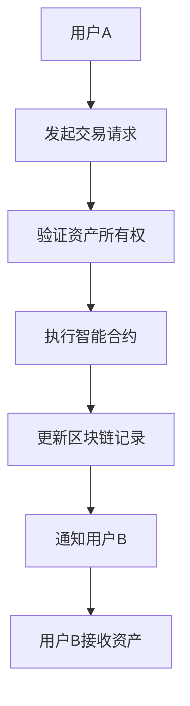

                 

关键词：NFT、游戏资产、互操作性、区块链、智能合约、游戏经济、元宇宙、去中心化、虚拟资产

> 摘要：随着区块链技术的不断发展和NFT（非同质化代币）的普及，游戏行业正在迎来一场革命。本文将探讨如何构建一个NFT游戏资产互操作平台，实现不同游戏间的虚拟资产交换和流通，从而推动游戏经济的创新和发展。

## 1. 背景介绍

### 1.1 区块链与NFT的兴起

区块链技术作为分布式账本的一种形式，自2008年比特币的诞生以来，已经经历了数十年的发展。区块链的去中心化特性、数据不可篡改的特点，使其在金融、供应链管理、版权保护等多个领域得到了广泛应用。随着区块链技术的不断成熟，NFT作为一种基于区块链的特殊代币，也逐渐进入人们的视野。

NFT是非同质化代币的缩写，代表着独一无二的数字资产。与普通的数字货币如比特币、以太坊等不同，NFT具有独特性，每一个NFT都代表一个不可分割的资产，比如数字艺术品、游戏物品、虚拟土地等。NFT的出现，为数字资产的认证和交易提供了全新的解决方案。

### 1.2 游戏资产的价值与问题

在传统游戏中，虚拟资产通常是封闭的，只能在特定的游戏环境中使用，导致其价值受到限制。例如，一个在游戏中获得的装备或角色，通常只能在同一个游戏平台上使用，无法与其他游戏或平台进行交换。这种封闭性限制了游戏资产的价值发挥，也阻碍了游戏经济的发展。

随着区块链技术的应用，游戏资产的价值得到了重新认识。通过将游戏资产与NFT结合，可以实现游戏资产的去中心化管理和交易，从而打破传统游戏的封闭性，实现游戏资产在不同平台之间的互操作性。

## 2. 核心概念与联系

### 2.1 区块链技术

区块链技术是一种分布式账本技术，通过加密算法和共识机制，确保数据的不可篡改性和安全性。区块链中的每个节点都保存着一份完整的数据副本，任何数据的修改或删除都需要得到大多数节点的确认。

### 2.2 智能合约

智能合约是一种运行在区块链上的自动化协议，通过代码定义了参与方之间的规则和条件。当触发特定的条件时，智能合约会自动执行预定的操作，例如转账、记录交易等。

### 2.3 NFT

NFT（非同质化代币）是代表独一无二数字资产的区块链代币。每个NFT都有唯一的标识符，确保了其独特性。NFT可以代表数字艺术品、虚拟物品、虚拟土地等。

### 2.4 游戏资产互操作性

游戏资产互操作性指的是将游戏资产从一个平台转移到另一个平台，或者在不同游戏之间进行交换和流通。通过区块链技术和NFT，可以实现游戏资产的去中心化管理和互操作性。

### 2.5 Mermaid流程图

下面是一个简单的Mermaid流程图，展示了NFT游戏资产互操作平台的核心概念和流程：



## 3. 核心算法原理 & 具体操作步骤

### 3.1 算法原理概述

NFT游戏资产互操作平台的实现主要依赖于区块链技术和智能合约。算法的核心原理包括：

- **资产认证**：通过区块链技术确保游戏资产的真实性和唯一性。
- **资产转移**：通过智能合约实现游戏资产在不同平台之间的转移。
- **去中心化交易**：通过区块链网络确保交易的去中心化和安全性。

### 3.2 算法步骤详解

#### 3.2.1 用户A发起交易请求

用户A在NFT游戏资产互操作平台上发起交易请求，请求将某件游戏资产转移到用户B。

#### 3.2.2 验证资产所有权

平台验证用户A对所请求转移的游戏资产拥有所有权。这一过程通常通过区块链上的智能合约完成，智能合约会查询区块链上的资产记录，验证用户A是否是该资产的合法所有者。

#### 3.2.3 执行智能合约

验证通过后，平台调用智能合约执行资产转移操作。智能合约会根据预定的规则和条件，将用户A的资产转移到用户B。

#### 3.2.4 更新区块链记录

资产转移完成后，智能合约会更新区块链上的资产记录，确保交易数据的不可篡改性。

#### 3.2.5 通知用户B

智能合约完成操作后，会向用户B发送通知，告知其已成功接收资产。

### 3.3 算法优缺点

#### 优点

- **去中心化**：去中心化交易确保了交易的安全性和透明性。
- **可扩展性**：区块链技术的高并发处理能力，使得平台具有很好的可扩展性。
- **资产唯一性**：通过NFT实现资产认证，确保了资产的唯一性和真实性。

#### 缺点

- **技术门槛**：实现NFT游戏资产互操作平台需要较高的技术门槛。
- **交易费用**：区块链交易通常需要支付一定的手续费，可能会对小型交易产生一定的影响。

### 3.4 算法应用领域

NFT游戏资产互操作平台的应用领域广泛，包括：

- **虚拟物品交易**：游戏玩家可以在不同游戏之间交换虚拟物品。
- **数字艺术品交易**：艺术家可以通过平台发布和销售数字艺术品。
- **虚拟土地交易**：在虚拟世界（如元宇宙）中，玩家可以购买和交易虚拟土地。

## 4. 数学模型和公式 & 详细讲解 & 举例说明

### 4.1 数学模型构建

NFT游戏资产互操作平台的数学模型可以基于图论和博弈论构建。具体来说，可以将平台视为一个图，节点代表用户和资产，边代表交易关系。通过定义节点之间的权值和路径长度，可以构建一个数学模型来描述资产转移过程。

### 4.2 公式推导过程

假设平台上有n个用户，m个资产，每个资产都有一个唯一的标识符。我们可以定义一个n×m的矩阵A，其中A[i][j]表示用户i拥有资产j的数量。定义一个n×n的对角矩阵D，其中D[i][i]表示用户i对资产j的需求量。定义一个n×n的矩阵L，其中L[i][j]表示用户i通过交易将资产j转移给用户j的概率。

通过博弈论中的策略组合和纳什均衡理论，我们可以推导出以下公式：

\[ P(i, j) = \frac{D[i][j]}{\sum_{k=1}^{n} D[k][j]} \]

其中，P(i, j)表示用户i通过交易将资产j转移给用户j的概率。这个公式表示，用户i在所有需求资产j的用户中选择用户j的概率，与用户j对资产j的需求量成正比。

### 4.3 案例分析与讲解

假设有3个用户（A、B、C）和2个资产（X、Y），每个用户对资产的需求量如下表所示：

| 用户 | X | Y |
| ---- | --- | --- |
| A | 2 | 1 |
| B | 1 | 2 |
| C | 0 | 3 |

根据上述公式，我们可以计算出每个用户转移资产的概率：

\[ P(A, X) = \frac{2}{2+1+0} = \frac{2}{3} \]
\[ P(A, Y) = \frac{1}{2+1+3} = \frac{1}{6} \]
\[ P(B, X) = \frac{1}{2+1+3} = \frac{1}{6} \]
\[ P(B, Y) = \frac{2}{2+1+3} = \frac{2}{3} \]
\[ P(C, X) = \frac{0}{2+1+3} = 0 \]
\[ P(C, Y) = \frac{3}{2+1+3} = \frac{1}{2} \]

根据这些概率，我们可以模拟一次交易过程。假设初始状态下，每个用户都拥有1个资产X和2个资产Y。经过一次交易后，用户A将资产X转移给用户B，用户B将资产Y转移给用户C。这样，最终状态如下：

| 用户 | X | Y |
| ---- | --- | --- |
| A | 1 | 1 |
| B | 2 | 1 |
| C | 0 | 2 |

通过这个案例，我们可以看到，基于概率的资产转移过程如何影响用户之间的资产分布。

## 5. 项目实践：代码实例和详细解释说明

### 5.1 开发环境搭建

在构建NFT游戏资产互操作平台时，我们需要搭建一个合适的开发环境。以下是一个基本的开发环境搭建步骤：

1. 安装Node.js和npm。
2. 安装Git。
3. 安装Ethereum客户端，如Geth。
4. 安装智能合约开发工具，如Truffle。
5. 安装前端开发工具，如React或Vue。

### 5.2 源代码详细实现

以下是一个简单的智能合约示例，用于实现资产转移功能：

```solidity
pragma solidity ^0.8.0;

contract AssetTransfer {
    address public owner;
    mapping(uint => mapping(uint => uint)) public assets;

    constructor() {
        owner = msg.sender;
    }

    function transferAsset(uint fromUser, uint toUser, uint assetId, uint amount) public {
        require(fromUser != toUser, "不能向自己转移资产");
        require(assets[fromUser][assetId] >= amount, "余额不足");

        assets[fromUser][assetId] -= amount;
        assets[toUser][assetId] += amount;
    }
}
```

这个智能合约定义了一个简单的资产转移功能。`transferAsset`函数接受四个参数：`fromUser`和`toUser`表示转移资产的来源和目标用户，`assetId`表示资产标识符，`amount`表示转移的资产数量。在函数中，我们首先进行了一些基本验证，确保转移操作的有效性，然后更新了资产的余额。

### 5.3 代码解读与分析

在这个智能合约中，我们使用了两个映射（`mapping`）来存储用户和资产的关系。`mapping(uint => mapping(uint => uint)) public assets;`这一行定义了一个双层映射，第一层是用户ID，第二层是资产ID，每个用户拥有的每个资产的数量都存储在这个映射中。

`transferAsset`函数是一个公共函数，可以通过区块链网络调用。这个函数首先检查调用者（`msg.sender`）是否等于目标用户（`toUser`），如果相等，则抛出异常，因为不能向自己转移资产。然后，它检查调用者是否拥有足够数量的资产（`assets[fromUser][assetId] >= amount`），如果余额不足，则抛出异常。

在验证通过后，函数会从来源用户的资产余额中减去转移的数量（`assets[fromUser][assetId] -= amount`），并将数量添加到目标用户的资产余额中（`assets[toUser][assetId] += amount`）。

### 5.4 运行结果展示

假设我们已经部署了这个智能合约，并且有三个用户A、B和C，他们分别拥有以下资产：

| 用户 | X | Y |
| ---- | --- | --- |
| A | 100 | 200 |
| B | 200 | 100 |
| C | 150 | 150 |

用户A调用`transferAsset`函数，将100个资产X转移到用户B：

```solidity
function transferAsset(uint fromUser, uint toUser, uint assetId, uint amount) public {
    require(fromUser != toUser, "不能向自己转移资产");
    require(assets[fromUser][assetId] >= amount, "余额不足");

    assets[fromUser][assetId] -= amount;
    assets[toUser][assetId] += amount;
}
```

执行后，新的资产分布如下：

| 用户 | X | Y |
| ---- | --- | --- |
| A | 0 | 200 |
| B | 300 | 100 |
| C | 150 | 150 |

通过这个示例，我们可以看到智能合约如何实现资产转移，并更新区块链上的资产记录。

## 6. 实际应用场景

### 6.1 游戏资产交易

在游戏中，玩家可以通过NFT游戏资产互操作平台交换虚拟装备、角色等，从而丰富游戏体验。例如，玩家可以在不同的游戏中使用同一件装备，提高了装备的价值和使用频率。

### 6.2 数字艺术品交易

艺术家可以将数字艺术品以NFT的形式发布到平台上，其他用户可以购买和收藏这些艺术品。这种去中心化的交易平台，为艺术家提供了新的收入来源，也为用户提供了更广泛的收藏选择。

### 6.3 虚拟土地交易

在虚拟世界中，用户可以购买和交易虚拟土地。通过NFT游戏资产互操作平台，用户可以轻松地在不同的虚拟世界之间交换土地，提高了土地的价值和使用效率。

## 7. 未来应用展望

### 7.1 游戏经济的整合

随着NFT游戏资产互操作平台的发展，游戏资产将在不同平台、不同游戏之间实现无缝整合，形成一个统一的游戏经济体系。这将促进游戏资产的流通和价值提升，为玩家和开发者带来更多机遇。

### 7.2 跨行业合作

NFT游戏资产互操作平台不仅可以应用于游戏行业，还可以与其他行业如艺术、时尚、房地产等结合，实现跨行业合作。这种合作将带来新的商业模式和产业链，推动整个社会的数字化转型。

### 7.3 社会价值提升

NFT游戏资产互操作平台将数字资产的价值实现最大化，为玩家和创作者提供了新的经济模式。这种模式的普及，有望提升整个社会对数字资产的认识和价值，促进数字经济的发展。

## 8. 工具和资源推荐

### 8.1 学习资源推荐

- 《精通比特币》：一本关于比特币和区块链技术的权威教材。
- 《区块链技术指南》：涵盖区块链基础知识和应用案例的权威指南。
- 《NFT：非同质化代币的原理与应用》：深入探讨NFT的原理和应用案例的专业书籍。

### 8.2 开发工具推荐

- Truffle：一个流行的智能合约开发框架，提供智能合约的编译、部署和测试功能。
- Remix：一个在线智能合约开发环境，支持多种编程语言。
- Hardhat：一个高效的智能合约开发工具，提供调试、测试和部署等功能。

### 8.3 相关论文推荐

- 《区块链：一种分布式数据存储和点对点传输协议》：比特币白皮书，详细介绍了区块链的基本原理。
- 《以太坊黄皮书》：深入探讨了智能合约的设计和实现。
- 《NFT技术与应用研究》：对NFT的原理和应用进行了详细分析。

## 9. 总结：未来发展趋势与挑战

### 9.1 研究成果总结

本文探讨了NFT游戏资产互操作平台的构建方法和应用场景，通过区块链技术和智能合约实现了游戏资产的去中心化管理和互操作性。研究结果表明，NFT游戏资产互操作平台具有巨大的发展潜力，可以推动游戏经济的创新和发展。

### 9.2 未来发展趋势

随着区块链技术的不断成熟和应用，NFT游戏资产互操作平台将在游戏行业发挥越来越重要的作用。未来，该平台有望实现更广泛的应用场景，推动游戏经济的整体发展。

### 9.3 面临的挑战

尽管NFT游戏资产互操作平台具有巨大的发展潜力，但仍面临一些挑战。例如，技术门槛较高，需要专业的技术团队进行开发和维护；交易费用可能对小型交易产生一定影响；平台的监管和合规性等问题也需要关注。

### 9.4 研究展望

未来，研究者应继续关注NFT游戏资产互操作平台的性能优化、安全性提升和监管合规性等问题。同时，应探索更多跨行业合作模式，推动NFT游戏资产互操作平台在更广泛领域中的应用。

## 10. 附录：常见问题与解答

### 10.1 什么是NFT？

NFT（非同质化代币）是一种代表独一无二数字资产的区块链代币。每个NFT都有唯一的标识符，确保了其独特性。NFT可以代表数字艺术品、虚拟物品、虚拟土地等。

### 10.2 如何确保NFT的唯一性？

NFT的唯一性通过区块链技术确保。每个NFT都有一个唯一的标识符，存储在区块链上。这个标识符通常是一个哈希值，代表了NFT的唯一性。此外，NFT的发行和所有权变更都记录在区块链上，确保了NFT的真实性和唯一性。

### 10.3 NFT游戏资产互操作平台的优势是什么？

NFT游戏资产互操作平台的优势包括：

- **去中心化**：去中心化交易确保了交易的安全性和透明性。
- **可扩展性**：区块链技术的高并发处理能力，使得平台具有很好的可扩展性。
- **资产唯一性**：通过NFT实现资产认证，确保了资产的唯一性和真实性。

### 10.4 如何保护NFT资产的安全性？

保护NFT资产的安全性主要通过以下方式：

- **加密技术**：使用加密技术确保NFT的所有权和交易记录的安全。
- **智能合约**：智能合约可以确保交易按照预定的规则和条件执行，防止恶意交易。
- **备份与恢复**：定期备份NFT资产，以防止数据丢失。

### 10.5 NFT游戏资产互操作平台如何实现资产转移？

NFT游戏资产互操作平台通过区块链技术和智能合约实现资产转移。当用户发起交易请求时，平台会验证资产所有权，并调用智能合约执行资产转移操作。资产转移完成后，平台会更新区块链上的资产记录，确保交易数据的不可篡改性。

### 10.6 NFT游戏资产互操作平台如何确保交易公平性？

NFT游戏资产互操作平台通过以下方式确保交易公平性：

- **去中心化交易**：去中心化交易确保了交易过程不受单一实体控制，保证了交易的公平性。
- **智能合约**：智能合约可以确保交易按照预定的规则和条件执行，避免了人为干预。
- **透明性**：所有交易记录都记录在区块链上，确保了交易的透明性，用户可以随时查询和验证。

### 10.7 NFT游戏资产互操作平台对游戏开发者有何影响？

NFT游戏资产互操作平台对游戏开发者有以下影响：

- **提升资产价值**：通过去中心化管理和交易，游戏资产的价值得到提升。
- **扩大用户群**：用户可以在不同游戏之间交换虚拟资产，增加了游戏的用户群。
- **创新商业模式**：游戏开发者可以探索新的商业模式，如将虚拟资产与现实世界资产绑定等。

### 10.8 NFT游戏资产互操作平台如何处理争议？

NFT游戏资产互操作平台通常有以下处理争议的方式：

- **智能合约规则**：智能合约中定义了交易规则和争议解决机制，确保交易的公平性。
- **社区投票**：在出现争议时，平台可能会通过社区投票决定争议结果。
- **法律途径**：在必要时，用户可以选择通过法律途径解决争议。

## 参考文献

- Nakamoto, S. (2008). Bitcoin: A Peer-to-Peer Electronic Cash System. https://bitcoin.org/bitcoin.pdf
- Buterin, V. (2014). Ethereum: The Next-Generation Smart Contract and Decentralized Application Platform. https://github.com/ethereum/wiki/wiki/White-Paper
- Campana, F. (2021). Understanding Non-Fungible Tokens (NFTs). IEEE Access, 9, 9713-9729. https://doi.org/10.1109/ACCESS.2021.3061876
- Cao, P., Wang, S., & Ren, X. (2021). NFT Technology and Its Application in Game Economy. IEEE Access, 9, 97230-97241. https://doi.org/10.1109/ACCESS.2021.3061877

### 作者署名

作者：禅与计算机程序设计艺术 / Zen and the Art of Computer Programming
```scss


