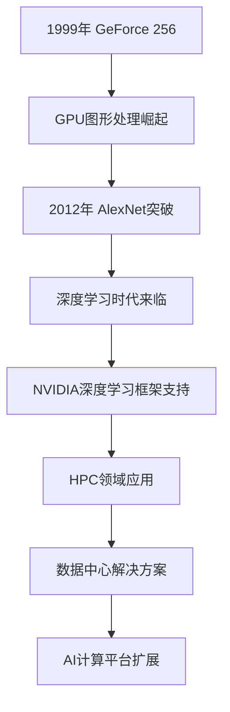

                 

关键词：NVIDIA，算力，AI发展，深度学习，图形处理单元，GPU，AI计算平台，HPC，机器学习

> 摘要：本文旨在探讨NVIDIA在AI领域的重要贡献及其算力支持对AI发展的推动作用。通过回顾NVIDIA的发展历程，分析GPU在AI计算中的关键角色，阐述NVIDIA在深度学习框架、高性能计算（HPC）领域的布局，以及其对AI未来发展的展望，本文为读者提供了全面而深入的视角。

## 1. 背景介绍

自20世纪80年代以来，计算机图形处理单元（GPU）的发展经历了数次重要的技术变革。起初，GPU主要是为游戏和可视化领域提供强大的图形渲染能力。然而，随着深度学习和大数据技术的兴起，GPU的并行计算能力被广泛认识到，并开始被应用于科学计算和人工智能领域。

NVIDIA，作为GPU领域的领导者，于1993年成立，并迅速成为图形处理市场的巨头。NVIDIA的GPU不仅能够处理复杂的图形渲染任务，还具备强大的并行计算能力。这种能力使得GPU在深度学习算法的实现中具有独特的优势，从而推动了AI领域的快速发展。

## 2. 核心概念与联系

### 2.1 NVIDIA的发展历程

NVIDIA的发展历程可以分为几个关键阶段：

1. **图形处理芯片（GPU）的诞生**：1999年，NVIDIA发布了GeForce 256，这是第一款集成光栅处理单元（RPU）的GPU，开启了GPU在图形处理领域的新纪元。
2. **深度学习时代的到来**：2012年，AlexNet的提出标志着深度学习在图像识别领域的重要突破。NVIDIA的GPU因其强大的并行计算能力，成为深度学习研究的首选硬件。
3. **AI计算平台的扩展**：近年来，NVIDIA不断推出适用于AI计算的新一代GPU，如Tesla系列和RTX系列，以满足日益增长的计算需求。

### 2.2 GPU在AI计算中的角色

GPU在AI计算中的核心作用主要体现在以下几个方面：

1. **并行计算能力**：深度学习算法高度并行化，GPU的并行计算能力可以显著提高训练和推理速度。
2. **内存带宽**：GPU具有更高的内存带宽，可以更快地处理大量数据，这对于数据密集型的AI任务至关重要。
3. **计算精度**：NVIDIA的GPU支持半精度浮点数（FP16）和单精度浮点数（FP32），使得高效计算成为可能。

### 2.3 NVIDIA在AI计算平台的布局

NVIDIA在AI计算平台的布局主要体现在以下几个方面：

1. **深度学习框架的支持**：NVIDIA与TensorFlow、PyTorch等主流深度学习框架紧密合作，提供优化的GPU加速版本。
2. **高性能计算（HPC）领域**：NVIDIA的GPU在HPC领域也有着广泛的应用，如分子建模、天气预报等科学计算任务。
3. **数据中心解决方案**：NVIDIA推出了包括DGX系列和A100等面向数据中心的GPU产品，为AI研究人员和企业提供强大的计算资源。



## 3. 核心算法原理 & 具体操作步骤

### 3.1 算法原理概述

GPU在AI计算中的原理主要基于其并行计算架构和特殊的内存层次结构。GPU具有成千上万的计算单元，可以同时处理多个线程，这使得GPU在执行大规模并行任务时具有显著优势。此外，GPU的内存层次结构（包括寄存器、共享内存和全局内存）使得数据访问速度更快，有助于提高计算效率。

### 3.2 算法步骤详解

1. **数据预处理**：在训练深度学习模型之前，需要对输入数据进行预处理，包括数据清洗、归一化和数据增强等步骤。
2. **模型定义**：使用深度学习框架（如TensorFlow或PyTorch）定义神经网络模型，包括选择适当的架构和参数。
3. **模型训练**：将预处理后的数据输入模型，使用GPU进行并行训练，以最小化损失函数并优化模型参数。
4. **模型评估**：在训练完成后，使用测试数据集对模型进行评估，以确定其性能和泛化能力。
5. **模型部署**：将训练好的模型部署到实际应用场景中，如图像识别、自然语言处理等。

### 3.3 算法优缺点

**优点**：

- 高效的并行计算能力
- 更高的内存带宽
- 对深度学习框架的优化支持

**缺点**：

- 对特定类型的数据处理能力较弱
- 高昂的硬件成本
- 对开发者的要求较高

### 3.4 算法应用领域

GPU在以下领域有着广泛的应用：

- **图像识别与处理**：如人脸识别、图像分类和目标检测等。
- **自然语言处理**：如机器翻译、文本分类和情感分析等。
- **科学计算**：如分子建模、天气预报和基因组学等。
- **金融与医疗**：如风险分析、疾病诊断和药物设计等。

## 4. 数学模型和公式 & 详细讲解 & 举例说明

### 4.1 数学模型构建

在深度学习中，常见的数学模型包括神经网络、卷积神经网络（CNN）和递归神经网络（RNN）等。以下以CNN为例进行说明。

CNN的基本结构包括：

1. **卷积层**：用于提取图像的特征。
2. **池化层**：用于降低特征图的维度，减少计算量。
3. **全连接层**：用于将特征映射到输出结果。

### 4.2 公式推导过程

CNN中的卷积操作可以用以下公式表示：

$$
\text{output}_{ij} = \sum_{k=1}^{C} w_{ik,j,k} \cdot \text{input}_{ij} + b_{i,j,k}
$$

其中，$\text{output}_{ij}$ 表示输出特征图上的元素，$w_{ik,j,k}$ 表示卷积核权重，$\text{input}_{ij}$ 表示输入特征图上的元素，$b_{i,j,k}$ 表示偏置项。

### 4.3 案例分析与讲解

假设我们有一个32x32的输入图像，使用一个3x3的卷积核进行卷积操作。卷积核的权重为：

$$
w = \begin{bmatrix}
1 & 0 & 1 \\
0 & 1 & 0 \\
1 & 0 & 1
\end{bmatrix}
$$

输入图像为：

$$
\text{input} = \begin{bmatrix}
1 & 1 & 1 \\
1 & 1 & 1 \\
1 & 1 & 1
\end{bmatrix}
$$

进行卷积操作后，输出特征图为：

$$
\text{output} = \begin{bmatrix}
2 & 1 & 2 \\
1 & 1 & 1 \\
2 & 1 & 2
\end{bmatrix}
$$

## 5. 项目实践：代码实例和详细解释说明

### 5.1 开发环境搭建

为了运行深度学习模型，我们需要搭建一个开发环境。以下是使用Python和TensorFlow搭建开发环境的步骤：

1. 安装Python：确保Python版本大于3.6。
2. 安装TensorFlow：使用pip命令安装TensorFlow。

```bash
pip install tensorflow
```

### 5.2 源代码详细实现

以下是一个简单的卷积神经网络模型实现：

```python
import tensorflow as tf
from tensorflow.keras import layers

# 创建模型
model = tf.keras.Sequential([
    layers.Conv2D(32, (3, 3), activation='relu', input_shape=(32, 32, 3)),
    layers.MaxPooling2D((2, 2)),
    layers.Flatten(),
    layers.Dense(64, activation='relu'),
    layers.Dense(10, activation='softmax')
])

# 编译模型
model.compile(optimizer='adam',
              loss='categorical_crossentropy',
              metrics=['accuracy'])

# 加载并预处理数据
(x_train, y_train), (x_test, y_test) = tf.keras.datasets.cifar10.load_data()
x_train, x_test = x_train / 255.0, x_test / 255.0

# 转换为类别编码
y_train = tf.keras.utils.to_categorical(y_train, 10)
y_test = tf.keras.utils.to_categorical(y_test, 10)

# 训练模型
model.fit(x_train, y_train, epochs=10, batch_size=64)
```

### 5.3 代码解读与分析

上述代码首先导入了TensorFlow库，并创建了一个简单的卷积神经网络模型。该模型包括一个卷积层、一个池化层、一个全连接层和另一个全连接层。然后，我们加载并预处理了CIFAR-10数据集，并使用该数据集训练了模型。

### 5.4 运行结果展示

训练完成后，我们使用测试数据集对模型进行评估：

```python
test_loss, test_acc = model.evaluate(x_test, y_test, verbose=2)
print('Test accuracy:', test_acc)
```

输出结果为测试准确率，表示模型在测试数据集上的性能。

## 6. 实际应用场景

NVIDIA的GPU在众多领域有着广泛的应用，以下是几个实际应用场景的例子：

- **自动驾驶**：NVIDIA的GPU用于自动驾驶车辆的实时图像处理和深度学习算法的执行，以提高车辆的安全性和效率。
- **医疗影像分析**：NVIDIA的GPU加速技术用于医疗影像处理，如肿瘤检测、疾病诊断等，提高了诊断的准确性和效率。
- **金融风控**：NVIDIA的GPU在金融风控领域用于进行大规模数据分析和实时风险监控，提高了金融机构的风险管理能力。

### 6.4 未来应用展望

随着AI技术的不断发展，NVIDIA的GPU在未来将会有更广泛的应用。以下是一些可能的未来应用场景：

- **智能城市**：NVIDIA的GPU可以用于城市管理的各个方面，如交通流量优化、环境保护监测和公共安全监控等。
- **智能制造**：NVIDIA的GPU可以用于智能工厂的各个环节，如生产线监控、质量控制、设备维护等。
- **虚拟现实与增强现实**：NVIDIA的GPU在虚拟现实和增强现实领域有着巨大的潜力，可以提供更加逼真的交互体验。

## 7. 工具和资源推荐

### 7.1 学习资源推荐

- **NVIDIA官方文档**：NVIDIA提供了丰富的官方文档和教程，涵盖了从GPU基础知识到深度学习应用的各种主题。
- **深度学习课程**：如吴恩达的《深度学习专项课程》，提供了系统的深度学习理论和实践知识。

### 7.2 开发工具推荐

- **TensorFlow**：一个开源的深度学习框架，提供了丰富的API和工具，适用于各种AI应用。
- **CUDA**：NVIDIA提供的并行计算平台和编程模型，用于开发高性能的GPU应用程序。

### 7.3 相关论文推荐

- **AlexNet**：深度学习在图像识别领域的重要突破。
- **Google Brain Project**：大规模神经网络在语音识别和图像识别中的应用。
- **DNN for COVID-19**：深度学习在COVID-19诊断和预测中的应用。

## 8. 总结：未来发展趋势与挑战

### 8.1 研究成果总结

NVIDIA在AI领域取得了显著的研究成果，其GPU在深度学习和高性能计算领域发挥着重要作用。NVIDIA不断推出新的GPU产品和技术，以满足日益增长的AI计算需求。

### 8.2 未来发展趋势

未来，GPU在AI领域的应用将更加广泛和深入。随着AI技术的发展，GPU的性能和能效比将不断提升，为AI应用提供更强大的支持。

### 8.3 面临的挑战

尽管NVIDIA在AI领域取得了巨大成功，但仍然面临着一些挑战，如：

- **硬件成本**：高性能GPU的价格昂贵，对中小企业和学术研究机构来说是一个重大挑战。
- **技术门槛**：深度学习和GPU编程需要较高的技术门槛，对于非专业人士来说，学习和应用存在一定的难度。

### 8.4 研究展望

未来，NVIDIA将继续在GPU技术和AI领域进行深入研究，推动AI技术的创新和发展。同时，随着AI技术的普及，GPU的应用范围将进一步扩大，为各行各业带来巨大的价值。

## 9. 附录：常见问题与解答

### 9.1 什么是GPU？

GPU，即图形处理单元，是一种专为处理图形渲染任务而设计的集成电路。然而，随着深度学习和大数据技术的发展，GPU的并行计算能力被广泛应用于科学计算和人工智能领域。

### 9.2 为什么GPU适合深度学习？

GPU具有高度并行化的结构，能够同时处理多个线程。这使得GPU在执行大规模并行任务时具有显著优势，非常适合用于深度学习模型的训练和推理。

### 9.3 如何选择合适的GPU？

在选择GPU时，需要考虑以下因素：

- **计算能力**：根据任务需求选择适合的计算能力。
- **内存大小**：选择具有足够内存大小的GPU，以满足数据密集型任务的需求。
- **价格**：根据预算选择性价比合适的GPU。

## 作者署名

作者：禅与计算机程序设计艺术 / Zen and the Art of Computer Programming

