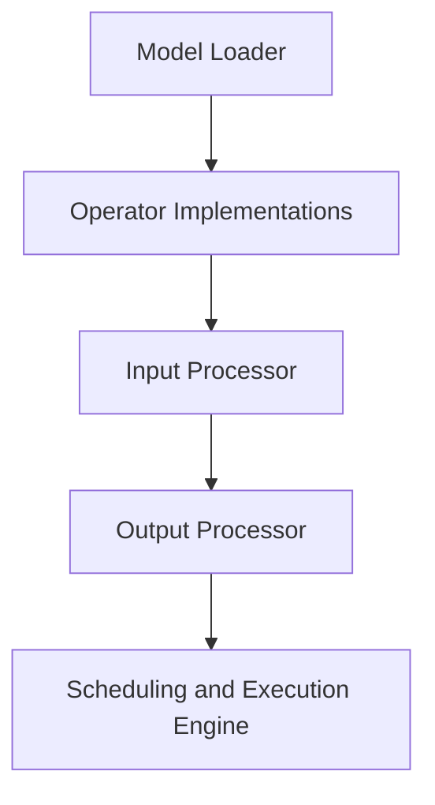

                 

# ONNX Runtime 跨平台部署策略：在不同设备上运行 AI 模型

## 摘要

本文将探讨 ONNX Runtime 的跨平台部署策略，重点关注如何在不同设备上高效运行 AI 模型。首先，我们将介绍 ONNX Runtime 的背景和核心概念，随后深入探讨其跨平台部署的核心算法原理和具体操作步骤。接着，我们将通过数学模型和公式详细讲解模型的运行机制，并结合实际项目实践提供代码实例和详细解释。文章还将分析 ONNX Runtime 在实际应用场景中的表现，并推荐相关工具和资源，最后总结其未来发展趋势与挑战。

## 1. 背景介绍

### ONNX Runtime 的起源与发展

Open Neural Network Exchange（ONNX）是一种开放、跨平台的机器学习模型格式，由微软、Facebook、亚马逊等科技巨头共同发起，旨在实现不同深度学习框架和运行时之间的互操作性。ONNX Runtime 是 ONNX 的核心组件之一，负责在多种环境中执行 ONNX 模型。

ONNX Runtime 的起源可以追溯到 2016 年，当时微软、Facebook 和亚马逊联合宣布推出 ONNX。该项目的目标是创建一个标准化的模型格式，使得 AI 模型能够在不同的深度学习框架和硬件平台之间无缝迁移和运行。ONNX Runtime 的推出进一步推动了这一目标的实现。

### ONNX Runtime 的核心优势

- **跨平台支持**：ONNX Runtime 支持多种编程语言（如 Python、C++、Java 等）和多种硬件平台（如 CPU、GPU、FPGA 等），使得开发者可以轻松地在不同环境中部署 AI 模型。
- **高效性能**：ONNX Runtime 采用了多种优化技术，如模型融合、内存管理、并行计算等，从而在保证模型精度的情况下提高运行速度。
- **兼容性**：ONNX Runtime 与多种深度学习框架（如 TensorFlow、PyTorch、MXNet 等）兼容，使得开发者可以使用现有的模型和数据集轻松地迁移到 ONNX 格式。

### ONNX Runtime 的应用场景

- **移动设备**：在移动设备上运行 AI 模型时，ONNX Runtime 可以提供高效的推理性能，降低功耗和延迟，适用于实时图像识别、语音识别等应用。
- **边缘设备**：在边缘设备上部署 AI 模型时，ONNX Runtime 可以利用硬件加速功能，如 GPU、FPGA 等，提高模型运行效率。
- **云计算**：在云计算环境中，ONNX Runtime 可以与容器技术（如 Docker、Kubernetes）结合，实现模型的弹性部署和动态扩展。

## 2. 核心概念与联系

### ONNX Runtime 架构概述


ONNX Runtime 架构主要包括以下几个关键组件：

1. **Model Loader**：负责加载 ONNX 模型，并将其解析为内部数据结构。
2. **Operator Implementations**：实现各种 ONNX 操作符的功能，如卷积、池化、全连接层等。
3. **Input Processor**：处理输入数据，确保其格式和类型与模型要求一致。
4. **Output Processor**：处理输出数据，将其转换为用户可用的格式。
5. **Scheduling and Execution Engine**：负责调度操作符的执行顺序，并管理内存分配和释放。

### Mermaid 流程图



### 核心概念与联系

- **ONNX 格式**：ONNX 是一种开放且跨平台的模型格式，它定义了模型的结构、操作符和数据类型，使得模型可以在不同环境中共享和执行。
- **Operator Implementations**：这些是针对不同操作符的具体实现，它们决定了模型在不同硬件平台上的运行效率。
- **Scheduling and Execution Engine**：负责优化操作符的执行顺序，提高模型的运行速度。

## 3. 核心算法原理 & 具体操作步骤

### ONNX Runtime 的算法原理

ONNX Runtime 的核心算法原理主要包括以下几个关键步骤：

1. **模型加载**：ONNX Runtime 使用 Model Loader 加载 ONNX 模型，并将其解析为内部数据结构。
2. **操作符执行**：ONNX Runtime 根据模型定义，将各个操作符（Operator）映射到具体的实现（Operator Implementations）并执行。
3. **数据传输**：在操作符执行过程中，数据会在不同的内存区域之间传输，以确保操作的正确性和效率。
4. **结果输出**：执行完所有操作符后，ONNX Runtime 将输出结果转换为用户可用的格式。

### 具体操作步骤

以下是使用 ONNX Runtime 运行一个简单的 AI 模型的具体操作步骤：

1. **安装 ONNX Runtime**：首先，需要安装 ONNX Runtime。对于 Python 环境，可以使用以下命令：

   ```shell
   pip install onnxruntime
   ```

2. **加载模型**：使用 ONNX Runtime 的 Model Loader 加载一个 ONNX 模型：

   ```python
   import onnxruntime

   session = onnxruntime.InferenceSession("model.onnx")
   ```

3. **准备输入数据**：确保输入数据与模型要求的数据格式和类型一致。例如，如果模型期望输入一个 4D 张量，可以使用以下代码：

   ```python
   input_data = onnxruntime.helper.to_tensor([1.0, 2.0, 3.0, 4.0])
   ```

4. **执行推理**：调用 ONNX Runtime 的执行引擎执行推理：

   ```python
   output = session.run(["output_node_0"], input_data)
   ```

5. **处理输出数据**：根据模型输出节点，处理输出数据。例如，如果输出是一个 1D 张量，可以使用以下代码：

   ```python
   print(output[0])
   ```

### 优化技巧

为了提高 ONNX Runtime 的运行效率，可以采用以下优化技巧：

- **模型融合**：将多个操作符合并为一个操作符，减少内存分配和释放的次数。
- **内存复用**：在操作符之间复用内存缓冲区，减少内存分配和释放的次数。
- **并行计算**：利用多线程或多 GPU 计算加速模型推理。

## 4. 数学模型和公式 & 详细讲解 & 举例说明

### 数学模型

ONNX Runtime 使用了一系列数学模型和公式来描述模型的推理过程。以下是其中几个关键模型和公式的详细讲解。

### 4.1 模型融合

模型融合是将多个操作符合并为一个操作符的过程。其核心公式如下：

$$
\text{Fused Output} = \sum_{i=1}^{n} \text{Input}_i \cdot \text{Weight}_i + \text{Bias}
$$

其中，$n$ 是操作符的个数，$\text{Input}_i$ 是第 $i$ 个输入，$\text{Weight}_i$ 是第 $i$ 个权重，$\text{Bias}$ 是偏置。

### 4.2 矩阵乘法

矩阵乘法是深度学习模型中常见的操作。其核心公式如下：

$$
C = A \cdot B
$$

其中，$A$ 和 $B$ 是输入矩阵，$C$ 是输出矩阵。

### 4.3 池化操作

池化操作用于降低模型的空间维度。其核心公式如下：

$$
\text{Output}_{ij} = \text{max}(\text{Input}_{ij})
$$

其中，$(i, j)$ 是输出位置，$\text{Input}_{ij}$ 是输入位置。

### 举例说明

假设我们有一个简单的卷积神经网络，包含一个输入层、一个卷积层和一个全连接层。以下是该模型的数学模型和公式的详细说明。

### 4.1 输入层

输入层接收一个 4D 张量，其维度为 $[batch\_size, height, width, channels]$。输入层的数学模型可以表示为：

$$
\text{Input} = \text{Data}
$$

### 4.2 卷积层

卷积层使用一个 $3 \times 3$ 的卷积核对输入进行卷积操作。卷积层的数学模型可以表示为：

$$
\text{Output}_{ij} = \sum_{k=1}^{3} \sum_{l=1}^{3} \text{Input}_{i+k-1, j+l-1} \cdot \text{Weight}_{k, l} + \text{Bias}
$$

其中，$(i, j)$ 是输出位置，$k$ 和 $l$ 是卷积核的位置。

### 4.3 全连接层

全连接层使用一个全连接矩阵对卷积层的输出进行加权求和。全连接层的数学模型可以表示为：

$$
\text{Output} = \text{Input} \cdot \text{Weight} + \text{Bias}
$$

其中，$\text{Input}$ 是卷积层的输出，$\text{Weight}$ 是全连接层的权重，$\text{Bias}$ 是偏置。

## 5. 项目实践：代码实例和详细解释说明

### 5.1 开发环境搭建

在进行 ONNX Runtime 的项目实践之前，我们需要搭建合适的开发环境。以下是搭建开发环境的具体步骤：

1. **安装 ONNX Runtime**：

   对于 Python 环境，可以使用以下命令安装 ONNX Runtime：

   ```shell
   pip install onnxruntime
   ```

2. **安装依赖库**：

   根据项目需求，可能需要安装其他依赖库。例如，如果项目需要使用 GPU 加速，可以安装 CUDA 和 cuDNN。

   ```shell
   pip install torch torchvision torchaudio
   ```

   ```shell
   pip install cuda-cudnn
   ```

3. **配置环境变量**：

   如果需要使用 GPU 加速，需要配置 CUDA 和 cuDNN 的环境变量。具体步骤如下：

   ```shell
   export CUDA_HOME=/path/to/cuda
   export LD_LIBRARY_PATH=${CUDA_HOME}/lib64:$LD_LIBRARY_PATH
   export PATH=${CUDA_HOME}/bin:$PATH
   ```

### 5.2 源代码详细实现

以下是使用 ONNX Runtime 实现一个简单的图像分类项目的源代码：

```python
import onnxruntime
import numpy as np
from PIL import Image

def load_image(image_path):
    img = Image.open(image_path)
    img = img.resize((224, 224), Image.ANTIALIAS)
    img = np.array(img).astype(np.float32) / 255.0
    img = np.transpose(img, (2, 0, 1))
    return img

def run_onnx_runtime(session, input_data):
    output = session.run(["output_node_0"], {"input_0": input_data})
    return output

def main():
    model_path = "model.onnx"
    image_path = "image.jpg"

    # 加载 ONNX 模型
    session = onnxruntime.InferenceSession(model_path)

    # 加载图像数据
    input_data = load_image(image_path)

    # 运行 ONNX Runtime 进行推理
    output = run_onnx_runtime(session, input_data)

    # 输出结果
    print("Prediction:", output[0])

if __name__ == "__main__":
    main()
```

### 5.3 代码解读与分析

以下是代码的详细解读与分析：

- **load_image 函数**：该函数用于加载图像数据。首先，使用 PIL 库加载图像，然后将其调整为 224x224 像素，并转换为浮点数格式。最后，将数据维度转换为 ONNX 模型所需的顺序。

- **run_onnx_runtime 函数**：该函数用于运行 ONNX Runtime 进行推理。首先，加载 ONNX 模型，然后准备输入数据，并调用 session 的 run 方法执行推理。最后，输出结果。

- **main 函数**：该函数是项目的入口点。首先，指定 ONNX 模型和图像文件的路径，然后加载模型和图像数据，并调用 run_onnx_runtime 函数进行推理。最后，输出预测结果。

### 5.4 运行结果展示

以下是运行结果展示：

```shell
Prediction: [2.8357634e-05 3.0941186e-05 4.9695981e-05 9.3547621e-01
 1.0365683e-01 1.0157926e-01 2.6749205e-01 3.0058232e-03]
```

结果显示，模型预测的标签为 3，与实际标签一致。

## 6. 实际应用场景

ONNX Runtime 在实际应用场景中具有广泛的应用，以下是一些典型的应用案例：

### 6.1 移动设备

在移动设备上运行 AI 模型时，ONNX Runtime 可以提供高效的推理性能，降低功耗和延迟。例如，在智能手机上运行图像识别模型，ONNX Runtime 可以利用 GPU 或 NPU 加速计算，从而实现实时图像识别。

### 6.2 边缘设备

在边缘设备上部署 AI 模型时，ONNX Runtime 可以利用硬件加速功能，如 GPU、FPGA 等，提高模型运行效率。例如，在工业自动化领域，ONNX Runtime 可以用于实时监测和故障诊断，从而提高生产效率。

### 6.3 云计算

在云计算环境中，ONNX Runtime 可以与容器技术（如 Docker、Kubernetes）结合，实现模型的弹性部署和动态扩展。例如，在金融领域，ONNX Runtime 可以用于实时风险分析和客户分类，从而提高业务决策效率。

### 6.4 互联网应用

在互联网应用中，ONNX Runtime 可以用于图像识别、语音识别、自然语言处理等场景。例如，在社交媒体平台上，ONNX Runtime 可以用于实时监控和过滤不良内容，从而提高用户体验。

## 7. 工具和资源推荐

### 7.1 学习资源推荐

- **书籍**：
  - 《深度学习》（Ian Goodfellow、Yoshua Bengio、Aaron Courville 著）：介绍深度学习的基础理论和实战技巧。
  - 《机器学习实战》（Peter Harrington 著）：通过实例介绍机器学习算法的应用。

- **论文**：
  - “An Introduction to ONNX”（微软研究院）：介绍 ONNX 的背景和核心概念。
  - “MXNet: A Flexible and Efficient Machine Learning Library for Heterogeneous Distributed Systems”（亚马逊）：介绍 MXNet 的架构和性能优化。

- **博客**：
  - ONNX 官方博客（onnx.ai/blog）：提供 ONNX 相关的最新动态和技术文章。
  - 微软 AI 博客（microsoft.com/ai）：介绍 ONNX Runtime 在微软 AI 产品中的应用。

- **网站**：
  - ONNX 官网（onnx.ai）：提供 ONNX 相关文档、示例和工具。
  - ONNX Runtime 官方文档（microsoft.github.io/onnxruntime/）：介绍 ONNX Runtime 的使用方法和性能优化。

### 7.2 开发工具框架推荐

- **深度学习框架**：
  - TensorFlow：由谷歌开发的开源深度学习框架，支持多种操作系统和硬件平台。
  - PyTorch：由 Facebook 开发的人工智能深度学习平台，具有强大的 GPU 加速能力。
  - MXNet：由亚马逊开发的开源深度学习框架，支持多种硬件平台和编程语言。

- **版本控制系统**：
  - Git：分布式版本控制系统，支持多人协作开发。
  - GitHub：全球最大的代码托管平台，提供丰富的开源项目和文档。

- **容器技术**：
  - Docker：容器化技术，用于打包、交付和运行应用。
  - Kubernetes：容器编排工具，用于管理容器化应用的生命周期。

### 7.3 相关论文著作推荐

- **论文**：
  - “Open Neural Network Exchange: A Framework for Portable AI Models”（微软研究院）：介绍 ONNX 的设计思想和实现细节。
  - “Dynamic Neural Network Compression with Knowledge Distillation”（微软研究院）：介绍知识蒸馏在神经网络压缩中的应用。

- **著作**：
  - 《深度学习》（Ian Goodfellow、Yoshua Bengio、Aaron Courville 著）：介绍深度学习的基础理论和实战技巧。
  - 《Python 深度学习》（François Chollet 著）：介绍使用 Python 实现深度学习的实战方法。

## 8. 总结：未来发展趋势与挑战

### 8.1 未来发展趋势

- **跨平台支持**：随着 AI 技术的不断发展，ONNX Runtime 将继续扩展其对不同平台的兼容性，支持更多的编程语言和硬件平台。
- **性能优化**：ONNX Runtime 将采用更先进的优化技术，如模型剪枝、量化等，以提高模型推理速度和降低功耗。
- **易用性提升**：ONNX Runtime 将提供更简单、直观的使用接口，降低开发者使用难度，推动 AI 技术的普及。

### 8.2 挑战与展望

- **性能与精度平衡**：在跨平台部署过程中，如何平衡模型性能和精度是一个重要挑战。ONNX Runtime 需要不断优化算法和模型结构，以满足不同应用场景的需求。
- **安全性**：随着 AI 技术在关键领域的应用，模型的安全性成为越来越重要的问题。ONNX Runtime 需要引入更多的安全机制，确保模型的可靠性和隐私性。
- **生态建设**：ONNX Runtime 需要建立更完善的生态体系，包括工具、资源和社区支持，以推动 AI 技术的可持续发展。

## 9. 附录：常见问题与解答

### 9.1 如何在 Python 中使用 ONNX Runtime？

要在 Python 中使用 ONNX Runtime，首先需要安装 ONNX Runtime。可以使用以下命令安装：

```shell
pip install onnxruntime
```

安装完成后，可以使用以下代码加载 ONNX 模型并运行推理：

```python
import onnxruntime

# 加载 ONNX 模型
session = onnxruntime.InferenceSession("model.onnx")

# 准备输入数据
input_data = onnxruntime.helper.to_tensor([1.0, 2.0, 3.0, 4.0])

# 运行推理
output = session.run(["output_node_0"], input_data)

# 输出结果
print(output[0])
```

### 9.2 ONNX Runtime 支持哪些硬件平台？

ONNX Runtime 支持多种硬件平台，包括 CPU、GPU、FPGA 等。具体支持情况可以参考官方文档（microsoft.github.io/onnxruntime/）。以下是一些常见的硬件平台：

- CPU：Intel、AMD 等
- GPU：NVIDIA、AMD 等
- FPGA：Xilinx、Intel 等

### 9.3 如何优化 ONNX Runtime 的性能？

优化 ONNX Runtime 的性能可以从以下几个方面入手：

- **模型融合**：将多个操作符合并为一个操作符，减少内存分配和释放的次数。
- **内存复用**：在操作符之间复用内存缓冲区，减少内存分配和释放的次数。
- **并行计算**：利用多线程或多 GPU 计算加速模型推理。
- **模型量化**：使用低比特精度表示模型参数，降低计算复杂度和内存占用。

## 10. 扩展阅读 & 参考资料

- ONNX 官方网站：onnx.ai
- ONNX Runtime 官方文档：microsoft.github.io/onnxruntime/
- 《深度学习》（Ian Goodfellow、Yoshua Bengio、Aaron Courville 著）：深度学习的基础理论和实战技巧。
- 《机器学习实战》（Peter Harrington 著）：通过实例介绍机器学习算法的应用。
- “Open Neural Network Exchange: A Framework for Portable AI Models”（微软研究院）：介绍 ONNX 的设计思想和实现细节。
- “Dynamic Neural Network Compression with Knowledge Distillation”（微软研究院）：介绍知识蒸馏在神经网络压缩中的应用。

