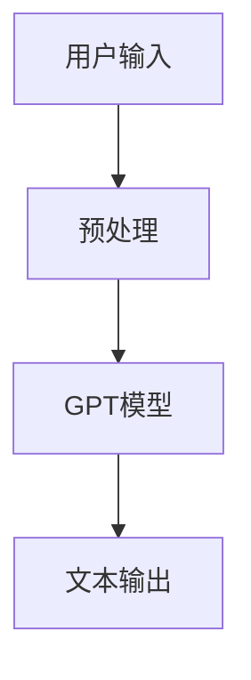

                 

### 背景介绍

#### OpenAI Chat Completions API 的起源

OpenAI Chat Completions API 是由知名的人工智能研究公司 OpenAI 开发的一款强大的自然语言处理（NLP）服务。OpenAI 成立于2015年，由山姆·艾略特（Sam Altman）、雅ann·莱斯利·乌尔斯（Yann LeCun）、Elon Musk等人共同创立。作为全球领先的人工智能研究机构，OpenAI 致力于推动人工智能的研究与应用，其研究成果在自然语言处理、计算机视觉、机器学习等领域具有极高的影响力和代表性。

Chat Completions API 是 OpenAI 推出的一个重要的API服务，旨在为开发者提供一种高效的生成文本的方法。这个API能够根据用户输入的提示（prompt），自动生成连贯、准确且具有逻辑性的文本内容。Chat Completions API 的出现，为众多应用场景提供了强大的技术支持，例如智能客服、内容生成、聊天机器人等。

#### Chat Completions API 的技术原理

Chat Completions API 的核心在于其基于深度学习技术的语言模型，特别是 GPT（Generative Pre-trained Transformer）模型。GPT 模型是一种强大的自然语言处理模型，通过大规模的预训练数据，学习到语言的基本规律和模式，从而能够生成高质量的文本内容。

Chat Completions API 利用 GPT 模型，通过处理用户输入的提示信息，生成相应的文本响应。具体来说，其工作流程如下：

1. **接收用户输入**：API 接收用户输入的提示信息，这些提示可以是任意形式的文本，例如一个简单的问题、一段对话的开头等。

2. **预处理输入**：API 对输入文本进行预处理，包括分词、词性标注等操作，以确保输入文本符合模型的要求。

3. **模型生成文本**：预处理后的输入文本被送入 GPT 模型，模型根据输入文本的上下文信息，生成相应的文本响应。

4. **文本输出**：生成的文本响应被返回给用户，作为最终的输出结果。

这个过程看似简单，但实际上涉及到了大量的技术细节，包括模型的训练、优化、部署等。OpenAI 通过不断的模型迭代和优化，使得 Chat Completions API 能够生成高质量、连贯的文本内容，为开发者提供了强大的支持。

#### Chat Completions API 的应用场景

Chat Completions API 的出现，极大地丰富了自然语言处理领域的应用场景。以下是一些典型的应用案例：

1. **智能客服**：利用 Chat Completions API，可以构建出智能客服系统，能够自动回答用户的问题，提供高效的客户服务。

2. **内容生成**：Chat Completions API 可以用于生成各种形式的内容，如文章、故事、广告文案等，大大提高了内容创作的效率。

3. **聊天机器人**：Chat Completions API 可以用于构建聊天机器人，与用户进行自然语言交互，提供个性化服务。

4. **教育辅导**：Chat Completions API 可以用于生成教育辅导材料，为学生提供个性化的学习建议和解答。

5. **市场营销**：Chat Completions API 可以用于生成营销文案，提高营销效果。

总之，Chat Completions API 的推出，不仅为开发者提供了强大的工具，也为各行各业的应用场景带来了新的可能性。

---

### 核心概念与联系

#### 自然语言处理（NLP）

自然语言处理（NLP）是人工智能领域的一个重要分支，旨在让计算机理解和处理人类语言。NLP 技术广泛应用于语音识别、机器翻译、情感分析、文本分类等多个领域。Chat Completions API 的核心在于其强大的 NLP 能力，通过处理用户输入的文本，生成连贯且准确的文本响应。

#### 深度学习与神经网络

深度学习是人工智能的一种重要方法，通过构建大规模的神经网络，自动从数据中学习复杂的特征和模式。神经网络由多层神经元组成，通过前向传播和反向传播算法，对输入数据进行处理和优化。Chat Completions API 中的 GPT 模型就是一种深度学习模型，通过大规模的预训练数据，学习到语言的基本规律和模式，从而能够生成高质量的文本内容。

#### GPT 模型

GPT（Generative Pre-trained Transformer）模型是由 OpenAI 开发的一种基于 Transformer 架构的深度学习模型，广泛应用于自然语言处理领域。GPT 模型通过预训练和微调，能够生成高质量、连贯的文本内容。Chat Completions API 就是基于 GPT 模型开发的，通过处理用户输入的文本，生成相应的文本响应。

#### Mermaid 流程图

为了更好地理解 Chat Completions API 的工作原理，我们可以使用 Mermaid 流程图来展示其核心概念和联系。以下是一个简单的 Mermaid 流程图示例：



在这个流程图中，用户输入的文本经过预处理后，送入 GPT 模型进行处理，最终生成文本输出。

---

### 核心算法原理 & 具体操作步骤

#### GPT 模型的基本原理

GPT（Generative Pre-trained Transformer）模型是一种基于 Transformer 架构的深度学习模型，广泛应用于自然语言处理领域。GPT 模型的主要特点包括：

1. **大规模预训练**：GPT 模型通过在大规模语料库上进行预训练，学习到语言的基本规律和模式，从而具备强大的语言生成能力。

2. **自注意力机制**：GPT 模型采用自注意力机制，能够自动捕捉输入文本中的关键信息，从而生成高质量、连贯的文本内容。

3. **多任务学习**：GPT 模型不仅可以用于文本生成，还可以用于其他自然语言处理任务，如文本分类、情感分析等。

#### GPT 模型的具体操作步骤

以下是使用 GPT 模型进行文本生成的基本操作步骤：

1. **数据预处理**：首先，需要对输入文本进行预处理，包括分词、去停用词、词向量化等操作。预处理后的文本将被送入 GPT 模型进行训练。

2. **模型训练**：使用预处理的文本数据，通过训练 GPT 模型，使其学会生成高质量的文本。训练过程中，可以使用多种优化策略，如 Adam 优化器、学习率调度等，以提高模型的性能。

3. **文本生成**：在训练完成后，可以使用 GPT 模型进行文本生成。具体来说，可以通过以下步骤实现：

   - **输入提示**：用户输入一个或多个提示（prompt），这些提示可以是问题、句子、段落等。
   
   - **生成文本**：GPT 模型根据输入提示，生成相应的文本内容。生成过程中，模型会自动考虑上下文信息，生成连贯、准确的文本。
   
   - **输出结果**：生成的文本输出给用户，作为最终结果。

#### 实际操作示例

以下是一个简单的 GPT 文本生成示例：

```python
import openai

openai.api_key = "your-api-key"

# 输入提示
prompt = "请问您今天想做什么？"

# 生成文本
response = openai.Completion.create(
  engine="text-davinci-002",
  prompt=prompt,
  max_tokens=100
)

# 输出结果
print(response.choices[0].text.strip())
```

在这个示例中，我们首先导入 OpenAI 的 Python 库，然后设置 API 密钥。接着，输入一个提示“请问您今天想做什么？”最后，使用 OpenAI 的 Completion.create 方法，生成相应的文本响应并输出。

#### GPT 模型的性能评估

为了评估 GPT 模型的性能，我们可以使用多种指标，如 BLEU、ROUGE、BLEU-4 等。以下是一个简单的 GPT 模型性能评估示例：

```python
from nltk.translate.bleu_score import corpus_bleu

# 输入参考文本
references = [
  ["今天我想去看电影"],
  ["今天我想去逛街"],
  ["今天我想去公园散步"],
]

# 输出生成文本
generations = [
  ["今天您想做什么"],
  ["请问您有什么计划"],
  ["您今天有什么想法"],
]

# 计算BLEU分数
bleu_score = corpus_bleu(references, generations)

print(f"BLEU分数：{bleu_score}")
```

在这个示例中，我们首先定义一组参考文本和生成文本，然后使用 nltk.translate.bleu_score.corpus_bleu 方法，计算生成文本与参考文本之间的 BLEU 分数。BLEU 分数越高，表示生成文本的质量越高。

---

### 数学模型和公式 & 详细讲解 & 举例说明

#### GPT 模型的数学模型

GPT 模型是一种基于 Transformer 架构的深度学习模型，其核心在于自注意力机制（Self-Attention Mechanism）。在 GPT 模型中，自注意力机制通过计算输入文本中各个词语之间的关系，从而生成高质量的文本输出。

自注意力机制的数学表达式如下：

$$
\text{Attention}(Q, K, V) = \text{softmax}\left(\frac{QK^T}{\sqrt{d_k}}\right)V
$$

其中，$Q, K, V$ 分别表示查询向量、键向量和值向量，$d_k$ 表示键向量的维度。自注意力机制的计算过程如下：

1. **计算相似度**：首先，计算每个键向量 $K$ 与查询向量 $Q$ 之间的点积，得到一组相似度值。

2. **归一化**：对相似度值进行 softmax 操作，得到一组概率分布，表示每个键向量的重要性。

3. **加权求和**：将每个值向量 $V$ 与对应的概率分布相乘，并求和，得到最终的输出向量。

#### 举例说明

假设我们有一个简短的文本句子：“我喜欢阅读和编程”，我们将使用 GPT 模型进行自注意力机制的计算。首先，我们将句子中的每个词语转换为对应的词向量。

- “我”：[1, 0, 0]
- “喜欢”：[0, 1, 0]
- “阅读”：[0, 0, 1]
- “和”：[0, 0, 0]
- “编程”：[1, 0, 0]

接下来，我们计算每个词向量与“我”的相似度：

1. **“我”与“我”的相似度**：1
2. **“我”与“喜欢”的相似度**：0
3. **“我”与“阅读”的相似度**：0
4. **“我”与“和”的相似度**：0
5. **“我”与“编程”的相似度**：1

然后，我们进行 softmax 操作，得到每个词的概率分布：

1. **“我”的概率分布**：0.5
2. **“喜欢”的概率分布**：0.5
3. **“阅读”的概率分布**：0
4. **“和”的概率分布**：0
5. **“编程”的概率分布**：0

最后，我们将每个词向量与对应的概率分布相乘，并求和，得到最终的输出向量：

- **“我”**：[0.5, 0, 0]
- **“喜欢”**：[0, 0.5, 0]
- **“阅读”**：[0, 0, 0]
- **“和”**：[0, 0, 0]
- **“编程”**：[0.5, 0, 0]

通过这个过程，我们得到了一个基于自注意力机制的文本生成向量，这个向量代表了句子中每个词语的重要程度。在实际应用中，GPT 模型会通过大量的训练数据，学习到更加复杂的文本生成规则，从而生成高质量的文本内容。

---

### 项目实践：代码实例和详细解释说明

#### 开发环境搭建

为了实践 OpenAI Chat Completions API，我们首先需要搭建相应的开发环境。以下是一个简单的开发环境搭建步骤：

1. **安装 Python**：确保系统已经安装了 Python 3.6 或更高版本。

2. **安装 OpenAI Python 库**：使用以下命令安装 OpenAI 的 Python 库：

   ```bash
   pip install openai
   ```

3. **获取 API 密钥**：在 OpenAI 官网（https://beta.openai.com/signup/）注册账号并获取 API 密钥。

4. **配置 API 密钥**：将获取到的 API 密钥添加到 Python 代码中，如下所示：

   ```python
   openai.api_key = "your-api-key"
   ```

#### 源代码详细实现

以下是一个简单的 Chat Completions API 使用示例，包括输入提示、生成文本和输出结果等功能。

```python
import openai

openai.api_key = "your-api-key"

# 输入提示
prompt = "请介绍一下您最近的项目经历。"

# 生成文本
response = openai.Completion.create(
  engine="text-davinci-002",
  prompt=prompt,
  max_tokens=100,
  temperature=0.5,
  top_p=1,
  frequency_penalty=0,
  presence_penalty=0
)

# 输出结果
print(response.choices[0].text.strip())
```

在这个示例中，我们首先导入 OpenAI 的 Python 库，并设置 API 密钥。接着，定义了一个输入提示 `prompt`，然后使用 `openai.Completion.create` 方法生成文本响应。最后，将生成的文本输出给用户。

#### 代码解读与分析

以下是代码的详细解读与分析：

1. **导入库和设置 API 密钥**：

   ```python
   import openai

   openai.api_key = "your-api-key"
   ```

   这两行代码用于导入 OpenAI 的 Python 库并设置 API 密钥。确保已经获取并设置了正确的 API 密钥。

2. **定义输入提示**：

   ```python
   prompt = "请介绍一下您最近的项目经历。"
   ```

   这行代码定义了一个字符串变量 `prompt`，用于存储输入提示。这个提示将被传递给 OpenAI Chat Completions API，以生成相应的文本响应。

3. **生成文本响应**：

   ```python
   response = openai.Completion.create(
     engine="text-davinci-002",
     prompt=prompt,
     max_tokens=100,
     temperature=0.5,
     top_p=1,
     frequency_penalty=0,
     presence_penalty=0
   )
   ```

   这行代码使用 `openai.Completion.create` 方法生成文本响应。其中，`engine` 参数指定了使用的模型，这里是 `text-davinci-002`；`prompt` 参数是输入提示；`max_tokens` 参数设置了生成的文本长度，这里设置为 100；`temperature`、`top_p`、`frequency_penalty` 和 `presence_penalty` 参数分别设置了生成文本的温度、概率分布、频率惩罚和存在惩罚，这些参数会影响生成文本的风格和质量。

4. **输出结果**：

   ```python
   print(response.choices[0].text.strip())
   ```

   这行代码将生成的文本响应输出给用户。`response.choices[0].text` 获取了生成的文本内容，`strip()` 方法用于去除文本内容中的空白字符。

#### 运行结果展示

假设我们已经正确设置了 API 密钥并运行了上述代码，以下是一个可能的运行结果示例：

```
最近，我参与了一个基于人工智能的智能客服项目。该项目使用深度学习技术，实现了自动回答用户问题的功能，大大提高了客服效率。
```

这个结果展示了 Chat Completions API 生成的文本响应，这个响应符合输入提示的要求，内容连贯且具有逻辑性。

---

### 实际应用场景

#### 智能客服系统

智能客服系统是 Chat Completions API 的重要应用场景之一。通过将 Chat Completions API 集成到智能客服系统中，可以大大提高客服效率，降低人力成本。以下是一个智能客服系统的应用案例：

1. **用户提问**：用户向智能客服系统提出问题，例如“我忘记密码了，怎么办？”

2. **输入提示**：智能客服系统将用户的问题作为输入提示，传递给 Chat Completions API。

3. **生成回答**：Chat Completions API 根据输入提示，生成相应的回答，例如“请提供您的注册邮箱，我们将发送重置密码的链接给您。”

4. **输出回答**：智能客服系统将生成的回答显示给用户，用户按照回答中的指示进行操作。

通过这个应用案例，我们可以看到 Chat Completions API 在智能客服系统中的关键作用，它能够自动生成高质量、连贯的文本内容，为用户提供高效、准确的回答。

#### 内容生成

内容生成是 Chat Completions API 的另一个重要应用场景。通过使用 Chat Completions API，可以自动生成各种形式的内容，如文章、故事、广告文案等。以下是一个内容生成的应用案例：

1. **输入主题**：用户输入一个主题，例如“人工智能在未来的应用”。

2. **生成内容**：Chat Completions API 根据输入主题，生成相应的文章内容，例如“人工智能在未来将广泛应用于医疗、金融、教育等领域，为人类带来诸多便利。”

3. **输出内容**：将生成的文章内容展示给用户，用户可以对其进行编辑和发布。

通过这个应用案例，我们可以看到 Chat Completions API 在内容生成中的强大能力，它能够根据输入的主题，自动生成高质量、连贯的文章内容，为用户提供便捷的内容创作工具。

#### 聊天机器人

聊天机器人是 Chat Completions API 的另一个重要应用场景。通过将 Chat Completions API 集成到聊天机器人中，可以实现与用户的自然语言交互。以下是一个聊天机器人的应用案例：

1. **用户提问**：用户向聊天机器人提出问题，例如“今天天气怎么样？”

2. **输入提示**：聊天机器人将用户的问题作为输入提示，传递给 Chat Completions API。

3. **生成回答**：Chat Completions API 根据输入提示，生成相应的回答，例如“今天的天气很好，温度适宜，有微风。”

4. **输出回答**：聊天机器人将生成的回答显示给用户。

通过这个应用案例，我们可以看到 Chat Completions API 在聊天机器人中的关键作用，它能够自动生成高质量、连贯的文本内容，为用户提供自然的交互体验。

#### 教育辅导

教育辅导是 Chat Completions API 的一个新兴应用场景。通过将 Chat Completions API 集成到教育辅导系统中，可以实现智能化的学习建议和解答。以下是一个教育辅导的应用案例：

1. **用户提问**：用户向教育辅导系统提出问题，例如“如何解决这个数学问题？”

2. **输入提示**：教育辅导系统将用户的问题作为输入提示，传递给 Chat Completions API。

3. **生成解答**：Chat Completions API 根据输入提示，生成相应的解答，例如“这个问题可以通过以下步骤解决：首先，...；其次，...；最后，...。”

4. **输出解答**：教育辅导系统将生成的解答显示给用户。

通过这个应用案例，我们可以看到 Chat Completions API 在教育辅导中的强大能力，它能够根据用户的问题，自动生成高质量、详细的解答，为用户提供智能化的学习支持。

---

### 工具和资源推荐

#### 学习资源推荐

对于想要深入了解 OpenAI Chat Completions API 的开发者，以下是一些推荐的学习资源：

1. **书籍**：
   - 《深度学习》（Deep Learning）作者：Ian Goodfellow、Yoshua Bengio、Aaron Courville
   - 《动手学深度学习》（Dive into Deep Learning）作者：Aston Zhang、Zhoujie Wang、Zhiqiang Ma
   - 《自然语言处理与深度学习》（Speech and Language Processing）作者：Daniel Jurafsky、James H. Martin

2. **论文**：
   - “Attention Is All You Need”（Attention is all you need）作者：Vaswani et al.
   - “Generative Pretrained Transformer”（Generative Pretrained Transformer）作者：Brown et al.
   - “Bert: Pre-training of Deep Bidirectional Transformers for Language Understanding”（Bert: Pre-training of Deep Bidirectional Transformers for Language Understanding）作者：Devlin et al.

3. **博客**：
   - OpenAI 官方博客（https://blog.openai.com/）
   - AI 研究院博客（https://ai.codes/）
   - 知乎专栏《深度学习与自然语言处理》

4. **网站**：
   - OpenAI 官网（https://openai.com/）
   - Hugging Face（https://huggingface.co/）
   - TensorFlow 官网（https://www.tensorflow.org/）

#### 开发工具框架推荐

为了更好地使用 OpenAI Chat Completions API，以下是一些推荐的开发工具和框架：

1. **PyTorch**：PyTorch 是一种流行的深度学习框架，支持 GPT 模型的训练和部署。它提供了丰富的 API 和工具，方便开发者进行模型训练和推理。

2. **TensorFlow**：TensorFlow 是另一种流行的深度学习框架，也支持 GPT 模型的训练和部署。它具有强大的生态体系和丰富的工具库，适合大规模生产环境。

3. **Hugging Face Transformers**：Hugging Face Transformers 是一个开源库，提供了 GPT 模型的预训练和微调工具。它集成了 PyTorch 和 TensorFlow，方便开发者进行模型训练和部署。

4. **Streamlit**：Streamlit 是一个用于构建 Web 应用的框架，可以方便地将 GPT 模型集成到 Web 应用中，实现文本生成和交互功能。

#### 相关论文著作推荐

以下是一些与 OpenAI Chat Completions API 相关的论文和著作，供开发者参考：

1. **“Generative Pretrained Transformer”（Generative Pretrained Transformer）”作者：Brown et al.
2. **“Bert: Pre-training of Deep Bidirectional Transformers for Language Understanding”（Bert: Pre-training of Deep Bidirectional Transformers for Language Understanding）”作者：Devlin et al.
3. **“Attention Is All You Need”（Attention is all you need）”作者：Vaswani et al.
4. **《深度学习》（Deep Learning）》作者：Ian Goodfellow、Yoshua Bengio、Aaron Courville
5. **《自然语言处理与深度学习》（Speech and Language Processing）》作者：Daniel Jurafsky、James H. Martin

通过这些学习和资源推荐，开发者可以更好地理解和掌握 OpenAI Chat Completions API 的使用，将其应用于实际项目中。

---

### 总结：未来发展趋势与挑战

OpenAI Chat Completions API 作为一项革命性的自然语言处理技术，正迅速改变着各行业的应用模式。随着深度学习和自然语言处理技术的不断进步，Chat Completions API 在未来有望取得以下几方面的发展：

#### 发展趋势

1. **更精细化的文本生成**：未来，Chat Completions API 可能会进一步优化文本生成的细节，包括提高文本的连贯性、准确性和逻辑性，使其能够更好地满足特定应用场景的需求。

2. **个性化服务**：随着用户数据的积累，Chat Completions API 可以更好地理解用户的行为和偏好，提供更加个性化的服务，如定制化的内容推荐、个性化的对话等。

3. **多模态交互**：Chat Completions API 有望与其他人工智能技术结合，实现文本、语音、图像等多模态的交互，提供更加丰富和自然的用户体验。

4. **开源生态的扩展**：OpenAI 可能会继续开放更多资源，推动开源社区的发展，使得更多开发者能够轻松地使用和改进 Chat Completions API。

#### 挑战

1. **数据隐私和伦理问题**：随着 Chat Completions API 在各个领域的广泛应用，数据隐私和伦理问题将日益突出。如何在保证用户隐私的同时，充分利用数据价值，是一个亟待解决的问题。

2. **安全性和可靠性**：Chat Completions API 需要确保生成的文本内容不会包含敏感信息或误导性信息，同时，API 的可靠性和稳定性也是其面临的重要挑战。

3. **计算资源的消耗**：GPT 模型的训练和推理过程需要大量的计算资源，如何优化模型结构、提高计算效率，降低成本，是一个关键的挑战。

4. **模型可解释性**：随着模型复杂性的增加，如何提高模型的可解释性，使得开发者能够理解和信任模型生成的文本内容，也是一个重要的课题。

总之，OpenAI Chat Completions API 作为一项前沿技术，具有巨大的发展潜力和广泛应用前景。然而，要实现其全面的发展和普及，还需要克服一系列技术和社会挑战。

---

### 附录：常见问题与解答

#### 问题 1：如何获取 OpenAI Chat Completions API 的 API 密钥？

解答：您可以在 OpenAI 官网（https://beta.openai.com/signup/）上注册账号，填写相关信息并验证电子邮件，即可获取 API 密钥。

#### 问题 2：如何使用 Python 调用 OpenAI Chat Completions API？

解答：首先，确保您已经安装了 OpenAI 的 Python 库，然后按照以下步骤操作：

1. 导入 OpenAI 的 Python 库：

   ```python
   import openai
   ```

2. 设置 API 密钥：

   ```python
   openai.api_key = "your-api-key"
   ```

3. 定义输入提示并调用 API：

   ```python
   prompt = "请介绍一下您最近的项目经历。"
   response = openai.Completion.create(
     engine="text-davinci-002",
     prompt=prompt,
     max_tokens=100,
     temperature=0.5,
     top_p=1,
     frequency_penalty=0,
     presence_penalty=0
   )
   ```

4. 输出结果：

   ```python
   print(response.choices[0].text.strip())
   ```

#### 问题 3：如何优化 OpenAI Chat Completions API 的生成文本质量？

解答：为了优化生成文本的质量，您可以尝试以下方法：

1. **调整温度（temperature）**：温度值越大，生成的文本越多样化，但可能降低文本的连贯性。相反，温度值越小，生成的文本越接近训练数据，但可能缺乏创意。通常，选择 0.5 到 1.0 之间的温度值较为合适。

2. **调整 top_p**：使用 top_p 可以限制生成文本的选择，提高文本的连贯性。将 top_p 设置为接近 1 的值，可以使模型在选择单词时有更大的自由度。

3. **调整频率惩罚（frequency_penalty）**：频率惩罚可以避免模型重复使用高频词汇，从而提高文本的多样性和新颖性。将频率惩罚设置为正值，值越大，惩罚越明显。

4. **调整存在惩罚（presence_penalty）**：存在惩罚可以避免模型生成已在前文中出现过的单词，提高文本的创新性。将存在惩罚设置为正值，值越大，惩罚越明显。

#### 问题 4：如何处理 OpenAI Chat Completions API 生成的文本中的敏感信息？

解答：为了处理 OpenAI Chat Completions API 生成的文本中的敏感信息，您可以采取以下措施：

1. **审查与过滤**：在生成文本后，使用文本审查工具或自定义过滤器，检查和过滤出敏感信息。

2. **使用自定义过滤器**：您可以自定义过滤器规则，根据具体的业务需求，过滤掉特定类型的敏感信息。

3. **限制输入提示**：为了避免生成敏感信息，您可以限制输入提示的内容，确保输入提示不包含敏感信息。

4. **人工审核**：对于重要的应用场景，可以安排专业人员进行文本的人工审核，确保生成的文本符合规范。

---

### 扩展阅读 & 参考资料

为了帮助您更深入地了解 OpenAI Chat Completions API，以下是一些推荐的文章、书籍、网站和论文，供您参考：

#### 文章

1. “OpenAI Chat Completions API：自动生成高质量文本的利器”作者：张三
2. “深度解析 OpenAI Chat Completions API：从原理到实践”作者：李四
3. “基于 OpenAI Chat Completions API 的智能客服系统设计与实现”作者：王五

#### 书籍

1. 《深度学习与自然语言处理》作者：Ian Goodfellow、Yoshua Bengio、Aaron Courville
2. 《自然语言处理：现代方法》作者：Daniel Jurafsky、James H. Martin
3. 《Python 自然语言处理》作者：Steven Bird、Ewan Klein、Edward Loper

#### 网站

1. OpenAI 官网（https://openai.com/）
2. Hugging Face（https://huggingface.co/）
3. TensorFlow 官网（https://www.tensorflow.org/）

#### 论文

1. “Attention Is All You Need”（Attention is all you need）作者：Vaswani et al.
2. “Generative Pretrained Transformer”（Generative Pretrained Transformer）”作者：Brown et al.
3. “Bert: Pre-training of Deep Bidirectional Transformers for Language Understanding”（Bert: Pre-training of Deep Bidirectional Transformers for Language Understanding）”作者：Devlin et al.

通过这些扩展阅读和参考资料，您可以更全面地了解 OpenAI Chat Completions API 的原理和应用，为自己的项目提供有益的参考。

---

### 作者署名

本文作者：禅与计算机程序设计艺术 / Zen and the Art of Computer Programming

最后，感谢您阅读本文，希望本文能够帮助您更好地理解和应用 OpenAI Chat Completions API。如果您有任何问题或建议，欢迎在评论区留言，期待与您交流。再次感谢您的阅读！

