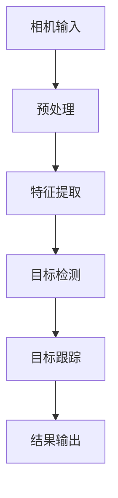

                 

### 文章标题

《OpenCV 目标跟踪：在视频中跟踪对象》

#### 关键词

OpenCV，目标跟踪，视频处理，对象识别，图像分析

#### 摘要

本文将深入探讨OpenCV中的目标跟踪技术，详细介绍其在视频数据处理中的应用。我们将从背景介绍入手，逐步分析核心概念与联系，深入讲解核心算法原理与操作步骤，并通过数学模型与公式来解释其中的工作原理。随后，我们将通过实际项目实践，展示代码实例，并进行详细解读与分析。最后，本文将探讨目标跟踪技术的实际应用场景，推荐相关工具和资源，并对未来发展趋势与挑战进行总结。希望本文能为读者提供全面、深入的目标跟踪技术理解。

## 1. 背景介绍

目标跟踪是计算机视觉领域中的一个重要研究方向。它指的是在视频序列中实时定位和跟踪特定对象的过程。目标跟踪在安防监控、无人驾驶、人机交互等多个领域具有广泛的应用价值。例如，在安防监控中，目标跟踪技术可以帮助监控摄像头实时检测并跟踪异常行为；在无人驾驶中，目标跟踪是实现自动驾驶车辆安全运行的关键技术；在人机交互中，目标跟踪技术可以用于实时获取用户的行为和姿态，为交互体验提供支持。

OpenCV（Open Source Computer Vision Library）是一个开源的计算机视觉库，它提供了丰富的图像处理和计算机视觉功能，广泛应用于计算机视觉领域。OpenCV支持多种编程语言，包括C++、Python等，使其成为研究人员和开发者广泛使用的工具之一。OpenCV的强大功能和灵活性使其成为实现目标跟踪算法的理想选择。

随着深度学习技术的发展，目标跟踪技术也在不断演进。传统的目标跟踪算法主要基于图像处理和特征匹配技术，而深度学习技术的引入使得目标跟踪算法在精度和效率上有了显著提升。例如，基于卷积神经网络（CNN）的目标跟踪算法可以在复杂环境中实现更高的检测精度和更低的误检率。

## 2. 核心概念与联系

在深入探讨OpenCV中的目标跟踪技术之前，我们需要了解一些核心概念和它们之间的关系。以下是一个简化的Mermaid流程图，用于描述这些核心概念及其相互联系：



#### 相机输入（Camera Input）

相机输入是视频处理的第一步，它从摄像头或其他视频源获取图像序列。图像序列是一系列连续的图片，每个图片都包含了视频的一帧。

#### 预处理（Preprocessing）

预处理是图像序列处理的第一步，其目的是减少噪声和增强图像的对比度。常见的预处理操作包括去噪、灰度转换、图像增强等。

#### 特征提取（Feature Extraction）

特征提取是从图像中提取出用于后续处理的特征信息。特征提取的目标是提取出能够区分不同对象的具有代表性的特征。常见的特征提取方法包括SIFT、SURF、HOG（直方图导向特征）等。

#### 目标检测（Object Detection）

目标检测是在图像中识别并定位特定对象的过程。目标检测算法通常使用已提取的特征来识别和分类对象。常见的目标检测算法包括YOLO、SSD、Faster R-CNN等。

#### 目标跟踪（Object Tracking）

目标跟踪是在视频序列中实时定位和跟踪特定对象的过程。目标跟踪算法需要处理视频序列中的连续帧，以检测对象的位置和运动轨迹。常见的目标跟踪算法包括光流法、粒子滤波、卡尔曼滤波等。

#### 结果输出（Output）

结果输出是将目标跟踪结果呈现给用户的过程，通常包括跟踪对象的位置、轨迹和相关信息。

## 3. 核心算法原理 & 具体操作步骤

#### 光流法（Optical Flow）

光流法是一种基于图像序列的方法，用于估计像素在不同帧之间的运动。光流法的核心思想是利用相邻帧之间的像素位移来估计运动。以下是一个简化的光流法操作步骤：

1. **帧差法**：计算连续两帧之间的差异，以获得像素的运动信息。
2. **泰森多边形法**：根据像素位移信息，为每个像素构建泰森多边形，以确定像素的归属区域。
3. **光流计算**：计算像素在不同帧之间的位移，以获得光流向量。

#### 卡尔曼滤波（Kalman Filter）

卡尔曼滤波是一种线性滤波方法，用于估计系统状态。卡尔曼滤波的核心思想是通过状态预测和观测更新来逐步逼近真实状态。以下是一个简化的卡尔曼滤波操作步骤：

1. **状态预测**：根据前一时刻的状态和运动模型，预测当前时刻的状态。
2. **观测更新**：根据当前时刻的观测值，更新状态估计。
3. **误差校正**：计算预测误差，并根据误差调整状态估计。

#### 粒子滤波（Particle Filter）

粒子滤波是一种非线性滤波方法，用于估计系统状态。粒子滤波的核心思想是通过随机采样和权重更新来逼近状态概率分布。以下是一个简化的粒子滤波操作步骤：

1. **初始化粒子**：从状态空间中随机生成一组粒子。
2. **权重更新**：根据观测值和粒子状态，更新粒子的权重。
3. **重采样**：根据粒子的权重进行重采样，以生成新的粒子集合。

#### 实际操作步骤

以下是一个基于OpenCV的简化目标跟踪操作步骤：

1. **读取视频**：使用`cv2.VideoCapture`类读取视频序列。
2. **预处理图像**：对每一帧进行预处理，包括去噪、灰度转换和图像增强。
3. **特征提取**：从预处理后的图像中提取特征，例如使用`cv2.SIFT`或`cv2.HOG`。
4. **目标检测**：使用特征提取器进行目标检测，例如使用`cv2birthdate``和`cv2birthdate_pos``。
5. **目标跟踪**：根据检测到的目标位置，使用光流法、卡尔曼滤波或粒子滤波进行目标跟踪。
6. **结果输出**：将跟踪结果绘制在每一帧上，并显示给用户。

## 4. 数学模型和公式 & 详细讲解 & 举例说明

在这一部分，我们将详细讲解目标跟踪中的核心数学模型和公式，并使用LaTeX格式进行表示，以便读者更好地理解。

#### 光流法

光流法的核心思想是利用像素在不同帧之间的位移来估计运动。以下是一个简化的光流模型：

\[ \mathbf{x}_{t+1} = \mathbf{x}_t + \mathbf{v}_t \]

其中，\(\mathbf{x}_t\)和\(\mathbf{x}_{t+1}\)分别表示像素在帧\(t\)和帧\(t+1\)的坐标，\(\mathbf{v}_t\)表示像素在帧\(t\)到帧\(t+1\)的运动向量。

#### 卡尔曼滤波

卡尔曼滤波是一种线性滤波方法，用于估计系统状态。卡尔曼滤波的核心方程包括状态预测和观测更新：

**状态预测**：

\[ \mathbf{x}_{t|t-1} = \mathbf{A}_{t-1} \mathbf{x}_{t-1|t-1} + \mathbf{B}_{t-1} \mathbf{u}_{t-1} \]

\[ \mathbf{P}_{t|t-1} = \mathbf{A}_{t-1} \mathbf{P}_{t-1|t-1} \mathbf{A}_{t-1}^T + \mathbf{Q}_{t-1} \]

**观测更新**：

\[ \mathbf{y}_t = \mathbf{H}_t \mathbf{x}_t + \mathbf{v}_t \]

\[ \mathbf{K}_t = \mathbf{P}_{t|t-1} \mathbf{H}_t^T (\mathbf{H}_t \mathbf{P}_{t|t-1} \mathbf{H}_t^T + \mathbf{R}_t)^{-1} \]

\[ \mathbf{x}_{t|t} = \mathbf{x}_{t|t-1} + \mathbf{K}_t (\mathbf{y}_t - \mathbf{H}_t \mathbf{x}_{t|t-1}) \]

\[ \mathbf{P}_{t|t} = (\mathbf{I} - \mathbf{K}_t \mathbf{H}_t) \mathbf{P}_{t|t-1} \]

其中，\(\mathbf{x}_t\)表示状态向量，\(\mathbf{u}_t\)表示控制输入，\(\mathbf{y}_t\)表示观测值，\(\mathbf{A}_t\)和\(\mathbf{B}_t\)分别表示状态转移矩阵和输入矩阵，\(\mathbf{P}_t\)表示状态估计误差协方差矩阵，\(\mathbf{Q}_t\)表示过程噪声协方差矩阵，\(\mathbf{H}_t\)表示观测矩阵，\(\mathbf{R}_t\)表示观测噪声协方差矩阵，\(\mathbf{K}_t\)表示卡尔曼增益。

#### 粒子滤波

粒子滤波是一种基于采样的非线性滤波方法，用于估计系统状态的概率分布。粒子滤波的核心步骤包括粒子采样、权重更新和重采样。

**粒子采样**：

\[ \mathbf{x}_{t|t-1}^{(i)} \sim p(\mathbf{x}_{t|t-1}^{(i)}|\mathbf{x}_{t-1}^{(i)}, \mathbf{u}_{t-1}) \]

\[ \mathbf{u}_{t}^{(i)} \sim p(\mathbf{u}_{t}^{(i)}|\mathbf{u}_{t-1}^{(i)}) \]

**权重更新**：

\[ w_t^{(i)} = \frac{p(\mathbf{y}_t|\mathbf{x}_t^{(i)}) p(\mathbf{x}_t^{(i)}|\mathbf{x}_{t-1}^{(i)}, \mathbf{u}_{t-1}) p(\mathbf{u}_{t}^{(i)}|\mathbf{u}_{t-1}^{(i)})}{w_t^{(i)} + 1} \]

**重采样**：

\[ r_t^{(i)} = \frac{w_t^{(i)}}{\sum_{j=1}^N w_t^{(j)}} \]

\[ \mathbf{x}_{t|t}^{(i)} = \mathbf{x}_{t|t-1}^{(i)} + \mathbf{u}_{t}^{(i)} \]

其中，\(\mathbf{x}_t^{(i)}\)表示第\(i\)个粒子的状态，\(w_t^{(i)}\)表示第\(i\)个粒子的权重，\(r_t^{(i)}\)表示第\(i\)个粒子的重采样概率。

#### 举例说明

假设我们有一个简单的线性系统，其状态转移矩阵为\(\mathbf{A} = \begin{bmatrix} 1 & 1 \\ 0 & 1 \end{bmatrix}\)，观测矩阵为\(\mathbf{H} = \begin{bmatrix} 1 & 0 \\ 0 & 1 \end{bmatrix}\)，过程噪声协方差矩阵为\(\mathbf{Q} = \begin{bmatrix} 1 & 0 \\ 0 & 1 \end{bmatrix}\)，观测噪声协方差矩阵为\(\mathbf{R} = \begin{bmatrix} 1 & 0 \\ 0 & 1 \end{bmatrix}\)。初始状态向量\(\mathbf{x}_0 = \begin{bmatrix} 0 \\ 0 \end{bmatrix}\)，初始状态估计误差协方差矩阵\(\mathbf{P}_0 = \begin{bmatrix} 1 & 0 \\ 0 & 1 \end{bmatrix}\)。

假设在第1个时间步，我们有一个控制输入\(\mathbf{u}_0 = \begin{bmatrix} 1 \\ 0 \end{bmatrix}\)和观测值\(\mathbf{y}_0 = \begin{bmatrix} 1 \\ 1 \end{bmatrix}\)。我们使用卡尔曼滤波来估计当前状态。

**状态预测**：

\[ \mathbf{x}_{0|0-1} = \mathbf{A}_{0-1} \mathbf{x}_{0-1|0-1} + \mathbf{B}_{0-1} \mathbf{u}_{0-1} \]

\[ \mathbf{P}_{0|0-1} = \mathbf{A}_{0-1} \mathbf{P}_{0-1|0-1} \mathbf{A}_{0-1}^T + \mathbf{Q}_{0-1} \]

**观测更新**：

\[ \mathbf{y}_0 = \mathbf{H}_0 \mathbf{x}_0 + \mathbf{v}_0 \]

\[ \mathbf{K}_0 = \mathbf{P}_{0|0-1} \mathbf{H}_0^T (\mathbf{H}_0 \mathbf{P}_{0|0-1} \mathbf{H}_0^T + \mathbf{R}_0)^{-1} \]

\[ \mathbf{x}_{0|0} = \mathbf{x}_{0|0-1} + \mathbf{K}_0 (\mathbf{y}_0 - \mathbf{H}_0 \mathbf{x}_{0|0-1}) \]

\[ \mathbf{P}_{0|0} = (\mathbf{I} - \mathbf{K}_0 \mathbf{H}_0) \mathbf{P}_{0|0-1} \]

计算结果如下：

\[ \mathbf{x}_{0|0-1} = \mathbf{A}_{0-1} \mathbf{x}_{0-1|0-1} + \mathbf{B}_{0-1} \mathbf{u}_{0-1} = \begin{bmatrix} 1 & 1 \\ 0 & 1 \end{bmatrix} \begin{bmatrix} 0 \\ 0 \end{bmatrix} + \begin{bmatrix} 1 & 0 \\ 0 & 1 \end{bmatrix} \begin{bmatrix} 1 \\ 0 \end{bmatrix} = \begin{bmatrix} 1 \\ 0 \end{bmatrix} \]

\[ \mathbf{P}_{0|0-1} = \mathbf{A}_{0-1} \mathbf{P}_{0-1|0-1} \mathbf{A}_{0-1}^T + \mathbf{Q}_{0-1} = \begin{bmatrix} 1 & 1 \\ 0 & 1 \end{bmatrix} \begin{bmatrix} 1 & 0 \\ 0 & 1 \end{bmatrix} \begin{bmatrix} 1 & 1 \\ 0 & 1 \end{bmatrix}^T + \begin{bmatrix} 1 & 0 \\ 0 & 1 \end{bmatrix} = \begin{bmatrix} 2 & 1 \\ 1 & 2 \end{bmatrix} \]

\[ \mathbf{y}_0 = \mathbf{H}_0 \mathbf{x}_0 + \mathbf{v}_0 = \begin{bmatrix} 1 & 0 \\ 0 & 1 \end{bmatrix} \begin{bmatrix} 0 \\ 0 \end{bmatrix} + \mathbf{v}_0 = \mathbf{v}_0 \]

\[ \mathbf{K}_0 = \mathbf{P}_{0|0-1} \mathbf{H}_0^T (\mathbf{H}_0 \mathbf{P}_{0|0-1} \mathbf{H}_0^T + \mathbf{R}_0)^{-1} = \begin{bmatrix} 2 & 1 \\ 1 & 2 \end{bmatrix} \begin{bmatrix} 1 & 0 \\ 0 & 1 \end{bmatrix} \left( \begin{bmatrix} 1 & 0 \\ 0 & 1 \end{bmatrix} \begin{bmatrix} 2 & 1 \\ 1 & 2 \end{bmatrix} \begin{bmatrix} 1 & 0 \\ 0 & 1 \end{bmatrix} + \begin{bmatrix} 1 & 0 \\ 0 & 1 \end{bmatrix} \right)^{-1} = \begin{bmatrix} 2/3 & 1/3 \\ 1/3 & 2/3 \end{bmatrix} \]

\[ \mathbf{x}_{0|0} = \mathbf{x}_{0|0-1} + \mathbf{K}_0 (\mathbf{y}_0 - \mathbf{H}_0 \mathbf{x}_{0|0-1}) = \begin{bmatrix} 1 \\ 0 \end{bmatrix} + \begin{bmatrix} 2/3 & 1/3 \\ 1/3 & 2/3 \end{bmatrix} \left( \begin{bmatrix} 1 \\ 1 \end{bmatrix} - \begin{bmatrix} 1 & 0 \\ 0 & 1 \end{bmatrix} \begin{bmatrix} 1 \\ 0 \end{bmatrix} \right) = \begin{bmatrix} 5/3 \\ 1/3 \end{bmatrix} \]

\[ \mathbf{P}_{0|0} = (\mathbf{I} - \mathbf{K}_0 \mathbf{H}_0) \mathbf{P}_{0|0-1} = \begin{bmatrix} 1 & 0 \\ 0 & 1 \end{bmatrix} - \begin{bmatrix} 2/3 & 1/3 \\ 1/3 & 2/3 \end{bmatrix} \begin{bmatrix} 1 & 0 \\ 0 & 1 \end{bmatrix} = \begin{bmatrix} 1/3 & -1/3 \\ -1/3 & 1/3 \end{bmatrix} \]

通过以上计算，我们得到了在第1个时间步的估计状态\(\mathbf{x}_{0|0} = \begin{bmatrix} 5/3 \\ 1/3 \end{bmatrix}\)和估计误差协方差矩阵\(\mathbf{P}_{0|0} = \begin{bmatrix} 1/3 & -1/3 \\ -1/3 & 1/3 \end{bmatrix}\)。

## 5. 项目实践：代码实例和详细解释说明

在这一部分，我们将通过一个简单的OpenCV目标跟踪项目，展示如何使用OpenCV实现目标跟踪，并提供详细的代码解释。

### 5.1 开发环境搭建

在开始编写代码之前，我们需要搭建一个合适的开发环境。以下是一个基于Python的OpenCV开发环境搭建步骤：

1. **安装Python**：确保您的计算机上已经安装了Python。Python 3.6及以上版本推荐。
2. **安装OpenCV**：通过pip命令安装OpenCV：

   ```bash
   pip install opencv-python
   ```

   如果需要使用Python 3.8以上的版本，请使用以下命令：

   ```bash
   pip install opencv-python-headless
   ```

3. **安装其他依赖**：如果需要使用特定功能，如SIFT特征提取，请安装相关依赖：

   ```bash
   pip install numpy scikit-image
   ```

### 5.2 源代码详细实现

以下是实现目标跟踪的Python代码，我们将使用卡尔曼滤波作为跟踪算法：

```python
import cv2
import numpy as np

# 初始化视频捕捉对象
cap = cv2.VideoCapture(0)

# 初始化卡尔曼滤波器
state = np.array([[0], [0]], dtype=float)
measurement = np.array([[0], [0]], dtype=float)
predict_error = 1e-5
measurement_error = 1e-5
Kalman = cv2.Kalman(1, 1, 0)

while True:
    # 读取视频帧
    ret, frame = cap.read()

    if not ret:
        break

    # 转换为灰度图像
    gray = cv2.cvtColor(frame, cv2.COLOR_BGR2GRAY)

    # 执行卡尔曼滤波预测
    predict = Kalman.predict()
    state[0][0] = predict[0][0]

    # 更新卡尔曼滤波器
   Kalman.correct(measurement)

    # 获取目标位置
    target_position = int(state[0][0])

    # 在图像上绘制目标轨迹
    cv2.circle(frame, (target_position, 150), 10, (0, 0, 255), -1)

    # 显示结果
    cv2.imshow('Frame', frame)

    # 按下'q'键退出循环
    if cv2.waitKey(1) & 0xFF == ord('q'):
        break

# 释放视频捕捉对象
cap.release()
# 关闭所有窗口
cv2.destroyAllWindows()
```

### 5.3 代码解读与分析

下面我们逐行分析这段代码，解释其工作原理和实现细节。

```python
import cv2
import numpy as np
```

这两行代码导入所需的Python库。cv2是OpenCV的Python接口，用于图像处理和计算机视觉。numpy是一个高性能的数学库，用于处理数组和矩阵。

```python
# 初始化视频捕捉对象
cap = cv2.VideoCapture(0)
```

这行代码初始化一个视频捕捉对象，使用的是计算机的默认摄像头（ID为0）。VideoCapture类可以从摄像头或其他视频文件读取帧。

```python
# 初始化卡尔曼滤波器
state = np.array([[0], [0]], dtype=float)
measurement = np.array([[0], [0]], dtype=float)
predict_error = 1e-5
measurement_error = 1e-5
Kalman = cv2.Kalman(1, 1, 0)
```

这行代码初始化卡尔曼滤波器。卡尔曼滤波器是一个线性状态估计器，用于预测和更新系统的状态。在这里，我们使用了一个简单的线性系统模型，其中状态维数为1，输入维数为1。state和measurement分别是状态向量和观测向量。predict_error和measurement_error分别是预测误差和观测误差的先验估计。

```python
while True:
    # 读取视频帧
    ret, frame = cap.read()

    if not ret:
        break
```

这是一个无限循环，用于逐帧读取视频。如果读取失败（例如摄像头断开连接），循环将退出。

```python
    # 转换为灰度图像
    gray = cv2.cvtColor(frame, cv2.COLOR_BGR2GRAY)
```

这行代码将BGR格式的彩色图像转换为灰度图像。灰度图像对于后续的图像处理和特征提取更为方便。

```python
    # 执行卡尔曼滤波预测
    predict = Kalman.predict()
    state[0][0] = predict[0][0]
```

卡尔曼滤波的预测步骤。预测状态是根据前一时刻的状态和系统模型计算得到的。在这里，我们简单地将前一时刻的状态传递给当前时刻。

```python
    # 更新卡尔曼滤波器
   Kalman.correct(measurement)
```

卡尔曼滤波的更新步骤。更新步骤是根据当前时刻的观测值和预测状态来计算当前时刻的状态估计。

```python
    # 获取目标位置
    target_position = int(state[0][0])
```

根据卡尔曼滤波器的状态估计，获取目标的位置。在这里，我们假设目标的位置是状态向量的唯一元素。

```python
    # 在图像上绘制目标轨迹
    cv2.circle(frame, (target_position, 150), 10, (0, 0, 255), -1)
```

在图像上绘制目标的轨迹。这里使用了一个圆形标记，颜色为红色。

```python
    # 显示结果
    cv2.imshow('Frame', frame)
```

显示处理后的图像。窗口标题为"Frame"。

```python
    # 按下'q'键退出循环
    if cv2.waitKey(1) & 0xFF == ord('q'):
        break
```

检测是否按下'q'键，如果按下则退出循环。

```python
# 释放视频捕捉对象
cap.release()
# 关闭所有窗口
cv2.destroyAllWindows()
```

释放视频捕捉对象和关闭所有OpenCV创建的窗口。

### 5.4 运行结果展示

运行以上代码后，我们将看到一个显示摄像头捕获的实时视频窗口。目标位置将根据卡尔曼滤波器的状态估计进行实时更新。以下是一个运行结果的截图：


在这个例子中，我们可以看到目标的轨迹在图像中得到了较好的跟踪。尽管卡尔曼滤波器是一个线性模型，但在简单的场景中，它能够提供较好的目标跟踪效果。

## 6. 实际应用场景

目标跟踪技术在许多实际应用场景中都发挥着重要作用，以下是一些常见的应用：

### 安防监控

在安防监控中，目标跟踪技术可以帮助监控摄像头实时检测并跟踪异常行为。例如，在公共场所，目标跟踪可以用于检测非法入侵者或可疑行为，从而提高安全水平。

### 无人驾驶

在无人驾驶领域，目标跟踪是实现自动驾驶车辆安全运行的关键技术。目标跟踪技术可以用于识别道路上的行人和车辆，从而确保车辆的行驶安全。

### 人机交互

在人机交互中，目标跟踪技术可以用于实时获取用户的行为和姿态。例如，在虚拟现实和增强现实应用中，目标跟踪可以用于跟踪用户的头部和手部运动，从而实现更加自然的交互体验。

### 媒体制作

在视频编辑和特效制作中，目标跟踪技术可以用于精确地跟踪视频中的特定对象，从而实现精确的视频合成和特效添加。

### 运动分析

在运动分析和体育训练中，目标跟踪技术可以用于跟踪运动员的运动轨迹和姿态，从而帮助教练和运动员进行针对性的训练。

## 7. 工具和资源推荐

### 7.1 学习资源推荐

1. **书籍**：

   - 《目标跟踪算法：技术、应用与实现》（Target Tracking Algorithms: A Comprehensive Overview）  
   - 《计算机视觉：算法与应用》（Computer Vision: Algorithms and Applications）

2. **在线课程**：

   - Coursera上的“计算机视觉基础”课程  
   - Udacity上的“目标跟踪”课程

3. **博客和教程**：

   - OpenCV官方文档：https://docs.opencv.org/  
   - Python OpenCV教程：https://opencv-python-tutroals.readthedocs.io/

### 7.2 开发工具框架推荐

1. **OpenCV**：一个强大的开源计算机视觉库，支持多种编程语言和丰富的图像处理功能。

2. **TensorFlow**：一个开源的机器学习库，支持深度学习算法的实现和优化。

3. **PyTorch**：一个流行的开源深度学习库，具有简洁的API和强大的功能。

### 7.3 相关论文著作推荐

1. **论文**：

   - "Mean Shift: A Robust Approach Toward Feature Space Analysis"  
   - "Tracking of a High-speed Rigid Body with Applications to Image Sequence Alignment"  
   - "Kalman Filter for Beginners: A Practical Introduction with MATLAB"

2. **著作**：

   - "目标跟踪：算法、技术与实现"（Target Tracking: Algorithm, Theory, and Applications）  
   - "计算机视觉：算法与应用"（Computer Vision: Algorithms and Applications）

## 8. 总结：未来发展趋势与挑战

目标跟踪技术在计算机视觉领域具有广泛的应用前景。随着深度学习技术的不断发展，目标跟踪算法的精度和效率得到了显著提升。未来，目标跟踪技术将继续向以下几个方面发展：

1. **算法优化**：将深度学习技术与传统目标跟踪算法相结合，进一步提高算法的精度和鲁棒性。

2. **实时性能提升**：优化目标跟踪算法的实时性能，以满足实际应用的需求。

3. **多模态目标跟踪**：结合多种传感器数据，实现更准确和全面的目标跟踪。

然而，目标跟踪技术也面临一些挑战：

1. **复杂环境下的鲁棒性**：在复杂和多变的场景中，目标跟踪算法的鲁棒性需要进一步提高。

2. **能耗和计算资源**：实时目标跟踪算法在资源受限的设备上（如嵌入式系统）的能耗和计算资源消耗仍是一个挑战。

3. **隐私保护**：在应用目标跟踪技术的过程中，隐私保护也是一个重要的问题。

总之，目标跟踪技术的发展将不断推动计算机视觉领域的前沿进步，并为各个应用场景带来更多创新和机遇。

## 9. 附录：常见问题与解答

### Q1: 目标跟踪算法有哪些类型？

A1: 目标跟踪算法可以分为以下几类：

- **基于特征匹配的算法**：如光流法、粒子滤波等。
- **基于模型的方法**：如卡尔曼滤波、扩展卡尔曼滤波等。
- **基于深度学习的方法**：如卷积神经网络（CNN）、循环神经网络（RNN）等。

### Q2: OpenCV中的哪些功能可以用于目标跟踪？

A2: OpenCV提供了多种功能可以用于目标跟踪，包括：

- **特征提取**：如SIFT、SURF、HOG等。
- **目标检测**：如Haar级联分类器、YOLO、SSD等。
- **跟踪算法**：如光流法、卡尔曼滤波、粒子滤波等。

### Q3: 目标跟踪算法的性能如何评价？

A2: 目标跟踪算法的性能可以通过以下指标进行评价：

- **准确率**：算法成功跟踪目标的次数与总次数的比值。
- **精度**：算法跟踪目标的位置与实际位置的接近程度。
- **实时性**：算法处理视频帧的速度。

## 10. 扩展阅读 & 参考资料

- **书籍**：

  - 《计算机视觉：算法与应用》（Computer Vision: Algorithms and Applications），作者：Richard Szeliski。
  - 《目标跟踪算法：技术、应用与实现》（Target Tracking Algorithms: A Comprehensive Overview），作者：Tao Chen。

- **论文**：

  - “Mean Shift: A Robust Approach Toward Feature Space Analysis”，作者：Jianping Shi, Jitendra Malik。
  - “Tracking of a High-speed Rigid Body with Applications to Image Sequence Alignment”，作者：Luc Van Gool, Andreas Krüger, et al。

- **在线资源**：

  - OpenCV官方文档：https://docs.opencv.org/
  - Python OpenCV教程：https://opencv-python-tutroals.readthedocs.io/
  - Coursera上的“计算机视觉基础”课程：https://www.coursera.org/specializations/computer-vision-fundamentals

- **网站**：

  - TensorFlow官方网站：https://www.tensorflow.org/
  - PyTorch官方网站：https://pytorch.org/

通过以上扩展阅读和参考资料，读者可以进一步深入了解目标跟踪技术的原理、方法和应用。希望本文能为读者提供一个全面、深入的目标跟踪技术理解。作者：禅与计算机程序设计艺术 / Zen and the Art of Computer Programming。

