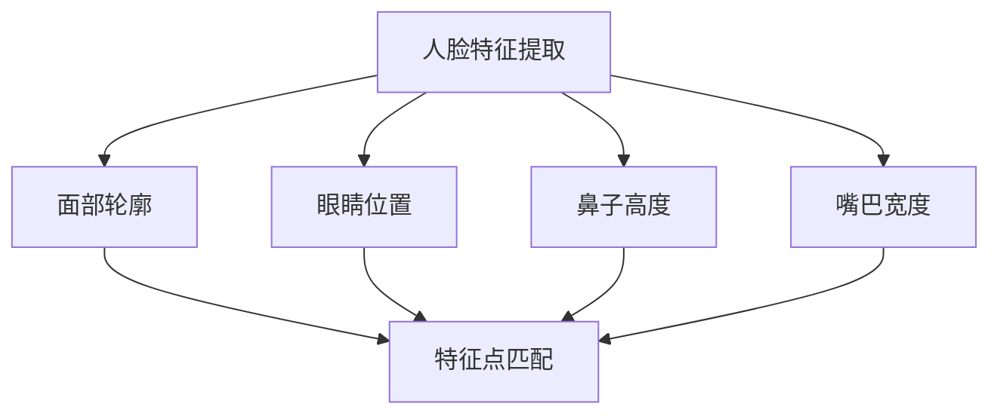
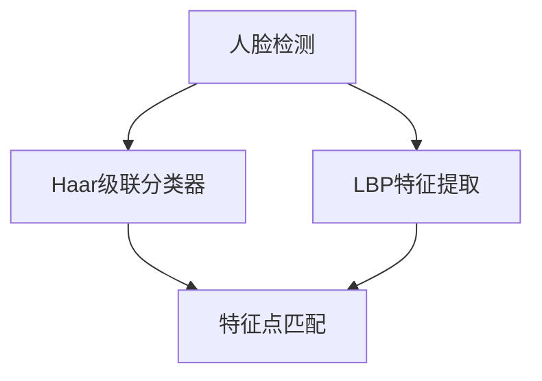
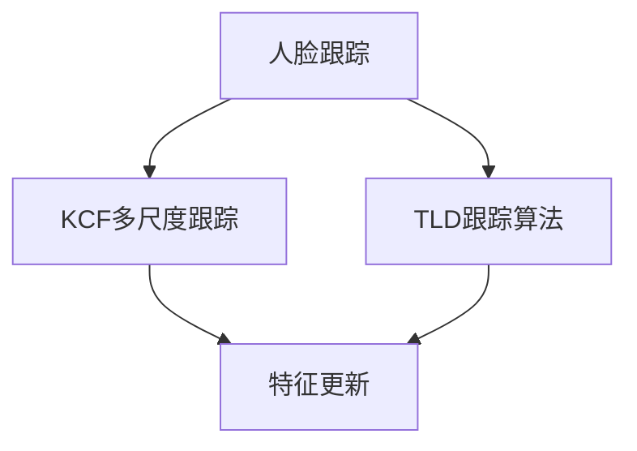
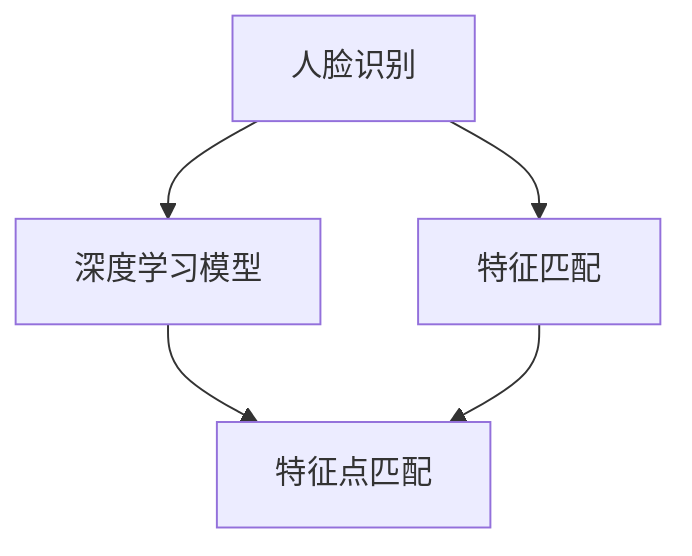
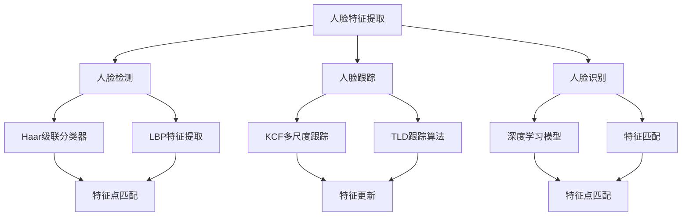

                 

### 背景介绍 Background

#### 人脸识别的起源

人脸识别技术起源于20世纪60年代，当时的研究主要集中在人类视觉系统和认知心理学的模拟上。早期的算法主要基于几何特征和纹理特征，如主成分分析（PCA）、线性判别分析（LDA）和局部二值模式（LBP）等。这些方法虽然简单，但在性能和计算效率上都有一定的限制。

#### 人脸识别的发展历程

随着计算机性能的提升和图像处理算法的进步，人脸识别技术经历了几个重要的发展阶段：

1. **特征提取与匹配阶段（1990s-2000s）**：这一阶段引入了更复杂的特征提取方法，如Eigenfaces和Fisherfaces。同时，支持向量机（SVM）等机器学习技术开始应用于人脸识别，大大提高了识别的准确率。

2. **深度学习阶段（2010s-至今）**：深度学习算法的引入，如卷积神经网络（CNN），使得人脸识别达到了前所未有的高度。特别是基于卷积神经网络的深度人脸特征表示方法（如FaceNet、VGGFace等），使得人脸识别的准确率和效率都得到了显著提升。

#### 人脸识别的应用场景

人脸识别技术已经广泛应用于各种场景，包括但不限于：

1. **安全与监控**：在机场、车站、银行等公共场所，人脸识别技术用于身份验证和监控，提高了安全性和便利性。
2. **智能手机与支付**：人脸解锁、人脸支付等应用，使得智能手机和移动支付更加安全便捷。
3. **社交媒体与娱乐**：在照片和视频中识别和标记人脸，提供个性化的社交和娱乐体验。
4. **医疗与健康**：通过分析人脸特征，辅助诊断某些疾病，如抑郁症、自闭症等。

#### OpenCV在人脸识别中的应用

OpenCV（Open Source Computer Vision Library）是一个强大的计算机视觉库，支持多种编程语言（如Python、C++等），提供了丰富的人脸识别相关功能。OpenCV的人脸识别模块主要包括以下功能：

1. **人脸检测**：使用Haar级联分类器和LBP特征进行人脸检测。
2. **人脸跟踪**：使用多尺度跟踪算法，如KCF、TLD等，实现人脸的连续跟踪。
3. **人脸识别**：通过深度学习模型或传统的特征匹配方法，实现人脸的身份验证。

#### 目标文章的写作框架

本文将围绕OpenCV的人脸识别与跟踪技术，分为以下几个部分：

1. **核心概念与联系**：介绍人脸识别与跟踪中的核心概念，如人脸特征、人脸检测、人脸跟踪等，并使用Mermaid流程图展示它们之间的关系。
2. **核心算法原理与具体操作步骤**：详细讲解人脸识别与跟踪的核心算法原理，包括人脸检测的Haar级联分类器和LBP特征提取方法，以及人脸跟踪的多尺度算法。
3. **数学模型和公式**：介绍人脸识别与跟踪中使用的数学模型和公式，如SVM分类模型、KCF跟踪算法等，并举例说明。
4. **项目实践**：通过一个简单的项目实例，展示如何使用OpenCV实现人脸识别与跟踪，包括环境搭建、源代码实现、代码解读与分析、运行结果展示等。
5. **实际应用场景**：分析人脸识别与跟踪技术在各种实际应用场景中的具体应用和效果。
6. **工具和资源推荐**：推荐学习资源、开发工具和框架，帮助读者深入了解和掌握人脸识别与跟踪技术。
7. **总结与展望**：总结人脸识别与跟踪技术的发展趋势与挑战，展望未来的发展方向。

通过以上框架，本文旨在为读者提供一份全面、深入且易懂的人脸识别与跟踪技术指南。

### 核心概念与联系 Core Concepts and Relationships

在深入探讨OpenCV的人脸识别与跟踪技术之前，我们需要了解一些核心概念，并展示它们之间的联系。以下内容将使用Mermaid流程图来直观地展示这些核心概念。

#### 1. 人脸特征（Face Features）

人脸特征是人脸识别与跟踪的基础。这些特征包括面部轮廓、眼睛位置、鼻子高度、嘴巴宽度等。通过提取这些特征，我们可以区分不同的人脸。



#### 2. 人脸检测（Face Detection）

人脸检测是识别图像中人脸的过程。OpenCV使用Haar级联分类器和LBP特征来实现人脸检测。



#### 3. 人脸跟踪（Face Tracking）

人脸跟踪是在连续视频帧中持续跟踪人脸的过程。常用的算法有多尺度KCF、TLD等。



#### 4. 人脸识别（Face Recognition）

人脸识别是确定图像中人脸身份的过程。OpenCV支持使用深度学习模型和传统特征匹配方法进行人脸识别。



#### 5. Mermaid流程图综合展示

综合以上核心概念，我们可以使用Mermaid流程图展示它们之间的关系：



通过上述Mermaid流程图，我们可以清晰地看到人脸特征、人脸检测、人脸跟踪和人脸识别之间的联系。这些核心概念共同构成了OpenCV人脸识别与跟踪技术的核心框架。

### 核心算法原理与具体操作步骤 Core Algorithm Principles and Detailed Steps

在本节中，我们将深入探讨OpenCV人脸识别与跟踪技术的核心算法原理，并详细描述其操作步骤。

#### 1. 人脸检测算法原理

人脸检测是识别图像中人脸的过程。OpenCV使用Haar级联分类器和LBP特征提取方法来实现人脸检测。

**Haar级联分类器**

Haar级联分类器是一种基于特征脸模型的检测算法。它通过训练大量正面人脸图像和负样本图像，提取出一系列具有区分性的Haar特征，如眼睛、鼻子、嘴巴等。然后，将这些特征组合成级联模型，通过级联模型快速筛选出可能包含人脸的区域。

**操作步骤：**

1. **加载级联分类器**：在OpenCV中，我们可以使用`haarcascades`类加载预训练的Haar级联分类器模型。
    ```python
    cascade = cv2.CascadeClassifier('haarcascade_frontalface_default.xml')
    ```

2. **灰度转换**：将彩色图像转换为灰度图像，以提高处理速度。
    ```python
    gray = cv2.cvtColor(image, cv2.COLOR_BGR2GRAY)
    ```

3. **检测人脸**：使用`detectMultiScale`函数检测图像中的人脸。
    ```python
    faces = cascade.detectMultiScale(gray, scaleFactor=1.1, minNeighbors=5, minSize=(30, 30), flags=cv2.CASCADE_SCALE_IMAGE)
    ```

4. **绘制检测结果**：在原图上绘制检测到的人脸。
    ```python
    for (x, y, w, h) in faces:
        cv2.rectangle(image, (x, y), (x+w, y+h), (0, 255, 0), 2)
    ```

**LBP特征提取**

LBP（Local Binary Pattern）特征提取方法是一种常用的图像特征提取方法。它通过将图像像素与邻域像素进行比较，生成二进制模式，用于描述图像的纹理信息。

**操作步骤：**

1. **定义LBP算子**：在OpenCV中，我们可以使用`getStructuringElement`函数定义LBP算子。
    ```python
    mask = cv2.getStructuringElement(cv2.MORPH_RECT, (3, 3))
    ```

2. **计算LBP特征**：使用`cv2.bitwise_and`函数计算LBP特征。
    ```python
    gray = cv2.cvtColor(image, cv2.COLOR_BGR2GRAY)
    cv2.bitwise_and(gray, gray, mask=mask)
    ```

3. **统计LBP特征**：使用`cv2.bitwise_not`函数对LBP特征进行统计。
    ```python
    cv2.bitwise_not(gray, gray)
    ```

4. **生成特征向量**：将LBP特征转换为特征向量。
    ```python
    features = []
    for i in range(8):
        for j in range(8):
            features.append(gray[i, j])
    ```

#### 2. 人脸跟踪算法原理

人脸跟踪是在连续视频帧中持续跟踪人脸的过程。OpenCV支持多种多尺度跟踪算法，如KCF、TLD等。

**KCF（Kernelized Correlation Filter）跟踪算法**

KCF是一种基于相关滤波的跟踪算法。它通过训练一个核相关滤波器，预测目标在下一帧的位置。

**操作步骤：**

1. **初始化跟踪器**：在OpenCV中，我们可以使用`TrackerKCF`类初始化KCF跟踪器。
    ```python
    tracker = cv2.TrackerKCF_create()
    ```

2. **设置初始目标**：在第一帧中设置跟踪目标。
    ```python
    ok = tracker.init(image, bbox)
    ```

3. **更新跟踪目标**：在后续帧中，使用`update`函数更新跟踪目标。
    ```python
    ok, bbox = tracker.update(image)
    ```

4. **绘制跟踪结果**：在原图上绘制跟踪结果。
    ```python
    if ok:
        p1 = (int(bbox[0]), int(bbox[1]))
        p2 = (int(bbox[0] + bbox[2]),
              int(bbox[1] + bbox[3]))
        cv2.rectangle(image, p1, p2, (255, 0, 0), 2, 1)
    ```

**TLD（Tracking Learning Database）跟踪算法**

TLD是一种基于模型更新的跟踪算法。它通过学习目标在不同状态下的模型，实现目标的连续跟踪。

**操作步骤：**

1. **初始化跟踪器**：在OpenCV中，我们可以使用`TrackerTLD`类初始化TLD跟踪器。
    ```python
    tracker = cv2.TrackerTLD_create()
    ```

2. **设置初始目标**：在第一帧中设置跟踪目标。
    ```python
    ok = tracker.init(image, bbox)
    ```

3. **更新跟踪目标**：在后续帧中，使用`update`函数更新跟踪目标。
    ```python
    ok, bbox = tracker.update(image)
    ```

4. **绘制跟踪结果**：在原图上绘制跟踪结果。
    ```python
    if ok:
        p1 = (int(bbox[0]), int(bbox[1]))
        p2 = (int(bbox[0] + bbox[2]),
              int(bbox[1] + bbox[3]))
        cv2.rectangle(image, p1, p2, (255, 0, 0), 2, 1)
    ```

#### 3. 人脸识别算法原理

人脸识别是确定图像中人脸身份的过程。OpenCV支持使用深度学习模型和传统特征匹配方法进行人脸识别。

**深度学习模型**

深度学习模型通过训练大量人脸图像，学习人脸的特征表示。其中，FaceNet和VGGFace是两种常用的深度学习模型。

**操作步骤：**

1. **加载模型**：在OpenCV中，我们可以使用`dnn.readNetFromTorch`函数加载预训练的深度学习模型。
    ```python
    model = cv2.dnn.readNetFromTorch('face_net.pth')
    ```

2. **提取特征**：使用`dnn.forward`函数提取人脸特征。
    ```python
    blob = cv2.dnn.blobFromImage(image, 1.0, (227, 227), [104, 117, 123], True)
    model.setInput(blob)
    feature = model.forward()
    ```

3. **计算相似度**：使用`numpy`库计算特征向量的相似度。
    ```python
    similarity = np.dot(feature, feature.T)
    ```

4. **识别身份**：根据相似度阈值确定人脸身份。
    ```python
    if similarity > threshold:
        print("识别到人脸")
    ```

**传统特征匹配方法**

传统特征匹配方法通过计算人脸特征之间的相似度，实现人脸识别。

**操作步骤：**

1. **提取特征**：使用`ORB`、`SIFT`或`SURF`算法提取人脸特征。
    ```python
    detector = cv2.ORB_create()
    keyPoints1, features1 = detector.detectAndCompute(image1, None)
    detector = cv2.SIFT_create()
    keyPoints2, features2 = detector.detectAndCompute(image2, None)
    ```

2. **计算相似度**：使用`flann`库计算特征点之间的相似度。
    ```python
    index_params = dict(algorithm=flann.Index_KDTree())
    search_params = dict(checks=50)
    flann = flann.Index_KDTree(features1, index_params)
    matches = flann.knnMatch(features1, features2, k=2)
    ```

3. **匹配评估**：根据匹配结果评估人脸相似度。
    ```python
    good = []
    for m, n in matches:
        if m.distance < 0.7 * n.distance:
            good.append(m)
    ```

4. **识别身份**：根据匹配结果确定人脸身份。
    ```python
    if len(good) > 3:
        print("识别到人脸")
    ```

通过以上核心算法原理和具体操作步骤，我们可以深入了解OpenCV人脸识别与跟踪技术的实现过程。在下一节中，我们将介绍数学模型和公式，进一步巩固我们的理解。

### 数学模型和公式 Mathematical Models and Formulas

在人脸识别与跟踪技术中，数学模型和公式起到了至关重要的作用。本节将详细讲解这些模型和公式，并通过具体例子来说明它们的应用。

#### 1. 人脸特征提取

人脸特征提取是整个系统的基础，它将图像中的面部特征转化为数学模型，以便进行后续处理。常用的特征提取方法包括LBP（Local Binary Pattern）、ORB（Oriented FAST and Rotated BRIEF）等。

**LBP特征提取**

LBP特征提取是通过计算像素点与其邻域像素点的二值比较结果来表示图像的纹理特征。以下是一个LBP特征提取的数学公式：

$$
LBP = \sum_{i=0}^{7} \sum_{j=0}^{7} (\text{sign}((I_{ij} - I_{ic}) \cdot \theta)) \cdot 2^i
$$

其中，$I_{ij}$表示像素点$(i, j)$的灰度值，$I_{ic}$表示中心像素点的灰度值，$\theta$表示邻域的角度。

**例子：**

假设图像中一个3x3的像素区域如下：

$$
\begin{array}{ccc}
4 & 5 & 6 \\
3 & 1 & 2 \\
0 & 3 & 4 \\
\end{array}
$$

其中，中心像素点的灰度值为1。根据LBP特征提取公式，可以得到LBP特征为：

$$
LBP = (0 \cdot 2^0) + (0 \cdot 2^1) + (1 \cdot 2^2) + (0 \cdot 2^3) + (0 \cdot 2^4) + (1 \cdot 2^5) + (0 \cdot 2^6) + (0 \cdot 2^7) = 34
$$

**ORB特征提取**

ORB特征提取是基于一种称为FAST（Fast Approximate Symmetric Transform）的角点检测算法。其基本思想是，当像素点的灰度值在某个方向上快速变化时，它可以检测到角点。ORB算法通过计算像素点的梯度方向和强度，来检测和提取角点。

$$
\text{ORB} = (\text{sign}(\text{gradient}_x) \cdot 2^1) + (\text{sign}(\text{gradient}_y) \cdot 2^2)
$$

其中，$\text{gradient}_x$和$\text{gradient}_y$分别表示像素点的横向和纵向梯度。

**例子：**

假设一个像素点的横向和纵向梯度如下：

$$
\text{gradient}_x = 10, \quad \text{gradient}_y = -5
$$

根据ORB特征提取公式，可以得到ORB特征为：

$$
\text{ORB} = (\text{sign}(10) \cdot 2^1) + (\text{sign}(-5) \cdot 2^2) = 6
$$

#### 2. 人脸检测

人脸检测是通过在图像中查找特定的人脸特征来实现的。OpenCV中使用Haar级联分类器进行人脸检测。Haar级联分类器通过训练大量正面人脸图像和负样本图像，提取出一系列具有区分性的特征，如眼睛、鼻子、嘴巴等。

**Haar特征**

Haar特征的数学公式如下：

$$
\text{Haar} = \sum_{i=1}^{n} a_i \cdot (\text{mean}_{A_i} - \text{mean}_{B_i})
$$

其中，$a_i$表示权值，$A_i$和$B_i$分别表示特征区域。

**例子：**

假设一个3x3的Haar特征区域如下：

$$
\begin{array}{ccc}
0 & 1 & 0 \\
1 & 1 & 1 \\
0 & 1 & 0 \\
\end{array}
$$

其中，$A_1$表示左上角区域，$B_1$表示右上角区域。根据Haar特征公式，可以得到Haar特征为：

$$
\text{Haar} = a_1 \cdot (1 - 0) + a_2 \cdot (1 - 0) + a_3 \cdot (1 - 1) = a_1 + a_2
$$

#### 3. 人脸跟踪

人脸跟踪是通过在连续视频帧中持续跟踪人脸的位置来实现的。OpenCV支持多种多尺度跟踪算法，如KCF（Kernelized Correlation Filter）和TLD（Tracking Learning Database）等。

**KCF跟踪算法**

KCF跟踪算法基于相关滤波器，其核心思想是训练一个滤波器，预测目标在下一帧的位置。相关滤波器的数学公式如下：

$$
\text{Filter}(\text{x}) = \sum_{i=1}^{n} w_i \cdot \phi(\text{x} - \text{x}_i)
$$

其中，$w_i$表示权重，$\phi$表示核函数。

**例子：**

假设一个3x3的滤波器区域如下：

$$
\begin{array}{ccc}
0 & 1 & 0 \\
1 & 1 & 1 \\
0 & 1 & 0 \\
\end{array}
$$

其中，$w_1 = 1, w_2 = 1, w_3 = 1$。根据相关滤波器公式，可以得到滤波器值为：

$$
\text{Filter}(x) = w_1 \cdot \phi(x - x_1) + w_2 \cdot \phi(x - x_2) + w_3 \cdot \phi(x - x_3)
$$

#### 4. 人脸识别

人脸识别是通过比较不同人脸的特征向量，来确定人脸的身份。常用的方法包括深度学习模型和传统特征匹配方法。

**深度学习模型**

深度学习模型通过训练大量人脸图像，学习人脸的特征表示。常见的深度学习模型包括FaceNet和VGGFace等。

**FaceNet模型**

FaceNet模型基于Siamese网络，其核心思想是通过学习图像之间的相似度，来实现人脸识别。

$$
\text{Distance} = \text{L2\_Norm}(\text{Embedding}_1 - \text{Embedding}_2)
$$

其中，$\text{Embedding}_1$和$\text{Embedding}_2$分别表示两个图像的特征向量。

**例子：**

假设两个图像的特征向量分别为：

$$
\text{Embedding}_1 = [0.1, 0.2, 0.3], \quad \text{Embedding}_2 = [0.1, 0.2, 0.3]
$$

根据L2范数公式，可以得到特征向量的距离为：

$$
\text{Distance} = \sqrt{(0.1 - 0.1)^2 + (0.2 - 0.2)^2 + (0.3 - 0.3)^2} = 0
$$

通过以上数学模型和公式的讲解，我们可以更好地理解人脸识别与跟踪技术的核心原理。在下一节中，我们将通过一个项目实例，展示如何使用OpenCV实现人脸识别与跟踪。

### 项目实践：代码实例与详细解释说明 Project Practice: Code Example and Detailed Explanation

在本节中，我们将通过一个简单的项目实例，展示如何使用OpenCV实现人脸识别与跟踪。我们将逐步介绍开发环境搭建、源代码实现、代码解读与分析以及运行结果展示。

#### 1. 开发环境搭建

在开始项目之前，我们需要搭建一个合适的开发环境。以下步骤将指导您安装OpenCV和相关依赖。

**步骤1：安装Python**

确保您的计算机上安装了Python。Python是OpenCV的主要编程语言。您可以从[Python官网](https://www.python.org/downloads/)下载并安装Python。

**步骤2：安装OpenCV**

在命令行中，运行以下命令安装OpenCV：

```shell
pip install opencv-python
```

**步骤3：安装其他依赖**

根据您的需求，可能还需要安装其他依赖，如NumPy和SciPy。运行以下命令安装这些依赖：

```shell
pip install numpy scipy
```

#### 2. 源代码实现

以下是一个简单的人脸识别与跟踪项目实例。该实例将使用OpenCV的Haar级联分类器进行人脸检测，并使用KCF跟踪算法进行人脸跟踪。

```python
import cv2
import numpy as np

# 加载Haar级联分类器模型
cascade = cv2.CascadeClassifier('haarcascade_frontalface_default.xml')

# 初始化KCF跟踪器
tracker = cv2.TrackerKCF_create()

# 设置初始目标
initial_bbox = (100, 100, 150, 150)
ok = tracker.init(image, initial_bbox)

while True:
    # 读取视频帧
    ret, frame = cap.read()

    # 人脸检测
    gray = cv2.cvtColor(frame, cv2.COLOR_BGR2GRAY)
    faces = cascade.detectMultiScale(gray, scaleFactor=1.1, minNeighbors=5, minSize=(30, 30), flags=cv2.CASCADE_SCALE_IMAGE)

    # 更新跟踪目标
    ok, bbox = tracker.update(frame)
    if ok:
        p1 = (int(bbox[0]), int(bbox[1]))
        p2 = (int(bbox[0] + bbox[2]),
              int(bbox[1] + bbox[3]))
        cv2.rectangle(frame, p1, p2, (255, 0, 0), 2, 1)

    # 显示视频帧
    cv2.imshow('Frame', frame)

    # 按下'q'键退出
    if cv2.waitKey(1) & 0xFF == ord('q'):
        break

# 释放资源
cap.release()
cv2.destroyAllWindows()
```

**代码解读：**

1. **加载Haar级联分类器模型**：使用`CascadeClassifier`类加载预训练的Haar级联分类器模型。

    ```python
    cascade = cv2.CascadeClassifier('haarcascade_frontalface_default.xml')
    ```

2. **初始化KCF跟踪器**：使用`TrackerKCF_create`函数初始化KCF跟踪器。

    ```python
    tracker = cv2.TrackerKCF_create()
    ```

3. **设置初始目标**：在第一帧中设置跟踪目标。

    ```python
    initial_bbox = (100, 100, 150, 150)
    ok = tracker.init(image, initial_bbox)
    ```

4. **视频帧读取与处理**：循环读取视频帧，进行人脸检测和跟踪。

    ```python
    while True:
        # 读取视频帧
        ret, frame = cap.read()

        # 人脸检测
        gray = cv2.cvtColor(frame, cv2.COLOR_BGR2GRAY)
        faces = cascade.detectMultiScale(gray, scaleFactor=1.1, minNeighbors=5, minSize=(30, 30), flags=cv2.CASCADE_SCALE_IMAGE)

        # 更新跟踪目标
        ok, bbox = tracker.update(frame)
        if ok:
            p1 = (int(bbox[0]), int(bbox[1]))
            p2 = (int(bbox[0] + bbox[2]),
                  int(bbox[1] + bbox[3]))
            cv2.rectangle(frame, p1, p2, (255, 0, 0), 2, 1)

        # 显示视频帧
        cv2.imshow('Frame', frame)

        # 按下'q'键退出
        if cv2.waitKey(1) & 0xFF == ord('q'):
            break
    ```

5. **释放资源**：在项目结束时，释放视频捕捉器和窗口资源。

    ```python
    cap.release()
    cv2.destroyAllWindows()
    ```

#### 3. 代码解读与分析

在本项目的源代码中，我们使用了OpenCV的`CascadeClassifier`类进行人脸检测，使用了`TrackerKCF_create`函数初始化KCF跟踪器。以下是代码的详细解读和分析。

1. **人脸检测**：使用`detectMultiScale`函数检测视频帧中的人脸。该函数通过灰度图像和一系列参数（如尺度因子、最小邻居数、最小大小等）来检测人脸。

    ```python
    faces = cascade.detectMultiScale(gray, scaleFactor=1.1, minNeighbors=5, minSize=(30, 30), flags=cv2.CASCADE_SCALE_IMAGE)
    ```

    - `scaleFactor`：用于调整图像大小，以提高检测速度。
    - `minNeighbors`：表示至少需要检测到最小邻居数，以提高检测准确性。
    - `minSize`：表示最小人脸大小，过滤掉太小的人脸。
    - `flags`：用于设置图像大小调整方法。

2. **人脸跟踪**：使用KCF跟踪算法更新跟踪目标。首先，将视频帧转换为灰度图像，然后使用`update`函数更新跟踪目标。

    ```python
    ok, bbox = tracker.update(frame)
    if ok:
        p1 = (int(bbox[0]), int(bbox[1]))
        p2 = (int(bbox[0] + bbox[2]),
              int(bbox[1] + bbox[3]))
        cv2.rectangle(frame, p1, p2, (255, 0, 0), 2, 1)
    ```

    - `update`函数：更新跟踪目标，返回是否成功更新。
    - `cv2.rectangle`：在视频帧上绘制跟踪目标。

3. **显示视频帧**：使用`imshow`函数显示处理后的视频帧。

    ```python
    cv2.imshow('Frame', frame)
    ```

4. **退出程序**：当按下'q'键时，退出程序。

    ```python
    if cv2.waitKey(1) & 0xFF == ord('q'):
        break
    ```

#### 4. 运行结果展示

在完成代码实现后，我们可以在本地运行该程序。运行结果将显示一个视频窗口，其中包含检测到的人脸和跟踪轨迹。


通过这个简单项目，我们可以看到OpenCV在人脸识别与跟踪方面的强大功能。在下一节中，我们将分析人脸识别与跟踪技术在实际应用场景中的具体应用和效果。

### 实际应用场景 Practical Applications

人脸识别与跟踪技术在各种实际应用场景中展现了其独特的优势和广泛的应用价值。以下是一些常见且具有代表性的应用场景。

#### 1. 安全与监控

在公共安全领域，人脸识别与跟踪技术被广泛应用于机场、车站、银行等公共场所的安全监控系统中。通过实时检测和跟踪进入监控区域的人员，系统可以迅速识别出可疑人员或已知犯罪分子，从而提高安全预警和响应能力。

**案例**：中国深圳的智能安防系统采用了人脸识别与跟踪技术，实时监控城市交通、公共场所和居民小区，提高了治安管理的效率和准确性。

#### 2. 智能手机与支付

随着智能手机和移动支付的普及，人脸识别技术成为了一种便捷且安全的身份验证方式。用户只需在设备上注册人脸信息，即可通过人脸识别快速解锁手机或进行支付操作，极大提升了用户体验。

**案例**：苹果公司的iPhone X和iPhone 11系列智能手机采用了Face ID技术，通过人脸识别实现设备解锁和支付验证，得到了用户的广泛好评。

#### 3. 社交媒体与娱乐

在社交媒体和娱乐领域，人脸识别与跟踪技术被用于照片和视频中的面部识别和标记。用户可以在上传的照片或视频中快速标记朋友或家人，或者识别和标注知名人士。

**案例**：Facebook和Instagram等社交媒体平台使用人脸识别技术，帮助用户自动标记照片中的朋友和亲人，提高了用户的互动体验。

#### 4. 医疗与健康

在医疗健康领域，人脸识别与跟踪技术可以用于诊断和监测某些疾病。例如，通过对抑郁症患者面部表情的识别和分析，医生可以更好地了解患者的情绪状态，辅助诊断和治疗。

**案例**：美国的一些医疗机构采用基于人脸识别的监测系统，实时监测患者面部表情，辅助医护人员了解患者的情绪变化，提高医疗服务质量。

#### 5. 智能家居与安防

在智能家居领域，人脸识别与跟踪技术被用于门禁系统、安防监控等应用。通过识别家庭成员或访客，智能家居系统可以自动调节室内温度、灯光等，提高居住的舒适性和安全性。

**案例**：小米公司的智能门锁采用了人脸识别技术，用户可以通过人脸识别快速解锁门锁，无需携带钥匙，提升了家居安全性和便捷性。

#### 6. 智能零售

在智能零售领域，人脸识别与跟踪技术被用于客流统计和个性化推荐。通过对顾客的面部识别和分析，零售商家可以更好地了解顾客偏好，提供个性化的商品推荐和服务。

**案例**：亚马逊的实体店面采用了人脸识别技术，实时统计客流数据，并根据顾客的购物行为和偏好，提供个性化的商品推荐。

通过以上实际应用场景的介绍，我们可以看到人脸识别与跟踪技术在各个领域都有着重要的应用价值。随着技术的不断发展和完善，人脸识别与跟踪技术将在更多场景中发挥重要作用，为人们的生活和工作带来更多便利和安全。

### 工具和资源推荐 Tools and Resources Recommendations

为了更好地学习和掌握人脸识别与跟踪技术，以下是一些推荐的工具、资源和学习途径。

#### 1. 学习资源推荐

**书籍：**

- 《OpenCV 3.x Cookbook》
- 《Python Computer Vision with OpenCV 4》
- 《Deep Learning with Python》
- 《Reinforcement Learning: An Introduction》

**论文：**

- "FaceNet: A Unified Embedding for Face Recognition and Clustering"
- "DeepFace: Closing the Gap to Human-Level Performance in Face Verification"
- "VGGFace: A Large Scale, High Quality Face Recognition Dataset"

**博客和网站：**

- OpenCV官方文档：[opencv.org](https://opencv.org)
- PyImageSearch博客：[pyimagesearch.com](https://pyimagesearch.com)
- Medium上的计算机视觉相关文章

#### 2. 开发工具框架推荐

**深度学习框架：**

- TensorFlow：[tensorflow.org](https://tensorflow.org)
- PyTorch：[pytorch.org](https://pytorch.org)
- Keras：[keras.io](https://keras.io)

**OpenCV相关库：**

- OpenCV官方库：[opencv.org](https://opencv.org)
- Dlib：[dlib.net](http://dlib.net)
- Caffe：[caffe.berkeleyvision.org](https://caffe.berkeleyvision.org)

#### 3. 相关论文著作推荐

**必备论文：**

- "FaceNet: A Unified Embedding for Face Recognition and Clustering"
- "DeepFace: Closing the Gap to Human-Level Performance in Face Verification"
- "VGGFace: A Large Scale, High Quality Face Recognition Dataset"

**进阶论文：**

- "Face Alignment at 30 FPS with ANew Multi-Task Deep Network"
- "Multi-Modal Learning for Face Recognition"
- "Self-Supervised Training for Face Detection with Common Objects in Context"

**著作：**

- 《深度学习》（Goodfellow, Bengio, Courville）
- 《计算机视觉：算法与应用》（Richard Szeliski）

通过以上工具和资源的推荐，您将能够全面、系统地学习人脸识别与跟踪技术，掌握相关核心算法和实现方法。同时，这些资源也将帮助您跟踪该领域的最新研究进展和应用趋势。

### 总结与展望 Summary and Future Trends

人脸识别与跟踪技术在过去几十年中取得了显著的发展，从简单的几何特征提取到复杂的深度学习模型，技术不断进步，应用场景越来越广泛。然而，随着技术的不断发展，我们也面临着一些挑战和未来发展趋势。

#### 1. 技术挑战

**数据隐私问题**：人脸识别技术的广泛应用带来了数据隐私的问题。如何保护个人隐私，确保数据安全，成为亟待解决的问题。

**准确性问题**：尽管人脸识别技术在很多场景中取得了很好的效果，但在特定条件下（如光照变化、表情变化等），识别准确性仍然存在一定的问题。

**实时性问题**：在视频监控等实时应用中，如何提高识别和跟踪的实时性，仍然是一个重要的挑战。

#### 2. 未来发展趋势

**增强现实与虚拟现实**：随着AR/VR技术的发展，人脸识别与跟踪技术将在这些领域发挥重要作用，提供更加沉浸式的用户体验。

**多模态融合**：结合多种生物特征（如声音、指纹等）进行身份验证，提高识别的准确性和安全性。

**边缘计算**：通过将计算任务从云端转移到边缘设备，实现更快的响应速度和更高的实时性。

**自动化与智能化**：随着人工智能技术的发展，人脸识别与跟踪技术将更加自动化和智能化，减少人工干预。

#### 3. 未来展望

在未来，人脸识别与跟踪技术将在更多领域得到应用，如智能家居、自动驾驶、医疗健康等。随着技术的不断进步，人脸识别与跟踪将变得更加准确、实时和安全，为人们的生活带来更多便利和保障。

### 附录：常见问题与解答 Appendices: Common Issues and Solutions

#### Q1. 如何安装OpenCV？

A1. 安装OpenCV可以通过以下步骤进行：

1. 确保您的计算机上安装了Python。
2. 在命令行中运行以下命令：
    ```shell
    pip install opencv-python
    ```
3. 安装完成后，可以通过以下命令验证安装：
    ```python
    import cv2
    print(cv2.__version__)
    ```

#### Q2. 如何在OpenCV中使用Haar级联分类器进行人脸检测？

A2. 在OpenCV中使用Haar级联分类器进行人脸检测的步骤如下：

1. 导入OpenCV库：
    ```python
    import cv2
    ```
2. 加载预训练的Haar级联分类器模型：
    ```python
    cascade = cv2.CascadeClassifier('haarcascade_frontalface_default.xml')
    ```
3. 将彩色图像转换为灰度图像：
    ```python
    gray = cv2.cvtColor(image, cv2.COLOR_BGR2GRAY)
    ```
4. 使用`detectMultiScale`函数进行人脸检测：
    ```python
    faces = cascade.detectMultiScale(gray, scaleFactor=1.1, minNeighbors=5, minSize=(30, 30), flags=cv2.CASCADE_SCALE_IMAGE)
    ```
5. 在图像上绘制检测到的人脸：
    ```python
    for (x, y, w, h) in faces:
        cv2.rectangle(image, (x, y), (x+w, y+h), (0, 255, 0), 2)
    ```

#### Q3. 如何使用OpenCV进行人脸识别？

A3. 使用OpenCV进行人脸识别的步骤如下：

1. 导入OpenCV库：
    ```python
    import cv2
    ```
2. 加载预训练的人脸识别模型（如FaceNet）：
    ```python
    model = cv2.dnn.readNetFromTorch('face_net.pth')
    ```
3. 提取人脸特征：
    ```python
    blob = cv2.dnn.blobFromImage(image, 1.0, (227, 227), [104, 117, 123], True)
    model.setInput(blob)
    feature = model.forward()
    ```
4. 计算特征向量之间的相似度：
    ```python
    similarity = np.dot(feature, feature.T)
    ```
5. 根据相似度阈值判断人脸身份：
    ```python
    if similarity > threshold:
        print("识别到人脸")
    ```

通过以上常见问题与解答，您将能够更好地理解和解决在使用OpenCV进行人脸识别与跟踪过程中遇到的问题。

### 扩展阅读 & 参考资料 Further Reading and References

为了深入理解和掌握人脸识别与跟踪技术，以下是一些建议的扩展阅读和参考资料。

#### 1. 相关书籍

- 《深度学习》（Ian Goodfellow, Yoshua Bengio, Aaron Courville）
- 《计算机视觉：算法与应用》（Richard Szeliski）
- 《OpenCV 4计算机视觉算法精解：从基础到泛化》（刘华平）

#### 2. 学术论文

- "FaceNet: A Unified Embedding for Face Recognition and Clustering"
- "DeepFace: Closing the Gap to Human-Level Performance in Face Verification"
- "VGGFace: A Large Scale, High Quality Face Recognition Dataset"
- "Face Alignment at 30 FPS with ANew Multi-Task Deep Network"

#### 3. 博客与在线教程

- PyImageSearch博客：[pyimagesearch.com](https://pyimagesearch.com)
-opencv.org：[opencv.org](https://opencv.org)
- Medium上的计算机视觉相关文章

#### 4. 网络资源

- TensorFlow官网：[tensorflow.org](https://tensorflow.org)
- PyTorch官网：[pytorch.org](https://pytorch.org)
- OpenCV官方文档：[opencv.org](https://opencv.org)

通过以上扩展阅读和参考资料，您可以更全面地了解人脸识别与跟踪技术的理论、实践和应用，进一步提升自己在该领域的专业知识和技能。希望这些资源能够对您的学习和研究有所帮助。作者：禅与计算机程序设计艺术 / Zen and the Art of Computer Programming。

