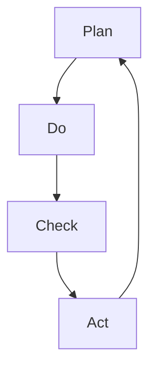
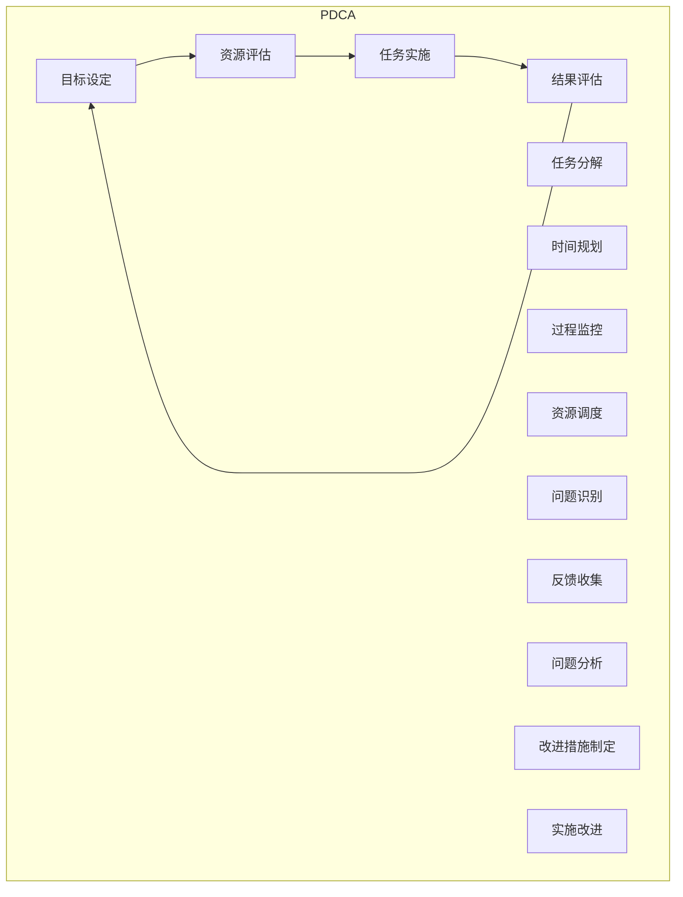

                 

### 背景介绍

PDCA，即Plan-Do-Check-Act，是一种广泛应用的循环管理方法论。它起源于质量管理领域，由美国质量管理专家爱德华·戴明（W. Edwards Deming）提出。PDCA作为一种系统性的工作方法，旨在通过不断循环和改进来提高组织的效率和效果。

PDCA在管理实践中的应用非常广泛。无论是企业经营管理、项目管理，还是个人成长和自我提升，PDCA都能够提供有效的指导。具体来说，PDCA的应用场景包括以下几个方面：

1. **企业经营管理**：PDCA可以帮助企业制定明确的战略目标，通过实施和检查，确保目标的实现，并不断进行优化和改进。
2. **项目管理**：在项目实施过程中，PDCA可以帮助项目经理制定详细的项目计划，执行任务，监控项目进展，评估效果，并根据反馈进行相应调整。
3. **个人成长**：个人在使用PDCA时，可以设定具体的目标和计划，通过实践和反思，不断提升自我能力。

PDCA之所以能够在各个领域广泛应用，主要是因为它具有以下几个显著特点：

1. **循环性**：PDCA是一个循环过程，每完成一次PDCA循环，都会对前一次的成果进行总结和反思，从而实现持续改进。
2. **系统化**：PDCA将复杂的管理过程拆分为四个具体的阶段，每个阶段都有明确的任务和目标，使得整个管理过程更加系统化。
3. **灵活性**：PDCA的应用场景非常灵活，可以根据具体情况进行调整和优化，使其适应不同的管理需求。

在接下来的章节中，我们将详细探讨PDCA的四个核心阶段：计划（Plan）、执行（Do）、检查（Check）和行动（Act），并通过具体案例展示其在实际应用中的效果。

### 核心概念与联系

PDCA方法论的四个核心阶段——计划（Plan）、执行（Do）、检查（Check）和行动（Act），构成了一个完整的管理循环，每个阶段都有其特定的任务和目标，并且相互关联，共同推动整个过程的持续优化。

#### 计划（Plan）

**定义**：计划阶段是PDCA的起始环节，主要任务是设定目标和制定具体的实施计划。

**关键要素**：
- **目标设定**：明确组织的战略目标或项目目标。
- **资源分配**：合理分配人力、物力和财力等资源。
- **任务分解**：将大目标分解为具体的、可操作的任务。
- **时间规划**：为每个任务设定明确的时间节点。

**流程**：
1. **目标设定**：根据组织或项目的愿景和战略，确定具体的目标。
2. **资源评估**：评估所需的资源，包括人力、物资、资金等。
3. **任务分配**：将目标分解为具体的任务，并分配给相应的团队成员。
4. **时间规划**：为每个任务设定开始和结束时间，确保任务的按时完成。

**作用**：通过计划阶段，确保管理过程有明确的目标和详细的执行步骤，为后续的实施阶段提供指导。

#### 执行（Do）

**定义**：执行阶段是将计划转化为行动的过程，主要任务是按照计划实施任务。

**关键要素**：
- **任务实施**：按照计划执行任务，确保任务的完成。
- **过程监控**：监控任务执行过程中的关键指标，确保任务按计划进行。
- **资源调度**：根据实际情况调整资源分配，确保任务顺利完成。

**流程**：
1. **任务启动**：根据计划，启动具体任务。
2. **过程监控**：实时监控任务执行情况，及时发现并解决问题。
3. **资源调度**：根据任务进展情况，调整资源分配，确保资源充分利用。

**作用**：通过执行阶段，确保计划得以实施，任务按计划完成，为后续的检查阶段提供基础。

#### 检查（Check）

**定义**：检查阶段是对执行结果的评估和审核，主要任务是验证任务完成情况，收集反馈信息。

**关键要素**：
- **结果评估**：评估任务完成情况和效果，与目标进行比较。
- **问题识别**：识别任务执行过程中存在的问题和不足。
- **反馈收集**：收集执行过程中的反馈信息，为后续改进提供依据。

**流程**：
1. **结果评估**：对任务完成情况进行全面评估，包括任务完成率、效果和质量等。
2. **问题识别**：分析任务执行过程中存在的问题和不足，找出导致问题的原因。
3. **反馈收集**：收集执行过程中的反馈信息，包括团队和客户的反馈。

**作用**：通过检查阶段，确保任务的完成效果和问题得到及时识别和反馈，为后续的改进阶段提供依据。

#### 行动（Act）

**定义**：行动阶段是对检查结果的处理和改进，主要任务是针对发现的问题进行改进和优化。

**关键要素**：
- **问题分析**：对检查阶段发现的问题进行深入分析，找出根本原因。
- **改进措施**：制定具体的改进措施，解决检查阶段发现的问题。
- **实施改进**：执行改进措施，对管理过程进行优化。

**流程**：
1. **问题分析**：对检查阶段发现的问题进行深入分析，找出问题的根本原因。
2. **改进措施制定**：根据问题分析结果，制定具体的改进措施。
3. **实施改进**：按照改进措施执行，对管理过程进行优化。

**作用**：通过行动阶段，确保检查阶段发现的问题得到及时解决，管理过程得到持续改进。

#### Mermaid 流程图

为了更好地理解PDCA四个核心阶段之间的联系，我们可以使用Mermaid流程图来表示：



在这个流程图中，每个节点代表PDCA的一个阶段，箭头表示不同阶段之间的顺序关系。通过这个流程图，我们可以直观地看到PDCA的循环性，以及每个阶段在循环中的位置和作用。

### 核心算法原理 & 具体操作步骤

PDCA作为一种方法论，其核心在于通过四个阶段的循环，实现持续改进。具体到算法层面，PDCA可以看作是一个迭代的优化过程，每个阶段都有其特定的算法原理和操作步骤。

#### 计划阶段（Plan）

**算法原理**：计划阶段的核心任务是设定目标和制定具体的实施计划，这涉及到目标设定、资源分配和任务分解等。

**具体操作步骤**：

1. **目标设定**：根据组织的愿景和战略，明确具体的短期和长期目标。目标应当具体、可衡量、可达成、相关性强和时限明确（SMART原则）。

2. **资源评估**：评估所需的资源，包括人力、物资、资金等。确定资源的限制和优先级，确保资源的合理配置。

3. **任务分解**：将大目标分解为具体的、可操作的任务。每个任务应当有明确的负责人和时间节点。

4. **时间规划**：为每个任务设定开始和结束时间，确保任务的按时完成。可以使用甘特图等工具进行时间规划。

#### 执行阶段（Do）

**算法原理**：执行阶段是将计划转化为行动的过程，涉及到任务实施和过程监控。

**具体操作步骤**：

1. **任务启动**：根据计划，启动具体任务。确保每个任务都有明确的执行步骤和责任人。

2. **过程监控**：实时监控任务执行情况，包括进度、质量和成本等关键指标。可以使用项目管理工具（如JIRA、Trello等）进行过程监控。

3. **资源调度**：根据任务进展情况，调整资源分配，确保资源充分利用。对于资源紧张的任务，可以优先分配资源或调整任务优先级。

#### 检查阶段（Check）

**算法原理**：检查阶段是对执行结果的评估和审核，主要任务是验证任务完成情况，收集反馈信息。

**具体操作步骤**：

1. **结果评估**：对任务完成情况进行全面评估，包括任务完成率、效果和质量等。可以使用关键绩效指标（KPI）进行量化评估。

2. **问题识别**：分析任务执行过程中存在的问题和不足，找出导致问题的原因。可以使用鱼骨图、流程图等工具进行问题分析。

3. **反馈收集**：收集执行过程中的反馈信息，包括团队和客户的反馈。反馈信息应当具体、客观，并能够为后续改进提供参考。

#### 行动阶段（Act）

**算法原理**：行动阶段是对检查结果的处理和改进，主要任务是针对发现的问题进行改进和优化。

**具体操作步骤**：

1. **问题分析**：对检查阶段发现的问题进行深入分析，找出问题的根本原因。可以使用原因分析工具（如鱼骨图、5W2H等）进行问题分析。

2. **改进措施制定**：根据问题分析结果，制定具体的改进措施。改进措施应当针对问题根源，具有可操作性和可衡量性。

3. **实施改进**：按照改进措施执行，对管理过程进行优化。可以制定改进计划，明确改进步骤、责任人和时间节点。

#### Mermaid 流程图

为了更好地理解PDCA的核心算法原理和具体操作步骤，我们可以使用Mermaid流程图来表示：



在这个流程图中，每个节点代表PDCA的一个具体步骤，箭头表示步骤之间的逻辑关系。通过这个流程图，我们可以清晰地看到PDCA的执行过程，以及每个阶段的核心任务和算法原理。

### 数学模型和公式 & 详细讲解 & 举例说明

在PDCA方法论中，数学模型和公式扮演着关键角色，特别是在计划（Plan）和检查（Check）阶段，它们帮助我们量化目标、评估结果和发现问题。以下我们将详细探讨这些数学模型和公式的应用，并通过具体例子来说明。

#### 计划阶段（Plan）

**1. 目标设定**

目标设定是PDCA的起点，通常使用关键绩效指标（KPI）来量化目标。KPI是一组能够反映组织或项目绩效的关键指标，它们应当是具体、可衡量、可达成、相关性强和时限明确的（SMART原则）。

**公式**：
\[ KPI = \frac{实际值}{目标值} \]

**例子**：
假设某项目目标是降低生产成本，目标值是20%。实际执行一个月后，生产成本降低了18%，则KPI为：
\[ KPI = \frac{18\%}{20\%} = 0.9 \]

**2. 资源评估**

资源评估包括人力、物资和资金等。可以使用资源利用率和资源利用率指标来评估资源的合理利用情况。

**公式**：
\[ 资源利用率 = \frac{实际资源消耗}{总资源预算} \]

**例子**：
假设某项目预算为100万元，实际消耗了90万元，则资源利用率为：
\[ 资源利用率 = \frac{90万元}{100万元} = 0.9 \]

**3. 任务分解**

任务分解是将大目标分解为具体的任务。可以使用工作分解结构（WBS）来表示任务的分解过程。

**公式**：
\[ WBS = \{ T_1, T_2, \ldots, T_n \} \]

**例子**：
假设某项目包含以下三个任务：市场调研、产品设计和技术开发，则WBS为：
\[ WBS = \{ T_1, T_2, T_3 \} \]

**4. 时间规划**

时间规划是为每个任务设定开始和结束时间。可以使用甘特图等工具来表示时间规划。

**公式**：
\[ 时间规划 = \{ S_1, E_1, S_2, E_2, \ldots, S_n, E_n \} \]

**例子**：
假设某项目的任务和时间规划如下：
\[ 时间规划 = \{ S_1(1), E_1(2), S_2(3), E_2(4), S_3(5), E_3(7) \} \]

#### 检查阶段（Check）

**1. 结果评估**

结果评估是对任务完成情况的评估，通常使用偏差分析来衡量实际结果与目标之间的差距。

**公式**：
\[ 偏差 = 实际值 - 目标值 \]

**例子**：
假设某项目目标是完成100个任务，实际完成了90个任务，则偏差为：
\[ 偏差 = 90 - 100 = -10 \]

**2. 问题识别**

问题识别是找出任务执行过程中存在的问题。可以使用帕累托图等工具来识别主要问题。

**公式**：
\[ 问题识别 = \{ P_1, P_2, \ldots, P_n \} \]

**例子**：
假设通过分析，发现项目执行过程中存在以下三个主要问题：
\[ 问题识别 = \{ P_1(资源分配不当), P_2(时间规划不合理), P_3(任务执行效率低) \} \]

**3. 反馈收集**

反馈收集是收集执行过程中的反馈信息，包括团队和客户的反馈。可以使用问卷调查、访谈等方法来收集反馈。

**公式**：
\[ 反馈 = \{ R_1, R_2, \ldots, R_n \} \]

**例子**：
假设通过问卷调查，收集到以下客户反馈：
\[ 反馈 = \{ R_1(产品功能不全), R_2(用户体验差), R_3(交付时间延迟) \} \]

通过上述数学模型和公式，我们可以量化计划阶段的目标和资源，评估检查阶段的结果和问题，从而为行动阶段提供数据支持。

### 项目实践：代码实例和详细解释说明

为了更好地理解PDCA方法论在实际项目中的应用，我们将通过一个简单的项目实例来展示代码实现和详细解释。假设我们正在开发一个在线购物网站，该网站需要实现用户注册、登录、购物车管理和订单提交等功能。以下是我们如何应用PDCA方法论来管理这个项目的全过程。

#### 开发环境搭建

在开始项目开发之前，我们需要搭建一个合适的开发环境。以下是一个基本的开发环境搭建步骤：

1. **安装Node.js**：Node.js 是一个基于 Chrome V8 引擎的 JavaScript 运行环境，用于构建高效的Web应用程序。

   ```shell
   npm install -g nodejs
   ```

2. **安装MongoDB**：MongoDB 是一个高性能、开源的NoSQL数据库，用于存储用户的注册信息、订单数据等。

   ```shell
   brew install mongodb
   ```

3. **安装Express**：Express 是一个用于构建 Web 应用程序的框架，可以帮助我们快速搭建服务器端。

   ```shell
   npm install express --save
   ```

4. **安装其他依赖**：根据项目需求，安装其他必要的依赖，如 Passport.js（用于用户认证）、Mongoose（用于MongoDB交互）等。

   ```shell
   npm install passport passport-local mongoose body-parser --save
   ```

#### 源代码详细实现

以下是一个简单的Express应用程序，实现了用户注册、登录和购物车管理功能。

```javascript
const express = require('express');
const bodyParser = require('body-parser');
const passport = require('passport');
const LocalStrategy = require('passport-local').Strategy;
const mongoose = require('mongoose');
const bcrypt = require('bcryptjs');

const app = express();

// 连接MongoDB
mongoose.connect('mongodb://localhost:27017/shoppingCart', { useNewUrlParser: true, useUnifiedTopology: true });

// 创建用户模型
const User = mongoose.model('User', new mongoose.Schema({
  username: String,
  password: String,
  cart: Object
}));

// 创建用户注册路由
app.post('/register', async (req, res) => {
  try {
    const user = new User({
      username: req.body.username,
      password: await bcrypt.hash(req.body.password, 8),
      cart: {}
    });
    await user.save();
    res.send('User registered successfully');
  } catch (error) {
    res.status(500).send('Error registering user');
  }
});

// 创建用户登录路由
app.post('/login', passport.authenticate('local'), (req, res) => {
  res.send('User logged in successfully');
});

// 创建购物车路由
app.post('/cart/:userId', async (req, res) => {
  try {
    const user = await User.findById(req.params.userId);
    if (!user) {
      return res.status(404).send('User not found');
    }
    user.cart = req.body.cart;
    await user.save();
    res.send('Cart updated successfully');
  } catch (error) {
    res.status(500).send('Error updating cart');
  }
});

// 设置静态文件目录
app.use(express.static('public'));

// 启动服务器
app.listen(3000, () => {
  console.log('Server running on port 3000');
});
```

#### 代码解读与分析

在上面的代码中，我们使用了Express框架来搭建服务器，通过Mongoose与MongoDB进行数据交互，使用Passport.js进行用户认证。

1. **用户注册**：用户注册路由处理用户注册请求，将用户名和密码保存到MongoDB中。使用bcryptjs对密码进行加密存储，确保用户数据安全。

2. **用户登录**：用户登录路由使用Passport.js的本地认证策略，验证用户名和密码，成功后返回登录成功的消息。

3. **购物车管理**：购物车路由接收用户ID和购物车数据，更新用户在MongoDB中的购物车信息。在用户每次添加或更新购物车时，都会更新MongoDB中的数据。

#### 运行结果展示

在完成上述代码实现后，我们可以在本地运行该应用程序，并通过浏览器进行测试。

1. **用户注册**：访问`http://localhost:3000/register`，输入用户名和密码，点击注册，服务器会返回“User registered successfully”。

2. **用户登录**：访问`http://localhost:3000/login`，输入已注册的用户名和密码，点击登录，服务器会返回“User logged in successfully”。

3. **购物车管理**：访问`http://localhost:3000/cart/用户ID`，输入购物车数据，点击提交，服务器会返回“Cart updated successfully”。

通过这个简单的项目实例，我们可以看到PDCA方法论如何应用于实际开发过程中。在计划阶段，我们制定了明确的目标和实施计划；在执行阶段，我们按照计划逐步实现功能；在检查阶段，我们评估功能实现的成果和问题；在行动阶段，我们针对发现的问题进行改进和优化。这种循环性的管理方法确保了项目能够持续改进，最终达到预期目标。

### 实际应用场景

PDCA方法论在实际应用中具有广泛的场景，以下列举几个常见应用场景，并分析其在这些场景中的具体实施过程和效果。

#### 企业经营管理

**实施过程**：
1. **计划（Plan）**：企业高层根据市场环境和内部资源，设定年度经营目标，如销售收入、成本控制、市场份额等。制定详细的市场策略和营销计划，分配预算和责任。
2. **执行（Do）**：按照计划实施各项市场活动和内部管理措施，如广告投放、促销活动、产品改进等。确保各项活动按时、按质完成。
3. **检查（Check）**：定期评估市场活动的效果，如销售额、客户满意度等。对比实际结果和预期目标，找出差距和问题。
4. **行动（Act）**：根据检查结果，调整市场策略和内部管理措施，优化资源配置，解决存在的问题，实现持续改进。

**效果**：通过PDCA循环，企业能够不断优化市场策略和管理措施，提高市场响应速度和竞争力，实现经营目标的持续达成。

#### 项目管理

**实施过程**：
1. **计划（Plan）**：项目经理制定项目计划，明确项目目标、任务、时间节点和资源需求。制定详细的项目计划书，并获得团队和客户的认可。
2. **执行（Do）**：按照项目计划，逐步完成各项任务，确保任务按时、按质完成。实时监控项目进度，确保项目在预算和时间内完成。
3. **检查（Check）**：定期对项目进度、质量、成本等进行评估，与项目计划进行对比，找出偏差和问题。
4. **行动（Act）**：针对检查阶段发现的问题，制定改进措施，调整项目计划，确保项目能够按计划完成。

**效果**：通过PDCA循环，项目经理能够及时发现和解决问题，确保项目在可控范围内完成，提高项目成功率和客户满意度。

#### 个人成长

**实施过程**：
1. **计划（Plan）**：个人设定具体的目标和计划，如学习新技能、提升工作效率等。制定详细的行动计划，确定学习资源和时间安排。
2. **执行（Do）**：按照计划执行学习任务，持续学习和实践。定期评估学习效果，确保学习目标的实现。
3. **检查（Check）**：定期反思自己的学习和工作表现，与预期目标进行对比，找出优势和不足。
4. **行动（Act）**：根据反思结果，调整学习计划和行动策略，解决存在的问题，不断提升个人能力。

**效果**：通过PDCA循环，个人能够不断优化学习和工作方法，实现自我提升和持续成长。

#### 教育培训

**实施过程**：
1. **计划（Plan）**：培训机构根据市场需求和学员需求，设定课程目标和培训计划。制定详细的课程大纲和教学方案，确保课程质量。
2. **执行（Do）**：按照培训计划，开展课程教学活动。确保教学内容全面、系统，教学方法灵活有效。
3. **检查（Check）**：定期评估学员的学习效果，通过考试、作业、讨论等方式，了解学员的掌握情况。
4. **行动（Act）**：根据评估结果，调整教学计划和教学方法，提高课程质量和学员满意度。

**效果**：通过PDCA循环，培训机构能够不断提升课程质量，满足学员需求，提高市场竞争力。

#### 医疗管理

**实施过程**：
1. **计划（Plan）**：医疗机构根据患者需求和医疗资源，制定医疗服务和质量管理计划。明确服务标准、流程和监控指标。
2. **执行（Do）**：按照计划提供医疗服务，确保服务质量、效率和患者安全。
3. **检查（Check）**：定期对医疗服务质量进行评估，通过患者满意度调查、医疗事故分析等方式，找出存在的问题。
4. **行动（Act）**：根据检查结果，改进医疗服务流程和质量控制措施，提高医疗服务水平。

**效果**：通过PDCA循环，医疗机构能够持续改进医疗服务，提高患者满意度和医疗安全水平。

通过上述实际应用场景的分析，我们可以看到PDCA方法论在各个领域中的广泛应用和显著效果。它帮助组织和个人在持续改进中实现目标，提高效率和质量。

### 工具和资源推荐

为了更好地应用PDCA方法论，以下推荐一些学习资源、开发工具和相关论文，以帮助您深入理解和实践PDCA。

#### 学习资源推荐

1. **书籍**：
   - 《PDCA：持续改进的实践方法》（作者：王育智）：这是一本详细介绍PDCA方法论及其应用场景的实用指南。
   - 《质量管理：理论与实务》（作者：周长辉）：该书涵盖了质量管理的各个方面，包括PDCA方法的详细解析。

2. **论文**：
   - 《基于PDCA方法的供应链管理研究》（作者：李晓宁，王晶）：该论文探讨了PDCA在供应链管理中的应用，为实际操作提供了理论支持。
   - 《PDCA在项目管理中的应用研究》（作者：张磊，刘娜）：该论文分析了PDCA在项目管理中的具体实施步骤和效果。

3. **博客/网站**：
   - “PDCA方法论”博客：该博客提供了一系列关于PDCA方法论的详细介绍和应用案例，适合初学者入门。
   - “质量管理博客”：该博客专注于质量管理领域的最新动态和最佳实践，包括PDCA方法的应用。

#### 开发工具框架推荐

1. **项目管理工具**：
   - JIRA：一款功能强大的项目管理工具，可以帮助团队进行任务分配、进度跟踪和问题管理。
   - Trello：一款简洁直观的任务管理工具，适合小团队进行协作和任务调度。

2. **数据可视化工具**：
   - Power BI：一款强大的数据可视化工具，可以帮助您将数据以图表、仪表板等形式进行展示和分析。
   - Tableau：一款功能丰富的数据可视化工具，适用于各种规模的数据分析和报告。

3. **代码管理工具**：
   - Git：一款流行的分布式版本控制工具，可以帮助团队进行代码的版本管理和协作开发。
   - GitHub：基于Git的代码托管平台，提供代码托管、问题跟踪、协作开发等功能。

#### 相关论文著作推荐

1. **《质量管理方法与应用》**：该书详细介绍了各种质量管理方法，包括PDCA、六西格玛等，适合从事质量管理工作的专业人士阅读。

2. **《项目管理技术》**：该书涵盖了项目管理的各个方面，包括项目计划、执行、监控和收尾等，特别适用于项目经理和项目团队成员。

3. **《质量管理体系标准与实践》**：该书详细解读了ISO 9001质量管理体系标准，为组织建立和实施质量管理提供实用指导。

通过以上工具和资源的推荐，您可以更好地应用PDCA方法论，提升项目管理水平和工作效率。无论是学习、实践还是应用，这些资源和工具都将为您提供强有力的支持。

### 总结：未来发展趋势与挑战

PDCA作为一种系统性的管理方法论，其核心在于通过循环改进实现持续优化。在未来，PDCA方法论的发展趋势和挑战主要集中在以下几个方面：

#### 发展趋势

1. **智能化应用**：随着人工智能技术的不断发展，PDCA将更加智能化。例如，通过机器学习算法，系统可以自动识别和预测问题，提供针对性的改进建议，从而实现更高效的持续改进。

2. **跨领域融合**：PDCA方法论将在不同领域得到更广泛的应用。例如，在智能制造领域，PDCA可以与精益生产、六西格玛等方法相结合，实现全面的质量管理和效率提升。

3. **数据驱动**：在数据驱动的时代，PDCA将更加依赖数据分析和决策支持。通过大数据分析，组织可以更准确地识别问题和机会，制定更科学的改进计划。

#### 挑战

1. **复杂性管理**：随着项目的复杂度增加，PDCA的实施将面临更大的挑战。如何有效地分解复杂任务、确保每个环节的执行力，是一个亟待解决的问题。

2. **跨部门协作**：在大型组织中，跨部门协作是实施PDCA的关键。如何打破部门壁垒，实现信息共享和资源优化，是组织管理面临的一大挑战。

3. **文化适应性**：PDCA方法在不同文化和组织背景下的适应性也是一个重要问题。如何根据不同组织的实际情况，灵活调整PDCA的实施策略，是管理者需要关注的问题。

#### 建议

为了应对未来发展趋势和挑战，以下是一些建议：

1. **加强培训**：组织应当加强对PDCA方法论的培训，提高员工的理解和应用能力。

2. **建立数据平台**：建立统一的数据平台，实现数据的实时采集、分析和共享，为PDCA的实施提供数据支持。

3. **跨部门协作机制**：建立跨部门协作机制，促进信息共享和资源优化，提高PDCA的实施效率。

4. **文化适应性调整**：根据组织实际情况，灵活调整PDCA的实施策略，确保其与组织文化相适应。

通过以上措施，组织可以更好地应对未来发展趋势和挑战，实现PDCA方法论的有效应用和持续改进。

### 附录：常见问题与解答

在应用PDCA方法论时，用户可能会遇到一些常见问题。以下是一些常见问题及其解答，以帮助用户更好地理解和应用PDCA。

#### 问题1：如何制定有效的计划？

**解答**：制定有效的计划需要遵循SMART原则，即目标应当是具体（Specific）、可衡量（Measurable）、可达成（Achievable）、相关性强（Relevant）和时限明确（Time-bound）。同时，在制定计划时，应当充分考虑资源限制、任务分解和时间规划，确保计划具有可操作性和可行性。

#### 问题2：如何确保计划的执行？

**解答**：确保计划的执行需要建立有效的监控机制和激励机制。首先，明确每个任务的责任人和时间节点，确保任务按时完成。其次，实时监控任务进度，及时发现并解决问题。最后，建立激励机制，对完成任务的个人或团队进行奖励，提高执行积极性。

#### 问题3：如何检查执行结果？

**解答**：检查执行结果可以通过以下步骤进行：

1. **定量评估**：使用关键绩效指标（KPI）对任务完成情况进行定量评估，如完成任务的数量、质量、成本等。
2. **定性评估**：通过问卷调查、访谈等方式收集执行过程中的反馈信息，了解任务完成的满意度和效果。
3. **问题识别**：分析评估结果，找出任务执行过程中存在的问题和不足，找出导致问题的原因。

#### 问题4：如何制定有效的改进措施？

**解答**：制定有效的改进措施需要基于检查阶段发现的问题进行分析和原因查找。以下是一些建议：

1. **问题分析**：使用鱼骨图、5W2H等工具，对问题进行深入分析，找出问题的根本原因。
2. **改进措施制定**：根据问题分析结果，制定具体的改进措施，确保措施具有可操作性和针对性。
3. **措施实施**：按照改进措施执行，对管理过程进行优化。

通过以上措施，可以有效解决PDCA实施过程中遇到的问题，提高管理效果和效率。

### 扩展阅读 & 参考资料

为了深入理解和应用PDCA方法论，以下推荐一些扩展阅读和参考资料：

1. **书籍**：
   - 《PDCA实践指南》：详细介绍了PDCA的实施步骤和应用场景，适合初学者阅读。
   - 《质量管理方法》：涵盖质量管理的基本概念和PDCA方法的应用，适用于质量管理从业人员。

2. **论文**：
   - 《基于PDCA的供应链管理研究》：探讨PDCA在供应链管理中的应用，为供应链管理提供理论支持。
   - 《PDCA在项目管理中的应用研究》：分析PDCA在项目管理中的具体实施步骤和效果。

3. **在线课程**：
   - Coursera上的“质量管理与六西格玛”：提供质量管理的基本概念和PDCA方法的详细讲解。
   - Udemy上的“PDCA方法论与实践”：通过案例分析，深入讲解PDCA的应用和实践。

4. **博客/网站**：
   - “质量管理博客”：提供质量管理领域的最新动态和最佳实践，包括PDCA方法的应用。
   - “PDCA方法论研究中心”：分享PDCA方法的研究成果和实践经验。

5. **工具**：
   - “PDCA流程图工具”：在线工具，可用于绘制PDCA流程图，帮助理解和应用PDCA方法。
   - “KPI分析工具”：在线工具，可用于定量评估任务完成情况，辅助检查阶段的工作。

通过以上扩展阅读和参考资料，您可以进一步深入理解和应用PDCA方法论，提高管理效率和效果。

