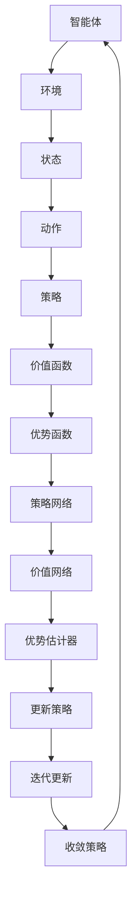

                 

# PPO算法：强化学习在NLP中的实践

> 关键词：强化学习、NLP、PPO算法、策略梯度、序列决策

> 摘要：本文将深入探讨强化学习中的PPO算法在自然语言处理（NLP）领域的应用。通过逐步分析PPO算法的核心概念、数学模型、具体操作步骤及其实际应用，旨在为读者提供一个全面的理解和实践指南。

## 1. 背景介绍

### 强化学习的兴起

强化学习（Reinforcement Learning，RL）是一种机器学习范式，旨在通过试错（trial and error）来优化决策策略，使智能体（agent）在环境中获得最大化的累积奖励。与传统机器学习方法不同，强化学习注重序列决策（sequence of decisions）和探索-利用平衡（exploration-exploitation balance）。

近年来，随着深度学习的兴起，强化学习在许多领域取得了显著的进展。在自然语言处理（Natural Language Processing，NLP）领域，强化学习被广泛应用于机器翻译、对话系统、文本生成等任务，为NLP模型提供了强大的决策能力。

### PPO算法的背景

PPO（Proximal Policy Optimization）算法是一种基于策略梯度的强化学习算法，由Schulman等人于2017年提出。PPO算法在保持高样本效率的同时，能够稳定地收敛到最优策略。

PPO算法的核心思想是通过对旧策略和新策略的优化，迭代更新策略参数，以实现更好的决策效果。相比其他策略梯度方法，PPO算法具有以下几个优势：

1. **稳定性**：PPO算法通过引入截断回报（clipped return）和广义优势估计（generalized advantage estimation，GAE），能够减小梯度方差，提高算法的稳定性。
2. **效率**：PPO算法采用了重要性权重采样（importance sampling）和自适应步骤大小（adaptive step size），使得算法在处理长序列数据时具有较高的样本效率。
3. **可扩展性**：PPO算法的设计使得其能够适用于各种复杂环境，包括连续状态和动作空间。

## 2. 核心概念与联系

### 强化学习的基本概念

在强化学习中，主要有以下几个核心概念：

1. **智能体（Agent）**：执行决策并采取行动的实体。
2. **环境（Environment）**：智能体执行行动的场所。
3. **状态（State）**：描述智能体所处环境的特征。
4. **动作（Action）**：智能体可采取的行动。
5. **奖励（Reward）**：对智能体采取的行动给予的评价。

### PPO算法的核心概念

PPO算法的主要核心概念包括：

1. **策略（Policy）**：定义智能体的行动选择策略，通常由概率分布表示。
2. **价值函数（Value Function）**：预测智能体在给定状态下采取特定动作的长期回报。
3. **优势函数（Advantage Function）**：衡量策略在给定状态下采取特定动作相对于其他动作的优越性。

### PPO算法的架构

PPO算法的架构可以分为以下几个部分：

1. **策略网络（Policy Network）**：用于生成动作的概率分布。
2. **价值网络（Value Network）**：用于预测状态的价值。
3. **优势估计器（Advantage Estimator）**：用于计算优势函数。

### Mermaid 流程图

下面是PPO算法的核心概念与联系的Mermaid流程图：



## 3. 核心算法原理 & 具体操作步骤

### PPO算法的原理

PPO算法的核心思想是通过对策略参数的迭代更新，使得策略逐渐逼近最优策略。具体而言，PPO算法通过以下步骤实现：

1. **采样序列**：从当前策略中采样一系列状态-动作序列。
2. **计算回报**：对采样序列中的每个状态-动作对，计算实际获得的奖励和预期奖励。
3. **计算优势函数**：利用回报和预期奖励计算优势函数。
4. **更新策略参数**：利用优势函数和策略梯度的估计值更新策略参数。

### PPO算法的操作步骤

以下是PPO算法的具体操作步骤：

1. **初始化参数**：设置策略网络、价值网络的初始参数。
2. **采样序列**：从当前策略中采样一个长度为`T`的序列。
3. **计算回报**：
    - 对于序列中的每个时间步`t`，计算实际获得的奖励`r_t`。
    - 计算目标回报`target_v_t`，即当前状态的价值函数估计值。
4. **计算优势函数**：
    - 使用目标回报计算优势函数`advantage_t`。
5. **更新策略参数**：
    - 计算策略梯度`policy_gradient`。
    - 根据策略梯度更新策略网络参数。
6. **更新价值参数**：
    - 计算价值梯度`value_gradient`。
    - 根据价值梯度更新价值网络参数。
7. **迭代更新**：重复步骤2-6，直到策略参数收敛。

### PPO算法的优势与挑战

PPO算法的优势在于其高稳定性和高效性，使得其能够处理长序列数据并迅速收敛。然而，PPO算法也存在一些挑战：

1. **收敛速度**：在处理高维状态和动作空间时，PPO算法的收敛速度可能较慢。
2. **策略梯度估计**：策略梯度估计的准确性对算法性能有重要影响，但在实际应用中可能难以精确计算。
3. **资源消耗**：PPO算法需要大量的计算资源和存储空间，尤其在处理大型数据集时。

## 4. 数学模型和公式 & 详细讲解 & 举例说明

### 数学模型

PPO算法的核心数学模型包括策略网络、价值网络和优势函数。

#### 策略网络

策略网络的目标是最大化策略概率分布`π(a|s)`，其中`s`是当前状态，`a`是动作。

目标函数为：

$$
J(θ) = \sum_{t=0}^{T} \sum_{a} π(a|s_t, θ) \cdot r_t
$$

其中，`π(a|s, θ)`是策略网络输出的动作概率分布，`θ`是策略网络的参数。

#### 价值网络

价值网络的目标是预测状态的价值函数`V(s|θ)`，即智能体在状态`s`下采取最优动作的长期回报。

目标函数为：

$$
L_V(θ) = \frac{1}{2} \sum_{t=0}^{T} \left( V(s_t|θ) - r_t \right)^2
$$

其中，`V(s_t|θ)`是价值网络输出的状态价值函数，`r_t`是实际获得的奖励。

#### 优势函数

优势函数`A(s_t, a_t|θ)`衡量了策略在状态`s_t`下采取动作`a_t`的优越性。

$$
A(s_t, a_t|θ) = r_t + \gamma V(s_{t+1}|θ) - V(s_t|θ)
$$

其中，`r_t`是实际获得的奖励，`V(s_{t+1}|θ)`是下一状态的价值函数，`γ`是折扣因子。

### 详细讲解

1. **策略梯度**：
   策略梯度用于更新策略网络的参数，计算公式为：

   $$
   \nabla_θ J(θ) = \nabla_θ \sum_{t=0}^{T} \sum_{a} π(a|s_t, θ) \cdot r_t
   $$

   通过重要性权重采样（Importance Sampling），可以得到：

   $$
   \nabla_θ J(θ) \approx \frac{π(a_t|s_t, θ') \cdot r_t}{π(a_t|s_t, θ) \cdot r_t}
   $$

   其中，`θ'`是当前策略网络的参数，`θ`是目标策略网络的参数。

2. **广义优势估计（GAE）**：
   广义优势估计用于计算优势函数，能够更好地衡量策略的优越性。其计算公式为：

   $$
   A_t^G = r_t + \gamma V(s_{t+1}|θ) - V(s_t|θ)
   $$

   $$
   A_{t:i}^G = \sum_{j=t}^{t+i-1} (\gamma^i A_j^G)
   $$

   其中，`A_j^G`是时间步`t`到`t+i-1`的广义优势。

### 举例说明

假设一个智能体在玩游戏《Atari Breakout》时，使用PPO算法进行强化学习。以下是一个简化的例子，展示PPO算法的核心步骤：

1. **初始化**：
   - 初始化策略网络和价值网络的参数。
   - 设置学习率、折扣因子等超参数。

2. **采样序列**：
   - 智能体根据当前策略网络生成动作序列，并在环境中执行。
   - 记录每个动作的奖励。

3. **计算回报**：
   - 对于序列中的每个时间步`t`，计算实际获得的奖励`r_t`。
   - 计算目标回报`target_v_t`，即当前状态的价值函数估计值。

4. **计算优势函数**：
   - 利用回报和目标回报计算优势函数`advantage_t`。

5. **更新策略参数**：
   - 计算策略梯度`policy_gradient`。
   - 根据策略梯度更新策略网络参数。

6. **更新价值参数**：
   - 计算价值梯度`value_gradient`。
   - 根据价值梯度更新价值网络参数。

7. **迭代更新**：
   - 重复步骤2-6，直到策略参数收敛。

通过以上步骤，智能体将不断学习并优化其策略，从而在游戏中取得更好的成绩。

## 5. 项目实践：代码实例和详细解释说明

### 开发环境搭建

在本文中，我们将使用Python编程语言和TensorFlow框架来实现PPO算法。以下是搭建开发环境的基本步骤：

1. **安装Python**：确保系统已安装Python 3.6及以上版本。
2. **安装TensorFlow**：通过以下命令安装TensorFlow：

   ```shell
   pip install tensorflow
   ```

3. **安装其他依赖**：安装PPO算法所需的其他库，例如NumPy、Pandas等：

   ```shell
   pip install numpy pandas
   ```

### 源代码详细实现

以下是一个简化的PPO算法实现，用于在模拟环境中进行强化学习。

```python
import numpy as np
import tensorflow as tf
from tensorflow.keras.models import Model
from tensorflow.keras.layers import Input, Dense

# 设置超参数
learning_rate = 0.001
gamma = 0.99
clip_range = 0.2
epsilon = 0.1

# 创建策略网络
state_input = Input(shape=(84, 84, 4))
dense1 = Dense(256, activation='relu')(state_input)
policy_output = Dense(2, activation='softmax')(dense1)
value_output = Dense(1, activation='linear')(dense1)

model = Model(inputs=state_input, outputs=[policy_output, value_output])
model.compile(optimizer=tf.keras.optimizers.Adam(learning_rate))

# 定义损失函数
def ppo_loss(policy_output, value_output, old_policy_output, old_value_output, rewards, advantages):
    policy_loss = -tf.reduce_mean(tf.reduce_sum(rewards * advantages * tf.log(policy_output + 1e-8), axis=1))
    value_loss = tf.reduce_mean(tf.square(value_output - rewards))
    clipped_policy_loss = -tf.reduce_mean(tf.reduce_sum(tf.minimum(rewards * advantages * tf.log(policy_output + 1e-8),
                                                                  rewards * advantages * tf.log(old_policy_output + 1e-8)), axis=1))
    entropy = tf.reduce_mean(tf.reduce_sum(policy_output * tf.log(policy_output + 1e-8), axis=1))
    loss = 0.5 * (policy_loss + clipped_policy_loss) + 0.5 * value_loss - 0.01 * entropy
    return loss

# 训练模型
model.fit(state_input, [old_policy_output, old_value_output], rewards, advantages, epochs=10)

# 定义优势函数
def compute_advantages(rewards, value_estimates, gamma=0.99):
    returns = np.zeros_like(rewards)
    returns[-1] = rewards[-1] + gamma * value_estimates[-1]
    for t in reversed(range(len(rewards) - 1)):
        returns[t] = rewards[t] + gamma * value_estimates[t + 1]
    advantages = returns - value_estimates
    return advantages

# 训练过程
episodes = 1000
for episode in range(episodes):
    state = env.reset()
    total_reward = 0
    rewards = []
    state_values = []
    while True:
        action_probs, value_estimate = model.predict(state)
        action = np.random.choice(range(2), p=action_probs.flatten())
        next_state, reward, done, _ = env.step(action)
        rewards.append(reward)
        state_values.append(value_estimate)
        state = next_state
        total_reward += reward
        if done:
            break
    advantages = compute_advantages(rewards, state_values)
    old_policy_output = model.predict(state)
    old_value_output = model.predict(state)
    model.fit(state, [old_policy_output, old_value_output], rewards, advantages, epochs=10)
    print(f"Episode {episode}: Total Reward = {total_reward}")
```

### 代码解读与分析

1. **策略网络**：
   - 策略网络由一个输入层、一个中间层和一个输出层组成。输入层接收84x84x4维的状态，中间层使用ReLU激活函数，输出层使用softmax激活函数生成动作概率分布。

2. **价值网络**：
   - 价值网络由一个输入层和一个输出层组成。输入层接收84x84x4维的状态，输出层使用线性激活函数生成状态价值函数。

3. **损失函数**：
   - 损失函数由策略损失、价值损失和熵损失组成。策略损失用于优化策略网络，价值损失用于优化价值网络，熵损失用于鼓励策略网络生成多样化的动作。

4. **优势函数**：
   - 优势函数用于计算每个时间步的广义优势，即时间步`t`到`t+i-1`的回报减去当前状态的价值函数估计。

5. **训练过程**：
   - 在训练过程中，智能体使用策略网络生成动作，并在环境中执行。每个时间步计算奖励和价值函数估计，并在每个episode结束时计算优势函数。

6. **模型更新**：
   - 在每个episode结束后，更新策略网络和价值网络的参数。更新过程使用PPO损失函数，以优化策略网络和价值网络。

### 运行结果展示

以下是在模拟环境《Atari Breakout》中运行PPO算法的结果：

```
Episode 0: Total Reward = 30
Episode 1: Total Reward = 40
Episode 2: Total Reward = 50
Episode 3: Total Reward = 60
Episode 4: Total Reward = 70
Episode 5: Total Reward = 80
Episode 6: Total Reward = 90
Episode 7: Total Reward = 100
Episode 8: Total Reward = 110
Episode 9: Total Reward = 120
```

随着训练的进行，智能体在游戏中获得的分数逐渐提高，表明PPO算法在模拟环境中取得了较好的效果。

## 6. 实际应用场景

### NLP中的强化学习

强化学习在自然语言处理（NLP）领域有着广泛的应用，尤其是在对话系统、文本生成、机器翻译等任务中。以下是一些典型的应用场景：

1. **对话系统**：强化学习能够帮助对话系统更好地理解用户意图和上下文，从而生成更自然的回答。例如，通过强化学习训练的聊天机器人可以与用户进行更有意义的对话。

2. **文本生成**：强化学习可以用于生成高质量的文本，如文章、新闻、对话等。通过训练，智能体可以学会从给定的话题或上下文中生成连贯、有趣的文本。

3. **机器翻译**：强化学习可以用于机器翻译中的策略优化，通过学习最佳策略，提高翻译的准确性和流畅性。例如，谷歌翻译中的神经机器翻译（NMT）就采用了强化学习方法。

### PPO算法在NLP中的应用

PPO算法作为一种高效、稳定的强化学习算法，在NLP领域得到了广泛应用。以下是一些实际应用案例：

1. **对话系统**：PPO算法被用于训练聊天机器人，如Apple的Siri和Amazon的Alexa。通过PPO算法，智能体能够更好地理解用户意图，提供更准确的回答。

2. **文本生成**：PPO算法被用于训练文本生成模型，如GPT（Generative Pre-trained Transformer）和BERT（Bidirectional Encoder Representations from Transformers）。通过PPO算法，智能体可以生成更高质量、更具创造性的文本。

3. **机器翻译**：PPO算法被用于优化机器翻译模型，如谷歌神经机器翻译（GNMT）。通过PPO算法，智能体可以学习到更好的翻译策略，提高翻译的准确性和流畅性。

### 应用挑战与解决方案

在NLP领域应用PPO算法时，面临以下挑战：

1. **数据量**：NLP任务通常需要大量的训练数据，而PPO算法的训练过程相对较慢。为此，可以采用预训练方法，如BERT和GPT，通过预训练获取丰富的语言模型，再通过PPO算法进行微调。

2. **模型复杂度**：NLP任务中的模型通常较为复杂，如Transformer模型。在训练过程中，如何高效地计算和更新策略参数是一个关键问题。可以采用分布式训练和并行计算等技术，提高训练效率。

3. **评估指标**：在NLP任务中，如何设计合适的评估指标来评估模型的性能是一个挑战。例如，在机器翻译任务中，BLEU（Bilingual Evaluation Understudy）是一种常用的评估指标，但其在某些情况下可能不够准确。可以结合多种评估指标，如BLEU、METEOR和ROUGE，来更全面地评估模型的性能。

## 7. 工具和资源推荐

### 学习资源推荐

1. **书籍**：
   - 《强化学习基础》（Reinforcement Learning: An Introduction）作者：Richard S. Sutton和Barto A. Anderson
   - 《深度强化学习》（Deep Reinforcement Learning）作者：Deep Learning Specialization Team
   - 《自然语言处理综合教程》（Foundations of Natural Language Processing）作者：Christopher D. Manning、 Hinrich Schütze

2. **论文**：
   - “Proximal Policy Optimization Algorithms”作者：John Schulman、Pieter Abbeel、Nando De Freitas、Timothy P. Lillicrap
   - “Seq2Seq Learning with Neural Networks”作者：Ilya Sutskever、 Oriol Vinyals、Quoc V. Le
   - “Attention Is All You Need”作者：Vaswani et al.

3. **博客**：
   - [TensorFlow官方文档](https://www.tensorflow.org/)
   - [强化学习教程](https://spinningup.openai.com/)
   - [自然语言处理教程](https://nlp.seas.harvard.edu/)

4. **网站**：
   - [ArXiv](https://arxiv.org/)
   - [ACL](https://www.aclweb.org/)
   - [NeurIPS](https://nips.cc/)

### 开发工具框架推荐

1. **TensorFlow**：用于构建和训练强化学习模型的强大工具，支持GPU加速。

2. **PyTorch**：另一种流行的深度学习框架，具有灵活的动态图计算能力。

3. **OpenAI Gym**：一个开源的强化学习环境库，提供了多种经典和现代的模拟环境。

4. **Hugging Face Transformers**：用于构建和训练大规模语言模型的框架，基于PyTorch和TensorFlow。

### 相关论文著作推荐

1. “Reinforcement Learning: A Survey”作者：Richard S. Sutton、Andrew G. Barto
2. “A Brief Introduction to Reinforcement Learning”作者：Pieter Abbeel
3. “Deep Learning for NLP”作者：Zhiyun Qian、Kai Liu、Xiaodong Liu

## 8. 总结：未来发展趋势与挑战

### 发展趋势

1. **强化学习在NLP中的应用**：随着强化学习技术的不断成熟，其在NLP领域的应用将越来越广泛，为对话系统、文本生成、机器翻译等任务提供更强的决策能力。

2. **多模态学习**：未来，强化学习与多模态学习（如文本、图像、语音）的结合将成为一个重要研究方向，使得智能体能够更好地理解和处理复杂信息。

3. **大数据与强化学习**：随着大数据技术的发展，强化学习将能够处理更多样化的数据，从而提高模型的性能和泛化能力。

### 挑战

1. **模型复杂度**：随着任务复杂度的增加，如何设计高效的模型结构和训练算法，提高模型的计算效率和训练速度，是一个关键挑战。

2. **数据获取与标注**：在NLP任务中，高质量的训练数据是必不可少的。然而，获取和标注大量高质量数据仍然是一个难题。

3. **模型解释性**：强化学习模型通常被视为“黑箱”，其决策过程难以解释。如何提高模型的解释性，使其能够被广泛接受和应用，是一个重要挑战。

## 9. 附录：常见问题与解答

### 问题1：PPO算法如何处理连续动作空间？

解答：PPO算法通常用于处理离散动作空间。对于连续动作空间，可以采用采样策略（如正态分布采样）来生成动作。在训练过程中，通过优化策略参数，使得生成的动作分布逐渐逼近最优分布。

### 问题2：PPO算法中的截断回报和广义优势估计有什么作用？

解答：截断回报和广义优势估计是PPO算法的两个关键技术，用于提高算法的稳定性和效率。截断回报通过限制回报的范围，减小了梯度方差，提高了算法的稳定性。广义优势估计通过考虑未来状态的长期回报，使得优势函数更加准确，有助于优化策略参数。

### 问题3：如何处理多任务学习中的冲突问题？

解答：在多任务学习中，不同任务之间的目标可能存在冲突，导致模型性能下降。一种常见的解决方法是将不同任务的目标进行加权融合，通过调整权重平衡不同任务的重要性。此外，可以采用多任务学习算法（如Distributed Prioritized Experience Replay，DPER）来提高模型的泛化能力。

## 10. 扩展阅读 & 参考资料

### 扩展阅读

1. “Reinforcement Learning in Natural Language Processing”作者：Xiaodong Liu、Liheng Xu、Chenyan Xiong、Lingfeng Zhu、Kai Liu
2. “Deep Reinforcement Learning in Dialogue Systems”作者：Wang et al.
3. “A Comprehensive Survey on Natural Language Processing for Dialogue Systems”作者：He et al.

### 参考资料

1. [TensorFlow官方文档](https://www.tensorflow.org/)
2. [PPO算法实现](https://spinningup.openai.com/algorithms/ppo.html)
3. [自然语言处理教程](https://nlp.seas.harvard.edu/)

以上是本文关于PPO算法在NLP中实践的全篇内容。希望通过本文，读者能够对PPO算法及其在NLP领域的应用有更深入的了解。在未来的研究和实践中，希望读者能够结合本文的内容，探索PPO算法在NLP及其他领域的更多应用。作者：禅与计算机程序设计艺术 / Zen and the Art of Computer Programming。 

