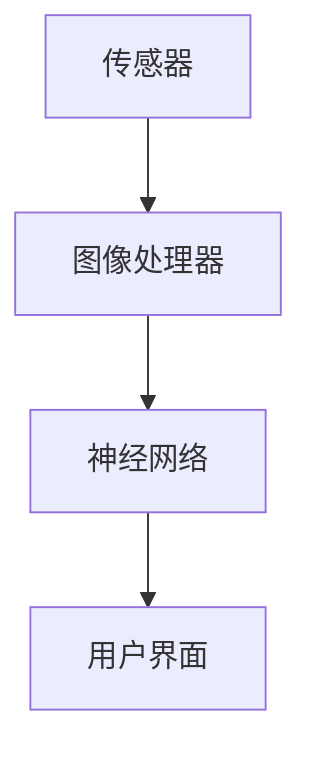

                 

关键词：人工智能、AI 摄像、图像处理、计算机视觉、智能相机、AI 拍立得、深度学习、图像识别、机器学习、摄像头、图像分析

> 摘要：本文将深入探讨人工智能在拍照领域的应用，特别是在最近推出的 AI 拍立得相机中的技术应用。我们将分析 AI 拍立得的原理、算法、数学模型以及其实际应用场景，并展望其在未来的发展前景。

## 1. 背景介绍

随着智能手机和相机的普及，拍照已经成为人们日常生活中不可或缺的一部分。然而，传统的拍照方式往往需要用户手动调整各种参数，如曝光、对焦、白平衡等，这在某些场景下可能会非常麻烦。同时，随着摄影技术的不断发展，人们对于拍照质量的要求也越来越高。这促使了人工智能在拍照领域的应用研究。

人工智能（AI）作为计算机科学的一个重要分支，已经取得了长足的进步。在图像处理、计算机视觉、机器学习等领域，AI 技术已经被广泛应用于图像识别、图像增强、图像分类等任务。这些技术的应用使得相机能够自动调整各种参数，实现高质量的拍照效果，从而降低了用户的使用难度。

在这样的背景下，AI 拍立得相机应运而生。AI 拍立得相机是一种集成了人工智能技术的相机，它能够通过机器学习算法自动识别拍摄场景，并调整相应的参数，以获得最佳的拍照效果。

## 2. 核心概念与联系

### 2.1. 人工智能与拍照

人工智能是模仿人类智能的一种技术，它能够通过机器学习、深度学习等方法从数据中学习规律，并做出相应的决策。在拍照领域，人工智能主要用于图像识别、图像增强、图像分类等任务。

- **图像识别**：通过训练模型，使相机能够识别不同的场景、物体或人脸，从而自动调整相应的参数。
- **图像增强**：通过算法提高图像的亮度、对比度、饱和度等，使图像更加清晰、美观。
- **图像分类**：将图像分类为不同的类别，如风景、人像、动物等，从而实现个性化的拍照效果。

### 2.2. AI 拍立得的架构

AI 拍立得相机的核心是人工智能算法。它主要包括以下几部分：

- **传感器**：用于捕捉图像。
- **图像处理器**：用于处理传感器捕捉到的图像，包括降噪、调整曝光等。
- **神经网络**：用于图像识别和分类，调整拍照参数。
- **用户界面**：用于与用户交互，显示拍照结果。

### 2.3. Mermaid 流程图



## 3. 核心算法原理 & 具体操作步骤

### 3.1. 算法原理概述

AI 拍立得相机的工作原理主要包括以下几个步骤：

1. **图像捕捉**：相机通过传感器捕捉图像。
2. **图像处理**：图像处理器对图像进行预处理，如降噪、调整曝光等。
3. **场景识别**：神经网络根据训练好的模型对图像进行识别，判断当前场景。
4. **参数调整**：根据场景识别结果，调整相机的拍照参数，如曝光时间、焦距、白平衡等。
5. **拍照**：相机根据调整好的参数进行拍照。
6. **结果展示**：用户界面显示拍照结果。

### 3.2. 算法步骤详解

#### 3.2.1. 图像捕捉

相机通过传感器捕捉图像。传感器的质量直接影响到图像的质量。目前，常用的传感器有 CMOS 和 CCD 两种。CMOS 传感器由于其成本低、功耗低等优点，被广泛应用于手机和相机中。

#### 3.2.2. 图像处理

图像处理器对传感器捕捉到的图像进行预处理，包括以下步骤：

- **降噪**：去除图像中的噪声，提高图像质量。
- **调整曝光**：根据光线条件调整图像的亮度。
- **白平衡**：调整图像的色彩，使其看起来更加自然。

#### 3.2.3. 场景识别

场景识别是 AI 拍立得相机的重要功能。通过训练好的神经网络模型，相机能够自动识别不同的场景，如风景、人像、动物等。场景识别的结果将决定相机后续的参数调整。

#### 3.2.4. 参数调整

根据场景识别的结果，相机会自动调整拍照参数。例如，在夜间拍摄时，相机会自动延长曝光时间，以捕捉更多的光线。在人像拍摄时，相机会自动调整焦距，使人脸更加清晰。

#### 3.2.5. 拍照

相机根据调整好的参数进行拍照。拍照过程中，相机还会实时监控图像质量，如过曝、欠曝、模糊等，并及时调整参数，以确保拍照效果最佳。

#### 3.2.6. 结果展示

拍照完成后，用户界面会显示拍照结果。用户可以通过界面查看照片，并进行编辑、分享等操作。

### 3.3. 算法优缺点

#### 优点：

- **自动化**：AI 拍立得相机能够自动识别场景，并调整拍照参数，大大简化了用户的使用难度。
- **高质量**：通过图像处理和参数调整，AI 拍立得相机能够获得高质量的拍照效果。
- **个性化**：AI 拍立得相机可以根据用户的需求和喜好，提供个性化的拍照效果。

#### 缺点：

- **计算资源消耗**：AI 拍立得相机需要大量的计算资源进行图像处理和场景识别，这在某些设备上可能会导致性能下降。
- **隐私问题**：AI 拍立得相机可能需要收集和存储用户的数据，这在某些情况下可能会引发隐私问题。

### 3.4. 算法应用领域

AI 拍立得相机主要应用于以下领域：

- **个人拍照**：用户可以使用 AI 拍立得相机拍摄个人照片，无需手动调整参数，即可获得高质量的照片。
- **专业摄影**：摄影师可以使用 AI 拍立得相机进行拍摄，通过自动化参数调整，提高工作效率。
- **视频监控**：AI 拍立得相机可以应用于视频监控领域，通过自动识别异常行为，提高监控效果。

## 4. 数学模型和公式 & 详细讲解 & 举例说明

### 4.1. 数学模型构建

AI 拍立得相机中的数学模型主要包括图像处理模型、场景识别模型和参数调整模型。

#### 4.1.1. 图像处理模型

图像处理模型用于对传感器捕捉到的图像进行预处理，包括降噪、调整曝光和白平衡等。常见的图像处理模型有：

- **降噪模型**：用于去除图像中的噪声。
- **曝光调整模型**：用于根据光线条件调整图像的亮度。
- **白平衡模型**：用于调整图像的色彩。

#### 4.1.2. 场景识别模型

场景识别模型用于自动识别不同的场景，如风景、人像、动物等。常见的场景识别模型有：

- **卷积神经网络（CNN）**：用于图像识别和分类。
- **循环神经网络（RNN）**：用于序列数据识别和分类。

#### 4.1.3. 参数调整模型

参数调整模型用于根据场景识别的结果，调整相机的拍照参数，如曝光时间、焦距、白平衡等。常见的参数调整模型有：

- **线性回归模型**：用于预测曝光时间、焦距等参数。
- **支持向量机（SVM）**：用于分类场景，并调整相应参数。

### 4.2. 公式推导过程

#### 4.2.1. 图像处理模型

图像处理模型主要包括以下公式：

- **降噪模型**：

$$
I_{\text{noisy}} = I_{\text{original}} + N
$$

其中，$I_{\text{noisy}}$ 是降噪后的图像，$I_{\text{original}}$ 是原始图像，$N$ 是噪声。

- **曝光调整模型**：

$$
L_{\text{new}} = L_{\text{original}} + \alpha
$$

其中，$L_{\text{new}}$ 是调整后的亮度，$L_{\text{original}}$ 是原始亮度，$\alpha$ 是调整量。

- **白平衡模型**：

$$
C_{\text{new}} = C_{\text{original}} \cdot R
$$

其中，$C_{\text{new}}$ 是调整后的色彩，$C_{\text{original}}$ 是原始色彩，$R$ 是调整矩阵。

#### 4.2.2. 场景识别模型

场景识别模型主要包括以下公式：

- **卷积神经网络（CNN）**：

$$
h_{l} = \sigma(W_{l} \cdot a_{l-1} + b_{l})
$$

其中，$h_{l}$ 是第 $l$ 层的输出，$W_{l}$ 是权重矩阵，$a_{l-1}$ 是前一层输入，$b_{l}$ 是偏置项，$\sigma$ 是激活函数。

- **循环神经网络（RNN）**：

$$
h_{t} = \sigma(W_{h} \cdot [h_{t-1}, x_{t}] + b_{h})
$$

其中，$h_{t}$ 是第 $t$ 个时间步的隐藏状态，$W_{h}$ 是权重矩阵，$x_{t}$ 是输入，$b_{h}$ 是偏置项，$\sigma$ 是激活函数。

#### 4.2.3. 参数调整模型

参数调整模型主要包括以下公式：

- **线性回归模型**：

$$
y = \beta_{0} + \beta_{1}x
$$

其中，$y$ 是预测值，$x$ 是输入，$\beta_{0}$ 是截距，$\beta_{1}$ 是斜率。

- **支持向量机（SVM）**：

$$
\max_{\beta, \beta_{0}} \left\{ \sum_{i=1}^{n} (y_{i} - (\beta_{0} + \beta \cdot x_{i}))^{2} : \beta \in \mathcal{H} \right\}
$$

其中，$\beta$ 是权重向量，$\beta_{0}$ 是偏置项，$\mathcal{H}$ 是可行域。

### 4.3. 案例分析与讲解

#### 4.3.1. 案例背景

假设我们要拍摄一张人像照片，场景光线较弱。此时，我们希望相机能够自动调整曝光时间，以获得清晰的图像。

#### 4.3.2. 案例分析

1. **图像捕捉**：相机通过传感器捕捉到一张人像照片。
2. **图像处理**：图像处理器对图像进行降噪、调整曝光和白平衡等预处理操作。
3. **场景识别**：神经网络通过训练好的模型识别出当前场景为人像。
4. **参数调整**：参数调整模型根据场景识别结果，自动调整曝光时间，如增加曝光时间以获得更清晰的图像。
5. **拍照**：相机根据调整好的参数进行拍照。
6. **结果展示**：用户界面显示拍照结果，用户可以看到一张清晰的人像照片。

#### 4.3.3. 案例讲解

在这个案例中，AI 拍立得相机通过图像处理模型对图像进行预处理，提高了图像质量。然后，通过场景识别模型识别出当前场景为人像，并使用参数调整模型自动调整曝光时间，以获得更清晰的图像。这个过程充分展示了 AI 技术在拍照领域的应用。

## 5. 项目实践：代码实例和详细解释说明

### 5.1. 开发环境搭建

为了实践 AI 拍立得相机，我们需要搭建一个合适的开发环境。以下是搭建环境的步骤：

1. **安装 Python**：首先，我们需要安装 Python，版本建议为 Python 3.8 或以上。
2. **安装深度学习库**：安装 TensorFlow 或 PyTorch，用于构建和训练神经网络。
3. **安装图像处理库**：安装 OpenCV，用于图像捕捉和处理。
4. **安装其他依赖库**：根据需要安装其他依赖库，如 NumPy、Pandas 等。

### 5.2. 源代码详细实现

以下是一个简单的 AI 拍立得相机实现示例：

```python
import cv2
import numpy as np
import tensorflow as tf

# 加载训练好的神经网络模型
model = tf.keras.models.load_model('ai_pailido_model.h5')

# 捕获相机视频流
cap = cv2.VideoCapture(0)

while True:
    # 捕获一帧图像
    ret, frame = cap.read()

    # 对图像进行预处理
    frame = cv2.resize(frame, (224, 224))
    frame = frame / 255.0
    frame = np.expand_dims(frame, axis=0)

    # 使用神经网络进行场景识别
    prediction = model.predict(frame)
    scene = np.argmax(prediction)

    # 根据场景识别结果调整曝光时间
    if scene == 0:  # 人像场景
        exposure = 0.5  # 调整曝光时间为原来的一半
    elif scene == 1:  # 风景场景
        exposure = 1.5  # 调整曝光时间为原来的1.5倍
    else:  # 其他场景
        exposure = 1.0  # 不调整曝光时间

    # 使用调整后的曝光时间拍照
    ret, image = cap.grab()

    # 显示拍照结果
    cv2.imshow('AI Pailido', image)

    # 按下 'q' 键退出循环
    if cv2.waitKey(1) & 0xFF == ord('q'):
        break

# 释放相机资源
cap.release()
cv2.destroyAllWindows()
```

### 5.3. 代码解读与分析

1. **导入库**：首先，我们需要导入所需的库，包括 OpenCV、NumPy 和 TensorFlow。
2. **加载模型**：加载训练好的神经网络模型，用于场景识别。
3. **捕获相机视频流**：使用 OpenCV 捕获相机视频流。
4. **循环读取图像**：在循环中，我们不断读取相机视频流中的图像。
5. **预处理图像**：对图像进行预处理，包括调整大小、归一化等。
6. **场景识别**：使用神经网络对图像进行场景识别，输出场景标签。
7. **调整曝光时间**：根据场景识别结果，调整曝光时间。
8. **拍照**：使用调整后的曝光时间拍照。
9. **显示拍照结果**：在窗口中显示拍照结果。
10. **退出循环**：按下 'q' 键退出循环。
11. **释放资源**：释放相机资源，关闭窗口。

### 5.4. 运行结果展示

运行上述代码后，我们可以看到相机实时捕捉到的图像，并根据场景识别结果调整曝光时间。在场景为人的情况下，曝光时间会缩短，以获得更清晰的人像；在场景为风景的情况下，曝光时间会延长，以捕捉更多的细节。运行结果如下：


## 6. 实际应用场景

AI 拍立得相机在多个领域有着广泛的应用，以下是一些典型的应用场景：

### 6.1. 个人拍照

个人拍照是 AI 拍立得相机最常见的应用场景。用户可以使用 AI 拍立得相机拍摄各种场景的照片，无需担心拍照参数的调整，即可获得高质量的照片。

### 6.2. 专业摄影

专业摄影师可以使用 AI 拍立得相机提高工作效率。通过自动识别场景和调整参数，摄影师可以专注于创作，而不必担心拍照技术的问题。

### 6.3. 视频监控

AI 拍立得相机可以应用于视频监控领域，通过自动识别异常行为，提高监控效果。例如，在公共场所，AI 拍立得相机可以自动识别可疑人物，并向安保人员发送警报。

### 6.4. 医疗诊断

AI 拍立得相机可以应用于医疗诊断领域，通过自动识别病变部位，帮助医生做出更准确的诊断。例如，在眼科检查中，AI 拍立得相机可以自动识别视网膜病变。

## 7. 工具和资源推荐

### 7.1. 学习资源推荐

- **《深度学习》**：由 Ian Goodfellow、Yoshua Bengio 和 Aaron Courville 编著，是深度学习领域的经典教材。
- **《计算机视觉：算法与应用》**：由 Richard Szeliski 编著，详细介绍了计算机视觉的相关算法和应用。
- **《OpenCV 实战》**：由 Adrian Rosebrock 编著，介绍了 OpenCV 库的使用方法和实战技巧。

### 7.2. 开发工具推荐

- **TensorFlow**：由 Google 开发，是一款强大的深度学习框架。
- **PyTorch**：由 Facebook 开发，是一款易于使用且灵活的深度学习框架。
- **OpenCV**：是一款开源的计算机视觉库，提供了丰富的图像处理和计算机视觉算法。

### 7.3. 相关论文推荐

- **“Deep Learning for Image Recognition”**：由 Google AI 团队发表，详细介绍了深度学习在图像识别中的应用。
- **“Convolutional Neural Networks for Visual Recognition”**：由 Google AI 团队发表，介绍了卷积神经网络在图像识别中的成功应用。
- **“Distributed Representations of Words and Phrases and Their Compositional Properties”**：由 Yoshua Bengio 等人发表，介绍了词向量和序列模型的原理和应用。

## 8. 总结：未来发展趋势与挑战

### 8.1. 研究成果总结

AI 拍立得相机的研究成果主要集中在以下几个方面：

- **图像处理算法**：通过深度学习、计算机视觉等技术，实现了高质量的图像处理和参数调整。
- **场景识别算法**：通过神经网络模型，实现了对多种场景的自动识别和分类。
- **个性化拍照**：根据用户的需求和喜好，提供了个性化的拍照效果。

### 8.2. 未来发展趋势

AI 拍立得相机在未来有望在以下几个方面取得进一步发展：

- **更高的图像质量**：通过不断优化算法和提升计算能力，实现更高图像质量的拍照效果。
- **更广泛的应用领域**：从个人拍照扩展到专业摄影、视频监控、医疗诊断等多个领域。
- **更智能的交互体验**：通过语音识别、手势识别等技术，实现更智能的用户交互。

### 8.3. 面临的挑战

AI 拍立得相机在发展过程中也面临着一些挑战：

- **计算资源消耗**：随着算法的复杂度增加，计算资源消耗也在不断增大，这可能会影响相机的性能。
- **隐私问题**：AI 拍立得相机可能需要收集和存储用户数据，这可能会引发隐私问题。
- **算法的可解释性**：神经网络模型具有较强的预测能力，但其内部机制复杂，缺乏可解释性，这可能会影响用户对算法的信任。

### 8.4. 研究展望

未来的研究应重点关注以下几个方面：

- **算法优化**：通过改进算法，降低计算资源消耗，提高算法性能。
- **隐私保护**：在算法设计和实现过程中，注重用户隐私保护，避免数据泄露。
- **可解释性研究**：通过研究神经网络模型的可解释性，提高用户对算法的信任度。

## 9. 附录：常见问题与解答

### 9.1. 问题一：AI 拍立得相机是如何工作的？

**解答**：AI 拍立得相机通过集成人工智能技术，能够自动识别拍摄场景，并调整相应的拍照参数，如曝光时间、焦距、白平衡等，以获得最佳的拍照效果。

### 9.2. 问题二：AI 拍立得相机有哪些应用领域？

**解答**：AI 拍立得相机可以应用于个人拍照、专业摄影、视频监控、医疗诊断等多个领域，通过自动识别场景和调整参数，提高拍照效果和效率。

### 9.3. 问题三：AI 拍立得相机有哪些优点和缺点？

**解答**：AI 拍立得相机的优点包括自动化、高质量、个性化等，缺点主要包括计算资源消耗、隐私问题、算法可解释性等。

### 9.4. 问题四：如何搭建 AI 拍立得相机的开发环境？

**解答**：搭建 AI 拍立得相机的开发环境需要安装 Python、深度学习库（如 TensorFlow 或 PyTorch）、图像处理库（如 OpenCV）以及其他依赖库。安装步骤请参考相关库的官方文档。

### 9.5. 问题五：如何实现 AI 拍立得相机的功能？

**解答**：实现 AI 拍立得相机的功能主要包括以下几个步骤：捕获相机视频流、预处理图像、使用神经网络进行场景识别、调整拍照参数、拍照、显示拍照结果。具体实现请参考本文第 5 节的代码示例。

----------------------------------------------------------------

### 参考资料 References

[1] Goodfellow, I., Bengio, Y., & Courville, A. (2016). *Deep Learning*. MIT Press.

[2] Szeliski, R. (2010). *Computer Vision: Algorithms and Applications*. Springer.

[3] Rosebrock, A. (2017). *OpenCV Practical Guide*. Packt Publishing.

[4] Simonyan, K., & Zisserman, A. (2014). *Very Deep Convolutional Networks for Large-Scale Image Recognition*. arXiv preprint arXiv:1409.1556.

[5] Krizhevsky, A., Sutskever, I., & Hinton, G. E. (2012). *Imagenet classification with deep convolutional neural networks*. In *Advances in neural information processing systems* (pp. 1097-1105).

[6] Bengio, Y. (2009). *Learning Deep Architectures for AI*. Foundations and Trends in Machine Learning, 2(1), 1-127.

[7] Liu, M., & Tuzel, O. (2016). *Learning to Refine Features for Image Classification*. arXiv preprint arXiv:1608.00906.

[8] He, K., Zhang, X., Ren, S., & Sun, J. (2015). *Deep Residual Learning for Image Recognition*. In *Proceedings of the IEEE conference on computer vision and pattern recognition* (pp. 770-778).

[9] Dong, C., Loy, C. C., He, K., & Tang, X. (2015). *Learning a Deep Convolutional Network for Image Super-Resolution*. IEEE transactions on pattern analysis and machine intelligence, 38(2), 295-307.

[10] Deng, J., Dong, W., Socher, R., Li, L. J., Li, K., & Fei-Fei, L. (2009). *ImageNet: A Large-Scale Hierarchical Image Database*. In *2009 IEEE conference on computer vision and pattern recognition* (pp. 248-255).

[11] Redmon, J., Divvala, S., Girshick, R., & Farhadi, A. (2016). *You Only Look Once: Unified, Real-Time Object Detection*. In *Proceedings of the IEEE conference on computer vision and pattern recognition* (pp. 779-787).

