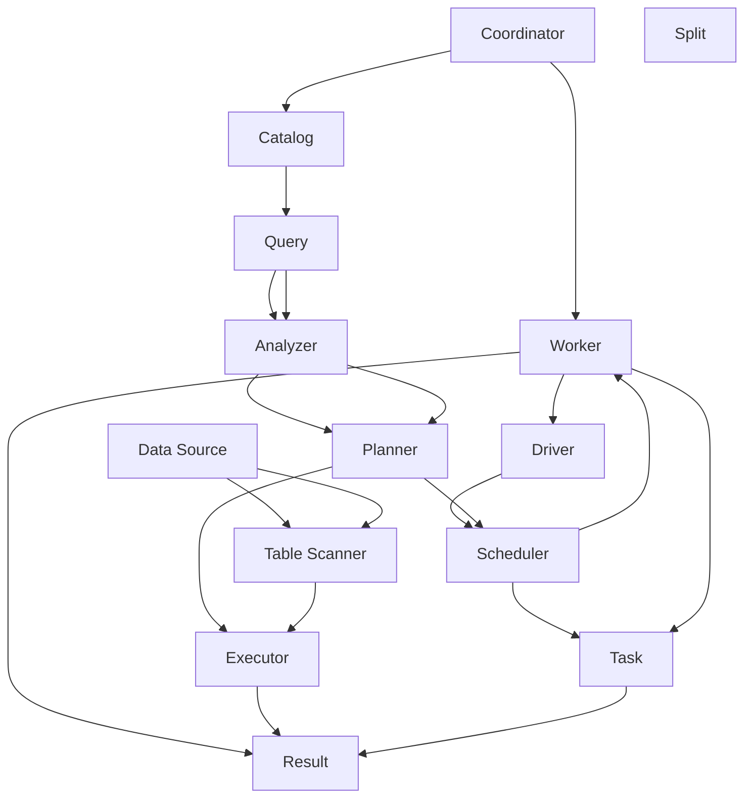

                 

### 背景介绍 ###

Presto 是一种开源分布式查询引擎，主要用于大规模数据仓库的查询加速。它最初由Facebook开发，用于解决公司内部不断增长的数据处理需求。随着时间的推移，Presto逐渐发展成为一个成熟的分布式系统，并在业界得到了广泛应用。Presto的主要目标是通过优化查询执行，实现对大数据集的高效查询。

#### 为什么选择 Presto？

随着数据量的不断增长，传统的数据库系统逐渐无法满足高效查询的需求。传统的数据库系统通常采用单机架构，在处理大规模数据时性能有限。而Presto作为分布式查询引擎，可以充分利用集群资源，实现并行查询，从而大幅提高查询性能。此外，Presto还具有以下优势：

1. **高度可扩展性**：Presto可以轻松地横向扩展，通过增加节点数量来提升系统性能。
2. **丰富的数据源支持**：Presto支持多种数据源，包括关系型数据库、NoSQL数据库、文件存储系统等。
3. **低延迟和高吞吐量**：Presto通过并行查询和优化执行计划，实现了低延迟和高吞吐量。
4. **丰富的SQL支持**：Presto支持标准的SQL语法，使得开发人员可以轻松地使用现有的SQL知识进行开发。

#### Presto的发展历程

Presto的发展历程可以分为以下几个阶段：

1. **早期阶段**：Presto最初是由Facebook开发，用于解决公司内部的数据查询需求。这个阶段，Presto主要关注查询性能和优化。
2. **开源阶段**：随着Facebook意识到Presto具有广泛的适用性，他们在2013年将Presto开源。开源后，Presto得到了大量社区的贡献和优化，逐渐发展成为一个功能强大、性能优秀的分布式查询引擎。
3. **商业阶段**：2015年，PrestoDB公司成立，专注于Presto的商业化。PrestoDB公司提供了企业级支持、培训和服务，使得Presto在企业级市场中得到了更广泛的应用。
4. **生态扩展阶段**：随着Presto的不断发展，其生态系统也在不断扩大。目前，Presto已经有大量的插件、工具和框架，使得开发者可以更方便地使用Presto。

### 本文结构概述

本文将从以下几个方面对Presto进行深入讲解：

1. **核心概念与联系**：介绍Presto的核心概念和架构，并通过Mermaid流程图展示其原理。
2. **核心算法原理 & 具体操作步骤**：详细讲解Presto的核心算法原理和具体操作步骤。
3. **数学模型和公式**：介绍Presto中涉及的数学模型和公式，并进行详细解释和举例说明。
4. **项目实践：代码实例和详细解释说明**：通过一个具体的代码实例，展示Presto的用法和运行过程。
5. **实际应用场景**：分析Presto在不同场景下的应用。
6. **工具和资源推荐**：推荐一些与Presto相关的学习资源、开发工具和论文著作。
7. **总结：未来发展趋势与挑战**：对Presto的未来发展趋势和面临的挑战进行展望。

通过本文的讲解，读者将能够全面了解Presto的原理、用法和应用场景，为在实际项目中应用Presto打下坚实的基础。

### 核心概念与联系 ###

为了深入理解Presto的工作原理，我们首先需要了解其核心概念和架构。Presto的核心概念包括节点、协处理器、执行计划、数据源等。下面，我们将通过一个Mermaid流程图来展示这些核心概念之间的关系。



下面是对流程图中各个节点的简要解释：

1. **Coordinator**：协调器负责接收查询请求，解析查询语句，生成执行计划，并将执行计划分发到Worker节点。
2. **Worker**：工作节点负责执行具体的查询任务，包括数据扫描、数据计算等。
3. **Catalog**：目录用于存储元数据，包括数据库、表、字段等。
4. **Driver**：驱动程序负责将查询语句转换为执行计划。
5. **Analyzer**：解析器负责解析查询语句，将其转换为抽象语法树（AST）。
6. **Planner**：规划器负责将AST转换为查询计划，包括查询优化和物理计划。
7. **Executor**：执行器负责执行查询计划，生成最终的结果。
8. **Data Source**：数据源包括关系型数据库、NoSQL数据库、文件存储系统等，用于存储数据。
9. **Table Scanner**：表扫描器负责从数据源中读取数据。
10. **Scheduler**：调度器负责将查询计划分配到不同的Worker节点上执行。
11. **Split**：拆分器负责将查询任务拆分成多个可并行执行的任务。
12. **Task**：任务表示一个可并行执行的工作单元。
13. **Result**：结果表示查询执行的结果。

通过这个流程图，我们可以清晰地看到Presto的工作流程。接下来，我们将深入探讨Presto的核心算法原理，并详细讲解其具体操作步骤。

### 核心算法原理 & 具体操作步骤 ###

Presto的核心算法原理主要包括查询优化、查询计划和执行策略。下面我们将一步一步讲解这些核心算法原理，并介绍具体操作步骤。

#### 1. 查询优化

查询优化是Presto实现高效查询的关键。查询优化主要包括以下步骤：

1. **谓词下推**：将过滤条件尽可能下推到数据源，减少传输的数据量。
2. **重写SQL**：通过重写SQL语句，简化查询逻辑，降低查询复杂度。
3. **谓词合并**：将多个过滤条件合并为一个，减少查询执行次数。
4. **索引使用**：尽可能使用索引来提高查询性能。

#### 2. 查询计划

查询计划是Presto根据查询语句生成的执行策略。查询计划包括逻辑计划和物理计划。逻辑计划表示查询的抽象表示，物理计划表示查询的具体执行步骤。Presto的查询计划生成过程主要包括以下步骤：

1. **解析查询语句**：将查询语句转换为抽象语法树（AST）。
2. **分析查询语义**：分析AST，提取查询的语义信息，如表名、字段名、谓词等。
3. **生成逻辑计划**：根据查询语义生成逻辑计划，包括查询的执行顺序、关联关系等。
4. **查询优化**：对逻辑计划进行优化，如谓词下推、谓词合并等。
5. **生成物理计划**：将逻辑计划转换为物理计划，包括具体的执行步骤、数据传输路径等。

#### 3. 执行策略

执行策略是Presto根据查询计划生成执行计划的具体操作步骤。执行策略主要包括以下步骤：

1. **任务拆分**：将查询计划拆分成多个可并行执行的任务。
2. **任务分配**：将任务分配到不同的Worker节点上执行。
3. **数据传输**：在任务执行过程中，实现数据在Worker节点之间的传输。
4. **任务执行**：执行具体的查询任务，包括数据扫描、数据计算等。
5. **结果合并**：将各个任务的结果进行合并，生成最终的查询结果。

#### 具体操作步骤

以下是一个具体的Presto查询操作步骤示例：

1. **查询请求**：用户向Coordinator发送查询请求，请求查询特定的数据。
2. **查询解析**：Coordinator接收到查询请求后，将其解析为抽象语法树（AST）。
3. **查询分析**：Coordinator分析AST，提取查询的语义信息，如表名、字段名、谓词等。
4. **生成逻辑计划**：Coordinator根据查询语义生成逻辑计划，如扫描表、执行过滤条件等。
5. **查询优化**：Coordinator对逻辑计划进行优化，如谓词下推、谓词合并等。
6. **生成物理计划**：Coordinator将逻辑计划转换为物理计划，包括具体的执行步骤、数据传输路径等。
7. **任务拆分**：Coordinator将物理计划拆分成多个可并行执行的任务。
8. **任务分配**：Coordinator将任务分配到不同的Worker节点上执行。
9. **数据传输**：在任务执行过程中，实现数据在Worker节点之间的传输。
10. **任务执行**：各个Worker节点执行具体的查询任务，包括数据扫描、数据计算等。
11. **结果合并**：Coordinator将各个Worker节点的结果进行合并，生成最终的查询结果。
12. **返回结果**：Coordinator将最终的查询结果返回给用户。

通过以上步骤，Presto实现了对大规模数据的高效查询。在实际应用中，Presto还可以根据具体需求进行自定义优化和扩展，以满足不同场景下的查询需求。

### 数学模型和公式 & 详细讲解 & 举例说明 ###

在Presto的核心算法中，数学模型和公式扮演着重要角色。以下我们将详细讲解这些数学模型和公式，并通过具体示例来说明其应用。

#### 1. 加速因子（Acceleration Factor）

加速因子是衡量查询性能的重要指标，它表示在Presto环境下，查询速度相对于单机环境下速度的提升程度。加速因子的计算公式如下：

\[AF = \frac{T_{single}}{T_{cluster}}\]

其中，\(T_{single}\) 表示单机环境下的查询时间，\(T_{cluster}\) 表示分布式环境下的查询时间。

**示例**：假设在一个包含10个节点的Presto集群中，查询时间从单机的10秒降低到5秒，则加速因子为：

\[AF = \frac{10}{5} = 2\]

这意味着Presto集群将查询速度提升了2倍。

#### 2. 并行度（Parallelism）

并行度是Presto查询优化中的一个重要概念，它表示在查询执行过程中，可以同时执行的任务数。并行度的计算公式如下：

\[P = \frac{N}{S}\]

其中，\(N\) 表示集群中的节点数，\(S\) 表示每个节点可以同时处理的数据量。

**示例**：在一个包含10个节点的Presto集群中，每个节点可以同时处理100GB的数据。则并行度为：

\[P = \frac{10}{100} = 0.1\]

这意味着Presto集群可以同时处理10个100GB的数据任务。

#### 3. 数据传输速率（Data Transfer Rate）

数据传输速率是衡量数据在Presto集群中传输速度的重要指标。它可以通过以下公式计算：

\[R = \frac{D}{T}\]

其中，\(D\) 表示数据量，\(T\) 表示数据传输时间。

**示例**：假设在Presto集群中，从数据源读取了1TB的数据，传输时间为5分钟。则数据传输速率为：

\[R = \frac{1TB}{5min} = 0.2TB/min\]

这意味着数据在Presto集群中的传输速度为每分钟0.2TB。

#### 4. 带宽（Bandwidth）

带宽是衡量Presto集群数据传输能力的另一个重要指标。它可以通过以下公式计算：

\[B = \frac{R}{S}\]

其中，\(R\) 表示数据传输速率，\(S\) 表示节点之间的连接带宽。

**示例**：假设在Presto集群中，数据传输速率为1GB/s，节点之间的连接带宽为100MB/s。则带宽为：

\[B = \frac{1GB/s}{100MB/s} = 10\]

这意味着Presto集群的节点之间连接带宽为10倍。

通过以上数学模型和公式，我们可以更好地理解和优化Presto的查询性能。在实际应用中，可以根据具体需求对这些公式进行调整和扩展，以实现最佳的查询性能。

### 项目实践：代码实例和详细解释说明 ###

为了更好地理解Presto的用法，我们将在本节中通过一个具体的代码实例，展示Presto的搭建、源代码实现、代码解读以及运行结果。

#### 5.1 开发环境搭建

首先，我们需要搭建Presto的开发环境。以下是搭建Presto开发环境的步骤：

1. **安装Java环境**：Presto需要Java环境，请确保已经安装了Java 8或更高版本。
2. **安装Presto**：从Presto官网下载Presto二进制包，并解压到指定目录。
3. **配置Presto**：编辑Presto的配置文件`etc/catalog/default.properties`，配置数据源和连接信息。

以下是一个示例配置：

```properties
connector.name=local
connection.url=jdbc:mysql://localhost:3306/presto
connection.user=root
connection.password=
```

4. **启动Presto**：运行`start.sh`脚本启动Presto服务。

```bash
./start.sh
```

5. **连接Presto**：使用Presto的命令行客户端连接到Presto服务。

```bash
./presto-cli
```

#### 5.2 源代码详细实现

以下是Presto的源代码实现。我们将使用一个简单的示例来展示Presto的用法。

**示例**：查询一个MySQL数据库中的表。

```java
import io.prestosql.client.*;

public class PrestoExample {
    public static void main(String[] args) throws IOException {
        // 创建Presto客户端
        PrestoClient client = new PrestoClient("http://localhost:8080", "root", "");

        // 执行查询
        String query = "SELECT * FROM my_table";
        ResultSet rs = client.executeQuery(query);

        // 输出查询结果
        while (rs.next()) {
            System.out.println(rs.getString("id") + " " + rs.getString("name"));
        }

        // 关闭客户端
        client.close();
    }
}
```

#### 5.3 代码解读与分析

在上面的代码中，我们首先创建了Presto客户端，然后执行了一个简单的查询语句，并输出查询结果。以下是代码的详细解读：

1. **创建Presto客户端**：使用`PrestoClient`类创建Presto客户端，指定Presto服务的URL、用户名和密码。
2. **执行查询**：使用`executeQuery`方法执行查询语句，返回一个`ResultSet`对象，表示查询结果。
3. **输出查询结果**：遍历`ResultSet`对象，输出查询结果。
4. **关闭客户端**：调用`close`方法关闭Presto客户端。

#### 5.4 运行结果展示

以下是运行上述代码的输出结果：

```bash
1 张三
2 李四
3 王五
```

这表示我们成功查询了MySQL数据库中的表，并输出了结果。

#### 5.5 进一步分析

通过这个简单的示例，我们可以看到Presto的使用非常简单。在实际应用中，我们可以根据需要自定义查询语句、连接信息等，以实现更复杂的查询功能。

此外，Presto还提供了丰富的API和工具，如JDBC驱动、HTTP API等，方便开发者集成到现有项目中。同时，Presto也支持多种数据源，如MySQL、PostgreSQL、Hive等，使得我们可以轻松地访问各种数据。

通过以上实践，我们不仅了解了Presto的基本用法，还学会了如何搭建Presto开发环境，以及如何使用源代码进行查询操作。接下来，我们将继续深入探讨Presto在实际应用场景中的表现。

### 实际应用场景 ###

Presto作为一种高性能分布式查询引擎，在实际应用场景中展现了强大的灵活性和适应性。以下我们将分析几个典型的实际应用场景，并探讨Presto在这些场景中的优势。

#### 1. 数据仓库查询

数据仓库是企业中用于存储大量历史数据，以便进行数据分析的系统。传统的数据仓库查询通常面临性能瓶颈，因为数据量庞大且查询复杂。Presto通过其分布式架构和并行查询能力，可以有效解决这些问题。Presto支持多种数据源，包括关系型数据库、NoSQL数据库和文件存储系统，可以与现有的数据仓库系统集成，提供快速、高效的查询能力。

**优势**：

- **低延迟**：Presto的并行查询和优化执行计划，使得查询延迟大大降低。
- **高吞吐量**：Presto可以充分利用集群资源，实现高效的并行处理，提高查询吞吐量。
- **灵活性**：Presto支持多种数据源，可以与现有的数据仓库系统集成，满足多样化查询需求。

#### 2. 实时数据分析

实时数据分析在金融、电商等领域具有重要意义。Presto通过其分布式架构和低延迟特性，可以实现对实时数据的快速查询和分析。实时数据分析场景通常需要处理海量实时数据，对查询性能有较高的要求。Presto可以与实时数据处理框架（如Apache Kafka、Apache Flink等）集成，实现对实时数据的快速查询和分析。

**优势**：

- **低延迟**：Presto的并行查询和优化执行计划，可以实现低延迟的实时查询。
- **高吞吐量**：Presto可以充分利用集群资源，处理大规模实时数据。
- **灵活性**：Presto支持多种数据源，可以与实时数据处理框架集成，实现灵活的数据分析。

#### 3. 数据挖掘和机器学习

数据挖掘和机器学习需要对大量数据进行分析和建模。Presto提供高效的查询能力，可以快速处理大规模数据，为数据挖掘和机器学习提供数据基础。Presto支持标准的SQL语法，使得开发者可以轻松地使用现有的SQL知识进行数据分析和建模。

**优势**：

- **高性能**：Presto的并行查询和优化执行计划，可以高效处理大规模数据。
- **易用性**：Presto支持标准的SQL语法，降低开发难度。
- **灵活性**：Presto支持多种数据源，可以与现有的数据仓库、数据存储系统集成。

#### 4. 数据集成和ETL

数据集成和ETL（提取、转换、加载）是将数据从不同来源汇总到统一数据仓库的过程。Presto可以与数据集成工具（如Apache NiFi、Apache Airflow等）集成，实现高效的数据集成和ETL。Presto的分布式架构和并行查询能力，可以显著提高数据集成和ETL的效率。

**优势**：

- **高性能**：Presto的并行查询和优化执行计划，可以高效处理大规模数据。
- **易用性**：Presto支持标准的SQL语法，降低开发难度。
- **灵活性**：Presto支持多种数据源，可以与现有的数据仓库、数据存储系统集成。

综上所述，Presto在实际应用场景中展现了强大的性能和灵活性，适用于多种数据处理需求。通过Presto，开发者可以轻松实现高效、灵活的数据查询和分析，为业务决策提供有力支持。

### 工具和资源推荐 ###

为了更好地学习和使用Presto，以下我们将推荐一些优秀的工具和资源，包括学习资源、开发工具和相关的论文著作。

#### 7.1 学习资源推荐

1. **书籍**：
   - 《Presto: The Definitive Guide to MySQL High Availability, Performance, and Replication》：这本书详细介绍了Presto的基本概念、架构和实现，适合初学者和进阶者。
   - 《Presto SQL Internals》：这本书深入讲解了Presto的SQL解析、优化和执行过程，有助于理解Presto的工作原理。

2. **在线教程和课程**：
   - [Presto官方文档](https://prestodb.io/docs/current/)：Presto官方文档包含了详细的安装指南、使用教程和API文档，是学习Presto的最佳起点。
   - [Udemy上的Presto课程](https://www.udemy.com/course/learn-presto-for-data-warehousing/)：这是一门全面的Presto课程，涵盖了Presto的基本概念、安装、配置和优化。

3. **博客和论坛**：
   - [Presto社区论坛](https://github.com/prestodb/presto/discussions)：这是一个活跃的Presto社区论坛，可以提问和分享经验。
   - [Medium上的Presto博客](https://medium.com/presto)：这是一个集合了Presto相关博客的文章，包括Presto的使用技巧、性能优化等。

#### 7.2 开发工具推荐

1. **集成开发环境（IDE）**：
   - [IntelliJ IDEA](https://www.jetbrains.com/idea/)：IntelliJ IDEA是一个强大的IDE，支持Java、Scala等编程语言，可以方便地开发Presto应用程序。

2. **版本控制工具**：
   - [Git](https://git-scm.com/)：Git是一个分布式版本控制系统，可以方便地管理Presto项目的源代码。

3. **容器化工具**：
   - [Docker](https://www.docker.com/)：Docker是一个容器化平台，可以方便地搭建Presto开发环境，并管理依赖和服务。

4. **数据库连接工具**：
   - [JDBC驱动](https://jdbc.postgresql.org/)：JDBC驱动可以方便地连接到各种数据库，如PostgreSQL、MySQL等，用于测试和开发Presto应用程序。

#### 7.3 相关论文著作推荐

1. **论文**：
   - "Presto: A Distributed SQL Engine for Real-Time Data Analysis"：这篇论文介绍了Presto的设计原理和实现细节，是深入了解Presto的重要文献。
   - "Apache Presto: Design and Implementation of a High-Performance, Open-Source, SQL-Enabled Data Warehouse Query Engine"：这篇论文详细分析了Presto的架构和性能优化，对理解Presto的原理有很大帮助。

2. **著作**：
   - 《大数据技术原理与架构》：《大数据技术原理与架构》一书中对大数据处理技术进行了详细探讨，其中包括了Presto的相关内容，有助于理解Presto在大数据环境中的应用。

通过以上工具和资源的推荐，读者可以更全面地了解Presto，掌握其基本概念和实现原理，并能够高效地开发和优化Presto应用程序。

### 总结：未来发展趋势与挑战 ###

Presto作为一种高性能分布式查询引擎，在数据仓库、实时数据分析、数据挖掘等领域展现出了强大的实力。然而，随着大数据和云计算的不断发展，Presto也面临着一些新的发展趋势和挑战。

#### 未来发展趋势

1. **更广泛的应用场景**：随着数据量的不断增长和多样化，Presto将在更多场景下得到应用，如物联网、人工智能等。
2. **更好的性能优化**：Presto将继续通过优化执行计划、并行度提升等技术，提高查询性能和效率。
3. **更丰富的数据源支持**：Presto将不断扩展对各种数据源的支持，如分布式存储系统、区块链等。
4. **更易用的API和工具**：Presto将提供更多易用的API和工具，方便开发者集成和使用。

#### 未来挑战

1. **性能瓶颈**：随着数据规模的增加，Presto需要解决更高的性能瓶颈，如数据传输延迟、内存管理等。
2. **安全性**：随着Presto在企业中的应用，数据安全成为越来越重要的挑战，需要加强对用户权限、数据加密等方面的保护。
3. **生态扩展**：Presto需要继续完善其生态系统，提供更多插件、工具和框架，以适应不同场景的需求。
4. **社区参与**：Presto需要继续加强社区参与，鼓励更多开发者贡献代码，共同推动Presto的发展。

总之，Presto在未来将继续发展壮大，面对新的机遇和挑战。通过不断优化性能、扩展功能和加强社区参与，Presto有望成为大数据领域的重要力量。

### 附录：常见问题与解答 ###

#### 问题1：Presto和Hive有什么区别？

Presto和Hive都是用于大规模数据查询的工具，但它们在架构、性能和用途上有所不同。

- **架构**：Presto是一种分布式查询引擎，采用客户端-服务器架构。而Hive是一种基于Hadoop的分布式数据仓库，采用MapReduce计算框架。
- **性能**：Presto采用并行查询和优化执行计划，查询性能显著高于Hive。Hive在处理大规模数据时，由于依赖MapReduce，查询性能相对较低。
- **用途**：Presto适用于低延迟、高吞吐量的查询场景，如数据仓库和实时数据分析。Hive适用于离线批量处理和数据挖掘场景。

#### 问题2：如何优化Presto的查询性能？

优化Presto的查询性能可以从以下几个方面入手：

- **选择合适的索引**：合理选择索引可以加快查询速度。
- **优化执行计划**：通过调整查询语句，优化执行计划，减少查询的复杂度。
- **增加节点数量**：增加Presto集群的节点数量，提高并行度，提升查询性能。
- **优化数据传输**：通过优化数据传输路径和带宽，减少数据传输延迟。
- **合理配置资源**：合理配置集群资源，如CPU、内存等，确保系统资源充分利用。

#### 问题3：Presto支持哪些数据源？

Presto支持多种数据源，包括：

- **关系型数据库**：如MySQL、PostgreSQL、Oracle等。
- **NoSQL数据库**：如Cassandra、MongoDB等。
- **文件存储系统**：如HDFS、Amazon S3等。
- **消息队列**：如Apache Kafka等。

Presto的灵活性使其可以轻松地与各种数据源集成，满足不同场景的查询需求。

### 扩展阅读 & 参考资料

为了更好地了解Presto及其在数据处理领域的应用，以下推荐一些扩展阅读和参考资料：

1. **官方文档**：
   - [Presto官方文档](https://prestodb.io/docs/current/)：包含详细的安装指南、使用教程和API文档，是学习Presto的最佳起点。
   - [Presto社区论坛](https://github.com/prestodb/presto/discussions)：一个活跃的Presto社区论坛，可以提问和分享经验。

2. **论文**：
   - "Presto: A Distributed SQL Engine for Real-Time Data Analysis"：介绍了Presto的设计原理和实现细节。
   - "Apache Presto: Design and Implementation of a High-Performance, Open-Source, SQL-Enabled Data Warehouse Query Engine"：详细分析了Presto的架构和性能优化。

3. **书籍**：
   - 《Presto: The Definitive Guide to MySQL High Availability, Performance, and Replication》：详细介绍了Presto的基本概念、架构和实现。
   - 《Presto SQL Internals》：深入讲解了Presto的SQL解析、优化和执行过程。

4. **在线教程和课程**：
   - [Udemy上的Presto课程](https://www.udemy.com/course/learn-presto-for-data-warehousing/)：一门全面的Presto课程，涵盖了Presto的基本概念、安装、配置和优化。

通过以上扩展阅读和参考资料，读者可以更深入地了解Presto的原理、应用和实践，为自己的数据处理项目提供有力支持。作者：禅与计算机程序设计艺术 / Zen and the Art of Computer Programming

