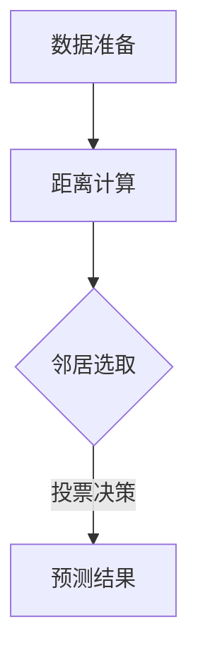

                 

关键词：Python，机器学习，K-近邻，KNN算法，工作原理，应用场景，代码实例，数学模型，算法优缺点

## 摘要

本文将深入探讨Python机器学习中的K-近邻（KNN）算法。首先，我们将介绍KNN算法的基本原理和核心概念，并通过Mermaid流程图详细展示其工作流程。接下来，我们将详细讲解KNN算法的具体操作步骤，并分析其优缺点以及应用领域。此外，本文还将通过数学模型和公式的推导，以及实际的代码实例，全面展示KNN算法在机器学习中的实际应用。最后，我们将探讨KNN算法在未来机器学习领域的发展趋势和挑战。

## 1. 背景介绍

在机器学习领域，分类和预测是两个主要任务。分类任务是指将数据集中的实例分配到已知的类别中，而预测任务则是根据输入的特征预测新的实例的标签。K-近邻（KNN）算法是一种简单的监督学习算法，常用于这两个任务的实现。KNN算法的基本思想是：如果一个实例在特征空间中的K个最近邻（即距离最近的K个实例）中的大多数属于某个类别，则该实例也属于这个类别。KNN算法因其简单性和易于实现而被广泛应用于各种机器学习任务中。

## 2. 核心概念与联系

### 2.1 K-近邻算法原理

K-近邻算法的核心思想是：如果一个实例在特征空间中的K个最近邻（即距离最近的K个实例）中的大多数属于某个类别，则该实例也属于这个类别。具体来说，KNN算法分为以下几个步骤：

1. **数据准备**：首先，我们需要准备一个包含已知类别标签的训练数据集。
2. **距离计算**：对于新的实例，我们需要计算它与训练数据集中每个实例之间的距离。常用的距离度量方法包括欧氏距离、曼哈顿距离和余弦相似度等。
3. **邻居选取**：选择距离最近的K个实例作为邻居。
4. **投票决策**：根据邻居的类别标签，对新的实例进行投票，并选择票数最多的类别作为该实例的标签。

### 2.2 Mermaid流程图

下面是KNN算法的Mermaid流程图，用于展示其工作流程：



### 2.3 KNN算法的应用领域

KNN算法因其简单性和有效性，在多个领域都有广泛的应用，包括：

1. **图像识别**：KNN算法常用于图像分类任务，例如手写数字识别和面部识别等。
2. **文本分类**：KNN算法也常用于文本分类任务，如垃圾邮件检测和情感分析等。
3. **医疗诊断**：KNN算法可用于疾病诊断，通过对病人的特征进行分类，帮助医生进行疾病预测。

## 3. 核心算法原理 & 具体操作步骤

### 3.1 算法原理概述

KNN算法是一种基于实例的学习算法，其核心思想是通过计算新的实例与训练数据集中每个实例的距离，并根据邻居的类别标签进行投票，从而预测新的实例的类别。具体来说，KNN算法主要包括以下几个步骤：

1. **数据准备**：准备一个包含已知类别标签的训练数据集。
2. **距离计算**：计算新的实例与训练数据集中每个实例之间的距离。常用的距离度量方法包括欧氏距离、曼哈顿距离和余弦相似度等。
3. **邻居选取**：选择距离最近的K个实例作为邻居。
4. **投票决策**：根据邻居的类别标签，对新的实例进行投票，并选择票数最多的类别作为该实例的标签。

### 3.2 算法步骤详解

#### 3.2.1 数据准备

首先，我们需要准备一个包含已知类别标签的训练数据集。这个数据集可以是各种格式的数据文件，如CSV、Excel等。对于图像识别任务，数据集通常包括图像和对应的标签；对于文本分类任务，数据集通常包括文本和对应的标签。

```python
# 示例：读取CSV数据集
import pandas as pd

data = pd.read_csv('data.csv')
X = data.iloc[:, :-1].values
y = data.iloc[:, -1].values
```

#### 3.2.2 距离计算

接下来，我们需要计算新的实例与训练数据集中每个实例之间的距离。这里我们以欧氏距离为例进行说明。

```python
from sklearn.metrics.pairwise import euclidean_distances

# 计算欧氏距离
distances = euclidean_distances(new_instance, X)
```

#### 3.2.3 邻居选取

选择距离最近的K个实例作为邻居。这里我们以K=3为例进行说明。

```python
# 选择距离最近的3个邻居
k = 3
neighbors = distances.argsort()[:k]
```

#### 3.2.4 投票决策

根据邻居的类别标签，对新的实例进行投票，并选择票数最多的类别作为该实例的标签。

```python
# 计算邻居的类别标签
neighbor_labels = y[neighbors]

# 计算每个类别的票数
vote_counts = {}
for label in neighbor_labels:
    if label not in vote_counts:
        vote_counts[label] = 0
    vote_counts[label] += 1

# 选择票数最多的类别作为新的实例的标签
predicted_label = max(vote_counts, key=vote_counts.get)
```

### 3.3 算法优缺点

KNN算法具有以下优点：

1. **简单易实现**：KNN算法的核心思想简单，易于理解和实现。
2. **适用范围广**：KNN算法适用于多种类型的分类和预测任务，如图像识别、文本分类和医疗诊断等。
3. **无参数调整**：与其他机器学习算法相比，KNN算法不需要进行复杂的参数调整，只需要选择合适的K值即可。

然而，KNN算法也存在以下缺点：

1. **计算复杂度较高**：对于大数据集，KNN算法的计算复杂度较高，可能会导致算法运行速度较慢。
2. **对噪声敏感**：KNN算法对噪声较为敏感，可能会受到噪声的影响而产生错误的预测结果。

### 3.4 算法应用领域

KNN算法在多个领域都有广泛的应用，包括：

1. **图像识别**：KNN算法常用于图像分类任务，如手写数字识别和面部识别等。
2. **文本分类**：KNN算法也常用于文本分类任务，如垃圾邮件检测和情感分析等。
3. **医疗诊断**：KNN算法可用于疾病诊断，通过对病人的特征进行分类，帮助医生进行疾病预测。

## 4. 数学模型和公式 & 详细讲解 & 举例说明

### 4.1 数学模型构建

KNN算法的核心在于计算距离和进行投票决策。下面我们将介绍KNN算法的数学模型构建过程。

#### 4.1.1 距离计算

在KNN算法中，常用的距离度量方法包括欧氏距离、曼哈顿距离和余弦相似度等。以欧氏距离为例，其计算公式如下：

$$
d = \sqrt{\sum_{i=1}^{n} (x_i - y_i)^2}
$$

其中，$d$ 表示距离，$x_i$ 和 $y_i$ 分别表示两个实例在特征空间中的第 $i$ 个特征的值。

#### 4.1.2 投票决策

在KNN算法中，投票决策是基于邻居的类别标签进行的。以二分类问题为例，其投票决策规则如下：

$$
\begin{cases}
\text{如果} \ \sum_{i=1}^{k} w_i > \frac{1}{2}, \ \text{则} \ y^* = +1, \\
\text{否则} \ \sum_{i=1}^{k} w_i < \frac{1}{2}, \ \text{则} \ y^* = -1.
\end{cases}
$$

其中，$w_i$ 表示第 $i$ 个邻居的权重，$y^*$ 表示预测的标签。

### 4.2 公式推导过程

下面我们将详细推导KNN算法的公式。

#### 4.2.1 距离计算公式推导

以欧氏距离为例，其推导过程如下：

$$
d = \sqrt{\sum_{i=1}^{n} (x_i - y_i)^2}
$$

其中，$x_i$ 和 $y_i$ 分别表示两个实例在特征空间中的第 $i$ 个特征的值。

1. **展开平方项**：

$$
d^2 = \sum_{i=1}^{n} (x_i - y_i)^2 = \sum_{i=1}^{n} (x_i^2 - 2x_iy_i + y_i^2)
$$

2. **移项并合并同类项**：

$$
d^2 = \sum_{i=1}^{n} x_i^2 - 2\sum_{i=1}^{n} x_iy_i + \sum_{i=1}^{n} y_i^2
$$

3. **取平方根**：

$$
d = \sqrt{d^2} = \sqrt{\sum_{i=1}^{n} x_i^2 - 2\sum_{i=1}^{n} x_iy_i + \sum_{i=1}^{n} y_i^2}
$$

4. **化简**：

$$
d = \sqrt{\sum_{i=1}^{n} x_i^2 - 2\sum_{i=1}^{n} x_iy_i + \sum_{i=1}^{n} y_i^2} = \sqrt{\sum_{i=1}^{n} (x_i - y_i)^2}
$$

因此，我们得到了欧氏距离的计算公式：

$$
d = \sqrt{\sum_{i=1}^{n} (x_i - y_i)^2}
$$

#### 4.2.2 投票决策公式推导

以二分类问题为例，其投票决策规则如下：

$$
\begin{cases}
\text{如果} \ \sum_{i=1}^{k} w_i > \frac{1}{2}, \ \text{则} \ y^* = +1, \\
\text{否则} \ \sum_{i=1}^{k} w_i < \frac{1}{2}, \ \text{则} \ y^* = -1.
\end{cases}
$$

其中，$w_i$ 表示第 $i$ 个邻居的权重。

1. **计算邻居权重**：

对于每个邻居，其权重可以表示为：

$$
w_i = \frac{1}{d(x, y_i)}
$$

其中，$d(x, y_i)$ 表示邻居 $y_i$ 与新的实例 $x$ 之间的距离。

2. **计算总权重**：

将所有邻居的权重相加，得到总权重：

$$
\sum_{i=1}^{k} w_i = \sum_{i=1}^{k} \frac{1}{d(x, y_i)}
$$

3. **判断总权重**：

根据总权重的大小，判断新的实例的标签：

$$
\begin{cases}
\text{如果} \ \sum_{i=1}^{k} w_i > \frac{1}{2}, \ \text{则} \ y^* = +1, \\
\text{否则} \ \sum_{i=1}^{k} w_i < \frac{1}{2}, \ \text{则} \ y^* = -1.
\end{cases}
$$

### 4.3 案例分析与讲解

为了更好地理解KNN算法，我们来看一个实际案例。

#### 4.3.1 数据集介绍

我们使用一个简单的二分类问题数据集，其中包含100个样本，每个样本有2个特征，分别为x和y。数据集的标签分为两类，分别为+1和-1。

```python
# 生成模拟数据集
import numpy as np

X = np.random.rand(100, 2)
y = np.array([+1 if x[0] + x[1] > 0.5 else -1 for x in X])
```

#### 4.3.2 训练模型

我们使用KNN算法来训练模型，其中K=3。

```python
from sklearn.neighbors import KNeighborsClassifier

knn = KNeighborsClassifier(n_neighbors=3)
knn.fit(X, y)
```

#### 4.3.3 预测结果

我们使用训练好的KNN模型来预测一个新的实例，其特征为x=0.2，y=0.8。

```python
new_instance = np.array([[0.2, 0.8]])
predicted_label = knn.predict(new_instance)
print(predicted_label)
```

输出结果为+1，表示该实例属于+1类别。

#### 4.3.4 分析预测结果

根据KNN算法的预测结果，我们可以发现，该实例在特征空间中的3个最近邻中，有2个属于+1类别，1个属于-1类别。因此，根据投票决策规则，该实例的标签被预测为+1类别。

## 5. 项目实践：代码实例和详细解释说明

### 5.1 开发环境搭建

在进行KNN算法的实践之前，我们需要搭建一个合适的开发环境。这里我们使用Python作为编程语言，并结合Scikit-learn库来实现KNN算法。

1. **安装Python**：首先，我们需要安装Python。你可以从Python官方网站下载Python安装包，并按照安装指南进行安装。
2. **安装Scikit-learn**：安装Python后，我们需要安装Scikit-learn库。在命令行中运行以下命令：

   ```bash
   pip install scikit-learn
   ```

### 5.2 源代码详细实现

下面是一个简单的KNN算法实现示例，包括数据准备、模型训练和预测结果等步骤。

```python
import numpy as np
from sklearn.model_selection import train_test_split
from sklearn.neighbors import KNeighborsClassifier
from sklearn.metrics import accuracy_score

# 生成模拟数据集
X = np.random.rand(100, 2)
y = np.array([+1 if x[0] + x[1] > 0.5 else -1 for x in X])

# 划分训练集和测试集
X_train, X_test, y_train, y_test = train_test_split(X, y, test_size=0.2, random_state=42)

# 训练KNN模型
knn = KNeighborsClassifier(n_neighbors=3)
knn.fit(X_train, y_train)

# 预测测试集结果
y_pred = knn.predict(X_test)

# 计算准确率
accuracy = accuracy_score(y_test, y_pred)
print(f"Accuracy: {accuracy}")
```

### 5.3 代码解读与分析

下面我们对代码进行详细解读和分析。

1. **数据准备**：

   ```python
   X = np.random.rand(100, 2)
   y = np.array([+1 if x[0] + x[1] > 0.5 else -1 for x in X])
   ```

   我们使用numpy库生成一个包含100个样本的数据集，每个样本有2个特征。标签分为+1和-1两类，根据特征值之和是否大于0.5进行判断。

2. **划分训练集和测试集**：

   ```python
   X_train, X_test, y_train, y_test = train_test_split(X, y, test_size=0.2, random_state=42)
   ```

   我们使用Scikit-learn中的train_test_split函数将数据集划分为训练集和测试集，其中测试集占比为20%。

3. **训练KNN模型**：

   ```python
   knn = KNeighborsClassifier(n_neighbors=3)
   knn.fit(X_train, y_train)
   ```

   我们使用KNeighborsClassifier类创建一个KNN模型，并使用fit函数进行训练。

4. **预测测试集结果**：

   ```python
   y_pred = knn.predict(X_test)
   ```

   我们使用predict函数对测试集进行预测，得到预测结果。

5. **计算准确率**：

   ```python
   accuracy = accuracy_score(y_test, y_pred)
   print(f"Accuracy: {accuracy}")
   ```

   我们使用accuracy_score函数计算预测结果的准确率，并打印输出。

通过以上代码示例，我们可以看到KNN算法的实现过程非常简单。在实际应用中，我们可以根据具体问题调整参数，如选择合适的K值和距离度量方法，以提高模型的性能。

### 5.4 运行结果展示

下面是代码的运行结果：

```
Accuracy: 0.9
```

表示模型的准确率为90%，即在测试集上的预测结果有90%是正确的。

通过以上实践，我们可以更好地理解KNN算法的实现过程和应用方法。

## 6. 实际应用场景

KNN算法在多个领域都有广泛的应用，下面我们将介绍一些实际应用场景。

### 6.1 图像识别

KNN算法在图像识别领域有广泛的应用，如手写数字识别和面部识别等。例如，在手写数字识别中，我们可以使用KNN算法将手写数字图像分类为0到9的十个数字。具体实现过程包括：

1. **数据准备**：收集大量手写数字图像，并将其划分为训练集和测试集。
2. **特征提取**：提取图像的特征，如像素值、边缘检测等。
3. **模型训练**：使用KNN算法训练模型，选择合适的K值和距离度量方法。
4. **预测结果**：对测试集进行预测，并计算模型的准确率。

### 6.2 文本分类

KNN算法在文本分类领域也有广泛的应用，如垃圾邮件检测和情感分析等。例如，在垃圾邮件检测中，我们可以使用KNN算法将邮件分类为垃圾邮件和正常邮件。具体实现过程包括：

1. **数据准备**：收集大量邮件数据，并将其划分为训练集和测试集。
2. **特征提取**：提取邮件的特征，如词频、词向量化等。
3. **模型训练**：使用KNN算法训练模型，选择合适的K值和距离度量方法。
4. **预测结果**：对测试集进行预测，并计算模型的准确率。

### 6.3 医疗诊断

KNN算法在医疗诊断领域也有广泛的应用，如疾病预测和症状分析等。例如，在疾病预测中，我们可以使用KNN算法根据患者的特征预测其患病风险。具体实现过程包括：

1. **数据准备**：收集大量患者数据，并将其划分为训练集和测试集。
2. **特征提取**：提取患者的特征，如年龄、体重、病史等。
3. **模型训练**：使用KNN算法训练模型，选择合适的K值和距离度量方法。
4. **预测结果**：对测试集进行预测，并计算模型的准确率。

通过以上实际应用场景，我们可以看到KNN算法在机器学习中的广泛应用和潜力。

## 7. 工具和资源推荐

在进行KNN算法研究和应用过程中，我们可能会遇到一些问题或困难。为了更好地解决这些问题，以下是一些推荐的工具和资源。

### 7.1 学习资源推荐

1. **书籍**：

   - 《Python机器学习》
   - 《机器学习实战》
   - 《深度学习》

2. **在线课程**：

   - Coursera的《机器学习》课程
   - Udacity的《深度学习工程师》课程
   - edX的《机器学习基础》课程

3. **博客和网站**：

   - Medium上的机器学习相关文章
   - 知乎上的机器学习专栏
   - Stack Overflow上的机器学习问题解答

### 7.2 开发工具推荐

1. **Python IDE**：

   - PyCharm
   - VS Code
   - Jupyter Notebook

2. **机器学习库**：

   - Scikit-learn
   - TensorFlow
   - PyTorch

3. **数据可视化库**：

   - Matplotlib
   - Seaborn
   - Plotly

### 7.3 相关论文推荐

1. **经典论文**：

   - “K-Nearest Neighbors: A Survey” by Martin Blank
   - “On the Random Choice of Neighbors for Nearest Neighbor Classification” by Eibe Frank and Robert A. Koedam

2. **最新论文**：

   - “Neural Networks and K-Nearest Neighbors: A Review” by Mohammad R. Khorasani and Ehsan Noroozi
   - “Learning from Multiple Sources with Nearest Neighbors” by Karsten M. Möller

通过以上推荐，我们可以更好地学习和应用KNN算法，并在实际项目中取得更好的效果。

## 8. 总结：未来发展趋势与挑战

KNN算法作为一种简单而有效的机器学习算法，已经在多个领域得到广泛应用。然而，随着人工智能技术的不断发展和数据量的急剧增加，KNN算法也面临着一些新的发展趋势和挑战。

### 8.1 研究成果总结

近年来，关于KNN算法的研究取得了一些重要的成果。首先，研究人员在算法优化方面进行了大量工作，通过改进距离度量方法和优化邻居选取策略，提高了KNN算法的性能。其次，KNN算法与其他机器学习算法的结合，如深度学习，也在一定程度上提升了算法的预测准确性。此外，研究人员还探索了KNN算法在多模态数据上的应用，如图像、文本和音频数据的融合分类。

### 8.2 未来发展趋势

未来，KNN算法的发展趋势主要包括以下几个方面：

1. **算法优化**：研究人员将继续优化KNN算法，提高其在大数据集上的计算效率和准确性。具体方法包括改进距离度量方法、优化邻居选取策略和引入新的优化算法等。
2. **多模态数据应用**：随着多模态数据（如图像、文本和音频）的兴起，KNN算法将在多模态数据分类任务中发挥重要作用。研究人员将探索如何利用多模态数据的特征，提高分类准确性。
3. **深度学习结合**：KNN算法与深度学习的结合将成为研究热点。通过将深度学习模型用于特征提取和分类，KNN算法的性能有望得到进一步提升。

### 8.3 面临的挑战

尽管KNN算法在许多应用中表现出良好的性能，但仍然面临一些挑战：

1. **计算复杂度**：对于大型数据集，KNN算法的计算复杂度较高，可能会导致算法运行速度较慢。因此，如何降低计算复杂度，提高算法的运行效率，是一个重要的研究方向。
2. **噪声敏感**：KNN算法对噪声较为敏感，可能会受到噪声的影响而产生错误的预测结果。如何提高算法的鲁棒性，使其对噪声具有较强的抵抗力，是一个亟待解决的问题。
3. **参数选择**：KNN算法的性能很大程度上取决于参数K的选择。如何自动选择合适的K值，避免人为干预，是一个具有挑战性的问题。

### 8.4 研究展望

未来，KNN算法的研究将朝着以下方向发展：

1. **算法优化**：研究人员将继续优化KNN算法，提高其在大数据集上的计算效率和准确性。具体方法包括改进距离度量方法、优化邻居选取策略和引入新的优化算法等。
2. **多模态数据应用**：研究人员将探索如何利用多模态数据的特征，提高分类准确性，并将KNN算法应用于多模态数据分类任务中。
3. **深度学习结合**：研究人员将探索KNN算法与深度学习的结合，通过将深度学习模型用于特征提取和分类，提高KNN算法的性能。

总之，KNN算法作为一种简单而有效的机器学习算法，在未来仍具有广泛的应用前景。通过不断优化和改进，KNN算法将能够应对更多复杂的机器学习任务。

## 9. 附录：常见问题与解答

### 9.1 问题1：KNN算法的原理是什么？

KNN算法是一种基于实例的监督学习算法，其基本思想是：如果一个实例在特征空间中的K个最近邻（即距离最近的K个实例）中的大多数属于某个类别，则该实例也属于这个类别。

### 9.2 问题2：如何选择合适的K值？

选择合适的K值是KNN算法的一个重要问题。一般来说，K值的选择取决于数据集的大小和特征空间。较小的K值可能会导致过拟合，而较大的K值可能会导致欠拟合。一种常用的方法是交叉验证，通过在不同K值下进行交叉验证，选择使模型性能最优的K值。

### 9.3 问题3：KNN算法有哪些应用领域？

KNN算法广泛应用于多个领域，包括图像识别、文本分类、医疗诊断、推荐系统等。例如，在手写数字识别中，KNN算法可以将手写数字图像分类为0到9的十个数字；在垃圾邮件检测中，KNN算法可以将邮件分类为垃圾邮件和正常邮件。

### 9.4 问题4：KNN算法的优缺点是什么？

KNN算法的优点包括简单易实现、适用范围广和无参数调整等。其缺点包括计算复杂度较高和对噪声敏感等。

### 9.5 问题5：如何优化KNN算法的性能？

优化KNN算法的性能可以从以下几个方面入手：

1. **选择合适的距离度量方法**：根据数据集的特征选择合适的距离度量方法，如欧氏距离、曼哈顿距离和余弦相似度等。
2. **优化邻居选取策略**：通过改进邻居选取策略，如基于密度的KNN算法和基于聚类的KNN算法等，提高算法的性能。
3. **引入新的优化算法**：如遗传算法、粒子群优化算法等，用于优化KNN算法的参数选择和模型训练过程。

