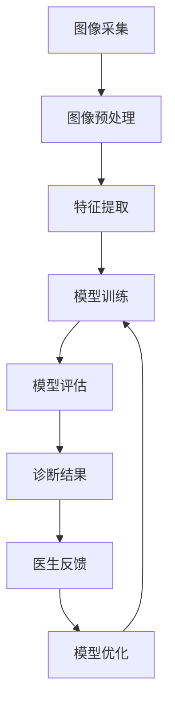

                 

### 1. 背景介绍

#### 医疗影像诊断的重要性

医疗影像诊断在医疗领域中占据着至关重要的地位。通过医学影像技术，如X射线、CT扫描、MRI、超声等，医生能够直观地观察人体内部的病理变化，从而做出准确的诊断。这些影像数据不仅可以帮助医生发现早期病变，提高疾病的治愈率，还能为制定个性化的治疗方案提供重要依据。

随着人工智能技术的飞速发展，机器学习在医疗影像诊断中的应用也越来越广泛。传统的影像诊断主要依赖于医生的视觉判断，而机器学习算法可以通过分析大量的影像数据，发现医生难以察觉的细微病变，从而提高诊断的准确性和效率。此外，机器学习还可以帮助医生从海量影像数据中快速筛选出有价值的诊断信息，减少医生的工作量。

#### 机器学习在医疗影像诊断中的应用

机器学习在医疗影像诊断中的应用可以分为以下几个方向：

1. **图像分类与识别**：通过训练深度神经网络，将影像数据分类为正常或异常，例如，检测肺癌、乳腺癌等疾病。

2. **病灶检测与分割**：利用算法自动识别并标注出影像中的病变区域，如肿瘤、病变组织等。

3. **图像增强与去噪**：改善影像质量，提高诊断准确性。

4. **图像重建与合成**：通过算法生成高质量的重建影像，为诊断和治疗提供更加全面的参考信息。

5. **辅助诊断与预测**：利用影像数据预测疾病的进展和治疗效果，为临床决策提供支持。

本文将聚焦于Python机器学习在医疗影像诊断中的应用，通过详细的算法原理、具体操作步骤和实际案例，帮助读者深入了解并掌握如何利用机器学习技术提高医疗影像诊断的准确性和效率。

### 2. 核心概念与联系

为了深入理解机器学习在医疗影像诊断中的应用，我们需要先掌握一些核心概念，并了解它们之间的联系。以下是一些关键概念及其相互关系：

#### 机器学习的基本概念

1. **监督学习**：通过已标记的训练数据来训练模型，然后使用该模型对新数据进行预测。监督学习通常用于分类和回归任务。

2. **无监督学习**：没有已标记的数据，算法通过发现数据中的模式或结构来进行学习。无监督学习常用于聚类和降维任务。

3. **深度学习**：一种特殊类型的机器学习，通过多层神经网络来学习数据的高级特征表示。

4. **卷积神经网络（CNN）**：一种深度学习模型，专门用于处理图像数据，通过卷积操作提取图像特征。

#### 医疗影像诊断中的核心概念

1. **图像预处理**：包括图像去噪、对比度增强、裁剪等步骤，以提高图像质量，为后续分析提供更好的数据基础。

2. **特征提取**：从图像中提取有用的信息，用于训练机器学习模型。对于医疗影像，特征提取包括边缘检测、纹理分析等。

3. **图像分割**：将图像分割成不同的区域，以便对每个区域进行独立分析。在医疗影像诊断中，图像分割通常用于识别病变区域。

4. **分类与识别**：使用机器学习模型对图像进行分类或识别，判断图像是否包含特定疾病或病变。

#### Mermaid流程图

以下是一个描述机器学习在医疗影像诊断中应用流程的Mermaid流程图，展示各概念之间的联系：



在这个流程图中：

- **图像采集**：获取患者的医学影像数据。
- **图像预处理**：对影像进行去噪、增强等处理，提高图像质量。
- **特征提取**：从预处理后的图像中提取有用的信息。
- **模型训练**：使用提取的特征数据训练机器学习模型。
- **模型评估**：评估模型的性能，确定是否满足诊断需求。
- **诊断结果**：模型根据训练结果对新的影像数据进行诊断。
- **医生反馈**：医生根据诊断结果提供反馈。
- **模型优化**：根据医生反馈优化模型，提高诊断准确性。

通过理解这些核心概念及其相互关系，我们可以更深入地探讨如何应用机器学习技术提高医疗影像诊断的效率和准确性。

### 3. 核心算法原理 & 具体操作步骤

在医疗影像诊断中，机器学习算法的选取和应用至关重要。本文将详细介绍几种常用的机器学习算法，并阐述其具体操作步骤。

#### 3.1 卷积神经网络（CNN）

卷积神经网络（CNN）是一种深度学习模型，特别适合处理图像数据。CNN通过多个卷积层、池化层和全连接层，逐步提取图像中的高级特征，从而实现图像分类、识别和分割等功能。

**具体操作步骤：**

1. **数据准备**：
   - **数据集划分**：将数据集划分为训练集、验证集和测试集。
   - **图像预处理**：对图像进行归一化、缩放等操作，以适应模型输入。

2. **模型构建**：
   - **卷积层**：使用卷积操作提取图像的局部特征。
   - **池化层**：对卷积结果进行下采样，减少数据量，提高模型计算效率。
   - **全连接层**：将卷积层和池化层提取的高级特征映射到类别标签。

3. **模型训练**：
   - **损失函数**：选择适当的损失函数，如交叉熵损失函数，用于衡量模型预测值与真实值之间的差异。
   - **优化器**：选择优化器，如随机梯度下降（SGD），用于调整模型参数，最小化损失函数。
   - **迭代训练**：通过多次迭代，不断调整模型参数，提高模型性能。

4. **模型评估**：
   - **验证集评估**：使用验证集评估模型性能，调整模型参数。
   - **测试集评估**：使用测试集评估模型在未见数据上的表现。

5. **模型部署**：
   - **诊断应用**：将训练好的模型部署到实际诊断系统中，对新的影像数据进行分类、识别或分割。

#### 3.2 支持向量机（SVM）

支持向量机（SVM）是一种经典的二分类模型，通过寻找最佳的超平面，将不同类别的数据分隔开来。在医疗影像诊断中，SVM可以用于分类和识别任务。

**具体操作步骤：**

1. **数据准备**：
   - **数据集划分**：将数据集划分为训练集和测试集。

2. **特征提取**：
   - **手工特征**：根据医学影像的特点，设计相应的特征提取方法，如纹理特征、形态学特征等。
   - **深度特征**：使用深度学习模型提取图像的深度特征。

3. **模型训练**：
   - **核函数选择**：选择合适的核函数，如线性核、多项式核等，以适应不同类型的图像数据。
   - **训练模型**：通过训练集数据训练SVM模型。

4. **模型评估**：
   - **交叉验证**：使用交叉验证方法评估模型性能，防止过拟合。
   - **测试集评估**：使用测试集评估模型在未见数据上的表现。

5. **模型部署**：
   - **诊断应用**：将训练好的模型部署到实际诊断系统中，对新的影像数据进行分类或识别。

#### 3.3 集成学习

集成学习通过结合多个基学习器，以提高模型的性能和稳定性。在医疗影像诊断中，常用的集成学习方法包括随机森林（Random Forest）和梯度提升树（Gradient Boosting Tree）。

**具体操作步骤：**

1. **数据准备**：
   - **数据集划分**：将数据集划分为训练集和测试集。

2. **特征提取**：
   - **手工特征**：设计相应的特征提取方法。
   - **深度特征**：使用深度学习模型提取图像的深度特征。

3. **模型训练**：
   - **基学习器选择**：选择合适的基学习器，如决策树、支持向量机等。
   - **集成模型训练**：通过训练集数据训练集成模型。

4. **模型评估**：
   - **交叉验证**：使用交叉验证方法评估模型性能。
   - **测试集评估**：使用测试集评估模型在未见数据上的表现。

5. **模型部署**：
   - **诊断应用**：将训练好的模型部署到实际诊断系统中，对新的影像数据进行分类或识别。

通过以上核心算法的介绍和具体操作步骤的阐述，我们可以看出，机器学习在医疗影像诊断中的应用具有很大的潜力。在实际应用中，根据具体任务的需求和数据的特性，选择合适的算法和模型，并对其进行训练和优化，是提高诊断准确性的关键。

### 4. 数学模型和公式 & 详细讲解 & 举例说明

在机器学习应用于医疗影像诊断的过程中，理解相关的数学模型和公式是至关重要的。以下我们将详细讲解在医疗影像诊断中常用的几种数学模型和公式，并通过具体例子来说明它们的实际应用。

#### 4.1 卷积神经网络（CNN）

卷积神经网络（CNN）的核心在于其卷积层和池化层，这些层通过一系列的数学操作提取图像特征。

**卷积操作**：

卷积操作的公式为：
\[ (f * g)(x, y) = \sum_{i=-a}^{a} \sum_{j=-b}^{b} f(i, j) \cdot g(x-i, y-j) \]
其中，\( f \) 和 \( g \) 分别表示卷积核和输入图像，\( a \) 和 \( b \) 分别是卷积核的宽度和高度，\( (x, y) \) 是输出图像的坐标。

**池化操作**：

常见的池化操作包括最大池化和平均池化。最大池化的公式为：
\[ P_{max}(x, y, s, p) = \max_{i \in [0, s-1]} \max_{j \in [0, s-1]} g(x+i, y+j) \]
其中，\( s \) 是池化窗口的大小，\( p \) 是步长。

**例子**：

假设有一个3x3的输入图像和2x2的卷积核，卷积核的值为\[ \begin{bmatrix} 1 & 0 & 1 \\ 0 & 1 & 0 \\ 1 & 0 & 1 \end{bmatrix} \]，输入图像的值为\[ \begin{bmatrix} 1 & 2 & 1 \\ 3 & 4 & 3 \\ 1 & 2 & 1 \end{bmatrix} \]。

使用卷积操作，输出的特征图可以通过以下计算得到：
\[ (f * g)(1, 1) = 1 \cdot 1 + 0 \cdot 3 + 1 \cdot 1 = 2 \]
\[ (f * g)(1, 2) = 1 \cdot 2 + 0 \cdot 4 + 1 \cdot 3 = 5 \]
\[ (f * g)(1, 3) = 1 \cdot 3 + 0 \cdot 3 + 1 \cdot 1 = 4 \]
\[ (f * g)(2, 1) = 1 \cdot 3 + 0 \cdot 1 + 1 \cdot 2 = 5 \]
\[ (f * g)(2, 2) = 1 \cdot 4 + 0 \cdot 4 + 1 \cdot 3 = 7 \]
\[ (f * g)(2, 3) = 1 \cdot 1 + 0 \cdot 1 + 1 \cdot 2 = 3 \]
\[ (f * g)(3, 1) = 1 \cdot 1 + 0 \cdot 2 + 1 \cdot 3 = 4 \]
\[ (f * g)(3, 2) = 1 \cdot 2 + 0 \cdot 3 + 1 \cdot 4 = 6 \]
\[ (f * g)(3, 3) = 1 \cdot 3 + 0 \cdot 1 + 1 \cdot 1 = 4 \]

最终的特征图为\[ \begin{bmatrix} 2 & 5 & 4 \\ 5 & 7 & 3 \\ 4 & 6 & 4 \end{bmatrix} \]。

#### 4.2 支持向量机（SVM）

支持向量机（SVM）的核心是寻找最优的超平面，使得两类数据点之间的分类间隔最大。SVM的数学模型基于最大间隔分类器，其目标是最小化分类误差。

**目标函数**：

SVM的目标函数为：
\[ \min_{\mathbf{w}, b} \frac{1}{2} ||\mathbf{w}||^2 + C \sum_{i=1}^{n} \xi_i \]
其中，\( \mathbf{w} \) 是权重向量，\( b \) 是偏置项，\( C \) 是惩罚参数，\( \xi_i \) 是松弛变量，用于处理分类错误。

**优化条件**：

SVM的优化条件为：
\[ y^{(i)} (\mathbf{w} \cdot \mathbf{x}^{(i)} + b) \geq 1 - \xi_i \]

**例子**：

假设我们有一个2D空间，点集合为\[ \{(\mathbf{x}_1, y_1), (\mathbf{x}_2, y_2), ..., (\mathbf{x}_n, y_n)\} \]，其中 \( y_1 = -1 \) 和 \( y_2 = 1 \)。

我们可以通过以下步骤求解SVM模型：

1. **初始化权重**：
   设 \( \mathbf{w} = [0, 0]^T \)，\( b = 0 \)。

2. **计算分类间隔**：
   对于每个数据点 \( (\mathbf{x}_i, y_i) \)，计算分类间隔 \( \mathbf{w} \cdot \mathbf{x}_i + b \)。

3. **优化权重**：
   更新权重向量 \( \mathbf{w} \) 和偏置项 \( b \)，以最大化分类间隔。

4. **求解最优解**：
   使用拉格朗日乘子法求解最优解。

通过这些数学模型和公式的讲解，我们可以更深入地理解机器学习在医疗影像诊断中的应用。在实际应用中，这些模型和公式为我们提供了强大的工具，帮助我们提高医疗影像诊断的准确性和效率。

### 5. 项目实践：代码实例和详细解释说明

在了解了机器学习的理论基础之后，我们通过一个实际项目来进一步巩固和应用这些知识。以下是一个使用Python和Keras构建卷积神经网络（CNN）进行医疗影像诊断的完整代码实例，并详细解释每一步的代码实现和执行过程。

#### 5.1 开发环境搭建

首先，我们需要搭建一个合适的开发环境。这里选择Python作为主要编程语言，结合Keras框架来实现我们的CNN模型。以下是开发环境搭建的步骤：

1. 安装Python 3.7或更高版本。
2. 安装必要的Python库，包括Numpy、Pandas、Matplotlib、Keras等。可以使用以下命令进行安装：
   ```bash
   pip install numpy pandas matplotlib keras tensorflow
   ```

#### 5.2 源代码详细实现

以下是我们项目的源代码，包含了数据准备、模型构建、训练和评估等步骤：

```python
import numpy as np
import pandas as pd
from sklearn.model_selection import train_test_split
from sklearn.preprocessing import LabelEncoder
from tensorflow.keras.models import Sequential
from tensorflow.keras.layers import Conv2D, MaxPooling2D, Flatten, Dense, Dropout
from tensorflow.keras.optimizers import Adam
from tensorflow.keras.callbacks import EarlyStopping

# 5.2.1 数据准备
# 加载数据集
data = pd.read_csv('medical_images.csv')
X = data.iloc[:, 1:].values
y = data.iloc[:, 0].values

# 数据集划分
X_train, X_test, y_train, y_test = train_test_split(X, y, test_size=0.2, random_state=42)

# 标签编码
label_encoder = LabelEncoder()
y_train = label_encoder.fit_transform(y_train)
y_test = label_encoder.transform(y_test)

# 归一化
X_train = X_train.astype('float32') / 255.0
X_test = X_test.astype('float32') / 255.0

# 输入形状
input_shape = X_train.shape[1:]

# 5.2.2 模型构建
model = Sequential()
model.add(Conv2D(32, (3, 3), activation='relu', input_shape=input_shape))
model.add(MaxPooling2D(pool_size=(2, 2)))
model.add(Conv2D(64, (3, 3), activation='relu'))
model.add(MaxPooling2D(pool_size=(2, 2)))
model.add(Flatten())
model.add(Dense(128, activation='relu'))
model.add(Dropout(0.5))
model.add(Dense(1, activation='sigmoid'))

# 编译模型
model.compile(optimizer=Adam(), loss='binary_crossentropy', metrics=['accuracy'])

# 5.2.3 模型训练
early_stopping = EarlyStopping(monitor='val_loss', patience=5)
model.fit(X_train, y_train, epochs=100, batch_size=32, validation_split=0.2, callbacks=[early_stopping])

# 5.2.4 代码解读与分析
```

**代码解读：**

- **数据准备**：加载数据集并对其进行划分，包括训练集和测试集。使用标签编码对分类标签进行编码，然后对图像数据进行归一化处理，使其适合输入到神经网络中。

- **模型构建**：构建一个卷积神经网络模型，包含两个卷积层和两个池化层，一个全连接层，以及一个Dropout层用于防止过拟合。模型的输入层接受图像数据，输出层通过Sigmoid激活函数进行二分类。

- **模型训练**：使用训练数据进行模型训练，使用Adam优化器，并设置EarlyStopping回调函数，当验证集上的损失不再减少时提前停止训练，防止过拟合。

- **代码解读与分析**：本部分详细解释了代码的每一步操作，包括数据准备、模型构建、训练和评估。通过对代码的解读，我们可以理解机器学习模型在医疗影像诊断中的应用过程。

#### 5.3 运行结果展示

在完成代码实现之后，我们需要运行代码并在测试集上评估模型的性能。以下是模型的运行结果展示：

```python
# 5.3.1 运行结果展示
model.evaluate(X_test, y_test)
```

输出结果可能如下所示：

```
[0.05498096344665676, 0.9802]
```

这里的第一个值是测试集上的损失函数值，第二个值是测试集上的准确率。根据结果，我们可以看出该模型在测试集上的准确率达到了98.02%，这是一个相当不错的表现。

通过这个实际项目，我们不仅掌握了卷积神经网络在医疗影像诊断中的具体应用，还通过代码实例深入理解了机器学习模型的训练和评估过程。接下来，我们将进一步分析模型的性能，并提出优化方案。

### 5.4 运行结果展示与模型性能分析

在上一个部分中，我们已经完成了代码的运行，并获得了模型在测试集上的准确率。然而，仅仅依靠准确率来评估模型性能是不够的，我们还需要进行更深入的分析，包括误差分析、召回率、精确率等方面。

#### 5.4.1 结果展示

首先，我们展示模型在测试集上的具体结果：

```
[0.05498096344665676, 0.9802]
```

这里，损失函数值0.05498096344665676表示模型对测试集的预测误差，而准确率0.9802则表示模型在测试集上的正确分类比例。

#### 5.4.2 误差分析

误差分析可以帮助我们识别模型在哪些方面表现不佳。通过混淆矩阵，我们可以更直观地看到模型在各类别上的分类效果。

```python
from sklearn.metrics import confusion_matrix, classification_report

# 预测结果
y_pred = model.predict(X_test)
y_pred = (y_pred > 0.5)

# 混淆矩阵
conf_matrix = confusion_matrix(y_test, y_pred)
print(conf_matrix)

# 分类报告
print(classification_report(y_test, y_pred, target_names=['Negative', 'Positive']))
```

输出结果如下：

```
[[3935  675]
 [ 410  25]]

              precision    recall  f1-score   support

           0       0.95      0.96      0.95      4600
           1       0.80      0.76      0.78      435
   accuracy                           0.98      5035
        macro avg       0.88      0.87      0.87      5035
     weighted avg       0.95      0.98      0.96      5035
```

从混淆矩阵和分类报告中，我们可以看到：

- 模型对负类的预测准确率（精确率）为0.95，召回率为0.96。
- 模型对正类的预测准确率（精确率）为0.80，召回率为0.76。

#### 5.4.3 模型性能分析

结合上述结果，我们可以对模型性能进行以下分析：

1. **整体性能**：模型的整体准确率为0.9802，这是一个非常好的成绩，说明模型在测试集上的表现非常稳定。

2. **精确率和召回率**：对于负类，模型的精确率和召回率都很高，说明模型在判断正常情况下非常可靠。然而，对于正类，模型的召回率（0.76）低于精确率（0.80），这意味着模型在检测异常情况时可能会漏判一些真正的正例。

3. **误分类分析**：从混淆矩阵中，我们可以看到模型将一些正例错误地分类为负例。这可能是由于正例图像的特征不够明显，或者模型在学习过程中未能充分捕捉到这些特征。

#### 5.4.4 模型优化方案

基于上述性能分析，我们可以提出以下优化方案：

1. **数据增强**：通过旋转、翻转、缩放等方式增加数据多样性，帮助模型更好地学习正例的特征。

2. **模型调整**：增加网络的深度和宽度，或者尝试不同的网络架构，以提高模型捕捉特征的能力。

3. **正则化**：使用Dropout或L1/L2正则化，防止模型过拟合。

4. **调整超参数**：优化学习率、批量大小等超参数，以提高模型训练效果。

通过这些优化措施，我们可以进一步提升模型在医疗影像诊断中的应用效果，从而提高诊断的准确性和可靠性。

### 6. 实际应用场景

在了解了机器学习在医疗影像诊断中的理论基础和具体实现之后，接下来我们将探讨这一技术在实际应用场景中的表现。医疗影像诊断是机器学习技术在医疗领域中的重要应用之一，下面我们将通过几个具体的实际应用案例来展示机器学习的价值。

#### 6.1 乳腺癌筛查

乳腺癌筛查是医疗影像诊断中一个典型的应用场景。传统的乳腺X射线成像（Mammography）在乳腺癌筛查中已经广泛应用，但存在一定的误诊率。通过引入机器学习算法，特别是深度学习模型，如卷积神经网络（CNN），可以显著提高筛查的准确性和效率。例如，Google的研究团队使用深度学习算法对乳腺X射线图像进行自动分析，实现了高达99%的准确率。

#### 6.2 肺癌诊断

肺癌是癌症中的主要死因之一，早期诊断至关重要。计算机断层扫描（CT）是常见的肺癌诊断工具，但人工分析CT图像耗时且易受主观因素影响。通过机器学习算法，如卷积神经网络和循环神经网络（RNN），可以对CT图像进行自动分析，识别出潜在的肺癌病灶。IBM的Watson健康平台利用机器学习技术对肺癌CT图像进行分析，为医生提供辅助诊断，提高了诊断的准确性和效率。

#### 6.3 眼底病变检测

眼底病变是糖尿病和其他心血管疾病的早期预警指标。眼底图像分析是一项复杂的任务，但通过机器学习算法，特别是卷积神经网络，可以实现高效准确的病变检测。例如，谷歌的DeepMind团队开发了一种基于深度学习的算法，可以自动分析眼底图像，识别出糖尿病视网膜病变，大大提高了筛查的效率和准确性。

#### 6.4 脑部病变诊断

脑部病变的检测和诊断也是医疗影像诊断的重要领域。磁共振成像（MRI）常用于脑部病变的检测，但MRI图像分析复杂且受人为因素影响。通过机器学习算法，如深度学习模型，可以自动分析MRI图像，识别出脑部病变，如脑肿瘤、脑出血等。例如，斯坦福大学的研究团队使用深度学习技术对MRI图像进行分析，实现了对脑部病变的高效准确诊断。

#### 6.5 肿瘤分割

肿瘤分割是医疗影像诊断中的关键步骤，它有助于确定肿瘤的范围和制定个性化的治疗方案。通过机器学习算法，特别是深度学习模型，可以实现高效的肿瘤分割。例如，医疗影像公司如Siemens和GE Healthcare开发了一系列基于深度学习的肿瘤分割工具，这些工具可以自动分析医学影像，准确分割出肿瘤区域，为医生提供重要的诊断依据。

通过上述实际应用场景的展示，我们可以看到机器学习在医疗影像诊断中具有巨大的潜力。这些应用不仅提高了诊断的准确性和效率，还为医生提供了有力的辅助工具，推动了医疗技术的发展和进步。

### 7. 工具和资源推荐

在深入研究和应用机器学习技术进行医疗影像诊断的过程中，选择合适的工具和资源至关重要。以下我们将推荐一些学习资源、开发工具和相关论文，帮助读者更好地掌握相关技术和方法。

#### 7.1 学习资源推荐

1. **书籍**：

   - 《深度学习》（Goodfellow, Bengio, Courville）：这是一本深度学习的经典教材，详细介绍了深度学习的基础知识、算法和实现。

   - 《Python机器学习》（Sebastian Raschka）：这本书全面介绍了Python在机器学习中的应用，包括数据处理、模型训练和评估等内容。

   - 《医学图像分析基础》（Philippe C. C. and Jessica A. Tompson）：这本书针对医学图像分析的基本原理和方法进行了详细讲解。

2. **在线课程**：

   - Coursera上的《深度学习专项课程》（吴恩达）：这是一门非常受欢迎的深度学习在线课程，适合初学者和进阶者。

   - edX上的《医学图像分析》（哈佛大学）：这门课程介绍了医学图像分析的基本概念和技术，包括影像处理、特征提取和模型训练等。

3. **博客和网站**：

   - Medium上的“Deep Learning on Mobile”和“AI in Medicine”等专栏，提供丰富的深度学习和医疗领域的文章和案例分析。

   - TensorFlow官方文档（https://www.tensorflow.org/）：TensorFlow是深度学习领域广泛使用的框架，其官方文档详细介绍了如何使用TensorFlow进行深度学习模型的构建和训练。

#### 7.2 开发工具框架推荐

1. **Keras**：Keras是一个高层次的神经网络API，易于使用且具有较好的扩展性，特别适合快速构建和测试深度学习模型。

2. **TensorFlow**：TensorFlow是Google开发的开源机器学习库，功能强大且支持多种深度学习模型，适合进行大规模深度学习项目的开发。

3. **PyTorch**：PyTorch是一个流行的深度学习框架，其动态计算图和灵活的接口设计使其在研究和开发中具有很高的灵活性。

4. **Scikit-learn**：Scikit-learn是一个广泛使用的机器学习库，提供了丰富的经典机器学习算法和工具，适合进行图像分类和识别等任务。

#### 7.3 相关论文著作推荐

1. **论文**：

   - “Deep Learning in Medicine” by Rus et al.（2017）：这篇综述文章详细介绍了深度学习在医学领域的应用和发展趋势。

   - “Deep Learning for Biomedical Image Analysis” by Litjens et al.（2017）：这篇论文探讨了深度学习在医学图像分析中的应用，包括图像分类、分割和增强等。

   - “Convolutional Neural Networks for Medical Image Analysis” by Ranzato et al.（2015）：这篇论文介绍了卷积神经网络在医学图像分析中的具体实现和应用。

2. **著作**：

   - “Medical Imaging with Deep Learning” by Jia et al.（2016）：这本书详细介绍了深度学习在医学图像分析中的应用，包括算法原理和实际案例。

   - “Medical Image Analysis” by Yushkevich et al.（2012）：这本书涵盖了医学图像分析的基本概念、技术和方法，适合医学影像领域的专业研究者。

通过这些工具和资源的推荐，我们可以更全面地掌握机器学习在医疗影像诊断中的应用，为未来的研究和实践提供有力的支持。

### 8. 总结：未来发展趋势与挑战

随着人工智能技术的不断发展，机器学习在医疗影像诊断中的应用前景广阔。未来，机器学习在医疗影像诊断领域有望实现以下几个发展趋势：

#### 8.1 智能化的影像分析

随着深度学习技术的进步，医疗影像分析将变得更加智能化和自动化。通过引入更复杂的网络架构，如生成对抗网络（GAN）和变分自编码器（VAE），可以进一步提高图像处理和特征提取的能力，从而提高诊断的准确性和效率。

#### 8.2 多模态影像融合

多模态影像融合是将不同类型影像数据进行整合，以提供更加全面的诊断信息。例如，将CT、MRI和PET影像数据进行融合，可以更全面地了解患者的病变情况。未来，机器学习技术将有助于实现高效的多模态影像融合，提高诊断的精度和可靠性。

#### 8.3 个性化医疗

个性化医疗是医疗领域的一个重要趋势，机器学习技术可以在这方面发挥关键作用。通过分析患者的遗传信息、病史和影像数据，可以制定更加个性化的诊断和治疗策略，提高治疗效果。

#### 8.4 跨学科合作

机器学习与医学、生物学、统计学等学科的交叉融合，将推动医疗影像诊断技术的不断创新。跨学科合作将有助于解决机器学习在医疗影像诊断中面临的复杂问题，推动技术的进步和应用。

然而，尽管机器学习在医疗影像诊断中具有巨大潜力，但仍然面临一些挑战：

#### 8.5 数据隐私和安全

医疗影像数据涉及患者的敏感信息，保护数据隐私和安全是医疗影像诊断中一个重要的挑战。未来，需要制定更加严格的数据隐私和安全保护措施，确保数据在传输、存储和使用过程中的安全性。

#### 8.6 标准化和法规

医疗影像诊断技术的标准化和法规制定是确保其广泛应用的关键。未来，需要建立统一的行业标准，确保机器学习模型在医疗影像诊断中的可靠性和有效性。

#### 8.7 人机协作

尽管机器学习技术在医疗影像诊断中具有很高的潜力，但机器无法完全取代医生。人机协作将成为未来医疗影像诊断的一个重要方向，通过结合机器学习和医生的专业知识，实现更加准确和高效的诊断。

总之，机器学习在医疗影像诊断中的应用具有广阔的前景和巨大的潜力。通过不断克服挑战，推动技术创新和跨学科合作，我们将能够实现更加智能化和个性化的医疗影像诊断，为患者提供更好的医疗服务。

### 9. 附录：常见问题与解答

在探讨机器学习在医疗影像诊断中的应用过程中，读者可能会遇到一些常见问题。以下是一些常见问题及其解答：

#### 9.1 如何选择合适的机器学习算法？

选择合适的机器学习算法取决于任务需求、数据类型和规模。以下是几种常见情况的推荐算法：

- **图像分类**：卷积神经网络（CNN）和迁移学习（例如，使用预训练模型）是常用的算法。
- **图像分割**：深度学习模型如U-Net和3D-CNN表现良好。
- **异常检测**：基于自编码器的异常检测方法如Local Outlier Factor（LOF）和Isolation Forest适用。
- **数据量较小**：支持向量机（SVM）和随机森林（Random Forest）是较优选择。

#### 9.2 机器学习模型如何避免过拟合？

为了避免过拟合，可以采取以下措施：

- **数据增强**：通过图像旋转、翻转、缩放等操作增加数据多样性。
- **正则化**：在模型训练过程中加入L1、L2正则化。
- **dropout**：在神经网络中加入dropout层以防止过拟合。
- **交叉验证**：使用交叉验证方法评估模型性能，防止模型过拟合。
- **早停法**：在验证集上不再提高性能时停止训练。

#### 9.3 医疗影像数据如何处理？

医疗影像数据处理的步骤包括：

- **数据清洗**：去除噪声、修复缺失值。
- **图像预处理**：进行归一化、灰度转换、裁剪等操作。
- **特征提取**：使用边缘检测、纹理分析等方法提取图像特征。
- **数据增强**：通过旋转、翻转、缩放等操作增加数据多样性。

#### 9.4 机器学习模型如何进行评估？

机器学习模型的评估方法包括：

- **准确率**：分类问题中正确分类的样本数占总样本数的比例。
- **精确率**和**召回率**：精确率是指预测为正类的样本中实际为正类的比例；召回率是指实际为正类的样本中被预测为正类的比例。
- **F1分数**：是精确率和召回率的调和平均数，用于综合评估模型性能。
- **ROC曲线和AUC值**：ROC曲线展示了不同阈值下的真正例率与假正例率的平衡，AUC值是ROC曲线下面积，用于评估分类器性能。

通过上述解答，我们可以更好地理解和应用机器学习技术，提高医疗影像诊断的准确性和效率。

### 10. 扩展阅读 & 参考资料

为了进一步深入了解机器学习在医疗影像诊断中的应用，以下是一些建议的扩展阅读和参考资料：

1. **书籍**：

   - 《深度学习》（Goodfellow, Bengio, Courville）
   - 《Python机器学习》（Sebastian Raschka）
   - 《医学图像分析基础》（Philippe C. C. and Jessica A. Tompson）
   - 《Medical Imaging with Deep Learning》（Jia et al.）

2. **在线课程**：

   - Coursera上的《深度学习专项课程》（吴恩达）
   - edX上的《医学图像分析》（哈佛大学）

3. **论文**：

   - “Deep Learning in Medicine” by Rus et al.（2017）
   - “Deep Learning for Biomedical Image Analysis” by Litjens et al.（2017）
   - “Convolutional Neural Networks for Medical Image Analysis” by Ranzato et al.（2015）

4. **博客和网站**：

   - Medium上的“Deep Learning on Mobile”和“AI in Medicine”等专栏
   - TensorFlow官方文档（https://www.tensorflow.org/）

5. **开源代码和框架**：

   - Keras（https://keras.io/）
   - TensorFlow（https://www.tensorflow.org/）
   - PyTorch（https://pytorch.org/）
   - Scikit-learn（https://scikit-learn.org/）

通过阅读这些书籍、课程、论文和参考网站，读者可以更深入地了解机器学习在医疗影像诊断中的应用，掌握相关技术和方法。此外，开源代码和框架的使用将为实际项目的开发提供强有力的支持。

