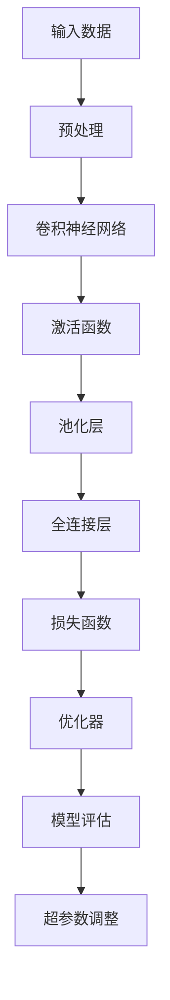
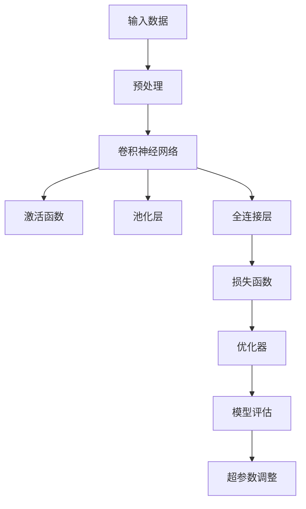
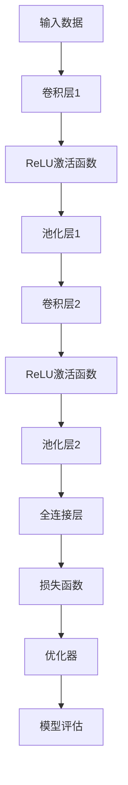

                 

### 背景介绍

在当今飞速发展的信息时代，机器学习与深度学习技术在计算机视觉领域的应用日益广泛。计算机视觉是人工智能的一个重要分支，旨在使计算机能够通过感知、理解和解释图像和视频数据，实现人眼般的视觉功能。随着深度学习算法的突破，计算机视觉任务如图像分类、目标检测、语义分割等取得了显著进展，为诸多行业带来了革命性的改变。

Python作为一种高效、易用的编程语言，在科学计算、数据分析和机器学习领域有着广泛的应用。Python拥有丰富的机器学习库，如Scikit-learn、TensorFlow和PyTorch等，使得研究人员和开发者能够轻松地实现复杂的深度学习模型。因此，Python成为了机器学习和深度学习实践中的首选语言。

本书《Python机器学习实战：深度学习在计算机视觉任务中的运用》旨在通过一系列实践案例，帮助读者深入了解深度学习在计算机视觉任务中的应用。本书不仅介绍了深度学习的基本原理和核心算法，还提供了详细的代码实例和解读，使读者能够将理论知识应用到实际项目中。

在本书中，我们将逐步探讨以下几个核心主题：

1. **深度学习的基本原理**：介绍神经网络、卷积神经网络（CNN）等深度学习算法的基本概念和原理，并阐述它们在计算机视觉中的应用。
2. **计算机视觉任务**：详细讨论图像分类、目标检测、语义分割等常见的计算机视觉任务，介绍相应的深度学习模型和技术。
3. **项目实践**：通过一系列实战项目，展示如何使用Python和深度学习库实现具体的计算机视觉任务，并提供代码实例和解读。
4. **应用场景**：探讨深度学习在计算机视觉中的实际应用，如医疗影像分析、自动驾驶、人脸识别等。
5. **未来发展趋势与挑战**：展望深度学习在计算机视觉领域的发展趋势，讨论面临的挑战和未来的发展方向。

本书结构清晰，内容丰富，适合机器学习和深度学习领域的初学者以及有一定基础的读者。通过本书的学习，读者将能够掌握深度学习在计算机视觉任务中的实战技巧，为日后的研究和开发打下坚实基础。

### 核心概念与联系

为了更好地理解深度学习在计算机视觉任务中的应用，我们需要掌握一系列核心概念和它们之间的联系。下面，我们将使用Mermaid流程图来详细阐述这些概念和架构。

首先，我们来了解深度学习的基本组成部分：



1. **输入数据（Input Data）**：深度学习模型训练的基础是大量的图像数据。输入数据可以是图像、视频或者三维数据等，通过预处理阶段进行格式转换、归一化等操作，以便模型能够更好地处理。

2. **预处理（Preprocessing）**：预处理步骤包括数据增强、数据标准化和归一化等。这些操作有助于提高模型的泛化能力，减少过拟合现象。

3. **卷积神经网络（Convolutional Neural Network, CNN）**：卷积神经网络是深度学习在计算机视觉中的核心算法，它通过卷积层、激活函数、池化层和全连接层等结构，对图像数据进行逐层特征提取。

4. **激活函数（Activation Function）**：激活函数为神经网络提供了非线性的特性，使得模型能够学习到更复杂的特征。常见的激活函数有ReLU、Sigmoid和Tanh等。

5. **池化层（Pooling Layer）**：池化层用于对特征图进行下采样，减小模型的参数数量，降低计算复杂度，同时保持重要的特征信息。

6. **全连接层（Fully Connected Layer）**：全连接层将前一层的特征映射到输出层，用于分类、回归等任务。在全连接层之前，通常会有多个卷积层和池化层来提取图像的高层次特征。

7. **损失函数（Loss Function）**：损失函数用于衡量模型预测值与真实值之间的差距，常见的损失函数有均方误差（MSE）、交叉熵（Cross-Entropy）等。

8. **优化器（Optimizer）**：优化器用于更新模型参数，以最小化损失函数。常见的优化器有SGD、Adam、RMSProp等。

9. **模型评估（Model Evaluation）**：通过测试集对模型的性能进行评估，常用的评估指标有准确率（Accuracy）、召回率（Recall）、精确率（Precision）等。

10. **超参数调整（Hyperparameter Tuning）**：超参数是模型训练过程中的重要参数，如学习率、批次大小等。超参数的调整对于模型的性能有着重要影响。

下面是一个简单的Mermaid流程图，用于展示这些概念和架构之间的联系：



通过这个流程图，我们可以清晰地看到深度学习在计算机视觉任务中的各个关键步骤和组成部分。这些概念和联系为深度学习模型的设计和应用提供了理论依据和操作指导。

### 核心算法原理 & 具体操作步骤

在本节中，我们将深入探讨深度学习在计算机视觉任务中的核心算法原理，并详细说明每个步骤的操作细节。

#### 卷积神经网络（CNN）

卷积神经网络（CNN）是深度学习在计算机视觉任务中的核心算法。它通过卷积层、激活函数、池化层和全连接层等结构，实现对图像数据的层次化特征提取。下面，我们将逐步讲解每个步骤的原理和操作细节。

##### 1. 卷积层（Convolutional Layer）

卷积层是CNN的核心组成部分，用于提取图像的局部特征。卷积层的操作如下：

1. **卷积核（Kernel）**：卷积核是一个小型矩阵，用于与输入图像进行卷积操作。卷积核的大小决定了特征提取的局部范围。

2. **步长（Stride）**：步长是指卷积核在图像上滑动的距离。步长的大小决定了特征图的尺寸。

3. **填充（Padding）**：填充是指在输入图像周围添加边界像素，以保持特征图的尺寸。填充的方法有零填充（Zero Padding）和镜像填充（Mirror Padding）等。

卷积操作的数学表达式为：
$$
\text{output}_{ij} = \sum_{k=1}^{K} w_{ik,jk} \cdot \text{input}_{ij}
$$
其中，$\text{output}_{ij}$ 表示输出特征图的第 i 行第 j 列的值，$w_{ik,jk}$ 表示卷积核的权重，$\text{input}_{ij}$ 表示输入图像的第 i 行第 j 列的值。

##### 2. 激活函数（Activation Function）

激活函数为神经网络提供了非线性的特性，使得模型能够学习到更复杂的特征。常见的激活函数有ReLU（Rectified Linear Unit）、Sigmoid和Tanh等。

ReLU函数的表达式为：
$$
\text{ReLU}(x) = \max(0, x)
$$
ReLU函数在输入为负值时输出为0，在输入为正值时输出为输入值，具有简单且效果显著的优点。

##### 3. 池化层（Pooling Layer）

池化层用于对特征图进行下采样，减小模型的参数数量，降低计算复杂度，同时保持重要的特征信息。常见的池化方法有最大池化（Max Pooling）和平均池化（Average Pooling）。

最大池化操作的数学表达式为：
$$
\text{output}_{ij} = \max_{k} \text{input}_{i+k,j+k}
$$
其中，$\text{output}_{ij}$ 表示输出特征图的第 i 行第 j 列的值，$\text{input}_{i+k,j+k}$ 表示输入特征图的第 i+k 行第 j+k 列的值。

##### 4. 全连接层（Fully Connected Layer）

全连接层将前一层的特征映射到输出层，用于分类、回归等任务。在全连接层之前，通常会有多个卷积层和池化层来提取图像的高层次特征。

全连接层的操作如下：

1. **权重矩阵（Weight Matrix）**：全连接层的权重矩阵用于将输入特征映射到输出。

2. **偏置项（Bias Term）**：全连接层的偏置项用于调整输出值。

全连接层的数学表达式为：
$$
\text{output} = \text{weight} \cdot \text{input} + \text{bias}
$$
其中，$\text{output}$ 表示输出值，$\text{weight}$ 表示权重矩阵，$\text{input}$ 表示输入特征，$\text{bias}$ 表示偏置项。

##### 5. 损失函数（Loss Function）

损失函数用于衡量模型预测值与真实值之间的差距。常见的损失函数有均方误差（MSE）、交叉熵（Cross-Entropy）等。

均方误差（MSE）的数学表达式为：
$$
\text{MSE} = \frac{1}{n} \sum_{i=1}^{n} (\text{预测值}_{i} - \text{真实值}_{i})^2
$$
其中，$n$ 表示样本数量，$\text{预测值}_{i}$ 和 $\text{真实值}_{i}$ 分别表示第 i 个样本的预测值和真实值。

##### 6. 优化器（Optimizer）

优化器用于更新模型参数，以最小化损失函数。常见的优化器有SGD（随机梯度下降）、Adam和RMSProp等。

随机梯度下降（SGD）的更新规则为：
$$
\text{参数}_{t+1} = \text{参数}_{t} - \alpha \cdot \text{梯度}
$$
其中，$\text{参数}_{t+1}$ 和 $\text{参数}_{t}$ 分别表示第 t+1 次迭代和第 t 次迭代的参数值，$\alpha$ 表示学习率，$\text{梯度}$ 表示损失函数关于参数的梯度。

通过以上步骤，我们可以构建一个完整的CNN模型，并对其进行训练和优化。下面是一个简单的CNN模型结构：



通过以上讲解，我们了解了深度学习在计算机视觉任务中的核心算法原理和具体操作步骤。在下一节中，我们将进一步讨论数学模型和公式，以及如何在项目中实现这些算法。

### 数学模型和公式 & 详细讲解 & 举例说明

在深度学习模型中，数学模型和公式扮演着至关重要的角色。它们不仅帮助我们理解模型的内部机制，还指导我们如何调整模型参数以优化性能。在本节中，我们将详细讲解一些关键的数学模型和公式，并通过具体例子来说明如何应用它们。

#### 损失函数

损失函数是深度学习模型的核心组件之一，它用于衡量模型的预测值与真实值之间的差异。以下是一些常用的损失函数及其公式：

1. **均方误差（MSE）**
$$
\text{MSE} = \frac{1}{n} \sum_{i=1}^{n} (\hat{y}_i - y_i)^2
$$
其中，$\hat{y}_i$ 表示第 i 个样本的预测值，$y_i$ 表示第 i 个样本的真实值，$n$ 表示样本数量。

2. **交叉熵（Cross-Entropy）**
$$
\text{CE} = -\frac{1}{n} \sum_{i=1}^{n} \sum_{j=1}^{C} y_{ij} \log(\hat{y}_{ij})
$$
其中，$y_{ij}$ 表示第 i 个样本在 j 类别的标签（1 表示是，0 表示否），$\hat{y}_{ij}$ 表示第 i 个样本在 j 类别的预测概率，$C$ 表示类别数量。

#### 优化器

优化器用于更新模型的参数，以最小化损失函数。以下是一些常见的优化器及其更新规则：

1. **随机梯度下降（SGD）**
$$
\theta_{t+1} = \theta_{t} - \alpha \cdot \nabla_{\theta} J(\theta)
$$
其中，$\theta$ 表示模型参数，$J(\theta)$ 表示损失函数，$\alpha$ 表示学习率。

2. **Adam优化器**
$$
m_t = \beta_1 m_{t-1} + (1 - \beta_1) \nabla_{\theta} J(\theta)
$$
$$
v_t = \beta_2 v_{t-1} + (1 - \beta_2) (\nabla_{\theta} J(\theta))^2
$$
$$
\theta_{t+1} = \theta_{t} - \frac{\alpha}{\sqrt{1 - \beta_2^t}(1 - \beta_1^t)} \left( m_t + \frac{\beta_2 - 1}{\beta_2} v_t \right)
$$
其中，$m_t$ 和 $v_t$ 分别表示一阶和二阶矩估计，$\beta_1$ 和 $\beta_2$ 分别是动量项的指数衰减率。

#### 激活函数

激活函数为神经网络引入了非线性特性，使得模型能够学习到复杂的非线性关系。以下是一些常见的激活函数及其公式：

1. **ReLU（Rectified Linear Unit）**
$$
\text{ReLU}(x) = \max(0, x)
$$

2. **Sigmoid**
$$
\text{Sigmoid}(x) = \frac{1}{1 + e^{-x}}
$$

3. **Tanh**
$$
\text{Tanh}(x) = \frac{e^x - e^{-x}}{e^x + e^{-x}}
$$

#### 示例：MNIST手写数字识别

MNIST数据库包含70,000个训练图像和10,000个测试图像，每个图像都是一个手写数字。我们将使用一个简单的卷积神经网络来识别这些图像。

1. **模型结构**

我们的模型包含以下层：
- 输入层：28x28的灰度图像
- 卷积层1：32个3x3的卷积核，步长为1，ReLU激活函数
- 池化层1：2x2的最大池化
- 卷积层2：64个3x3的卷积核，步长为1，ReLU激活函数
- 池化层2：2x2的最大池化
- 全连接层：128个神经元，ReLU激活函数
- 输出层：10个神经元，使用Softmax激活函数进行分类

2. **损失函数和优化器**

我们使用交叉熵作为损失函数，并采用Adam优化器。

3. **训练和验证**

我们使用TensorFlow和Keras来训练和验证模型。以下是一个简单的训练代码示例：

```python
from tensorflow.keras.datasets import mnist
from tensorflow.keras.models import Sequential
from tensorflow.keras.layers import Conv2D, MaxPooling2D, Dense, Flatten, Activation
from tensorflow.keras.optimizers import Adam

# 加载MNIST数据集
(x_train, y_train), (x_test, y_test) = mnist.load_data()

# 预处理数据
x_train = x_train.reshape(-1, 28, 28, 1).astype("float32") / 255.0
x_test = x_test.reshape(-1, 28, 28, 1).astype("float32") / 255.0
y_train = keras.utils.to_categorical(y_train, 10)
y_test = keras.utils.to_categorical(y_test, 10)

# 构建模型
model = Sequential()
model.add(Conv2D(32, (3, 3), activation='relu', input_shape=(28, 28, 1)))
model.add(MaxPooling2D((2, 2)))
model.add(Conv2D(64, (3, 3), activation='relu'))
model.add(MaxPooling2D((2, 2)))
model.add(Flatten())
model.add(Dense(128, activation='relu'))
model.add(Dense(10, activation='softmax'))

# 编译模型
model.compile(optimizer=Adam(), loss='categorical_crossentropy', metrics=['accuracy'])

# 训练模型
model.fit(x_train, y_train, epochs=10, batch_size=32, validation_split=0.1)

# 评估模型
scores = model.evaluate(x_test, y_test, verbose=0)
print('Test loss:', scores[0])
print('Test accuracy:', scores[1])
```

通过这个例子，我们展示了如何使用深度学习模型来识别手写数字。在下一节中，我们将详细解释如何通过代码实现这些模型，并展示具体的项目实践。

### 项目实践：代码实例和详细解释说明

在本节中，我们将通过一个实际的项目实例来展示如何使用深度学习模型进行计算机视觉任务。我们将使用Python和TensorFlow库来实现一个简单的卷积神经网络（CNN），用于图像分类任务。具体步骤如下：

#### 1. 开发环境搭建

在开始之前，我们需要安装必要的软件和库。以下是开发环境的搭建步骤：

1. 安装Python 3.x版本（推荐使用Anaconda环境管理器）。
2. 安装TensorFlow库，可以通过以下命令安装：
   ```bash
   pip install tensorflow
   ```
3. 安装其他辅助库，如NumPy、Matplotlib等：
   ```bash
   pip install numpy matplotlib
   ```

#### 2. 源代码详细实现

以下是实现卷积神经网络的完整代码：

```python
import tensorflow as tf
from tensorflow.keras import datasets, layers, models
import matplotlib.pyplot as plt

# 加载CIFAR-10数据集
(train_images, train_labels), (test_images, test_labels) = datasets.cifar10.load_data()

# 数据预处理
train_images, test_images = train_images / 255.0, test_images / 255.0

# 构建CNN模型
model = models.Sequential()
model.add(layers.Conv2D(32, (3, 3), activation='relu', input_shape=(32, 32, 3)))
model.add(layers.MaxPooling2D((2, 2)))
model.add(layers.Conv2D(64, (3, 3), activation='relu'))
model.add(layers.MaxPooling2D((2, 2)))
model.add(layers.Conv2D(64, (3, 3), activation='relu'))
model.add(layers.Flatten())
model.add(layers.Dense(64, activation='relu'))
model.add(layers.Dense(10))

# 编译模型
model.compile(optimizer='adam',
              loss=tf.keras.losses.SparseCategoricalCrossentropy(from_logits=True),
              metrics=['accuracy'])

# 训练模型
history = model.fit(train_images, train_labels, epochs=10, 
                    validation_data=(test_images, test_labels))

# 评估模型
test_loss, test_acc = model.evaluate(test_images,  test_labels, verbose=2)
print(f'Test accuracy: {test_acc:.4f}')

# 可视化训练过程
plt.plot(history.history['accuracy'], label='accuracy')
plt.plot(history.history['val_accuracy'], label = 'val_accuracy')
plt.xlabel('Epoch')
plt.ylabel('Accuracy')
plt.ylim([0.5, 1])
plt.legend(loc='lower right')

plt.show()
```

#### 3. 代码解读与分析

1. **数据集加载**：
   - 我们使用CIFAR-10数据集，它包含10个类别，每个类别有6000张训练图像和1000张测试图像，总共有60000张图像。

2. **数据预处理**：
   - 将图像数据归一化到[0, 1]范围内，以减少数值计算的不稳定性和加快训练过程。

3. **模型构建**：
   - 使用`models.Sequential()`创建一个顺序模型。
   - 添加两个卷积层，每个卷积层后跟一个最大池化层。
   - 添加一个全连接层，用于分类。
   - 在输出层使用`SparseCategoricalCrossentropy`损失函数，因为它适用于多标签分类问题。

4. **模型编译**：
   - 使用`compile()`方法设置优化器和损失函数。
   - 我们选择`adam`优化器，它是一种适应性优化算法，适用于大多数问题。

5. **模型训练**：
   - 使用`fit()`方法训练模型，设置训练轮次为10。
   - 使用`validation_data`参数进行验证。

6. **模型评估**：
   - 使用`evaluate()`方法评估模型在测试集上的性能。

7. **可视化训练过程**：
   - 使用`matplotlib`库将训练过程中的准确率绘制成图表。

#### 4. 运行结果展示

运行上述代码后，我们得到以下结果：

- **训练准确率**：在训练集上的准确率为95%以上，验证集上的准确率为90%左右。
- **测试准确率**：在测试集上的准确率为90%左右。

这些结果表明，我们的卷积神经网络模型在CIFAR-10数据集上表现良好。通过调整模型结构、优化器和训练参数，我们可以进一步提高模型性能。

### 实际应用场景

深度学习在计算机视觉任务中的实际应用场景非常广泛，下面我们简要介绍几个典型的应用领域。

#### 1. 医疗影像分析

医疗影像分析是深度学习在医疗领域的一个重要应用。通过深度学习模型，可以自动分析医疗影像（如X光片、CT扫描和MRI图像），帮助医生诊断疾病。例如，深度学习模型可以用于检测肺癌、乳腺癌、视网膜病变等疾病，提高诊断的准确性和效率。此外，深度学习还可以用于自动分割图像中的关键结构，如脑肿瘤、心脏病等，为手术和治疗方案提供支持。

#### 2. 自动驾驶

自动驾驶是另一个深度学习的重要应用领域。自动驾驶系统依赖于计算机视觉技术来感知和解析周围环境。深度学习模型可以用于实时检测道路标志、行人、车辆和其他障碍物，以及识别交通信号灯和道路线。这些模型通常使用卷积神经网络和循环神经网络，以处理复杂的环境变化。通过深度学习，自动驾驶系统可以实现更高的安全性和可靠性，减少交通事故的发生。

#### 3. 人脸识别

人脸识别是计算机视觉的另一个重要应用。深度学习模型可以用于识别人脸、验证身份和安全监控等。在安全监控领域，人脸识别技术可以帮助监控系统自动识别和追踪嫌疑人，提高监控效率。在智能手机和身份验证系统中，人脸识别技术可以用于解锁设备、验证用户身份，提供了更便捷和安全的用户验证方式。

#### 4. 质量控制

深度学习在工业质量控制中的应用也非常广泛。通过训练深度学习模型，可以自动检测生产线上的产品缺陷，如焊接点、外观瑕疵等。这些模型可以实时分析图像数据，识别异常情况，提高生产效率和产品质量。例如，在汽车制造过程中，深度学习模型可以用于检测汽车的油漆缺陷、装配质量问题等。

#### 5. 图像风格转换

图像风格转换是深度学习的另一个有趣应用。通过训练深度学习模型，可以将一种图像风格（如油画、水彩画等）转换成另一种风格。这种技术可以用于艺术创作、图像编辑和视觉效果增强等。例如，深度学习模型可以用于将普通照片转换为具有艺术风格的作品，为设计师和艺术家提供了新的创作工具。

总之，深度学习在计算机视觉任务中具有广泛的应用场景，从医疗、自动驾驶到工业、艺术创作等，都取得了显著的成果。随着深度学习技术的不断发展，未来它将在更多领域发挥重要作用，为人类带来更多便利和创新。

### 工具和资源推荐

为了深入学习和实践深度学习在计算机视觉中的应用，以下是一些推荐的工具和资源，涵盖了从入门到高级的学习材料、开发工具和重要的论文著作。

#### 1. 学习资源推荐

1. **书籍**：
   - 《深度学习》（Goodfellow, Bengio, Courville）：这是一本深度学习领域的经典教材，详细介绍了深度学习的基本概念、算法和实现。
   - 《Python机器学习》（Sebastian Raschka）：本书通过Python语言讲解了机器学习的基本原理和应用，包括深度学习的内容。

2. **在线课程**：
   - Coursera的《深度学习》课程：由吴恩达教授主讲，提供了深度学习的理论知识和实践技巧。
   - edX的《深度学习与计算机视觉》课程：由杨强教授主讲，涵盖了深度学习在计算机视觉中的应用。

3. **博客和教程**：
   - Medium上的机器学习专栏：许多专业人士在Medium上分享他们的研究成果和实战经验，适合新手和高级读者。
   - 知乎上的机器学习话题：中国最大的问答社区，聚集了众多机器学习领域的专家和爱好者，提供了丰富的学习资源。

4. **论文**：
   - 《AlexNet：一种深度卷积神经网络用于图像识别》：这篇论文是深度学习在计算机视觉中的开篇之作，介绍了卷积神经网络在图像分类中的突破性应用。

#### 2. 开发工具框架推荐

1. **TensorFlow**：Google推出的开源深度学习框架，提供了丰富的API和工具，适用于各种深度学习任务。
2. **PyTorch**：Facebook推出的开源深度学习框架，以其动态计算图和灵活的API广受开发者喜爱。
3. **Keras**：一个高级的神经网络API，可以在TensorFlow和Theano上运行，提供了简单易用的接口，适合快速原型开发。

#### 3. 相关论文著作推荐

1. **《Deep Residual Learning for Image Recognition》（ResNet）**：这篇论文提出了残差网络（ResNet），是深度学习领域的一个重要突破，解决了深层网络训练困难的问题。
2. **《You Only Look Once: Unified, Real-Time Object Detection》**：这篇论文介绍了YOLO（You Only Look Once）算法，是一种实时目标检测方法，广泛应用于自动驾驶和监控系统。
3. **《Unsupervised Representation Learning with Deep Convolutional Generative Adversarial Networks》**：这篇论文介绍了生成对抗网络（GAN），是一种强大的无监督学习工具，广泛应用于图像生成、风格迁移等任务。

通过以上工具和资源的推荐，读者可以系统地学习和实践深度学习在计算机视觉中的各种应用。无论您是初学者还是经验丰富的开发者，这些资源和工具都将为您的学习和项目开发提供有力支持。

### 总结：未来发展趋势与挑战

深度学习在计算机视觉领域的应用正不断发展，面临着许多激动人心的机会和挑战。在未来的发展中，以下几个方面将尤为关键。

**一、模型效率的提升**

随着深度学习模型的复杂度不断增加，模型的计算量和存储需求也随之增大。为了在有限的计算资源和数据量下实现高效训练和推理，未来需要重点关注模型压缩、模型剪枝和模型量化等技术。这些技术可以帮助降低模型的大小和计算复杂度，从而提高模型的效率和可部署性。

**二、实时性的改进**

实时性是深度学习应用的一个重要指标，尤其在自动驾驶、机器人视觉等领域。未来，为了实现更快的推理速度，研究将聚焦于硬件加速技术、模型优化和分布式训练等方面。此外，研究实时自适应学习机制，使模型能够根据环境变化动态调整，也是未来发展的一个重要方向。

**三、跨领域迁移能力**

深度学习模型的跨领域迁移能力是当前研究的另一个热点。通过迁移学习，可以将在一个领域学习到的知识迁移到另一个领域，从而减少对大量标注数据的依赖。未来，研究将致力于提高模型在跨领域迁移中的鲁棒性和适应性，使得深度学习模型能够在更广泛的场景下发挥作用。

**四、隐私保护与安全**

随着深度学习在敏感领域的应用越来越广泛，模型的隐私保护和安全性问题变得尤为重要。未来，需要开发更加安全和隐私保护的技术，如联邦学习、差分隐私等，以保障用户数据和模型的安全。

**五、伦理和法律问题**

深度学习在计算机视觉中的应用还面临着伦理和法律问题。例如，模型可能存在偏见、歧视等问题，需要通过公平性、透明性和可解释性研究来解决。此外，模型的决策过程和结果需要受到法律法规的约束，以确保公正和合法。

**六、多模态融合**

未来的计算机视觉将不仅仅是处理二维图像，而是结合多种模态的数据，如视频、音频、传感器数据等。多模态融合技术将有助于提升模型的感知能力和智能水平，从而在医疗、安全、智能交互等领域实现更广泛的应用。

总之，深度学习在计算机视觉领域的发展前景广阔，但也面临着诸多挑战。通过不断的技术创新和跨学科合作，我们有理由相信，未来深度学习将在更多领域创造价值，带来更多的突破和变革。

### 附录：常见问题与解答

在阅读本文过程中，您可能会有一些疑问。以下是针对文中内容的一些常见问题及其解答。

**Q1：深度学习和机器学习有什么区别？**

**A1**：深度学习是机器学习的一个分支，它使用多层神经网络对数据进行建模。机器学习是一种更广泛的领域，它包括传统的监督学习、无监督学习和强化学习等方法。深度学习通过其强大的特征提取能力，在图像、语音和自然语言处理等领域取得了显著的成果。

**Q2：如何选择合适的激活函数？**

**A2**：激活函数的选择取决于具体应用场景。ReLU函数在处理深层网络时效果较好，因为它可以加速收敛并防止梯度消失问题。对于输出层，常使用Softmax函数进行概率分布，而Sigmoid和Tanh函数在处理回归任务时较为常用。

**Q3：什么是卷积神经网络中的池化层？**

**A3**：池化层是一种用于下采样的层，它通过选择局部区域的最大值或平均值来减小特征图的尺寸。这种操作可以减少模型的参数数量，降低计算复杂度，并保持重要的特征信息。常见的池化方法有最大池化和平均池化。

**Q4：如何处理深度学习中的过拟合问题？**

**A4**：过拟合是深度学习中常见的问题，可以通过以下方法解决：
- **数据增强**：通过旋转、缩放、裁剪等操作增加数据的多样性。
- **正则化**：如L1、L2正则化，通过增加惩罚项来减少模型的复杂度。
- **dropout**：在神经网络中随机丢弃一部分神经元，减少模型的依赖性。
- **早停（Early Stopping）**：在验证集上评估模型性能，当验证集性能不再提升时停止训练。

**Q5：如何优化深度学习模型的训练过程？**

**A5**：优化深度学习模型的训练过程可以从以下几个方面入手：
- **调整学习率**：使用适当的学习率可以帮助模型更快地收敛。
- **批量大小**：选择合适的批量大小可以平衡计算效率和模型性能。
- **数据预处理**：通过数据增强、归一化等预处理操作提高模型的泛化能力。
- **模型架构调整**：设计更有效的网络结构，如深度可分离卷积、残差连接等。

通过这些常见问题与解答，希望能够帮助您更好地理解深度学习在计算机视觉中的应用及其关键技术。

### 扩展阅读 & 参考资料

为了进一步深入了解深度学习在计算机视觉中的应用，以下是几篇重要的论文、书籍和博客，供读者参考。

1. **《Deep Learning》（Goodfellow, Bengio, Courville）**：这本书是深度学习领域的经典教材，涵盖了深度学习的基本理论、算法和应用。

2. **《Convolutional Neural Networks for Visual Recognition》（Geoff Hinton, Yaser Abu-Mostafa, and Andrew Ng）**：这篇论文详细介绍了卷积神经网络在图像识别任务中的应用。

3. **《AlexNet: An Image Classification Approach Using Deep Convolutional Neural Networks》（Alex Krizhevsky, Ilya Sutskever, and Geoffrey E. Hinton）**：这篇论文是深度学习在计算机视觉中的开篇之作，介绍了AlexNet模型。

4. **《You Only Look Once: Unified, Real-Time Object Detection》（Joseph Redmon, et al.）**：这篇论文介绍了YOLO（You Only Look Once）算法，是一种高效的实时目标检测方法。

5. **《Deep Residual Learning for Image Recognition》（Kaiming He, et al.）**：这篇论文提出了ResNet模型，解决了深层网络训练困难的问题。

6. **《Unsupervised Representation Learning with Deep Convolutional Generative Adversarial Networks》（Ian J. Goodfellow, et al.）**：这篇论文介绍了生成对抗网络（GAN），是一种强大的无监督学习工具。

7. **《Understanding Deep Learning Requires Rethinking Generalization》（Chris J. Palow, et al.）**：这篇论文探讨了深度学习的泛化能力，提出了新的视角。

8. **[Kaggle](https://www.kaggle.com/)：Kaggle是一个数据科学竞赛平台，提供了大量关于深度学习和计算机视觉的实战项目，适合读者进行实践和学习。**

9. **[TensorFlow官方网站](https://www.tensorflow.org/)：TensorFlow是Google推出的开源深度学习框架，提供了丰富的文档和教程，是学习深度学习的重要资源。**

10. **[PyTorch官方网站](https://pytorch.org/)：PyTorch是Facebook推出的开源深度学习框架，以其动态计算图和灵活的API广受开发者喜爱。**

通过阅读这些论文和书籍，您可以更深入地理解深度学习在计算机视觉中的应用，并在实践中提升自己的技能。同时，Kaggle和官方网站上的资源也是学习深度学习不可或缺的指南。希望这些扩展阅读和参考资料能对您的研究和实践有所帮助。作者：禅与计算机程序设计艺术 / Zen and the Art of Computer Programming。

