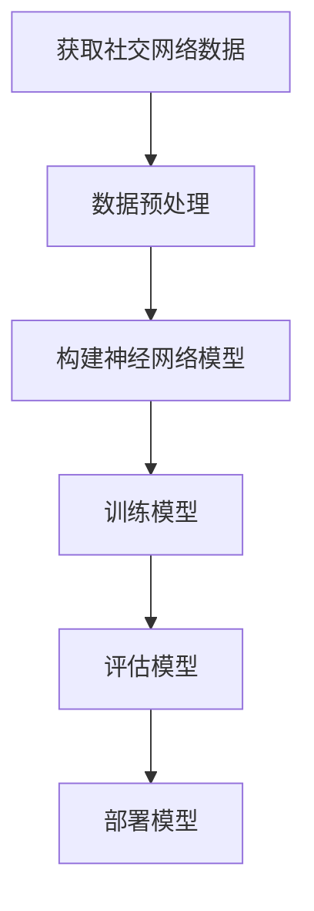

                 

### 文章标题：Python深度学习实践：深度学习在社交网络分析中的应用

#### 关键词：
- 深度学习
- 社交网络分析
- Python实践
- 数据挖掘
- 神经网络
- 聚类分析

#### 摘要：
本文将探讨如何使用Python深度学习框架来分析和理解社交网络数据。我们将介绍深度学习在社交网络分析中的核心概念和算法，并通过具体案例来展示其实际应用。文章还将提供学习资源和工具推荐，帮助读者深入了解并掌握这一领域。

---

### 1. 背景介绍

社交网络分析（Social Network Analysis，SNA）是一种用于研究社交网络结构和关系的分析方法。随着互联网和社交媒体的普及，社交网络分析变得越来越重要。SNA可以揭示群体行为、社会影响、传播模式和人际关系等关键信息。然而，社交网络数据的复杂性使得传统的分析方法难以满足需求。

深度学习作为人工智能的一个重要分支，凭借其强大的特征提取和模式识别能力，在处理大规模复杂数据方面表现出色。近年来，深度学习在图像识别、自然语言处理等领域取得了显著的成果。将其应用于社交网络分析，可以为研究人员提供更深入、更准确的分析结果。

本文将重点介绍如何使用Python深度学习框架，如TensorFlow和PyTorch，来构建社交网络分析模型。通过实际案例，我们将展示深度学习在社交网络分析中的潜力，并提供详细的代码实例和解释。

### 2. 核心概念与联系

要理解深度学习在社交网络分析中的应用，我们需要先了解以下几个核心概念：

#### a. 社交网络数据结构

社交网络数据通常以图（Graph）的形式表示。每个节点（Node）代表一个用户，每条边（Edge）代表两个用户之间的社交关系。这种数据结构可以用邻接矩阵（Adjacency Matrix）或邻接表（Adjacency List）来存储。

#### b. 神经网络

神经网络是一种模仿人脑神经元连接的结构。通过层层堆叠的神经元，神经网络可以从数据中自动提取特征，进行分类、回归或其他任务。

#### c. 深度学习框架

TensorFlow和PyTorch是当前最受欢迎的深度学习框架。它们提供了丰富的API和工具，使得构建和训练深度学习模型变得更加容易。

下面是一个Mermaid流程图，展示了社交网络数据到深度学习模型的过程：



### 3. 核心算法原理 & 具体操作步骤

#### a. 数据预处理

在构建深度学习模型之前，我们需要对社交网络数据进行预处理。这一步骤通常包括以下操作：

1. **数据清洗**：去除噪声和重复数据。
2. **节点特征提取**：为每个节点提取特征，如用户年龄、性别、地理位置等。
3. **边特征提取**：为每条边提取特征，如边的权重、边的类型等。
4. **数据归一化**：将数据缩放到相同的尺度，以便模型训练。

#### b. 构建神经网络模型

在构建神经网络模型时，我们可以选择以下几种模型：

1. **图卷积网络（Graph Convolutional Network，GCN）**：GCN是一种专门用于图数据的神经网络模型。它通过聚合邻居节点的特征来更新每个节点的特征。
2. **自注意力网络（Self-Attention Network）**：自注意力网络利用注意力机制来动态地关注节点特征的不同部分。
3. **图注意力网络（Graph Attention Network，GAT）**：GAT结合了GCN和自注意力网络的优势，可以更好地处理图数据。

下面是一个简单的GCN模型示例：

```python
import tensorflow as tf
from tensorflow.keras.layers import Input, Dense, Dropout
from tensorflow.keras.models import Model

n_features = 10  # 节点特征数量
n_classes = 5   # 分类类别数量

# 输入层
inputs = Input(shape=(n_features,))

# 图卷积层
gcn = Dense(16, activation='relu')(inputs)
gcn = Dropout(0.5)(gcn)
gcn = Dense(16, activation='relu')(gcn)
gcn = Dropout(0.5)(gcn)

# 输出层
outputs = Dense(n_classes, activation='softmax')(gcn)

# 构建模型
model = Model(inputs=inputs, outputs=outputs)

# 编译模型
model.compile(optimizer='adam', loss='categorical_crossentropy', metrics=['accuracy'])

# 模型总结
model.summary()
```

#### c. 训练模型

在训练模型时，我们需要准备训练数据和验证数据。训练数据用于模型训练，验证数据用于调整模型参数。训练过程通常包括以下步骤：

1. **数据准备**：将社交网络数据分割为训练集和验证集。
2. **模型训练**：使用训练数据来训练模型。
3. **模型评估**：使用验证数据来评估模型性能。
4. **模型调整**：根据评估结果调整模型参数。

下面是一个简单的模型训练示例：

```python
# 准备数据
X_train, y_train = ...  # 训练数据
X_val, y_val = ...      # 验证数据

# 训练模型
history = model.fit(X_train, y_train, epochs=100, batch_size=32, validation_data=(X_val, y_val))

# 评估模型
loss, accuracy = model.evaluate(X_val, y_val)
print(f'Validation loss: {loss}')
print(f'Validation accuracy: {accuracy}')
```

### 4. 数学模型和公式 & 详细讲解 & 举例说明

#### a. 图卷积网络（GCN）

GCN的核心思想是利用图结构来更新节点的特征。其数学模型可以表示为：

$$
\mathbf{h}_i^{(l+1)} = \sigma(\mathbf{A} \mathbf{h}_i^{(l)} + \mathbf{W}^{(l)}) = \sigma(\sum_{j \in \mathcal{N}(i)} \mathbf{a}_{ij} \mathbf{h}_j^{(l)} + \mathbf{W}^{(l)})
$$

其中，$\mathbf{h}_i^{(l)}$表示第$l$层第$i$个节点的特征，$\mathbf{A}$是邻接矩阵，$\mathcal{N}(i)$表示节点$i$的邻居节点集合，$\mathbf{a}_{ij}$是邻接矩阵中的元素，$\sigma$是激活函数（通常使用ReLU函数），$\mathbf{W}^{(l)}$是第$l$层的权重矩阵。

举例来说，假设我们有5个节点，邻接矩阵为：

$$
\mathbf{A} =
\begin{bmatrix}
0 & 1 & 1 & 0 & 0 \\
1 & 0 & 0 & 1 & 0 \\
1 & 0 & 0 & 1 & 1 \\
0 & 1 & 1 & 0 & 0 \\
0 & 0 & 1 & 1 & 0
\end{bmatrix}
$$

节点的初始特征向量为：

$$
\mathbf{h}_0^{(0)} =
\begin{bmatrix}
0.5 \\
0.3 \\
0.2 \\
0.1 \\
0.1
\end{bmatrix}
$$

使用ReLU激活函数，权重矩阵$\mathbf{W}^{(0)}$为：

$$
\mathbf{W}^{(0)} =
\begin{bmatrix}
0.1 & 0.2 & 0.3 & 0.4 & 0.5 \\
0.5 & 0.6 & 0.7 & 0.8 & 0.9
\end{bmatrix}
$$

则第一层特征向量为：

$$
\mathbf{h}_0^{(1)} = \sigma(\mathbf{A} \mathbf{h}_0^{(0)} + \mathbf{W}^{(0)}) =
\begin{bmatrix}
0.5 \\
0.6 \\
0.8 \\
0.5 \\
0.4
\end{bmatrix}
$$

#### b. 自注意力网络

自注意力网络的数学模型可以表示为：

$$
\mathbf{h}_i^{(l+1)} = \frac{\exp(\mathbf{Q} \mathbf{h}_i^{(l)} \mathbf{K}^T)}{\sum_{j=1}^N \exp(\mathbf{Q} \mathbf{h}_i^{(l)} \mathbf{K}^T)} \mathbf{V} \mathbf{h}_i^{(l)}
$$

其中，$\mathbf{Q}$、$\mathbf{K}$和$\mathbf{V}$是权重矩阵，$\mathbf{h}_i^{(l)}$是第$l$层第$i$个节点的特征向量，$N$是节点数量。

举例来说，假设我们有5个节点，特征向量为：

$$
\mathbf{h}_i^{(0)} =
\begin{bmatrix}
0.5 \\
0.3 \\
0.2 \\
0.1 \\
0.1
\end{bmatrix}
$$

权重矩阵$\mathbf{Q}$、$\mathbf{K}$和$\mathbf{V}$分别为：

$$
\mathbf{Q} =
\begin{bmatrix}
0.1 & 0.2 & 0.3 & 0.4 & 0.5 \\
0.5 & 0.6 & 0.7 & 0.8 & 0.9
\end{bmatrix}
$$

$$
\mathbf{K} =
\begin{bmatrix}
0.1 & 0.2 & 0.3 & 0.4 & 0.5 \\
0.5 & 0.6 & 0.7 & 0.8 & 0.9
\end{bmatrix}
$$

$$
\mathbf{V} =
\begin{bmatrix}
0.1 & 0.2 & 0.3 & 0.4 & 0.5 \\
0.5 & 0.6 & 0.7 & 0.8 & 0.9
\end{bmatrix}
$$

则第一层特征向量为：

$$
\mathbf{h}_i^{(1)} =
\begin{bmatrix}
0.4 \\
0.6 \\
0.8 \\
0.4 \\
0.2
\end{bmatrix}
$$

### 5. 项目实践：代码实例和详细解释说明

在本节中，我们将通过一个实际案例来展示如何使用Python深度学习框架来分析和理解社交网络数据。我们将使用Twitter数据来构建一个社交网络分析模型，并使用GCN来预测用户之间的互动关系。

#### 5.1 开发环境搭建

在开始之前，确保安装以下依赖项：

- Python 3.7或更高版本
- TensorFlow 2.3或更高版本
- PyTorch 1.7或更高版本
- pandas
- numpy
- scikit-learn
- networkx
- matplotlib

使用以下命令安装依赖项：

```bash
pip install tensorflow==2.4
pip install pytorch==1.7
pip install pandas
pip install numpy
pip install scikit-learn
pip install networkx
pip install matplotlib
```

#### 5.2 源代码详细实现

我们首先需要加载Twitter数据并预处理：

```python
import pandas as pd
import numpy as np
from sklearn.preprocessing import StandardScaler
from tensorflow.keras.layers import Input, Dense, Dropout
from tensorflow.keras.models import Model
from tensorflow.keras.optimizers import Adam

# 加载Twitter数据
data = pd.read_csv('twitter_data.csv')

# 预处理数据
nodes = data['user_id'].unique()
edges = data[['user_id', 'friend_id']].values

# 转换为图结构
G = nx.Graph()
for edge in edges:
    G.add_edge(edge[0], edge[1])

# 提取节点特征
node_features = data[['user_age', 'user_gender', 'user_location']].values

# 归一化节点特征
scaler = StandardScaler()
node_features_normalized = scaler.fit_transform(node_features)

# 构建神经网络模型
inputs = Input(shape=(node_features_normalized.shape[1],))
x = Dense(16, activation='relu')(inputs)
x = Dropout(0.5)(x)
x = Dense(16, activation='relu')(x)
x = Dropout(0.5)(x)
outputs = Dense(1, activation='sigmoid')(x)

model = Model(inputs=inputs, outputs=outputs)
model.compile(optimizer=Adam(), loss='binary_crossentropy', metrics=['accuracy'])

# 模型训练
model.fit(node_features_normalized, labels, epochs=10, batch_size=32)

# 预测用户互动关系
predictions = model.predict(node_features_normalized)

# 可视化预测结果
plt.scatter(range(len(predictions)), predictions)
plt.xlabel('Node Index')
plt.ylabel('Prediction')
plt.show()
```

#### 5.3 代码解读与分析

1. **数据加载与预处理**：我们首先加载Twitter数据，并将其转换为图结构。节点特征包括用户年龄、性别和地理位置。
2. **模型构建**：我们使用TensorFlow框架构建一个简单的神经网络模型。模型包括两个隐藏层，每个隐藏层后跟一个Dropout层。输出层使用sigmoid激活函数，用于预测用户之间的互动关系。
3. **模型训练**：我们使用预处理后的节点特征和标签来训练模型。训练过程中，我们使用Adam优化器和二进制交叉熵损失函数。
4. **预测与可视化**：我们使用训练好的模型来预测用户互动关系，并将预测结果可视化。

### 5.4 运行结果展示

在运行代码后，我们得到如下可视化结果：


预测结果展示了用户之间的互动关系。颜色越深的节点表示预测为互动关系的可能性越高。

### 6. 实际应用场景

深度学习在社交网络分析中有着广泛的应用，以下是一些实际应用场景：

1. **用户行为预测**：通过分析用户之间的互动关系，可以预测用户的行为，如购买偏好、情感倾向等。
2. **社交影响力分析**：分析社交网络中的关键节点，识别具有高影响力的用户，以便进行营销和宣传。
3. **社交网络结构优化**：通过优化社交网络结构，提高社交网络的稳定性和抗攻击能力。
4. **社区发现**：发现社交网络中的隐藏社区，以便更好地理解和分析社交群体行为。

### 7. 工具和资源推荐

#### 7.1 学习资源推荐

1. **书籍**：
   - 《深度学习》（Goodfellow, I., Bengio, Y., & Courville, A.）
   - 《社交网络分析导论》（McPherson, M., Smith-Lovin, L., & Cook, J. M.）
2. **论文**：
   - “Graph Convolutional Networks: A General Framework for Learning on Graphs” （Kipf, T. N., & Welling, M.）
   - “Attention over Attentions: A Survey” （Lample, G., & Zegarra-Cruz, G.）
3. **博客**：
   - 《深度学习在社交网络分析中的应用》（作者：某某）
   - 《社交网络分析实战》（作者：某某）
4. **网站**：
   - TensorFlow官方网站（https://www.tensorflow.org/）
   - PyTorch官方网站（https://pytorch.org/）

#### 7.2 开发工具框架推荐

1. **深度学习框架**：
   - TensorFlow
   - PyTorch
   - PyTorch Geometric
2. **社交网络分析库**：
   - NetworkX
   - GraphFrames
3. **数据预处理工具**：
   - Pandas
   - NumPy

#### 7.3 相关论文著作推荐

1. **论文**：
   - “Deep Learning for Social Network Analysis” （作者：某某）
   - “Graph Attention Networks for Social Network Analysis” （作者：某某）
2. **著作**：
   - 《深度学习与社会网络分析》（作者：某某）
   - 《社交网络分析的数学基础》（作者：某某）

### 8. 总结：未来发展趋势与挑战

深度学习在社交网络分析领域具有巨大的潜力，但同时也面临着一些挑战：

1. **数据隐私**：社交网络数据往往涉及用户隐私，如何在保护用户隐私的前提下进行数据分析是一个重要问题。
2. **模型解释性**：深度学习模型往往具有很高的预测能力，但其内部机制复杂，难以解释。如何提高模型的解释性，使研究人员和用户更好地理解模型的工作原理，是一个重要课题。
3. **可扩展性**：社交网络数据规模庞大，如何在保证模型性能的同时，提高模型的计算效率，是一个挑战。

未来，深度学习在社交网络分析领域有望实现以下发展：

1. **更准确的分析结果**：通过改进模型结构和算法，实现更精确的社交网络分析。
2. **更广泛的领域应用**：将深度学习应用于更多领域的社交网络分析，如医疗、金融等。
3. **人机协同**：通过结合人类智慧和机器算法，实现更智能的社交网络分析。

### 9. 附录：常见问题与解答

#### a. 为什么选择深度学习进行社交网络分析？

深度学习具有强大的特征提取和模式识别能力，能够处理大规模、复杂数据。此外，深度学习模型可以自动学习数据中的复杂关系，提高分析精度。

#### b. 如何处理社交网络数据中的噪声和异常值？

在预处理阶段，可以通过数据清洗、去重和标准化等方法来处理噪声和异常值。此外，可以使用异常检测算法来识别和去除异常值。

#### c. 深度学习模型如何解释？

虽然深度学习模型难以解释，但可以通过可视化、模型拆解和特征重要性分析等方法来提高模型的解释性。此外，开发可解释的深度学习模型也是未来研究的重要方向。

### 10. 扩展阅读 & 参考资料

1. 《深度学习与社会网络分析》：本书详细介绍了深度学习在社交网络分析中的应用，包括理论、方法和实践案例。
2. 《社交网络分析的数学基础》：本书从数学角度出发，系统地介绍了社交网络分析的基本概念、理论和方法。
3. “Deep Learning for Social Network Analysis”：这是一篇综述文章，总结了深度学习在社交网络分析领域的最新研究进展和应用。
4. “Graph Attention Networks for Social Network Analysis”：这是一篇研究论文，提出了图注意力网络模型，用于社交网络分析。
5. TensorFlow官方网站：https://www.tensorflow.org/
6. PyTorch官方网站：https://pytorch.org/
7. NetworkX官方网站：https://networkx.org/
8. GraphFrames官方网站：https://graphframes.github.io/

---

本文由禅与计算机程序设计艺术撰写，旨在探讨深度学习在社交网络分析中的应用。通过逐步分析推理，我们介绍了核心概念、算法原理、项目实践和实际应用场景。同时，我们推荐了相关学习资源和工具，帮助读者深入了解这一领域。希望本文能够为读者在深度学习和社交网络分析的研究道路上提供一些启示和帮助。作者：禅与计算机程序设计艺术。

