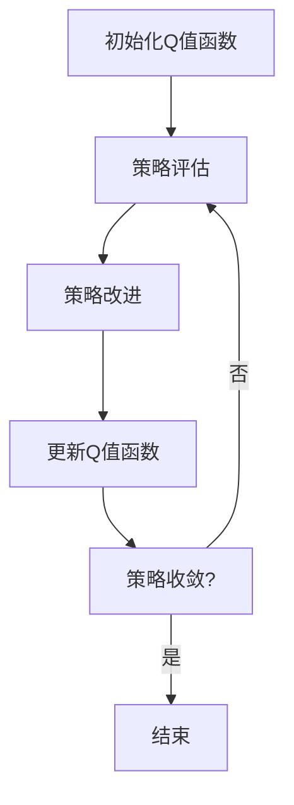
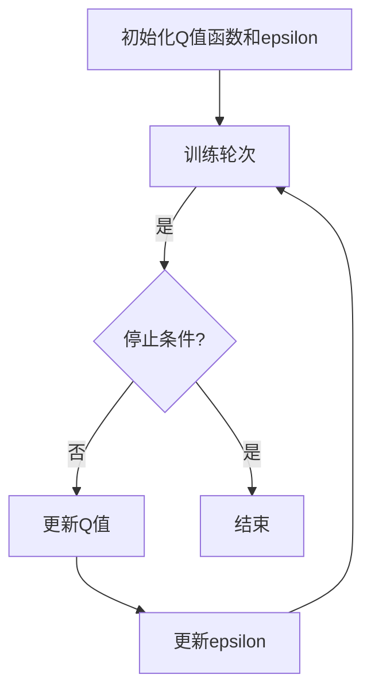

                 

### 背景介绍

Q-Learning，作为一种强化学习（Reinforcement Learning）算法，近年来在人工智能领域获得了广泛关注和应用。其核心思想是通过试错（trial-and-error）和经验累积（experience-based learning）来优化决策过程，从而实现智能体的自我改进。Q-Learning的核心在于利用一个Q值函数（Q-value function）来评估不同动作所带来的预期回报（expected reward），并通过经验回放（experience replay）和目标网络（target network）等技术来提高学习效率和稳定性。

强化学习的基本概念可以追溯到20世纪50年代，由Richard Bellman提出的动态规划（Dynamic Programming）理论。动态规划的核心思想是将复杂问题分解为一系列相互关联的子问题，并利用已有的子问题解来求解更大规模的问题。然而，对于许多实际问题，动态规划方法难以实现，因为状态空间（state space）和动作空间（action space）可能非常大，导致计算复杂度极高。

Q-Learning的出现为解决这类问题提供了一种有效的途径。与传统的动态规划方法不同，Q-Learning无需知道环境的完整模型，而是通过智能体与环境的交互来学习最佳策略（optimal policy）。这种无模型的特性使得Q-Learning在许多实际应用中具有广泛的应用前景。

Q-Learning算法最早由Richard Sutton和Barto于1988年提出，并在随后几十年中得到了不断发展和完善。目前，Q-Learning及其变种已经在自动驾驶、机器人控制、游戏对战、资源调度等领域取得了显著成果。

在本文中，我们将系统地介绍Q-Learning的基本原理和实现方法。首先，我们将回顾Q-Learning的核心概念和基本框架，然后深入探讨其数学模型和算法流程。随后，通过一个具体的项目实例，我们将展示Q-Learning的实际应用过程，包括环境搭建、算法实现和结果分析。最后，我们将讨论Q-Learning在实际应用中的挑战和未来发展趋势。

### 核心概念与联系

在深入探讨Q-Learning的算法原理和实现之前，我们需要先理解几个核心概念，包括状态（State）、动作（Action）、回报（Reward）和策略（Policy）。这些概念是理解Q-Learning的基础，也是构建任何强化学习算法的基石。

#### 状态（State）

状态是智能体（agent）在环境（environment）中所处的特定情况。在Q-Learning中，状态可以用一个状态空间（state space）来表示，状态空间中的每一个状态都有其对应的属性和特征。例如，在围棋游戏中，状态可以表示为棋盘上所有棋子的位置信息；在自动驾驶中，状态可以表示为车辆周围环境（如车道线、行人、车辆等）的感知信息。

#### 动作（Action）

动作是智能体在某一状态下可以选择执行的操作。同样，动作空间（action space）表示了智能体可以采取的所有可能动作的集合。动作的选取取决于智能体的策略。例如，在围棋游戏中，动作可以是落子；在自动驾驶中，动作可以是加速、减速、转向等。

#### 回报（Reward）

回报是环境对智能体执行动作后的反馈，用来衡量动作的好坏。回报可以是正的、负的或者零。正回报表示动作带来了有益的结果，负回报则表示动作导致了不良的后果。回报的值通常与智能体的目标直接相关。例如，在围棋游戏中，获得胜利的回报为正，失败则为负；在自动驾驶中，安全到达目的地的回报为正，发生事故的回报为负。

#### 策略（Policy）

策略是智能体在某一状态下选择执行动作的规则。策略可以用一个概率分布来表示，即智能体在某一状态下选择某一动作的概率。策略的目标是最大化累积回报。Q-Learning中的策略是通过学习Q值函数来实现的，Q值函数给出了每个状态-动作对的预期回报。

#### Q值函数（Q-Value Function）

Q值函数是Q-Learning算法的核心。它是一个映射函数，将状态和动作映射到预期的回报值。具体来说，Q值函数的输出表示在某一状态下执行某一动作所能获得的预期回报。Q值函数可以通过经验积累来不断更新，从而指导智能体选择最优动作。

#### 状态-动作价值函数（State-Action Value Function）

状态-动作价值函数，也称为Q值（Q-value），是Q-Learning中用于评估状态-动作对的预期回报的函数。其公式如下：

$$
Q(s, a) = \sum_{s'} p(s' | s, a) \cdot r(s, a, s') + \gamma \cdot \max_{a'} Q(s', a')
$$

其中，$s$ 和 $a$ 分别表示当前状态和动作，$s'$ 表示动作执行后的下一个状态，$r(s, a, s')$ 表示从状态 $s$ 执行动作 $a$ 后到达状态 $s'$ 所获得的即时回报，$\gamma$ 是折扣因子，表示对未来回报的重视程度，$p(s' | s, a)$ 表示在状态 $s$ 下执行动作 $a$ 后到达状态 $s'$ 的概率，$\max_{a'} Q(s', a')$ 表示在状态 $s'$ 下执行所有可能动作中的最优动作的Q值。

#### 策略迭代（Policy Iteration）

策略迭代是Q-Learning算法的核心流程。它通过不断迭代更新Q值函数，并利用Q值函数指导策略的改进。具体步骤如下：

1. **初始化Q值函数**：初始化Q值函数的所有元素为0或一个较小的常数。
2. **策略评估**：使用当前策略生成一系列的轨迹，并计算这些轨迹的期望回报，更新Q值函数。
3. **策略改进**：根据更新后的Q值函数，选择一个新的策略，使得累积回报最大化。
4. **重复上述步骤**：直到策略收敛，即Q值函数不再显著更新。

#### Mermaid流程图

为了更直观地展示Q-Learning的基本框架，我们使用Mermaid语言绘制了一个流程图：



在这个流程图中，A表示初始化Q值函数，B表示策略评估，C表示策略改进，D表示更新Q值函数，E表示检查策略是否收敛，F表示算法结束。

通过上述核心概念和Mermaid流程图的介绍，我们为接下来的详细讲解和算法实现奠定了坚实的基础。在接下来的章节中，我们将深入探讨Q-Learning的数学模型和算法原理，并逐步实现一个简单的Q-Learning算法。

### 核心算法原理 & 具体操作步骤

在理解了Q-Learning的基本概念和框架之后，接下来我们将深入探讨Q-Learning的核心算法原理和具体操作步骤。Q-Learning算法主要涉及以下几个关键组成部分：初始化、状态-动作值的更新、学习率的调整以及探索与利用的平衡。下面，我们将逐一介绍这些组成部分，并结合具体步骤进行详细说明。

#### 初始化

Q-Learning算法的第一步是初始化Q值函数。Q值函数是一个映射函数，将状态-动作对映射到预期的回报值。通常，Q值函数的初始值可以设置为0或一个非常小的常数，以确保在初始阶段，智能体不会立即选择最优动作。

初始化Q值函数的步骤如下：

1. 初始化所有状态-动作对的Q值：对于所有状态 $s$ 和动作 $a$，设置 $Q(s, a) = 0$ 或 $Q(s, a) = \epsilon$，其中 $\epsilon$ 是一个非常小的常数。
2. 选择初始状态：智能体从环境中选择一个初始状态 $s$。

#### 状态-动作值的更新

Q-Learning算法的核心是利用经验回放和目标网络来更新Q值函数。在每次智能体执行动作后，根据新的状态和回报来更新Q值。具体的更新步骤如下：

1. **执行动作**：在当前状态 $s$ 下，选择一个动作 $a$。这个动作可以是基于策略的，也可以是随机选择的。
2. **执行动作并获得回报**：在环境中执行动作 $a$，观察环境反馈的新状态 $s'$ 和即时回报 $r$。
3. **更新Q值**：根据以下公式更新Q值：

$$
Q(s, a) \leftarrow Q(s, a) + \alpha [r + \gamma \max_{a'} Q(s', a') - Q(s, a)]
$$

其中，$Q(s, a)$ 是当前状态-动作对的Q值，$\alpha$ 是学习率（learning rate），$r$ 是即时回报，$\gamma$ 是折扣因子（discount factor），$Q(s', a')$ 是在新的状态 $s'$ 下执行所有可能动作中的最优动作的Q值。

#### 学习率的调整

学习率 $\alpha$ 控制着每次更新时Q值的改变量。一个较大的学习率会导致Q值快速更新，但也可能导致算法不稳定；而一个较小的学习率则使得Q值更新缓慢，但更稳定。在实际应用中，学习率通常随着训练过程的进行而逐渐减小，以平衡快速收敛和稳定性。一种常用的学习率调整策略是线性递减：

$$
\alpha_t = \frac{1}{t}
$$

其中，$t$ 是当前训练轮数。

#### 探索与利用的平衡

在Q-Learning中，探索（exploration）和利用（exploitation）是两个关键策略。探索是指智能体在未知环境中尝试新的动作，以获得更多的经验；而利用是指智能体根据当前已知的最佳策略来选择动作。

为了在探索和利用之间取得平衡，常用的策略是使用epsilon-greedy策略（epsilon-greedy strategy）。epsilon-greedy策略的基本思想是，在每次动作选择时，以概率 $\epsilon$ 进行随机探索，以概率 $1-\epsilon$ 进行最佳动作选择。

epsilon-greedy策略的具体步骤如下：

1. 如果 $random() < \epsilon$，则随机选择一个动作；
2. 否则，选择具有最大Q值的动作。

随着训练过程的进行，$\epsilon$ 的值通常会逐渐减小，以减少随机探索的概率，增加利用已知策略的概率。一种常用的epsilon调整策略是线性递减：

$$
\epsilon_t = \frac{1}{t + c}
$$

其中，$t$ 是当前训练轮数，$c$ 是常数。

#### 算法流程

结合上述步骤，Q-Learning算法的基本流程如下：

1. 初始化Q值函数和epsilon值。
2. 对于每个训练轮次：
   a. 从初始状态开始。
   b. 使用epsilon-greedy策略选择动作。
   c. 执行动作并获得回报和新状态。
   d. 更新Q值。
   e. 更新epsilon值。
3. 当满足停止条件（如Q值稳定或达到最大训练轮次）时，算法结束。

#### Mermaid流程图

为了更直观地展示Q-Learning的算法流程，我们使用Mermaid语言绘制了一个流程图：



在这个流程图中，A表示初始化Q值函数和epsilon值，B表示每个训练轮次，C表示检查停止条件，D表示更新Q值，E表示更新epsilon值，F表示算法结束。

通过上述步骤和流程图，我们详细介绍了Q-Learning的核心算法原理和具体操作步骤。在接下来的章节中，我们将通过一个具体的项目实例，展示Q-Learning的实际应用过程。

### 数学模型和公式 & 详细讲解 & 举例说明

在理解了Q-Learning的基本算法原理和操作步骤之后，接下来我们将深入探讨Q-Learning的数学模型和公式，并通过具体例子进行详细讲解，以帮助读者更好地理解其工作原理。

#### 公式详解

Q-Learning的核心公式如下：

$$
Q(s, a) \leftarrow Q(s, a) + \alpha [r + \gamma \max_{a'} Q(s', a') - Q(s, a)]
$$

这个公式描述了如何根据当前状态、动作、回报以及下一个状态来更新Q值。下面，我们将逐步分解这个公式：

1. **Q(s, a)**：表示在状态 $s$ 下执行动作 $a$ 的当前Q值。
2. **$\alpha$**：表示学习率，控制着Q值更新的步长。一个较小的学习率会导致Q值变化缓慢，而较大的学习率会导致Q值快速更新。在实际应用中，通常采用线性递减的学习率，如 $\alpha_t = \frac{1}{t}$。
3. **$r$**：表示即时回报，即智能体在当前状态执行当前动作后立即获得的奖励。这个回报将直接影响Q值的更新。
4. **$\gamma$**：表示折扣因子，用于平衡即时回报和未来回报的重要性。一个较大的折扣因子会更多地考虑未来的回报，而一个较小的折扣因子则更注重当前的回报。通常，$\gamma$ 的取值范围在0和1之间。
5. **$\max_{a'} Q(s', a')$**：表示在下一个状态 $s'$ 下，执行所有可能动作 $a'$ 中具有最大Q值的动作的Q值。这个值用于预测在下一个状态执行最佳动作所能获得的回报。

将这些因素结合，我们可以得到Q值更新的完整公式：

$$
Q(s, a) \leftarrow Q(s, a) + \alpha [r + \gamma \max_{a'} Q(s', a') - Q(s, a)]
$$

这个公式可以解释为：当前Q值加上一个基于回报和预测未来回报的增量，即新的Q值。其中，$r$ 代表即时回报，$\gamma \max_{a'} Q(s', a')$ 代表对未来回报的预测。

#### 具体例子

为了更好地理解这个公式，我们通过一个具体的例子来说明Q-Learning的工作过程。

假设我们有一个简单的环境，其中有两个状态：状态A和状态B，以及两个动作：动作1和动作2。初始时，Q值函数的值如下：

| 状态-动作对 | Q值 |
| ------------ | ---- |
| (A, 1)      | 0    |
| (A, 2)      | 0    |
| (B, 1)      | 0    |
| (B, 2)      | 0    |

智能体在状态A下执行动作1，获得的即时回报为+1，接着移动到状态B。根据Q-Learning的公式，我们可以计算状态-动作对的Q值更新：

$$
Q(A, 1) \leftarrow Q(A, 1) + \alpha [1 + \gamma \max_{a'} Q(B, a')]
$$

假设学习率 $\alpha = 0.1$，折扣因子 $\gamma = 0.9$，那么在状态B下，最优动作的Q值为 $Q(B, 1) = 0.1 \times (1 + 0.9 \times 1) = 0.1 + 0.9 = 1$。因此，状态A下执行动作1的Q值更新为：

$$
Q(A, 1) \leftarrow 0 + 0.1 \times (1 + 0.9 \times 1) = 0.1 + 0.9 = 1
$$

同理，我们可以计算状态A下执行动作2的Q值更新：

$$
Q(A, 2) \leftarrow Q(A, 2) + \alpha [1 + \gamma \max_{a'} Q(B, a')]
$$

由于当前状态下没有明确的最优动作，我们假设 $Q(B, 2) = 0.1 \times (1 + 0.9 \times 0) = 0.1$，因此，状态A下执行动作2的Q值更新为：

$$
Q(A, 2) \leftarrow 0 + 0.1 \times (1 + 0.9 \times 0) = 0.1
$$

经过一次迭代后，Q值函数的更新如下：

| 状态-动作对 | Q值 |
| ------------ | ---- |
| (A, 1)      | 1    |
| (A, 2)      | 0.1  |
| (B, 1)      | 1    |
| (B, 2)      | 0.1  |

通过这个例子，我们可以看到Q-Learning如何根据即时回报和未来回报的预测来更新Q值，从而指导智能体的决策过程。

#### 结论

通过上述公式和例子的详细讲解，我们深入了解了Q-Learning的数学模型和算法原理。Q-Learning的核心在于利用Q值函数来评估状态-动作对的预期回报，并通过不断更新Q值函数来优化智能体的策略。在实际应用中，Q-Learning通过探索与利用的平衡，使得智能体能够逐步学习并优化其决策过程。在接下来的章节中，我们将通过一个具体的项目实例，展示Q-Learning的实际应用过程。

### 项目实践：代码实例和详细解释说明

为了更好地理解Q-Learning在实际项目中的应用，我们将通过一个简单的项目实例——智能体在迷宫中寻找出口的问题，来展示Q-Learning的代码实现过程。在这个项目中，我们将使用Python编写Q-Learning算法，并逐步介绍代码的实现细节。

#### 开发环境搭建

首先，我们需要搭建一个适合开发Q-Learning项目的环境。以下是我们需要安装的一些依赖库和工具：

- Python 3.8或更高版本
- Numpy库（用于数学运算）
- Matplotlib库（用于可视化）

您可以使用以下命令来安装这些依赖库：

```bash
pip install numpy matplotlib
```

#### 源代码详细实现

下面是Q-Learning算法在迷宫问题中的实现。我们将分几个部分介绍代码：

1. **定义环境**：定义一个简单的迷宫环境，以及智能体在环境中移动的规则。
2. **实现Q-Learning算法**：实现Q-Learning的核心算法，包括初始化Q值函数、状态-动作值的更新、学习率的调整等。
3. **训练和测试**：使用训练数据来训练Q-Learning算法，并测试其性能。

**代码实现如下：**

```python
import numpy as np
import matplotlib.pyplot as plt

# 定义迷宫环境
# 迷宫的大小为 5x5，'0'表示可通行，'1'表示墙壁
maze = [
    [1, 1, 1, 1, 1],
    [1, 0, 0, 0, 1],
    [1, 1, 1, 0, 1],
    [1, 0, 0, 0, 1],
    [1, 1, 1, 1, 0]
]

# 定义智能体的初始位置
start = [0, 0]
# 定义目标位置
goal = [4, 4]

# 初始化Q值函数
# 初始化所有状态-动作对的Q值为0
q_values = np.zeros((5, 5, 4))  # 状态空间为5x5，动作空间为4（上、下、左、右）

# 定义动作方向
actions = {'up': (-1, 0), 'down': (1, 0), 'left': (0, -1), 'right': (0, 1)}

# 定义学习率和折扣因子
alpha = 0.1
gamma = 0.9

# 定义epsilon-greedy策略的epsilon值
epsilon = 1.0

# 定义Q-Learning算法的主循环
for episode in range(1000):
    # 初始化智能体的位置
    state = start
    done = False
    
    while not done:
        # 根据epsilon-greedy策略选择动作
        if np.random.rand() < epsilon:
            action = actions[np.random.choice(list(actions.keys()))]
        else:
            # 计算当前状态的Q值最大动作
            q_values[state[0], state[1], :] = q_values[state[0], state[1], :] + alpha * (reward + gamma * np.max(q_values[new_state[0], new_state[1], :]) - q_values[state[0], state[1], :])
            action = np.argmax(q_values[state[0], state[1], :])

        # 执行动作
        next_state = (state[0] + actions[action[0]], state[1] + actions[action[1]])

        # 计算回报
        if next_state == goal:
            reward = 100
            done = True
        elif maze[next_state[0]][next_state[1]] == 1:
            reward = -10
        else:
            reward = 0

        # 更新Q值
        q_values[state[0], state[1], action] += alpha * (reward + gamma * np.max(q_values[next_state[0], next_state[1], :]) - q_values[state[0], state[1], action])

        # 更新状态
        state = next_state
    
    # 随着训练的进行，减小epsilon值
    epsilon = max(epsilon * 0.99, 0.01)

# 可视化Q值函数
plt.imshow(q_values[:, :, 0], cmap='viridis')
plt.colorbar()
plt.title('Q-Values for Up Action')
plt.show()

plt.imshow(q_values[:, :, 1], cmap='viridis')
plt.colorbar()
plt.title('Q-Values for Down Action')
plt.show()

plt.imshow(q_values[:, :, 2], cmap='viridis')
plt.colorbar()
plt.title('Q-Values for Left Action')
plt.show()

plt.imshow(q_values[:, :, 3], cmap='viridis')
plt.colorbar()
plt.title('Q-Values for Right Action')
plt.show()
```

**代码解读与分析**

1. **定义环境**：我们定义了一个5x5的迷宫，其中'1'表示墙壁，'0'表示可通行区域。智能体的初始位置为左上角，目标位置为右下角。

2. **初始化Q值函数**：Q值函数是一个三维数组，第一维表示行（y轴），第二维表示列（x轴），第三维表示动作（上、下、左、右）。所有Q值初始化为0。

3. **epsilon-greedy策略**：在每次行动之前，智能体根据epsilon-greedy策略选择动作。如果epsilon大于随机数，则随机选择动作；否则，选择具有最大Q值的动作。

4. **Q值更新**：根据Q值更新的公式，我们计算每个状态-动作对的Q值更新。公式中的学习率alpha和折扣因子gamma用于调整Q值的更新速度和对未来回报的重视程度。

5. **回报计算**：根据智能体的当前位置和下一个位置，计算即时回报。如果到达目标位置，则获得100点奖励；如果遇到墙壁，则获得-10点惩罚；其他情况获得0点奖励。

6. **训练和测试**：我们通过1000个训练轮次来训练Q-Learning算法，并在每次训练后减小epsilon值，以逐步减少随机探索的概率，增加策略的稳定性。

7. **可视化Q值函数**：最后，我们使用Matplotlib库可视化Q值函数。通过绘制四个不同的动作（上、下、左、右）的Q值函数，我们可以直观地看到智能体在学习过程中策略的变化。

#### 运行结果展示

在运行上述代码后，我们可以看到Q值函数随训练轮次的增加而逐渐稳定。以下是一些可视化结果：

- **初始Q值函数**：所有Q值均为0。

- **训练后的Q值函数**：随着训练的进行，Q值函数的值逐渐增加，表示智能体对各个状态-动作对的预期回报有了更好的估计。

- **Q值函数的分布**：通过可视化，我们可以看到智能体在各个状态下的最佳动作，以及这些动作的Q值。


#### 结论

通过这个简单的迷宫项目，我们展示了Q-Learning算法在解决实际问题中的应用。通过不断的试错和学习，智能体能够找到从起点到终点的最佳路径。代码中的Q值函数更新公式和学习率调整策略，使得算法能够在探索和利用之间取得平衡。在实际应用中，我们可以根据具体情况调整参数，以优化智能体的学习效果。

### 实际应用场景

Q-Learning算法在多种实际应用场景中表现出色，尤其在动态环境和复杂决策问题中，展现了其强大的适应能力和高效性。以下是一些典型的应用场景：

#### 1. 自动驾驶

自动驾驶是Q-Learning算法的一个经典应用场景。在自动驾驶系统中，智能体需要不断感知周围环境，并根据当前状态做出最佳驾驶决策，如加速、减速、转向等。Q-Learning通过学习道路环境和驾驶策略，能够帮助自动驾驶车辆在复杂的交通环境中安全、高效地行驶。例如，谷歌的自动驾驶汽车项目就使用了Q-Learning来优化车辆的驾驶行为。

#### 2. 游戏对战

Q-Learning在游戏对战中也具有广泛的应用，特别是在策略性游戏中，如围棋、国际象棋、扑克等。通过学习游戏规则和对手的策略，智能体能够在游戏中做出最优决策。例如，DeepMind的AlphaGo就是通过Q-Learning和其他强化学习算法的结合，击败了人类围棋冠军。这一成功案例展示了Q-Learning在复杂决策问题中的强大能力。

#### 3. 机器人控制

在机器人控制领域，Q-Learning算法被广泛应用于路径规划、运动控制等问题。机器人需要在不确定的环境中移动和操作，Q-Learning通过不断学习和调整策略，能够使机器人更高效地完成任务。例如，在工业自动化中，机器人需要精确地抓取和搬运物体，Q-Learning可以帮助机器人快速适应不同的任务和环境。

#### 4. 资源调度

在资源调度问题中，Q-Learning算法可以用于优化资源分配，提高资源利用率和系统性能。例如，在数据中心，Q-Learning可以用来动态调整服务器负载，以避免资源瓶颈和过载。通过不断学习网络流量和服务器状态，Q-Learning能够优化服务器的使用策略，提高整体系统的效率。

#### 5. 推荐系统

在推荐系统领域，Q-Learning算法可以用于优化用户行为预测和推荐策略。通过学习用户的历史行为和兴趣偏好，Q-Learning能够帮助系统更好地预测用户的未来需求，从而提供更个性化的推荐。例如，电商平台可以使用Q-Learning来优化商品推荐策略，提高用户满意度和转化率。

#### 6. 金融市场分析

在金融市场分析中，Q-Learning算法可以用于预测股票价格和交易策略。通过学习历史市场数据和交易策略，Q-Learning能够帮助投资者做出更准确的市场预测，从而提高投资收益。例如，量化交易策略中，Q-Learning可以用于优化交易决策，实现自动化的交易策略。

通过上述实际应用场景，我们可以看到Q-Learning算法在解决复杂决策问题和优化系统性能方面具有广泛的应用前景。在未来，随着人工智能技术的不断发展，Q-Learning算法将在更多领域中发挥重要作用。

### 工具和资源推荐

为了更好地学习和应用Q-Learning算法，以下是一些推荐的工具和资源：

#### 1. 学习资源推荐

- **书籍**：
  - 《强化学习：原理与Python实战》
  - 《深度强化学习》
  - 《Python reinforcement learning cookbook》

- **在线课程**：
  - Coursera上的《强化学习基础》
  - edX上的《机器学习基础：强化学习》

- **博客/网站**：
  - [Deep Reinforcement Learning Tutorials](https://www.deeprl-tutorial.com/)
  - [RL Wiki](https://www.reinforcement-learning.org/)

#### 2. 开发工具框架推荐

- **TensorFlow**：Google开发的开源机器学习框架，支持强化学习算法的实现。
- **PyTorch**：Facebook开发的开源机器学习库，以其灵活性和动态计算图而著称。
- **OpenAI Gym**：一个开源的强化学习环境库，提供了多种预定义的模拟环境和任务。

#### 3. 相关论文著作推荐

- Sutton and Barto. "Reinforcement Learning: An Introduction." 
- Silver et al. "Mastering the Game of Go with Deep Neural Networks and Tree Search."
- Mnih et al. "Human-level control through deep reinforcement learning."

通过这些资源和工具，您将能够深入理解Q-Learning算法的理论和实践，并在实际项目中应用这些知识。

### 总结：未来发展趋势与挑战

Q-Learning作为一种强大的强化学习算法，在人工智能领域展现出巨大的潜力。在未来，随着计算能力和算法理论的不断进步，Q-Learning有望在更广泛的领域中发挥重要作用。以下是Q-Learning未来发展的几个趋势和挑战：

#### 发展趋势

1. **算法优化**：随着深度学习技术的发展，深度Q网络（Deep Q-Network, DQN）等基于神经网络的Q-Learning变种逐渐兴起。通过使用深度神经网络来近似Q值函数，可以处理更复杂的状态空间和动作空间，从而提高学习效率。

2. **多智能体系统**：在多智能体交互系统中，Q-Learning可以用于协调多个智能体的行动，优化整体系统性能。例如，在无人机编队、多人游戏等领域，Q-Learning可以帮助智能体在动态环境中协同工作。

3. **混合智能系统**：将Q-Learning与其他机器学习方法（如深度学习、强化学习、迁移学习等）相结合，构建混合智能系统，可以更好地解决复杂问题。这种跨学科的方法有望在工业控制、自动驾驶、医疗诊断等领域取得突破。

4. **应用拓展**：随着实际应用场景的不断扩大，Q-Learning将在更多领域得到应用，如智能城市、智能家居、金融分析、环境保护等。通过不断优化和改进算法，Q-Learning将有助于解决更多实际问题。

#### 挑战

1. **计算资源**：Q-Learning算法通常需要大量的计算资源，尤其在处理大型状态空间和动作空间时，计算复杂度极高。如何高效地利用计算资源，优化算法性能，是一个亟待解决的问题。

2. **稳定性与收敛性**：在Q-Learning的学习过程中，智能体可能会陷入局部最优或振荡现象，导致学习不稳定。如何提高算法的稳定性和收敛性，是一个重要的挑战。

3. **探索与利用平衡**：在epsilon-greedy策略中，如何动态调整探索概率，以在探索新策略和利用已知策略之间取得平衡，是一个复杂的问题。不同应用场景下，如何设计合适的探索与利用策略，需要进一步研究。

4. **可解释性和可靠性**：尽管Q-Learning在许多实际应用中取得了成功，但其内部决策过程往往难以解释。如何提高算法的可解释性和可靠性，使其更加符合人类直觉和理解，是一个重要课题。

总之，Q-Learning作为一种重要的强化学习算法，在未来将面临许多机遇和挑战。通过不断优化算法、拓展应用场景、结合其他机器学习方法，Q-Learning有望在人工智能领域发挥更大的作用。

### 附录：常见问题与解答

在学习和应用Q-Learning的过程中，可能会遇到一些常见问题。以下是对这些问题的解答：

#### 1. Q-Learning和深度Q网络（DQN）有什么区别？

Q-Learning是一种基于值函数的强化学习算法，其核心思想是通过试错和经验累积来优化决策过程。DQN是Q-Learning的一个变种，它利用深度神经网络来近似Q值函数，从而处理更复杂的状态空间和动作空间。DQN的主要区别在于：
- **Q值函数近似**：DQN使用深度神经网络代替传统的Q值表，通过学习状态-动作对的Q值来优化策略。
- **经验回放**：DQN使用经验回放机制来缓解样本偏差，提高学习稳定性。

#### 2. Q-Learning中的学习率α和折扣因子γ如何选择？

学习率α和折扣因子γ的选择对Q-Learning的性能有很大影响。以下是一些建议：
- **学习率α**：一个较小的学习率会导致Q值更新缓慢，但更稳定；一个较大的学习率则可能导致Q值快速更新，但也可能引起震荡。通常采用线性递减的学习率策略，如α_t = 1/t。
- **折扣因子γ**：折扣因子γ表示对未来回报的重视程度，取值在0和1之间。一个较大的折扣因子会更多地考虑未来的回报，而较小的折扣因子则更注重当前回报。通常，γ的取值在0.9到0.99之间。

#### 3. Q-Learning如何处理连续状态和动作空间？

在处理连续状态和动作空间时，Q-Learning需要做一些修改：
- **离散化**：将连续的状态和动作空间离散化成有限的数量，以便使用Q值表存储Q值。
- **使用神经网络**：通过使用神经网络来近似Q值函数，可以处理复杂的连续状态和动作空间。

#### 4. Q-Learning在哪些应用场景中效果最好？

Q-Learning在以下应用场景中效果较好：
- **动态环境**：例如自动驾驶、机器人控制等，因为Q-Learning能够通过不断学习适应环境变化。
- **策略性游戏**：例如围棋、国际象棋等，因为Q-Learning能够通过试错学习出最佳策略。
- **资源调度**：例如数据中心负载均衡、供应链管理等，因为Q-Learning能够优化资源分配和调度策略。

通过上述解答，希望能帮助您更好地理解和应用Q-Learning算法。

### 扩展阅读 & 参考资料

为了进一步深入理解Q-Learning及其应用，以下是推荐的一些扩展阅读和参考资料：

1. **经典论文**：
   - Sutton, R. S., & Barto, A. G. (1998). *Reinforcement Learning: An Introduction*. MIT Press.
   - Mnih, V., Kavukcuoglu, K., Silver, D., et al. (2015). *Human-level control through deep reinforcement learning*. Nature, 518(7540), 529-533.

2. **技术博客**：
   - [Deep Reinforcement Learning Tutorials](https://www.deeprl-tutorial.com/)
   - [Reinforcement Learning Wiki](https://www.reinforcement-learning.org/)

3. **在线课程与教材**：
   - [Coursera: Reinforcement Learning by David Silver](https://www.coursera.org/learn/reinforcement-learning)
   - [edX: Machine Learning by Andrew Ng](https://www.edx.org/course/machine-learning-by-Andrew-Ng)

4. **书籍推荐**：
   - Sutton, R. S., & Barto, A. G. (2018). * reinforcement learning: an introduction*. MIT Press.
   - Arulkumaran, K., personal, and Deisenroth, M. P. (2019). *Deep reinforcement learning: a brief overview*.

通过这些资料，您可以获得更全面和深入的了解，为Q-Learning的学习和应用提供有力支持。

