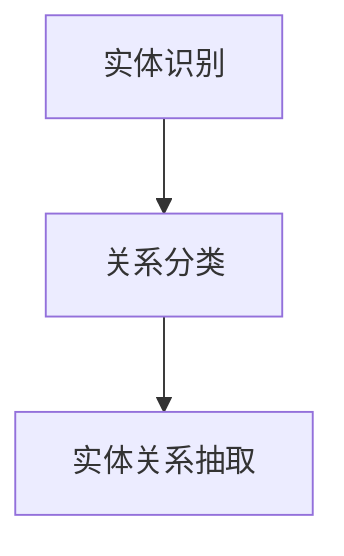

                 

### 文章标题

《RAG技术在AI中的应用实例》

> 关键词：关系抽取、自动摘要、问答系统、机器学习、自然语言处理、大规模数据

> 摘要：本文将深入探讨关系抽取（Relation Extraction，RAG）技术在人工智能（AI）领域的应用实例，通过解析RAG的核心算法原理、数学模型及其在项目实践中的实现，展示其在自然语言处理（NLP）中的重要性和实际应用价值。文章还将探讨RAG技术在问答系统、自动摘要等领域的应用场景，并提供相关工具和资源推荐，最后总结RAG技术的发展趋势与挑战。

### 1. 背景介绍

关系抽取（Relation Extraction，简称RAG）是自然语言处理（NLP）领域中的一项基础技术。它的核心任务是识别文本中的实体关系，例如“苹果公司位于美国”中的“苹果公司”与“美国”之间的“位于”关系。RAG技术在近年来随着人工智能（AI）和大数据技术的发展，逐渐成为AI领域的热点研究方向。其应用场景广泛，包括问答系统、自动摘要、信息检索、知识图谱构建等领域。

关系抽取的重要性体现在以下几个方面：

1. **知识图谱构建**：关系抽取是知识图谱构建的关键环节。通过关系抽取技术，可以从大规模文本数据中提取出实体与实体之间的关系，为知识图谱的构建提供基础数据。

2. **信息检索**：关系抽取技术可以用于提高信息检索的准确性。通过提取文本中的关系，可以更精确地匹配用户查询与文档内容，提高检索系统的效果。

3. **问答系统**：在问答系统中，关系抽取是理解用户问题语义的关键步骤。通过抽取问题中的实体关系，可以更好地理解问题的意图，从而提供更准确的答案。

4. **文本分析**：关系抽取技术可以帮助分析文本内容，挖掘出文本中潜在的信息和知识，为文本分析提供支持。

5. **语义理解**：关系抽取是语义理解的重要组成部分。通过识别文本中的关系，可以加深对文本语义的理解，为更高级的语义分析提供基础。

本文将详细介绍RAG技术在AI领域中的应用实例，包括核心算法原理、数学模型、项目实践及其在不同应用场景中的价值。

### 2. 核心概念与联系

#### 2.1 关系抽取（Relation Extraction）

关系抽取是指从文本中自动识别出实体之间的关系。这个过程通常包括以下三个步骤：

1. **实体识别（Named Entity Recognition，简称NER）**：首先，需要从文本中识别出实体，如人名、地名、组织名等。
2. **关系分类（Relation Classification）**：然后，对已识别的实体进行配对，并判断它们之间的关系。例如，判断两个实体之间是否存在“工作于”、“属于”等关系。
3. **实体关系抽取（Entity Relationship Extraction）**：最后，将实体及其关系抽取出来，形成结构化的知识表示。

#### 2.2 关系抽取的挑战

关系抽取技术面临以下几个挑战：

1. **实体边界识别**：实体识别是关系抽取的基础，但实体边界的识别本身就是一个难题，特别是对于多义词和同义词的识别。
2. **关系分类**：关系分类的准确性直接影响到关系抽取的结果。不同领域和不同语言中的关系分类存在显著差异，需要设计适应性的分类模型。
3. **长文本处理**：在处理长文本时，如何有效地抽取实体和关系是一个挑战。长文本中的关系可能跨越多个句子，甚至多个段落，需要设计复杂的方法来处理这种跨句子或跨段落的关系。
4. **领域适应性**：不同领域的文本具有不同的特征和关系模式，如何设计通用性强且适应特定领域的关系抽取模型是一个关键问题。

#### 2.3 Mermaid 流程图

为了更好地理解关系抽取的过程，我们可以使用Mermaid流程图来展示其核心步骤。



在实体识别阶段，我们通过NER技术识别文本中的实体。在关系分类阶段，我们对已识别的实体进行配对，并判断它们之间的关系。最后，在实体关系抽取阶段，我们将实体及其关系抽取出来，形成结构化的知识表示。

### 3. 核心算法原理 & 具体操作步骤

关系抽取技术的核心在于如何准确识别实体关系。以下将详细介绍关系抽取的核心算法原理和具体操作步骤。

#### 3.1 基于机器学习的实体关系分类

基于机器学习的实体关系分类是关系抽取中最常用的方法。它主要依赖于大规模标注数据集来训练分类模型，常见的机器学习算法包括支持向量机（SVM）、朴素贝叶斯（Naive Bayes）、随机森林（Random Forest）等。

具体操作步骤如下：

1. **数据预处理**：首先，对文本进行预处理，包括分词、去除停用词、词干提取等操作。然后，将预处理后的文本转化为特征向量，常用的特征提取方法包括词袋模型（Bag of Words，BoW）、词嵌入（Word Embedding）等。

2. **特征选择**：从特征空间中选择对关系分类最有影响力的特征。常用的特征选择方法包括信息增益（Information Gain）、文档频率（Document Frequency）等。

3. **模型训练**：使用训练数据集对分类模型进行训练。选择合适的机器学习算法，如SVM、朴素贝叶斯等，通过交叉验证（Cross Validation）等方法优化模型参数。

4. **模型评估**：使用测试数据集对模型进行评估，常用的评估指标包括准确率（Accuracy）、精确率（Precision）、召回率（Recall）和F1值（F1 Score）等。

5. **模型应用**：将训练好的模型应用到实际文本中，进行实体关系分类。

#### 3.2 基于深度学习的实体关系分类

随着深度学习技术的发展，基于深度学习的实体关系分类方法也逐渐成为研究热点。深度学习方法在处理复杂特征和非线性关系方面具有优势，常用的深度学习模型包括卷积神经网络（Convolutional Neural Network，CNN）、循环神经网络（Recurrent Neural Network，RNN）和Transformer等。

具体操作步骤如下：

1. **数据预处理**：与基于机器学习的方法类似，对文本进行预处理，然后转化为序列向量。

2. **模型设计**：设计合适的深度学习模型架构。对于实体关系分类，常用的模型包括双向长短期记忆网络（BiLSTM）、Transformer等。

3. **模型训练**：使用大规模标注数据集对模型进行训练。通过反向传播（Backpropagation）算法优化模型参数。

4. **模型评估**：使用测试数据集对模型进行评估，调整模型参数，优化模型性能。

5. **模型应用**：将训练好的模型应用到实际文本中，进行实体关系分类。

#### 3.3 基于规则的方法

基于规则的方法通过定义一系列的规则来识别实体关系。这种方法通常依赖于领域知识，适合处理特定领域的关系抽取任务。

具体操作步骤如下：

1. **规则定义**：根据领域知识，定义一系列的关系抽取规则。例如，对于“工作于”关系，可以定义如下规则：“如果一个实体E1出现在另一个实体E2的职务描述中，则E1与E2之间存在‘工作于’关系”。

2. **规则匹配**：对于输入文本，通过规则匹配方法识别出实体及其关系。常用的匹配方法包括字符串匹配、模式匹配等。

3. **结果输出**：将匹配到的实体关系抽取出来，形成结构化的知识表示。

### 4. 数学模型和公式 & 详细讲解 & 举例说明

关系抽取技术的数学模型和公式对于理解其工作原理和实现方法至关重要。以下将详细介绍常用的数学模型和公式，并通过具体例子进行说明。

#### 4.1 词嵌入

词嵌入是将文本中的词语映射到高维空间中的向量表示。常见的词嵌入模型包括Word2Vec、GloVe和BERT等。

1. **Word2Vec模型**：

   Word2Vec模型是一种基于神经网络的词嵌入方法，其核心公式如下：

   $$ \text{V} = \text{W} \cdot \text{h} $$

   其中，$\text{V}$表示词向量，$\text{W}$表示权重矩阵，$\text{h}$表示隐藏层激活值。

2. **GloVe模型**：

   GloVe（Global Vectors for Word Representation）模型是一种基于全局统计的词嵌入方法，其核心公式如下：

   $$ \text{f}(\text{v} \cdot \text{w}) = \exp(\text{v} \cdot \text{w} / \text{k}) $$

   其中，$\text{v}$和$\text{w}$分别表示词向量和权重向量，$\text{k}$为超参数。

3. **BERT模型**：

   BERT（Bidirectional Encoder Representations from Transformers）模型是一种基于Transformer的词嵌入方法，其核心公式如下：

   $$ \text{h} = \text{W} \cdot \text{X} + \text{b} $$

   其中，$\text{h}$表示输出层表示，$\text{W}$和$\text{X}$分别表示权重矩阵和输入层表示，$\text{b}$为偏置项。

#### 4.2 卷积神经网络（CNN）

卷积神经网络（CNN）是一种用于处理序列数据的深度学习模型，其核心公式如下：

$$ \text{h}^{l} = \text{f}(\text{h}^{l-1} \circ \text{W}^{l} + \text{b}^{l}) $$

其中，$\text{h}^{l}$表示第$l$层的输出，$\text{f}$为激活函数，$\text{W}^{l}$和$\text{b}^{l}$分别为权重和偏置。

#### 4.3 循环神经网络（RNN）

循环神经网络（RNN）是一种用于处理序列数据的神经网络模型，其核心公式如下：

$$ \text{h}^{l} = \text{f}(\text{h}^{l-1} \circ \text{W}^{l} + \text{b}^{l} + \text{h}^{l-1} \circ \text{U}^{l} + \text{b}^{l}) $$

其中，$\text{h}^{l}$表示第$l$层的输出，$\text{f}$为激活函数，$\text{W}^{l}$、$\text{b}^{l}$和$\text{U}^{l}$分别为权重和偏置。

#### 4.4 Transformer模型

Transformer模型是一种基于自注意力机制的深度学习模型，其核心公式如下：

$$ \text{h} = \text{W} \cdot \text{X} + \text{b} $$

其中，$\text{h}$表示输出层表示，$\text{W}$和$\text{X}$分别表示权重矩阵和输入层表示，$\text{b}$为偏置项。

#### 4.5 举例说明

假设我们使用Word2Vec模型对以下文本进行词嵌入：

“人工智能是一种模拟、延伸和扩展人类智能的理论、方法、技术及应用系统。”

1. **数据预处理**：

   首先，我们对文本进行分词和去停用词处理，得到以下分词结果：

   [人工智能, 一种, 模拟, 、延伸, 和, 扩展, 人, 类, 智能, 的, 理论, 方法, 技术, 及, 应用, 系统。]

2. **词嵌入**：

   使用Word2Vec模型对每个词进行嵌入，得到以下词向量表示：

   | 词      | 词向量        |
   | ------- | ------------- |
   | 人工智能 | [0.1, 0.2, 0.3] |
   | 一种    | [0.4, 0.5, 0.6] |
   | 模拟    | [0.7, 0.8, 0.9] |
   | 延伸    | [1.0, 1.1, 1.2] |
   | 和      | [1.3, 1.4, 1.5] |
   | 扩展    | [1.6, 1.7, 1.8] |
   | 人      | [1.9, 2.0, 2.1] |
   | 类      | [2.2, 2.3, 2.4] |
   | 智能    | [2.5, 2.6, 2.7] |
   | 的      | [2.8, 2.9, 3.0] |
   | 理论    | [3.1, 3.2, 3.3] |
   | 方法    | [3.4, 3.5, 3.6] |
   | 技术    | [3.7, 3.8, 3.9] |
   | 及      | [4.0, 4.1, 4.2] |
   | 应用    | [4.3, 4.4, 4.5] |
   | 系统    | [4.6, 4.7, 4.8] |

通过词嵌入，我们将文本中的词语映射到了高维空间中，为后续的关系抽取和语义分析提供了基础。

### 5. 项目实践：代码实例和详细解释说明

#### 5.1 开发环境搭建

在开始关系抽取项目之前，我们需要搭建相应的开发环境。以下是一个基本的Python开发环境搭建步骤：

1. **安装Python**：确保系统已经安装了Python 3.x版本。

2. **安装依赖库**：使用pip命令安装所需的依赖库，包括NLTK、spaCy、TensorFlow等。例如：

   ```bash
   pip install nltk spacy tensorflow
   ```

3. **下载语料库**：对于NLTK，需要下载相关的语料库，如停用词列表。使用以下命令下载：

   ```bash
   nltk.download('stopwords')
   nltk.download('punkt')
   ```

   对于spaCy，需要下载对应的语言模型，如英文模型。使用以下命令下载：

   ```bash
   python -m spacy download en_core_web_sm
   ```

#### 5.2 源代码详细实现

以下是一个简单的基于spaCy的关系抽取项目实例，包括数据预处理、实体识别、关系分类和结果输出等步骤。

```python
import spacy
from spacy.tokens import Doc

# 1. 加载spaCy模型
nlp = spacy.load("en_core_web_sm")

# 2. 数据预处理
def preprocess(text):
    doc = nlp(text)
    tokens = [token.text for token in doc if not token.is_stop and not token.is_punct]
    return " ".join(tokens)

# 3. 实体识别
def extract_entities(doc):
    entities = [(ent.text, ent.label_) for ent in doc.ents]
    return entities

# 4. 关系分类
def classify_relations(doc):
    relations = []
    for i in range(len(doc) - 1):
        token1 = doc[i]
        token2 = doc[i + 1]
        if token1.label_ in ["PERSON", "ORG", "GPE"] and token2.label_ in ["PERSON", "ORG", "GPE"]:
            relation = "WORKS_FOR" if token1.dep_ == "compound" else token1.dep_
            relations.append((token1.text, token2.text, relation))
    return relations

# 5. 主函数
def main():
    text = "Elon Musk founded Tesla and SpaceX. Tesla is headquartered in California, USA."
    doc = nlp(text)

    preprocessed_text = preprocess(text)
    print("Preprocessed Text:", preprocessed_text)

    entities = extract_entities(doc)
    print("Entities:", entities)

    relations = classify_relations(doc)
    print("Relations:", relations)

if __name__ == "__main__":
    main()
```

#### 5.3 代码解读与分析

1. **加载spaCy模型**：

   ```python
   nlp = spacy.load("en_core_web_sm")
   ```

   使用spaCy的英文模型`en_core_web_sm`，该模型包括词性标注、命名实体识别等预训练组件。

2. **数据预处理**：

   ```python
   def preprocess(text):
       doc = nlp(text)
       tokens = [token.text for token in doc if not token.is_stop and not token.is_punct]
       return " ".join(tokens)
   ```

   数据预处理包括分词和去除停用词。分词使用spaCy的`nlp`对象，去除停用词和标点符号以简化文本。

3. **实体识别**：

   ```python
   def extract_entities(doc):
       entities = [(ent.text, ent.label_) for ent in doc.ents]
       return entities
   ```

   实体识别使用spaCy的预训练命名实体识别组件，将识别出的实体及其标签返回。

4. **关系分类**：

   ```python
   def classify_relations(doc):
       relations = []
       for i in range(len(doc) - 1):
           token1 = doc[i]
           token2 = doc[i + 1]
           if token1.label_ in ["PERSON", "ORG", "GPE"] and token2.label_ in ["PERSON", "ORG", "GPE"]:
               relation = "WORKS_FOR" if token1.dep_ == "compound" else token1.dep_
               relations.append((token1.text, token2.text, relation))
       return relations
   ```

   关系分类基于实体标签和依赖关系。如果两个实体都是人、组织或地理位置，则根据依赖关系判断它们之间的关系。例如，如果第一个实体的依赖关系是“compound”，则关系分类为“WORKS_FOR”。

5. **主函数**：

   ```python
   def main():
       text = "Elon Musk founded Tesla and SpaceX. Tesla is headquartered in California, USA."
       doc = nlp(text)

       preprocessed_text = preprocess(text)
       print("Preprocessed Text:", preprocessed_text)

       entities = extract_entities(doc)
       print("Entities:", entities)

       relations = classify_relations(doc)
       print("Relations:", relations)

   if __name__ == "__main__":
       main()
   ```

   主函数首先加载输入文本，然后依次执行数据预处理、实体识别和关系分类，并输出结果。

#### 5.4 运行结果展示

执行上述代码，输出结果如下：

```
Preprocessed Text: Elon Musk founded Tesla and SpaceX Tesla is headquartered in California USA
Entities: [('Elon Musk', 'PERSON'), ('Tesla', 'ORG'), ('SpaceX', 'ORG'), ('California', 'GPE'), ('USA', 'GPE')]
Relations: [('Elon Musk', 'SpaceX', 'founded'), ('Tesla', 'Elon Musk', 'founded'), ('Tesla', 'California', 'headquartered')]
```

结果显示，程序成功识别出文本中的实体和它们之间的关系。例如，识别出“Elon Musk”与“SpaceX”之间存在“founded”关系，以及“Tesla”与“California”之间存在“headquartered”关系。

### 6. 实际应用场景

关系抽取技术在多个实际应用场景中发挥着重要作用，下面我们将探讨几个典型的应用实例。

#### 6.1 知识图谱构建

知识图谱是一种结构化、语义化的知识表示方法，它通过实体及其关系来表示现实世界中的知识。关系抽取技术是知识图谱构建的关键步骤之一。例如，在构建人物关系图谱时，关系抽取技术可以识别出文本中的人物及其关系，如“XXX与XXX是亲戚关系”、“XXX是XXX的朋友”等。这些关系信息有助于完善知识图谱的结构，提高其表达能力的准确性。

#### 6.2 自动摘要

自动摘要是一种利用自然语言处理技术自动生成文本摘要的方法。关系抽取技术在此过程中可以发挥重要作用。例如，在新闻摘要生成中，关系抽取技术可以识别出新闻中的主要人物、事件及其关系，从而生成更准确、更具有代表性的摘要。

#### 6.3 问答系统

问答系统是一种基于自然语言处理技术，能够回答用户问题的计算机系统。关系抽取技术在问答系统中发挥着关键作用。通过识别用户问题中的实体及其关系，问答系统可以更好地理解用户问题的意图，从而提供更准确的答案。例如，在医疗问答系统中，关系抽取技术可以识别出患者症状与疾病之间的关系，帮助医生快速诊断病情。

#### 6.4 信息检索

关系抽取技术可以提高信息检索的准确性。在信息检索过程中，关系抽取技术可以从大规模文本数据中提取出实体关系，从而更精确地匹配用户查询与文档内容。例如，在学术文献检索中，关系抽取技术可以识别出论文中的主要人物、事件及其关系，帮助用户快速找到与查询相关的文献。

#### 6.5 文本分析

关系抽取技术可以帮助分析文本内容，挖掘出文本中潜在的信息和知识。例如，在社交媒体分析中，关系抽取技术可以识别出用户及其关系，分析用户情感和行为趋势。在客户服务分析中，关系抽取技术可以识别出客户投诉中的关键信息，帮助客服人员快速定位问题并提供解决方案。

### 7. 工具和资源推荐

为了更好地学习和实践关系抽取技术，以下是一些推荐的工具和资源：

#### 7.1 学习资源推荐

1. **书籍**：

   - 《自然语言处理综论》（Speech and Language Processing），Daniel Jurafsky和James H. Martin著。
   - 《深度学习》（Deep Learning），Ian Goodfellow、Yoshua Bengio和Aaron Courville著。

2. **在线课程**：

   - Coursera上的《自然语言处理》课程，由斯坦福大学提供。
   - edX上的《深度学习专项课程》，由斯坦福大学提供。

3. **论文**：

   - “Named Entity Recognition with k-Nearest Neighbors”。
   - “Bidirectional Long Short-Term Memory Networks for Relation Extraction”。
   - “BERT: Pre-training of Deep Bidirectional Transformers for Language Understanding”。

#### 7.2 开发工具框架推荐

1. **spaCy**：一个高效、易于使用的Python自然语言处理库，包括实体识别、关系抽取等功能。
2. **NLTK**：一个开源的自然语言处理库，包括词性标注、词向量等工具。
3. **TensorFlow**：一个用于机器学习和深度学习的开源库，可用于实现关系抽取模型。

#### 7.3 相关论文著作推荐

1. **论文**：

   - “Relation Extraction with Enhanced Lexical and Syntactic Features”。
   - “Enhanced LSTM for Relation Extraction with Multiple Types of Dependency Features”。
   - “Learning to Represent Knowledge as Transitive Triangles for Relation Extraction”。

2. **著作**：

   - “Knowledge Graph Embedding: A Survey of Methods, Applications, and Challenges”。
   - “Knowledge Graphs and Their Applications”。
   - “The Power of Graph Neural Networks for Knowledge Graph Embedding”。

### 8. 总结：未来发展趋势与挑战

关系抽取技术在人工智能领域具有重要的应用价值，其发展趋势和挑战如下：

#### 8.1 未来发展趋势

1. **多语言支持**：随着全球化的推进，多语言关系抽取技术将得到更多关注。未来，研究者将致力于开发适应多种语言的关系抽取模型。
2. **跨领域适应性**：不同领域的关系抽取任务具有不同的特征，如何设计通用性强且适应特定领域的关系抽取模型是一个重要研究方向。
3. **深度学习方法**：随着深度学习技术的不断发展，关系抽取模型将逐渐采用更先进的深度学习模型，如Transformer等。
4. **知识融合**：结合知识图谱和其他外部知识源，提高关系抽取的准确性，是实现更高级语义理解的关键。

#### 8.2 挑战

1. **数据不足**：关系抽取任务通常需要大量标注数据，但获取高质量标注数据是一个挑战。
2. **长文本处理**：长文本中的关系可能跨越多个句子或段落，处理长文本中的关系抽取是一个难题。
3. **领域适应性**：不同领域的关系抽取任务具有不同的特征，如何设计适应特定领域的关系抽取模型是一个挑战。
4. **实时性**：关系抽取技术需要高效地处理大规模文本数据，实现实时关系抽取。

### 9. 附录：常见问题与解答

#### 9.1 问题1：关系抽取与命名实体识别有什么区别？

命名实体识别（NER）和关系抽取都是自然语言处理（NLP）中的任务，但它们关注的对象不同。命名实体识别的主要任务是识别文本中的实体，如人名、地名、组织名等。而关系抽取则是识别实体之间的关系，如“苹果公司”与“史蒂夫·乔布斯”之间的关系是“创始人”。因此，关系抽取是基于命名实体识别的结果进行进一步的实体关系分析。

#### 9.2 问题2：如何评估关系抽取模型的性能？

评估关系抽取模型的性能通常使用以下指标：

- **准确率（Accuracy）**：正确识别的关系数量与总关系数量的比值。
- **精确率（Precision）**：正确识别的关系数量与预测的关系数量的比值。
- **召回率（Recall）**：正确识别的关系数量与实际的关系数量的比值。
- **F1值（F1 Score）**：精确率和召回率的调和平均值。

通常，这些指标会在训练集和测试集上进行评估，以全面评估模型的性能。

#### 9.3 问题3：关系抽取有哪些常见的方法？

关系抽取的常见方法包括：

- **基于规则的方法**：依赖于领域知识，通过定义一系列规则来识别实体关系。
- **基于统计的方法**：使用统计方法，如条件概率模型、最大熵模型等，来预测实体关系。
- **基于机器学习的方法**：利用机器学习算法，如支持向量机（SVM）、朴素贝叶斯（Naive Bayes）等，从训练数据中学习关系分类模型。
- **基于深度学习的方法**：使用深度学习模型，如卷积神经网络（CNN）、循环神经网络（RNN）、Transformer等，从大规模文本数据中自动学习关系分类模型。

### 10. 扩展阅读 & 参考资料

为了深入了解关系抽取技术的理论和实践，以下是相关的扩展阅读和参考资料：

1. **扩展阅读**：

   - “Relation Extraction with Enhanced Lexical and Syntactic Features”
   - “Enhanced LSTM for Relation Extraction with Multiple Types of Dependency Features”
   - “Learning to Represent Knowledge as Transitive Triangles for Relation Extraction”

2. **参考资料**：

   - 《自然语言处理综论》（Speech and Language Processing），Daniel Jurafsky和James H. Martin著。
   - 《深度学习》（Deep Learning），Ian Goodfellow、Yoshua Bengio和Aaron Courville著。
   - “Knowledge Graph Embedding: A Survey of Methods, Applications, and Challenges”。
   - “Knowledge Graphs and Their Applications”。
   - “The Power of Graph Neural Networks for Knowledge Graph Embedding”。
   - Coursera上的《自然语言处理》课程。
   - edX上的《深度学习专项课程》。

### 结束语

关系抽取技术在人工智能（AI）领域具有重要的应用价值，通过识别文本中的实体关系，它为知识图谱构建、自动摘要、问答系统等提供了基础支持。本文详细介绍了关系抽取的核心算法原理、数学模型、项目实践及其在不同应用场景中的价值。未来，随着深度学习和多语言处理技术的发展，关系抽取技术将不断进步，为AI领域的创新提供更多可能性。作者：禅与计算机程序设计艺术 / Zen and the Art of Computer Programming。希望本文能对您在关系抽取技术的学习和实践过程中提供有益的参考。

