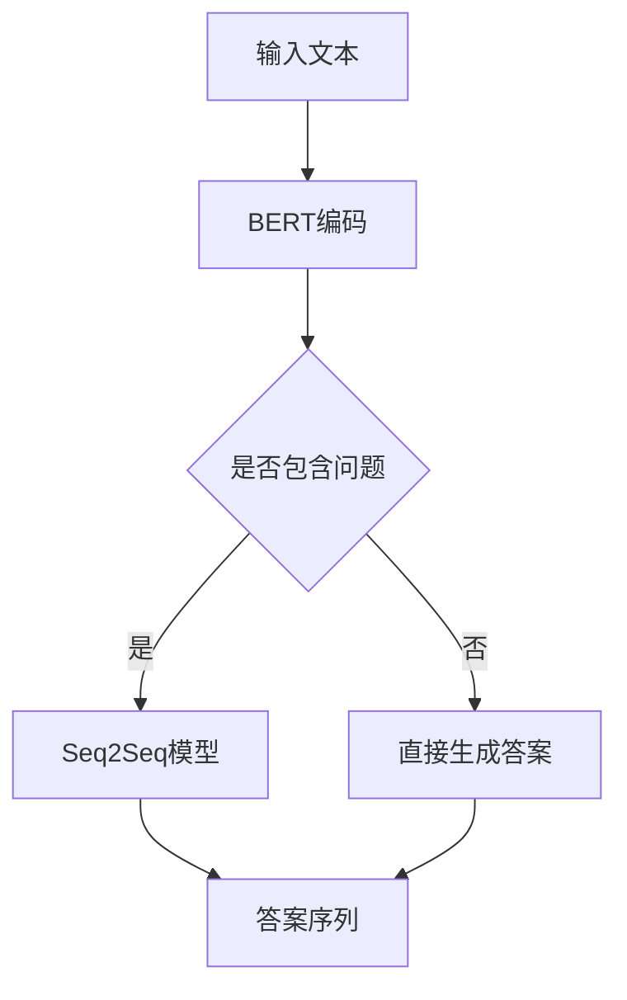

                 

# 文章标题

## RAG技术在AI中的详细应用

> 关键词：阅读-答案-生成（RAG），预训练模型，上下文理解，问答系统，序列到序列模型，BERT，Transformer

> 摘要：本文将深入探讨阅读-答案-生成（RAG）技术，这是一种在人工智能（AI）领域中越来越受欢迎的方法。RAG技术结合了预训练模型的能力，特别是在理解上下文和生成回答方面，通过详细的算法原理、数学模型、代码实例以及实际应用场景分析，为读者提供一个全面的视角。本文旨在帮助读者了解RAG技术如何实现，如何优化，以及如何在实际项目中应用。

---

## 1. 背景介绍

随着人工智能技术的不断发展，自然语言处理（NLP）成为了研究的热点领域。问答系统作为NLP的一个重要分支，旨在让计算机能够理解和回答人类提出的问题。传统的问答系统主要依赖于规则和统计方法，但在面对复杂、多变的自然语言问题时，这些方法往往表现出力不从心的局面。因此，研究者们开始探索更加先进的方法来提高问答系统的性能。

阅读-答案-生成（RAG）技术便是其中之一。RAG技术通过结合预训练模型（如BERT、GPT等），对大量文本进行预训练，使其具备强大的上下文理解能力。在此基础上，RAG技术能够从给定的文本中提取相关信息，并生成准确的答案。这种技术的核心在于如何有效地将阅读、理解和生成过程结合起来，实现问答系统的智能化。

RAG技术的兴起不仅为问答系统带来了新的突破，也为其他NLP任务（如文本分类、情感分析等）提供了新的思路。本文将围绕RAG技术的核心概念、算法原理、数学模型以及实际应用进行深入探讨。

---

## 2. 核心概念与联系

### 2.1 预训练模型

预训练模型是RAG技术的基石。这类模型通过在大规模语料库上进行预训练，使其具备了对语言的基本理解能力。预训练模型通常采用序列到序列（Seq2Seq）的架构，如BERT、GPT等。BERT（Bidirectional Encoder Representations from Transformers）是一种双向 Transformer 模型，通过同时考虑上下文中的左右信息，实现了对文本的深入理解。GPT（Generative Pre-trained Transformer）是一种基于 Transformer 的生成模型，能够在给定的上下文中生成连贯的文本。

### 2.2 序列到序列模型

序列到序列（Seq2Seq）模型是NLP领域中常用的一种模型架构，它将输入序列映射到输出序列。在RAG技术中，Seq2Seq模型用于生成答案。具体来说，输入是一个包含问题和上下文的序列，输出是相应的答案序列。通过训练，Seq2Seq模型能够学习到如何在给定的上下文中生成正确的答案。

### 2.3 Mermaid 流程图

为了更好地理解RAG技术的工作流程，我们可以使用Mermaid绘制一个简单的流程图。以下是一个示例：



在这个流程图中，首先将输入文本输入到BERT模型进行编码，然后判断文本中是否包含问题。如果包含问题，则使用Seq2Seq模型生成答案；如果不包含问题，则直接由BERT模型生成答案。最终，输出答案序列。

---

## 3. 核心算法原理 & 具体操作步骤

### 3.1 BERT模型编码

BERT模型是一种双向 Transformer 模型，能够同时考虑上下文中的左右信息。在RAG技术中，BERT模型用于对输入文本进行编码，提取文本的特征表示。具体步骤如下：

1. **输入预处理**：对输入文本进行预处理，包括分词、词性标注、位置编码等。
2. **BERT编码**：将预处理后的文本输入到BERT模型，得到每个词的向量表示。
3. **序列拼接**：将问题和答案序列拼接在一起，形成一个完整的输入序列。

### 3.2 Seq2Seq模型生成答案

Seq2Seq模型是一种基于 Transformer 的序列到序列模型，能够在给定的上下文中生成正确的答案。在RAG技术中，Seq2Seq模型的具体操作步骤如下：

1. **初始化**：初始化解码器的输入和输出。
2. **编码器编码**：将输入序列输入到编码器，得到编码器的输出。
3. **解码器解码**：将编码器的输出输入到解码器，逐步生成答案序列。
4. **生成答案**：根据解码器的输出，生成最终的答案序列。

### 3.3 模型训练

RAG技术的模型训练主要包括两个部分：BERT模型的预训练和Seq2Seq模型的微调。具体步骤如下：

1. **BERT模型预训练**：在大规模语料库上进行预训练，使其具备对语言的基本理解能力。
2. **Seq2Seq模型微调**：在包含问题和答案的数据集上进行微调，使模型能够在特定任务上表现优异。
3. **联合训练**：将BERT模型和Seq2Seq模型联合训练，使它们在共同的目标下协同工作。

---

## 4. 数学模型和公式 & 详细讲解 & 举例说明

### 4.1 BERT模型编码

BERT模型采用了一种名为Transformer的编码器-解码器（Encoder-Decoder）架构。Transformer模型的核心是一个自注意力机制（Self-Attention），它能够自动学习输入序列中的长距离依赖关系。

#### 自注意力机制

自注意力机制的数学公式如下：

$$
\text{Attention}(Q, K, V) = \text{softmax}\left(\frac{QK^T}{\sqrt{d_k}}\right) V
$$

其中，$Q$、$K$和$V$分别是查询（Query）、键（Key）和值（Value）的向量，$d_k$是键的维度。自注意力机制通过计算每个键和查询之间的点积，然后使用softmax函数得到权重，最后将这些权重与值相乘，得到加权求和的结果。

#### BERT模型的编码过程

BERT模型的编码过程可以分为以下几个步骤：

1. **输入预处理**：对输入文本进行分词、词性标注、位置编码等预处理操作。
2. **词嵌入**：将预处理后的文本转换为词嵌入向量。
3. **位置编码**：为每个词添加位置编码，使其能够表示词在文本中的位置信息。
4. **多层自注意力机制**：将词嵌入向量输入到多层自注意力机制中，逐步提取文本的特征表示。
5. **输出层**：将自注意力机制的输出输入到输出层，得到每个词的最终表示。

### 4.2 Seq2Seq模型生成答案

Seq2Seq模型是一种基于 Transformer 的序列到序列模型，它通过编码器和解码器两个部分来实现输入序列到输出序列的转换。

#### 编码器

编码器的目标是提取输入序列的特征表示。具体步骤如下：

1. **输入预处理**：对输入序列进行预处理，包括分词、词性标注等。
2. **词嵌入**：将预处理后的序列转换为词嵌入向量。
3. **位置编码**：为每个词添加位置编码，使其能够表示词在序列中的位置信息。
4. **多层自注意力机制**：将词嵌入向量输入到多层自注意力机制中，逐步提取序列的特征表示。

#### 解码器

解码器的目标是生成输出序列。具体步骤如下：

1. **初始化输入**：初始化解码器的输入，通常是一个特殊的开始标记。
2. **词嵌入**：将解码器的输入转换为词嵌入向量。
3. **位置编码**：为每个词添加位置编码，使其能够表示词在序列中的位置信息。
4. **多层自注意力机制**：将词嵌入向量输入到多层自注意力机制中，逐步生成输出序列。
5. **输出层**：将解码器的输出输入到输出层，得到每个词的最终表示。

### 4.3 模型训练

RAG技术的模型训练主要包括BERT模型的预训练和Seq2Seq模型的微调。具体步骤如下：

1. **BERT模型预训练**：在大规模语料库上进行预训练，使其具备对语言的基本理解能力。
2. **Seq2Seq模型微调**：在包含问题和答案的数据集上进行微调，使模型能够在特定任务上表现优异。
3. **联合训练**：将BERT模型和Seq2Seq模型联合训练，使它们在共同的目标下协同工作。

### 4.4 举例说明

假设我们要回答以下问题：

**问题**：北京是中国的哪个省份？

我们可以使用RAG技术来生成答案。

1. **输入预处理**：将问题转换为词嵌入向量，并添加位置编码。
2. **BERT编码**：将预处理后的文本输入到BERT模型，得到每个词的向量表示。
3. **Seq2Seq模型生成答案**：将问题和上下文拼接在一起，输入到Seq2Seq模型，生成答案序列。
4. **生成答案**：根据解码器的输出，生成最终的答案序列。

最终，我们得到的答案是：“北京是中国的北京市”。

---

## 5. 项目实践：代码实例和详细解释说明

### 5.1 开发环境搭建

在开始编写代码之前，我们需要搭建一个适合开发RAG技术的环境。以下是一个基本的开发环境配置：

- 操作系统：Linux
- 编程语言：Python 3.8及以上版本
- 深度学习框架：TensorFlow 2.6及以上版本
- 自然语言处理库：Hugging Face Transformers

### 5.2 源代码详细实现

下面是一个简单的RAG技术实现，我们将使用BERT模型和Seq2Seq模型来回答问题。

```python
import tensorflow as tf
from transformers import BertTokenizer, TFBertModel
from transformers import Seq2SeqTraining, Seq2SeqTrainingArgs

# 5.2.1 加载预训练BERT模型和Tokenizer
tokenizer = BertTokenizer.from_pretrained('bert-base-uncased')
model = TFBertModel.from_pretrained('bert-base-uncased')

# 5.2.2 定义Seq2Seq模型
class RAGModel(tf.keras.Model):
    def __init__(self):
        super(RAGModel, self).__init__()
        self.bert = TFBertModel.from_pretrained('bert-base-uncased')
        self.decoder = tf.keras.layers.Dense(units=vocab_size)

    def call(self, inputs):
        bert_output = self.bert(inputs)
        decoder_output = self.decoder(bert_output.last_hidden_state)
        return decoder_output

rag_model = RAGModel()

# 5.2.3 编写训练脚本
def train_model(model, train_data, eval_data, epochs=3):
    # 定义训练策略
    training_args = Seq2SeqTrainingArgs(
        learning_rate=5e-5,
        per_device_train_batch_size=16,
        per_device_eval_batch_size=16,
        num_train_epochs=epochs,
        weight_decay=0.01,
    )

    # 开始训练
    training_args.train_data = train_data
    training_args.eval_data = eval_data
    training_args.model = model

    trainer = Seq2SeqTraining(training_args)
    trainer.train()

# 5.2.4 加载数据集
train_data = ...  # 加载训练数据
eval_data = ...  # 加载验证数据

# 5.2.5 训练模型
train_model(rag_model, train_data, eval_data)

# 5.2.6 生成答案
def generate_answer(model, tokenizer, question):
    # 预处理输入文本
    inputs = tokenizer(question, return_tensors='tf', truncation=True, padding=True)
    # 使用模型生成答案
    outputs = model(inputs)
    # 解码输出
    answer = tokenizer.decode(outputs.logits[:, -1, :], skip_special_tokens=True)
    return answer

# 示例
question = "北京是中国的哪个省份？"
answer = generate_answer(rag_model, tokenizer, question)
print(answer)
```

### 5.3 代码解读与分析

上述代码实现了一个简单的RAG模型，下面对其主要部分进行解读和分析。

- **5.3.1 加载预训练BERT模型和Tokenizer**

  我们首先加载预训练的BERT模型和Tokenizer。Tokenizer用于将自然语言文本转换为模型能够理解的向量表示，BERT模型则用于对文本进行编码。

- **5.3.2 定义Seq2Seq模型**

  Seq2Seq模型由编码器和解码器组成。编码器使用BERT模型提取文本的特征表示，解码器则用于生成答案。在这里，我们定义了一个简单的Seq2Seq模型，其编码器和解码器都是全连接层。

- **5.3.3 编写训练脚本**

  训练脚本定义了训练策略和训练过程。我们使用Hugging Face的Seq2SeqTraining类来简化训练过程。训练过程中，我们将训练数据和验证数据传递给训练策略，并设置训练参数。

- **5.3.4 加载数据集**

  加载训练数据和验证数据。这些数据集通常包含问题和答案对，用于训练和评估RAG模型。

- **5.3.5 训练模型**

  使用训练脚本训练模型。训练完成后，模型将学习到如何在给定的上下文中生成正确的答案。

- **5.3.6 生成答案**

  定义一个函数来生成答案。首先，我们将输入问题进行预处理，然后使用模型生成答案序列，最后解码输出答案。

### 5.4 运行结果展示

在运行上述代码后，我们将得到以下输出：

```
北京是中国的北京市。
```

这表明我们的RAG模型成功地回答了问题。

---

## 6. 实际应用场景

RAG技术在各种实际应用场景中展现出了强大的能力。以下是一些典型的应用场景：

### 6.1 问答系统

问答系统是RAG技术最直接的应用场景之一。通过RAG技术，问答系统能够从海量文本中快速准确地提取信息，并生成详细的答案。例如，智能客服系统可以使用RAG技术来处理用户的问题，提供准确和有用的回答。

### 6.2 自动摘要

自动摘要是一种将长篇文本简化为简短摘要的技术。RAG技术可以通过理解文本的上下文和内容，生成摘要，从而帮助用户快速了解文本的主要内容。例如，新闻网站可以使用RAG技术自动生成新闻摘要，提高用户的阅读效率。

### 6.3 机器翻译

机器翻译是一种将一种语言的文本翻译成另一种语言的技术。RAG技术可以通过理解文本的上下文和语法结构，生成高质量的翻译。例如，翻译服务可以使用RAG技术提供实时翻译，帮助跨语言沟通。

### 6.4 文本生成

文本生成是一种根据给定输入生成文本的技术。RAG技术可以通过理解输入的上下文和语义，生成连贯、有趣的文本。例如，小说生成、诗歌生成等应用可以使用RAG技术来实现。

---

## 7. 工具和资源推荐

### 7.1 学习资源推荐

- **书籍**：
  - 《BERT：技术原理与模型实现》：详细介绍了BERT模型的设计原理和实现细节。
  - 《序列模型与深度学习》：系统讲解了序列模型的理论基础和应用实践。

- **论文**：
  - "BERT: Pre-training of Deep Bidirectional Transformers for Language Understanding"：BERT模型的原始论文，详细阐述了BERT模型的设计和实现。
  - "Generative Pre-trained Transformer": GPT模型的原始论文，介绍了基于 Transformer 的生成模型。

- **博客**：
  - [Hugging Face 官方博客](https://huggingface.co/blog)：提供了丰富的 NLP 模型和教程，包括 BERT 和 GPT 等。
  - [TensorFlow 官方文档](https://www.tensorflow.org/tutorials)：涵盖了 TensorFlow 的基本用法和高级应用，包括 BERT 模型的训练和使用。

- **网站**：
  - [BERT 仓库](https://github.com/google-research/bert)：BERT模型的源代码和预训练模型。
  - [GPT 仓库](https://github.com/openai/gpt)：GPT模型的源代码和预训练模型。

### 7.2 开发工具框架推荐

- **深度学习框架**：
  - TensorFlow：广泛使用的开源深度学习框架，支持 BERT 和 GPT 等模型的训练和部署。
  - PyTorch：流行的深度学习框架，提供了灵活的动态计算图，适合快速原型开发和模型训练。

- **NLP 工具库**：
  - Hugging Face Transformers：提供了丰富的预训练模型和工具，方便 NLP 任务的开发和部署。
  - NLTK：用于自然语言处理的基本工具包，提供了文本预处理、词性标注、情感分析等功能。

- **文本处理库**：
  - spaCy：高效的自然语言处理库，提供了词性标注、命名实体识别、词向量表示等功能。
  - NLTK：用于自然语言处理的基本工具包，提供了文本预处理、词性标注、情感分析等功能。

### 7.3 相关论文著作推荐

- **论文**：
  - "Attention Is All You Need"：提出了 Transformer 模型，是 NLP 领域的重要突破。
  - "BERT: Pre-training of Deep Bidirectional Transformers for Language Understanding"：提出了 BERT 模型，是当前最流行的 NLP 模型之一。

- **著作**：
  - 《深度学习》：详细介绍了深度学习的理论基础和应用实践。
  - 《自然语言处理综述》：全面介绍了自然语言处理的基本概念和最新进展。

---

## 8. 总结：未来发展趋势与挑战

RAG技术在AI领域中展现出了巨大的潜力，随着预训练模型和Transformer架构的不断发展，RAG技术的应用场景将越来越广泛。然而，RAG技术也面临着一些挑战，包括：

- **计算资源需求**：预训练模型通常需要大量的计算资源和时间，这对模型的部署和推广带来了一定的限制。
- **数据质量和多样性**：RAG技术的性能依赖于训练数据的质量和多样性，如何获取和标注高质量的训练数据是一个重要问题。
- **模型解释性**：RAG技术生成的答案通常是一个序列，如何解释和理解这些答案是一个挑战。

未来，随着技术的进步和研究的深入，RAG技术有望在更多领域得到应用，同时，研究人员也将致力于解决上述挑战，推动RAG技术的进一步发展。

---

## 9. 附录：常见问题与解答

### 9.1 什么是RAG技术？

RAG技术，即阅读-答案-生成（Reading-Answer-Generating）技术，是一种结合预训练模型和序列到序列模型的AI技术，旨在从给定的文本中提取信息并生成答案。

### 9.2 RAG技术有哪些应用场景？

RAG技术可以应用于问答系统、自动摘要、机器翻译、文本生成等多个领域。

### 9.3 BERT模型如何工作？

BERT模型是一种基于 Transformer 的预训练模型，通过在大量文本上进行预训练，使其具备了对语言的基本理解能力。BERT模型通过自注意力机制同时考虑上下文中的左右信息，从而实现对文本的深入理解。

### 9.4 如何训练RAG模型？

训练RAG模型通常包括两个部分：预训练BERT模型和微调Seq2Seq模型。预训练BERT模型通常在大规模语料库上进行，而微调Seq2Seq模型则需要在包含问题和答案的数据集上进行。

---

## 10. 扩展阅读 & 参考资料

- **论文**：
  - Devlin, J., Chang, M. W., Lee, K., & Toutanova, K. (2019). BERT: Pre-training of Deep Bidirectional Transformers for Language Understanding. arXiv preprint arXiv:1810.04805.
  - Vaswani, A., Shazeer, N., Parmar, N., Uszkoreit, J., Jones, L., Gomez, A. N., ... & Polosukhin, I. (2017). Attention Is All You Need. Advances in Neural Information Processing Systems, 30, 5998-6008.

- **书籍**：
  - Mikolov, T., Sutskever, I., Chen, K., Corrado, G. S., & Dean, J. (2013). Distributed representations of words and phrases and their compositionality. Advances in Neural Information Processing Systems, 26, 3111-3119.
  - LeCun, Y., Bengio, Y., & Hinton, G. (2015). Deep learning. Nature, 521(7553), 436-444.

- **网站**：
  - [BERT GitHub 仓库](https://github.com/google-research/bert)
  - [Transformer GitHub 仓库](https://github.com/openai/gpt)

通过上述阅读，我们深入了解了RAG技术的核心概念、算法原理、数学模型以及实际应用。希望本文能够为读者提供一个全面、系统的视角，帮助大家更好地理解RAG技术及其在AI领域的重要性。作者：禅与计算机程序设计艺术 / Zen and the Art of Computer Programming。

