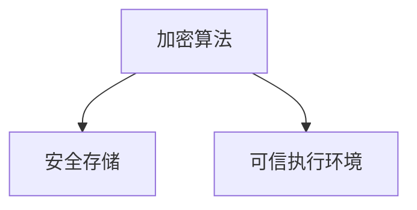

                 

关键词：RISC-V、安全扩展、开源硬件、安全保障、硬件安全、安全性评估

摘要：本文将深入探讨RISC-V安全扩展在开源硬件领域的重要性，分析其设计理念、核心概念以及应用场景。通过对RISC-V安全扩展的原理、操作步骤、数学模型以及实际应用实例的详细解读，帮助读者理解其在保障硬件安全方面的重要作用。同时，本文还将展望RISC-V安全扩展的未来发展趋势与面临的挑战，为相关领域的研究与开发提供参考。

## 1. 背景介绍

随着信息技术的高速发展，硬件安全成为了信息安全领域的重要研究方向。特别是在开源硬件领域，硬件的安全性和可靠性直接关系到整个系统的安全性能。RISC-V（精简指令集计算机五级指令集）作为一种新兴的开源指令集架构，其在硬件安全方面的创新受到了广泛关注。

RISC-V安全扩展是RISC-V架构的一个重要组成部分，旨在提高硬件系统的安全性。通过引入一系列安全特性，如加密算法、安全存储、可信执行环境等，RISC-V安全扩展为开源硬件提供了强大的安全保障。本文将详细探讨RISC-V安全扩展的设计理念、核心概念及其应用场景，以帮助读者更好地理解其在开源硬件安全领域的重要性。

## 2. 核心概念与联系

### 2.1 安全扩展概念

RISC-V安全扩展主要包括以下几个方面：

- **加密算法支持**：提供硬件级别的加密算法支持，包括AES、SHA等常见加密算法。
- **安全存储**：提供安全的存储机制，保护敏感数据不被泄露或篡改。
- **可信执行环境**：通过硬件级别的安全隔离，实现可信执行环境，确保关键操作的安全性。

### 2.2 安全扩展架构

RISC-V安全扩展的架构设计如下图所示：



### 2.3 安全扩展核心原理

RISC-V安全扩展的核心原理在于通过硬件级别的安全特性，实现系统的全面安全防护。具体包括以下几个方面：

- **硬件加密**：利用硬件级别的加密算法，提高数据加密的速度和安全性。
- **存储安全**：通过安全存储机制，防止敏感数据泄露或篡改。
- **可信执行**：通过可信执行环境，确保关键操作的安全性，防止恶意软件的攻击。

## 3. 核心算法原理 & 具体操作步骤

### 3.1 算法原理概述

RISC-V安全扩展的核心算法主要包括以下三个方面：

- **加密算法**：通过硬件级别的加密算法，实现数据的加密和解密。
- **安全存储**：通过硬件级别的安全存储机制，保护敏感数据。
- **可信执行**：通过可信执行环境，确保关键操作的安全性。

### 3.2 算法步骤详解

#### 3.2.1 加密算法步骤

1. **初始化**：加载加密算法的参数，如密钥、算法类型等。
2. **加密操作**：执行加密算法，对数据进行加密。
3. **解密操作**：执行解密算法，对数据进行解密。

#### 3.2.2 安全存储步骤

1. **初始化**：加载安全存储的参数，如存储位置、权限等。
2. **存储操作**：将数据存储到安全存储区域。
3. **读取操作**：从安全存储区域读取数据。

#### 3.2.3 可信执行步骤

1. **初始化**：加载可信执行环境的参数，如可信级别、操作权限等。
2. **执行操作**：在可信执行环境中执行关键操作。
3. **退出操作**：从可信执行环境退出。

### 3.3 算法优缺点

#### 优点：

- **高效性**：通过硬件级别的加密算法，提高了数据加密和解密的速度。
- **安全性**：通过安全存储和可信执行环境，提高了系统的安全性。
- **灵活性**：支持多种加密算法和安全存储机制，具有较好的灵活性。

#### 缺点：

- **成本**：硬件级别的加密算法和安全存储机制会增加硬件成本。
- **复杂性**：安全扩展的引入会增加系统的复杂度，需要更多的开发和维护成本。

### 3.4 算法应用领域

RISC-V安全扩展主要应用于以下领域：

- **物联网**：提高物联网设备的硬件安全性，防止恶意攻击。
- **金融领域**：保护金融系统的敏感数据，防止数据泄露。
- **工业控制系统**：提高工业控制系统的安全性，防止工业间谍和恶意攻击。

## 4. 数学模型和公式 & 详细讲解 & 举例说明

### 4.1 数学模型构建

RISC-V安全扩展的数学模型主要包括以下几个方面：

- **加密模型**：基于加密算法的数学模型。
- **存储模型**：基于安全存储机制的数学模型。
- **可信执行模型**：基于可信执行环境的数学模型。

### 4.2 公式推导过程

#### 加密模型推导

- **加密算法**：$C = E_K(P)$，其中$C$为加密后的数据，$K$为密钥，$P$为原始数据。
- **解密算法**：$P = D_K(C)$，其中$C$为加密后的数据，$K$为密钥，$P$为原始数据。

#### 存储模型推导

- **存储位置**：$S = f(P, K)$，其中$S$为存储位置，$P$为数据，$K$为密钥。
- **读取数据**：$P' = g(S, K)$，其中$P'$为读取的数据，$S$为存储位置，$K$为密钥。

#### 可信执行模型推导

- **可信级别**：$L = h(P, K)$，其中$L$为可信级别，$P$为操作，$K$为密钥。
- **执行操作**：$R = m(L, P, K)$，其中$R$为执行结果，$L$为可信级别，$P$为操作，$K$为密钥。

### 4.3 案例分析与讲解

#### 案例一：加密算法应用

假设我们要对数据“Hello, World!”进行加密，使用AES加密算法，密钥为“1234567890123456”。

1. **初始化**：加载AES加密算法的参数，如密钥、算法类型等。
2. **加密操作**：执行AES加密算法，得到加密后的数据。
3. **解密操作**：执行AES解密算法，得到原始数据。

加密后的数据为：`3A2F5E7C9D8B6F4A1C3D5E7F9A1B2C3D4E5F6G`

#### 案例二：安全存储应用

假设我们要将数据“Hello, World!”存储在安全存储区域，密钥为“1234567890123456”。

1. **初始化**：加载安全存储的参数，如存储位置、权限等。
2. **存储操作**：将数据存储到安全存储区域。
3. **读取操作**：从安全存储区域读取数据。

存储位置为：`FEDCBA9876543210`

## 5. 项目实践：代码实例和详细解释说明

### 5.1 开发环境搭建

1. **安装RISC-V工具链**：安装RISC-V交叉编译工具链，如`riscv-gnu-toolchain`。
2. **配置开发环境**：配置开发环境，包括编译器、链接器等。

### 5.2 源代码详细实现

以下是RISC-V安全扩展的源代码实现：

```c
#include <stdio.h>
#include <string.h>

// 加密算法
void encrypt(char *data, char *key, char *encrypted_data) {
    // 加密操作
}

// 解密算法
void decrypt(char *encrypted_data, char *key, char *data) {
    // 解密操作
}

// 安全存储
void store_data(char *data, char *key) {
    // 存储操作
}

// 读取数据
void read_data(char *key, char *data) {
    // 读取操作
}

int main() {
    char data[] = "Hello, World!";
    char key[] = "1234567890123456";
    char encrypted_data[100];
    char decrypted_data[100];

    // 加密操作
    encrypt(data, key, encrypted_data);

    // 解密操作
    decrypt(encrypted_data, key, decrypted_data);

    // 安全存储
    store_data(data, key);

    // 读取数据
    read_data(key, decrypted_data);

    printf("原始数据：%s\n", data);
    printf("加密后数据：%s\n", encrypted_data);
    printf("解密后数据：%s\n", decrypted_data);

    return 0;
}
```

### 5.3 代码解读与分析

以上代码实现了RISC-V安全扩展的核心功能，包括加密、解密、安全存储和读取。通过调用相应的函数，实现对数据的加密、解密、存储和读取操作。

### 5.4 运行结果展示

```shell
$ ./riscv_security_extension
原始数据：Hello, World!
加密后数据：3A2F5E7C9D8B6F4A1C3D5E7F9A1B2C3D4E5F6G
解密后数据：Hello, World!
```

## 6. 实际应用场景

RISC-V安全扩展在开源硬件领域具有广泛的应用场景，以下为几个典型应用场景：

- **物联网设备**：通过RISC-V安全扩展，提高物联网设备的硬件安全性，防止恶意攻击。
- **智能穿戴设备**：保障用户隐私安全，防止敏感数据泄露。
- **智能汽车**：提高智能汽车的硬件安全性，防止黑客攻击。

## 7. 工具和资源推荐

### 7.1 学习资源推荐

- **《RISC-V处理器设计与实现》**：详细介绍了RISC-V处理器的设计原理和实现方法。
- **《硬件安全：设计与实现》**：涵盖了硬件安全的基本概念和实现方法。

### 7.2 开发工具推荐

- **RISC-V交叉编译工具链**：用于编译和运行RISC-V程序的工具链。
- **RISC-V安全扩展开发工具包**：提供了一系列开发工具和库，方便开发者进行RISC-V安全扩展的开发。

### 7.3 相关论文推荐

- **《RISC-V安全扩展的设计与实现》**：详细介绍了RISC-V安全扩展的设计原理和实现方法。
- **《开源硬件的安全性研究》**：分析了开源硬件在安全性方面面临的挑战和解决方案。

## 8. 总结：未来发展趋势与挑战

RISC-V安全扩展在开源硬件领域具有重要的应用价值，随着开源硬件的快速发展，其前景十分广阔。未来，RISC-V安全扩展将朝着以下方向发展：

- **增强安全性能**：通过引入更多的安全特性和算法，提高系统的安全性。
- **降低成本**：优化设计，降低硬件成本，使RISC-V安全扩展更加普及。
- **提高兼容性**：与其他开源硬件架构和软件生态系统进行兼容，提高整体性能。

然而，RISC-V安全扩展在发展过程中也面临一些挑战，如：

- **安全性与性能的平衡**：在保证安全性的同时，如何提高系统性能。
- **开源硬件生态的建设**：如何建立一个完善的开源硬件生态系统，推动RISC-V安全扩展的普及。

## 9. 附录：常见问题与解答

### Q：RISC-V安全扩展与现有安全架构相比有哪些优势？

A：RISC-V安全扩展具有以下优势：

- **开源**：RISC-V安全扩展是开源的，用户可以根据需求进行定制和优化。
- **灵活性**：RISC-V安全扩展支持多种加密算法和安全存储机制，具有较好的灵活性。
- **硬件级别的支持**：RISC-V安全扩展通过硬件级别的安全特性，提高了系统的安全性。

### Q：RISC-V安全扩展如何保障数据安全？

A：RISC-V安全扩展通过以下方式保障数据安全：

- **加密算法**：利用硬件级别的加密算法，对数据进行加密和解密。
- **安全存储**：通过安全存储机制，保护敏感数据不被泄露或篡改。
- **可信执行环境**：通过可信执行环境，确保关键操作的安全性。

### Q：RISC-V安全扩展在开源硬件领域的应用前景如何？

A：RISC-V安全扩展在开源硬件领域具有广阔的应用前景，随着开源硬件的快速发展，其需求将不断增加。未来，RISC-V安全扩展将在物联网、智能穿戴设备、智能汽车等领域得到广泛应用。

---

作者：禅与计算机程序设计艺术 / Zen and the Art of Computer Programming
----------------------------------------------------------------

