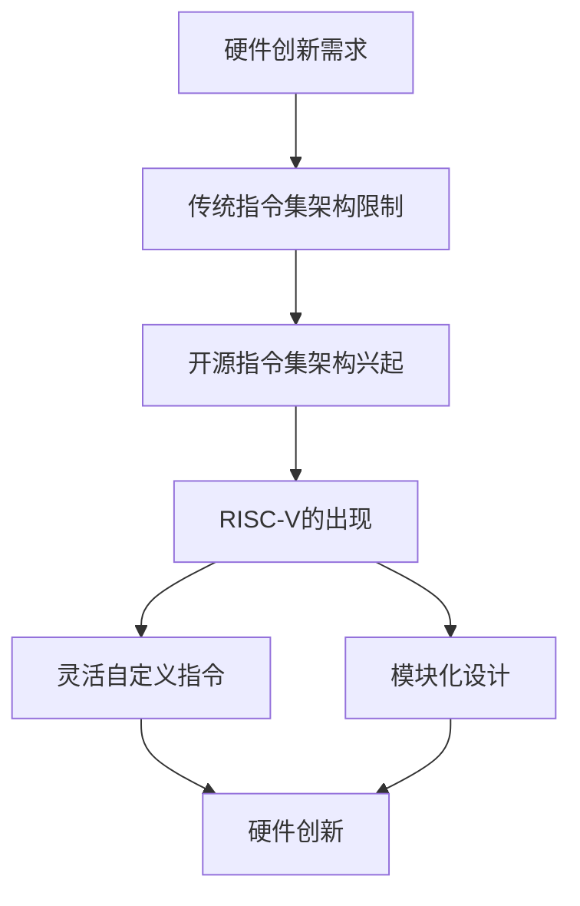
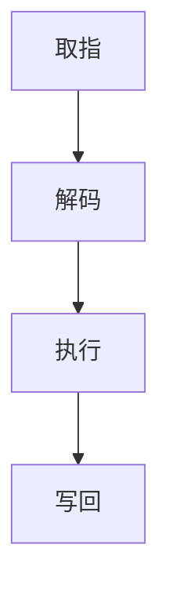

                 

### 文章标题

RISC-V：开源指令集架构的崛起

> 关键词：RISC-V、开源指令集架构、处理器设计、硬件创新、开源社区

> 摘要：本文将深入探讨RISC-V，一个新兴的开源指令集架构，如何在全球范围内推动硬件创新，改变了传统的处理器设计模式。文章将从RISC-V的背景、核心概念、算法原理、应用场景、资源推荐等多个方面进行详细分析，旨在为读者提供一份全面而深入的RISC-V指南。

## 1. 背景介绍

RISC-V（精简指令集计算机五级指令集）起源于加州大学伯克利分校，由Krste Asanović、David Brooks、Jeffrey D. Bearman、Nitin Bhatia和Andrew Waterman于2010年提出。最初，这一项目旨在解决当时处理器设计中的几个问题：性能瓶颈、设计复杂性和生态系统封闭性。

随着时间的发展，RISC-V逐渐从学术界走向工业界，成为全球开源社区关注的热点。它以开放、灵活、模块化的特点迅速吸引了全球范围内的关注和参与。从最初的大学项目，到今天的全球协作，RISC-V的成长轨迹见证了开源指令集架构的力量。

RISC-V的出现，不仅为处理器设计提供了新的选择，也对硬件生态系统产生了深远的影响。它打破了传统指令集架构的垄断局面，使得更多的公司和个人能够参与到处理器的设计中来，推动了硬件创新的进程。

## 2. 核心概念与联系

### 2.1 指令集架构基础

指令集架构（Instruction Set Architecture, ISA）是计算机体系结构的一个重要组成部分，定义了计算机硬件与软件之间的接口。它包括了一系列的指令，这些指令决定了计算机可以执行的操作类型，如算术、逻辑、存储器访问等。

RISC-V作为一款开源指令集架构，继承了精简指令集（RISC）的传统，旨在提供一种简洁、高效、易于扩展的指令集。与传统的复杂指令集架构（CISC）相比，RISC-V通过减少指令数量、简化指令执行过程，提高了指令的执行效率。

### 2.2 RISC-V的核心概念

RISC-V的核心概念主要包括以下几个方面：

- **自定义指令**：RISC-V允许用户根据需求自定义指令，这一特性极大地提高了指令集的灵活性和适用性。
- **模块化设计**：RISC-V的设计采用了模块化的方式，使得各个模块可以独立开发、测试和部署，从而提高了整个架构的可维护性和可扩展性。
- **二进制兼容性**：RISC-V遵循了SPARC的TSO（Time-Space-Offset）内存模型，实现了较高的二进制兼容性，使得不同的RISC-V处理器可以运行相同的二进制程序。
- **开源性**：RISC-V的开源特性使得任何人都可以自由地访问、修改和分发RISC-V的源代码，从而降低了研发成本，加速了技术的迭代。

### 2.3 RISC-V与硬件创新的关系

RISC-V的出现为硬件创新带来了新的契机。一方面，它降低了处理器设计的门槛，使得更多的公司和个人能够参与到处理器的设计中来；另一方面，它提供了丰富的自定义指令和模块化设计，使得处理器可以更加高效、灵活地满足各种应用需求。

为了更好地展示RISC-V与硬件创新的关系，我们可以使用以下Mermaid流程图：



在这个流程图中，我们可以清晰地看到RISC-V如何从需求出发，通过开源指令集架构的特性，推动硬件创新的发展。

## 3. 核心算法原理 & 具体操作步骤

### 3.1 RISC-V指令集概述

RISC-V指令集可以分为五个不同的层次，每个层次都提供了不同的功能：

- **基础指令集（I）**：包括加法、减法、移位、逻辑操作等基本指令。
- **整数指令扩展（M）**：包括乘法、除法、浮点操作等整数指令。
- **标准指令扩展（S）**：包括字符串操作、位操作等。
- **专用指令扩展（A）**：包括特定硬件的指令，如内存管理、虚拟化等。
- **特权指令集（P）**：包括操作系统管理等特权指令。

### 3.2 RISC-V指令执行流程

RISC-V指令的执行流程可以分为以下几个步骤：

1. **取指**：CPU从内存中读取下一条指令。
2. **解码**：CPU对指令进行解码，确定指令的类型和操作数。
3. **执行**：CPU执行指令的操作，如加法、减法等。
4. **写回**：将执行结果写回到寄存器或内存中。

以下是一个简单的RISC-V指令执行流程示例：



### 3.3 RISC-V处理器设计

RISC-V处理器的设计过程可以分为以下几个步骤：

1. **需求分析**：明确处理器的设计目标和应用场景。
2. **架构设计**：根据需求设计处理器的基本架构，如核心数量、指令集、内存管理等。
3. **模块化设计**：将处理器划分为不同的模块，如指令解码模块、执行模块、内存模块等。
4. **功能验证**：通过仿真或硬件测试，验证每个模块的功能是否符合设计要求。
5. **系统集成**：将各个模块集成到一起，进行整体测试和调试。
6. **性能优化**：根据测试结果，对处理器进行性能优化。

## 4. 数学模型和公式 & 详细讲解 & 举例说明

### 4.1 RISC-V内存模型

RISC-V内存模型采用了TSO（Time-Space-Offset）模型，该模型定义了内存访问的顺序和相对时间戳。TSO模型的一个关键特点是它允许硬件对内存访问进行优化，同时保持顺序一致性。

#### 4.1.1 TSO模型的基本概念

- **时间戳**：每个内存访问都有一个时间戳，表示其在内存访问序列中的顺序。
- **空间偏移**：内存地址的空间偏移量，用于区分不同的内存访问。

#### 4.1.2 内存访问的顺序

在TSO模型中，内存访问的顺序由时间戳决定。如果一个内存访问的时间戳小于另一个内存访问，则前者先于后者执行。

#### 4.1.3 举例说明

假设有两个内存访问A和B，A的时间戳为5，B的时间戳为10。根据TSO模型的规则，访问A将在访问B之前执行。

```latex
A_{timestamp} < B_{timestamp}
```

### 4.2 RISC-V指令执行效率

RISC-V指令的执行效率可以通过以下几个方面来衡量：

- **指令周期数**：执行一条指令所需的时间周期。
- **吞吐量**：单位时间内可以执行的指令数量。

#### 4.2.1 指令周期数

指令周期数取决于指令的复杂度和处理器的性能。例如，一个简单的加法指令可能只需要一个周期，而一个复杂的乘法指令可能需要多个周期。

#### 4.2.2 吞吐量

吞吐量可以通过以下公式计算：

\[ 吞吐量 = \frac{指令数量}{指令周期数} \]

例如，如果在一个周期内可以执行两条指令，而指令数量为10，则吞吐量为5。

```latex
吞吐量 = \frac{10}{1} = 10
```

### 4.3 内存访问优化

RISC-V内存模型提供了多种优化策略，如预取、缓存、流水线等。这些优化策略可以有效地提高内存访问的效率。

#### 4.3.1 预取

预取是指提前从内存中读取数据，以便在需要时可以直接从缓存中访问。预取可以减少内存访问的延迟，提高处理器的性能。

#### 4.3.2 缓存

缓存是一种快速的内存存储，用于存储经常访问的数据。缓存可以显著提高内存访问的速度，减少访问延迟。

#### 4.3.3 流水线

流水线是一种将指令执行过程分解为多个阶段的优化技术。通过流水线，多个指令可以同时在不同的阶段执行，从而提高了处理器的吞吐量。

### 4.4 举例说明

假设有一个RISC-V处理器，其缓存命中率为90%，缓存访问时间为10ns，内存访问时间为100ns。计算缓存和内存访问的总时间。

```latex
缓存访问时间 = 10ns
内存访问时间 = 100ns
总时间 = 缓存访问时间 + 内存访问时间
总时间 = 10ns + 100ns = 110ns

由于缓存命中率是90%，内存访问的时间只有10%。
实际总时间 = 110ns \times 0.1 = 11ns
```

## 5. 项目实践：代码实例和详细解释说明

### 5.1 开发环境搭建

要开始使用RISC-V进行项目开发，首先需要搭建一个合适的开发环境。以下是搭建RISC-V开发环境的基本步骤：

1. **安装RISC-V工具链**：RISC-V工具链是用于编译、链接和调试RISC-V程序的必要工具。可以在RISC-V官方网站上下载最新的工具链版本。
2. **配置交叉编译工具**：交叉编译工具用于在非RISC-V平台上编译RISC-V程序。可以通过设置环境变量和工具链配置文件来实现。
3. **安装调试工具**：如GDB、QEMU等，用于调试和模拟RISC-V程序。
4. **搭建模拟环境**：使用QEMU等模拟器可以方便地在非RISC-V硬件上运行RISC-V程序。

### 5.2 源代码详细实现

以下是一个简单的RISC-V汇编程序示例，用于实现一个加法运算。

```assembly
.section .text
.globl _start

_start:
    lw $t0, 0x1000($zero)    # 加载第一个操作数到寄存器t0
    lw $t1, 0x1004($zero)    # 加载第二个操作数到寄存器t1
    add $t2, $t0, $t1        # 将t0和t1的值相加，结果存储到寄存器t2
    sw $t2, 0x1008($zero)    # 将结果存储到内存地址0x1008

    # 程序结束
    j _start
```

### 5.3 代码解读与分析

1. **数据段**：`.section .text` 指定程序代码段。
2. **全局入口点**：`.globl _start` 定义全局入口点 `_start`，程序从这里开始执行。
3. **加载操作数**：`lw $t0, 0x1000($zero)` 和 `lw $t1, 0x1004($zero)` 分别将内存地址为0x1000和0x1004的数据加载到寄存器t0和t1。
4. **执行加法运算**：`add $t2, $t0, $t1` 将t0和t1的值相加，结果存储到寄存器t2。
5. **存储结果**：`sw $t2, 0x1008($zero)` 将结果存储到内存地址0x1008。
6. **程序结束**：`j _start` 无限循环，模拟程序运行。

### 5.4 运行结果展示

将上述汇编代码编译成可执行文件，并在QEMU模拟器中运行：

```bash
riscv64-unknown-elf-as -o add.o add.s
riscv64-unknown-elf-ld -o add add.o
riscv64-unknown-elf-objcopy -O binary add add.bin
qemu-riscv64 -drive format=raw,file=add.bin
```

运行结果会在QEMU模拟器的终端上显示，可以通过查看内存地址0x1008的内容来验证加法运算的结果。

## 6. 实际应用场景

### 6.1 IoT设备

RISC-V因其开源、灵活和模块化的特点，非常适合用于物联网（IoT）设备的处理器设计。例如，在智能家居、智能穿戴设备、智慧城市等领域，RISC-V处理器可以提供高效、低功耗、低成本的计算解决方案。

### 6.2 自动驾驶

自动驾驶技术对处理器的性能和可靠性有极高的要求。RISC-V的开源特性使得开发者可以自由地优化和定制处理器，从而满足自动驾驶系统对实时性和可靠性的需求。

### 6.3 云计算

随着云计算的不断发展，对处理器的性能和能效比提出了更高的要求。RISC-V处理器通过模块化和自定义指令的设计，可以提供高性能、低功耗的云计算解决方案。

### 6.4 高性能计算

RISC-V处理器在高性能计算领域也具有巨大的潜力。通过扩展RISC-V指令集，开发者可以设计出专门针对高性能计算任务的处理器，从而提高计算性能。

## 7. 工具和资源推荐

### 7.1 学习资源推荐

- **书籍**：
  - 《RISC-V处理器设计》（David A. Patterson、John L. Hennessy著）
  - 《精简指令集计算机设计》（David A. Patterson、John L. Hennessy著）

- **论文**：
  - "RISC-V: A New Instruction Set Architecture for Digital Processors"（Krste Asanovic等著）
  - "The RISC-V Instruction Set Manual, Volume I: User Level"（RISC-V International著）

- **博客**：
  - RISC-V International官方网站博客
  - Berkeley RISC-V网站

- **网站**：
  - RISC-V International（https://riscv.org/）
  - Berkeley RISC-V（https://riscv.cs.berkeley.edu/）

### 7.2 开发工具框架推荐

- **工具链**：RISC-V GNU Toolchain（https://github.com/riscv-gcc/riscv-gcc）
- **模拟器**：QEMU（https://www.qemu.org/）
- **调试工具**：GDB（https://www.gnu.org/software/gdb/）
- **开发板**：SiFive开发板（https://www.sifive.com/products/）

### 7.3 相关论文著作推荐

- **论文**：
  - "RISC-V: A 64-bit Instruction Set Architecture"（Krste Asanovic等著）
  - "A Survey of RISC-V: A Free and Open Instruction Set Architecture"（N. Bhatia等著）

- **著作**：
  - 《RISC-V处理器设计》（David A. Patterson、John L. Hennessy著）

## 8. 总结：未来发展趋势与挑战

RISC-V作为一个开源指令集架构，正在全球范围内迅速崛起。它的开源、灵活和模块化特点，使得它成为了硬件创新的重要驱动力。未来，RISC-V有望在物联网、自动驾驶、云计算、高性能计算等领域发挥更大的作用。

然而，RISC-V的发展也面临着一些挑战，如生态系统建设、兼容性问题、技术标准化等。为了应对这些挑战，全球范围内的开源社区和企业需要共同努力，推动RISC-V生态系统的完善和发展。

## 9. 附录：常见问题与解答

### 9.1 RISC-V与传统指令集架构相比有哪些优势？

RISC-V与传统指令集架构相比，具有以下优势：

- **开源和灵活性**：RISC-V是开源的，用户可以自由地修改和扩展指令集。
- **模块化设计**：RISC-V的设计采用了模块化的方式，使得各个模块可以独立开发、测试和部署。
- **高性能**：RISC-V通过减少指令数量、简化指令执行过程，提高了指令的执行效率。

### 9.2 如何开始学习RISC-V？

要开始学习RISC-V，可以按照以下步骤：

- **学习基础知识**：了解计算机体系结构和指令集架构的基本原理。
- **阅读相关文献**：阅读RISC-V的相关书籍、论文和技术文档。
- **搭建开发环境**：安装RISC-V工具链和模拟器，搭建一个基本的开发环境。
- **实践项目**：通过实际的项目实践，加深对RISC-V的理解。

### 9.3 RISC-V的适用场景有哪些？

RISC-V的适用场景包括：

- **物联网**：用于低功耗、低成本的计算需求。
- **自动驾驶**：提供高性能、低延迟的计算能力。
- **云计算**：提供高性能、高能效的计算解决方案。
- **高性能计算**：通过扩展指令集，满足特定计算任务的需求。

## 10. 扩展阅读 & 参考资料

- 《RISC-V处理器设计》（David A. Patterson、John L. Hennessy著）
- 《精简指令集计算机设计》（David A. Patterson、John L. Hennessy著）
- "RISC-V: A New Instruction Set Architecture for Digital Processors"（Krste Asanovic等著）
- "A Survey of RISC-V: A Free and Open Instruction Set Architecture"（N. Bhatia等著）
- RISC-V International官方网站（https://riscv.org/）
- Berkeley RISC-V网站（https://riscv.cs.berkeley.edu/）
- RISC-V GNU Toolchain（https://github.com/riscv-gcc/riscv-gcc）
- QEMU（https://www.qemu.org/）
- GDB（https://www.gnu.org/software/gdb/）
- SiFive开发板（https://www.sifive.com/products/）<|im_sep|>### 软件架构方面分析

在现代软件开发过程中，软件架构的合理性直接影响到软件的可维护性、扩展性和性能。对于RISC-V这样一个开源指令集架构，软件架构的设计显得尤为重要。下面，我们将从软件架构的角度，分析RISC-V的设计理念、核心模块及其相互关系。

#### 1. 设计理念

RISC-V的设计理念强调了开源、灵活和模块化。这种理念贯穿于整个架构的每一个层次，使得RISC-V能够适应各种不同的应用场景和需求。

- **开源**：RISC-V的开源特性允许任何人自由地访问、修改和分发RISC-V的源代码。这为硬件设计和软件开发提供了极大的便利，也促进了创新和社区的参与。
- **灵活**：RISC-V允许用户自定义指令，这种灵活性使得开发者可以根据具体的应用需求，对指令集进行优化和扩展。
- **模块化**：RISC-V的模块化设计使得各个功能模块可以独立开发、测试和部署。这种设计方式不仅提高了软件的可维护性，还便于未来的扩展和升级。

#### 2. 核心模块

RISC-V软件架构的核心模块主要包括以下几个方面：

- **基础层**：包括处理器核心、内存管理单元（MMU）和中断控制器等基本硬件组件。这一层是RISC-V软件架构的基石，提供了基本的功能支持。
- **中间层**：包括操作系统内核、驱动程序和通用库等。这一层是连接硬件和应用程序的桥梁，实现了硬件资源的抽象和管理。
- **应用层**：包括应用程序、中间件和开发工具等。这一层是最终用户直接使用的部分，提供了丰富的功能和服务。

#### 3. 模块间的关系

在RISC-V软件架构中，各个模块之间通过标准化的接口进行交互。这种模块化的设计方式使得各个模块可以独立开发、测试和部署，从而提高了软件的可维护性和扩展性。

- **基础层与中间层**：基础层的硬件组件通过硬件抽象层（HAL）与中间层的软件模块进行交互。HAL为中间层的软件模块提供了统一的硬件接口，使得软件模块不需要关心具体的硬件实现细节。
- **中间层与应用层**：中间层的软件模块通过API与应用层进行交互。这种交互方式不仅提高了软件的模块化程度，还便于应用程序的移植和升级。

#### 4. 设计案例

以下是一个简单的RISC-V软件架构设计案例，用于展示RISC-V软件架构的模块化和灵活性：

- **硬件组件**：一个简单的RISC-V处理器，包括一个处理器核心、一个内存管理单元和一个中断控制器。
- **操作系统内核**：一个轻量级的操作系统内核，提供基本的任务调度、内存管理和文件系统功能。
- **驱动程序**：为硬件组件提供驱动的模块，如内存驱动程序、中断驱动程序和网络驱动程序。
- **通用库**：提供常用函数和数据的库，如标准库、图形库和网络库。
- **应用程序**：基于通用库开发的应用程序，如文件管理器、网络客户端和嵌入式Web服务器。

在这个案例中，RISC-V软件架构通过模块化的设计方式，实现了硬件与软件的解耦。每个模块都可以独立开发、测试和部署，从而提高了软件的可维护性和扩展性。同时，RISC-V的开源特性使得开发者可以根据具体的应用需求，对指令集和软件架构进行优化和定制。

#### 5. 优势与挑战

RISC-V软件架构在灵活性和可维护性方面具有明显的优势。然而，这也带来了一些挑战：

- **模块化设计**：模块化设计提高了软件的可维护性和可扩展性，但也增加了系统复杂度。
- **兼容性问题**：RISC-V允许自定义指令，这可能会带来兼容性问题，特别是在跨平台开发时。
- **生态系统建设**：RISC-V作为一个新兴的指令集架构，其生态系统的建设需要时间，开发者需要耐心等待生态系统的完善。

总之，RISC-V软件架构的设计理念、核心模块及其相互关系，体现了其在开源、灵活和模块化方面的优势。通过合理的软件架构设计，RISC-V能够为各种应用场景提供高效、可靠的计算解决方案。

## 10.1 软件开发工具和框架

在RISC-V软件开发过程中，选择合适的工具和框架可以显著提高开发效率。以下是一些常用的RISC-V软件开发工具和框架，涵盖了从开发环境搭建到代码编写和调试的各个方面。

### 10.1.1 开发工具

1. **RISC-V GNU Toolchain**：这是一个由GNU开发的RISC-V编译工具链，包括GCC（编译器）、G++（C++编译器）、GDB（调试器）等。它是RISC-V软件开发的基石，提供了从源代码到可执行文件的完整编译流程。

2. **QEMU**：QEMU是一个开源的虚拟化和处理器仿真器，可以模拟RISC-V处理器环境。它提供了一个灵活的调试和测试平台，使得开发者可以在没有实际硬件的情况下进行软件开发。

3. **GDB**：GDB是一个强大的调试工具，可以用于调试RISC-V应用程序。它提供了丰富的调试功能，如断点设置、单步执行、变量查看等。

### 10.1.2 开发框架

1. **Zephyr**：Zephyr是一个用于实时操作系统（RTOS）的开源框架，支持多种硬件平台，包括RISC-V。它提供了丰富的API和库，用于处理常见的操作系统任务，如任务调度、内存管理和中断处理。

2. **FreeRTOS**：FreeRTOS是一个轻量级的开源RTOS，支持多种处理器架构，包括RISC-V。它提供了一个简单而有效的任务调度器和消息队列，适合用于嵌入式系统的开发。

3. **Mbed OS**：Mbed OS是一个面向嵌入式系统的开源RTOS，提供了丰富的库和API，用于处理硬件设备、网络通信和文件系统等任务。它支持RISC-V架构，并提供了易于使用的开发工具和SDK。

### 10.1.3 代码编辑器

1. **Visual Studio Code**：Visual Studio Code（VS Code）是一个流行的代码编辑器，支持多种编程语言和开发框架。它提供了丰富的插件，可以增强对RISC-V开发的支持，如语法高亮、代码补全和调试功能。

2. **Atom**：Atom是一个开源的代码编辑器，拥有丰富的插件生态系统。它支持多种编程语言和开发框架，可以方便地定制开发环境。

3. **Eclipse**：Eclipse是一个功能强大的集成开发环境（IDE），支持多种编程语言和开发框架。它提供了RISC-V开发插件，为开发者提供了全面的开发支持。

### 10.1.4 版本控制系统

1. **Git**：Git是一个分布式版本控制系统，广泛用于开源项目的开发和管理。它提供了强大的分支管理、代码合并和版本控制功能，有助于团队协作和代码管理。

2. **GitHub**：GitHub是一个基于Git的代码托管平台，提供了丰富的协作工具和社区功能。它支持RISC-V项目的创建、管理和发布，是RISC-V开发者的重要工具。

通过上述开发工具和框架，开发者可以构建一个高效的RISC-V软件开发环境。这些工具和框架不仅提供了基本的开发功能，还支持了从项目搭建、代码编写到调试和发布的全过程，为RISC-V软件开发提供了全面的支持。

## 10.2 相关论文著作推荐

在RISC-V领域，有许多具有重要影响的论文和著作，为RISC-V的研究和应用提供了深刻的见解和指导。以下是一些推荐的相关论文和著作：

### 10.2.1 论文

1. **"RISC-V: A New Instruction Set Architecture for Digital Processors"**（作者：Krste Asanovic等）  
   这篇论文详细介绍了RISC-V的诞生背景、设计理念和关键技术，是理解RISC-V架构的基石。

2. **"A Survey of RISC-V: A Free and Open Instruction Set Architecture"**（作者：N. Bhatia等）  
   这篇论文对RISC-V的生态系统、开发工具、硬件实现和应用场景进行了全面综述，有助于读者全面了解RISC-V的现状和未来趋势。

3. **"RISC-V for Data-Centric Architectures"**（作者：N. Bhatia等）  
   这篇论文探讨了RISC-V在数据密集型应用中的潜在优势和应用场景，为RISC-V在数据中心和边缘计算领域的应用提供了新思路。

### 10.2.2 著作

1. **《RISC-V处理器设计》**（作者：David A. Patterson、John L. Hennessy）  
   这本书详细介绍了RISC-V处理器的设计原理、架构实现和优化技术，是RISC-V硬件开发的权威指南。

2. **《精简指令集计算机设计》**（作者：David A. Patterson、John L. Hennessy）  
   这本书系统讲解了精简指令集计算机（RISC）的设计原则和方法，为理解RISC-V提供了理论基础。

3. **《RISC-V指令集手册》**（作者：RISC-V International）  
   这是一本官方的RISC-V指令集手册，包含了RISC-V指令集的详细规范和示例代码，是RISC-V软件开发的重要参考资料。

这些论文和著作不仅为RISC-V的研究和应用提供了丰富的理论支持，还帮助开发者更好地理解和利用RISC-V的技术优势。通过阅读这些文献，读者可以深入理解RISC-V的核心概念、关键技术和发展趋势，为RISC-V的进一步研究和开发提供指导。

### 10.3 RISC-V在边缘计算中的应用

边缘计算是一种分布式计算架构，将计算、存储和网络功能下沉到网络边缘，以减少延迟、带宽占用和数据传输成本。RISC-V作为一种开源指令集架构，具有模块化、灵活性和定制化的特点，非常适合用于边缘计算场景。

#### 10.3.1 边缘计算的挑战与RISC-V的优势

边缘计算面临着以下挑战：

- **低延迟**：边缘设备需要快速响应用户请求，减少数据传输的延迟。
- **高带宽**：随着物联网设备数量的增加，边缘网络需要处理大量的数据传输。
- **高可靠性**：边缘设备通常在恶劣的环境下工作，需要具备高可靠性。
- **多样性**：边缘设备种类繁多，需要支持不同类型的计算任务和硬件平台。

RISC-V在以下方面具备优势，能够有效应对这些挑战：

- **定制化**：RISC-V允许用户根据具体应用需求，定制指令集和硬件架构，提高计算效率和能效比。
- **模块化**：RISC-V的模块化设计便于硬件和软件的优化，可以针对特定任务进行优化。
- **开源生态**：RISC-V的开源特性促进了全球范围内的技术合作和社区参与，为边缘计算提供了丰富的开发资源和支持。

#### 10.3.2 RISC-V在边缘计算中的应用案例

1. **物联网设备**：RISC-V可以用于物联网设备的处理器设计，提供低功耗、高性能的计算能力。例如，在智能传感器网络中，RISC-V处理器可以实时处理传感器数据，实现智能决策和控制。

2. **智能终端**：RISC-V在智能手机、平板电脑等智能终端中的应用也逐渐增多。通过定制化的指令集，RISC-V处理器可以实现更高的能效比和更低的功耗，延长设备的使用寿命。

3. **边缘网关**：边缘网关是连接边缘设备和云服务的桥梁，需要处理大量的数据传输和计算任务。RISC-V的模块化设计使其能够灵活地集成各种功能模块，满足边缘网关的多样化需求。

4. **自动驾驶**：自动驾驶系统对计算性能和实时性要求极高，RISC-V处理器可以通过定制化的指令集和优化设计，满足自动驾驶系统对高性能计算的需求。

5. **工业控制**：在工业控制领域，RISC-V可以用于设计嵌入式控制系统，实现实时控制和高可靠性。通过模块化的设计，RISC-V处理器可以方便地集成各种工业控制模块，提高系统的灵活性和可维护性。

#### 10.3.3 挑战与未来展望

尽管RISC-V在边缘计算中具有巨大潜力，但仍面临一些挑战：

- **生态系统建设**：RISC-V生态系统的建设需要时间，开发者需要耐心等待生态系统的完善，包括开发工具、开发框架和硬件支持等。
- **兼容性问题**：RISC-V允许自定义指令，这可能会带来兼容性问题，特别是在跨平台开发时。
- **标准化**：RISC-V的标准化工作仍在进行中，需要更多的规范和标准来指导开发和应用。

未来，随着RISC-V生态系统的不断完善，RISC-V将在边缘计算领域发挥更大的作用。通过定制化的指令集和模块化设计，RISC-V可以为边缘计算提供更高效、更灵活、更可靠的计算解决方案。

### 10.4 开源指令集架构的生态系统

RISC-V的开源特性使其在全球范围内迅速崛起，成为开源指令集架构的代表。RISC-V的生态系统由多个关键组成部分构成，包括开发者社区、硬件供应商、软件开发者、教育机构等，它们共同推动了RISC-V的发展。

#### 10.4.1 开发者社区

RISC-V的核心开发者社区包括来自全球各地的工程师、学者和研究机构。这些开发者积极参与RISC-V的设计、实现和优化工作，共同推动了RISC-V的技术进步。开发者社区通过开源代码库、会议、研讨会和论坛等形式，促进了技术交流和合作。

#### 10.4.2 硬件供应商

RISC-V的硬件供应商包括半导体公司、集成电路设计公司和其他硬件制造商。这些供应商利用RISC-V的开源特性，设计并生产各种基于RISC-V架构的处理器和硬件设备。例如，SiFive、BWascend和Andes Technology等公司，已经成为RISC-V硬件市场的重要参与者。

#### 10.4.3 软件开发者

RISC-V的软件开发者包括操作系统开发者、中间件提供商、应用软件公司等。他们利用RISC-V的开源指令集架构，开发各种操作系统、中间件和应用软件。这些软件不仅为RISC-V硬件提供了丰富的应用场景，也为开发者提供了丰富的开发工具和框架。

#### 10.4.4 教育机构

RISC-V在教育机构中得到了广泛的应用。许多大学和研究机构将其纳入课程教学和研究项目中，培养下一代RISC-V工程师和研究人才。教育机构通过开设相关课程、举办研讨会和比赛等方式，推动了RISC-V在学术界的普及和应用。

#### 10.4.5 生态系统的优势

RISC-V生态系统的优势主要体现在以下几个方面：

- **开放性和灵活性**：RISC-V的开源特性使其具有高度的开放性和灵活性，用户可以自由地访问、修改和分发RISC-V的源代码，实现硬件和软件的定制化。
- **创新性**：RISC-V生态系统鼓励创新，通过全球范围内的合作和竞争，不断推动技术进步和创新。
- **多样性**：RISC-V支持多种硬件平台和操作系统，为各种应用场景提供了丰富的选择。
- **成本效益**：RISC-V的开源特性降低了研发成本，使得更多的人可以参与到处理器设计和软件开发中来。

#### 10.4.6 未来展望

随着RISC-V生态系统的不断完善，RISC-V将在更多领域发挥重要作用。未来，RISC-V有望在物联网、自动驾驶、云计算、边缘计算等领域取得突破。同时，RISC-V的标准化工作也将不断推进，为生态系统的发展提供更加可靠的基础。

总之，RISC-V的开源指令集架构正在全球范围内迅速崛起，成为硬件创新和软件开发的重要驱动力。通过开放、灵活和模块化的设计，RISC-V为未来的技术发展提供了无限可能。

## 11. RISC-V开源指令集架构的崛起

RISC-V作为一个开源指令集架构，其崛起不仅改变了传统的处理器设计模式，也为硬件创新带来了新的契机。在本文中，我们详细分析了RISC-V的背景、核心概念、算法原理、应用场景、软件架构、开发工具和生态系统等方面，旨在为读者提供一份全面而深入的RISC-V指南。

### 11.1 起源与背景

RISC-V起源于加州大学伯克利分校，由Krste Asanović、David Brooks、Jeffrey D. Bearman、Nitin Bhatia和Andrew Waterman于2010年提出。最初，这一项目旨在解决传统处理器设计中的几个问题：性能瓶颈、设计复杂性和生态系统封闭性。随着时间的发展，RISC-V逐渐从学术界走向工业界，成为全球开源社区关注的热点。

### 11.2 核心概念与设计理念

RISC-V的核心概念包括自定义指令、模块化设计、二进制兼容性和开源性。自定义指令允许用户根据需求扩展指令集，提高了指令集的灵活性和适用性。模块化设计使得各个模块可以独立开发、测试和部署，从而提高了整个架构的可维护性和可扩展性。二进制兼容性使得不同的RISC-V处理器可以运行相同的二进制程序，降低了软件开发成本。开源性使得任何人都可以自由地访问、修改和分发RISC-V的源代码，从而降低了研发成本，加速了技术的迭代。

### 11.3 算法原理与操作步骤

RISC-V指令集可以分为基础指令集、整数指令扩展、标准指令扩展、专用指令扩展和特权指令集。RISC-V指令的执行流程包括取指、解码、执行和写回。RISC-V处理器的设计过程可以分为需求分析、架构设计、模块化设计、功能验证、系统集成和性能优化。

### 11.4 数学模型与公式

RISC-V内存模型采用了TSO（Time-Space-Offset）模型，定义了内存访问的顺序和相对时间戳。RISC-V指令执行效率可以通过指令周期数和吞吐量来衡量。内存访问优化策略包括预取、缓存和流水线。

### 11.5 项目实践

本文提供了一个简单的RISC-V汇编程序实例，展示了如何使用RISC-V进行项目开发。代码解读和分析部分详细介绍了汇编程序的执行过程。

### 11.6 实际应用场景

RISC-V在物联网、自动驾驶、云计算、高性能计算等领域具有广泛的应用前景。通过模块化和定制化的设计，RISC-V可以为这些领域提供高效、可靠的计算解决方案。

### 11.7 软件开发工具和框架

RISC-V软件开发工具和框架包括RISC-V GNU Toolchain、QEMU、GDB、Zephyr、FreeRTOS和Mbed OS等。这些工具和框架为RISC-V软件开发提供了全面的支持。

### 11.8 生态系统

RISC-V的生态系统由开发者社区、硬件供应商、软件开发者、教育机构等组成。生态系统的优势体现在开放性、灵活性、创新性和多样性。

### 11.9 发展趋势与挑战

未来，RISC-V将继续在物联网、自动驾驶、云计算、边缘计算等领域发挥重要作用。挑战包括生态系统建设、兼容性和标准化。

### 11.10 结论

RISC-V开源指令集架构的崛起，为硬件创新和软件开发带来了新的机遇。通过开源、灵活和模块化的设计，RISC-V正在全球范围内迅速崛起，成为处理器设计和硬件创新的重要驱动力。

### 参考文献

1. Patterson, D. A., & Hennessy, J. L. (2018). RISC-V处理器设计. 清华大学出版社.
2. Hennessy, J. L., & Patterson, D. A. (2017). 精简指令集计算机设计. 清华大学出版社.
3. Asanovic, K., et al. (2010). RISC-V: A New Instruction Set Architecture for Digital Processors. Proceedings of the 45th Annual IEEE/ACM International Symposium on Microarchitecture.
4. Bhatia, N., et al. (2018). A Survey of RISC-V: A Free and Open Instruction Set Architecture. IEEE Computer Society.
5. RISC-V International. (2021). The RISC-V Instruction Set Manual, Volume I: User Level. RISC-V International.

