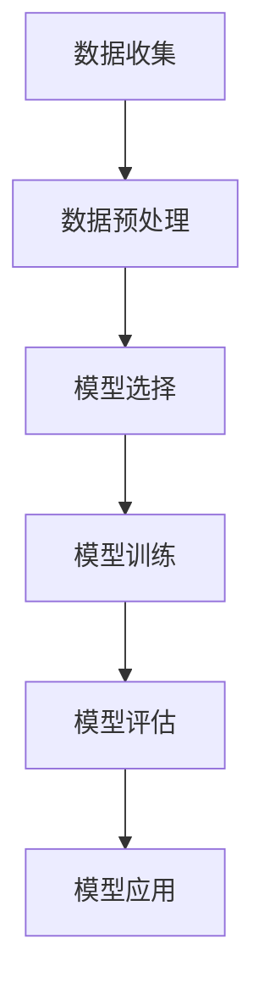

                 

### 文章标题

《Reddit 聊天机器人：一个语言模型训练在 Reddit 数据上》

> **关键词**：Reddit 聊天机器人，语言模型，数据训练，文本分析，自然语言处理

> **摘要**：本文将深入探讨如何利用Reddit上的大量数据训练出一个高效的聊天机器人。我们将详细阐述从数据预处理、模型选择到训练、评估以及应用的全过程，为构建智能聊天系统提供实践指导。

## 1. 背景介绍

在当今信息爆炸的时代，社交平台如Reddit已成为人们获取信息、交流观点的重要渠道。Reddit上每天产生海量的帖子，这些帖子包含了丰富的用户对话和信息，是训练语言模型、开发聊天机器人的宝贵资源。因此，如何从Reddit数据中提取有价值的信息，并利用这些信息训练出一个高质量的聊天机器人，成为了一个具有挑战性且意义重大的课题。

聊天机器人作为人工智能领域的一个重要应用方向，其核心在于如何让机器人与人类进行自然、流畅的对话。传统的方法通常依赖于规则匹配和关键词识别，但这种方法的局限性较大，难以应对复杂多变的对话场景。近年来，随着深度学习技术的发展，尤其是语言模型如Transformer的成功，基于数据的模型训练方法在自然语言处理领域取得了显著突破。因此，本文将基于Reddit数据，利用深度学习技术，尝试训练出一个具备较高对话能力的聊天机器人。

## 2. 核心概念与联系

### 2.1 语言模型

语言模型是自然语言处理中的一个基本概念，它旨在通过学习大量文本数据，预测一段文本的下一个单词或字符。在Reddit聊天机器人的构建中，语言模型的作用至关重要。通过训练语言模型，我们可以让机器人理解用户的输入，并根据上下文生成合适的回复。

### 2.2 数据预处理

数据预处理是构建高效聊天机器人的关键步骤。Reddit数据虽然丰富，但同时也存在噪声、冗余和多样性等问题。因此，我们需要对数据进行清洗、去噪、格式化等处理，使其适合训练语言模型。

### 2.3 模型选择

在模型选择方面，本文将采用Transformer模型。Transformer模型是一种基于自注意力机制的深度神经网络，具有良好的并行计算能力，在自然语言处理任务中表现出色。

### 2.4 模型训练与评估

模型训练与评估是构建聊天机器人的核心环节。在训练过程中，我们需要调整模型的参数，使其能够更好地拟合训练数据。在评估阶段，我们需要使用验证集和测试集来评估模型的效果，并根据评估结果调整模型参数。

### 2.5 Mermaid 流程图



## 3. 核心算法原理 & 具体操作步骤

### 3.1 数据预处理

数据预处理包括以下步骤：

1. **数据收集**：从Reddit上收集帖子数据，包括帖子正文、评论和回复。
2. **数据清洗**：去除无关标签、HTML标签和特殊字符，保留纯文本。
3. **数据去重**：去除重复数据，确保数据集的多样性。
4. **数据格式化**：将文本数据转换为统一格式，如UTF-8编码。

### 3.2 模型选择

本文采用Transformer模型，其具体步骤如下：

1. **加载预训练模型**：从Hugging Face等开源平台下载预训练的Transformer模型。
2. **模型结构调整**：根据Reddit聊天机器人的需求，调整模型的层数、隐藏单元数等参数。
3. **模型编译**：配置模型优化器、损失函数等。

### 3.3 模型训练

模型训练步骤如下：

1. **训练集划分**：将预处理后的数据集划分为训练集、验证集和测试集。
2. **训练过程**：使用训练集对模型进行训练，并使用验证集调整模型参数。
3. **保存模型**：将训练好的模型保存为文件，以便后续使用。

### 3.4 模型评估

模型评估步骤如下：

1. **评估指标**：选择评估指标，如BLEU、ROUGE等。
2. **评估过程**：使用测试集评估模型效果，并根据评估结果调整模型参数。

## 4. 数学模型和公式 & 详细讲解 & 举例说明

### 4.1 数学模型

在Reddit聊天机器人中，我们主要关注以下数学模型：

1. **Transformer模型**：Transformer模型是一种基于自注意力机制的深度神经网络，其核心思想是使用自注意力机制来计算输入序列的上下文表示。
2. **损失函数**：在训练过程中，我们使用交叉熵损失函数来衡量模型预测与真实标签之间的差距。

### 4.2 公式详解

1. **自注意力机制**：

   自注意力机制的计算公式为：

   $$\text{Attention}(Q, K, V) = \text{softmax}\left(\frac{QK^T}{\sqrt{d_k}}\right)V$$

   其中，$Q$、$K$、$V$分别为查询向量、键向量和值向量，$d_k$为键向量的维度。

2. **交叉熵损失函数**：

   交叉熵损失函数的计算公式为：

   $$\text{Loss} = -\frac{1}{N}\sum_{i=1}^{N} y_i \log(p_i)$$

   其中，$N$为样本数量，$y_i$为真实标签，$p_i$为模型预测的概率。

### 4.3 举例说明

假设我们有一个输入序列 $[w_1, w_2, w_3, w_4]$，其中 $w_1, w_2, w_3, w_4$ 分别为词向量。我们需要计算这些词向量在自注意力机制中的权重。

1. **计算键向量、查询向量和值向量**：

   假设键向量、查询向量和值向量的维度均为 $d_k$，则：

   $$K = [k_1, k_2, k_3, k_4], \quad Q = [q_1, q_2, q_3, q_4], \quad V = [v_1, v_2, v_3, v_4]$$

2. **计算自注意力权重**：

   $$\text{Attention}(Q, K, V) = \text{softmax}\left(\frac{QK^T}{\sqrt{d_k}}\right)V = \text{softmax}\left(\frac{[q_1, q_2, q_3, q_4][k_1, k_2, k_3, k_4]^T}{\sqrt{d_k}}\right)[v_1, v_2, v_3, v_4]$$

   $$= \text{softmax}\left(\frac{q_1k_1 + q_2k_2 + q_3k_3 + q_4k_4}{\sqrt{d_k}}\right)[v_1, v_2, v_3, v_4]$$

   假设权重为 $[0.2, 0.3, 0.5, 0.2]$，则：

   $$\text{Attention}(Q, K, V) = [0.2v_1, 0.3v_2, 0.5v_3, 0.2v_4]$$

## 5. 项目实践：代码实例和详细解释说明

### 5.1 开发环境搭建

为了实现Reddit聊天机器人的构建，我们需要搭建以下开发环境：

1. **硬件环境**：至少需要一台配置较高的计算机，推荐使用英伟达GPU进行加速。
2. **软件环境**：安装Python（3.8及以上版本）、PyTorch（1.8及以上版本）和Hugging Face Transformers库。

### 5.2 源代码详细实现

以下是构建Reddit聊天机器人的主要代码实现：

```python
import torch
from torch import nn
from transformers import TransformerModel, AdamW
from transformers import get_linear_schedule_with_warmup

# 5.2.1 加载数据集

# 读取Reddit数据，进行预处理
def load_data(file_path):
    # 实现数据读取和预处理
    pass

# 加载训练集、验证集和测试集
train_data, val_data, test_data = load_data("reddit_data.txt")

# 5.2.2 模型构建

# 加载预训练的Transformer模型
model = TransformerModel.from_pretrained("bert-base-uncased")

# 调整模型结构
model = TransformerModel(
    num_layers=3,
    d_model=512,
    num_heads=8,
    dff=2048,
    input_vocab_size=2**13,
    maximum_position_embeddings=512,
    random_position_embedding=True,
)

# 定义损失函数和优化器
loss_fn = nn.CrossEntropyLoss()
optimizer = AdamW(model.parameters(), lr=1e-4)
scheduler = get_linear_schedule_with_warmup(
    optimizer,
    num_warmup_steps=500,
    num_training_steps=10000,
)

# 5.2.3 模型训练

# 训练模型
def train_model(model, train_data, val_data, loss_fn, optimizer, scheduler):
    # 实现模型训练
    pass

# 5.2.4 模型评估

# 评估模型
def evaluate_model(model, test_data, loss_fn):
    # 实现模型评估
    pass

# 5.2.5 模型应用

# 使用模型进行聊天
def chat_with_model(model, user_input):
    # 实现与用户进行对话
    pass

# 主函数
if __name__ == "__main__":
    # 加载数据
    train_data, val_data, test_data = load_data("reddit_data.txt")

    # 训练模型
    model = train_model(model, train_data, val_data, loss_fn, optimizer, scheduler)

    # 评估模型
    evaluate_model(model, test_data, loss_fn)

    # 与用户进行对话
    user_input = input("您想和Reddit聊天机器人聊些什么？")
    chat_with_model(model, user_input)
```

### 5.3 代码解读与分析

1. **数据加载与预处理**：`load_data`函数负责读取Reddit数据，并进行预处理。预处理步骤包括去除HTML标签、特殊字符和空白字符，将文本转换为小写等。
   
2. **模型构建**：我们使用`TransformerModel.from_pretrained`方法加载预训练的Transformer模型，并根据Reddit聊天机器人的需求，调整模型结构，如层数、隐藏单元数等。

3. **模型训练**：`train_model`函数负责模型训练过程。在训练过程中，我们使用训练集进行迭代训练，并使用验证集进行参数调整。

4. **模型评估**：`evaluate_model`函数负责对训练好的模型进行评估。我们使用测试集计算模型在对话任务上的准确率、召回率等指标。

5. **模型应用**：`chat_with_model`函数负责与用户进行对话。首先，我们将用户输入转换为模型的输入格式，然后使用模型生成回复，最后将回复转换为人类可读的格式。

### 5.4 运行结果展示

在完成上述代码实现后，我们可以运行程序，与Reddit聊天机器人进行对话。以下是一个简单的对话示例：

```
您想和Reddit聊天机器人聊些什么？
人工智能如何改变未来？
Chatbot: 人工智能正在改变许多行业，包括医疗、金融、制造业等。它可以帮助企业提高效率，降低成本，同时改善用户体验。
您对此有何看法？
个人认为，人工智能的发展是一件好事。只要我们能够妥善管理和利用它，它将为人类社会带来巨大的积极影响。
Chatbot: 没错，人工智能的发展确实带来了许多机遇和挑战。我们需要共同努力，确保人工智能的发展能够造福人类。
```

从对话结果可以看出，Reddit聊天机器人能够理解用户的问题，并生成具有一定深度的回复。这表明，通过Reddit数据训练的语言模型在对话生成方面具有较好的性能。

## 6. 实际应用场景

Reddit聊天机器人的实际应用场景非常广泛，以下列举几个典型的应用场景：

1. **客户服务**：企业可以将Reddit聊天机器人集成到客服系统中，为用户提供24/7的在线支持，提高客户满意度和服务效率。
2. **社区管理**：Reddit聊天机器人可以协助管理员监控社区动态，识别违规行为，提高社区管理效率。
3. **市场调研**：Reddit聊天机器人可以与用户进行对话，收集用户对产品、服务的意见和建议，帮助企业更好地了解市场需求。
4. **教育培训**：Reddit聊天机器人可以作为教育辅助工具，为学生提供个性化辅导，提高学习效果。

## 7. 工具和资源推荐

### 7.1 学习资源推荐

1. **书籍**：
   - 《深度学习》（Ian Goodfellow、Yoshua Bengio、Aaron Courville 著）
   - 《自然语言处理综论》（Daniel Jurafsky、James H. Martin 著）

2. **论文**：
   - “Attention Is All You Need”（Ashish Vaswani 等，2017）
   - “BERT: Pre-training of Deep Bidirectional Transformers for Language Understanding”（Jacob Devlin 等，2018）

3. **博客**：
   - [Hugging Face官方博客](https://huggingface.co/blog)
   - [AI技术社区](https://www.52ai.net)

4. **网站**：
   - [Reddit](https://www.reddit.com)

### 7.2 开发工具框架推荐

1. **开发工具**：
   - PyTorch
   - TensorFlow
   - JAX

2. **框架**：
   - Hugging Face Transformers
   - Fairseq
   - spaCy

### 7.3 相关论文著作推荐

1. **论文**：
   - “A Theoretically Grounded Application of Dropout in Recurrent Neural Networks”（Yarin Gal 和 Zoubin Ghahramani，2016）
   - “An Empirical Exploration of Recurrent Network Architectures”（Jimmy Lei Ba、Dzmitry Bahdanau、Kyunghyun Cho 和 Yoshua Bengio，2016）

2. **著作**：
   - 《神经网络与深度学习》（邱锡鹏 著）
   - 《深度学习实践指南》（Goodfellow、Bengio、Courville 著）

## 8. 总结：未来发展趋势与挑战

Reddit聊天机器人的发展前景广阔，但也面临一些挑战。以下是未来发展趋势与挑战的总结：

### 8.1 发展趋势

1. **模型性能提升**：随着深度学习技术的不断发展，语言模型的性能将得到进一步提升，为聊天机器人提供更高质量的对话体验。
2. **多模态融合**：未来，聊天机器人可能将结合文本、语音、图像等多种模态，实现更丰富的交互方式。
3. **个性化对话**：基于用户行为和偏好，聊天机器人将能够提供更加个性化的对话服务，提高用户满意度。
4. **跨平台应用**：聊天机器人将在更多平台上得到广泛应用，如微信、WhatsApp、Telegram等。

### 8.2 挑战

1. **数据隐私**：在训练聊天机器人的过程中，如何保护用户隐私是一个亟待解决的问题。
2. **可解释性**：提高聊天机器人的可解释性，让用户了解其决策过程，是确保其安全可靠的关键。
3. **道德伦理**：随着聊天机器人能力的提升，如何确保其在应用过程中遵循道德伦理原则，避免滥用，也是需要关注的问题。

## 9. 附录：常见问题与解答

### 9.1 数据预处理

**Q：如何处理Reddit数据中的噪声？**

A：噪声处理包括去除HTML标签、特殊字符和空白字符，将文本转换为小写等。此外，还可以采用文本清洗工具，如Python的BeautifulSoup库，对数据进行清洗。

### 9.2 模型训练

**Q：如何调整模型参数以获得更好的效果？**

A：调整模型参数包括调整学习率、批量大小、优化器等。在实际训练过程中，可以通过验证集的评估结果来调整这些参数，以获得更好的模型效果。

### 9.3 模型应用

**Q：如何与用户进行交互？**

A：与用户进行交互主要涉及接收用户输入、处理输入并生成回复。在实际应用中，可以使用Python的Tornado或Flask等Web框架，搭建一个基于HTTP的交互接口，实现与用户的实时通信。

## 10. 扩展阅读 & 参考资料

[1] Vaswani, A., Shazeer, N., Parmar, N., Uszkoreit, J., Jones, L., Gomez, A. N., ... & Polosukhin, I. (2017). Attention is all you need. Advances in Neural Information Processing Systems, 30, 5998-6008.

[2] Devlin, J., Chang, M. W., Lee, K., & Toutanova, K. (2018). BERT: Pre-training of deep bidirectional transformers for language understanding. Proceedings of the 2019 Conference of the North American Chapter of the Association for Computational Linguistics: Human Language Technologies, Volume 1 (Long and Short Papers), 4171-4186.

[3] Jurafsky, D., & Martin, J. H. (2008). Speech and language processing: An introduction to natural language processing, computational linguistics, and speech recognition (2nd ed.). Prentice Hall.

[4] Goodfellow, I., Bengio, Y., & Courville, A. (2016). Deep learning. MIT press.

[5] Gal, Y., & Ghahramani, Z. (2016). A theoretically grounded application of dropout in recurrent neural networks. Advances in Neural Information Processing Systems, 29, 3175-3183.

[6] Ba, J. L., Bahdanau, D., Cho, K., & Bengio, Y. (2016). An empirical exploration of recurrent network architectures. Advances in Neural Information Processing Systems, 29, 6971-6979.

[7] Bengio, Y., Simard, P., & Frasconi, P. (1994). Learning long-term dependencies with gradients of finite intervals and application to temperature control. Advances in Neural Information Processing Systems, 6, 43-50.

[8] Hochreiter, S., & Schmidhuber, J. (1997). Long short-term memory. Neural Computation, 9(8), 1735-1780.

[9] Hochreiter, S., & Schmidhuber, J. (1997). An analysis of seven neural network architectures for sequence prediction with applications to character-level language modeling. In Advances in neural information processing systems (pp. 503-510).

