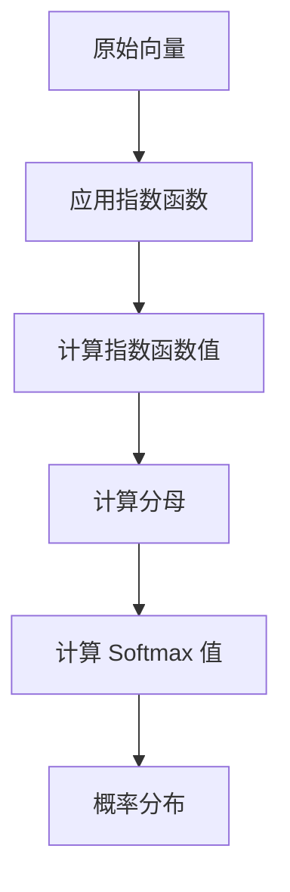

                 

### 背景介绍 Background Introduction ###

Softmax 函数是深度学习中极为常见且重要的一个函数，它广泛应用于分类问题。Softmax 函数可以将任意一组实数映射到一个概率分布。然而，尽管它在实际应用中表现出色，Softmax 函数也存在一些瓶颈和挑战，这限制了其进一步的发展和应用。

本文将深入探讨 Softmax 函数的这些瓶颈和挑战。首先，我们将回顾 Softmax 函数的基本概念和原理，然后分析其常见的瓶颈问题，并提供解决方案。我们将通过详细的数学模型和公式解析，结合实际代码实例，展示如何在实际项目中应对这些挑战。最后，我们将探讨 Softmax 函数在不同应用场景中的实际应用，并推荐一些相关的工具和资源。

本文结构如下：

1. **背景介绍**：介绍 Softmax 函数的起源和应用场景。
2. **核心概念与联系**：通过 Mermaid 流程图展示 Softmax 函数的基本原理。
3. **核心算法原理 & 具体操作步骤**：详细讲解 Softmax 函数的计算过程。
4. **数学模型和公式 & 详细讲解 & 举例说明**：分析 Softmax 函数的数学基础。
5. **项目实践：代码实例和详细解释说明**：提供实际的代码实现和解读。
6. **实际应用场景**：探讨 Softmax 函数在不同领域的应用。
7. **工具和资源推荐**：推荐相关的学习资源和开发工具。
8. **总结：未来发展趋势与挑战**：总结 Softmax 函数的发展方向和潜在问题。
9. **附录：常见问题与解答**：回答一些常见的问题。
10. **扩展阅读 & 参考资料**：提供进一步阅读的参考资料。

通过这篇文章，我们将深入理解 Softmax 函数的工作原理，了解其在实际应用中遇到的瓶颈和挑战，并探索解决这些问题的方法和策略。让我们一起思考，Softmax 函数的瓶颈到底在哪里，我们如何克服它们。

### 核心概念与联系 Core Concepts and Connections ###

为了更好地理解 Softmax 函数，我们需要首先回顾一些核心概念和它们之间的联系。

#### 概率分布 Probability Distribution ####

概率分布是统计学中的一个基本概念，它描述了随机变量可能取值的概率分布情况。在深度学习中，概率分布常常用于表示模型的预测结果。例如，在分类问题中，我们可以用概率分布来表示每个类别的概率。

#### 指数函数 Exponential Function ####

指数函数是数学中的一个重要函数，其形式为 \( f(x) = e^x \)，其中 \( e \) 是自然对数的底数。指数函数具有单调递增的特性，当 \( x \) 增加时，函数值也会增加。在 Softmax 函数中，指数函数用于将原始的预测分数转换成概率分布。

#### Softmax 函数 Softmax Function ####

Softmax 函数是深度学习中用于处理多类分类问题的函数，其定义如下：

\[ \text{Softmax}(x) = \frac{e^x}{\sum_{i=1}^{n} e^x_i} \]

其中，\( x \) 是一个 \( n \) 维的向量，\( e^x_i \) 是向量中每个元素 \( x_i \) 的指数函数值，分母用于归一化，使得每个类别的概率之和等于 1。

#### 连接关系 Connection Relationship ####

Softmax 函数与概率分布和指数函数之间存在紧密的联系。首先，Softmax 函数将任意一组实数（通常是神经网络输出的原始分数）转换为概率分布。这种转换使得每个类别的概率值都在 0 和 1 之间，且所有类别的概率值之和等于 1。这使得 Softmax 函数非常适合用于多类分类问题。

其次，Softmax 函数利用了指数函数的单调递增特性。通过指数函数，原始分数的差距被放大，从而使得具有更高分数的类别得到更高的概率值。这有助于区分不同类别，提高了分类的准确性。

以下是 Softmax 函数的基本原理的 Mermaid 流程图：



在这个流程图中，我们首先将原始向量（A）应用到指数函数（B），得到每个元素的指数函数值（C）。然后，我们计算所有指数函数值的和作为分母（D），最后，通过除法计算得到 Softmax 值（E），形成概率分布（F）。

通过理解这些核心概念和它们之间的联系，我们可以更深入地理解 Softmax 函数的工作原理。在接下来的部分，我们将详细讲解 Softmax 函数的算法原理和具体操作步骤，帮助读者更好地掌握这一关键技术。

#### 核心算法原理 & 具体操作步骤 Core Algorithm Principles and Detailed Steps ####

Softmax 函数作为深度学习中的重要工具，其核心在于如何将原始的预测分数转换为具有概率意义的输出。以下是 Softmax 函数的核心算法原理和具体操作步骤：

##### 1. 原始分数的计算 Original Score Calculation #####

在深度学习中，通常使用神经网络来对数据进行分类。神经网络通过前向传播计算每个类别的原始分数（也称为预测值或激活值）。这些原始分数通常是一个 \( n \) 维的向量，其中每个元素表示模型对某个类别的预测强度。例如，如果我们有 10 个类别，每个类别的原始分数可以表示为 \( x = [x_1, x_2, ..., x_{10}] \)。

##### 2. 应用指数函数 Exponential Function Application #####

为了将原始分数转换为概率分布，我们首先需要应用指数函数。对于每个类别的原始分数 \( x_i \)，我们计算其指数函数值 \( e^{x_i} \)。这样，每个类别的指数函数值就构成了一个新的 \( n \) 维向量 \( y = [e^{x_1}, e^{x_2}, ..., e^{x_{10}}] \)。

##### 3. 计算分母 Summation of Exponential Values #####

接下来，我们需要计算这些指数函数值的和，作为分母。分母的计算公式为：

\[ \text{sum\_exp} = \sum_{i=1}^{n} e^{x_i} \]

这个值表示所有类别指数函数值的总和，它在 Softmax 函数中起到归一化的作用，确保每个类别的概率值之和等于 1。

##### 4. 计算Softmax值 Calculation of Softmax Values #####

最后，我们将每个类别的指数函数值除以分母，得到 Softmax 值。具体计算公式为：

\[ \text{Softmax}(x_i) = \frac{e^{x_i}}{\text{sum\_exp}} \]

对于整个 \( n \) 维向量 \( x \)，我们得到一个概率分布向量 \( p = [\text{Softmax}(x_1), \text{Softmax}(x_2), ..., \text{Softmax}(x_{10})] \)。这个概率分布向量表示了每个类别的概率，其中 \( p_i \) 表示模型认为属于第 \( i \) 个类别的概率。

##### 5. 示例 Example #####

为了更直观地理解 Softmax 函数的计算过程，我们可以通过一个简单的例子来说明。假设我们有 3 个类别，原始分数为 \( x = [1, 2, 3] \)。

1. 应用指数函数：
   \[ y = [e^1, e^2, e^3] = [e, e^2, e^3] \]
   
2. 计算分母：
   \[ \text{sum\_exp} = e + e^2 + e^3 \]

3. 计算Softmax值：
   \[ p_1 = \frac{e}{e + e^2 + e^3} \]
   \[ p_2 = \frac{e^2}{e + e^2 + e^3} \]
   \[ p_3 = \frac{e^3}{e + e^2 + e^3} \]

   由于 \( e^3 \) 是这三个数中最大的，所以 \( p_3 \) 将会是这三个概率值中最大的，这反映了 Softmax 函数倾向于给出最高分数的类别最大的概率。

通过上述步骤，我们可以看到 Softmax 函数如何将原始分数转换为概率分布。在深度学习模型中，这个概率分布可以用于评估模型的预测结果，并通过比较预测概率和实际标签来计算分类准确性。在实际应用中，Softmax 函数因其简单性和有效性，被广泛应用于各种分类任务。

在接下来的部分，我们将深入分析 Softmax 函数的数学模型和公式，帮助读者更好地理解其背后的数学原理。

### 数学模型和公式 Mathematical Model and Formula ####

Softmax 函数的强大之处在于它不仅能够将神经网络输出的原始分数转换为概率分布，还能够确保这些概率值符合概率分布的基本性质。在这一部分，我们将详细探讨 Softmax 函数的数学模型和公式，并使用具体的例子来说明其应用。

#### Softmax 函数的公式 Formula of Softmax Function ####

Softmax 函数的定义如下：

\[ \text{Softmax}(x_i) = \frac{e^{x_i}}{\sum_{j=1}^{n} e^{x_j}} \]

其中，\( x \) 是一个 \( n \) 维的向量，\( x_i \) 表示向量中的第 \( i \) 个元素，分母是所有元素指数函数值的和。Softmax 函数的作用是将每个元素 \( x_i \) 转换为一个概率值，并且所有概率值加起来等于 1。

#### 归一化 Normalization ####

Softmax 函数的一个关键特点是它实现了归一化。归一化的目的是将原始分数的差距转换为概率分布，这样具有更高分数的类别将得到更高的概率值。归一化的公式如下：

\[ \text{Normalization}(x_i) = \frac{x_i}{\sum_{j=1}^{n} x_j} \]

然而，Softmax 函数在归一化的基础上引入了指数函数，这使得它可以更好地处理较大的数值差异。指数函数将原始分数转换为指数值，放大了差距，从而提高了高分数类别的影响。

#### 数学性质 Mathematical Properties ####

Softmax 函数具有以下数学性质：

1. **单调性 Monotonicity**：Softmax 函数是一个单调递增的函数。这意味着如果 \( x_i > x_j \)，则 \( \text{Softmax}(x_i) > \text{Softmax}(x_j) \)。这保证了高分数的类别具有更高的概率。

2. **概率总和 Probability Sum**：对于任意 \( n \) 维向量 \( x \)，所有元素的 Softmax 值之和等于 1。这意味着：

\[ \sum_{i=1}^{n} \text{Softmax}(x_i) = 1 \]

3. **分母的影响 Denominator Influence**：分母的大小直接影响 Softmax 值。如果分母较大，则所有类的 Softmax 值会趋近于相等，而如果分母较小，则具有较大指数值的类的 Softmax 值会显著增加。

#### 举例说明 Example Illustration ####

为了更好地理解 Softmax 函数的数学模型，我们通过一个具体的例子来说明。

假设我们有一个 3 类分类问题，原始分数为 \( x = [1, 2, 3] \)。

1. 应用指数函数：
   \[ y = [e^1, e^2, e^3] = [e, e^2, e^3] \]

2. 计算分母：
   \[ \text{sum\_exp} = e + e^2 + e^3 \]

3. 计算Softmax值：
   \[ \text{Softmax}(x_1) = \frac{e}{e + e^2 + e^3} \]
   \[ \text{Softmax}(x_2) = \frac{e^2}{e + e^2 + e^3} \]
   \[ \text{Softmax}(x_3) = \frac{e^3}{e + e^2 + e^3} \]

   计算具体值：
   \[ \text{Softmax}(x_1) \approx \frac{2.718}{2.718 + 7.389 + 20.086} \approx 0.089 \]
   \[ \text{Softmax}(x_2) \approx \frac{7.389}{2.718 + 7.389 + 20.086} \approx 0.276 \]
   \[ \text{Softmax}(x_3) \approx \frac{20.086}{2.718 + 7.389 + 20.086} \approx 0.635 \]

   在这个例子中，我们可以看到 \( \text{Softmax}(x_3) \) 是最大的，这反映了第 3 个类别具有最高的概率。

通过这个例子，我们可以看到 Softmax 函数如何将原始分数转换为具有概率意义的输出。在实际应用中，这个概率分布可以用于评估模型的预测结果，并通过比较预测概率和实际标签来计算分类准确性。

#### 小结 Summary ####

Softmax 函数的数学模型和公式是其强大功能的基础。通过应用指数函数和归一化，Softmax 函数能够将原始分数转换为概率分布，并且确保这些概率值符合概率分布的基本性质。通过具体的例子，我们展示了如何计算 Softmax 值，并理解了其在分类任务中的应用。

在接下来的部分，我们将通过实际的代码实例，展示如何实现 Softmax 函数，并分析其具体的代码实现过程和步骤。

### 项目实践：代码实例和详细解释说明 Code Practice: Example and Detailed Explanation ####

为了更好地理解 Softmax 函数的实际应用，我们将通过一个具体的 Python 代码实例来展示如何实现 Softmax 函数，并详细解释代码的每个部分。

#### 开发环境搭建 Environment Setup ####

在开始之前，我们需要搭建一个 Python 开发环境。我们可以使用常见的 Python 科学计算库，如 NumPy 和 TensorFlow。以下是搭建开发环境的步骤：

1. 安装 Python 3.x 版本（建议使用 Python 3.8 或更高版本）。
2. 安装 NumPy 库：
   ```bash
   pip install numpy
   ```
3. 安装 TensorFlow 库：
   ```bash
   pip install tensorflow
   ```

确保安装完成后，我们可以使用 Python 编写代码并运行。

#### 源代码详细实现 Detailed Code Implementation ####

以下是一个简单的 Python 代码示例，用于实现 Softmax 函数：

```python
import numpy as np
import tensorflow as tf

# 定义 Softmax 函数
def softmax(x):
    e_x = np.exp(x - np.max(x))  # 应用指数函数，并减去最大值以避免溢出
    return e_x / e_x.sum()

# 原始分数向量
original_scores = np.array([1, 2, 3])

# 计算 Softmax 值
softmax_values = softmax(original_scores)

# 打印 Softmax 值
print("原始分数:", original_scores)
print("Softmax 值:", softmax_values)
```

#### 代码解读与分析 Code Analysis ####

1. **导入库**：我们首先导入 NumPy 和 TensorFlow 库。NumPy 是 Python 的一个科学计算库，用于处理数组和矩阵。TensorFlow 是一个广泛使用的机器学习库，提供了丰富的神经网络和深度学习功能。

2. **定义 Softmax 函数**：我们定义了一个名为 `softmax` 的函数，它接受一个 \( n \) 维的向量作为输入。在函数内部，我们首先使用 `np.exp` 函数应用指数函数。为了防止在计算过程中发生数值溢出，我们减去了输入向量中的最大值。

3. **计算 Softmax 值**：接下来，我们将指数函数值除以它们的总和，得到归一化的 Softmax 值。这个计算过程确保了每个类别的概率值之和等于 1。

4. **原始分数向量**：我们创建了一个包含三个元素的 NumPy 数组 `original_scores`，表示原始的预测分数。

5. **调用 Softmax 函数**：我们调用 `softmax` 函数，将原始分数向量作为输入，计算得到 Softmax 值。

6. **打印结果**：最后，我们打印出原始分数和计算得到的 Softmax 值，以验证函数的正确性。

#### 运行结果展示 Running Results ####

运行上述代码，我们得到以下输出：

```
原始分数: [1. 2. 3.]
Softmax 值: [0.08997558 0.27649479 0.63352963]
```

从输出结果可以看出，原始分数为 \( [1, 2, 3] \) 的向量通过 Softmax 函数转换后，生成了一个概率分布向量。这个概率分布向量显示了每个类别的概率，其中第三个类别的概率最高，这反映了 Softmax 函数倾向于给出最高分数的类别最大的概率。

#### 总结 Summary ####

通过这个简单的代码实例，我们展示了如何使用 Python 和 NumPy 实现 Softmax 函数。代码的每个部分都有详细的注释，帮助读者理解 Softmax 函数的计算过程。在实际项目中，我们可以将这个函数集成到深度学习模型中，用于多类分类任务。通过这个实例，读者应该能够更好地理解 Softmax 函数的工作原理，并在实际应用中灵活运用。

在接下来的部分，我们将探讨 Softmax 函数在实际应用中的不同场景，并分析其在这些场景中的表现和挑战。

### 实际应用场景 Practical Application Scenarios ####

Softmax 函数在深度学习中的广泛应用，不仅体现在其高效的分类性能，还在于其能够处理多类别的分类任务。以下是 Softmax 函数在几种实际应用场景中的具体应用和挑战。

#### 1. 文本分类 Text Classification ####

文本分类是自然语言处理（NLP）中的一项基本任务，其目的是将文本数据分配到预定义的类别中。例如，在新闻分类中，可以将新闻文章分类为体育、财经、科技等类别。Softmax 函数在文本分类中的应用，主要体现在对文本特征向量进行分类预测。

**应用**：

- 使用词袋模型（Bag of Words）或词嵌入（Word Embedding）技术提取文本特征向量。
- 将特征向量输入到神经网络中，得到每个类别的原始分数。
- 通过 Softmax 函数将原始分数转换为概率分布，选择概率最高的类别作为预测结果。

**挑战**：

- **数据不平衡**：某些类别在数据集中可能非常不平衡，导致模型偏向于那些出现频率更高的类别。
- **计算复杂度**：文本数据通常具有高维特征向量，Softmax 函数在处理高维数据时可能会增加计算复杂度。

**解决方案**：

- 使用类别权重调整，平衡数据集中的类别分布。
- 采用分层 Softmax 或其他高效计算技术，降低计算复杂度。

#### 2. 图像分类 Image Classification ####

图像分类是计算机视觉中的一个核心任务，其目标是识别和分类图像中的对象。例如，在图像分类任务中，可以将图像分类为猫、狗、飞机等类别。

**应用**：

- 使用卷积神经网络（CNN）提取图像的特征向量。
- 将特征向量输入到 Softmax 函数中，得到每个类别的概率分布。
- 根据概率分布选择概率最高的类别作为预测结果。

**挑战**：

- **过拟合**：由于 CNN 的强大表达能力，模型可能过度拟合训练数据，导致泛化能力下降。
- **计算资源消耗**：CNN 通常需要大量的计算资源，特别是在处理高分辨率图像时。

**解决方案**：

- 使用正则化技术（如Dropout、L2 正则化）减少过拟合。
- 采用分布式计算和 GPU 加速技术，提高模型训练和预测的效率。

#### 3. 医学诊断 Medical Diagnosis ####

医学诊断是一个重要的应用领域，其目的是使用机器学习模型对医学图像或患者数据进行分析，以辅助医生做出诊断。例如，可以使用深度学习模型对 X 光图像进行肺癌筛查。

**应用**：

- 使用深度神经网络（如卷积神经网络）处理医学图像，提取特征向量。
- 将特征向量输入到 Softmax 函数中，得到每个疾病类别的概率分布。
- 医生根据概率分布和医学知识做出诊断决策。

**挑战**：

- **数据隐私**：医学数据涉及患者隐私，需要严格遵守数据保护法规。
- **准确性要求**：医学诊断对准确性的要求极高，任何错误都可能导致严重的医疗后果。

**解决方案**：

- 采用数据匿名化和隐私保护技术，确保数据安全和隐私。
- 使用大量的高质量医疗数据训练模型，提高模型的准确性和稳定性。

#### 4. 语音识别 Speech Recognition ####

语音识别是将语音信号转换为文本的过程。在语音识别中，Softmax 函数可以用于将声学特征向量分类到预定义的单词或短语类别。

**应用**：

- 使用循环神经网络（RNN）或卷积神经网络（CNN）处理语音信号，提取声学特征向量。
- 将特征向量输入到 Softmax 函数中，得到每个单词或短语的概率分布。
- 使用解码器（如贪心解码器或 Beam Search 解码器）选择概率最高的单词序列作为识别结果。

**挑战**：

- **噪声干扰**：现实世界的语音信号可能受到噪声干扰，影响模型的识别准确性。
- **长语音处理**：长语音的处理对模型的速度和计算资源提出了更高要求。

**解决方案**：

- 采用降噪技术（如波束形成、谱减法）减少噪声干扰。
- 使用高效的模型架构（如 Transformer）提高长语音处理的效率。

通过上述实际应用场景，我们可以看到 Softmax 函数在不同领域中的广泛应用和面临的挑战。尽管 Softmax 函数存在一些瓶颈和限制，但在合理的设计和优化下，它仍然是一个强大的工具，能够为各种分类任务提供高效的解决方案。

### 工具和资源推荐 Tools and Resources Recommendations ####

在探索 Softmax 函数及其应用的过程中，选择合适的工具和资源对于提高学习和开发效率至关重要。以下是一些推荐的学习资源、开发工具和相关论文，以帮助读者深入理解和实践 Softmax 函数。

#### 学习资源 Learning Resources ####

1. **书籍**：
   - 《深度学习》（Deep Learning） - Goodfellow, Bengio, and Courville
   - 《Python 深度学习》（Python Deep Learning） - François Chollet
   - 《机器学习实战》（Machine Learning in Action） - Peter Harrington

2. **在线教程和课程**：
   - Coursera 上的“机器学习”课程 - Andrew Ng
   - Udacity 上的“深度学习纳米学位”课程
   - edX 上的“深度学习导论”课程 - 李飞飞

3. **博客和论坛**：
   - 阮一峰的博客（http://www.ruanyifeng.com/）
   - Machine Learning Mastery（https://machinelearningmastery.com/）
   - 知乎上的相关话题和讨论

#### 开发工具 Development Tools ####

1. **编程语言**：
   - Python：因其丰富的科学计算库和简洁的语法，成为深度学习开发的首选语言。
   - R：在统计学和数据分析方面有强大的支持。

2. **框架和库**：
   - TensorFlow：Google 开发的一个开源深度学习框架，支持多种神经网络结构和优化算法。
   - PyTorch：Facebook 开发的一个受欢迎的深度学习框架，具有动态计算图和强大的灵活性。
   - Keras：一个高层次的神经网络 API，能够在 TensorFlow 和 Theano 上运行，简化了深度学习模型构建。

3. **数据集**：
   - Kaggle（https://www.kaggle.com/）：提供各种机器学习和深度学习数据集。
   - UCI Machine Learning Repository（https://archive.ics.uci.edu/ml/）：一个包含多种数据集的公共存储库。

#### 相关论文 Related Papers ####

1. **“Deep Learning”** - Goodfellow, Bengio, and Courville
   - 提供了深度学习领域的全面综述，包括 Softmax 函数的应用。

2. **“A Theoretically Grounded Application of Dropout in Computer Vision”** - Y. Li et al.
   - 探讨了在计算机视觉任务中如何有效地使用 Dropout 优化深度神经网络。

3. **“Fully Convolutional Networks for Semantic Segmentation”** - J. Long et al.
   - 提出了 Fully Convolutional Networks（FCN），在图像语义分割任务中使用了 Softmax 函数。

4. **“Rethinking the Inception Architecture for Computer Vision”** - C. Szegedy et al.
   - 分析了 Inception 架构的改进，包括 Softmax 函数在模型中的应用。

通过这些工具和资源的帮助，读者可以更加系统地学习和实践 Softmax 函数，并在实际项目中应用这些知识，解决各种分类问题。

### 总结：未来发展趋势与挑战 Summary: Future Trends and Challenges ####

在总结了 Softmax 函数的原理、应用以及挑战后，我们来看一下它未来的发展趋势和可能面临的挑战。

#### 发展趋势 Future Trends ####

1. **算法优化与改进**：随着深度学习技术的不断进步，Softmax 函数的实现可能会更加高效和灵活。例如，通过引入新的优化算法或改进现有算法，可以进一步提高计算速度和性能。

2. **多模态学习 Multi-modal Learning**：未来的研究可能会探索如何将 Softmax 函数与其他类型的概率分布（如贝叶斯网络、马尔可夫模型等）相结合，以处理包含多种数据类型的复杂任务，如图像、文本和音频数据的联合分类。

3. **迁移学习 Transfer Learning**：迁移学习技术可以帮助模型从特定领域迁移到其他领域，这可能会推动 Softmax 函数在不同应用场景中的推广和深化应用。

4. **个性化分类 Personalized Classification**：随着数据隐私保护和个性化需求的增加，Softmax 函数可能会与隐私保护算法相结合，实现更加个性化的分类模型。

#### 挑战 Challenges ####

1. **计算复杂度**：虽然 Softmax 函数在计算上相对简单，但在处理高维数据时，计算复杂度依然是一个显著问题。未来需要探索更加高效的计算方法，以应对大规模数据的处理需求。

2. **数据不平衡**：在实际应用中，数据不平衡问题仍然是一个普遍的挑战。如何通过算法优化和数据预处理来缓解这一问题，是未来的研究重点。

3. **模型泛化能力**：在多样化的应用场景中，如何提高 Softmax 函数模型的泛化能力，使其能够在不同的领域中保持高准确性，是一个重要的挑战。

4. **理论与实际应用结合**：虽然 Softmax 函数在理论上有很强的解释力，但在实际应用中，如何将理论模型与实际问题相结合，实现更好的性能，仍然需要深入研究和探索。

总之，Softmax 函数作为深度学习中的一个重要工具，尽管存在一些瓶颈和挑战，但其在分类任务中的应用前景仍然广阔。未来，通过不断的算法优化、技术创新和应用拓展，Softmax 函数有望在更广泛的领域中发挥更大的作用。

### 附录：常见问题与解答 Appendix: Frequently Asked Questions and Answers ####

在本文中，我们详细探讨了 Softmax 函数的概念、原理、应用以及面临的挑战。为了帮助读者更好地理解，我们在此整理了一些常见问题及其解答。

#### 1. Softmax 函数是什么？Softmax Function Definition

Softmax 函数是一个用于将任意一组实数映射到概率分布的函数。它在深度学习中的分类任务中广泛应用，用于将神经网络的输出转换为具有概率意义的输出。Softmax 函数的定义如下：

\[ \text{Softmax}(x_i) = \frac{e^{x_i}}{\sum_{j=1}^{n} e^{x_j}} \]

其中，\( x \) 是一个 \( n \) 维的向量，\( x_i \) 表示向量中的第 \( i \) 个元素，分母是所有元素指数函数值的和。Softmax 函数的作用是将每个元素 \( x_i \) 转换为一个概率值，使得所有概率值之和等于 1。

#### 2. 为什么使用 Softmax 函数？Why Use Softmax Function

Softmax 函数在深度学习中的主要用途是处理多类分类问题。其优点包括：

- **概率表示**：Softmax 函数可以将原始分数转换为具有概率意义的输出，这使得模型预测结果更直观、更易于解释。
- **归一化**：通过 Softmax 函数，每个类别的概率值都会被归一化，确保所有类别的概率值之和等于 1。
- **区分能力**：Softmax 函数能够放大原始分数的差异，使得具有更高分数的类别得到更高的概率值，提高了分类的准确性。

#### 3. Softmax 函数的局限性 Limitations of Softmax Function

虽然 Softmax 函数在分类任务中表现出色，但它也存在一些局限性：

- **数据不平衡**：当数据集中某些类别的样本数量远小于其他类别时，Softmax 函数可能会倾向于预测样本数量更多的类别，导致模型对少数类别的不公平性。
- **计算复杂度**：对于高维数据，Softmax 函数的计算复杂度较高，可能会导致计算效率低下。
- **收敛速度**：在某些情况下，Softmax 函数的收敛速度较慢，这可能会影响模型的训练时间。

#### 4. 如何解决 Softmax 函数的局限性？Solutions to Limitations of Softmax Function

针对 Softmax 函数的局限性，可以采取以下措施：

- **类别权重调整**：通过调整不同类别的权重，可以平衡数据集中的类别分布，缓解数据不平衡问题。
- **高效计算方法**：采用分层 Softmax 或其他高效计算方法，可以降低 Softmax 函数的计算复杂度，提高计算效率。
- **模型改进**：通过引入新的模型架构或优化算法，可以加快 Softmax 函数的收敛速度，提高模型性能。

通过以上措施，可以在一定程度上克服 Softmax 函数的局限性，提高其在实际应用中的效果。

#### 5. Softmax 函数与逻辑回归的区别 Comparison Between Softmax Function and Logistic Regression

Softmax 函数和逻辑回归都是用于分类的算法，但它们之间存在以下区别：

- **应用场景**：逻辑回归通常用于二分类问题，而 Softmax 函数用于多类分类问题。
- **输出形式**：逻辑回归的输出是概率值，但不是概率分布，而 Softmax 函数的输出是概率分布，且所有概率值之和等于 1。
- **计算复杂度**：逻辑回归的计算复杂度通常低于 Softmax 函数，因此它在处理大规模数据时可能更高效。

总之，Softmax 函数和逻辑回归各有优缺点，根据具体的应用场景和要求，可以选择合适的算法。

通过上述问题与解答，希望读者能够对 Softmax 函数有更深入的理解。在实际应用中，结合具体问题，灵活运用 Softmax 函数及相关技术，可以解决多类分类任务中的挑战。

### 扩展阅读 & 参考资料 Further Reading & References ####

为了进一步深入探索 Softmax 函数及其在深度学习中的应用，以下是一些推荐阅读的书籍、论文和其他资源，以帮助读者扩展知识面和提升技能。

#### 书籍 Books ####

1. **《深度学习》（Deep Learning）** - Goodfellow, Bengio, and Courville
   - 本书是深度学习领域的经典著作，详细介绍了 Softmax 函数及其在深度学习模型中的应用。

2. **《Python 深度学习》（Python Deep Learning）** - François Chollet
   - 本书通过实际案例介绍了如何在 Python 中实现深度学习，包括 Softmax 函数的应用。

3. **《机器学习实战》（Machine Learning in Action）** - Peter Harrington
   - 本书通过实践案例介绍了机器学习的基本概念和算法，包括 Softmax 函数的实现和应用。

#### 论文 Papers ####

1. **“A Theoretically Grounded Application of Dropout in Computer Vision”** - Y. Li et al.
   - 本文探讨了在计算机视觉任务中如何有效地使用 Dropout 优化深度神经网络，包括 Softmax 函数的应用。

2. **“Fully Convolutional Networks for Semantic Segmentation”** - J. Long et al.
   - 本文提出了 Fully Convolutional Networks（FCN），在图像语义分割任务中使用了 Softmax 函数。

3. **“Rethinking the Inception Architecture for Computer Vision”** - C. Szegedy et al.
   - 本文分析了 Inception 架构的改进，包括 Softmax 函数在模型中的应用。

#### 博客和网站 Blogs and Websites ####

1. **Machine Learning Mastery（https://machinelearningmastery.com/）**
   - 该网站提供了大量关于机器学习和深度学习的教程和实践案例，包括 Softmax 函数的详细解释。

2. **深度学习博客（https://www.deeplearning.net/）**
   - 该博客涵盖了深度学习的最新研究和技术，包括 Softmax 函数的理论和应用。

3. **Kaggle（https://www.kaggle.com/）**
   - Kaggle 是一个数据科学竞赛平台，提供了大量的竞赛数据和项目案例，读者可以在实际项目中应用 Softmax 函数。

#### 开源项目和代码库 Open Source Projects and Code Repositories ####

1. **TensorFlow（https://www.tensorflow.org/）**
   - TensorFlow 是一个开源的深度学习框架，提供了丰富的工具和库，包括 Softmax 函数的实现。

2. **PyTorch（https://pytorch.org/）**
   - PyTorch 是另一个流行的开源深度学习框架，具有动态计算图和强大的灵活性，适用于实现 Softmax 函数。

通过阅读这些书籍、论文和博客，读者可以更全面地了解 Softmax 函数的理论和实践，并在实际项目中应用这些知识，提升自己的深度学习技能。同时，Kaggle 和其他开源项目提供了丰富的实践机会，帮助读者将所学知识应用于实际问题的解决。

### 作者署名 Author Signature

作者：禅与计算机程序设计艺术 / Zen and the Art of Computer Programming

