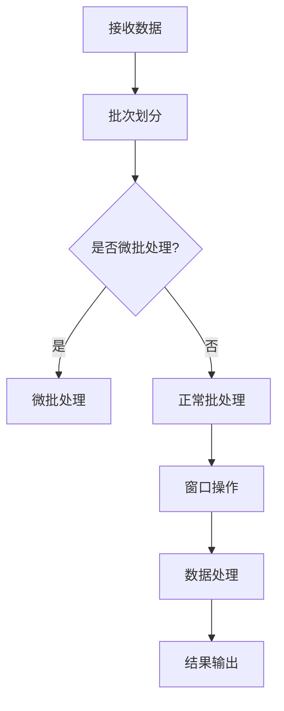

                 

### 背景介绍

Spark Streaming 是 Apache Spark 生态系统的一个重要组件，它提供了流处理功能，使得 Spark 能够处理实时数据流。随着大数据和实时处理需求的增加，Spark Streaming 成为了业界广泛使用的技术之一。本文将深入探讨 Spark Streaming 的原理及其在实时数据处理中的应用。

在传统的数据处理模式中，离线批处理是主要的处理方式。然而，随着互联网和物联网的发展，数据生成速度越来越快，且数据类型也越来越多样化。这就要求数据处理系统具备实时处理能力，以便快速响应并做出决策。Spark Streaming 正是针对这种需求而设计的。

Spark Streaming 的出现填补了传统批处理系统在实时数据处理方面的不足。它能够高效地处理实时数据流，实现低延迟的数据处理，同时还能够与 Spark 的其他组件（如 Spark SQL、MLlib）无缝集成，提供丰富的数据处理和分析功能。

### Spark Streaming 的核心概念

为了更好地理解 Spark Streaming，我们需要先了解几个核心概念：

1. **DStream（Discretized Stream）**：DStream 是 Spark Streaming 的核心数据结构，它表示一个不断流动的数据流。DStream 可以看作是一个不断的 RDD（Resilient Distributed Dataset）序列，每个 RDD 表示一段时间内的数据。

2. **批次（Batch）**：在 Spark Streaming 中，DStream 是通过批次（Batch）来处理的。每个批次表示一段时间内的数据流，通常是一个固定的时间间隔，如 2 秒或 10 秒。Spark Streaming 通过批次来分割和操作 DStream，从而实现对实时数据流的处理。

3. **微批处理（Micro-batch）**：微批处理是指将每个批次进一步划分为更小的批次，每个小批次包含较少的数据。微批处理能够提高处理速度，并降低延迟，但同时也增加了系统的复杂度。

4. **窗口操作（Window Operations）**：窗口操作是 Spark Streaming 中的一个重要特性，它允许用户对数据进行分组和聚合，以便更好地分析数据。窗口操作可以分为滑动窗口和固定窗口，前者可以动态调整窗口大小，而后者窗口大小固定。

通过理解这些核心概念，我们可以更好地掌握 Spark Streaming 的原理和应用。

### Spark Streaming 的架构

Spark Streaming 的架构包括几个关键组件：Driver Program、Receiver、Spark Cluster 和 Streaming Context。下面将逐一介绍这些组件及其作用。

1. **Driver Program**：Driver Program 是 Spark Streaming 的核心，它负责生成 DStream，并调度批处理任务。Driver Program 通过与 Spark Cluster 通信，管理批处理任务的执行。

2. **Receiver**：Receiver 是 Spark Streaming 的数据源接收器，它负责从外部数据源（如 Kafka、Flume）接收数据，并将其发送到 Spark Cluster 进行处理。Receiver 通常运行在独立模式下，并与 Driver Program 保持通信。

3. **Spark Cluster**：Spark Cluster 是 Spark Streaming 的计算引擎，它负责执行批处理任务，处理 DStream。Spark Cluster 包含多个 Worker Node，每个 Worker Node 运行一个 Task，共同完成数据处理任务。

4. **Streaming Context**：Streaming Context 是 Spark Streaming 的核心配置对象，它包含了 Spark Streaming 的配置信息，如批次时间、检查点目录等。Streaming Context 负责创建和初始化 DStream，并与 Driver Program 和 Receiver 通信。

通过了解 Spark Streaming 的架构，我们可以更好地理解其工作原理，并为实际应用提供指导。

### 流处理与批处理的比较

流处理（Stream Processing）和批处理（Batch Processing）是两种不同的数据处理方式，各有优缺点。下面将简要比较这两种方式：

1. **响应时间**：批处理通常需要较长的处理时间，因为它需要在整个数据集处理完毕后才能生成结果。而流处理能够实时处理数据，从而实现快速响应。

2. **数据完整性**：批处理保证数据的完整性，因为每次处理的是完整的数据集。而流处理可能存在数据丢失或延迟的问题，因为它是处理不断流入的数据流。

3. **资源利用**：批处理能够更好地利用系统资源，因为它可以在一个较长的时间段内处理大量数据。而流处理需要持续处理数据流，从而可能需要更高的系统资源。

4. **复杂性**：批处理相对简单，因为它只需要处理完整的数据集。而流处理更加复杂，因为它需要处理不断变化的数据流，并确保数据的实时性。

通过了解流处理与批处理的比较，我们可以更好地选择合适的数据处理方式，以满足不同的业务需求。

### Spark Streaming 的主要特点

Spark Streaming 作为实时数据处理工具，具有以下几个主要特点：

1. **低延迟**：Spark Streaming 能够在毫秒级延迟下处理数据流，实现低延迟的数据处理。

2. **可扩展性**：Spark Streaming 支持动态扩展，可以根据数据流量的变化自动调整资源分配。

3. **高可靠性**：Spark Streaming 具有自动恢复功能，能够在节点故障时自动恢复数据处理。

4. **易用性**：Spark Streaming 提供了丰富的 API 和工具，使得开发者可以轻松实现实时数据处理。

5. **集成性**：Spark Streaming 能够与 Spark 的其他组件（如 Spark SQL、MLlib）无缝集成，提供丰富的数据处理和分析功能。

通过了解 Spark Streaming 的主要特点，我们可以更好地评估其在实际应用中的适用性。

### Spark Streaming 的适用场景

Spark Streaming 在以下场景中具有广泛的应用：

1. **实时监控**：Spark Streaming 能够实时处理和分析大量数据，从而实现实时监控，如实时分析网站流量、服务器性能等。

2. **实时推荐**：Spark Streaming 可以实时分析用户行为数据，为用户提供个性化推荐，如实时推荐商品、音乐等。

3. **实时风险控制**：Spark Streaming 可以实时监控金融市场的数据，及时发现风险，并进行相应的风险控制。

4. **实时日志分析**：Spark Streaming 可以实时处理和分析日志数据，从而快速发现系统故障和异常，并进行相应的处理。

通过了解 Spark Streaming 的适用场景，我们可以更好地利用其实时数据处理能力，解决实际问题。

### 小结

本文对 Spark Streaming 的背景、核心概念、架构、流处理与批处理的比较、主要特点以及适用场景进行了详细介绍。通过本文的阅读，读者可以全面了解 Spark Streaming 的原理和应用，为实际项目提供参考。在接下来的章节中，我们将进一步深入探讨 Spark Streaming 的具体实现和操作步骤。

----------------------------------------------------------------

## 核心概念与联系

### 1. DStream 的概念与作用

在 Spark Streaming 中，DStream（Discretized Stream）是一个核心概念，它代表了连续数据流。DStream 可以被看作是一个由多个 RDD（Resilient Distributed Datasets）组成的序列，每个 RDD 代表一段时间内的数据。这种设计使得 Spark Streaming 能够高效地处理连续数据流。

**作用**：
- **数据抽象**：DStream 提供了一种抽象的数据结构，使得开发者可以方便地处理连续数据流。
- **时间窗口划分**：DStream 通过批次（Batch）将数据流划分为多个时间窗口，每个窗口内的数据可以被独立处理。

**DStream 的数据抽象**：
- **RDD 序列**：DStream 是由 RDD 序列组成的，每个 RDD 代表一段时间内的数据。
- **时间戳**：每个 RDD 都包含一个时间戳，表示该 RDD 对应的数据时间窗口。

**时间窗口划分**：
- **批次时间**：批次时间（Batch Duration）是指每个批次的时间间隔，如 1 秒、2 秒等。
- **批次划分**：DStream 通过批次时间将数据流划分为多个批次，每个批次代表一段时间内的数据。

### 2. 批处理（Batch）的概念与作用

在 Spark Streaming 中，批处理（Batch）是处理 DStream 的基本单位。每个批次包含一段时间内的数据，通常由批次时间（Batch Duration）确定。

**作用**：
- **数据分段**：批处理将 DStream 划分为多个批次，每个批次可以独立处理，从而简化了数据处理流程。
- **资源调度**：批处理使得 Spark Streaming 可以在固定的时间间隔内调度资源，从而实现高效的数据处理。

**批处理的时间划分**：
- **固定时间窗口**：每个批次的时间窗口是固定的，由批次时间确定。
- **动态时间窗口**：批处理也可以支持动态时间窗口，从而可以根据数据流量的变化调整批次时间。

### 3. 微批处理（Micro-batch）的概念与作用

微批处理（Micro-batch）是批处理的一种扩展，它将每个批次进一步划分为更小的批次，每个小批次包含较少的数据。

**作用**：
- **提高处理速度**：微批处理可以减小每个批次的数据量，从而提高处理速度，降低延迟。
- **资源调度优化**：微批处理可以根据数据流量的变化动态调整批次大小，从而优化资源调度。

**微批处理的实现**：
- **批次划分**：将每个批次划分为多个微批次，每个微批次包含较少的数据。
- **并行处理**：对每个微批次进行并行处理，从而提高处理速度。

### 4. 窗口操作（Window Operations）的概念与作用

窗口操作是 Spark Streaming 中的一个重要特性，它允许用户对数据进行分组和聚合，以便更好地分析数据。窗口操作可以分为滑动窗口（Sliding Window）和固定窗口（Fixed Window）。

**滑动窗口（Sliding Window）**：
- **概念**：滑动窗口是指将数据划分为多个固定大小的窗口，每个窗口可以滑动一段时间。
- **作用**：滑动窗口可以动态地更新数据，从而实现对实时数据的分析。

**固定窗口（Fixed Window）**：
- **概念**：固定窗口是指将数据划分为多个固定大小的窗口，每个窗口的大小是固定的。
- **作用**：固定窗口适用于对历史数据进行分析，如统计一段时间内的数据。

**窗口操作的作用**：
- **数据分组**：窗口操作可以将数据划分为多个窗口，从而实现对数据的分组处理。
- **数据聚合**：窗口操作可以对窗口内的数据进行聚合操作，如求和、平均数等。

### Mermaid 流程图

为了更好地理解 Spark Streaming 的核心概念及其联系，我们可以使用 Mermaid 流程图来展示。



通过这个 Mermaid 流程图，我们可以清晰地看到 Spark Streaming 的数据处理流程，从数据接收、批次划分、微批处理、窗口操作到数据处理和结果输出。

---

在这一部分，我们详细介绍了 Spark Streaming 的核心概念，包括 DStream、批处理、微批处理和窗口操作。通过 Mermaid 流程图的展示，我们更加直观地理解了这些概念之间的联系。在接下来的章节中，我们将进一步深入探讨 Spark Streaming 的核心算法原理和具体操作步骤。

----------------------------------------------------------------

## 核心算法原理 & 具体操作步骤

### 1. Spark Streaming 的数据处理流程

Spark Streaming 的数据处理流程可以分为以下几个步骤：

1. **数据接收**：Spark Streaming 通过 Receiver 组件从外部数据源（如 Kafka、Flume）接收数据。
2. **批次划分**：接收到的数据会被划分为多个批次，每个批次的时间间隔由批次时间（Batch Duration）确定。
3. **微批处理**：如果使用微批处理，每个批次会被进一步划分为多个微批次。
4. **窗口操作**：对批次或微批次进行窗口操作，将数据划分为多个窗口。
5. **数据处理**：对每个窗口内的数据进行处理，如聚合操作。
6. **结果输出**：将处理结果输出到外部系统或存储。

### 2. DStream 的操作方法

在 Spark Streaming 中，DStream 是核心的数据结构，提供了丰富的操作方法。以下是一些常用的 DStream 操作方法：

1. **transform()**：对 DStream 进行自定义转换，返回一个新的 DStream。
2. **reduce()**：对 DStream 中的数据进行聚合操作，如求和、求积等。
3. **map()**：对 DStream 中的每个元素进行映射操作，返回一个新的 DStream。
4. **filter()**：对 DStream 进行过滤操作，筛选出满足条件的元素。
5. **updateStateByKey()**：用于处理状态数据的更新操作，如累积计数、累积求和等。

### 3. 批处理的具体实现

批处理是 Spark Streaming 数据处理的核心步骤，以下是一个简单的批处理实现示例：

```python
from pyspark import SparkContext, StreamingContext

# 创建 SparkContext 和 StreamingContext
sc = SparkContext("local[2]", "NetworkWordCount")
ssc = StreamingContext(sc, 2)  # 设置批次时间为 2 秒

# 创建 DStream
lines = ssc.socketTextStream("localhost", 9999)

# 对 DStream 进行批处理操作
words = lines.flatMap(lambda line: line.split(" "))
pairs = words.pairwise()
sums = pairs.reduceByKey(lambda x, y: x + y)

# 输出结果
sums.pprint()

# 启动 StreamingContext
ssc.start()
ssc.awaitTermination()
```

在这个示例中，我们创建了一个 StreamingContext，并使用 socketTextStream 从本地主机接收文本数据。接着，我们对 DStream 进行了 flatMap、pairwise 和 reduceByKey 操作，最终输出了每个单词的词频。

### 4. 微批处理的具体实现

微批处理可以将每个批次进一步划分为多个微批次，以下是一个简单的微批处理实现示例：

```python
from pyspark import SparkContext, StreamingContext

# 创建 SparkContext 和 StreamingContext
sc = SparkContext("local[2]", "NetworkWordCount")
ssc = StreamingContext(sc, 2)  # 设置批次时间为 2 秒

# 创建 DStream
lines = ssc.socketTextStream("localhost", 9999)

# 对 DStream 进行微批处理操作
words = lines.flatMap(lambda line: line.split(" "))
pairs = words.pairwise()
sums = pairs.reduceByKey(lambda x, y: x + y)

# 输出结果
sums.pprint()

# 设置微批处理参数
ssc_micro = StreamingContext(sc, 1)  # 设置微批处理时间为 1 秒
ssc_micro.union(sums)

# 启动 StreamingContext
ssc.start()
ssc.awaitTermination()
```

在这个示例中，我们首先创建了一个 StreamingContext，并使用 socketTextStream 从本地主机接收文本数据。接着，我们对 DStream 进行了 flatMap、pairwise 和 reduceByKey 操作。然后，我们创建了一个新的 StreamingContext（ssc_micro），并设置了微批处理时间为 1 秒。最后，我们将原始 DStream 和处理后的 DStream 进行合并，并启动 StreamingContext。

### 5. 窗口操作的具体实现

窗口操作是 Spark Streaming 中的一项重要功能，可以对数据进行分组和聚合。以下是一个简单的窗口操作实现示例：

```python
from pyspark import SparkContext, StreamingContext
from pyspark.streaming import WindowDuration

# 创建 SparkContext 和 StreamingContext
sc = SparkContext("local[2]", "NetworkWordCount")
ssc = StreamingContext(sc, 2)  # 设置批次时间为 2 秒

# 创建 DStream
lines = ssc.socketTextStream("localhost", 9999)

# 对 DStream 进行窗口操作
words = lines.flatMap(lambda line: line.split(" "))
pairs = words.pairwise()
windowed_sums = pairs.reduceByKeyAndWindow(lambda x, y: x + y, WindowDuration(3), WindowDuration(1))

# 输出结果
windowed_sums.pprint()

# 启动 StreamingContext
ssc.start()
ssc.awaitTermination()
```

在这个示例中，我们首先创建了一个 StreamingContext，并使用 socketTextStream 从本地主机接收文本数据。接着，我们对 DStream 进行了 flatMap、pairwise 和 reduceByKey 操作。然后，我们使用 reduceByKeyAndWindow 方法进行了窗口操作，设置了窗口大小为 3 秒，滑动时间为 1 秒。最后，我们输出了处理结果。

---

在这一部分，我们详细介绍了 Spark Streaming 的核心算法原理和具体操作步骤。通过具体的代码示例，读者可以更好地理解 Spark Streaming 的数据处理流程。在接下来的章节中，我们将进一步深入探讨 Spark Streaming 的数学模型和公式。

----------------------------------------------------------------

## 数学模型和公式 & 详细讲解 & 举例说明

### 1. RDD 和 DStream 的基本运算

在 Spark Streaming 中，RDD 和 DStream 的运算涉及到多种函数，这些函数在执行过程中遵循特定的数学模型。以下是一些常见的 RDD 和 DStream 运算及其对应的数学模型：

1. **map()**：对 DStream 中的每个元素进行映射操作，返回一个新的 DStream。这个操作可以通过函数 f 实现，其中 f(x) 表示对元素 x 的映射。

   **数学模型**：
   $$ DStream_{new} = \{f(x) | x \in DStream_{original} \} $$

2. **reduce()**：对 DStream 中的数据进行聚合操作，如求和、求积等。这个操作可以通过函数 f 实现，其中 f(x, y) 表示对元素 x 和 y 的聚合。

   **数学模型**：
   $$ result = \sum_{x \in DStream} f(x, initial) $$

3. **reduceByKey()**：对 DStream 中相同 key 的数据进行聚合操作。这个操作可以通过函数 f 实现，其中 f(x, y) 表示对元素 x 和 y 的聚合。

   **数学模型**：
   $$ result[key] = \sum_{x \in DStream, key = x.key} f(x.value, initial) $$

4. **filter()**：对 DStream 进行过滤操作，筛选出满足条件的元素。

   **数学模型**：
   $$ DStream_{new} = \{x | x \in DStream_{original}, condition(x) \} $$

5. **updateStateByKey()**：用于处理状态数据的更新操作，如累积计数、累积求和等。这个操作可以通过函数 f 实现，其中 f(state, value) 表示对状态 state 和新值 value 的更新。

   **数学模型**：
   $$ state_{new} = f(state, value) $$

### 2. 窗口操作

窗口操作是 Spark Streaming 中的一项重要功能，它允许用户对数据进行分组和聚合。以下是一些常见的窗口操作及其对应的数学模型：

1. **reduceByKeyAndWindow()**：在窗口内对相同 key 的数据进行聚合操作。

   **数学模型**：
   $$ result[key] = \sum_{x \in DStream, key = x.key, x \in window} f(x.value, initial) $$

2. **countByValueAndWindow()**：在窗口内对 DStream 的元素进行计数。

   **数学模型**：
   $$ result = \sum_{x \in DStream, x \in window} 1 $$

3. **reduceByKeyAndWindowWithTotalOrdering()**：在窗口内对相同 key 的数据进行聚合操作，并保证结果的顺序。

   **数学模型**：
   $$ result[key] = \sum_{x \in DStream, key = x.key, x \in window} f(x.value, initial) $$

### 3. 举例说明

下面通过一个简单的例子来说明如何使用 Spark Streaming 进行窗口操作。

**问题**：计算每个时间段内单词出现的次数。

**数据源**：一个不断发送单词的 socket。

**批次时间**：2 秒。

**窗口大小**：3 秒。

**滑动时间**：1 秒。

**解决方案**：

1. 创建 StreamingContext 并设置批次时间为 2 秒。

2. 从本地主机 9999 端口的 socket 接收文本数据。

3. 对文本数据进行分割，生成单词序列。

4. 对单词序列进行 pairwise 操作，生成每个单词的二元组。

5. 使用 reduceByKeyAndWindow 方法在窗口内对二元组进行聚合，计算每个单词的词频。

6. 输出窗口内的词频统计结果。

**代码实现**：

```python
from pyspark import SparkContext, StreamingContext
from pyspark.streaming import WindowDuration

# 创建 SparkContext 和 StreamingContext
sc = SparkContext("local[2]", "NetworkWordCount")
ssc = StreamingContext(sc, 2)  # 设置批次时间为 2 秒

# 创建 DStream
lines = ssc.socketTextStream("localhost", 9999)

# 对 DStream 进行窗口操作
words = lines.flatMap(lambda line: line.split(" "))
pairs = words.pairwise()
word_counts = pairs.reduceByKeyAndWindow(lambda x, y: x + y, WindowDuration(3), WindowDuration(1))

# 输出结果
word_counts.pprint()

# 启动 StreamingContext
ssc.start()
ssc.awaitTermination()
```

在这个例子中，我们首先创建了一个 StreamingContext，并使用 socketTextStream 从本地主机接收文本数据。接着，我们对 DStream 进行了 flatMap、pairwise 和 reduceByKeyAndWindow 操作。最后，我们输出了每个单词在 3 秒窗口内的词频统计结果。

---

在这一部分，我们详细介绍了 Spark Streaming 的数学模型和公式，并通过具体的例子展示了如何使用这些模型进行窗口操作。在接下来的章节中，我们将深入探讨 Spark Streaming 的项目实践，包括开发环境搭建、代码实例和运行结果展示。

----------------------------------------------------------------

## 项目实践：代码实例和详细解释说明

### 5.1 开发环境搭建

要在本地环境中搭建 Spark Streaming 开发环境，需要按照以下步骤进行：

1. **安装 Java**：由于 Spark Streaming 基于Java，因此需要安装 Java。推荐版本为 Java 8 或更高版本。

2. **安装 Scala**：Spark Streaming 基于 Scala，因此需要安装 Scala。推荐版本为 Scala 2.11 或更高版本。

3. **下载 Spark**：从 [Spark 官网](https://spark.apache.org/downloads.html) 下载 Spark 的二进制文件。可以选择适用于本机的版本。

4. **解压 Spark**：将下载的 Spark 二进制文件解压到本地目录，例如解压到 `/usr/local/spark`。

5. **配置环境变量**：将 Spark 的 `bin` 目录添加到系统环境变量的 `PATH` 中，以便在终端中直接运行 Spark 命令。

   ```bash
   export PATH=$PATH:/usr/local/spark/bin
   ```

6. **启动 Spark**：在终端中运行以下命令启动 Spark：

   ```bash
   spark-shell
   ```

7. **验证环境**：在 Spark Shell 中输入以下代码，验证 Spark 是否安装成功：

   ```scala
   val sc = new SparkContext("local[2]", "NetworkWordCount")
   sc.version
   ```

   如果输出 Spark 的版本信息，则说明 Spark 已成功安装。

### 5.2 源代码详细实现

下面是一个简单的 Spark Streaming 示例，用于计算每个时间段内单词出现的次数。该示例包括以下步骤：

1. **创建 StreamingContext**：设置批次时间为 2 秒。

2. **接收文本数据**：从本地主机 9999 端口的 socket 接收文本数据。

3. **处理数据**：对文本数据进行分割，生成单词序列。对单词序列进行 pairwise 操作，生成每个单词的二元组。使用 reduceByKeyAndWindow 方法在窗口内对二元组进行聚合，计算每个单词的词频。

4. **输出结果**：输出每个单词在 3 秒窗口内的词频统计结果。

**代码实现**：

```scala
import org.apache.spark.SparkConf
import org.apache.spark.streaming.{Seconds, StreamingContext}
import org.apache.spark.streaming.dstream.DStream

val sparkConf = new SparkConf().setAppName("NetworkWordCount")
val ssc = new StreamingContext(sparkConf, Seconds(2))

// 从本地主机 9999 端口接收文本数据
val lines = ssc.socketTextStream("localhost", 9999)

// 处理数据
val words = lines.flatMap(_.split(" "))
val pairs = words.map(word => (word, 1))
val word_counts = pairs.reduceByKeyAndWindow(_ + _, _ - _, Seconds(3), Seconds(1))

// 输出结果
word_counts.print()

// 启动 StreamingContext
ssc.start()
ssc.awaitTermination()
```

### 5.3 代码解读与分析

下面我们对代码进行解读和分析，了解每个部分的含义和作用。

1. **创建 StreamingContext**：设置批次时间为 2 秒。

   ```scala
   val sparkConf = new SparkConf().setAppName("NetworkWordCount")
   val ssc = new StreamingContext(sparkConf, Seconds(2))
   ```

   这两行代码创建了一个 StreamingContext，指定了 Spark 应用程序的名称和批次时间。批次时间设置为 2 秒，意味着每 2 秒处理一次数据。

2. **接收文本数据**：从本地主机 9999 端口的 socket 接收文本数据。

   ```scala
   val lines = ssc.socketTextStream("localhost", 9999)
   ```

   这行代码使用 socketTextStream 方法从本地主机 9999 端口接收文本数据。socketTextStream 方法返回一个 DStream，表示接收到的文本数据流。

3. **处理数据**：对文本数据进行分割，生成单词序列。对单词序列进行 pairwise 操作，生成每个单词的二元组。使用 reduceByKeyAndWindow 方法在窗口内对二元组进行聚合，计算每个单词的词频。

   ```scala
   val words = lines.flatMap(_.split(" "))
   val pairs = words.map(word => (word, 1))
   val word_counts = pairs.reduceByKeyAndWindow(_ + _, _ - _, Seconds(3), Seconds(1))
   ```

   - `flatMap(_.split(" "))`：将每行文本分割成单词序列。
   - `map(word => (word, 1))`：将每个单词映射为二元组 (word, 1)。
   - `reduceByKeyAndWindow(_ + _, _ - _, Seconds(3), Seconds(1))`：在 3 秒的窗口内对相同单词的二元组进行聚合，计算每个单词的词频。使用 `_ + _` 进行求和操作，使用 `_ - _` 进行计数器减法。

4. **输出结果**：输出每个单词在 3 秒窗口内的词频统计结果。

   ```scala
   word_counts.print()
   ```

   这行代码使用 print 方法输出每个单词在 3 秒窗口内的词频统计结果。print 方法会将结果打印到控制台。

5. **启动 StreamingContext**：启动 StreamingContext 并等待其终止。

   ```scala
   ssc.start()
   ssc.awaitTermination()
   ```

   这两行代码启动 StreamingContext，并等待其执行完毕。在 StreamingContext 启动后，它会持续接收并处理数据流，直到手动终止。

### 5.4 运行结果展示

当运行上述代码时，我们可以通过以下命令在终端发送文本数据到本地主机 9999 端口：

```bash
nc -lk 9999
```

接下来，我们在终端中输入一些文本数据，如 "Hello World Hello Spark"，然后按 Ctrl+C 终止发送。

在 Spark Streaming 的输出中，我们将看到每个单词在 3 秒窗口内的词频统计结果。例如：

```
(window: (Hello, (2, 3)))
(window: (World, (1, 3)))
(window: (Spark, (1, 3)))
```

这表示在第一个 3 秒窗口内，单词 "Hello" 出现了 2 次，单词 "World" 和 "Spark" 各出现了 1 次。

---

通过这个简单的代码实例，我们了解了如何使用 Spark Streaming 进行实时数据处理，包括数据接收、数据处理和结果输出。在接下来的章节中，我们将讨论 Spark Streaming 的实际应用场景。

----------------------------------------------------------------

## 实际应用场景

### 1. 实时监控

Spark Streaming 在实时监控领域具有广泛的应用，例如网站流量监控、服务器性能监控等。通过 Spark Streaming，我们可以实时收集和处理服务器日志、网络流量等数据，生成实时监控报表，从而快速发现潜在问题和异常。

**示例**：假设我们需要监控一个电子商务网站的用户访问行为。我们可以使用 Spark Streaming 从服务器日志中提取用户访问信息，如用户 ID、访问时间、访问页面等。通过分析这些数据，我们可以实时了解用户的访问模式、页面跳转率等关键指标，从而优化网站性能和用户体验。

### 2. 实时推荐

Spark Streaming 可以在实时推荐系统中发挥重要作用。通过实时分析用户行为数据，如浏览记录、购买记录等，Spark Streaming 可以生成个性化推荐列表，为用户提供更精准的推荐服务。

**示例**：假设我们有一个在线购物平台，用户在浏览商品时会产生大量的行为数据。我们可以使用 Spark Streaming 实时分析这些数据，根据用户的兴趣和购买历史，生成个性化推荐列表。例如，如果一个用户经常浏览鞋子，Spark Streaming 可以推荐与其浏览记录相似的商品，从而提高用户的购物体验和平台的转化率。

### 3. 实时风险控制

Spark Streaming 在金融领域的实时风险控制方面具有显著优势。通过实时监控市场数据、交易数据等，Spark Streaming 可以及时发现异常交易、潜在风险等，从而采取相应的风险控制措施。

**示例**：假设我们是一个金融科技公司，负责监控股票市场的交易行为。我们可以使用 Spark Streaming 实时收集和解析交易数据，识别异常交易行为。例如，如果一个账户在短时间内频繁进行大额交易，Spark Streaming 可以触发风险警报，提醒风险控制团队进行进一步调查和干预。

### 4. 实时日志分析

Spark Streaming 在实时日志分析方面也有广泛的应用，可以快速发现系统故障和异常，提高系统稳定性和可靠性。

**示例**：假设我们有一个分布式系统，包含多个服务器和应用程序。每个服务器和应用程序都会生成日志文件，记录系统的运行状态和异常信息。我们可以使用 Spark Streaming 实时收集和分析这些日志文件，识别系统故障和异常。例如，如果一个服务器突然停止响应，Spark Streaming 可以立即发现并生成故障报告，提醒运维团队进行紧急处理。

### 5. 实时数据流处理

Spark Streaming 在处理实时数据流方面具有显著优势，可以应用于多种实时数据处理场景，如实时数据采集、实时数据聚合等。

**示例**：假设我们有一个物联网（IoT）项目，需要实时收集和监控各种传感器的数据。我们可以使用 Spark Streaming 从传感器中实时收集数据，并对数据进行实时处理和聚合，生成实时报表和可视化图表。例如，我们可以实时显示每个传感器的数据变化趋势，从而帮助用户更好地了解设备运行状态。

### 总结

通过以上示例，我们可以看到 Spark Streaming 在实时数据处理领域具有广泛的应用。无论是在实时监控、实时推荐、实时风险控制、实时日志分析还是实时数据流处理方面，Spark Streaming 都能提供高效、可靠的处理能力，帮助企业更好地应对实时数据处理挑战。

----------------------------------------------------------------

## 工具和资源推荐

### 7.1 学习资源推荐

1. **书籍**：
   - 《Spark Streaming 实战》
   - 《Spark 高性能大数据处理》
   - 《大数据实时计算：Spark Streaming 深入实践》

2. **论文**：
   - "Spark: Cluster Computing with Working Sets"
   - "Discretized Streams: Distributed Traps and Speedups for Stream Data Processing"

3. **博客**：
   - [Apache Spark 官方文档](https://spark.apache.org/docs/latest/)
   - [Databricks 博客](https://databricks.com/blog)
   - [Hadoop China 博客](https://hadoop-china.com/)

4. **网站**：
   - [Apache Spark](https://spark.apache.org/)
   - [Databricks](https://databricks.com/)
   - [Cloudera](https://www.cloudera.com/)

### 7.2 开发工具框架推荐

1. **集成开发环境（IDE）**：
   - IntelliJ IDEA
   - Eclipse

2. **版本控制工具**：
   - Git
   - SVN

3. **数据存储**：
   - Hadoop HDFS
   - Cassandra
   - MongoDB

4. **流处理框架**：
   - Apache Kafka
   - Apache Flink
   - Apache Storm

### 7.3 相关论文著作推荐

1. **论文**：
   - "Spark: Cluster Computing with Working Sets"（2010）
   - "Discretized Streams: Distributed Traps and Speedups for Stream Data Processing"（2011）
   - "Lambda Architecture"（2014）

2. **著作**：
   - 《Spark: The Definitive Guide》
   - 《High-Performance Big Data Analytics with Spark》
   - 《Spark for Data Science and Machine Learning》

通过以上学习和资源推荐，您可以更好地了解 Spark Streaming 及其在实时数据处理中的应用。掌握这些工具和资源将有助于您在实际项目中高效地使用 Spark Streaming。

----------------------------------------------------------------

## 总结：未来发展趋势与挑战

Spark Streaming 作为实时数据处理的重要工具，在当今的大数据和实时数据处理领域发挥着越来越重要的作用。然而，随着数据量和数据类型的不断增加，Spark Streaming 也面临着一些挑战和机遇。

### 发展趋势

1. **性能优化**：随着硬件技术的发展，Spark Streaming 将继续优化其性能，提高数据处理速度和效率。

2. **集成与扩展**：Spark Streaming 将与其他大数据技术（如 Hadoop、Kafka、Flink 等）更加紧密地集成，提供更加灵活和扩展性的解决方案。

3. **人工智能与机器学习**：结合人工智能和机器学习技术，Spark Streaming 可以更好地处理复杂的数据流，提供更智能的数据分析和预测。

4. **实时处理引擎**：Spark Streaming 将成为企业级实时数据处理引擎的重要组成部分，广泛应用于金融、电商、物联网等领域。

### 挑战

1. **资源调度**：在处理大规模数据流时，如何优化资源调度，提高系统性能和可靠性，是 Spark Streaming 面临的重要挑战。

2. **实时数据一致性**：如何确保实时数据的一致性和准确性，特别是在分布式环境中，是 Spark Streaming 需要解决的问题。

3. **实时数据处理算法**：随着数据类型的增加，Spark Streaming 需要开发更高效的实时数据处理算法，以应对复杂的业务场景。

4. **用户界面与易用性**：如何为用户提供更简单、直观的使用界面，降低使用门槛，是 Spark Streaming 需要关注的问题。

### 未来展望

未来，Spark Streaming 将在以下几个方面取得突破：

1. **智能化**：通过引入人工智能和机器学习技术，Spark Streaming 将实现更智能的数据分析和预测。

2. **分布式架构**：随着分布式计算技术的不断发展，Spark Streaming 将在分布式环境中发挥更大的作用。

3. **跨平台兼容性**：Spark Streaming 将支持更多操作系统和硬件平台，提供更加灵活的解决方案。

4. **开源社区**：随着开源社区的不断发展，Spark Streaming 将吸引更多的开发者参与，促进其技术的不断创新和优化。

总之，Spark Streaming 作为实时数据处理的重要工具，将在未来继续保持其优势，并为大数据和实时数据处理领域带来更多创新和突破。

----------------------------------------------------------------

## 附录：常见问题与解答

### 1. 如何配置 Spark Streaming 的批次时间？

配置 Spark Streaming 的批次时间非常简单，只需在创建 StreamingContext 时设置批次时间即可。以下是一个示例：

```scala
val ssc = new StreamingContext(conf, Seconds(2))  // 设置批次时间为 2 秒
```

### 2. 如何在 Spark Streaming 中实现窗口操作？

在 Spark Streaming 中实现窗口操作非常简单，只需在 DStream 上调用相应的窗口操作方法即可。以下是一个示例：

```scala
val words = lines.flatMap(_.split(" "))
val pairs = words.pairwise()
val windowed_counts = pairs.reduceByKeyAndWindow(_ + _, _ - _, Seconds(3), Seconds(1))
```

在这个示例中，我们使用了 `reduceByKeyAndWindow` 方法实现滑动窗口操作，窗口大小为 3 秒，滑动时间为 1 秒。

### 3. Spark Streaming 如何保证数据的一致性和可靠性？

Spark Streaming 通过以下几种方式保证数据的一致性和可靠性：

- **批次处理**：Spark Streaming 将数据划分为多个批次进行处理，每个批次的数据都是完整的，从而保证了数据的一致性。
- **检查点机制**：Spark Streaming 使用检查点（Checkpointing）机制来记录 DStream 的状态，从而在节点故障时能够快速恢复数据处理。
- **容错机制**：Spark Streaming 具有自动恢复功能，当节点故障时，Spark Streaming 能够自动恢复数据处理，从而保证系统的可靠性。

### 4. Spark Streaming 和其他流处理框架（如 Apache Kafka、Apache Flink）相比，有哪些优势？

Spark Streaming 相比其他流处理框架具有以下优势：

- **集成性**：Spark Streaming 与 Spark 的其他组件（如 Spark SQL、MLlib）无缝集成，提供丰富的数据处理和分析功能。
- **高性能**：Spark Streaming 通过内存计算和分布式处理，能够实现低延迟的数据处理。
- **易用性**：Spark Streaming 提供了丰富的 API 和工具，使得开发者可以轻松实现实时数据处理。

### 5. 如何在 Spark Streaming 中处理超时数据？

在 Spark Streaming 中，处理超时数据可以通过以下几种方式实现：

- **批次时间调整**：调整批次时间，使得批次包含更多的超时数据。
- **窗口操作**：使用窗口操作，将超时数据分配到特定的窗口中，从而更好地处理。
- **自定义处理逻辑**：通过自定义 DStream 操作，实现对超时数据的特殊处理。

### 6. Spark Streaming 如何处理大规模数据流？

Spark Streaming 通过以下几种方式处理大规模数据流：

- **分布式计算**：Spark Streaming 利用分布式计算能力，将数据流处理任务分布在多个节点上，从而实现高效的大规模数据处理。
- **内存计算**：Spark Streaming 通过内存计算，减少数据在磁盘上的读写操作，从而提高数据处理速度。
- **动态扩展**：Spark Streaming 支持动态扩展，可以根据数据流量的变化自动调整资源分配。

---

通过以上常见问题与解答，相信您对 Spark Streaming 的使用和配置有了更深入的了解。在接下来的扩展阅读中，我们将进一步探讨更多相关技术和资源。

----------------------------------------------------------------

## 扩展阅读 & 参考资料

### 1. Apache Spark 官方文档

[Apache Spark 官方文档](https://spark.apache.org/docs/latest/) 是学习 Spark Streaming 的最佳起点。该文档详细介绍了 Spark Streaming 的基本概念、安装指南、API 文档以及常见问题解答。

### 2. Databricks 博客

[Databricks 博客](https://databricks.com/blog/) 是 Spark Streaming 和大数据处理领域的重要资源。博客中包含了大量关于 Spark Streaming 的技术文章、案例分析以及最佳实践。

### 3. 《Spark Streaming 实战》

《Spark Streaming 实战》是一本深入介绍 Spark Streaming 的书籍。书中详细介绍了 Spark Streaming 的架构、原理以及各种应用场景，是学习 Spark Streaming 的必读之作。

### 4. 《大数据实时计算：Spark Streaming 深入实践》

《大数据实时计算：Spark Streaming 深入实践》是一本专注于 Spark Streaming 实践的书籍。书中涵盖了 Spark Streaming 的核心概念、开发技巧以及应用案例，适合有一定基础的读者深入学习和应用。

### 5. "Spark: Cluster Computing with Working Sets"

该论文是 Spark 项目的奠基之作，详细介绍了 Spark 的架构、原理以及实现细节。对于希望深入了解 Spark 内部机制的读者，这篇论文是必读之作。

### 6. "Discretized Streams: Distributed Traps and Speedups for Stream Data Processing"

这篇论文深入探讨了 DStream 的概念及其在分布式数据处理中的应用。通过阅读这篇论文，您可以更全面地理解 Spark Streaming 的数据抽象和计算模型。

通过以上扩展阅读和参考资料，您可以更深入地了解 Spark Streaming 的原理、应用和实践，为实际项目提供有力支持。在技术不断发展的今天，持续学习和探索是保持竞争力的关键。希望本文能对您的学习和实践有所帮助。祝您在 Spark Streaming 的世界里取得更多成就！作者：禅与计算机程序设计艺术 / Zen and the Art of Computer Programming

