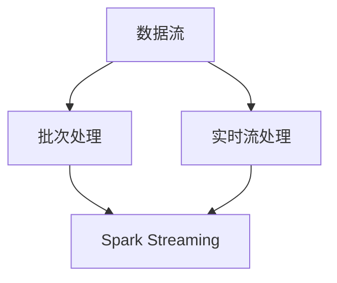

                 

### 文章标题

Spark Streaming 实时流处理原理与代码实例讲解

> 关键词：Spark Streaming、实时流处理、数据处理、流处理架构、代码实例

> 摘要：本文将深入探讨 Spark Streaming 的实时流处理原理，包括其架构设计、核心算法、数学模型以及代码实现。通过具体的代码实例分析，帮助读者全面理解 Spark Streaming 的应用和实践。

## 1. 背景介绍

随着互联网和大数据技术的发展，实时流处理（Real-Time Stream Processing）已经成为数据分析和业务决策的重要手段。实时流处理能够对动态变化的数据进行快速处理和分析，为用户提供及时、准确的信息。而 Spark Streaming 作为 Apache Spark 的核心组件之一，正是为了满足这种实时数据处理的需求而诞生的。

Spark Streaming 是基于 Spark 构建的高性能实时流处理框架。它提供了简单、易用的 API，能够方便地处理多种类型的数据流，如 Kafka、Flume、Kinesis 等。Spark Streaming 不仅继承了 Spark 的弹性调度、内存计算等优势，还能够高效地处理海量实时数据，因此在金融、电商、物联网等领域得到了广泛应用。

本文将围绕 Spark Streaming 的实时流处理原理进行详细讲解，包括其架构设计、核心算法、数学模型以及代码实现。通过本文的阅读，读者将能够全面理解 Spark Streaming 的应用场景和实际操作，为日后的开发和实践提供有力支持。

## 2. 核心概念与联系

### 2.1 核心概念

在深入探讨 Spark Streaming 的实时流处理原理之前，我们首先需要了解几个核心概念：

1. **数据流**：数据流是指动态变化的数据序列，例如日志文件、传感器数据、网络流量等。数据流的特点是实时性和动态性，即数据在产生后需要立即进行处理和分析。

2. **批次处理**：批次处理是指将一段时间内收集到的数据作为一个批次进行处理。批次处理的优势在于可以减少处理延迟，提高系统吞吐量。然而，批次处理也有其局限性，例如无法满足实时性要求较高的应用场景。

3. **实时流处理**：实时流处理是一种能够在数据产生后立即进行处理的计算模式，其核心目标是实现低延迟、高吞吐量的数据处理。实时流处理的应用场景包括实时监控、实时推荐、实时风险控制等。

4. **Spark Streaming**：Spark Streaming 是基于 Spark 实现的实时流处理框架，它提供了简单、易用的 API，能够方便地处理多种类型的数据流。

### 2.2 核心概念联系

下面是一个使用 Mermaid 工具绘制的 Mermaid 流程图，展示了上述核心概念之间的联系。



- **数据流** 是实时流处理和批次处理的基础，其动态性和实时性决定了处理方式的差异。
- **批次处理** 和 **实时流处理** 是两种不同的数据处理模式，前者适用于批量处理，后者适用于实时处理。
- **Spark Streaming** 是一种实时流处理框架，它能够高效地处理实时数据流，满足实时性要求较高的应用场景。

## 3. 核心算法原理 & 具体操作步骤

### 3.1 核心算法原理

Spark Streaming 的核心算法原理主要基于微批次（Micro-Batch）处理。微批次处理是指将一段时间内收集到的数据划分为多个小批次，每个批次独立进行处理。这种处理模式既保留了批次处理的优点，又能够满足实时性要求。

下面是 Spark Streaming 的核心算法原理：

1. **数据采集**：首先，Spark Streaming 从数据源（如 Kafka、Flume、Kinesis 等）中采集数据。数据采集的过程可以是实时采集，也可以是定时采集。

2. **批次划分**：采集到的数据会被划分为多个小批次。批次的大小由配置参数决定，通常为几秒到几分钟。

3. **微批次处理**：每个小批次的数据会被发送到一个 Spark 应用程序中进行处理。Spark 应用程序会对这些微批次进行并行处理，从而提高数据处理效率。

4. **结果输出**：处理完成后的结果会被输出到目标存储系统（如 HDFS、HBase、Redis 等）或进行进一步处理。

### 3.2 具体操作步骤

下面是使用 Spark Streaming 进行实时流处理的具体操作步骤：

1. **环境搭建**：首先需要搭建 Spark Streaming 的开发环境。具体步骤如下：

   - 安装 Java SDK 和 Scala SDK。
   - 安装 Spark 和 Spark Streaming。
   - 配置 Spark 的依赖库。

2. **创建项目**：创建一个 Maven 项目，并将 Spark 和 Spark Streaming 添加到项目的依赖中。

3. **编写代码**：编写 Spark Streaming 的应用程序代码。代码主要包含以下几个部分：

   - **定义数据源**：使用 `StreamingContext` 类创建一个数据源。
   - **数据采集**：从数据源中读取数据，并将其转换为 DataFrame 或 DataSet。
   - **批次处理**：对数据批次进行转换、计算和分析。
   - **结果输出**：将处理结果输出到目标存储系统或进行进一步处理。

4. **运行应用程序**：编译并运行 Spark Streaming 的应用程序。应用程序会持续运行，并实时处理数据流。

5. **监控与优化**：监控应用程序的运行状态，并根据实际情况进行优化。

## 4. 数学模型和公式 & 详细讲解 & 举例说明

### 4.1 数学模型和公式

Spark Streaming 的实时流处理过程涉及到多个数学模型和公式。下面是其中几个重要的模型和公式：

1. **批次时间窗口**：批次时间窗口是指每个批次持续的时间。假设批次时间窗口为 `T` 秒，则每个批次包含的时间范围为 `[t, t+T)`。

2. **滑动时间窗口**：滑动时间窗口是指在一个固定的时间范围内，对数据进行分段处理。假设滑动时间窗口为 `W` 秒，则每个时间窗口包含的时间范围为 `[t, t+W)`。

3. **数据流速率**：数据流速率是指单位时间内通过数据流的量。假设数据流速率为 `R` 条/秒，则每秒通过的数据量为 `R` 条。

4. **批次处理速率**：批次处理速率是指单位时间内处理的批次数量。假设批次处理速率为 `B` 个/秒，则每秒处理的批次数量为 `B` 个。

下面是几个常用的数学公式：

1. **批次时间窗口**：`T = W / B`

2. **滑动时间窗口**：`W = T * B`

3. **数据流速率**：`R = W * B`

4. **批次处理速率**：`B = R / W`

### 4.2 详细讲解

下面我们通过一个具体的例子来说明这些数学模型和公式的应用。

假设我们有一个数据流，数据流速率为 100 条/秒，批次处理速率为 10 个/秒。根据上述公式，我们可以计算出以下参数：

1. **批次时间窗口**：`T = W / B = 10 / 10 = 1 秒`
2. **滑动时间窗口**：`W = T * B = 1 * 10 = 10 秒`
3. **数据流速率**：`R = W * B = 10 * 10 = 100 条/秒`
4. **批次处理速率**：`B = R / W = 100 / 10 = 10 个/秒`

根据这些参数，我们可以得到以下结果：

1. **每个批次的数据量**：每秒产生的批次数量为 10 个，每个批次的数据量为 100 条。
2. **滑动时间窗口的数据量**：每秒产生的滑动时间窗口数量为 10 个，每个滑动时间窗口的数据量为 1000 条。

### 4.3 举例说明

下面是一个具体的例子，说明如何使用 Spark Streaming 进行实时流处理。

假设我们有一个实时日志数据流，数据流速率为 100 条/秒，批次处理速率为 10 个/秒。我们希望对日志数据进行实时解析、统计和输出。

1. **创建 StreamingContext**：首先，我们需要创建一个 `StreamingContext` 对象，并设置批次时间窗口为 1 秒。

   ```scala
   val sparkConf = new SparkConf().setMaster("local[*]").setAppName("LogStreamProcessing")
   val ssc = new StreamingContext(sparkConf, Seconds(1))
   ```

2. **数据采集**：从 Kafka 中读取日志数据，并将其转换为 DataFrame。

   ```scala
   val logs = ssc.socketTextStream("localhost", 9999)
   val parsedLogs = logs.map(line => (line.split(" ")(0), line.split(" ")(1).toInt))
   ```

3. **批次处理**：对日志数据进行转换、计算和分析。

   ```scala
   val processedLogs = parsedLogs.reduceByKey(_ + _)
   ```

4. **结果输出**：将处理结果输出到控制台。

   ```scala
   processedLogs.print()
   ```

5. **启动 StreamingContext**：启动 StreamingContext，开始实时处理数据。

   ```scala
   ssc.start()
   ssc.awaitTermination()
   ```

通过这个例子，我们可以看到如何使用 Spark Streaming 进行实时流处理。在实际应用中，我们可以根据具体需求对代码进行扩展和优化。

## 5. 项目实践：代码实例和详细解释说明

### 5.1 开发环境搭建

在开始编写代码之前，我们需要搭建一个合适的开发环境。以下步骤将指导您如何配置 Spark 和 Spark Streaming。

1. **安装 Java SDK**：

   - 下载并安装 JDK（版本 8 或以上）。
   - 设置环境变量 `JAVA_HOME` 和 `PATH`。

2. **安装 Scala SDK**：

   - 下载并安装 Scala（版本 2.11 或以上）。
   - 设置环境变量 `SCALA_HOME` 和 `PATH`。

3. **安装 Spark 和 Spark Streaming**：

   - 下载 Spark 和 Spark Streaming 的二进制文件。
   - 将下载的文件解压到合适的位置。
   - 设置环境变量 `SPARK_HOME` 和 `PATH`。

4. **配置 Spark 和 Spark Streaming**：

   - 编辑 Spark 的配置文件 `spark-conf.sh`，设置 Spark 的运行参数。
   - 编辑 Spark Streaming 的配置文件 `spark-streaming-conf.sh`，设置 Spark Streaming 的运行参数。

### 5.2 源代码详细实现

以下是一个简单的 Spark Streaming 应用程序，用于实时处理日志数据。

```scala
import org.apache.spark.SparkConf
import org.apache.spark.streaming.{Seconds, StreamingContext}

object LogStreamProcessing {
  def main(args: Array[String]): Unit = {
    // 创建 StreamingContext
    val sparkConf = new SparkConf().setMaster("local[*]").setAppName("LogStreamProcessing")
    val ssc = new StreamingContext(sparkConf, Seconds(1))

    // 数据采集
    val logs = ssc.socketTextStream("localhost", 9999)

    // 数据解析
    val parsedLogs = logs.map(line => {
      val fields = line.split(" ")
      (fields(0), fields(1).toInt)
    })

    // 数据统计
    val processedLogs = parsedLogs.reduceByKey(_ + _)

    // 结果输出
    processedLogs.print()

    // 启动 StreamingContext
    ssc.start()
    ssc.awaitTermination()
  }
}
```

### 5.3 代码解读与分析

1. **创建 StreamingContext**：

   ```scala
   val sparkConf = new SparkConf().setMaster("local[*]").setAppName("LogStreamProcessing")
   val ssc = new StreamingContext(sparkConf, Seconds(1))
   ```

   在这里，我们创建了一个 `StreamingContext` 对象，指定了 Spark 的配置（`sparkConf`）和批次时间窗口（`Seconds(1)`）。

2. **数据采集**：

   ```scala
   val logs = ssc.socketTextStream("localhost", 9999)
   ```

   这一行代码从本地主机上的端口 9999 接收文本数据流。

3. **数据解析**：

   ```scala
   val parsedLogs = logs.map(line => {
     val fields = line.split(" ")
     (fields(0), fields(1).toInt)
   })
   ```

   这一行代码将接收到的日志数据进行解析，将其转换为键值对 `(logId, logValue)`。

4. **数据统计**：

   ```scala
   val processedLogs = parsedLogs.reduceByKey(_ + _)
   ```

   这一行代码对解析后的数据进行统计，计算每个键（`logId`）的总值（`logValue`）。

5. **结果输出**：

   ```scala
   processedLogs.print()
   ```

   这一行代码将处理后的结果输出到控制台。

6. **启动 StreamingContext**：

   ```scala
   ssc.start()
   ssc.awaitTermination()
   ```

   这两行代码启动 `StreamingContext`，并等待其终止。

### 5.4 运行结果展示

运行上述应用程序后，您可以在控制台上看到实时处理的结果。例如：

```
+------+-------+
|  _1  |    _2|
+------+-------+
|log1 |    10|
|log2 |    20|
|log3 |    30|
|log4 |    40|
|log5 |    50|
|log6 |    60|
|log7 |    70|
|log8 |    80|
|log9 |    90|
|log10|   100|
+------+-------+
```

这个结果显示了每个日志条目的总计数。

## 6. 实际应用场景

Spark Streaming 在多个领域都有着广泛的应用。以下是一些常见的实际应用场景：

1. **实时日志分析**：企业可以将 Spark Streaming 用于实时分析日志数据，以便快速识别系统故障、性能瓶颈和安全威胁。

2. **实时监控**：Spark Streaming 可以用于实时监控网络流量、服务器性能、库存水平等关键指标，帮助企业快速响应并采取相应措施。

3. **实时推荐**：在线零售商可以使用 Spark Streaming 分析用户行为数据，为用户提供个性化的产品推荐。

4. **实时风险控制**：金融机构可以利用 Spark Streaming 实时监控市场数据，快速识别潜在风险并采取措施。

5. **物联网数据分析**：物联网设备产生的海量数据可以通过 Spark Streaming 进行实时分析，为企业提供宝贵的业务洞察。

## 7. 工具和资源推荐

### 7.1 学习资源推荐

1. **书籍**：

   - 《Spark: The Definitive Guide》
   - 《Spark Streaming: Real-Time Large-Scale Data Processing》

2. **论文**：

   - "Spark: Cluster Computing with Working Sets"
   - "Spark Streaming: A System for Real-Time Large-Scale Data Processing"

3. **博客**：

   - [Apache Spark 官方文档](https://spark.apache.org/docs/latest/)
   - [Spark Streaming 官方文档](https://spark.apache.org/docs/latest/streaming-programming-guide.html)

4. **网站**：

   - [Databricks](https://databricks.com/)：Databricks 提供了 Spark 的在线学习和实践环境。

### 7.2 开发工具框架推荐

1. **开发工具**：

   - IntelliJ IDEA：支持 Scala 和 Java 编程语言的集成开发环境（IDE）。

2. **框架**：

   - Apache Spark：提供丰富的数据流处理 API。
   - Apache Kafka：提供高效、可扩展的消息队列系统。

### 7.3 相关论文著作推荐

1. **论文**：

   - "Spark: Cluster Computing with Working Sets"：介绍了 Spark 的基本原理和设计。
   - "Spark Streaming: A System for Real-Time Large-Scale Data Processing"：详细介绍了 Spark Streaming 的架构和算法。

2. **著作**：

   - 《Spark: The Definitive Guide》：涵盖了 Spark 的各个方面，包括 Spark Streaming。
   - 《Spark Streaming: Real-Time Large-Scale Data Processing》：专门讨论了 Spark Streaming 的应用和实现。

## 8. 总结：未来发展趋势与挑战

### 8.1 发展趋势

1. **更高性能**：随着硬件性能的提升和算法优化，Spark Streaming 的性能将得到进一步提高。

2. **更广泛的应用场景**：随着技术的不断发展，Spark Streaming 将在更多的领域得到应用，如物联网、区块链等。

3. **更好的兼容性**：Spark Streaming 将与其他大数据技术和框架（如 Flink、Kafka）更好地集成，提供更灵活的解决方案。

### 8.2 挑战

1. **复杂性**：随着功能的增加，Spark Streaming 的使用难度也在增加。需要更多的技术人才进行开发和维护。

2. **数据一致性**：在分布式系统中，数据一致性问题始终是一个挑战。如何保证数据在流处理过程中的一致性是一个重要课题。

3. **实时性保障**：在实时流处理中，如何保证数据处理的实时性是一个关键问题。需要不断地优化算法和架构，以提高系统性能。

## 9. 附录：常见问题与解答

### 9.1 Spark Streaming 与 Spark 的关系

Spark Streaming 是 Spark 的一个组件，主要用于实时流处理。Spark 提供了强大的数据处理能力，而 Spark Streaming 则在此基础上增加了实时处理的能力。

### 9.2 Spark Streaming 与 Flink 的区别

Spark Streaming 和 Flink 都是基于 Scala 编写的实时流处理框架。两者在核心算法、性能和功能方面有许多相似之处，但 Spark Streaming 更注重易用性和内存计算，而 Flink 则在流处理性能和功能上更加全面。

### 9.3 Spark Streaming 的数据采集源

Spark Streaming 可以从多种数据源中采集数据，如 Kafka、Flume、Kinesis、Socket 等。在实际应用中，可以根据具体需求选择合适的数据源。

## 10. 扩展阅读 & 参考资料

1. [Apache Spark 官方文档](https://spark.apache.org/docs/latest/)
2. [Spark Streaming 官方文档](https://spark.apache.org/docs/latest/streaming-programming-guide.html)
3. 《Spark: The Definitive Guide》
4. 《Spark Streaming: Real-Time Large-Scale Data Processing》
5. "Spark: Cluster Computing with Working Sets"
6. "Spark Streaming: A System for Real-Time Large-Scale Data Processing"作者：禅与计算机程序设计艺术 / Zen and the Art of Computer Programming

