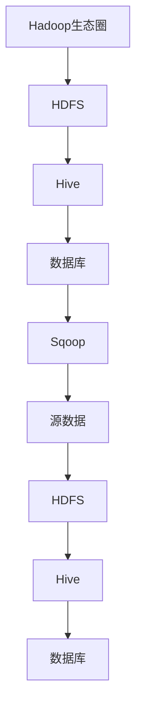

                 

# Sqoop原理与代码实例讲解

## 1. 背景介绍

随着大数据技术的不断发展和企业数据需求的日益增长，如何高效地将大量数据在Hadoop平台与传统的数据库系统之间进行迁移成为一个关键问题。在这一背景下，Sqoop应运而生。Sqoop是一个由Apache软件基金会开发的开源工具，它允许用户在Apache Hadoop生态系统（尤其是HDFS和Hive）与各种数据库系统（如MySQL、Oracle、PostgreSQL等）之间进行数据迁移。

### 数据迁移的挑战

在进行数据迁移时，我们面临以下几个挑战：

- **数据量巨大**：企业数据库中的数据量往往达到TB甚至PB级别，需要高效地迁移。
- **数据一致性**：在迁移过程中，如何保证源数据和目标数据的一致性是一个重要问题。
- **数据格式转换**：源数据格式与目标数据格式可能不同，需要进行适当的转换。
- **并行处理**：为了提高数据迁移速度，需要并行处理大量数据。

### Sqoop的作用

Sqoop正是为了解决上述问题而设计。它提供了以下功能：

- **高效数据迁移**：支持大规模数据的快速迁移。
- **数据一致性**：提供机制确保源数据和目标数据的一致性。
- **数据格式转换**：支持多种数据格式之间的转换。
- **并行处理**：利用Hadoop的MapReduce框架进行并行处理，提高迁移速度。

## 2. 核心概念与联系

### 概念解析

- **Hadoop**：一个分布式数据存储和处理框架，主要用于处理海量数据。
- **HDFS**：Hadoop分布式文件系统（Hadoop Distributed File System），用于存储大数据。
- **Hive**：基于Hadoop的数据仓库工具，提供SQL查询功能。
- **数据库**：包括关系型数据库（如MySQL、Oracle）和非关系型数据库（如MongoDB）。

### Mermaid 流程图



### 流程说明

1. **源数据读取**：通过Sqoop从数据库中读取数据。
2. **数据存储**：将读取的数据存储到HDFS中。
3. **数据查询**：利用Hive对HDFS中的数据进行查询。
4. **数据同步**：将HDFS中的数据同步回数据库。

## 3. 核心算法原理 & 具体操作步骤

### 核心算法原理

Sqoop的核心算法主要基于MapReduce框架，其基本原理如下：

1. **数据分割**：将源数据分割成多个小块。
2. **并行处理**：将每个小块分配到不同的Map任务中进行处理。
3. **数据整合**：将Map任务处理后的结果进行整合，存储到HDFS中。

### 具体操作步骤

1. **安装与配置**
    - 安装Java环境
    - 安装Hadoop
    - 安装Sqoop

2. **创建Hive表**
    ```sql
    CREATE TABLE hive_table(
        column1 STRING,
        column2 STRING,
        ...
    );
    ```

3. **运行Sqoop导入命令**
    ```shell
    sqoop import --connect jdbc:mysql://host:port/dbname \
        --table tablename \
        --target-dir hdfs://host:port/path \
        --hive-import;
    ```

4. **运行Hive查询**
    ```sql
    SELECT * FROM hive_table;
    ```

## 4. 数学模型和公式 & 详细讲解 & 举例说明

### 数学模型

在Sqoop的数据迁移过程中，涉及的数学模型主要与数据量、处理速度和并行度相关。以下是几个关键公式：

$$
\text{数据迁移速度} = \frac{\text{数据总量}}{\text{迁移时间}}
$$

$$
\text{并行度} = \frac{\text{数据总量}}{\text{并发处理能力}}
$$

### 详细讲解

1. **数据迁移速度**：该公式表示单位时间内迁移的数据量，是衡量数据迁移效率的关键指标。
2. **并行度**：表示能够同时处理的任务数量，并行度越高，处理速度越快。

### 举例说明

假设有100TB的数据需要从MySQL迁移到HDFS，使用10台节点进行并行处理。

- **数据迁移速度**：$$ \frac{100TB}{1天} = 10TB/天 $$
- **并行度**：$$ \frac{100TB}{10TB/台} = 10台 $$

这意味着每天可以迁移10TB的数据，同时使用10台节点进行并行处理。

## 5. 项目实践：代码实例和详细解释说明

### 5.1 开发环境搭建

在开始项目实践前，需要搭建好以下开发环境：

- **Hadoop**：版本2.7.7
- **Sqoop**：版本1.4.7
- **MySQL**：版本5.7.25

### 5.2 源代码详细实现

以下是一个简单的Sqoop导入MySQL数据的代码实例：

```shell
# 导入MySQL表数据到HDFS
sqoop import \
    --connect jdbc:mysql://localhost:3306/test_db \
    --username root \
    --password password \
    --table user_info \
    --target-dir /user/hive/warehouse/user_info
```

### 5.3 代码解读与分析

- **--connect**：指定数据库连接信息，如MySQL的URL、端口、数据库名等。
- **--username** 和 **--password**：指定数据库的用户名和密码。
- **--table**：指定需要导入的表名。
- **--target-dir**：指定数据在HDFS上的存储路径。

### 5.4 运行结果展示

运行上述命令后，Sqoop会将`test_db`数据库中的`user_info`表的数据导入到HDFS的`/user/hive/warehouse/user_info`路径下。

### 5.5 遇到的问题与解决方案

- **数据库连接失败**：检查数据库连接信息是否正确。
- **导入数据失败**：检查表结构是否正确，数据是否过大。

## 6. 实际应用场景

### 6.1 数据仓库建设

在企业数据仓库建设中，Sqoop常用于将关系型数据库中的数据迁移到Hadoop平台上，为后续的数据分析和挖掘提供基础数据。

### 6.2 数据同步

在实时数据同步场景中，Sqoop可以与Kafka等消息队列系统集成，实现数据实时迁移。

### 6.3 数据清洗

Sqoop在数据清洗过程中也发挥着重要作用，可以用于将清洗后的数据导入到Hadoop平台中。

## 7. 工具和资源推荐

### 7.1 学习资源推荐

- **书籍**：
  - 《Hadoop权威指南》
  - 《大数据技术基础》
- **论文**：
  - 《Hadoop: The Definitive Guide》
  - 《Hadoop in Action》
- **博客**：
  - [Apache Sqoop官方文档](https://sqoop.apache.org/)
  - [大数据之路](https://www.iteye.com/blog/bigdata-road)
- **网站**：
  - [Hadoop官网](https://hadoop.apache.org/)
  - [MySQL官网](https://www.mysql.com/)

### 7.2 开发工具框架推荐

- **开发工具**：
  - IntelliJ IDEA
  - Eclipse
- **框架**：
  - Spring Boot
  - Apache Kafka

### 7.3 相关论文著作推荐

- **论文**：
  - 《Hadoop: A Framework for Large-Scale Data Processing》
  - 《Apache Sqoop: Efficient Data Transfer Between Hadoop and Relational Datastores》
- **著作**：
  - 《大数据技术与架构》
  - 《数据仓库与大数据》

## 8. 总结：未来发展趋势与挑战

### 发展趋势

- **集成更多数据源**：未来Sqoop可能会集成更多类型的数据源，如NoSQL数据库。
- **优化迁移速度**：随着大数据技术的不断发展，如何进一步提高数据迁移速度将成为一个重要课题。
- **智能化**：通过引入机器学习算法，实现自动数据迁移和优化。

### 挑战

- **数据安全**：如何在数据迁移过程中确保数据安全，是一个亟待解决的问题。
- **异构数据融合**：如何处理不同类型数据之间的融合和转换，是一个技术挑战。

## 9. 附录：常见问题与解答

### 9.1 如何配置MySQL数据库连接？

- **配置文件**：在`/etc/sqoop/conf/sqoop-site.xml`中添加MySQL连接属性。
  ```xml
  <configuration>
      <property>
          <name>connector.jdbc.url</name>
          <value>jdbc:mysql://host:port/dbname</value>
      </property>
      <property>
          <name>connector.jdbc.driver</name>
          <value>com.mysql.jdbc.Driver</value>
      </property>
      <property>
          <name>connector.jdbc.user</name>
          <value>root</value>
      </property>
      <property>
          <name>connector.jdbc.password</name>
          <value>password</value>
      </property>
  </configuration>
  ```

### 9.2 如何解决数据迁移失败的问题？

- **检查数据库连接**：确保数据库连接信息正确。
- **检查表结构**：确保导入的表结构与源表结构一致。
- **增加并行度**：通过增加并行度来提高数据迁移速度。

## 10. 扩展阅读 & 参考资料

- [Apache Sqoop官方文档](https://sqoop.apache.org/)
- [大数据之路](https://www.iteye.com/blog/bigdata-road)
- [Hadoop官网](https://hadoop.apache.org/)
- [MySQL官网](https://www.mysql.com/)作者：禅与计算机程序设计艺术 / Zen and the Art of Computer Programming


