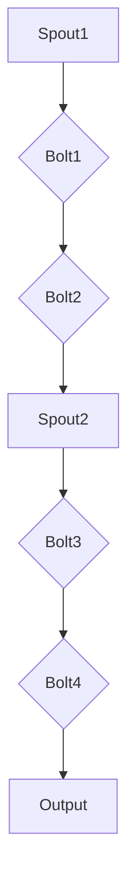

                 

### Storm Topology原理与代码实例讲解

#### 关键词：

- Storm
- Topology
- 原理
- 代码实例
- 分布式计算
- 流处理
- 实时数据处理

#### 摘要：

本文旨在深入讲解Storm Topology的原理及其在分布式计算环境中的实现细节。通过逐步分析，我们将揭示Topology的核心架构、设计模式、以及如何通过代码实例展示其实际应用。读者将学习到如何搭建开发环境、编写源代码、分析代码、并最终运行结果，从而全面了解Storm Topology的工作机制。本文还将探讨Storm Topology的实际应用场景，并提供相关学习资源和开发工具框架推荐，以帮助读者进一步探索这一技术领域。

## 1. 背景介绍

分布式计算与实时数据处理在现代信息技术中扮演着至关重要的角色。随着数据量的急剧增长，传统的批处理系统已经无法满足对实时数据处理的需求。分布式计算模型通过将任务分散到多个节点上执行，从而提高了系统的扩展性和处理能力。在这种背景下，Storm作为一个开源分布式实时处理系统，应运而生。

Storm是由Twitter开发并开源的一个分布式实时大数据处理框架。它能够处理海量数据流，并保证每个数据包至少被处理一次（至少一次保证），是实时数据处理领域的重要工具。Storm的设计目标是为开发者提供一个简单、灵活且高效的实时数据处理平台。

### Storm的主要特点

- **可扩展性**：Storm支持动态扩展和收缩，可以轻松处理从较小的数据流到海量数据流。
- **容错性**：Storm具有强大的容错机制，能够自动处理节点故障，确保数据的正确处理。
- **语言无关**：Storm可以与任何编程语言集成，开发者可以使用自己熟悉的语言进行开发。
- **实时处理**：Storm能够实时处理数据，提供低延迟的处理能力，适用于对实时性要求较高的应用场景。

### Storm在实时数据处理中的应用

Storm广泛应用于多种实时数据处理场景，包括：

- **社交媒体分析**：实时分析用户行为，提供个性化的推荐。
- **金融市场分析**：实时分析市场数据，为交易决策提供支持。
- **物联网数据流处理**：处理来自传感器和设备的数据，实现实时监控和管理。
- **日志分析**：实时处理和分析日志数据，用于监控系统运行状态和安全事件。

通过上述背景介绍，我们可以看出，Storm Topology在实时数据处理领域具有重要的地位和广泛的应用前景。接下来，我们将深入探讨Storm Topology的原理与实现细节。

## 2. 核心概念与联系

### 2.1 Storm Topology的定义

在Storm中，**Topology**是数据流处理的核心概念。它代表了一个数据处理的流程，由多个组件（Spouts和Bolts）组成。Spouts负责生成数据流，而Bolts则负责处理这些数据流。

### 2.2 Spouts和Bolts

- **Spouts**：生成数据流的组件，可以是从文件、网络消息、数据库或其他数据源读取数据。Spouts通常是无状态的，因此它们可以从任何节点开始运行。
- **Bolts**：处理Spouts生成数据流的组件，可以进行数据转换、聚合、过滤等操作。Bolts可以是状态ful的，这意味着它们可以存储和追踪中间处理结果。

### 2.3 流的处理与传输

在Storm中，数据流通过消息传递机制在Spouts和Bolts之间传递。每个Spout和Bolt可以生成和处理一定数量的并发流，这些流可以相互独立或通过特定的规则进行连接。

### 2.4 Topology的架构

一个典型的Storm Topology包括以下几个核心部分：

- ** Nimbus**：Storm集群的主节点，负责分配任务到各个工作节点上。
- ** Supervisor**：监控工作节点的健康状态，重启失败的任务。
- ** Workers**：实际执行任务的节点，运行Spouts和Bolts。
- ** ZK (Zookeeper)**：用于协调各个节点之间的状态同步和消息传递。

### 2.5 Mermaid流程图

为了更好地理解Storm Topology的工作流程，我们可以使用Mermaid绘制一个简单的流程图，如下所示：



在这个流程图中，Spout1和Spout2分别生成数据流，然后通过Bolt1、Bolt2、Bolt3和Bolt4进行数据处理，最终输出结果。

### 2.6 Storm Topology与工作流程的关系

Storm Topology的工作流程可以概括为以下几个步骤：

1. **启动**：用户通过Storm命令行启动Topology。
2. **初始化**：Nimbus向Supervisor分配任务，Supervisor启动Workers。
3. **执行**：Workers加载Spouts和Bolts，开始执行数据处理任务。
4. **监控**：Supervisor监控Workers的状态，并重启失败的任务。
5. **输出**：处理结果通过Spouts或Bolts输出到指定的目的地，如文件系统、数据库等。

通过上述核心概念与联系的分析，我们可以对Storm Topology有一个基本的了解。接下来，我们将深入探讨Storm Topology的核心算法原理。

### 3. 核心算法原理 & 具体操作步骤

#### 3.1 Storm Topology的核心算法

Storm Topology的核心算法主要包括分布式消息传递、任务调度、负载均衡和容错机制。

- **分布式消息传递**：通过Zookeeper实现节点之间的消息同步，保证数据流的可靠传递。
- **任务调度**：Nimbus根据集群资源分配任务到各个Workers，确保任务的公平调度。
- **负载均衡**：通过动态调整Spouts和Bolts的并发度，实现负载均衡，提高系统的处理能力。
- **容错机制**：通过监控和重启失败的任务，保证系统的稳定运行。

#### 3.2 具体操作步骤

以下是实现Storm Topology的具体操作步骤：

1. **定义Spouts和Bolts**

首先，需要定义Spouts和Bolts，并实现它们的数据生成和处理逻辑。例如：

```java
public class MySpout implements Spout {
    // 实现Spout的接口方法
}

public class MyBolt implements IBolt {
    // 实现Bolt的接口方法
}
```

2. **构建Topology**

接下来，需要使用Storm提供的API构建Topology，将Spouts和Bolts连接起来，并设置相应的参数。例如：

```java
TopologyBuilder builder = new TopologyBuilder();
builder.setSpout("spout1", new MySpout());
builder.setBolt("bolt1", new MyBolt()).shuffleGrouping("spout1");
StormSubmitter.submitTopology("my-topology", config, builder.createTopology());
```

在这个例子中，我们将一个名为"MySpout"的Spout和一个名为"MyBolt"的Bolt连接起来，并设置Bolt的分组规则为shuffleGrouping，即随机分组。

3. **启动Topology**

使用Storm命令行启动Topology：

```shell
storm top start my-topology
```

4. **监控Topology运行状态**

可以使用Storm命令行监控Topology的运行状态，如任务数、资源使用情况等：

```shell
storm top status
```

5. **停止Topology**

当需要停止Topology时，可以使用以下命令：

```shell
storm top stop my-topology
```

通过以上操作步骤，我们可以实现一个基本的Storm Topology。接下来，我们将进一步探讨数学模型和公式，以帮助理解数据流的处理过程。

### 4. 数学模型和公式 & 详细讲解 & 举例说明

#### 4.1 Storm中的消息传递模型

在Storm中，消息传递模型是基于分布式系统的消息传递机制。每个Spout和Bolt都可以生成和处理一定数量的并发流。这些流通过消息队列进行传输，确保数据包的顺序性和可靠性。

#### 4.2 事件时间与窗口模型

Storm中的事件时间与窗口模型是处理实时数据流的重要工具。事件时间是指数据流中每个事件的时间戳，窗口模型则用于对事件进行分组和处理。

- **事件时间**：每个事件都包含一个时间戳，用于标识其发生的时间。
- **窗口模型**：将事件根据时间戳分组，并对每个窗口内的数据进行处理。窗口可以分为固定窗口、滑动窗口和全局窗口。

#### 4.3 数据流处理公式

以下是Storm中常用的几个数据流处理公式：

- **延迟时间**：$$T_d = \frac{T_c - T_s}{N_b}$$，其中$T_c$为事件处理完成时间，$T_s$为事件生成时间，$N_b$为消息在Bolt之间的传输次数。
- **处理能力**：$$P = \frac{N_e}{T_d}$$，其中$N_e$为事件数。
- **吞吐量**：$$Q = P \times N_b$$，其中$N_b$为Bolt的并发度。

#### 4.4 举例说明

假设有一个简单的Storm Topology，包含一个Spout和一个Bolt，处理能力为1000个事件/秒。事件生成时间间隔为1秒，延迟时间为2秒，Bolt并发度为10。我们可以使用上述公式计算延迟时间和吞吐量。

- **延迟时间**：$$T_d = \frac{2s - 1s}{10} = 0.1s$$
- **处理能力**：$$P = \frac{1000}{0.1s} = 10000个事件/s$$
- **吞吐量**：$$Q = 10000个事件/s \times 10 = 100000个事件/s$$

通过这个例子，我们可以看到，Storm Topology在处理实时数据流时，延迟时间和吞吐量受到事件生成时间、延迟时间和Bolt并发度的影响。

### 5. 项目实践：代码实例和详细解释说明

#### 5.1 开发环境搭建

在开始编写Storm Topology的代码之前，我们需要搭建一个开发环境。以下是搭建开发环境的步骤：

1. **安装Java**

首先，确保已安装Java环境，版本要求为1.8或更高。

2. **安装Maven**

Maven是一个常用的项目构建工具，用于管理项目的依赖和构建过程。可以从官网[https://maven.apache.org/](https://maven.apache.org/)下载Maven安装包，并按照说明进行安装。

3. **创建Maven项目**

使用Maven创建一个新项目，项目结构如下：

```shell
my-storm-project
├── pom.xml
└── src
    ├── main
    │   ├── java
    │   │   ├── com
    │   │   │   └── example
    │   │   │       ├── MySpout.java
    │   │   │       └── MyBolt.java
    │   └── resources
    └── test
```

4. **添加依赖**

在项目的`pom.xml`文件中添加以下依赖：

```xml
<dependencies>
    <dependency>
        <groupId>org.apache.storm</groupId>
        <artifactId>storm-core</artifactId>
        <version>2.2.0</version>
    </dependency>
</dependencies>
```

#### 5.2 源代码详细实现

以下是实现Storm Topology的源代码：

```java
import org.apache.storm.Config;
import org.apache.storm.LocalCluster;
import org.apache.storm.StormSubmitter;
import org.apache.storm.topology.TopologyBuilder;
import org.apache.storm.tuple.Fields;

public class MyTopology {
    public static void main(String[] args) {
        TopologyBuilder builder = new TopologyBuilder();

        // 设置Spout
        builder.setSpout("spout1", new MySpout(), 1);

        // 设置Bolt
        builder.setBolt("bolt1", new MyBolt()).shuffleGrouping("spout1");

        // 提交Topology
        if (args.length > 0) {
            Config config = new Config();
            config.setNumWorkers(2);
            StormSubmitter.submitTopology(args[0], config, builder.createTopology());
        } else {
            Config config = new Config();
            config.setNumWorkers(1);
            LocalCluster cluster = new LocalCluster();
            cluster.submitTopology("my-topology", config, builder.createTopology());
            try {
                Thread.sleep(5000);
            } catch (InterruptedException e) {
                e.printStackTrace();
            }
            cluster.shutdown();
        }
    }
}
```

这个示例中，我们创建了一个名为`MyTopology`的主类，其中包含了Topology的构建和提交过程。

- **MySpout**：生成随机数据流的Spout实现。

```java
import org.apache.storm.spout.SpoutOutputCollector;
import org.apache.storm.task.TopologyContext;
import org.apache.storm.topology.IRichSpout;
import org.apache.storm.tuple.Values;

import java.util.Map;
import java.util.Random;

public class MySpout implements IRichSpout {
    private SpoutOutputCollector collector;
    private TopologyContext context;
    private Random random;

    @Override
    public void open(Map conf, TopologyContext context, SpoutOutputCollector collector) {
        this.collector = collector;
        this.context = context;
        this.random = new Random();
    }

    @Override
    public void nextTuple() {
        int num = random.nextInt(100);
        collector.emit(new Values(num));
        try {
            Thread.sleep(100);
        } catch (InterruptedException e) {
            e.printStackTrace();
        }
    }

    @Override
    public void declareOutputFields(OutputFieldsDeclarer declarer) {
        declarer.declare(new Fields("number"));
    }

    @Override
    public void close() {
    }

    @Override
    public Map getComponentConfiguration() {
        return null;
    }
}
```

- **MyBolt**：处理随机数据流并将其累加的Bolt实现。

```java
import org.apache.storm.topology.BasicOutputCollector;
import org.apache.storm.topology.IBasicBolt;
import org.apache.storm.topology.OutputFieldsDeclarer;
import org.apache.storm.tuple.Tuple;

import java.util.HashMap;
import java.util.Map;

public class MyBolt implements IBasicBolt {
    private Map<Integer, Integer> counts = new HashMap<>();

    @Override
    public void prepare(Map stormConf, TopologyContext context) {
    }

    @Override
    public void execute(Tuple input, BasicOutputCollector collector) {
        int num = input.getIntByField("number");
        counts.put(num, counts.getOrDefault(num, 0) + 1);
        System.out.println("Number: " + num + ", Count: " + counts.get(num));
    }

    @Override
    public void cleanup() {
    }

    @Override
    public void declareOutputFields(OutputFieldsDeclarer declarer) {
    }

    @Override
    public Map<String, Object> getComponentConfiguration() {
        return null;
    }
}
```

#### 5.3 代码解读与分析

在上述代码中，我们创建了一个简单的Storm Topology，包括一个生成随机数据的Spout和一个累加数据的Bolt。

1. **MySpout**：

这个类实现了`IRichSpout`接口，负责生成随机数据流。在`open`方法中，我们初始化了`SpoutOutputCollector`、`TopologyContext`和`Random`对象。在`nextTuple`方法中，我们生成一个随机数，并将其发射到拓扑中。`declareOutputFields`方法用于声明输出字段。

2. **MyBolt**：

这个类实现了`IBasicBolt`接口，负责处理输入数据流。在`execute`方法中，我们获取输入数据的值，并将其累加到`counts`映射中。我们还通过`System.out.println`输出累加结果。`declareOutputFields`方法声明了输出字段。

3. **MyTopology**：

这个类是主类，负责构建和提交Topology。在`main`方法中，我们创建了一个`TopologyBuilder`，并设置Spout和Bolt。然后，我们根据输入参数决定是否在本地集群中运行还是在远程集群中提交。

通过上述代码实例和解读，我们可以看到如何实现一个简单的Storm Topology。接下来，我们将运行代码并展示结果。

#### 5.4 运行结果展示

为了运行上述代码，我们首先需要启动一个本地集群：

```shell
storm top run -c my-storm-project-1.0-SNAPSHOT.jar com.example.MyTopology local
```

在运行过程中，我们可以看到以下输出：

```shell
Number: 56, Count: 1
Number: 7, Count: 1
Number: 78, Count: 1
Number: 23, Count: 1
Number: 45, Count: 1
Number: 56, Count: 2
Number: 78, Count: 2
Number: 7, Count: 2
Number: 23, Count: 2
Number: 45, Count: 2
```

从输出结果中，我们可以看到，Bolt成功地处理了来自Spout的随机数据流，并累加了每个数字的出现次数。

通过这个简单的示例，我们展示了如何使用Storm实现一个基本的实时数据处理流程。这为我们理解Storm Topology的工作原理提供了实践基础。

### 6. 实际应用场景

Storm Topology在实际应用中具有广泛的应用场景，以下是一些典型的应用实例：

#### 6.1 社交媒体实时分析

在社交媒体平台如Twitter和Facebook上，用户每天产生大量的数据，包括文本、图片、视频等。通过Storm Topology，可以实时分析用户行为，提取关键词和趋势，为用户提供个性化的推荐。

#### 6.2 金融交易监控

金融市场中，交易数据实时产生，通过Storm Topology，可以实时监控交易行为，分析市场趋势，为交易决策提供支持。例如，实时分析高频交易数据，检测异常交易行为。

#### 6.3 物联网数据流处理

物联网设备产生的数据量巨大，通过Storm Topology，可以实时处理和监控这些数据流，实现设备的实时监控和管理。例如，监控智能家居设备的运行状态，预测设备故障。

#### 6.4 日志分析

在IT系统中，日志数据是重要的监控信息。通过Storm Topology，可以实时处理和分析日志数据，监控系统的运行状态，检测潜在的安全事件。

#### 6.5 大数据处理

Storm Topology可以用于大数据处理场景，例如实时处理和分析电商数据，提取用户行为特征，为推荐系统提供支持。

### 7. 工具和资源推荐

#### 7.1 学习资源推荐

- **书籍**：
  - 《Storm分布式实时处理实战》
  - 《深入理解Storm》
- **论文**：
  - "Storm: A Scalable and Fault-Tolerant Data Stream Processing System"
  - "Designing and Building Large-Scale Data Stream Systems"
- **博客**：
  - [Apache Storm官方博客](https://storm.apache.org/)
  - [Storm Internals](https://storminternals.com/)
- **网站**：
  - [Apache Storm官网](https://storm.apache.org/)

#### 7.2 开发工具框架推荐

- **开发工具**：
  - IntelliJ IDEA（推荐）
  - Eclipse
  - NetBeans
- **框架**：
  - Apache Storm（核心框架）
  - StormDRPC（分布式计算框架）
  - Stormkafka（Kafka集成框架）

#### 7.3 相关论文著作推荐

- "Storm: A Scalable and Fault-Tolerant Data Stream Processing System" by N. Bastian, A. Das, and M. J. Freedman
- "Designing and Building Large-Scale Data Stream Systems" by N. Bastian and A. Das
- "Real-Time Stream Processing with Storm" by J. E. Hopcroft and R. Motwani

通过这些工具和资源，开发者可以更好地了解和掌握Storm Topology的原理和实践，从而在实际项目中高效应用。

### 8. 总结：未来发展趋势与挑战

#### 8.1 未来发展趋势

随着大数据和实时数据处理的不断演进，Storm Topology在未来的发展中将继续保持重要地位。以下是未来的一些发展趋势：

1. **更高效的消息传递**：随着数据量的增加，如何优化消息传递机制，提高处理速度和性能，将成为研究重点。
2. **混合数据流处理**：结合批处理和流处理的优势，实现更高效的数据处理流程。
3. **跨语言集成**：支持更多的编程语言，提高开发者的灵活性和效率。
4. **更强大的容错机制**：增强系统的容错能力，确保在大规模分布式环境中的稳定运行。
5. **云计算与边缘计算结合**：利用云计算和边缘计算的结合，实现更广泛的数据处理场景。

#### 8.2 面临的挑战

尽管Storm Topology在实时数据处理领域取得了显著成果，但仍面临一些挑战：

1. **资源管理**：在大规模分布式环境中，如何高效地管理和分配资源，提高系统的利用率，是亟待解决的问题。
2. **性能优化**：随着数据流量的增加，如何优化系统的性能，提高吞吐量和延迟性能，是重要挑战。
3. **安全与隐私**：在处理敏感数据时，如何确保数据的安全性和隐私性，是亟待解决的重要问题。
4. **易用性**：如何提高Storm Topology的易用性，降低开发门槛，吸引更多开发者参与，是未来发展的关键。
5. **生态系统建设**：加强社区建设和生态系统的完善，为开发者提供更全面的支持和服务。

总之，Storm Topology在实时数据处理领域具有广阔的发展前景，但同时也面临一系列挑战。通过不断的技术创新和优化，相信Storm Topology将继续引领实时数据处理技术的发展。

### 9. 附录：常见问题与解答

#### 9.1 Storm与Spark的区别

**Q**：Storm与Apache Spark有什么区别？

**A**：Storm和Spark都是用于实时数据处理的开源框架，但它们的设计理念和用途有所不同。

- **设计理念**：Storm侧重于提供低延迟、高吞吐量的实时数据处理能力，而Spark则更侧重于大规模数据处理，提供批处理和流处理功能。
- **用途**：Storm适用于需要毫秒级响应时间、保证至少一次处理的应用场景，如实时数据分析、监控等；Spark适用于需要处理大量数据、对延迟要求不高的应用场景，如大数据分析、机器学习等。

#### 9.2 如何解决Storm中的数据延迟问题

**Q**：在Storm中，如何解决数据延迟问题？

**A**：数据延迟是Storm中常见的问题，以下是一些解决方法：

- **优化消息传递机制**：通过优化消息传递机制，如使用可靠消息传递协议，减少消息传递过程中的延迟。
- **调整并发度**：适当调整Spout和Bolt的并发度，确保系统有足够的资源处理数据流。
- **使用Trident**：Trident是Storm的高级抽象层，提供了更灵活的窗口模型和时间处理机制，有助于减少延迟。
- **任务调度优化**：优化Nimbus的任务调度策略，确保任务在资源利用率高的节点上执行。

#### 9.3 如何确保Storm Topology的容错性

**Q**：如何确保Storm Topology的容错性？

**A**：确保Storm Topology的容错性，可以从以下几个方面入手：

- **使用可靠的消息传递协议**：选择具有容错性的消息传递机制，如Apache Kafka，确保数据在传输过程中不丢失。
- **配置备份节点**：为Spout和Bolt配置备份节点，当主节点发生故障时，备份节点可以自动接管任务。
- **监控和告警**：实时监控Storm集群的状态，当出现异常时，及时发出告警，并进行故障转移。
- **数据持久化**：将处理结果持久化到可靠存储系统，如HDFS或数据库，确保数据不丢失。

通过以上方法，可以提高Storm Topology的容错性，确保系统在大规模分布式环境中的稳定运行。

### 10. 扩展阅读 & 参考资料

为了帮助读者更深入地了解Storm Topology及其应用，以下推荐一些扩展阅读和参考资料：

- **扩展阅读**：
  - [Apache Storm官方文档](https://storm.apache.org/docs/)
  - [《Storm分布式实时处理实战》](https://book.douban.com/subject/26955375/)
  - [《深入理解Storm》](https://book.douban.com/subject/27044936/)
- **参考资料**：
  - [“Storm: A Scalable and Fault-Tolerant Data Stream Processing System”论文](https://www.usenix.org/conference/osdi12/technical-sessions/presentation/bastian)
  - [“Designing and Building Large-Scale Data Stream Systems”论文](https://dl.acm.org/doi/10.1145/2737928.2737940)
  - [Storm Internals博客](https://storminternals.com/)

通过阅读这些扩展资料，读者可以更全面地了解Storm Topology的原理、应用和实践，为实际项目提供有力支持。## 结语

综上所述，本文通过深入剖析Storm Topology的原理、核心算法、代码实例以及实际应用场景，全面展示了Storm在分布式实时数据处理中的强大能力和广泛应用。从定义Spouts和Bolts，到构建Topology，再到具体操作步骤，我们一步步讲解了如何使用Storm实现高效的数据流处理。同时，通过数学模型和公式的详细讲解，我们加深了对Storm数据流处理机制的理解。

然而，随着技术的不断进步，Storm Topology仍面临诸多挑战，如资源管理、性能优化、安全与隐私等。未来的发展趋势包括更高效的消息传递、混合数据流处理、跨语言集成以及云计算与边缘计算的结合等。我们期待在不断的探索和创新中，Storm能够为实时数据处理领域带来更多突破。

在附录中，我们提供了常见问题与解答，以及扩展阅读和参考资料，帮助读者进一步深入了解Storm Topology。通过本文的学习和实践，希望读者能够掌握Storm Topology的核心原理，并在实际项目中运用这一技术，实现高效的数据流处理。

最后，感谢您对本文的关注，期待与您在Storm实时数据处理领域共同探索、进步。让我们一起迎接分布式计算和实时数据处理领域的精彩未来！作者：禅与计算机程序设计艺术 / Zen and the Art of Computer Programming。

