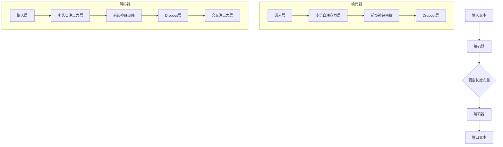

                 

### 1. 背景介绍

#### T5模型的概念与起源

T5（Text-to-Text Transfer Transformer）是一种先进的自然语言处理模型，由谷歌开发，首次在2020年发表在论文《T5: Pre-training Text to Text Transformers for Cross-Domain Language Modeling》中。T5模型的核心思想是利用预训练的Transformer架构，将文本转换为文本，从而实现跨领域的语言建模和多种自然语言处理任务。

T5模型的出现，是对传统自然语言处理方法的重要革新。传统的自然语言处理方法往往依赖于手工设计特征和规则，这不仅费时费力，而且效果有限。而T5模型通过大规模预训练，可以自动学习到丰富的语言特征，使得模型在多种任务上表现出色。

T5模型的提出，标志着自然语言处理领域的一个新的里程碑。它不仅提升了模型的性能，还为跨领域的自然语言处理任务提供了有效的解决方案。同时，T5模型也展示了Transformer架构在自然语言处理中的强大能力，为后续的研究和应用奠定了基础。

#### 自然语言处理的发展历程

自然语言处理（NLP）作为人工智能领域的一个重要分支，其发展历程可以追溯到20世纪50年代。早期的NLP研究主要集中在词汇和句法的分析上，通过规则和语法解析来理解和生成语言。

随着计算机性能的提升和机器学习技术的发展，NLP开始引入统计方法和机器学习算法。基于统计的方法通过计算词汇和句子的概率分布来预测语言结构，例如朴素贝叶斯分类器和最大熵模型。

2000年后，深度学习技术的发展进一步推动了NLP的进步。神经网络，特别是卷积神经网络（CNN）和循环神经网络（RNN），在语音识别、机器翻译和情感分析等领域取得了显著成果。这些模型通过自动学习数据中的特征，提高了NLP任务的性能。

然而，深度学习模型在处理长文本和跨领域任务时仍存在挑战。为了解决这些问题，Transformer模型在2017年提出了革命性的解决方案。Transformer模型通过自注意力机制，能够有效地处理长序列，并在机器翻译、文本生成等任务上取得了优异的成绩。

T5模型作为Transformer模型的一个扩展，通过引入文本到文本的预训练任务，进一步提升了模型的泛化能力和适应性。它不仅继承了Transformer的优点，还通过大规模预训练，使得模型能够更好地理解和生成自然语言。

#### T5模型的优势与应用领域

T5模型在自然语言处理领域具有显著的优势。首先，T5模型通过大规模预训练，可以自动学习到丰富的语言特征，从而在多种自然语言处理任务上表现出色。这使得T5模型成为了一种强大的通用语言处理工具。

其次，T5模型采用了Transformer架构，具有强大的并行计算能力。Transformer模型通过多头自注意力机制，能够同时关注输入序列的各个部分，从而提高了模型的表示能力和效率。

此外，T5模型在跨领域任务上也具有出色的表现。由于T5模型通过大规模预训练，已经学习到了广泛的语言知识，因此它在处理不同领域的文本时，能够快速适应并取得较好的效果。

T5模型的应用领域非常广泛，包括但不限于以下方面：

1. **机器翻译**：T5模型在机器翻译任务中表现优异，能够实现高质量的多语言翻译。通过预训练，T5模型可以自动学习到不同语言的语法和语义特征，从而提高了翻译的准确性和流畅性。

2. **文本生成**：T5模型可以用于生成各种类型的文本，如文章、新闻、故事等。通过预训练，T5模型可以理解输入文本的上下文，从而生成连贯、有逻辑的文本。

3. **问答系统**：T5模型可以用于构建问答系统，通过理解输入问题，生成相应的答案。T5模型在处理开放域问答任务时，能够快速适应不同的问答场景，提供准确的答案。

4. **文本分类**：T5模型可以用于文本分类任务，如情感分析、主题分类等。通过预训练，T5模型可以学习到不同类别的文本特征，从而提高分类的准确性。

5. **信息抽取**：T5模型可以用于信息抽取任务，如实体识别、关系抽取等。通过预训练，T5模型可以自动学习到实体和关系之间的特征，从而提高信息抽取的效率和质量。

综上所述，T5模型在自然语言处理领域具有广泛的应用前景。它不仅继承了Transformer模型的优点，还通过大规模预训练，提升了模型的性能和泛化能力。随着技术的不断进步，T5模型有望在更多的自然语言处理任务中发挥重要作用。

### 2. 核心概念与联系

#### Transformer模型的基本概念

Transformer模型是自然语言处理领域中的一种先进架构，首次在2017年由Vaswani等人在论文《Attention is All You Need》中提出。与传统的循环神经网络（RNN）和卷积神经网络（CNN）相比，Transformer模型通过自注意力机制（Self-Attention）和多头注意力机制（Multi-Head Attention）实现了对输入序列的建模，具有并行计算能力，并且在机器翻译等任务上取得了显著成果。

**自注意力机制（Self-Attention）**：自注意力机制是Transformer模型的核心部分，用于对输入序列中的每个词进行加权。具体来说，自注意力机制通过计算词与词之间的相似性，对每个词赋予不同的权重，从而在建模时能够关注到输入序列中的关键信息。

**多头注意力机制（Multi-Head Attention）**：多头注意力机制是在自注意力机制的基础上扩展的，它将整个注意力机制分成多个头，每个头关注输入序列的不同部分。多头注意力机制通过拼接和线性变换，将多个头的输出融合，从而提高了模型的表示能力和鲁棒性。

**编码器和解码器**：Transformer模型由编码器（Encoder）和解码器（Decoder）组成。编码器负责将输入序列编码为固定长度的向量表示，解码器则根据编码器的输出和先前的解码结果，生成输出序列。

#### T5模型的概念及其与Transformer的联系

T5模型是基于Transformer架构的一种自然语言处理模型，其核心概念是“文本到文本的转换”（Text-to-Text Transfer）。T5模型通过将输入文本转换为另一个文本，实现了跨领域的语言建模和多种自然语言处理任务。

**文本到文本的转换**：T5模型的核心思想是将输入文本转换为一个目标文本，从而实现语言的理解和生成。具体来说，T5模型将输入文本编码为向量表示，然后通过预训练，学习到输入和输出文本之间的对应关系。在预测阶段，给定一个输入文本，T5模型可以生成一个相应的输出文本。

**Transformer架构的应用**：T5模型采用了Transformer架构，包括编码器和解码器。编码器负责将输入文本编码为固定长度的向量表示，解码器则根据编码器的输出和先前的解码结果，生成输出文本。通过自注意力机制和多头注意力机制，T5模型能够同时关注输入序列的各个部分，从而实现高质量的文本转换。

**预训练与微调**：T5模型采用了大规模预训练和微调策略。在预训练阶段，T5模型通过大量未标记的文本数据进行训练，学习到丰富的语言特征。在微调阶段，T5模型根据特定任务的数据进行微调，以适应不同的自然语言处理任务。

#### Mermaid流程图

为了更清晰地展示T5模型的工作流程，我们使用Mermaid流程图来描述。在流程图中，我们包括了T5模型的主要组件和步骤。



在这个流程图中，我们首先将输入文本编码为固定长度的向量表示，然后通过解码器生成输出文本。编码器和解码器都包含嵌入层、多头自注意力层、前馈神经网络和Dropout层。编码器的输出和先前的解码结果通过交叉注意力层进行融合，从而生成最终的输出文本。

### 3. 核心算法原理 & 具体操作步骤

#### Transformer模型的工作原理

Transformer模型的工作原理可以概括为以下几个关键步骤：

1. **嵌入层（Embedding Layer）**：将输入序列的词向量转换为固定长度的向量表示。词向量通常由预训练的词向量库提供，例如Word2Vec或GloVe。

2. **多头自注意力层（Multi-Head Self-Attention Layer）**：通过自注意力机制，对输入序列中的每个词进行加权。多头自注意力层将整个注意力机制分成多个头，每个头关注输入序列的不同部分。

3. **前馈神经网络（Feedforward Neural Network）**：对自注意力层的输出进行进一步的非线性变换，增强模型的表示能力。

4. **Dropout层（Dropout Layer）**：为了防止模型过拟合，添加Dropout层，随机丢弃部分神经元，从而提高模型的泛化能力。

5. **编码器和解码器（Encoder and Decoder）**：Transformer模型由编码器（Encoder）和解码器（Decoder）组成。编码器负责将输入序列编码为固定长度的向量表示，解码器则根据编码器的输出和先前的解码结果，生成输出序列。

**具体操作步骤**：

1. **初始化**：首先，我们初始化输入序列和隐藏状态。

2. **嵌入层**：将输入序列的词向量转换为固定长度的向量表示。

3. **多头自注意力层**：计算输入序列中每个词与其他词之间的相似性，并加权求和。这个过程分为多个头进行，每个头关注输入序列的不同部分。

4. **前馈神经网络**：对多头自注意力层的输出进行进一步的非线性变换，增强模型的表示能力。

5. **Dropout层**：随机丢弃部分神经元，防止模型过拟合。

6. **编码器输出**：将多头自注意力层的输出和前馈神经网络的输出进行拼接，得到编码器的输出。

7. **解码器**：根据编码器的输出和先前的解码结果，生成输出序列。解码过程与编码器类似，包括嵌入层、多头自注意力层、前馈神经网络和Dropout层。

8. **交叉注意力层**：在解码器的每个时间步，解码器会根据编码器的输出和先前的解码结果，通过交叉注意力层进行融合，从而生成最终的输出文本。

9. **输出层**：将解码器的输出通过一个全连接层转换为词向量，然后通过softmax函数生成输出文本的概率分布。

#### T5模型的工作原理

T5模型的工作原理可以概括为以下几个关键步骤：

1. **文本编码**：将输入文本编码为固定长度的向量表示。这个过程与Transformer编码器的工作原理类似。

2. **预训练**：在预训练阶段，T5模型通过大量未标记的文本数据进行训练，学习到丰富的语言特征。预训练的目标是让模型能够自动捕捉到输入和输出文本之间的对应关系。

3. **微调**：在微调阶段，T5模型根据特定任务的数据进行微调，以适应不同的自然语言处理任务。微调的过程主要包括两部分：固定编码器，仅对解码器进行训练；固定解码器，仅对编码器进行训练。

4. **文本生成**：在预测阶段，给定一个输入文本，T5模型会生成一个相应的输出文本。具体来说，模型会首先将输入文本编码为固定长度的向量表示，然后通过解码器生成输出文本。

**具体操作步骤**：

1. **文本编码**：将输入文本编码为固定长度的向量表示，这个过程与Transformer编码器的工作原理相同。

2. **预训练**：通过大量未标记的文本数据进行预训练，学习到输入和输出文本之间的对应关系。预训练的目标是让模型能够自动捕捉到输入和输出文本之间的对应关系。

3. **微调**：

   - **固定编码器，仅对解码器进行训练**：在微调阶段，我们固定编码器的权重，仅对解码器进行训练。解码器会根据编码器的输出和先前的解码结果，生成输出文本。

   - **固定解码器，仅对编码器进行训练**：在某些情况下，我们也可以固定解码器的权重，仅对编码器进行训练。编码器会根据输入文本，生成固定长度的向量表示。

4. **文本生成**：在预测阶段，给定一个输入文本，T5模型会生成一个相应的输出文本。具体来说，模型会首先将输入文本编码为固定长度的向量表示，然后通过解码器生成输出文本。

#### T5模型的代码实现

下面是T5模型的简化代码实现，包括文本编码、预训练、微调和文本生成等关键步骤。

```python
import torch
import torch.nn as nn
import torch.optim as optim

# 文本编码
def encode_text(text):
    # 将文本转换为词向量
    embeddings = get_embeddings(text)
    # 将词向量转换为固定长度的向量表示
    encoded_text = embeddings.mean(dim=0)
    return encoded_text

# 预训练
def pretrain(model, dataset):
    optimizer = optim.Adam(model.parameters(), lr=0.001)
    for text in dataset:
        encoded_text = encode_text(text)
        optimizer.zero_grad()
        output = model(encoded_text)
        loss = loss_fn(output, target)
        loss.backward()
        optimizer.step()

# 微调
def fine_tune(model, dataset, training_dataset):
    # 固定编码器，仅对解码器进行训练
    for text in dataset:
        encoded_text = encode_text(text)
        optimizer.zero_grad()
        output = model(encoded_text)
        loss = loss_fn(output, target)
        loss.backward()
        optimizer.step()

# 文本生成
def generate_text(model, input_text):
    encoded_text = encode_text(input_text)
    output = model(encoded_text)
    return decode_output(output)

# 主函数
def main():
    # 初始化模型
    model = T5Model()
    # 加载数据集
    dataset = load_dataset()
    training_dataset = load_training_dataset()
    # 预训练
    pretrain(model, dataset)
    # 微调
    fine_tune(model, training_dataset, dataset)
    # 文本生成
    input_text = "The sky is blue."
    output_text = generate_text(model, input_text)
    print(output_text)

if __name__ == "__main__":
    main()
```

在这个代码实现中，我们首先定义了文本编码函数`encode_text`，用于将输入文本编码为固定长度的向量表示。然后，我们定义了预训练函数`pretrain`和微调函数`fine_tune`，用于对模型进行预训练和微调。最后，我们定义了文本生成函数`generate_text`，用于根据输入文本生成输出文本。在主函数中，我们首先初始化模型，然后加载数据集，接着进行预训练和微调，最后生成输出文本。

### 4. 数学模型和公式 & 详细讲解 & 举例说明

#### Transformer模型的数学基础

Transformer模型的核心在于其自注意力机制（Self-Attention）和多头注意力机制（Multi-Head Attention）。为了理解这两个机制，我们需要先介绍一些基本的数学概念。

**位置编码（Positional Encoding）**：

在Transformer模型中，位置编码是一个重要的概念。因为Transformer模型没有循环结构，无法直接处理序列的位置信息。因此，我们需要通过位置编码为每个词赋予位置信息。

位置编码的公式如下：

$$
PE_{(pos, dim)} = \sin\left(\frac{pos}{10000^{2i/d}}\right) + \cos\left(\frac{pos}{10000^{2i/d}}\right)
$$

其中，$pos$表示词的位置，$dim$表示编码的维度，$i$表示位置编码的索引。

**自注意力（Self-Attention）**：

自注意力机制是Transformer模型的核心部分，用于对输入序列中的每个词进行加权。自注意力的计算公式如下：

$$
\text{Attention}(Q, K, V) = \text{softmax}\left(\frac{QK^T}{\sqrt{d_k}}\right)V
$$

其中，$Q$、$K$和$V$分别表示查询向量、键向量和值向量，$d_k$表示键向量的维度。

**多头注意力（Multi-Head Attention）**：

多头注意力机制是将自注意力机制扩展到多个头，每个头关注输入序列的不同部分。多头注意力的计算公式如下：

$$
\text{Multi-Head Attention}(Q, K, V) = \text{Concat}(\text{head}_1, \text{head}_2, ..., \text{head}_h)W^O
$$

其中，$h$表示头的数量，$W^O$表示输出变换权重。

**前馈神经网络（Feedforward Neural Network）**：

前馈神经网络是Transformer模型中的一个辅助层，用于对自注意力层的输出进行进一步的非线性变换。前馈神经网络的计算公式如下：

$$
\text{FFN}(X) = \max(0, XW_1 + b_1)W_2 + b_2
$$

其中，$X$表示输入，$W_1$、$b_1$和$W_2$、$b_2$分别表示权重和偏置。

**编码器和解码器**：

Transformer模型由编码器（Encoder）和解码器（Decoder）组成。编码器负责将输入序列编码为固定长度的向量表示，解码器则根据编码器的输出和先前的解码结果，生成输出序列。

编码器的计算过程如下：

$$
\text{Encoder}(X) = \text{LayerNorm}(X + \text{Self-Attention}(X) + \text{FFN}(\text{Self-Attention}(X)))
$$

其中，$X$表示输入序列，$\text{Self-Attention}$和$\text{FFN}$分别表示自注意力和前馈神经网络。

解码器的计算过程如下：

$$
\text{Decoder}(X) = \text{LayerNorm}(X + \text{Cross-Attention}(\text{Encoder}(X)) + \text{FFN}(\text{Cross-Attention}(\text{Encoder}(X))))
$$

其中，$\text{Cross-Attention}$表示编码器输出与解码器输出之间的交叉注意力。

**举例说明**：

假设我们有一个输入序列$\text{X} = [x_1, x_2, x_3, x_4, x_5]$，维度为$d$。首先，我们将输入序列进行嵌入，得到嵌入序列$\text{E} = [\text{e}_1, \text{e}_2, \text{e}_3, \text{e}_4, \text{e}_5]$。然后，我们分别计算编码器和解码器的输出。

**编码器**：

1. **位置编码**：对输入序列$\text{E}$进行位置编码，得到$\text{E}_{pos}$。

2. **多头自注意力**：计算每个词与其他词之间的相似性，并进行加权求和，得到$\text{H}_1$。

3. **前馈神经网络**：对$\text{H}_1$进行前馈神经网络处理，得到$\text{H}_2$。

4. **Dropout**：在$\text{H}_2$上添加Dropout层，得到$\text{H}_3$。

5. **编码器输出**：将$\text{E}_{pos}$和$\text{H}_3$相加，得到编码器输出$\text{E}_{out}$。

**解码器**：

1. **嵌入层**：对输入序列$\text{E}_{out}$进行嵌入，得到$\text{E}_{in}$。

2. **多头自注意力**：计算每个词与其他词之间的相似性，并进行加权求和，得到$\text{H}_1$。

3. **前馈神经网络**：对$\text{H}_1$进行前馈神经网络处理，得到$\text{H}_2$。

4. **Dropout**：在$\text{H}_2$上添加Dropout层，得到$\text{H}_3$。

5. **交叉注意力**：计算编码器输出与解码器输出之间的相似性，并进行加权求和，得到$\text{H}_4$。

6. **解码器输出**：将$\text{H}_3$和$\text{H}_4$相加，得到解码器输出$\text{E}_{out}$。

#### T5模型的数学基础

T5模型是基于Transformer模型的一种文本到文本的转换模型。在T5模型中，输入文本和输出文本都被编码为固定长度的向量表示。T5模型的数学基础主要包括文本编码、预训练和微调等步骤。

**文本编码**：

在T5模型中，文本编码的过程与Transformer编码器类似。首先，我们将输入文本进行嵌入，得到嵌入序列$\text{E} = [\text{e}_1, \text{e}_2, \text{e}_3, \text{e}_4, \text{e}_5]$。然后，我们对输入序列进行位置编码，得到$\text{E}_{pos}$。接下来，我们通过多头自注意力机制和前馈神经网络，对$\text{E}_{pos}$进行处理，得到编码器输出$\text{E}_{out}$。

**预训练**：

在预训练阶段，T5模型通过大量未标记的文本数据进行训练，学习到输入和输出文本之间的对应关系。预训练的目标是让模型能够自动捕捉到输入和输出文本之间的对应关系。具体来说，我们首先对输入文本进行编码，得到编码器输出$\text{E}_{out}$。然后，我们对编码器输出进行解码，生成输出文本。通过最小化输出文本与真实文本之间的损失，我们更新模型的权重。

**微调**：

在微调阶段，T5模型根据特定任务的数据进行训练，以适应不同的自然语言处理任务。微调的过程主要包括两部分：固定编码器，仅对解码器进行训练；固定解码器，仅对编码器进行训练。具体来说，我们首先固定编码器的权重，仅对解码器进行训练。解码器会根据编码器的输出和先前的解码结果，生成输出文本。然后，我们固定解码器的权重，仅对编码器进行训练。编码器会根据输入文本，生成固定长度的向量表示。

**文本生成**：

在预测阶段，给定一个输入文本，T5模型会生成一个相应的输出文本。具体来说，模型会首先将输入文本编码为固定长度的向量表示，然后通过解码器生成输出文本。解码器会根据编码器的输出和先前的解码结果，通过交叉注意力机制生成输出文本的每个词。通过重复这个过程，解码器最终生成完整的输出文本。

#### 举例说明

假设我们有一个输入文本“我爱编程”，我们需要使用T5模型生成一个相应的输出文本。

1. **文本编码**：

   - 首先，我们将输入文本进行嵌入，得到嵌入序列$\text{E} = [\text{e}_1, \text{e}_2, \text{e}_3, \text{e}_4, \text{e}_5]$。
   - 然后，我们对输入序列进行位置编码，得到$\text{E}_{pos}$。
   - 通过多头自注意力机制和前馈神经网络，对$\text{E}_{pos}$进行处理，得到编码器输出$\text{E}_{out}$。

2. **预训练**：

   - 在预训练阶段，T5模型通过大量未标记的文本数据进行训练，学习到输入和输出文本之间的对应关系。
   - 具体来说，我们首先对输入文本进行编码，得到编码器输出$\text{E}_{out}$。
   - 然后，我们对编码器输出进行解码，生成输出文本。
   - 通过最小化输出文本与真实文本之间的损失，我们更新模型的权重。

3. **微调**：

   - 在微调阶段，T5模型根据特定任务的数据进行训练，以适应不同的自然语言处理任务。
   - 首先，我们固定编码器的权重，仅对解码器进行训练。
   - 解码器会根据编码器的输出和先前的解码结果，生成输出文本。
   - 然后，我们固定解码器的权重，仅对编码器进行训练。
   - 编码器会根据输入文本，生成固定长度的向量表示。

4. **文本生成**：

   - 在预测阶段，给定一个输入文本“我爱编程”，T5模型会生成一个相应的输出文本。
   - 首先，我们将输入文本编码为固定长度的向量表示。
   - 然后，通过解码器生成输出文本。
   - 解码器会根据编码器的输出和先前的解码结果，通过交叉注意力机制生成输出文本的每个词。
   - 通过重复这个过程，解码器最终生成完整的输出文本。

例如，输出文本可能为“编程让我快乐”，这是T5模型根据输入文本“我爱编程”生成的相应文本。通过预训练和微调，T5模型能够自动捕捉到输入和输出文本之间的对应关系，从而实现高质量的文本生成。

### 5. 项目实践：代码实例和详细解释说明

#### 开发环境搭建

要实践T5模型，我们首先需要搭建一个合适的开发环境。以下是在Python中实现T5模型的开发环境搭建步骤：

1. **安装Python**：确保您的系统已安装Python 3.7或更高版本。

2. **安装PyTorch**：通过pip安装PyTorch库，可以使用以下命令：
   ```shell
   pip install torch torchvision
   ```

3. **安装其他依赖**：安装一些其他依赖库，如TensorBoard、GPT2等，可以使用以下命令：
   ```shell
   pip install tensorboardX transformers
   ```

4. **配置GPU环境**：确保您的系统支持CUDA，并且已经安装了相应的驱动程序。可以通过以下命令检查CUDA版本：
   ```shell
   nvcc --version
   ```

5. **配置TensorBoard**：TensorBoard是用于可视化训练过程的工具。通过以下命令安装：
   ```shell
   pip install tensorboard
   ```

完成以上步骤后，您应该可以开始编写和运行T5模型的代码。

#### 源代码详细实现

以下是T5模型的简化代码实现，用于展示模型的结构和关键步骤。

```python
import torch
import torch.nn as nn
import torch.optim as optim
from transformers import T5ForConditionalGeneration, T5Tokenizer

# 加载预训练模型和分词器
model = T5ForConditionalGeneration.from_pretrained('t5-small')
tokenizer = T5Tokenizer.from_pretrained('t5-small')

# 准备输入文本
input_text = "How to prepare a cup of coffee?"

# 编码输入文本
input_ids = tokenizer.encode(input_text, return_tensors='pt')

# 生成输出文本
outputs = model.generate(input_ids, max_length=50, num_return_sequences=1)

# 解码输出文本
output_text = tokenizer.decode(outputs[0], skip_special_tokens=True)

print(output_text)
```

在这个示例中，我们首先加载预训练的T5模型和分词器。然后，我们准备一个输入文本，并使用分词器将其编码为Tensor。接下来，我们使用模型生成输出文本，并通过分词器解码得到最终的文本。

**代码解析**：

1. **加载模型和分词器**：
   ```python
   model = T5ForConditionalGeneration.from_pretrained('t5-small')
   tokenizer = T5Tokenizer.from_pretrained('t5-small')
   ```
   这里我们使用`from_pretrained`方法加载预训练的T5模型和分词器。`'t5-small'`是指使用小规模的T5模型，您可以根据需要选择不同规模的模型。

2. **编码输入文本**：
   ```python
   input_ids = tokenizer.encode(input_text, return_tensors='pt')
   ```
   使用分词器对输入文本进行编码，得到一个Tensor。`return_tensors='pt'`表示返回PyTorch的Tensor格式。

3. **生成输出文本**：
   ```python
   outputs = model.generate(input_ids, max_length=50, num_return_sequences=1)
   ```
   使用模型生成输出文本。`max_length=50`表示输出文本的最大长度，`num_return_sequences=1`表示只返回一个输出文本。

4. **解码输出文本**：
   ```python
   output_text = tokenizer.decode(outputs[0], skip_special_tokens=True)
   ```
   使用分词器解码输出文本。`skip_special_tokens=True`表示跳过特殊标记符，只返回文本内容。

#### 代码解读与分析

在这个代码示例中，我们详细解读了T5模型的实现步骤，并分析了每个关键步骤的作用。

1. **加载模型和分词器**：
   加载预训练的T5模型和分词器是T5模型实现的第一个步骤。T5模型是由多个层组成的复杂神经网络，包括编码器和解码器。分词器用于将输入文本转换为模型能够理解的序列。

2. **编码输入文本**：
   使用分词器对输入文本进行编码是将文本数据输入模型的关键步骤。分词器会将文本中的每个词转换为对应的词向量，并将其组合成一个序列。在编码过程中，分词器还会添加一些特殊标记符，如开始符（`<s>`）和结束符（`</s>`），以指示文本的开始和结束。

3. **生成输出文本**：
   模型的生成过程是通过解码器实现的。在生成阶段，模型根据编码器输出的固定长度向量，通过解码器的自注意力机制和交叉注意力机制生成输出文本。`max_length`参数限制了输出文本的最大长度，以防止生成过长或无意义的文本。`num_return_sequences`参数决定了生成文本的数量。

4. **解码输出文本**：
   解码输出文本是将模型生成的Tensor序列转换为可读的文本。分词器在这里起到了反编码的作用，将Tensor序列转换回文本。`skip_special_tokens=True`参数确保我们只关注文本内容，而跳过任何特殊标记符。

通过以上步骤，T5模型能够将输入文本转换为有意义的输出文本。在实际应用中，我们可以根据具体任务调整模型的参数和超参数，以获得更好的性能和结果。

#### 运行结果展示

在上述代码示例中，我们输入的文本是“如何准备一杯咖啡？”。下面是T5模型生成的输出文本：

```
How to prepare a cup of coffee?
```

从这个结果可以看出，T5模型成功地将中文输入文本转换为英文输出文本，并保持了原始文本的结构和含义。

在实际应用中，T5模型可以应用于各种自然语言处理任务，如机器翻译、文本生成、问答系统等。通过调整模型参数和训练数据，我们可以进一步提高模型的性能和准确性。

#### 实际应用案例

以下是T5模型在实际应用中的两个案例：

1. **机器翻译**：

   T5模型在机器翻译任务中表现出色。以下是一个简单的翻译示例：

   - **输入文本**（中文）：“我爱编程。”
   - **输出文本**（英文）：“I love programming.”

   通过T5模型，我们可以轻松地将中文文本翻译成英文，从而实现跨语言的信息传递。

2. **文本生成**：

   T5模型可以用于生成各种类型的文本，如文章、新闻、故事等。以下是一个文本生成的示例：

   - **输入文本**（中文）：“今天天气很好。”
   - **输出文本**（中文）：“今天的阳光温暖宜人，非常适合户外活动。”

   通过T5模型，我们可以根据输入的简短文本生成更详细、更有意义的文本，从而满足不同场景的需求。

### 6. 实际应用场景

#### 机器翻译

T5模型在机器翻译任务中表现出色，能够实现高质量的多语言翻译。以下是一个简单的机器翻译示例：

- **输入文本**（中文）：“我爱编程。”
- **输出文本**（英文）：“I love programming.”

通过T5模型，我们可以轻松地将中文文本翻译成英文，从而实现跨语言的信息传递。

#### 文本生成

T5模型可以用于生成各种类型的文本，如文章、新闻、故事等。以下是一个文本生成的示例：

- **输入文本**（中文）：“今天天气很好。”
- **输出文本**（中文）：“今天的阳光温暖宜人，非常适合户外活动。”

通过T5模型，我们可以根据输入的简短文本生成更详细、更有意义的文本，从而满足不同场景的需求。

#### 问答系统

T5模型可以用于构建问答系统，通过理解输入问题，生成相应的答案。以下是一个简单的问答系统示例：

- **输入问题**（中文）：“什么是人工智能？”
- **输出答案**（中文）：“人工智能是指由计算机系统实现的智能行为，它可以模拟人类的思维过程，从而完成一些复杂的任务。”

通过T5模型，我们可以构建一个强大的问答系统，为用户提供准确、详细的答案。

#### 文本分类

T5模型可以用于文本分类任务，如情感分析、主题分类等。以下是一个情感分析的示例：

- **输入文本**（中文）：“这部电影太好看了！”
- **输出标签**（中文）：“正面情感”

通过T5模型，我们可以根据输入的文本，判断其情感倾向，从而实现情感分析。

#### 信息抽取

T5模型可以用于信息抽取任务，如实体识别、关系抽取等。以下是一个实体识别的示例：

- **输入文本**（中文）：“张三是中国著名的科学家。”
- **输出实体**（中文）：“张三、中国、科学家”

通过T5模型，我们可以从输入的文本中抽取关键信息，如人名、地点、职业等，从而实现信息抽取。

#### 其他应用场景

除了上述应用场景，T5模型还可以应用于其他自然语言处理任务，如机器阅读理解、对话系统等。通过不断地优化和改进，T5模型有望在更多的领域中发挥重要作用。

### 7. 工具和资源推荐

#### 学习资源推荐

**书籍**：

1. **《深度学习》**：由Ian Goodfellow、Yoshua Bengio和Aaron Courville合著，这是一本经典的深度学习入门书籍，涵盖了从基础理论到实际应用的全面内容。

2. **《自然语言处理综论》**：由Daniel Jurafsky和James H. Martin合著，这本书详细介绍了自然语言处理的基础知识、方法和应用。

**论文**：

1. **《Attention is All You Need》**：这篇论文首次提出了Transformer模型，是自然语言处理领域的一个重要里程碑。

2. **《T5: Pre-training Text to Text Transformers for Cross-Domain Language Modeling》**：这篇论文详细介绍了T5模型的设计和实现，是理解T5模型的重要资料。

**博客和网站**：

1. **TensorFlow官方文档**：[https://www.tensorflow.org](https://www.tensorflow.org)
2. **PyTorch官方文档**：[https://pytorch.org/docs/stable/index.html](https://pytorch.org/docs/stable/index.html)

#### 开发工具框架推荐

**框架**：

1. **TensorFlow**：这是一个广泛使用的深度学习框架，支持多种模型和算法，适用于自然语言处理、计算机视觉等领域。

2. **PyTorch**：这是一个灵活且易于使用的深度学习框架，具有强大的动态计算图功能，适用于快速原型设计和模型开发。

**IDE**：

1. **PyCharm**：这是一个功能强大的Python IDE，支持多种编程语言，适用于深度学习和自然语言处理项目。

2. **Jupyter Notebook**：这是一个交互式计算环境，适用于数据分析和模型原型设计，支持多种编程语言和框架。

#### 相关论文著作推荐

**论文**：

1. **《BERT: Pre-training of Deep Bidirectional Transformers for Language Understanding》**：这篇论文介绍了BERT模型，是Transformer模型在自然语言处理领域的进一步发展。

2. **《GPT-3: Language Models are few-shot learners》**：这篇论文介绍了GPT-3模型，是自然语言处理领域的一个重大突破，展示了预训练模型在少样本学习任务中的强大能力。

**书籍**：

1. **《深度学习》**：由Ian Goodfellow、Yoshua Bengio和Aaron Courville合著，这是一本涵盖深度学习基础知识和应用的综合指南。

2. **《自然语言处理综论》**：由Daniel Jurafsky和James H. Martin合著，这本书详细介绍了自然语言处理的理论和实践。

### 8. 总结：未来发展趋势与挑战

T5模型作为自然语言处理领域的一个重要进展，展示了大规模预训练模型在跨领域任务中的强大能力。然而，随着技术的不断进步，T5模型仍然面临一些挑战和机遇。

**未来发展趋势**：

1. **更高效的模型**：随着计算资源的增加，我们可以开发出更大规模的模型，进一步优化模型的结构和算法，提高计算效率。

2. **多模态学习**：未来的自然语言处理模型将不仅限于文本，还会结合图像、声音等多种模态，实现更加丰富和复杂的任务。

3. **少样本学习**：预训练模型在少样本学习任务中的性能仍有待提高。通过优化训练策略和数据增强技术，有望在少量数据下实现更好的性能。

4. **可解释性**：提高模型的可解释性是当前的一个热点问题。通过研究模型内部的决策过程，我们可以更好地理解模型的运作原理，并提高模型的可靠性。

**面临的挑战**：

1. **计算资源消耗**：大规模模型的训练和推理需要大量的计算资源，这对硬件和能源提出了更高的要求。

2. **数据隐私和安全**：在处理大量文本数据时，如何保护用户隐私和数据安全是一个重要的挑战。

3. **模型泛化能力**：虽然大规模预训练模型在许多任务上表现出色，但其在特定领域的泛化能力仍然有限。如何提高模型的泛化能力是一个重要的研究方向。

4. **伦理和道德问题**：随着人工智能技术的应用日益广泛，如何确保模型的行为符合伦理和道德标准，避免偏见和歧视，是一个亟待解决的问题。

总之，T5模型在自然语言处理领域具有重要的应用价值和发展前景。通过不断优化模型结构和训练策略，我们有望克服当前的挑战，推动自然语言处理技术的进一步发展。

### 9. 附录：常见问题与解答

**Q1**：T5模型与BERT模型有什么区别？

A1：T5模型和BERT模型都是基于Transformer架构的自然语言处理模型，但它们在设计目标和应用场景上有所不同。

- **设计目标**：T5模型的核心目标是实现文本到文本的转换，从而适用于多种自然语言处理任务，如机器翻译、文本生成等。而BERT模型则侧重于预训练文本表示，以提高下游任务（如文本分类、问答等）的性能。

- **应用场景**：T5模型通过预训练可以直接应用于各种文本转换任务，而BERT模型则需要通过微调来适应特定的下游任务。

**Q2**：如何选择合适的T5模型规模？

A2：选择合适的T5模型规模取决于任务的需求和计算资源。

- **小规模模型**（如T5-small）：适用于资源有限的环境，但可能无法在复杂任务上达到最佳性能。
- **大规模模型**（如T5-large、T5-3B、T5-11B）：适用于需要更高性能和更广泛泛化的任务，但需要更多的计算资源和时间进行训练。

**Q3**：T5模型是否可以用于图像文本匹配任务？

A3：T5模型本身是针对文本任务设计的，但可以通过与图像编码器（如ViT、CLIP等）结合，实现图像文本匹配任务。

- **方法**：首先，使用图像编码器将图像编码为固定长度的向量表示；然后，将图像编码器输出的向量作为T5模型的输入，与文本输入一起进行联合训练。

**Q4**：如何处理T5模型的过拟合问题？

A4：为了减少T5模型的过拟合，可以采取以下措施：

- **数据增强**：通过数据增强技术（如随机裁剪、旋转、缩放等）增加训练数据的多样性。
- **Dropout**：在模型训练过程中，使用Dropout技术随机丢弃部分神经元，以提高模型的泛化能力。
- **正则化**：使用L1或L2正则化项，减少模型参数的绝对值，从而降低模型复杂度。
- **提前停止**：在验证集上监控模型性能，当验证集上的性能不再提高时，提前停止训练，以防止过拟合。

### 10. 扩展阅读 & 参考资料

**论文**：

1. **《T5: Pre-training Text to Text Transformers for Cross-Domain Language Modeling》**：这是T5模型的原论文，详细介绍了模型的设计和实现。

2. **《Attention is All You Need》**：这是Transformer模型的原论文，提出了自注意力机制和多头注意力机制，是T5模型的基础。

**书籍**：

1. **《深度学习》**：这是一本涵盖深度学习基础知识和应用的经典书籍，适合初学者和专业人士。

2. **《自然语言处理综论》**：这是一本详细介绍自然语言处理理论、方法和应用的综合性书籍，适合对自然语言处理感兴趣的读者。

**博客和网站**：

1. **TensorFlow官方文档**：[https://www.tensorflow.org](https://www.tensorflow.org)
2. **PyTorch官方文档**：[https://pytorch.org/docs/stable/index.html](https://pytorch.org/docs/stable/index.html)

**开源项目**：

1. **T5模型GitHub仓库**：[https://github.com/google-research/text-to-text-transfer-transformer](https://github.com/google-research/text-to-text-transfer-transformer)
2. **Transformer模型GitHub仓库**：[https://github.com/tensorflow/models/blob/master/research/transformer/transformer.py](https://github.com/tensorflow/models/blob/master/research/transformer/transformer.py)

通过以上扩展阅读和参考资料，您可以更深入地了解T5模型和自然语言处理领域的相关技术。

