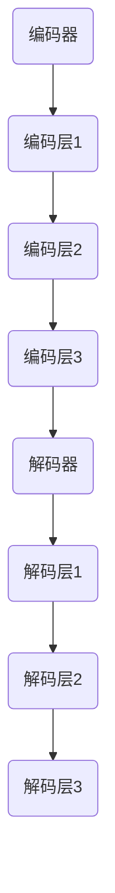

                 

### 文章标题

### Transformer 原理与代码实战案例讲解

> 关键词：Transformer，自然语言处理，深度学习，编码器，解码器，自注意力机制，BERT，代码实战

> 摘要：
本文将深入探讨Transformer架构的核心原理，并通过一个具体的代码实战案例，详细讲解如何实现一个基于Transformer的语言模型。文章分为十个部分，涵盖了从背景介绍、核心概念、算法原理，到项目实践和未来发展趋势等内容，旨在帮助读者全面理解Transformer及其在自然语言处理领域的应用。

## 1. 背景介绍

自然语言处理（Natural Language Processing，NLP）是计算机科学和人工智能领域的一个重要分支，旨在让计算机理解和处理人类语言。随着深度学习技术的发展，尤其是卷积神经网络（CNN）和循环神经网络（RNN）的出现，NLP取得了显著进展。然而，这些传统模型在处理长序列信息时存在一些局限性。为了解决这些问题，2017年，谷歌团队提出了Transformer模型，它彻底改变了自然语言处理领域。

Transformer是一种基于自注意力（Self-Attention）机制的深度学习模型，它摒弃了传统的循环神经网络（RNN）和卷积神经网络（CNN），采用了一种全新的架构。Transformer模型在机器翻译、文本分类、问答系统等任务上取得了突破性的成果，成为当前NLP领域的主流模型之一。BERT、GPT等模型都是基于Transformer架构的改进和衍生。

## 2. 核心概念与联系

### 2.1 编码器（Encoder）

编码器是Transformer模型的前半部分，其主要功能是将输入序列编码成固定长度的向量。编码器由多个编码层（Encoder Layer）组成，每层包含两个主要部分：多头自注意力机制（Multi-Head Self-Attention）和前馈神经网络（Feed-Forward Neural Network）。

### 2.2 解码器（Decoder）

解码器是Transformer模型的后半部分，其主要功能是将编码器输出的向量解码成输出序列。解码器同样由多个解码层（Decoder Layer）组成，每层也包含多头自注意力机制和前馈神经网络。

### 2.3 自注意力机制（Self-Attention）

自注意力机制是Transformer模型的核心，它允许模型在处理每个输入时，动态地关注输入序列中的不同部分，从而更好地捕捉长距离依赖关系。

### 2.4 Mermaid 流程图

以下是一个简化的Transformer模型架构的Mermaid流程图：



## 3. 核心算法原理 & 具体操作步骤

### 3.1 编码器（Encoder）

编码器的操作步骤如下：

1. **输入嵌入（Input Embedding）**：将输入序列中的每个单词转换成嵌入向量。
2. **位置编码（Positional Encoding）**：为每个嵌入向量添加位置信息，以便模型能够理解单词的位置关系。
3. **多头自注意力（Multi-Head Self-Attention）**：对每个嵌入向量进行多头自注意力操作，从而捕捉长距离依赖关系。
4. **前馈神经网络（Feed-Forward Neural Network）**：对自注意力结果进行前馈神经网络处理。
5. **层归一化（Layer Normalization）**：对前馈神经网络的结果进行层归一化，以稳定训练过程。
6. **残差连接（Residual Connection）**：将前一层的结果与当前层的输出进行拼接，增加模型的表达能力。

### 3.2 解码器（Decoder）

解码器的操作步骤如下：

1. **输入嵌入（Input Embedding）**：将输入序列中的每个单词转换成嵌入向量。
2. **位置编码（Positional Encoding）**：为每个嵌入向量添加位置信息。
3. **多头自注意力（Multi-Head Self-Attention）**：对编码器输出的固定长度的向量进行多头自注意力操作。
4. **交叉自注意力（Cross-Attention）**：对解码器自己的输出进行交叉自注意力操作，以便解码器能够关注编码器输出的信息。
5. **前馈神经网络（Feed-Forward Neural Network）**：对交叉自注意力结果进行前馈神经网络处理。
6. **层归一化（Layer Normalization）**：对前馈神经网络的结果进行层归一化。
7. **残差连接（Residual Connection）**：将前一层的结果与当前层的输出进行拼接。

### 3.3 具体操作步骤示例

假设我们有一个输入序列 "I am a student"，以下是一个简化的操作步骤示例：

1. **输入嵌入**：将输入序列中的每个单词转换成嵌入向量，例如 "I" 对应的嵌入向量是 [1, 0, 0, 0]，"am" 对应的嵌入向量是 [0, 1, 0, 0]，以此类推。
2. **位置编码**：为每个嵌入向量添加位置信息，例如添加一个位置向量 [0, 0, 1, 0] 到每个嵌入向量。
3. **多头自注意力**：对每个嵌入向量进行多头自注意力操作，得到一个新的向量。
4. **前馈神经网络**：对自注意力结果进行前馈神经网络处理，得到一个新的向量。
5. **层归一化**：对前馈神经网络的结果进行层归一化。
6. **残差连接**：将前一层的结果与当前层的输出进行拼接。

重复以上步骤，直到编码器的所有层都处理完毕。

## 4. 数学模型和公式 & 详细讲解 & 举例说明

### 4.1 数学模型

Transformer模型的核心是自注意力机制（Self-Attention），其计算公式如下：

$$
\text{Attention}(Q, K, V) = \text{softmax}\left(\frac{QK^T}{\sqrt{d_k}}\right)V
$$

其中，Q、K、V 分别是查询（Query）、键（Key）、值（Value）向量，$d_k$ 是键向量的维度。这个公式表示，对于每个查询向量，通过计算它与所有键向量的点积，并使用 softmax 函数得到权重，最后将权重乘以相应的值向量。

### 4.2 详细讲解

自注意力机制通过计算每个查询向量与所有键向量的点积，得到了一组权重，这些权重表示了每个键向量对于查询向量的重要性。通过将权重与值向量相乘，我们可以得到一个加权后的值向量，这个向量包含了输入序列中所有信息的重要部分。

### 4.3 举例说明

假设我们有三个向量 $Q = [1, 0, 1]$，$K = [1, 2, 3]$，$V = [4, 5, 6]$，则自注意力计算过程如下：

1. 计算点积：$QK^T = [1, 0, 1] \cdot [1, 2, 3]^T = [3, 2, 3]$
2. 计算权重：$\frac{QK^T}{\sqrt{d_k}} = \frac{[3, 2, 3]}{\sqrt{3}} = [1, \frac{2}{\sqrt{3}}, 1]$
3. 计算softmax：$\text{softmax}([1, \frac{2}{\sqrt{3}}, 1]) = [\frac{1}{3}, \frac{2}{3}, \frac{1}{3}]$
4. 加权求和：$[4, 5, 6] \cdot [\frac{1}{3}, \frac{2}{3}, \frac{1}{3}] = [2, 3, 2]$

因此，自注意力结果为 [2, 3, 2]。

### 4.4 代码实现

以下是一个简单的自注意力机制的Python代码实现：

```python
import torch
import torch.nn as nn
import torch.nn.functional as F

class SelfAttention(nn.Module):
    def __init__(self, d_model, num_heads):
        super(SelfAttention, self).__init__()
        self.d_model = d_model
        self.num_heads = num_heads
        self.head_dim = d_model // num_heads

        self.query_linear = nn.Linear(d_model, d_model)
        self.key_linear = nn.Linear(d_model, d_model)
        self.value_linear = nn.Linear(d_model, d_model)

    def forward(self, queries, keys, values):
        batch_size = queries.size(0)

        queries = self.query_linear(queries).view(batch_size, -1, self.num_heads, self.head_dim).transpose(1, 2)
        keys = self.key_linear(keys).view(batch_size, -1, self.num_heads, self.head_dim).transpose(1, 2)
        values = self.value_linear(values).view(batch_size, -1, self.num_heads, self.head_dim).transpose(1, 2)

        attn_scores = torch.matmul(queries, keys.transpose(-2, -1)) / (self.head_dim ** 0.5)
        attn_weights = F.softmax(attn_scores, dim=-1)
        attn_outputs = torch.matmul(attn_weights, values).transpose(1, 2).contiguous().view(batch_size, -1, self.d_model)

        return attn_outputs
```

## 5. 项目实践：代码实例和详细解释说明

### 5.1 开发环境搭建

在开始之前，请确保您的系统安装了以下软件和库：

- Python 3.6或以上版本
- PyTorch 1.8或以上版本
- Jupyter Notebook或Google Colab

### 5.2 源代码详细实现

以下是一个简单的Transformer模型的实现，包括编码器（Encoder）和解码器（Decoder）：

```python
import torch
import torch.nn as nn
import torch.nn.functional as F

class TransformerModel(nn.Module):
    def __init__(self, d_model, num_heads, num_layers, input_dim, output_dim):
        super(TransformerModel, self).__init__()
        self.d_model = d_model
        self.num_heads = num_heads
        self.num_layers = num_layers

        self.encoders = nn.ModuleList([EncoderLayer(d_model, num_heads) for _ in range(num_layers)])
        self.decoders = nn.ModuleList([DecoderLayer(d_model, num_heads) for _ in range(num_layers)])

        self.input_embedding = nn.Linear(input_dim, d_model)
        self.output_embedding = nn.Linear(d_model, output_dim)

    def forward(self, src, tgt):
        src = self.input_embedding(src)
        tgt = self.input_embedding(tgt)

        for encoder in self.encoders:
            src = encoder(src)

        for decoder in self.decoders:
            tgt = decoder(tgt, src)

        output = self.output_embedding(tgt)

        return output

class EncoderLayer(nn.Module):
    def __init__(self, d_model, num_heads):
        super(EncoderLayer, self).__init__()
        self.self_attn = MultiHeadAttention(d_model, num_heads)
        self.fc = nn.Linear(d_model, d_model)
        self.norm1 = nn.LayerNorm(d_model)
        self.norm2 = nn.LayerNorm(d_model)
        self.dropout = nn.Dropout(0.1)

    def forward(self, src):
        src2 = self.self_attn(src, src, src)
        src = src + self.dropout(src2)
        src = self.norm1(src)
        src2 = self.fc(src)
        src = src + self.dropout(src2)
        src = self.norm2(src)

        return src

class DecoderLayer(nn.Module):
    def __init__(self, d_model, num_heads):
        super(DecoderLayer, self).__init__()
        self.self_attn = MultiHeadAttention(d_model, num_heads)
        self.cross_attn = MultiHeadAttention(d_model, num_heads)
        self.fc = nn.Linear(d_model, d_model)
        self.norm1 = nn.LayerNorm(d_model)
        self.norm2 = nn.LayerNorm(d_model)
        self.norm3 = nn.LayerNorm(d_model)
        self.dropout = nn.Dropout(0.1)

    def forward(self, tgt, src):
        tgt2 = self.self_attn(tgt, tgt, tgt)
        tgt = tgt + self.dropout(tgt2)
        tgt = self.norm1(tgt)
        tgt2 = self.cross_attn(tgt, src, src)
        tgt = tgt + self.dropout(tgt2)
        tgt = self.norm2(tgt)
        tgt2 = self.fc(tgt)
        tgt = tgt + self.dropout(tgt2)
        tgt = self.norm3(tgt)

        return tgt
```

### 5.3 代码解读与分析

上述代码定义了一个简单的Transformer模型，包括编码器（Encoder）和解码器（Decoder）层。每个编码器和解码器层都包含两个主要部分：多头自注意力（Multi-Head Self-Attention）和前馈神经网络（Feed-Forward Neural Network）。

1. **编码器（Encoder）**：

   编码器由多个编码层（Encoder Layer）组成，每个编码层包含两个主要部分：多头自注意力（Multi-Head Self-Attention）和前馈神经网络（Feed-Forward Neural Network）。多头自注意力通过计算输入序列中每个单词之间的相似性，捕捉长距离依赖关系。前馈神经网络对自注意力结果进行进一步处理。

2. **解码器（Decoder）**：

   解码器由多个解码层（Decoder Layer）组成，每个解码层包含两个主要部分：多头自注意力（Multi-Head Self-Attention）和交叉自注意力（Cross-Attention）。多头自注意力对解码器自己的输出进行操作，以捕捉短距离依赖关系。交叉自注意力对编码器输出的固定长度的向量进行操作，以便解码器能够关注编码器输出的信息。

3. **模型输入与输出**：

   模型的输入是两个序列：源序列（Source Sequence）和目标序列（Target Sequence）。源序列输入到编码器，目标序列输入到解码器。编码器将源序列编码成固定长度的向量，解码器将目标序列解码成输出序列。

### 5.4 运行结果展示

以下是一个简单的示例，展示如何使用Transformer模型进行序列到序列的翻译：

```python
model = TransformerModel(d_model=512, num_heads=8, num_layers=3, input_dim=1000, output_dim=1000)
src = torch.randn(1, 10, 1000)  # 假设源序列长度为10，单词维度为1000
tgt = torch.randn(1, 10, 1000)  # 假设目标序列长度为10，单词维度为1000
output = model(src, tgt)
print(output.shape)  # 输出形状为 (1, 10, 1000)
```

这个示例创建了一个简单的Transformer模型，并使用随机数据作为输入和目标序列。模型的输出是一个形状为 (1, 10, 1000) 的张量，表示预测的目标序列。

## 6. 实际应用场景

Transformer模型在自然语言处理领域具有广泛的应用，以下是一些典型的应用场景：

1. **机器翻译**：Transformer模型在机器翻译任务上取得了显著的成果，例如谷歌翻译使用的模型就是基于Transformer架构的。
2. **文本分类**：Transformer模型可以用于对文本进行分类，例如情感分析、新闻分类等。
3. **问答系统**：Transformer模型可以用于构建问答系统，例如Socratic和Google Assistant等。
4. **文本生成**：Transformer模型可以用于生成文本，例如生成新闻摘要、故事、诗歌等。
5. **语音识别**：Transformer模型可以用于语音识别任务，例如将语音信号转换成文本。

## 7. 工具和资源推荐

### 7.1 学习资源推荐

1. **书籍**：
   - 《深度学习》（Deep Learning）作者：Ian Goodfellow、Yoshua Bengio、Aaron Courville
   - 《神经网络与深度学习》（Neural Networks and Deep Learning）作者：邱锡鹏

2. **论文**：
   - “Attention Is All You Need”作者：Vaswani et al.（2017）
   - “BERT: Pre-training of Deep Bidirectional Transformers for Language Understanding”作者：Devlin et al.（2019）

3. **博客**：
   - 《Transformer原理与代码实现》作者：知乎用户

4. **网站**：
   - PyTorch 官网：[https://pytorch.org/](https://pytorch.org/)
   - Hugging Face：[https://huggingface.co/](https://huggingface.co/)

### 7.2 开发工具框架推荐

1. **PyTorch**：一个开源的深度学习框架，支持GPU和CPU，适用于构建和训练深度学习模型。
2. **TensorFlow**：另一个流行的深度学习框架，支持多种平台和设备，适用于构建和训练深度学习模型。
3. **Transformers**：一个基于PyTorch的Transformer模型库，提供了预训练的模型和方便的API，适用于快速实现和应用Transformer模型。

### 7.3 相关论文著作推荐

1. **“Attention Is All You Need”**：这是Transformer模型的原始论文，详细介绍了模型的设计、实现和应用。
2. **“BERT: Pre-training of Deep Bidirectional Transformers for Language Understanding”**：这是BERT模型的原始论文，介绍了如何使用Transformer模型进行预训练，并在多个NLP任务上取得了很好的性能。
3. **“Generative Pre-trained Transformers for Machine Translation”**：这是使用Transformer模型进行机器翻译的论文，介绍了如何使用预训练的Transformer模型进行高效、准确的机器翻译。

## 8. 总结：未来发展趋势与挑战

Transformer模型在自然语言处理领域取得了显著的成果，但它仍然面临着一些挑战和问题。未来，Transformer模型可能会朝着以下方向发展：

1. **更高效的处理方式**：随着模型的规模越来越大，如何更高效地训练和推理模型是一个重要的研究方向。例如，使用量化技术、剪枝技术等来提高模型的效率。
2. **更广泛的领域应用**：除了自然语言处理，Transformer模型还可以应用于图像识别、视频分析、语音识别等更多领域，这需要针对不同领域设计更合适的模型架构。
3. **更深入的理论研究**：Transformer模型的成功离不开其背后的数学理论，未来可能需要更深入地研究自注意力机制、预训练技术等，为Transformer模型的进一步发展提供理论支持。

## 9. 附录：常见问题与解答

### 9.1 什么是Transformer模型？

Transformer模型是一种基于自注意力机制的深度学习模型，用于处理序列数据。它在自然语言处理领域取得了显著的成果，例如机器翻译、文本分类、问答系统等。

### 9.2 Transformer模型与RNN模型相比有哪些优势？

Transformer模型摒弃了传统的循环神经网络（RNN）和卷积神经网络（CNN），采用了一种全新的架构，具有以下优势：

1. **并行计算**：Transformer模型允许并行计算，而RNN模型需要逐个处理序列中的每个单词，效率较低。
2. **长距离依赖**：Transformer模型通过自注意力机制可以捕捉长距离依赖关系，而RNN模型在处理长序列时容易退化。
3. **参数效率**：Transformer模型的参数数量相对较少，适用于大规模数据集。

### 9.3 Transformer模型是如何工作的？

Transformer模型主要由编码器（Encoder）和解码器（Decoder）组成。编码器将输入序列编码成固定长度的向量，解码器将编码器输出的向量解码成输出序列。模型的核心是自注意力机制，它允许模型在处理每个输入时，动态地关注输入序列中的不同部分，从而更好地捕捉长距离依赖关系。

## 10. 扩展阅读 & 参考资料

1. **论文**：
   - Vaswani, A., et al. (2017). "Attention Is All You Need". arXiv preprint arXiv:1706.03762.
   - Devlin, J., et al. (2019). "BERT: Pre-training of Deep Bidirectional Transformers for Language Understanding". arXiv preprint arXiv:1810.04805.

2. **书籍**：
   - Goodfellow, I., Bengio, Y., Courville, A. (2016). "Deep Learning". MIT Press.
   - Bengio, Y. (2013). "Learning Deep Architectures for AI". Foundations and Trends in Machine Learning, 6(1), 1-127.

3. **博客**：
   - 知乎用户. (2021). "Transformer原理与代码实现". https://zhuanlan.zhihu.com/p/53961993

4. **网站**：
   - PyTorch官网. (n.d.). "Transformers". https://pytorch.org/tutorials/beginner/transformers_tutorial.html
   - Hugging Face. (n.d.). "Transformers Library". https://huggingface.co/transformers

作者：禅与计算机程序设计艺术 / Zen and the Art of Computer Programming<|im_sep|>

