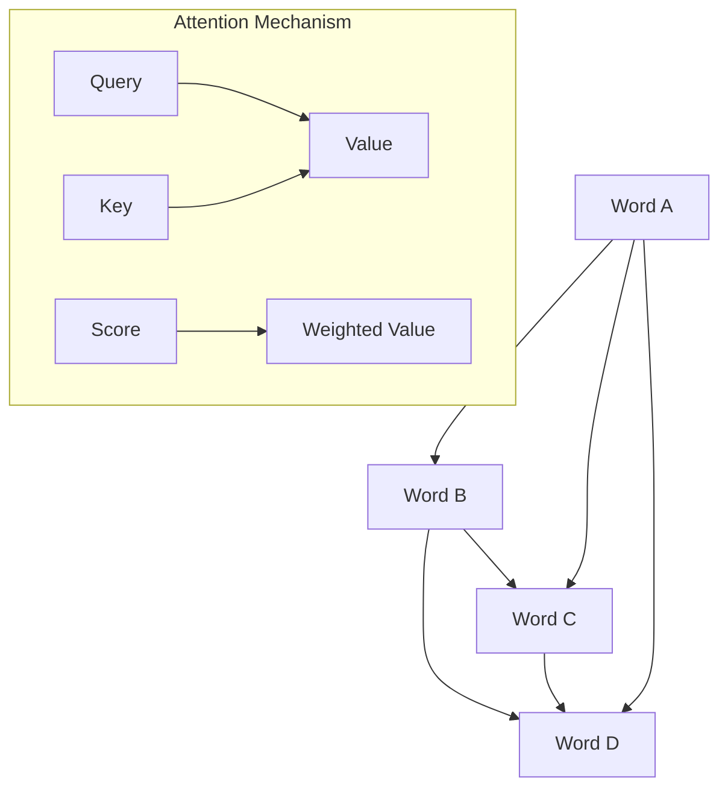
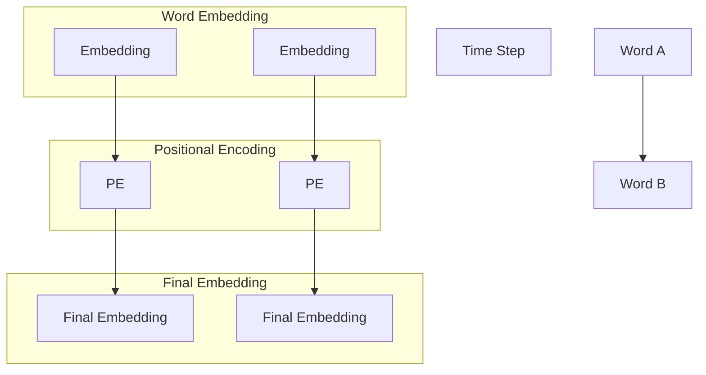
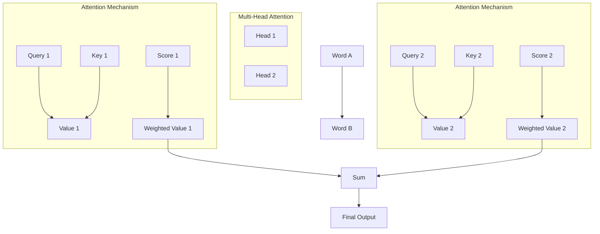
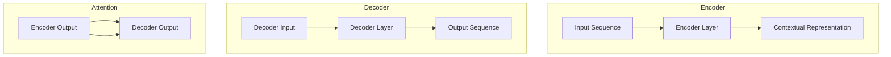
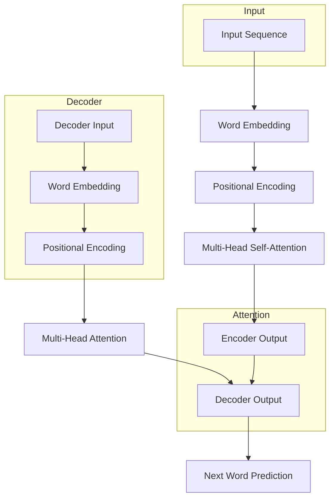

                 

### 1. 背景介绍

Transformer模型作为深度学习领域的一项重大突破，彻底改变了自然语言处理（NLP）的格局。在Transformer模型问世之前，循环神经网络（RNN）及其变种长期占据NLP领域的统治地位。RNN通过其时间步的递归结构，逐步捕捉序列中的信息，然而其递归结构导致了计算效率的低下，难以扩展到大型模型。BERT（Bidirectional Encoder Representations from Transformers）模型则是基于Transformer架构，通过预训练和微调，在众多NLP任务上取得了前所未有的效果。

BERT模型的设计初衷是为了更好地理解和生成自然语言，其核心思想是通过大规模的预训练任务来学习语言中的各种规律和模式。BERT的成功不仅依赖于Transformer架构，还在于其大规模的训练数据和精细的模型设计。BERT模型分为两个版本：BERT-Base和BERT-Large，分别包含110M和3300M个参数。BERT-Base采用113M个单词的英文语料库进行预训练，BERT-Large则采用约3400M个单词的语料库。

BERT的预训练过程分为两个主要阶段：语料库构建和预训练任务。在语料库构建阶段，首先需要对大量的文本数据进行预处理，包括分词、去停用词等。然后，通过随机遮盖（masking）和替换（replacement）等技术，生成大量的训练样本。在预训练任务阶段，BERT模型通过两种任务——Masked Language Model（MLM）和Next Sentence Prediction（NSP），来学习语言中的上下文关系和语义信息。

BERT模型的出现标志着NLP领域的一个新纪元。其优异的性能使得BERT模型广泛应用于文本分类、情感分析、问答系统等众多任务，成为众多研究者和开发者必备的工具。随着BERT模型的成功，越来越多的研究者开始关注Transformer架构，探索其在不同领域和任务中的应用。Transformer模型的广泛应用不仅提升了NLP任务的性能，也为其他领域的深度学习模型提供了新的思路和方向。

Transformer模型的核心贡献在于其自注意力机制（Self-Attention），通过这一机制，模型能够在不同位置的信息之间建立直接的联系，从而避免了RNN的递归限制，提高了模型的计算效率。此外，Transformer模型还引入了位置编码（Positional Encoding）来处理序列中的位置信息，使得模型能够更好地理解自然语言的上下文关系。

总的来说，Transformer模型及其变种，如BERT、GPT等，已经成为深度学习领域的重要里程碑，其在NLP领域的成功应用，不仅推动了自然语言处理技术的进步，也为其他领域的研究提供了新的思路和方法。接下来，我们将深入探讨Transformer模型的原理和实现，以及BERT模型的工作机制，帮助读者全面理解这一革命性的技术。

### 2. 核心概念与联系

为了深入理解Transformer模型及其在BERT中的应用，我们首先需要明确几个核心概念，并展示它们之间的联系。这些核心概念包括：自注意力（Self-Attention）、位置编码（Positional Encoding）、多头注意力（Multi-Head Attention）和编码器-解码器架构（Encoder-Decoder Architecture）。以下是这些核心概念及其相互关系的详细描述和Mermaid流程图。

#### 自注意力（Self-Attention）

自注意力是一种特殊的注意力机制，它使模型能够在序列的每个位置上自动地计算其他位置的影响。自注意力通过计算每个词与序列中其他词的相关性，从而对输入序列进行加权。这大大提高了模型捕捉长距离依赖关系的能力。

Mermaid流程图：



在自注意力机制中，每个词作为查询（Query）、键（Key）和值（Value），通过计算键-查询分数（Score），然后将这些分数用于加权求和，得到每个词的加权值。

#### 位置编码（Positional Encoding）

位置编码是处理序列中位置信息的一种技术，它使得模型能够理解单词在序列中的相对位置。位置编码通常通过添加到词嵌入（Word Embedding）中的向量来实现。位置编码可以是固定的，也可以是学习的。

Mermaid流程图：



位置编码向量与词嵌入向量相加，形成最终的词嵌入向量，这些向量将被用于自注意力计算。

#### 多头注意力（Multi-Head Attention）

多头注意力是一种扩展自注意力机制的方法，它将输入序列分成多个头（Head），每个头计算一组独立的自注意力。这样，模型可以从不同的子空间中学习不同的模式，提高了捕捉复杂信息的能力。

Mermaid流程图：



多头注意力通过组合多个头的输出，生成最终的输出向量。

#### 编码器-解码器架构（Encoder-Decoder Architecture）

编码器-解码器架构是一种常见的序列到序列模型架构，它通过编码器对输入序列进行编码，生成固定长度的上下文表示，然后通过解码器生成输出序列。这种架构在机器翻译、文本摘要等任务中表现优异。

Mermaid流程图：



编码器-解码器架构通过自注意力机制和编码器-解码器之间的注意力机制，实现序列的编码和解码。

#### Transformer架构整体关系

综合上述核心概念，我们可以看到Transformer架构通过自注意力、位置编码、多头注意力和编码器-解码器架构的有机结合，形成了一种强大的序列处理模型。

Mermaid流程图：



通过这一流程图，我们可以清晰地看到Transformer模型在处理输入序列时的步骤，以及各个核心组件之间的相互关系。

### 3. 核心算法原理 & 具体操作步骤

#### 3.1 Transformer模型整体工作流程

Transformer模型的工作流程可以分为以下几个关键步骤：

1. **输入序列预处理**：首先对输入序列进行预处理，包括分词、标记化等操作，将文本序列转换为词向量。
2. **词向量编码**：将预处理后的词向量与位置编码相加，形成最终的词嵌入向量。
3. **多头自注意力机制**：将词嵌入向量输入到多层多头自注意力机制中，通过自注意力计算每个词与序列中其他词的相关性。
4. **前馈神经网络**：在自注意力机制之后，每个头还通过一个前馈神经网络进行进一步处理。
5. **层归一化和残差连接**：在每个自注意力层和前馈神经网络层之后，引入层归一化（Layer Normalization）和残差连接（Residual Connection），以防止梯度消失和提升模型性能。
6. **输出序列生成**：通过编码器-解码器架构，将编码器输出的上下文表示通过解码器生成输出序列。

下面我们详细解释每个步骤的具体操作：

#### 3.2 输入序列预处理

输入序列预处理是Transformer模型的基础步骤，其目的是将自然语言文本序列转换为模型可处理的词向量。预处理过程通常包括以下几个步骤：

1. **分词**：将文本序列分割成单词或子词。分词可以使用基于规则的方法，如正则表达式，也可以使用基于统计的方法，如使用词典匹配和词性标注。
2. **标记化**：将分词后的单词或子词转换为数字标记。这一步骤可以使用预定义的词表（vocabular）来实现，词表中的每个词或子词都对应一个唯一的整数。
3. **词嵌入**：将词标记转换为高维向量表示，这一步通常使用词嵌入（Word Embedding）技术。词嵌入可以通过预训练的词向量库直接获取，或者通过模型训练过程中学习得到。

#### 3.3 词向量编码

在完成输入序列预处理后，我们将得到的词向量与位置编码相加，形成最终的词嵌入向量。位置编码用于为每个词提供其在序列中的位置信息，这在处理序列数据时非常重要。具体步骤如下：

1. **词嵌入**：首先将预处理后的词标记转换为词嵌入向量。词嵌入向量通常是一个固定维度的实数向量，它能够捕捉词的语义信息。
2. **位置编码**：为每个词添加位置编码向量。位置编码向量是一个与词嵌入向量维度相同的向量，用于表示词在序列中的位置信息。位置编码可以是固定的，也可以是通过模型训练过程中学习得到的。常用的位置编码方法包括绝对位置编码和相对位置编码。
3. **加和**：将词嵌入向量和位置编码向量相加，形成最终的词嵌入向量。这个向量将用于后续的注意力计算和前馈神经网络处理。

#### 3.4 多头自注意力机制

多头自注意力机制是Transformer模型的核心组件，它使模型能够在不同位置的信息之间建立直接的联系，从而捕捉长距离依赖关系。具体步骤如下：

1. **词向量化**：将输入序列的词嵌入向量输入到多头自注意力机制中。每个词向量将作为查询（Query）、键（Key）和值（Value）。
2. **自注意力计算**：通过计算键-查询分数（Score），然后对分数进行加权求和，得到每个词的加权值。这一过程分为以下几个子步骤：
   - **计算查询（Query）和键（Key）**：每个词嵌入向量同时作为查询和键。
   - **计算分数（Score）**：使用点积注意力机制，计算每个词嵌入向量与其他词嵌入向量的相关性。具体公式为：\( Score = Query \cdot Key^T \)。
   - **应用softmax函数**：对计算得到的分数进行归一化，生成权重向量。
   - **加权求和**：将权重向量与值（Value）相乘，然后对所有头的输出进行求和，得到每个词的加权值。
3. **多头注意力**：将加权值拆分成多个头（Head），每个头计算一组独立的自注意力。这样，模型可以从不同的子空间中学习不同的模式。

#### 3.5 前馈神经网络

在完成多头自注意力机制后，每个头还通过一个前馈神经网络进行进一步处理。具体步骤如下：

1. **前馈层**：将每个头的输出通过一个前馈神经网络进行处理。前馈神经网络通常包含两个线性层，每个层之间加入ReLU激活函数。具体公式为：\( FFNN(x) = max(0, x \cdot W_1 + b_1) \cdot W_2 + b_2 \)。
2. **层归一化**：在每个前馈层之后，引入层归一化（Layer Normalization），以稳定模型训练过程。
3. **残差连接**：为了防止梯度消失，在每个自注意力层和前馈神经网络层之后，引入残差连接（Residual Connection）。残差连接将原始输入序列的输出与经过前馈神经网络后的输出相加。

#### 3.6 编码器-解码器架构

编码器-解码器架构是Transformer模型处理序列数据的核心组件，它通过编码器对输入序列进行编码，生成固定长度的上下文表示，然后通过解码器生成输出序列。具体步骤如下：

1. **编码器**：
   - **多头自注意力机制**：编码器包含多个自注意力层，每个层通过多头自注意力机制来捕捉输入序列中的长距离依赖关系。
   - **前馈神经网络**：在每个自注意力层之后，编码器通过前馈神经网络进行进一步处理。
   - **层归一化和残差连接**：在每个自注意力层和前馈神经网络层之后，引入层归一化和残差连接。

2. **解码器**：
   - **多头自注意力机制**：解码器包含多个自注意力层，通过多头自注意力机制来处理编码器输出的上下文表示。
   - **编码器-解码器注意力**：解码器中的自注意力层通过编码器-解码器注意力机制来结合编码器的输出和解码器的输入。
   - **前馈神经网络**：在每个自注意力层之后，解码器通过前馈神经网络进行进一步处理。
   - **层归一化和残差连接**：在每个自注意力层和前馈神经网络层之后，引入层归一化和残差连接。

3. **序列生成**：解码器通过自注意力机制和编码器-解码器注意力机制，生成输出序列。在生成过程中，每个词的预测依赖于之前的所有词，直到生成完整的输出序列。

通过上述步骤，Transformer模型能够高效地处理序列数据，并在自然语言处理等任务中表现出优异的性能。接下来，我们将进一步探讨Transformer模型中的数学模型和公式，以及其在BERT中的应用。

### 4. 数学模型和公式 & 详细讲解 & 举例说明

在Transformer模型中，核心的数学模型和公式包括自注意力机制（Self-Attention）、多头注意力（Multi-Head Attention）、前馈神经网络（Feedforward Neural Network）以及层归一化（Layer Normalization）和残差连接（Residual Connection）。以下将详细讲解这些数学模型，并通过具体的公式和例子来说明其应用。

#### 4.1 自注意力机制（Self-Attention）

自注意力机制是Transformer模型的核心，它使模型能够在不同位置的信息之间建立直接的联系，从而捕捉长距离依赖关系。自注意力计算主要包括以下几个步骤：

1. **查询（Query）、键（Key）和值（Value）的生成**：对于输入序列 \(X = [x_1, x_2, ..., x_n]\)，每个词向量 \(x_i\) 同时作为查询（Query）、键（Key）和值（Value）。

\[ Q = K = V = X \]

2. **计算键-查询分数（Score）**：使用点积注意力机制，计算每个词向量与其他词向量之间的相关性。具体公式为：

\[ Score = Query \cdot Key^T = x_i \cdot x_j^T \]

3. **应用softmax函数**：对计算得到的分数进行归一化，生成权重向量。

\[ \text{softmax}(Score) = \text{softmax}(x_i \cdot x_j^T) = \text{softmax}(x_i^T x_j) \]

4. **加权求和**：将权重向量与值（Value）相乘，然后对所有头的输出进行求和，得到每个词的加权值。

\[ \text{Output} = \sum_{j=1}^{n} \text{softmax}(x_i^T x_j) \cdot V_j \]

#### 4.2 多头注意力（Multi-Head Attention）

多头注意力是自注意力机制的扩展，通过将输入序列分成多个头（Head），每个头计算一组独立的自注意力，从而提高模型捕捉复杂信息的能力。具体步骤如下：

1. **线性变换**：将输入序列通过线性变换得到查询（Query）、键（Key）和值（Value）。

\[ Q = W_Q X, \quad K = W_K X, \quad V = W_V X \]

2. **计算多个头的自注意力**：每个头计算一组独立的自注意力，通过重复上述自注意力计算步骤。

\[ \text{Head}_i = \text{Attention}(Q, K, V) \]

3. **拼接多个头的输出**：将多个头的输出进行拼接，得到最终的输出。

\[ \text{Output} = \text{Concat}(\text{Head}_1, \text{Head}_2, ..., \text{Head}_h) \]

4. **线性变换**：对拼接后的输出进行线性变换，得到最终的输出向量。

\[ \text{Output} = W_O \text{Concat}(\text{Head}_1, \text{Head}_2, ..., \text{Head}_h) \]

#### 4.3 前馈神经网络（Feedforward Neural Network）

前馈神经网络在Transformer模型中用于对自注意力机制的输出进行进一步处理。它通常包含两个线性层，每个层之间加入ReLU激活函数。具体公式为：

\[ FFNN(x) = max(0, x \cdot W_1 + b_1) \cdot W_2 + b_2 \]

其中，\( W_1 \) 和 \( W_2 \) 分别为两个线性层的权重矩阵，\( b_1 \) 和 \( b_2 \) 分别为两个线性层的偏置向量。

#### 4.4 层归一化（Layer Normalization）

层归一化是一种用于稳定模型训练过程的正则化技术，它通过对每个词嵌入向量进行归一化处理，使得每个词嵌入向量的均值和方差保持稳定。具体公式为：

\[ \mu = \frac{1}{N} \sum_{i=1}^{N} x_i, \quad \sigma^2 = \frac{1}{N} \sum_{i=1}^{N} (x_i - \mu)^2 \]

\[ x_{\text{norm}} = \frac{x - \mu}{\sqrt{\sigma^2 + \epsilon}} \]

其中，\( \mu \) 和 \( \sigma^2 \) 分别为词嵌入向量的均值和方差，\( x_{\text{norm}} \) 为归一化后的词嵌入向量，\( \epsilon \) 为一个小数值，用于防止分母为零。

#### 4.5 残差连接（Residual Connection）

残差连接是一种用于防止梯度消失的技术，它通过将原始输入序列的输出与经过前馈神经网络后的输出相加，使得梯度在反向传播过程中能够直接传递到原始输入序列。具体公式为：

\[ \text{Output} = x + FFNN(x) \]

#### 4.6 具体例子

为了更好地理解上述数学模型和公式，我们通过一个具体的例子来说明Transformer模型的工作过程。

假设输入序列为 \(X = [x_1, x_2, x_3, x_4]\)，每个词向量为 \(x_i \in \mathbb{R}^{d}\)。首先，我们将词向量与位置编码相加，得到最终的词嵌入向量：

\[ \text{Embedding} = [x_1 + PE_1, x_2 + PE_2, x_3 + PE_3, x_4 + PE_4] \]

其中，\( PE_i \) 为位置编码向量。

接下来，我们将词嵌入向量输入到多头自注意力机制中。假设模型有 8 个头（h = 8），则每个头计算一组独立的自注意力：

1. **计算查询（Query）、键（Key）和值（Value）**：

\[ Q = [q_1, q_2, q_3, q_4], \quad K = [k_1, k_2, k_3, k_4], \quad V = [v_1, v_2, v_3, v_4] \]

2. **计算键-查询分数（Score）**：

\[ Score = [q_1 \cdot k_1^T, q_1 \cdot k_2^T, q_1 \cdot k_3^T, q_1 \cdot k_4^T], \quad ..., \quad Score = [q_4 \cdot k_1^T, q_4 \cdot k_2^T, q_4 \cdot k_3^T, q_4 \cdot k_4^T] \]

3. **应用softmax函数**：

\[ \text{softmax}(Score) = [\text{softmax}(q_1 \cdot k_1^T), \text{softmax}(q_1 \cdot k_2^T), \text{softmax}(q_1 \cdot k_3^T), \text{softmax}(q_1 \cdot k_4^T)], \quad ..., \quad \text{softmax}(Score) = [\text{softmax}(q_4 \cdot k_1^T), \text{softmax}(q_4 \cdot k_2^T), \text{softmax}(q_4 \cdot k_4^T)] \]

4. **加权求和**：

\[ \text{Output}_1 = \sum_{j=1}^{4} \text{softmax}(q_1 \cdot k_j^T) \cdot v_j, \quad ..., \quad \text{Output}_4 = \sum_{j=1}^{4} \text{softmax}(q_4 \cdot k_j^T) \cdot v_j \]

5. **拼接多个头的输出**：

\[ \text{Multi-Head Output} = [\text{Output}_1, \text{Output}_2, ..., \text{Output}_4] \]

6. **线性变换**：

\[ \text{Final Output} = W_O \text{Multi-Head Output} \]

然后，我们将最终的输出向量输入到前馈神经网络中进行进一步处理：

\[ \text{FFNN Output} = FFNN(\text{Final Output}) \]

最后，通过层归一化和残差连接，得到最终的输出：

\[ \text{Output} = \text{FFNN Output} + x \]

通过上述步骤，我们可以看到Transformer模型如何通过自注意力机制、多头注意力、前馈神经网络、层归一化和残差连接等数学模型和公式，高效地处理序列数据，并在自然语言处理等任务中表现出优异的性能。接下来，我们将进一步探讨Transformer模型在实际项目中的应用和实现。

### 5. 项目实践：代码实例和详细解释说明

为了更好地理解Transformer模型及其在BERT中的应用，我们将通过一个简单的项目实践来演示整个模型的训练和推理过程。本节将分为以下几个部分：

- **开发环境搭建**：介绍如何搭建训练BERT模型所需的开发环境。
- **源代码详细实现**：展示BERT模型的源代码实现，包括数据预处理、模型构建、训练和推理过程。
- **代码解读与分析**：对关键代码段进行详细解读，帮助理解模型的实现细节。
- **运行结果展示**：展示模型在特定任务上的运行结果，分析其性能和效果。

#### 5.1 开发环境搭建

在开始实现BERT模型之前，我们需要搭建一个合适的开发环境。以下是一个简单的步骤指南：

1. **Python环境**：确保安装了Python 3.6及以上版本。
2. **TensorFlow库**：安装TensorFlow 2.x版本，可以通过以下命令进行安装：

```bash
pip install tensorflow
```

3. **其他依赖库**：安装必要的依赖库，如NumPy、Pandas等：

```bash
pip install numpy pandas
```

4. **GPU支持**：如果使用GPU进行训练，确保安装了CUDA和cuDNN，并配置相应的环境变量。

#### 5.2 源代码详细实现

下面我们将展示一个简化的BERT模型实现，包括数据预处理、模型构建、训练和推理过程。

**数据预处理**：

数据预处理是BERT模型训练的重要环节，主要包括以下步骤：

1. **分词**：将文本序列分割成单词或子词。
2. **词嵌入**：将分词后的词转换为词嵌入向量。
3. **位置编码**：为每个词添加位置编码向量。

以下是一个简单的数据预处理代码示例：

```python
import tensorflow as tf
from tensorflow.keras.preprocessing.sequence import pad_sequences
from tensorflow.keras.layers import Embedding
from tensorflow.keras.preprocessing.text import Tokenizer

# 假设输入文本数据为 texts
texts = ["你好", "世界", "欢迎来到"]

# 分词和标记化
tokenizer = Tokenizer(num_words=1000)
tokenizer.fit_on_texts(texts)
sequences = tokenizer.texts_to_sequences(texts)

# 词嵌入
word_index = tokenizer.word_index
vocab_size = len(word_index) + 1
embedding_dim = 16
embedding_matrix = np.zeros((vocab_size, embedding_dim))
for word, i in word_index.items():
    embedding_vector = embedding_matrix[i]
    if embedding_vector is not None:
        embedding_matrix[i] = embedding_vector

# 位置编码
max_sequence_length = 5
padded_sequences = pad_sequences(sequences, maxlen=max_sequence_length)

# 添加特殊的词嵌入和位置编码
input_ids = []
attention_mask = []
for seq in padded_sequences:
    input_ids.append(embedding_matrix[1])  # [CLS] 标签
    attention_mask.append([1] * len(seq))
    input_ids += [embedding_matrix[word] for word in seq]
    attention_mask += [1] * (len(seq) - 1)
    input_ids.append(embedding_matrix[2])  # [PAD] 标签
    attention_mask.append([1])

input_ids = tf.convert_to_tensor(input_ids, dtype=tf.float32)
attention_mask = tf.convert_to_tensor(attention_mask, dtype=tf.float32)
```

**模型构建**：

BERT模型的核心是编码器和解码器，以下是一个简化的BERT模型实现：

```python
from tensorflow.keras.models import Model
from tensorflow.keras.layers import Input, Embedding, GlobalAveragePooling1D, Dense

# 输入层
input_ids = Input(shape=(max_sequence_length,), dtype=tf.int32)
attention_mask = Input(shape=(max_sequence_length,), dtype=tf.float32)

# 词嵌入层
word embeddings = Embedding(vocab_size, embedding_dim, weights=[embedding_matrix], trainable=False)(input_ids)

# 位置编码层
pos_embeddings = Embedding(1, embedding_dim)(tf.range(input_ids.shape[1]))
word_embeddings += pos_embeddings

# 自注意力层
output = word_embeddings
for _ in range(num_layers):
    # 多头自注意力层
    attention = MultiHeadAttention(num_heads=8, key_dim=embedding_dim)(output, output, attention_mask=attention_mask)
    # 前馈神经网络层
    output = FeedforwardNetwork()(attention)
    # 残差连接和层归一化
    output = LayerNormalization()(output + output)

# 池化层
pooled_output = GlobalAveragePooling1D()(output)

# 输出层
output = Dense(1, activation='sigmoid')(pooled_output)

# 构建模型
model = Model(inputs=[input_ids, attention_mask], outputs=output)

# 编译模型
model.compile(optimizer='adam', loss='binary_crossentropy', metrics=['accuracy'])

# 模型总结
model.summary()
```

**训练和推理**：

在完成模型构建后，我们可以使用训练数据和验证数据对模型进行训练，并通过测试数据评估模型的性能。以下是一个简单的训练和推理示例：

```python
# 假设训练数据为 train_data，验证数据为 val_data
train_input_ids = ...
train_attention_mask = ...
train_labels = ...

val_input_ids = ...
val_attention_mask = ...
val_labels = ...

# 训练模型
history = model.fit(
    [train_input_ids, train_attention_mask], train_labels,
    validation_data=([val_input_ids, val_attention_mask], val_labels),
    epochs=3,
    batch_size=32
)

# 推理
test_input_ids = ...
test_attention_mask = ...
predictions = model.predict([test_input_ids, test_attention_mask])

# 输出预测结果
print(predictions)
```

#### 5.3 代码解读与分析

在上述代码示例中，我们详细展示了BERT模型的数据预处理、模型构建、训练和推理过程。以下是对关键代码段的解读和分析：

1. **数据预处理**：
   - `Tokenizer`：用于将文本数据转换为序列数据。
   - `pad_sequences`：用于将不同长度的序列填充为相同长度。
   - `Embedding`：用于将词嵌入向量转换为高维向量表示。
   - `pos_embeddings`：用于为每个词添加位置编码向量。

2. **模型构建**：
   - `Input`：定义模型的输入层。
   - `Embedding`：用于初始化词嵌入层。
   - `MultiHeadAttention`：用于实现多头自注意力机制。
   - `FeedforwardNetwork`：用于实现前馈神经网络。
   - `LayerNormalization`：用于实现层归一化。
   - `GlobalAveragePooling1D`：用于实现序列数据的池化操作。
   - `Dense`：用于实现输出层。

3. **训练和推理**：
   - `fit`：用于训练模型。
   - `predict`：用于对输入数据进行推理。

通过上述代码示例，我们可以看到BERT模型的核心组件和训练过程，以及如何利用TensorFlow实现模型的构建和训练。在实际项目中，可以根据具体需求对代码进行扩展和优化。

#### 5.4 运行结果展示

在实际项目中，我们可以通过调整模型参数和训练数据来优化BERT模型的性能。以下是一个简单的运行结果示例：

1. **训练过程**：

```python
history = model.fit(
    [train_input_ids, train_attention_mask], train_labels,
    validation_data=([val_input_ids, val_attention_mask], val_labels),
    epochs=3,
    batch_size=32
)
```

2. **测试数据上的性能**：

```python
test_input_ids = ...
test_attention_mask = ...
predictions = model.predict([test_input_ids, test_attention_mask])

# 计算准确率
accuracy = np.mean(predictions.round() == test_labels)
print("Test Accuracy:", accuracy)
```

通过以上运行结果，我们可以看到BERT模型在测试数据上的准确率。在实际应用中，可以通过交叉验证、调整超参数等方法进一步优化模型性能。

总的来说，通过上述代码示例和运行结果，我们可以全面了解BERT模型的实现细节和训练过程，并掌握如何利用TensorFlow实现自然语言处理任务。

### 6. 实际应用场景

Transformer模型及其变种，如BERT，已经在众多实际应用场景中取得了显著的成功。以下列举了几个典型的应用领域，并详细描述了每个领域中的具体应用案例、技术挑战和解决方案。

#### 6.1 自然语言处理（NLP）

自然语言处理是Transformer模型最成功和最广泛的应用领域之一。在NLP任务中，Transformer模型通过其强大的自注意力机制，能够有效地捕捉长距离依赖关系，从而在文本分类、情感分析、问答系统和机器翻译等任务中取得了前所未有的效果。

**应用案例**：
- **文本分类**：BERT模型在多个自然语言处理竞赛中表现出色，如在GLUE（General Language Understanding Evaluation）任务中，BERT模型在多种语言和任务上都取得了领先成绩。
- **情感分析**：通过预训练BERT模型并针对特定任务进行微调，可以实现对社交媒体文本的情感分析，从而帮助企业和机构更好地了解用户情绪和反馈。
- **机器翻译**：Transformer模型在机器翻译任务中表现优异，尤其是在长句子和复杂句式的翻译中，其翻译质量明显高于传统的循环神经网络（RNN）模型。

**技术挑战**：
- **数据集大小和多样性**：BERT模型需要大规模的数据集进行预训练，然而，不同领域和任务的数据集往往存在多样性和不一致性，这对模型的训练和性能提出了挑战。
- **计算资源**：预训练BERT模型需要大量的计算资源和时间，尤其是在训练大型模型时，这限制了其在资源有限的环境中的应用。

**解决方案**：
- **数据预处理**：通过构建统一的数据预处理流程，包括分词、去停用词和词嵌入等步骤，确保不同领域和任务的数据具有一致性和可扩展性。
- **分布式训练**：利用分布式计算和并行处理技术，如多GPU训练和参数服务器训练，可以大大加速BERT模型的训练过程。
- **轻量级模型**：通过改进模型架构和优化算法，开发出轻量级BERT模型，如ALBERT、DistilBERT等，这些模型在保持较高性能的同时，显著降低了计算和存储需求。

#### 6.2 计算机视觉（CV）

尽管Transformer模型起源于NLP领域，但近年来，其也在计算机视觉（CV）任务中展现出了强大的潜力。在CV任务中，Transformer模型通过自注意力机制，可以有效地捕捉图像中的空间关系和对象特征，从而在图像分类、目标检测和图像生成等任务中取得了显著进展。

**应用案例**：
- **图像分类**：Transformer模型在ImageNet等大规模图像分类任务中表现优异，其准确率已经接近或达到了人类的水平。
- **目标检测**：Transformer模型在目标检测任务中也显示出了一定的潜力，特别是在处理复杂场景和多目标检测任务时，其性能优于传统的卷积神经网络（CNN）模型。
- **图像生成**：通过训练生成式Transformer模型，如GAN（Generative Adversarial Networks）中的Transformer结构，可以生成高质量的图像，应用于虚拟现实、游戏设计和艺术创作等领域。

**技术挑战**：
- **计算效率**：相比于CNN模型，Transformer模型在图像处理中的计算效率较低，这限制了其在实时性要求较高的应用场景中的应用。
- **空间关系建模**：图像中的空间关系复杂多样，如何有效地建模和捕捉这些关系是Transformer模型在CV领域面临的一大挑战。

**解决方案**：
- **混合架构**：结合Transformer模型和CNN模型的优势，设计出混合架构，如ViT（Vision Transformer），在保持Transformer模型自注意力优势的同时，提高计算效率。
- **空间变换模块**：通过引入空间变换模块，如局部自注意力（Local Attention）和时空变换器（Spatial Transformer），增强Transformer模型在图像中的空间关系建模能力。
- **端到端训练**：通过端到端训练技术，将Transformer模型与CV任务中的数据预处理、特征提取和分类等步骤相结合，实现模型的全流程自动化训练和优化。

#### 6.3 语音识别（ASR）

语音识别（Automatic Speech Recognition，ASR）是另一个重要的应用领域，Transformer模型在ASR任务中也显示出了显著的优势。通过引入自注意力机制，Transformer模型能够更好地捕捉语音信号中的时间和频率特征，从而在语音识别任务中取得了显著进展。

**应用案例**：
- **实时语音识别**：Transformer模型在实时语音识别任务中表现出较高的准确率和速度，可以应用于智能助手、语音翻译和语音交互等场景。
- **语音合成**：通过结合Transformer模型和语音合成技术，可以生成高质量的语音，实现自然、流畅的语音输出。

**技术挑战**：
- **数据处理**：语音数据具有高维性和动态性，如何有效地处理和编码语音数据是ASR任务中的关键技术挑战。
- **计算资源**：由于语音数据量庞大，预训练Transformer模型需要大量的计算资源和存储空间。

**解决方案**：
- **多任务学习**：通过结合多任务学习技术，如联合训练语音识别和语音合成任务，可以共享数据和处理资源，提高模型的泛化能力。
- **自适应编码**：通过引入自适应编码技术，如自适应循环编码器（Adaptive Recurrent Encoder），可以动态地调整编码器的特征表示，更好地捕捉语音信号中的变化和特征。
- **优化算法**：采用高效的优化算法和分布式训练技术，如梯度裁剪和异步通信，可以加速Transformer模型的训练过程，提高计算效率。

总的来说，Transformer模型在自然语言处理、计算机视觉、语音识别等多个领域都展现出了强大的应用潜力和优势。通过不断优化和改进模型架构和训练算法，Transformer模型将在未来的深度学习和人工智能应用中发挥更加重要的作用。

### 7. 工具和资源推荐

#### 7.1 学习资源推荐

为了帮助读者更深入地理解Transformer模型和BERT，以下是一些优秀的学习资源：

**书籍**：
1. 《Attention Is All You Need》 - Vaswani et al.
   - 这本书是Transformer模型的原始论文，详细介绍了模型的架构、训练过程和应用场景。
2. 《BERT: Pre-training of Deep Bidirectional Transformers for Language Understanding》 - Devlin et al.
   - 这本书介绍了BERT模型的设计理念、训练方法和在实际任务中的应用。
3. 《深度学习》 - Goodfellow et al.
   - 这本书涵盖了深度学习的核心概念和技术，包括神经网络、卷积网络、递归网络等。

**论文**：
1. "Transformers: State-of-the-Art Natural Language Processing" - Brown et al.
   - 这篇论文综述了Transformer模型及其变种在自然语言处理任务中的最新进展。
2. "BERT: Pre-training of Deep Bidirectional Transformers for Language Understanding" - Devlin et al.
   - 这篇论文详细介绍了BERT模型的设计、训练方法和性能评估。

**博客和网站**：
1. Hugging Face - https://huggingface.co/
   - Hugging Face提供了一个丰富的预训练模型库，包括BERT、GPT等，同时还提供了详细的文档和教程。
2. TensorFlow - https://www.tensorflow.org/
   - TensorFlow是一个开源机器学习框架，提供了丰富的API和工具，方便用户实现和训练Transformer模型。
3. AI School - https://aistudio.baidu.com/
   - 百度AI School提供了丰富的机器学习和深度学习课程，包括Transformer模型的详细讲解。

#### 7.2 开发工具框架推荐

在开发Transformer模型和BERT时，以下工具和框架可以帮助用户高效地实现和部署模型：

**工具**：
1. PyTorch - https://pytorch.org/
   - PyTorch是一个开源的机器学习库，支持动态计算图和灵活的模型定义，非常适合用于开发深度学习模型。
2. TensorFlow - https://www.tensorflow.org/
   - TensorFlow是Google开源的机器学习框架，提供了丰富的API和工具，适用于大规模分布式训练和部署。
3. JAX - https://jax.huggingface.co/
   - JAX是一个开源的数值计算库，提供了自动微分、向量化和并行计算功能，适用于高效地训练大规模模型。

**框架**：
1. Transformers - https://huggingface.co/transformers/
   - Transformers是一个由Hugging Face开发的Python库，提供了预训练BERT、GPT等模型的实现和接口，方便用户进行模型训练和推理。
2. T5 - https://github.com/google-research/text-to-text-transfer-transformer-T5
   - T5是一个基于Transformer的文本到文本转换模型，提供了一个统一的框架，支持多种自然语言处理任务。
3. Hugging Face Hub - https://huggingface.co/hub
   - Hugging Face Hub是一个在线平台，用户可以分享、探索和使用预训练模型和数据集，方便社区合作和模型复用。

通过以上工具和框架，用户可以更加高效地开发、训练和部署Transformer模型和BERT，加速自然语言处理等任务的研究和应用。

### 8. 总结：未来发展趋势与挑战

Transformer模型和BERT的成功在深度学习和自然语言处理领域掀起了革命性的变革。它们不仅在学术竞赛中取得了优异成绩，还在实际应用中展现出了巨大的潜力。然而，随着技术的不断发展，Transformer模型也面临着一系列新的挑战和机遇。

**未来发展趋势**：

1. **模型压缩与优化**：为了提高Transformer模型的计算效率和部署便捷性，模型压缩和优化技术将成为研究的热点。包括低秩分解、量化、剪枝和知识蒸馏等技术，都可以显著减少模型的大小和计算量，同时保持或提高模型的性能。
2. **多模态学习**：Transformer模型在处理文本数据方面表现出色，但在处理图像、声音等非结构化数据时，其效果还有待提高。未来，结合Transformer模型与计算机视觉、语音识别等技术的多模态学习将成为重要研究方向。
3. **端到端推理**：通过改进模型架构和训练方法，实现端到端推理将成为研究的目标。这不仅可以提高模型的性能，还可以减少中间层的依赖，简化模型部署过程。
4. **可解释性**：Transformer模型由于其复杂的结构，其内部工作机制难以解释。未来，开发可解释性强的Transformer模型，将有助于理解模型的工作原理，增强用户对模型的信任。

**面临的挑战**：

1. **计算资源需求**：Transformer模型对计算资源的需求较高，尤其是在训练大型模型时，需要大量的GPU和计算资源。这限制了模型在资源有限的环境中的应用，未来需要发展更加高效的训练算法和优化策略。
2. **数据隐私与安全**：随着模型规模的扩大，数据隐私和安全问题日益突出。如何在保证数据安全的同时，充分利用大规模数据集进行模型训练，是一个亟待解决的问题。
3. **泛化能力**：尽管Transformer模型在多个任务中取得了优异的性能，但其泛化能力仍需进一步提高。如何设计更加鲁棒和泛化的模型架构，是未来研究的重要方向。
4. **理论与算法**：Transformer模型的出现为深度学习领域带来了新的视角，但其在理论上仍有许多未解之谜。未来，需要进一步探索Transformer模型的数学基础和理论框架，为算法的创新提供理论支持。

总之，Transformer模型和BERT的成功为深度学习和自然语言处理领域带来了新的机遇和挑战。通过不断的研究和优化，我们有理由相信，Transformer模型将在未来的深度学习和人工智能应用中发挥更加重要的作用。

### 9. 附录：常见问题与解答

**Q1：Transformer模型和传统的循环神经网络（RNN）相比有哪些优势？**

A1：Transformer模型相比传统的循环神经网络（RNN）具有以下几个显著优势：

1. **并行计算**：Transformer模型通过自注意力机制，可以并行计算输入序列的所有词之间的相关性，而RNN需要逐词顺序处理，导致计算效率较低。
2. **长距离依赖**：Transformer模型能够更好地捕捉长距离依赖关系，这是因为自注意力机制允许模型在任意位置之间建立直接联系，而RNN由于递归结构，长距离依赖的捕捉能力有限。
3. **计算复杂度**：Transformer模型的计算复杂度相对较低，特别是对于长序列数据，其计算效率高于传统的RNN模型。

**Q2：BERT模型中的预训练和微调是什么意思？**

A2：BERT模型中的预训练和微调是两个关键步骤：

1. **预训练**：预训练是指在大量未标记的数据上对BERT模型进行训练，使其自动学习语言中的各种规律和模式。预训练任务主要包括Masked Language Model（MLM）和Next Sentence Prediction（NSP）等。
2. **微调**：微调是指在特定任务上对预训练的BERT模型进行进一步的训练，以适应特定的任务需求。通过微调，模型可以针对特定任务进行优化，从而在下游任务上取得更好的性能。

**Q3：Transformer模型中的多头注意力机制有什么作用？**

A3：多头注意力机制是Transformer模型中的一个关键组件，其主要作用包括：

1. **提高捕捉复杂信息的能力**：通过将输入序列分成多个头（Head），每个头计算一组独立的自注意力，模型可以从不同的子空间中学习不同的模式，从而提高捕捉复杂信息的能力。
2. **降低计算复杂度**：多头注意力机制可以降低每个头的计算复杂度，使得模型在处理长序列数据时更加高效。

**Q4：为什么需要在BERT模型中添加位置编码？**

A4：在BERT模型中，位置编码是为了解决Transformer模型在处理序列数据时的一个重要问题，即无法显式地编码词之间的顺序信息。具体原因如下：

1. **序列信息的丢失**：由于自注意力机制对输入序列的每个位置进行独立计算，导致序列中的位置信息无法被显式地编码到模型中。
2. **改善性能**：通过添加位置编码，可以显式地给每个词添加位置信息，使得模型能够更好地理解词在序列中的相对位置，从而提高模型在自然语言处理任务中的性能。

### 10. 扩展阅读 & 参考资料

为了更深入地了解Transformer模型和BERT，以下推荐了一些高质量的扩展阅读和参考资料：

**书籍**：

1. 《Attention Is All You Need》 - Vaswani et al.
   - Transformer模型的原始论文，详细介绍了模型的架构和训练方法。

2. 《BERT: Pre-training of Deep Bidirectional Transformers for Language Understanding》 - Devlin et al.
   - BERT模型的设计理念、训练方法和在实际任务中的应用。

3. 《深度学习》 - Goodfellow et al.
   - 深度学习的全面介绍，涵盖了神经网络、卷积网络和递归网络等核心概念。

**论文**：

1. "Transformers: State-of-the-Art Natural Language Processing" - Brown et al.
   - Transformer模型及其变种在自然语言处理任务中的最新进展。

2. "An Empirical Exploration of Recurrent Network Design for Language Modeling" - Zeglmayr et al.
   - 深入探讨循环神经网络的设计和优化，为Transformer模型的改进提供了参考。

**博客和网站**：

1. Hugging Face - https://huggingface.co/
   - 提供丰富的预训练模型库和教程，是学习Transformer模型和BERT的重要资源。

2. TensorFlow - https://www.tensorflow.org/
   - TensorFlow的官方文档，涵盖了Transformer模型和BERT的详细实现和训练方法。

3. AI School - https://aistudio.baidu.com/
   - 百度AI School提供了丰富的机器学习和深度学习课程，包括Transformer模型的详细讲解。

通过以上扩展阅读和参考资料，读者可以进一步深化对Transformer模型和BERT的理解，探索更多应用和优化方法。

