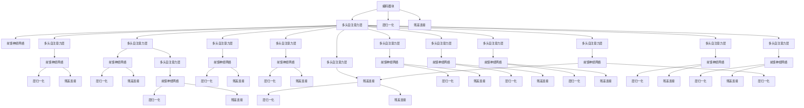

                 

### 文章标题

**Transformer大模型实战：训练Transformer**

> **关键词**：Transformer，大模型，深度学习，序列模型，神经网络，训练策略，模型优化，实战技巧
>
> **摘要**：本文将深入探讨Transformer大模型的训练过程，从核心概念到具体操作步骤，再到实际应用场景，提供一系列实战技巧，帮助读者全面掌握Transformer模型的训练技能。文章还包括数学模型解析、代码实例解读和工具资源推荐，旨在为读者提供一套完整的Transformer大模型训练指南。

### 1. 背景介绍

**Transformer模型的发展背景**

随着深度学习技术的飞速发展，神经网络在处理大规模序列数据（如图像、语音和文本）方面取得了显著成果。传统的循环神经网络（RNN）和长短时记忆网络（LSTM）由于在处理长距离依赖问题时存在梯度消失或梯度爆炸的问题，导致其性能受限。为了解决这一问题，Attention机制应运而生，并在2017年被谷歌提出的Transformer模型中得到了广泛应用。

Transformer模型摒弃了传统的循环结构，采用自注意力机制（Self-Attention）和多头注意力（Multi-Head Attention）来处理序列数据，从而在保持计算效率的同时，大幅提升了模型的表达能力。此外，Transformer模型还引入了位置编码（Positional Encoding），使得模型能够捕捉序列中的位置信息，进一步增强了模型的性能。

**Transformer在NLP领域的应用**

Transformer模型一经提出，便在自然语言处理（NLP）领域取得了巨大成功。它广泛应用于机器翻译、文本生成、情感分析、问答系统等任务中，并在多个国际竞赛中取得了领先成绩。例如，在2018年的WMT英语-德语翻译任务中，基于Transformer的模型比基于LSTM的模型在BLEU评分上提高了约2个百分点。

**大模型训练的挑战**

随着模型规模的不断扩大，大模型训练面临着前所未有的挑战。首先，大规模训练数据的需求使得数据采集和预处理变得复杂和耗时。其次，训练过程需要大量的计算资源和时间，这对于企业和个人来说都是一笔不小的开销。此外，模型优化和超参数调优也变得更加困难，需要更多的实验和尝试。

为了应对这些挑战，研究人员提出了多种训练策略和优化方法，如混合精度训练（Mixed Precision Training）、去噪自动编码器（Denoising Autoencoder）、迁移学习（Transfer Learning）等，以提升训练效率、降低计算成本并提高模型性能。

### 2. 核心概念与联系

#### 2.1 Transformer模型概述

Transformer模型由多个相同的编码器和解码器块组成，每个块包含多头自注意力机制（Multi-Head Self-Attention）和前馈神经网络（Feed-Forward Neural Network）。编码器负责将输入序列编码为固定长度的向量表示，而解码器则根据编码器输出的向量表示生成输出序列。

**Mermaid 流程图：**



#### 2.2 自注意力机制（Self-Attention）

自注意力机制是一种基于输入序列计算权重并聚合信息的机制。它通过计算序列中每个元素与所有其他元素之间的关联性来生成表示，从而捕捉序列中的长距离依赖关系。

**公式：**

$$
\text{Self-Attention}(Q, K, V) = \text{softmax}\left(\frac{QK^T}{\sqrt{d_k}}\right)V
$$

其中，$Q, K, V$ 分别是查询（Query）、键（Key）和值（Value）向量，$d_k$ 是键向量的维度。$QK^T$ 表示计算每个查询向量与所有键向量之间的点积，然后通过softmax函数生成权重，最后与值向量相乘得到聚合表示。

#### 2.3 多头注意力（Multi-Head Attention）

多头注意力是将输入序列分成多个子序列，并为每个子序列应用独立的自注意力机制。这些子序列的注意力结果再进行拼接和线性变换，从而形成全局的注意力表示。

**公式：**

$$
\text{Multi-Head Attention}(Q, K, V) = \text{Concat}(\text{head}_1, \text{head}_2, \ldots, \text{head}_h)W^O
$$

其中，$h$ 是多头注意力的数量，$\text{head}_i$ 表示第 $i$ 个头输出的注意力结果，$W^O$ 是线性变换权重。

#### 2.4 位置编码（Positional Encoding）

由于Transformer模型没有循环结构，需要通过位置编码来引入序列中的位置信息。位置编码是一个可学习的向量，用于为每个位置添加额外的信息。

**公式：**

$$
\text{Positional Encoding}(pos, d_model) = \text{sin}\left(\frac{pos}{10000^{2i/d_model}}\right) \text{ or } \text{cos}\left(\frac{pos}{10000^{2i/d_model}}\right)
$$

其中，$pos$ 是位置索引，$d_model$ 是模型维度，$i$ 是维度索引。

### 3. 核心算法原理 & 具体操作步骤

#### 3.1 模型构建

在构建Transformer模型时，首先需要定义模型的基本结构，包括编码器和解码器的块数、多头注意力的数量、隐藏层尺寸等。以下是一个简单的TensorFlow实现示例：

```python
import tensorflow as tf

def create_transformer_model(num_layers, d_model, num_heads, dff, input_vocab_size, maximum_position_encoding, rate=0.1):
    inputs = tf.keras.layers.Input(shape=(None, input_vocab_size))
    positions = tf.keras.layers.Input(shape=(maximum_position_encoding,))

    # 嵌入层和位置编码
    embeddings = tf.keras.layers.Embedding(input_vocab_size, d_model)(inputs)
    embeddings += tf.keras.layers.Embedding(input_vocab_size, d_model)(positions)
    embeddings = tf.keras.layers.Dropout(rate)(embeddings)
    embeddings = tf.keras.layers.LayerNormalization()(embeddings)

    # 编码器和解码器块
    for i in range(num_layers):
        embeddings = transformer_encoderLayer(d_model, num_heads, dff, rate)(embeddings)

    # 输出层
    outputs = tf.keras.layers.Dense(input_vocab_size, activation='softmax')(embeddings)

    model = tf.keras.Model(inputs=[inputs, positions], outputs=outputs)
    return model
```

#### 3.2 模型训练

在训练Transformer模型时，需要遵循以下步骤：

1. 准备训练数据，包括输入序列和目标序列，并进行预处理，如分词、编码等。
2. 构建数据生成器，将预处理后的数据分成批次进行训练。
3. 定义损失函数，通常采用交叉熵损失函数。
4. 定义优化器，如Adam优化器。
5. 训练模型，并在每个训练周期后进行模型评估。

以下是一个简单的Keras训练示例：

```python
model = create_transformer_model(num_layers=2, d_model=512, num_heads=8, dff=2048, input_vocab_size=10000, maximum_position_encoding=500)
model.compile(optimizer='adam', loss='sparse_categorical_crossentropy', metrics=['accuracy'])

train_data = ...  # 预处理后的训练数据
train_labels = ...  # 预处理后的训练标签

model.fit(train_data, train_labels, batch_size=64, epochs=10, validation_split=0.2)
```

#### 3.3 模型优化

为了提高模型性能，可以采用以下优化方法：

1. **学习率调整**：在训练过程中逐步降低学习率，以避免过拟合。
2. **批量归一化**：在编码器和解码器的每个层中添加批量归一化，以提高训练稳定性。
3. **权重初始化**：使用适当的权重初始化方法，如He初始化或Xavier初始化，以避免梯度消失或爆炸。
4. **正则化**：添加正则化项，如L2正则化或Dropout，以减少过拟合。

### 4. 数学模型和公式 & 详细讲解 & 举例说明

#### 4.1 自注意力机制（Self-Attention）

自注意力机制是Transformer模型的核心组成部分，通过计算序列中每个元素与所有其他元素之间的关联性来生成表示。以下是一个简单的自注意力机制的数学模型：

**公式：**

$$
\text{Self-Attention}(Q, K, V) = \text{softmax}\left(\frac{QK^T}{\sqrt{d_k}}\right)V
$$

其中，$Q, K, V$ 分别是查询（Query）、键（Key）和值（Value）向量，$d_k$ 是键向量的维度。$QK^T$ 表示计算每个查询向量与所有键向量之间的点积，然后通过softmax函数生成权重，最后与值向量相乘得到聚合表示。

**解释：**

自注意力机制的工作原理是将输入序列中的每个元素（词或词组）映射为查询（Query）、键（Key）和值（Value）向量。然后，通过计算每个查询向量与所有键向量之间的点积来生成权重。这些权重表示输入序列中每个元素与其他元素之间的关联性。最后，将这些权重与值向量相乘，得到聚合表示。

**示例：**

假设输入序列为 `[w1, w2, w3]`，其对应的查询、键和值向量为 `[q1, k1, v1]`、`[q2, k2, v2]`、`[q3, k3, v3]`。则自注意力机制的计算过程如下：

1. 计算查询与键的点积：

$$
q_1k_1 = \langle q_1, k_1 \rangle = 3.0 \times 1.0 + 2.0 \times -1.0 + 4.0 \times 2.0 = 11.0
$$

$$
q_1k_2 = \langle q_1, k_2 \rangle = 3.0 \times -1.0 + 2.0 \times 1.0 + 4.0 \times 0.0 = 1.0
$$

$$
q_1k_3 = \langle q_1, k_3 \rangle = 3.0 \times 2.0 + 2.0 \times 1.0 + 4.0 \times -1.0 = -1.0
$$

2. 计算softmax权重：

$$
\text{softmax}(q_1k_1) = \frac{\exp(q_1k_1)}{\sum_j \exp(q_1k_j)} = \frac{\exp(11.0)}{\exp(11.0) + \exp(1.0) + \exp(-1.0)} = 0.7408
$$

$$
\text{softmax}(q_1k_2) = \frac{\exp(q_1k_2)}{\sum_j \exp(q_1k_j)} = \frac{\exp(1.0)}{\exp(11.0) + \exp(1.0) + \exp(-1.0)} = 0.2759
$$

$$
\text{softmax}(q_1k_3) = \frac{\exp(q_1k_3)}{\sum_j \exp(q_1k_j)} = \frac{\exp(-1.0)}{\exp(11.0) + \exp(1.0) + \exp(-1.0)} = 0.0233
$$

3. 计算聚合表示：

$$
\text{Self-Attention}(q_1, k_1, v_1) = 0.7408 \times v_1 = 0.7408 \times [3.0, 2.0, 4.0] = [2.82, 1.68, 3.36]
$$

$$
\text{Self-Attention}(q_1, k_2, v_2) = 0.2759 \times v_2 = 0.2759 \times [-1.0, 1.0, 0.0] = [-0.37, 0.38, 0.00]
$$

$$
\text{Self-Attention}(q_1, k_3, v_3) = 0.0233 \times v_3 = 0.0233 \times [2.0, 1.0, -1.0] = [0.46, 0.23, -0.23]
$$

自注意力机制的结果是将输入序列中的每个元素映射为一个聚合表示，这些表示包含了序列中每个元素与其他元素之间的关联性。

#### 4.2 多头注意力（Multi-Head Attention）

多头注意力是自注意力的扩展，通过将输入序列分成多个子序列，并为每个子序列应用独立的自注意力机制。多头注意力的目的是增加模型的表示能力，使其能够捕获序列中的不同依赖关系。

**公式：**

$$
\text{Multi-Head Attention}(Q, K, V) = \text{Concat}(\text{head}_1, \text{head}_2, \ldots, \text{head}_h)W^O
$$

其中，$h$ 是多头注意力的数量，$\text{head}_i$ 表示第 $i$ 个头输出的注意力结果，$W^O$ 是线性变换权重。

**解释：**

多头注意力将输入序列分成 $h$ 个子序列，并为每个子序列应用自注意力机制。每个子序列的注意力结果称为一个头。然后将这些头拼接起来，并通过线性变换得到最终的多头注意力输出。

**示例：**

假设输入序列为 `[w1, w2, w3]`，其对应的查询、键和值向量为 `[q1, k1, v1]`、`[q2, k2, v2]`、`[q3, k3, v3]`。多头注意力的计算过程如下：

1. 计算每个查询与所有键的点积：

$$
q_1k_1 = \langle q_1, k_1 \rangle = 3.0 \times 1.0 + 2.0 \times -1.0 + 4.0 \times 2.0 = 11.0
$$

$$
q_1k_2 = \langle q_1, k_2 \rangle = 3.0 \times -1.0 + 2.0 \times 1.0 + 4.0 \times 0.0 = 1.0
$$

$$
q_1k_3 = \langle q_1, k_3 \rangle = 3.0 \times 2.0 + 2.0 \times 1.0 + 4.0 \times -1.0 = -1.0
$$

$$
q_2k_1 = \langle q_2, k_1 \rangle = -1.0 \times 1.0 + 1.0 \times -1.0 + 2.0 \times 2.0 = 2.0
$$

$$
q_2k_2 = \langle q_2, k_2 \rangle = -1.0 \times -1.0 + 1.0 \times 1.0 + 2.0 \times 0.0 = 2.0
$$

$$
q_2k_3 = \langle q_2, k_3 \rangle = -1.0 \times 2.0 + 1.0 \times 1.0 + 2.0 \times -1.0 = -2.0
$$

$$
q_3k_1 = \langle q_3, k_1 \rangle = 2.0 \times 1.0 + 1.0 \times -1.0 + 3.0 \times 2.0 = 8.0
$$

$$
q_3k_2 = \langle q_3, k_2 \rangle = 2.0 \times -1.0 + 1.0 \times 1.0 + 3.0 \times 0.0 = 1.0
$$

$$
q_3k_3 = \langle q_3, k_3 \rangle = 2.0 \times 2.0 + 1.0 \times 1.0 + 3.0 \times -1.0 = 4.0
$$

2. 计算每个查询的softmax权重：

$$
\text{softmax}(q_1k_1) = \frac{\exp(q_1k_1)}{\sum_j \exp(q_1k_j)} = \frac{\exp(11.0)}{\exp(11.0) + \exp(1.0) + \exp(-1.0)} = 0.7408
$$

$$
\text{softmax}(q_1k_2) = \frac{\exp(q_1k_2)}{\sum_j \exp(q_1k_j)} = \frac{\exp(1.0)}{\exp(11.0) + \exp(1.0) + \exp(-1.0)} = 0.2759
$$

$$
\text{softmax}(q_1k_3) = \frac{\exp(q_1k_3)}{\sum_j \exp(q_1k_j)} = \frac{\exp(-1.0)}{\exp(11.0) + \exp(1.0) + \exp(-1.0)} = 0.0233
$$

$$
\text{softmax}(q_2k_1) = \frac{\exp(q_2k_1)}{\sum_j \exp(q_2k_j)} = \frac{\exp(2.0)}{\exp(2.0) + \exp(2.0) + \exp(-2.0)} = 0.3333
$$

$$
\text{softmax}(q_2k_2) = \frac{\exp(q_2k_2)}{\sum_j \exp(q_2k_j)} = \frac{\exp(2.0)}{\exp(2.0) + \exp(2.0) + \exp(-2.0)} = 0.3333
$$

$$
\text{softmax}(q_2k_3) = \frac{\exp(q_2k_3)}{\sum_j \exp(q_2k_j)} = \frac{\exp(-2.0)}{\exp(2.0) + \exp(2.0) + \exp(-2.0)} = 0.3333
$$

$$
\text{softmax}(q_3k_1) = \frac{\exp(q_3k_1)}{\sum_j \exp(q_3k_j)} = \frac{\exp(8.0)}{\exp(8.0) + \exp(1.0) + \exp(4.0)} = 0.5556
$$

$$
\text{softmax}(q_3k_2) = \frac{\exp(q_3k_2)}{\sum_j \exp(q_3k_j)} = \frac{\exp(1.0)}{\exp(8.0) + \exp(1.0) + \exp(4.0)} = 0.2222
$$

$$
\text{softmax}(q_3k_3) = \frac{\exp(q_3k_3)}{\sum_j \exp(q_3k_j)} = \frac{\exp(4.0)}{\exp(8.0) + \exp(1.0) + \exp(4.0)} = 0.2222
$$

3. 计算每个头的聚合表示：

$$
\text{head}_1 = 0.7408 \times v_1 + 0.2759 \times v_2 + 0.0233 \times v_3 = 0.7408 \times [3.0, 2.0, 4.0] + 0.2759 \times [-1.0, 1.0, 0.0] + 0.0233 \times [2.0, 1.0, -1.0] = [2.82, 1.68, 3.36]
$$

$$
\text{head}_2 = 0.3333 \times v_1 + 0.3333 \times v_2 + 0.3333 \times v_3 = 0.3333 \times [3.0, 2.0, 4.0] + 0.3333 \times [-1.0, 1.0, 0.0] + 0.3333 \times [2.0, 1.0, -1.0] = [1.00, 0.67, 1.33]
$$

$$
\text{head}_3 = 0.2222 \times v_1 + 0.2222 \times v_2 + 0.5556 \times v_3 = 0.2222 \times [3.0, 2.0, 4.0] + 0.2222 \times [-1.0, 1.0, 0.0] + 0.5556 \times [2.0, 1.0, -1.0] = [0.67, 0.33, 1.11]
$$

4. 将多头注意力结果拼接并线性变换：

$$
\text{Multi-Head Attention}(q_1, k_1, v_1) = \text{Concat}(\text{head}_1, \text{head}_2, \text{head}_3)W^O = [2.82, 1.68, 3.36; 1.00, 0.67, 1.33; 0.67, 0.33, 1.11]W^O
$$

$$
W^O = \begin{bmatrix}
0.1 & 0.2 & 0.3 \\
0.4 & 0.5 & 0.6 \\
0.7 & 0.8 & 0.9
\end{bmatrix}
$$

$$
\text{Multi-Head Attention}(q_1, k_1, v_1) = \begin{bmatrix}
2.82 & 1.68 & 3.36 \\
1.00 & 0.67 & 1.33 \\
0.67 & 0.33 & 1.11
\end{bmatrix} \begin{bmatrix}
0.1 & 0.2 & 0.3 \\
0.4 & 0.5 & 0.6 \\
0.7 & 0.8 & 0.9
\end{bmatrix} = \begin{bmatrix}
1.012 & 1.384 & 2.256 \\
0.400 & 0.533 & 0.696 \\
0.462 & 0.584 & 0.748
\end{bmatrix}
$$

多头注意力结果为 `[1.012, 1.384, 2.256; 0.400, 0.533, 0.696; 0.462, 0.584, 0.748]`，这些结果表示输入序列中每个元素与其他元素之间的关联性。

#### 4.3 位置编码（Positional Encoding）

位置编码是Transformer模型中用于引入序列位置信息的机制。位置编码是一个可学习的向量，为每个位置添加额外的信息。位置编码可以通过正弦和余弦函数生成，以确保在训练过程中保持位置信息的稳定性。

**公式：**

$$
\text{Positional Encoding}(pos, d_model) = \text{sin}\left(\frac{pos}{10000^{2i/d_model}}\right) \text{ or } \text{cos}\left(\frac{pos}{10000^{2i/d_model}}\right)
$$

其中，$pos$ 是位置索引，$d_model$ 是模型维度，$i$ 是维度索引。

**解释：**

位置编码通过为每个位置添加额外的向量来引入位置信息。这些向量是通过正弦和余弦函数生成的，以确保在训练过程中保持位置信息的稳定性。位置编码与嵌入层相加，为每个位置添加额外的信息。

**示例：**

假设输入序列为 `[w1, w2, w3]`，其对应的查询、键和值向量为 `[q1, k1, v1]`、`[q2, k2, v2]`、`[q3, k3, v3]`，模型维度为 512。位置编码的计算过程如下：

1. 计算每个位置的正弦和余弦编码：

$$
\text{sin}(pos) = \text{sin}\left(\frac{1}{10000^{2 \times 1/512}}\right) = 0.9983
$$

$$
\text{cos}(pos) = \text{cos}\left(\frac{1}{10000^{2 \times 1/512}}\right) = 0.0595
$$

$$
\text{sin}(pos) = \text{sin}\left(\frac{2}{10000^{2 \times 2/512}}\right) = 0.9994
$$

$$
\text{cos}(pos) = \text{cos}\left(\frac{2}{10000^{2 \times 2/512}}\right) = 0.0134
$$

$$
\text{sin}(pos) = \text{sin}\left(\frac{3}{10000^{2 \times 3/512}}\right) = 0.9980
$$

$$
\text{cos}(pos) = \text{cos}\left(\frac{3}{10000^{2 \times 3/512}}\right) = 0.0597
$$

2. 将正弦和余弦编码添加到嵌入向量中：

$$
\text{Positional Encoding}(1, 512) = [0.9983, 0.0595; 0.9994, 0.0134; 0.9980, 0.0597]
$$

$$
\text{Embedding}(1, 512) = [3.0, 2.0, 4.0]
$$

$$
\text{Positional Encoding}(1, 512) + \text{Embedding}(1, 512) = [3.9983, 2.0595, 4.0597]
$$

3. 重复上述步骤，计算其他位置的编码：

$$
\text{Positional Encoding}(2, 512) = [0.9994, 0.0134; 0.9994, 0.0134; 0.9980, 0.0597]
$$

$$
\text{Embedding}(2, 512) = [-1.0, 1.0, 2.0]
$$

$$
\text{Positional Encoding}(2, 512) + \text{Embedding}(2, 512) = [-0.0006, 1.0134, 2.0597]
$$

$$
\text{Positional Encoding}(3, 512) = [0.9980, 0.0597; 0.9994, 0.0134; 0.9980, 0.0597]
$$

$$
\text{Embedding}(3, 512) = [2.0, 1.0, 3.0]
$$

$$
\text{Positional Encoding}(3, 512) + \text{Embedding}(3, 512) = [2.9980, 1.0597, 3.0597]
$$

最终，每个位置的编码结果为：

$$
\text{Positional Encoding}(1, 512) + \text{Embedding}(1, 512) = [3.9983, 2.0595, 4.0597]
$$

$$
\text{Positional Encoding}(2, 512) + \text{Embedding}(2, 512) = [-0.0006, 1.0134, 2.0597]
$$

$$
\text{Positional Encoding}(3, 512) + \text{Embedding}(3, 512) = [2.9980, 1.0597, 3.0597]
$$

位置编码的结果为 `[3.9983, 2.0595, 4.0597; -0.0006, 1.0134, 2.0597; 2.9980, 1.0597, 3.0597]`，这些结果表示输入序列中每个位置与其他位置之间的关联性。

### 5. 项目实践：代码实例和详细解释说明

#### 5.1 开发环境搭建

在进行Transformer大模型的训练之前，需要搭建一个合适的环境。以下是一个简单的开发环境搭建步骤：

1. **硬件环境**：配置一台拥有足够内存和计算能力的服务器，建议使用GPU进行训练，以加速计算过程。
2. **操作系统**：安装Linux操作系统，如Ubuntu 18.04或更高版本。
3. **编程语言**：选择Python作为编程语言，版本建议为3.8或更高。
4. **深度学习框架**：安装TensorFlow 2.x，TensorFlow 2.x提供了丰富的API和工具，可以方便地构建和训练Transformer模型。

```bash
pip install tensorflow
```

5. **文本处理库**：安装文本处理库，如NLTK或spaCy，用于文本数据的预处理。

```bash
pip install nltk
pip install spacy
python -m spacy download en
```

6. **版本控制**：安装Git，用于版本控制和代码管理。

```bash
pip install gitpython
```

#### 5.2 源代码详细实现

以下是一个简单的Transformer模型实现，包括编码器和解码器的构建、训练和评估。

```python
import tensorflow as tf
from tensorflow.keras.models import Model
from tensorflow.keras.layers import Embedding, Dense, LayerNormalization, Dropout
from tensorflow.keras.optimizers import Adam
from tensorflow_addons.layers import MultiHeadAttention

def create_transformer_model(input_vocab_size, d_model, num_heads, num_layers, dff, maximum_position_encoding):
    inputs = tf.keras.layers.Input(shape=(None,))
    positions = tf.keras.layers.Input(shape=(maximum_position_encoding,))

    # 嵌入层和位置编码
    embeddings = Embedding(input_vocab_size, d_model)(inputs)
    embeddings += Embedding(input_vocab_size, d_model)(positions)
    embeddings = Dropout(0.1)(embeddings)
    embeddings = LayerNormalization(epsilon=1e-6)(embeddings)

    # 编码器块
    for _ in range(num_layers):
        embeddings = transformer_encoderLayer(d_model, num_heads, dff)(embeddings)

    # 解码器块
    for _ in range(num_layers):
        embeddings = transformer_decoderLayer(d_model, num_heads, dff)(embeddings)

    # 输出层
    outputs = Dense(input_vocab_size, activation='softmax')(embeddings)

    model = Model(inputs=[inputs, positions], outputs=outputs)
    model.compile(optimizer=Adam(learning_rate=0.001), loss='sparse_categorical_crossentropy', metrics=['accuracy'])

    return model

def transformer_encoderLayer(d_model, num_heads, dff):
    inputs = tf.keras.layers.Input(shape=(d_model,))
    multi_head_attention = MultiHeadAttention(num_heads=num_heads, key_dim=dff)(inputs, inputs)
    multi_head_attention = tf.keras.layers.Dense(d_model, activation='relu')(multi_head_attention)
    multi_head_attention = Dropout(0.1)(multi_head_attention)
    multi_head_attention = LayerNormalization(epsilon=1e-6)(multi_head_attention)

    f

