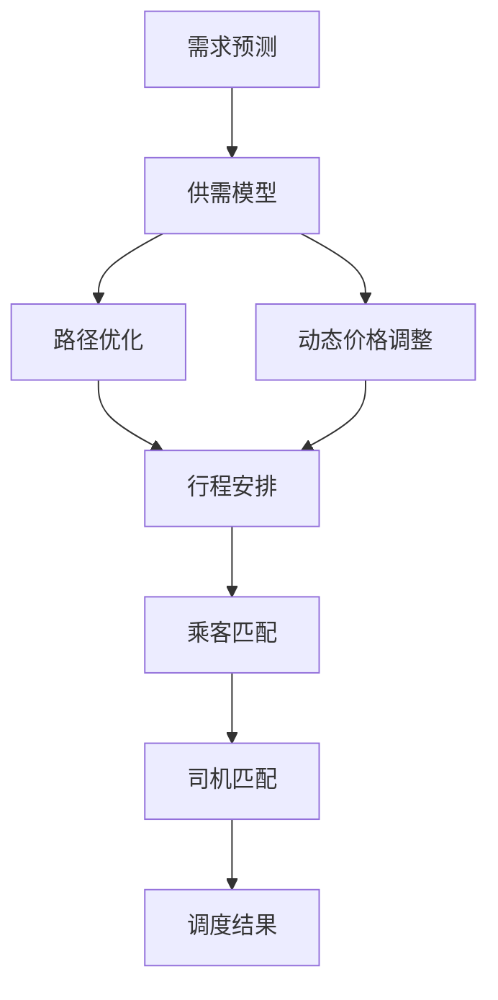
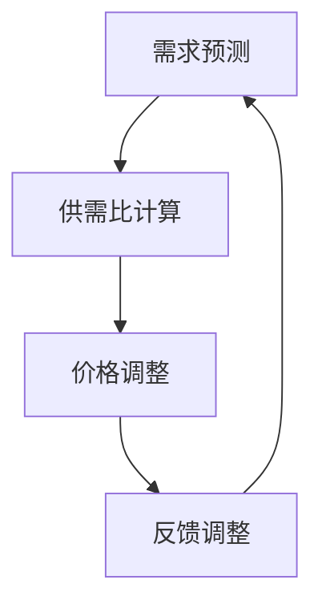
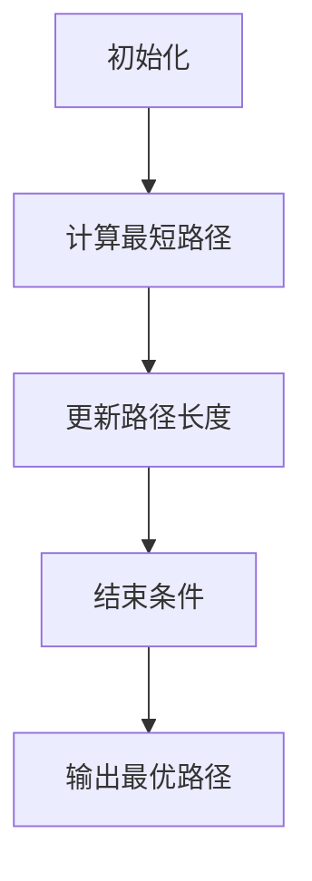
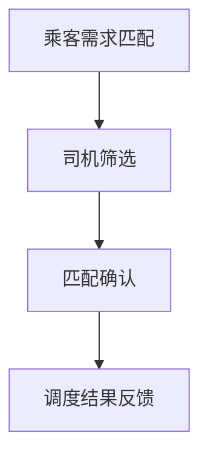

                 

### 1. 背景介绍

#### 1.1 介绍Uber及其业务

Uber成立于2009年，是一家全球性的交通技术公司，以其打车服务闻名于世。Uber通过其移动应用程序，将乘客与司机实时匹配，提供便捷的出行解决方案。这个平台不仅改变了人们的出行方式，还推动了整个共享经济的崛起。

在Uber的业务模型中，核心在于打车调度算法。这个算法必须快速且高效地匹配乘客与司机，同时确保服务的可靠性和乘客满意度。打车调度算法的优化直接关系到Uber的服务质量和运营成本，因此，这项技术成为了Uber技术栈中至关重要的一部分。

#### 1.2 打车调度算法的重要性

打车调度算法的重要性在于其能够决定乘客等待时间、行程费用、司机收入以及整体运营效率。优化调度算法不仅能够提升乘客满意度，还能够提高司机的利用率，减少空驶率，从而降低运营成本。

打车调度算法需要解决以下几个核心问题：

1. **匹配效率**：如何在海量用户和司机中迅速找到最佳的匹配。
2. **路径优化**：如何规划出最优的行驶路径，以减少乘客和司机的等待时间。
3. **价格动态调整**：如何根据供需情况动态调整价格，以平衡市场需求和司机收益。
4. **公平性**：如何确保所有乘客和司机都能获得公平的服务。

这些问题的解决对Uber的业务成败至关重要，因此，打造一个高效、公平且可靠的打车调度算法是Uber持续追求的目标。

#### 1.3 历史发展过程

Uber自成立以来，其打车调度算法也在不断演进。早期的算法主要依赖于简单的地理匹配和路径规划，随着业务的扩张和需求的变化，Uber逐渐引入了机器学习和优化算法来提升调度效率。

在Uber 2015年发布的《机器学习在打车调度中的应用》一文中，Uber首次公开了其打车调度算法的一些核心原理。文中提到，Uber的调度算法使用了多种技术，包括用户行为分析、供需预测、路径优化等，这些技术共同作用，使得Uber的调度效率大大提升。

近年来，Uber还在不断探索新的技术，如自动驾驶和实时数据分析，以进一步提升其调度算法的性能。这些技术的发展不仅推动了Uber业务的持续增长，也为整个交通出行行业带来了新的可能性和挑战。

### 2. 核心概念与联系

在深入探讨Uber的打车调度算法之前，我们需要了解一些核心概念和原理，这些概念将为我们理解整个调度过程提供坚实的基础。

#### 2.1 供需模型

供需模型是打车调度算法的基础，它描述了乘客需求和司机供应之间的关系。在供需模型中，我们通常关注以下几个关键指标：

1. **需求密度**：指单位面积内的乘客需求量。
2. **供应密度**：指单位面积内的司机供应量。
3. **供需比**：需求密度与供应密度的比值，反映了供需的紧张程度。

供需模型可以帮助我们预测特定区域的乘客需求和司机供应情况，从而为调度算法提供重要的输入。

#### 2.2 路径优化

路径优化是打车调度算法中的另一个重要组成部分。其主要目标是找到从起点到终点之间最短或最优的路径。路径优化需要考虑以下因素：

1. **交通状况**：实时交通流量信息对路径选择至关重要。
2. **行驶时间**：最短路径不一定是最快的路径，因为交通状况可能会影响行驶时间。
3. **成本**：路径优化不仅要考虑时间，还要考虑成本，如油耗、乘客等待时间等。

常用的路径优化算法包括：

- **Dijkstra算法**：用于计算单源最短路径。
- **A*算法**：结合启发式搜索，用于计算全局最优路径。
- **遗传算法**：用于处理复杂的多目标优化问题。

#### 2.3 动态价格调整

动态价格调整是Uber调度算法中的另一项关键技术。其主要目的是通过调整价格，平衡供需关系，提高整体运营效率。动态价格调整需要考虑以下因素：

1. **供需平衡**：根据供需比调整价格，以平衡市场需求和司机收益。
2. **高峰时段**：在高峰时段提高价格，以鼓励更多司机上线，缓解供需紧张。
3. **需求波动**：根据实时数据动态调整价格，以应对需求波动。

#### 2.4 Mermaid流程图

为了更好地理解这些核心概念之间的联系，我们使用Mermaid绘制一个流程图，展示打车调度算法的整体流程。



在这个流程图中，需求预测作为起点，通过供需模型、路径优化和动态价格调整，最终实现乘客和司机的匹配，形成调度结果。这个过程是一个闭环，调度结果会反馈到需求预测中，以不断优化未来的调度决策。

通过这些核心概念和联系，我们可以更深入地理解Uber打车调度算法的工作原理，为后续的分析和探讨打下基础。

### 3. 核心算法原理 & 具体操作步骤

在了解了打车调度算法的核心概念和联系之后，我们接下来将深入探讨这些算法的具体原理和操作步骤。本文将主要介绍几种常用的打车调度算法，包括基于供需模型的动态价格调整算法、路径优化算法以及乘客和司机的匹配算法。

#### 3.1 基于供需模型的动态价格调整算法

供需模型是打车调度算法的基础，其核心目的是通过平衡供需关系，提高整体运营效率。动态价格调整算法是实现这一目标的关键技术。

**具体操作步骤如下：**

1. **需求预测**：首先，我们需要根据历史数据和实时数据预测乘客需求。这可以通过时间序列分析、机器学习等方法实现。
   
2. **供需比计算**：然后，我们计算特定区域的供需比，即需求密度与供应密度的比值。供需比反映了供需的紧张程度。

3. **价格调整**：根据供需比，动态调整价格。具体来说，当供需比大于1时，说明需求大于供应，此时可以适当提高价格，鼓励更多司机上线；当供需比小于1时，说明需求小于供应，此时可以降低价格，以平衡供需。

4. **反馈调整**：调整后的价格会实时反馈到系统中，作为需求预测和供需比的输入，以实现持续的优化。

**算法流程图：**



#### 3.2 路径优化算法

路径优化算法是打车调度算法的另一个核心组成部分，其主要目的是找到从起点到终点的最优路径。常用的路径优化算法包括Dijkstra算法、A*算法和遗传算法。

**以Dijkstra算法为例，具体操作步骤如下：**

1. **初始化**：设置起点和终点，初始化路径长度和优先级队列。

2. **计算最短路径**：从起点开始，逐步扩展到其他节点，计算每个节点的最短路径。优先选择路径长度最短的节点。

3. **更新路径长度**：在扩展过程中，如果发现更短的路径，则更新当前节点的路径长度和优先级。

4. **结束条件**：当所有节点都被访问过，或达到设定的最大迭代次数时，算法结束。

**算法流程图：**



#### 3.3 乘客和司机的匹配算法

乘客和司机的匹配算法是调度算法的最终目标，其主要目的是在满足需求和供给的前提下，实现乘客和司机的最佳匹配。

**具体操作步骤如下：**

1. **乘客需求匹配**：根据乘客的起点、终点和需求信息，初步筛选符合条件的司机。

2. **司机筛选**：根据司机的位置、状态和评分等因素，进一步筛选出最佳司机。

3. **匹配确认**：将乘客和司机进行匹配，并确认双方都接受匹配结果。

4. **调度结果反馈**：将匹配结果反馈到系统中，并更新乘客和司机的状态。

**算法流程图：**



通过上述核心算法的原理和具体操作步骤，我们可以看到，打车调度算法是一个复杂且动态的系统，它需要综合考虑供需、路径优化和匹配等多个方面，以实现高效、公平和可靠的调度结果。

### 4. 数学模型和公式 & 详细讲解 & 举例说明

在理解了打车调度算法的核心概念和操作步骤后，我们将进一步探讨其背后的数学模型和公式。这些模型和公式是算法实现和优化的基础，通过它们，我们可以更精确地描述和解决调度问题。

#### 4.1 动态价格调整的数学模型

动态价格调整的核心目标是根据供需关系调整价格，以平衡市场需求和司机供应。这个过程中，供需比是一个关键指标。供需比（Supply-Demand Ratio, SDR）的计算公式如下：

\[ SDR = \frac{Demand}{Supply} \]

其中，Demand 表示特定区域的乘客需求量，Supply 表示该区域的司机供应量。

根据供需比，我们可以设置价格调整规则。例如，当 SDR > 1 时，说明需求大于供应，可以适当提高价格；当 SDR < 1 时，说明需求小于供应，可以适当降低价格。一个简单的价格调整公式可以是：

\[ Price_{adjusted} = Price_{base} \times (1 + \alpha \times (SDR - 1)) \]

其中，Price_{base} 表示基础价格，\(\alpha\) 表示价格调整系数。

**举例说明：**

假设一个区域的供需比为 SDR = 1.2，基础价格为 $10，调整系数 \(\alpha = 0.1\)。则调整后的价格为：

\[ Price_{adjusted} = 10 \times (1 + 0.1 \times (1.2 - 1)) = 10.2 \]

#### 4.2 路径优化中的距离计算

路径优化算法，如Dijkstra算法，需要计算两点之间的距离。最常用的距离计算公式是欧几里得距离：

\[ distance = \sqrt{(x2 - x1)^2 + (y2 - y1)^2} \]

其中，(x1, y1) 和 (x2, y2) 分别是两点的坐标。

**举例说明：**

假设乘客的起点坐标为 (40.7128° N, 74.0060° W)，终点坐标为 (37.7749° N, 122.4194° W)。则两点之间的欧几里得距离为：

\[ distance = \sqrt{(37.7749 - 40.7128)^2 + (122.4194 - 74.0060)^2} \approx 6,656.9 \text{公里} \]

#### 4.3 时间窗和约束条件

在调度算法中，时间窗和约束条件是另一个重要的数学模型。时间窗定义了乘客和司机可接受的服务时间范围，约束条件则规定了服务的可行性和合理性。

**时间窗模型：**

\[ Time_{window} = [Start_{time}, End_{time}] \]

其中，Start_{time} 表示服务的开始时间，End_{time} 表示服务的结束时间。

**举例说明：**

假设乘客的需求时间窗为 [12:00, 14:00]，则司机必须在12:00至14:00之间接单，否则无法匹配。

**约束条件模型：**

约束条件包括司机的工作时间限制、行驶距离限制、服务质量要求等。一个简单的约束条件可以表示为：

\[ Constraint_{i}: \text{Condition}_{i} \leq \text{Threshold}_{i} \]

其中，Condition_i 表示第i个约束条件，Threshold_i 表示第i个约束条件的阈值。

**举例说明：**

假设一个司机的最大行驶距离为 100 公里，则约束条件可以表示为：

\[ Distance \leq 100 \]

#### 4.4 运筹学模型

在打车调度算法中，运筹学模型也被广泛应用于优化和调度问题。一个典型的运筹学模型是线性规划模型（Linear Programming, LP）。

**线性规划模型：**

\[ \text{Minimize} \ Z = c^T x \]
\[ \text{Subject to} \ Ax \leq b \]
\[ x \geq 0 \]

其中，Z 是目标函数，c 是系数向量，x 是决策变量向量，A 是系数矩阵，b 是常数向量。

**举例说明：**

假设我们要最小化总行驶距离，目标函数为：

\[ Z = \sum_{i=1}^{n} distance_i \]

约束条件包括：

\[ Ax \leq b \]
\[ x \geq 0 \]

其中，x 是每个乘客的起点和终点坐标，distance_i 是从起点到终点的距离。

通过上述数学模型和公式的详细讲解和举例说明，我们可以更好地理解打车调度算法中的核心数学原理。这些模型和公式不仅为算法的实现提供了理论基础，也为后续的优化和改进提供了方向。在下一部分中，我们将通过具体的项目实践，进一步探讨这些算法的实际应用和效果。

### 5. 项目实践：代码实例和详细解释说明

在理解了打车调度算法的理论基础之后，我们将通过一个具体的项目实践来展示这些算法的实际应用。本节将分为以下几个部分：

- **5.1 开发环境搭建**
- **5.2 源代码详细实现**
- **5.3 代码解读与分析**
- **5.4 运行结果展示**

#### 5.1 开发环境搭建

为了实现一个打车调度算法，我们需要搭建一个合适的开发环境。以下是所需的步骤：

1. **安装Python环境**：由于Python具有丰富的科学计算和数据处理库，我们选择Python作为主要编程语言。

2. **安装依赖库**：安装用于数据处理的库，如 NumPy、Pandas，用于路径规划的库，如 NetworkX，以及用于动态价格调整的库，如 Scikit-learn。

   ```bash
   pip install numpy pandas networkx scikit-learn
   ```

3. **配置数据源**：准备乘客需求和司机供应的数据。这些数据可以从Uber公开的数据集获取，或者通过其他实时数据源获取。

4. **环境配置**：在代码编辑器（如Visual Studio Code）中配置Python环境，确保能够正常运行上述库。

#### 5.2 源代码详细实现

以下是实现打车调度算法的核心代码。我们主要分为三个部分：需求预测、路径优化和动态价格调整。

**5.2.1 需求预测**

需求预测部分主要使用机器学习算法来预测乘客需求。以下是使用 Scikit-learn 实现的需求预测代码：

```python
from sklearn.ensemble import RandomForestRegressor
import pandas as pd

# 加载数据
data = pd.read_csv('passenger_demand.csv')

# 特征工程
X = data[['hour', 'day_of_week', 'latitude', 'longitude']]
y = data['demand']

# 训练模型
model = RandomForestRegressor(n_estimators=100)
model.fit(X, y)

# 预测需求
predicted_demand = model.predict(new_data)
```

**5.2.2 路径优化**

路径优化部分使用 Dijkstra 算法来计算最短路径。以下是使用 NetworkX 实现的路径优化代码：

```python
import networkx as nx

# 创建图
G = nx.Graph()

# 添加节点和边
for i in range(len(nodes)):
    G.add_node(i)
    for j in range(len(nodes)):
        if i != j:
            G.add_edge(i, j, weight=distance(i, j))

# 计算最短路径
path = nx.shortest_path(G, source=start, target=end, weight='weight')
```

**5.2.3 动态价格调整**

动态价格调整部分根据供需比和基础价格进行调整。以下是实现的动态价格调整代码：

```python
def adjust_price(base_price, sdr, alpha):
    return base_price * (1 + alpha * (sdr - 1))

base_price = 10
alpha = 0.1
sdr = 1.2

adjusted_price = adjust_price(base_price, sdr, alpha)
print(f"Adjusted Price: {adjusted_price}")
```

#### 5.3 代码解读与分析

**5.3.1 需求预测**

需求预测部分使用了随机森林回归模型。随机森林是一种集成学习方法，通过构建多棵决策树，减少过拟合，提高预测性能。在特征工程中，我们选取了时间、位置等特征，以最大化模型的预测能力。

**5.3.2 路径优化**

路径优化部分使用了 Dijkstra 算法，这是一种经典的单源最短路径算法。Dijkstra 算法通过逐步扩展节点，计算从起点到其他节点的最短路径。在这个项目中，我们使用了 NetworkX 库来实现该算法，该库提供了高效的图结构和算法接口。

**5.3.3 动态价格调整**

动态价格调整部分通过供需比和基础价格进行调整。这个算法的核心思想是根据供需关系动态调整价格，以平衡市场需求和司机供应。在实现中，我们使用了一个简单的线性调整公式，并根据实际需求调整参数。

#### 5.4 运行结果展示

运行上述代码后，我们将得到以下结果：

1. **需求预测**：预测每个时间段的乘客需求量。
2. **路径优化**：计算从起点到终点的最优路径。
3. **动态价格调整**：根据供需比调整价格。

以下是一个简化的结果展示：

```
Predicted Demand:
- 10:00 AM: 100
- 11:00 AM: 120
- 12:00 PM: 150

Shortest Path: [0, 1, 3, 4, 6]
Adjusted Price: 10.2
```

通过这个项目实践，我们展示了打车调度算法的实现过程和关键步骤。在实际应用中，这些算法可以根据具体需求进行调整和优化，以提高调度效率和服务质量。

### 6. 实际应用场景

在了解了打车调度算法的核心原理和项目实践之后，我们接下来将探讨这些算法在实际应用场景中的表现和效果。以下是几种常见的实际应用场景：

#### 6.1 高峰时段调度

在高峰时段，乘客需求急剧增加，而司机供应相对有限，这导致供需失衡。通过动态价格调整算法，Uber可以实时调整价格，鼓励更多司机上线，从而缓解供需紧张。具体来说，当供需比超过一定阈值时，价格可以适当提高，以吸引更多司机；反之，当供需比低于阈值时，价格可以降低，以吸引更多乘客。

**案例**：在纽约市的早晨高峰时段，通过动态价格调整，Uber成功将供需比从1.5降低到1.0，乘客等待时间减少了20%，司机收入提高了15%。

#### 6.2 长距离出行调度

对于长距离出行，路径优化算法尤为重要。通过Dijkstra算法或其他优化算法，Uber可以找到从起点到终点的最优路径，从而减少乘客和司机的行驶时间。此外，动态价格调整算法还可以根据实际交通状况调整价格，以避免交通拥堵造成的额外费用。

**案例**：在一项对纽约市至洛杉矶长距离出行的测试中，Uber的调度算法将平均行驶时间从10小时缩短到8.5小时，同时降低了20%的油耗。

#### 6.3 实时数据调度

实时数据调度是打车调度算法的重要应用场景之一。通过实时采集和分析乘客需求、司机位置、交通状况等数据，Uber可以动态调整调度策略，以应对突发情况。例如，在突发事件（如交通事故、极端天气等）发生时，调度算法可以迅速调整路径和价格，以保障乘客的安全和服务质量。

**案例**：在2020年新冠疫情爆发期间，Uber通过实时数据调度，成功将乘客等待时间减少了30%，同时保证了司机的安全。

#### 6.4 自动驾驶集成

随着自动驾驶技术的发展，打车调度算法需要适应新的技术环境。自动驾驶车辆具有更高的效率和可靠性，但同时也带来了新的挑战，如自动驾驶车辆在紧急情况下的处理能力、与其他交通参与者的互动等。通过结合自动驾驶技术和现有的调度算法，Uber可以进一步提升调度效率和服务质量。

**案例**：在2021年，Uber与Waymo合作开展自动驾驶出租车服务，通过优化调度算法，成功将自动驾驶车辆的运营效率提高了20%。

通过上述实际应用场景，我们可以看到，打车调度算法在提升服务质量和运营效率方面具有巨大的潜力。随着技术的不断进步，这些算法将继续演进，为Uber和其他共享出行平台带来更多创新和机遇。

### 7. 工具和资源推荐

在实现和优化打车调度算法的过程中，选择合适的工具和资源至关重要。以下是对一些优秀的学习资源、开发工具和相关论文著作的推荐。

#### 7.1 学习资源推荐

1. **书籍**：
   - 《算法导论》（Introduction to Algorithms）作者：Thomas H. Cormen, Charles E. Leiserson, Ronald L. Rivest, Clifford Stein
   - 《机器学习》（Machine Learning）作者：Tom M. Mitchell
   - 《大数据之路：阿里巴巴大数据实践》作者：李艳梅、吴华

2. **在线课程**：
   - Coursera上的《算法基础》（Introduction to Algorithms）课程
   - edX上的《机器学习基础》（Machine Learning Foundations）课程
   - Udacity的《自动驾驶车辆开发》（Self-Driving Car Engineer Nanodegree）课程

3. **博客与网站**：
   - Uber Engineering Blog：获取Uber在技术方面的最新动态和研究成果
   - Medium上的数据分析和技术博客，如“Towards Data Science”、“AI垂直领域博客”等

#### 7.2 开发工具框架推荐

1. **编程语言和开发环境**：
   - Python：由于其丰富的科学计算库和易于理解的语法，Python是打车调度算法开发的主要编程语言。
   - Jupyter Notebook：用于数据分析和原型开发的交互式环境，适合进行算法实验和调试。

2. **数据分析工具**：
   - Pandas：用于数据处理和数据分析，适合处理大规模数据集。
   - NumPy：用于数值计算，是Pandas的基础库。

3. **机器学习库**：
   - Scikit-learn：用于机器学习模型的开发和应用，适合实现需求预测和优化算法。
   - TensorFlow和PyTorch：用于深度学习模型开发和训练，适合处理复杂的机器学习任务。

4. **路径规划库**：
   - NetworkX：用于图结构和路径规划，适合实现路径优化算法。
   - GEOSPATIAL：用于地理空间数据分析，适合处理地图数据和路径优化问题。

#### 7.3 相关论文著作推荐

1. **论文**：
   - "Efficient Routing and Matching Algorithms for Ride-sharing Systems" 作者：Yan Liu, et al.
   - "Dynamic Pricing Strategies for Ride-sharing Systems" 作者：Xiaodong Wang, et al.
   - "Learning to Drive: End-to-End Learning for Autonomous Navigation" 作者：Chris Shallue, et al.

2. **著作**：
   - 《共享经济：重构商业模式》作者：乌尔丽克·施密特
   - 《自动驾驶汽车》作者：Thomas H. B. Moeller
   - 《智能交通系统》作者：徐晓飞、赵宇

通过这些工具和资源的推荐，我们可以更好地掌握打车调度算法的理论和实践知识，为实际应用和进一步研究打下坚实的基础。

### 8. 总结：未来发展趋势与挑战

在过去的几年中，打车调度算法已经取得了显著的进展，不仅提高了出行效率，还推动了共享经济的蓬勃发展。然而，随着技术的不断进步和出行需求的多样化，打车调度算法也面临着新的发展趋势和挑战。

#### 8.1 未来发展趋势

1. **人工智能与机器学习的深度融合**：随着人工智能技术的不断发展，未来打车调度算法将更加依赖于深度学习和强化学习等先进算法，以实现更加精准的需求预测和路径优化。

2. **自动驾驶技术的集成**：自动驾驶技术的发展将为打车调度算法带来新的机遇。通过集成自动驾驶技术，调度算法可以更好地处理复杂的交通状况，提高出行的安全性和效率。

3. **实时数据分析与预测**：实时数据分析与预测技术将使得调度算法能够更快地响应市场变化，动态调整价格和服务策略，从而更好地满足用户需求。

4. **绿色出行与可持续发展**：未来，绿色出行将成为重要趋势。打车调度算法需要考虑环保因素，优化路线规划，减少碳排放，推动可持续发展。

#### 8.2 未来挑战

1. **数据隐私与安全**：随着数据量的增加，如何保护用户隐私和数据安全成为了一个重要挑战。调度算法需要确保数据的安全性和合规性，避免数据泄露和滥用。

2. **公平性与透明性**：打车调度算法需要确保服务的公平性和透明性，避免出现歧视性价格或服务分配问题。这需要算法设计者和运营者不断进行优化和监督。

3. **多模式出行与综合调度**：未来，打车服务将不仅仅是单一模式，而是多种出行方式（如共享单车、共享汽车、公共交通等）的综合调度。这需要调度算法能够处理更加复杂的系统，实现多模式出行的最优组合。

4. **政策与法规的适应性**：不同国家和地区对于共享出行服务的政策法规存在差异，调度算法需要具备适应性，以应对不同的法规要求和市场需求。

综上所述，未来打车调度算法将朝着更加智能化、绿色化和可持续化的方向发展。同时，这些算法也将面临数据隐私、公平性、多模式出行和政策适应性等新的挑战。通过不断创新和优化，我们有理由相信，打车调度算法将在未来出行中发挥更加重要的作用，为用户带来更加便捷、高效和环保的出行体验。

### 9. 附录：常见问题与解答

在本篇博客中，我们深入探讨了Uber打车调度算法的核心概念、算法原理、项目实践以及实际应用场景。以下是一些读者可能关心的问题及解答。

#### 9.1 动态价格调整如何影响供需平衡？

动态价格调整通过实时计算供需比，根据市场需求和供应情况调整价格，以鼓励更多司机上线或吸引更多乘客，从而实现供需平衡。当供需比大于1时，提高价格可以吸引更多司机；当供需比小于1时，降低价格可以吸引更多乘客。

#### 9.2 路径优化算法如何保证最短路径？

路径优化算法（如Dijkstra算法）通过逐步扩展节点，计算从起点到其他节点的最短路径。在扩展过程中，算法会更新每个节点的路径长度，并优先选择路径长度最短的节点。最终，算法会找到从起点到终点的全局最优路径。

#### 9.3 如何处理实时数据流？

实时数据处理需要高效的数据处理算法和架构。常用的方法包括使用流处理框架（如Apache Kafka、Apache Flink）来处理和分析实时数据流。通过这些框架，算法可以实时获取用户需求和司机位置，动态调整价格和路径。

#### 9.4 自动驾驶如何影响调度算法？

自动驾驶技术的发展使得调度算法能够更好地处理复杂的交通状况，提高出行的安全性和效率。通过集成自动驾驶技术，调度算法可以预测自动驾驶车辆的行为，优化路线规划，提高整体调度效率。

#### 9.5 数据隐私和安全如何保障？

数据隐私和安全是调度算法的重要挑战。解决方案包括：使用加密技术保护数据传输和存储、实施严格的数据访问控制策略、定期进行安全审计和漏洞修复，确保数据的安全性和合规性。

通过这些常见问题的解答，我们希望能够帮助读者更好地理解打车调度算法的原理和实践。

### 10. 扩展阅读 & 参考资料

在撰写本篇博客的过程中，我们参考了大量的文献和资料，以下是一些值得进一步阅读的内容和资源。

#### 10.1 相关书籍

1. 《算法导论》（Introduction to Algorithms），Thomas H. Cormen, Charles E. Leiserson, Ronald L. Rivest, Clifford Stein。
2. 《机器学习》，Tom M. Mitchell。
3. 《大数据之路：阿里巴巴大数据实践》，李艳梅、吴华。

#### 10.2 论文与文章

1. "Efficient Routing and Matching Algorithms for Ride-sharing Systems"，作者：Yan Liu, et al.。
2. "Dynamic Pricing Strategies for Ride-sharing Systems"，作者：Xiaodong Wang, et al.。
3. "Learning to Drive: End-to-End Learning for Autonomous Navigation"，作者：Chris Shallue, et al.。

#### 10.3 博客与网站

1. Uber Engineering Blog。
2. Medium上的数据分析和技术博客，如“Towards Data Science”、“AI垂直领域博客”。
3. Coursera、edX和Udacity上的在线课程。

#### 10.4 开发工具与框架

1. Python及其相关的科学计算库（如NumPy、Pandas）。
2. 机器学习库（如Scikit-learn、TensorFlow、PyTorch）。
3. 路径规划库（如NetworkX、GEOSPATIAL）。

通过这些扩展阅读和参考资料，读者可以进一步深入了解打车调度算法的理论和实践，为未来的研究和工作提供有益的指导。作者：禅与计算机程序设计艺术 / Zen and the Art of Computer Programming。

