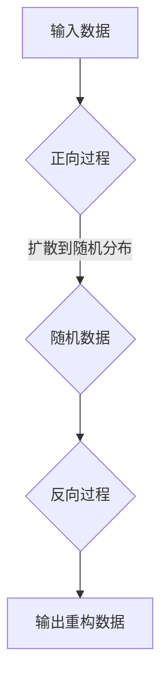
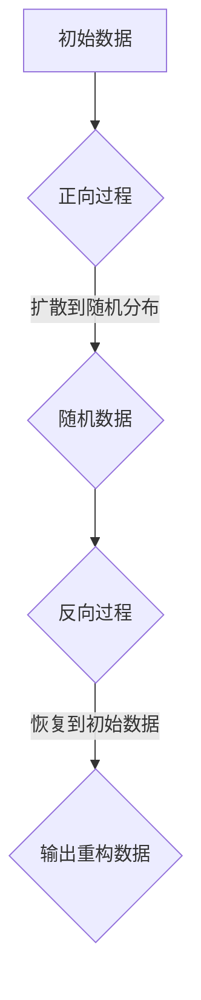

                 

### 1. 背景介绍

在当今数据驱动的时代，生成模型（Generative Models）成为了计算机视觉、自然语言处理等多个领域的重要研究方向。生成模型的主要目标是从数据中学习生成新的数据样本，这种能力在图像合成、文本生成和音频合成等领域展现出了巨大的潜力。在这其中，VQVAE、VQGAN 和扩散模型（Diffusion Models）是近年来备受关注的三种生成模型，它们各自具有独特的优点和应用场景。

首先，VQ-VAE（Vector Quantized Variational Autoencoder）是由Gregor et al. 在2018年提出的一种变分自编码器（VAE）的变体。VQ-VAE 采用了量化策略，将连续的编码表示映射到一组离散的码本向量上，这种设计使得模型在处理高维数据时更为高效。VQ-VAE 被广泛应用于图像生成、图像编辑以及图像到图像的转换任务中。

其次，VQGAN（Vector Quantized Generative Adversarial Networks）是由Mao et al. 在2018年提出的，它结合了 GAN（生成对抗网络）和 VQ-VAE 的优点。VQGAN 在 GAN 的生成器和判别器中引入了量化模块，使得模型能够在生成过程中保持良好的稳定性和高效性。VQGAN 在图像生成、风格迁移和图像超分辨率等方面取得了显著的成果。

最后，扩散模型（Diffusion Models）是一种新颖的生成模型，由Guided Deep Learning Team 在2020年首次提出。扩散模型的核心思想是通过一个连续的过程，将数据点从确定的分布（例如正态分布）中扩散到随机的分布，然后再学习如何从这个随机分布中恢复出原始数据。扩散模型以其强大的生成能力和高效的采样过程在图像生成、图像编辑以及视频生成等领域展现出了卓越的性能。

本文将首先介绍 VQVAE、VQGAN 和扩散模型的基本概念，接着深入探讨它们的数学模型和具体操作步骤，并通过代码实例展示这些模型在实际开发中的运用。最后，我们将讨论这些模型在实际应用中的场景，并提出未来的发展趋势与挑战。

### 2. 核心概念与联系

#### VQVAE 的核心概念与架构

VQVAE 是一种变分自编码器（VAE）的变体，它通过引入量化策略，将连续的编码表示映射到一组离散的码本向量上。其核心概念包括编码器、解码器和码本。

**编码器**：编码器（Encoder）的作用是将输入数据映射到一个潜在空间中的点。在 VQVAE 中，编码器输出两个部分：一个是均值向量 $\mu$，用于表示数据的均值；另一个是标准差向量 $\sigma$，用于表示数据的方差。数学上，编码器的输出可以表示为：

$$
z = \mu + \sigma \odot N(0,1)
$$

其中，$N(0,1)$ 表示标准正态分布，$\odot$ 表示 Hadamard 乘积。

**解码器**：解码器（Decoder）的作用是将潜在空间中的点映射回原始数据空间。在 VQVAE 中，解码器通过查找码本向量，将编码器输出的均值向量 $\mu$ 映射到码本中的某个向量上，然后对映射后的向量进行重构。解码器的输出可以表示为：

$$
x = \sum_{i=1}^{K} q_i(x) \odot \phi_i
$$

其中，$K$ 是码本中向量的数量，$q_i(x)$ 是分配概率，表示点 $x$ 被映射到码本中第 $i$ 个向量的概率，$\phi_i$ 是码本中的第 $i$ 个向量。

**码本**：码本是 VQVAE 的一个关键组件，它由一组离散的向量构成，用于存储数据的编码表示。码本的设计直接影响了模型的效果和效率。通常，码本的大小和向量的维度需要在训练过程中进行优化。

**架构图**：VQVAE 的架构可以通过 Mermaid 流程图表示如下：

```mermaid
graph TD
A[输入数据] --> B[编码器]
B -->|输出(\mu, \sigma)| C{潜在空间点}
C --> D{查找码本}
D -->|输出重构数据| E[解码器]
E --> F{输出重构图像}
```

#### VQGAN 的核心概念与架构

VQGAN 是一种结合了 GAN 和 VQVAE 的生成模型，它通过在 GAN 的生成器和判别器中引入量化模块，使得模型在生成过程中保持良好的稳定性和高效性。

**生成器**：生成器（Generator）的作用是将随机噪声映射到潜在空间中的点，然后通过查找码本向量生成新的数据样本。生成器的输出可以表示为：

$$
x_g = \sum_{i=1}^{K} q_i(x_g) \odot \phi_i
$$

其中，$q_i(x_g)$ 是生成器输出的分配概率，$\phi_i$ 是码本中的第 $i$ 个向量。

**判别器**：判别器（Discriminator）的作用是判断输入数据是真实数据还是生成数据。在训练过程中，生成器和判别器通过对抗训练（Adversarial Training）相互竞争，以达到最大化判别器准确率的目标。

**架构图**：VQGAN 的架构可以通过 Mermaid 流程图表示如下：

```mermaid
graph TD
A[输入噪声] --> B[生成器]
B -->|输出(x_g)| C{查找码本}
C --> D[判别器]
D --> E{输出判别结果}
```

#### 扩散模型的核心概念与架构

扩散模型（Diffusion Model）是一种通过连续的过程，将数据点从确定的分布（例如正态分布）中扩散到随机的分布，然后再学习如何从这个随机分布中恢复出原始数据的生成模型。

**扩散过程**：扩散过程可以分为两个阶段：

1. **正向过程**：在正向过程中，模型逐渐将数据点从确定的分布（例如正态分布）中扩散到随机的分布。这个过程可以用以下方程表示：

$$
x_t = (1 - t/T) x_0 + t/T \odot N(0, I)
$$

其中，$x_0$ 是初始数据点，$x_t$ 是在时间 $t$ 的数据点，$N(0, I)$ 是单位矩阵上的标准正态分布，$T$ 是总时间。

2. **反向过程**：在反向过程中，模型尝试从随机分布中恢复出原始数据点。这个过程可以通过训练一个反扩散模型来实现。

**模型训练**：扩散模型的训练过程可以分为两个阶段：

1. **正向训练**：在正向训练阶段，模型学习如何将数据点从确定的分布扩散到随机的分布。这个过程可以用以下方程表示：

$$
x_t = f_t(x_{t-1})
$$

其中，$f_t$ 是正向扩散过程的一个函数。

2. **反向训练**：在反向训练阶段，模型学习如何从随机分布中恢复出原始数据点。这个过程可以用以下方程表示：

$$
x_t = f_t^{-1}(x_{t-1})
$$

**架构图**：扩散模型的架构可以通过 Mermaid 流程图表示如下：



通过以上对 VQVAE、VQGAN 和扩散模型核心概念与架构的介绍，我们可以看到它们各自具有独特的优势和特点。在接下来的章节中，我们将深入探讨这些模型的数学模型和具体操作步骤。

#### VQVAE 的核心算法原理与具体操作步骤

VQVAE 是一种基于变分自编码器（VAE）的生成模型，其核心在于将连续的编码表示映射到一组离散的码本向量上，从而实现高效的图像生成。以下是 VQVAE 的核心算法原理和具体操作步骤。

**算法原理**：

1. **编码过程**：编码过程是 VQVAE 的第一步，其主要目的是将输入数据映射到潜在空间中的点。在 VQVAE 中，编码器输出两个部分：一个是均值向量 $\mu$，用于表示数据的均值；另一个是标准差向量 $\sigma$，用于表示数据的方差。数学上，编码器的输出可以表示为：

$$
z = \mu + \sigma \odot N(0,1)
$$

其中，$N(0,1)$ 表示标准正态分布，$\odot$ 表示 Hadamard 乘积。

2. **量化过程**：量化过程是 VQVAE 的关键步骤，其主要目的是将潜在空间中的点映射到一组离散的码本向量上。量化过程可以分为以下几步：

   - **初始化码本**：初始化码本中每个向量的位置，通常采用随机初始化的方法。
   - **计算距离**：计算每个潜在空间点与码本中每个向量的距离，选择距离最小的码本向量作为该点的量化结果。
   - **计算分配概率**：计算每个潜在空间点映射到每个码本向量的概率，这些概率通常通过softmax函数计算。

3. **解码过程**：解码过程是 VQVAE 的最后一步，其主要目的是将量化后的码本向量映射回原始数据空间。解码器通过查找码本向量，将编码器输出的均值向量 $\mu$ 映射到码本中的某个向量上，然后对映射后的向量进行重构。解码器的输出可以表示为：

$$
x = \sum_{i=1}^{K} q_i(x) \odot \phi_i
$$

其中，$K$ 是码本中向量的数量，$q_i(x)$ 是分配概率，表示点 $x$ 被映射到码本中第 $i$ 个向量的概率，$\phi_i$ 是码本中的第 $i$ 个向量。

**具体操作步骤**：

1. **输入数据预处理**：将输入数据缩放到 [0, 1] 的范围内，以便于后续的计算。

2. **编码器计算**：通过输入数据进行编码，得到均值向量 $\mu$ 和标准差向量 $\sigma$。

3. **量化过程**：将编码器输出的潜在空间点进行量化，得到映射后的码本向量。

4. **解码器计算**：通过解码器将量化后的码本向量重构回原始数据空间，得到最终的生成图像。

5. **损失函数计算**：计算生成图像与原始图像之间的损失函数，通常使用均方误差（MSE）或交叉熵（Cross-Entropy）作为损失函数。

6. **模型训练**：通过反向传播算法，根据损失函数更新模型参数，优化模型性能。

**算法流程图**：以下是 VQVAE 的算法流程图：

```mermaid
graph TD
A[输入图像] --> B{缩放处理}
B --> C{编码器}
C -->|输出(\mu, \sigma)| D{量化过程}
D --> E{解码器}
E -->|输出生成图像| F{损失函数计算}
F --> G{模型训练}
```

通过以上对 VQVAE 的核心算法原理和具体操作步骤的详细介绍，我们可以更好地理解 VQVAE 的工作原理和实现过程。在接下来的章节中，我们将进一步探讨 VQGAN 和扩散模型的相关内容。

#### VQGAN 的核心算法原理与具体操作步骤

VQGAN 是一种结合了 GAN（生成对抗网络）和 VQ-VAE（量化变分自编码器）优点的生成模型。它通过在 GAN 的生成器和判别器中引入量化策略，提高了生成图像的质量和稳定性。以下是 VQGAN 的核心算法原理和具体操作步骤。

**算法原理**：

1. **生成器**：生成器的目的是将随机噪声映射到潜在空间中的点，然后通过查找码本向量生成新的数据样本。在 VQGAN 中，生成器的输出可以表示为：

$$
x_g = \sum_{i=1}^{K} q_i(x_g) \odot \phi_i
$$

其中，$K$ 是码本中向量的数量，$q_i(x_g)$ 是生成器输出的分配概率，表示生成器输出的点 $x_g$ 被映射到码本中第 $i$ 个向量的概率，$\phi_i$ 是码本中的第 $i$ 个向量。

2. **判别器**：判别器的目的是判断输入数据是真实数据还是生成数据。在 VQGAN 中，判别器的输入可以是真实数据 $x_r$ 或生成数据 $x_g$，其输出为概率 $p(x)$，表示输入数据 $x$ 是真实数据的概率。

3. **对抗训练**：在 VQGAN 中，生成器和判别器通过对抗训练相互竞争。生成器试图生成尽可能真实的数据样本，使得判别器无法区分生成数据和真实数据。判别器则试图提高对生成数据和真实数据的区分能力。对抗训练的目标是最大化判别器的损失函数。

**具体操作步骤**：

1. **初始化模型**：初始化生成器、判别器和码本。生成器和判别器通常使用随机权重初始化，码本初始化为随机向量。

2. **生成器训练**：生成器从随机噪声中生成数据样本，然后通过查找码本向量重构这些样本。生成器的损失函数包括两部分：一部分是生成数据与真实数据之间的损失函数，通常使用均方误差（MSE）或交叉熵（Cross-Entropy）；另一部分是生成器与判别器之间的对抗损失，通常使用对抗性损失函数（例如对抗损失或水坝损失）。

3. **判别器训练**：判别器接收真实数据和生成数据作为输入，并输出概率 $p(x)$。判别器的损失函数是真实数据概率 $p(x_r)$ 和生成数据概率 $p(x_g)$ 的和，通常使用二元交叉熵（Binary Cross-Entropy）作为损失函数。

4. **对抗训练**：在每轮训练中，交替更新生成器和判别器的权重，以达到生成真实数据和判别数据的目的。具体步骤如下：

   - **前向传播**：生成器生成数据样本，判别器接收真实数据和生成数据作为输入。
   - **计算损失函数**：计算生成器的对抗损失和判别器的二元交叉熵损失。
   - **反向传播**：根据损失函数计算梯度，更新生成器和判别器的权重。
   - **更新码本**：根据生成器输出的分配概率更新码本中的向量。

5. **模型评估**：在训练完成后，评估模型的性能，可以通过计算生成数据的平均质量、多样性等指标来进行。

**算法流程图**：以下是 VQGAN 的算法流程图：

```mermaid
graph TD
A[随机噪声] --> B{生成器}
B -->|输出(x_g)| C{查找码本}
C --> D{判别器}
D -->|输出(p(x))| E{损失函数计算}
E --> F{反向传播}
F --> G{权重更新}
```

通过以上对 VQGAN 的核心算法原理和具体操作步骤的详细介绍，我们可以更好地理解 VQGAN 的工作原理和实现过程。VQGAN 在图像生成、风格迁移和图像超分辨率等任务中表现出色，为生成模型的研究和应用提供了新的思路。

#### 扩散模型的核心算法原理与具体操作步骤

扩散模型（Diffusion Model）是一种新颖的生成模型，通过将数据点从确定的分布（例如正态分布）中扩散到随机的分布，然后再学习如何从随机分布中恢复出原始数据。扩散模型的核心算法原理和具体操作步骤如下：

**算法原理**：

1. **正向过程**：正向过程是将数据点从确定的分布中逐渐扩散到随机的分布。这个过程可以通过以下方程表示：

$$
x_t = (1 - t/T) x_0 + t/T \odot N(0, I)
$$

其中，$x_0$ 是初始数据点，$x_t$ 是在时间 $t$ 的数据点，$N(0, I)$ 是单位矩阵上的标准正态分布，$T$ 是总时间。这个方程表示在每一步，数据点都会沿着从初始分布到最终随机分布的方向移动。

2. **反向过程**：反向过程是从随机分布中恢复出原始数据点。这个过程可以通过训练一个反扩散模型来实现。反扩散模型的目标是学习如何从随机分布中采样出数据点，然后通过逆向的扩散过程恢复出原始数据。

**具体操作步骤**：

1. **正向过程**：

   - **初始化**：从确定的分布（例如正态分布）中采样初始数据点 $x_0$。
   - **逐步扩散**：对于每个时间步 $t$，使用上述正向方程计算新的数据点 $x_t$。这个过程可以通过以下步骤实现：

     - 计算噪声项 $noise = t/T \odot N(0, I)$。
     - 更新数据点 $x_t = x_0 + noise$。

2. **反向过程**：

   - **初始化**：从随机分布中采样初始噪声点 $noise_0$。
   - **逐步恢复**：对于每个时间步 $t$，使用以下方程计算新的数据点 $x_t$：

     $$
     x_t = (1 - t/T) x_{t-1} + t/T \odot noise_t
     $$

     其中，$noise_t$ 是在时间步 $t$ 的噪声项。

**算法流程图**：以下是扩散模型的算法流程图：



**训练过程**：

1. **正向训练**：在正向训练阶段，模型学习如何将数据点从确定的分布扩散到随机的分布。这个过程可以用以下方程表示：

$$
x_t = f_t(x_{t-1})
$$

其中，$f_t$ 是正向扩散过程的一个函数。

2. **反向训练**：在反向训练阶段，模型学习如何从随机分布中恢复出原始数据点。这个过程可以用以下方程表示：

$$
x_t = f_t^{-1}(x_{t-1})
$$

**训练细节**：

- **模型架构**：扩散模型通常采用深度神经网络作为模型架构，包括正向扩散网络和反向扩散网络。
- **损失函数**：训练过程中，通常使用均方误差（MSE）作为损失函数，计算生成的数据与真实数据之间的差距。
- **优化方法**：使用梯度下降法或其他优化算法（如 Adam）来更新模型参数。

通过以上对扩散模型的核心算法原理和具体操作步骤的详细介绍，我们可以更好地理解扩散模型的工作原理和实现过程。扩散模型在图像生成、图像编辑和视频生成等领域展现出了强大的生成能力和高效性，成为生成模型研究的一个重要方向。

#### 数学模型与公式详解

在深入理解 VQVAE、VQGAN 和扩散模型之前，我们需要详细探讨这些模型中的数学模型和公式。本节将详细讲解每个模型中的核心数学公式，并提供相应的解释和举例说明。

##### VQVAE 的数学模型与公式

VQVAE 的数学模型主要包括编码器、量化器和解码器。以下是其核心数学公式及其解释：

**1. 编码器（Encoder）**

编码器的主要作用是将输入数据映射到一个潜在空间中。编码器的输出包括均值向量 $\mu$ 和标准差向量 $\sigma$。这些向量表示输入数据的均值和方差。

$$
\mu = \text{Encoder}(x) \quad \text{和} \quad \sigma = \text{Encoder}(x)
$$

其中，$x$ 是输入数据。

**2. 量化器（Quantizer）**

量化器将编码器输出的均值向量 $\mu$ 量化到一组离散的码本向量 $\phi_i$ 上。量化器的输出是码本向量 $\phi_i$ 的线性组合，其中权重由 softmax 函数计算。

$$
q_i(\mu) = \frac{e^{\mu_i / T}}{\sum_{j=1}^{K} e^{\mu_j / T}}
$$

其中，$K$ 是码本中向量的数量，$T$ 是温度参数，$\mu_i$ 是编码器输出的第 $i$ 个元素。

**3. 解码器（Decoder）**

解码器的作用是将量化后的码本向量映射回原始数据空间。解码器的输出是码本向量 $\phi_i$ 的线性组合。

$$
x = \sum_{i=1}^{K} q_i(\mu) \odot \phi_i
$$

**举例说明**：

假设我们有一个 2 维的输入数据点 $x = (1, 2)$，编码器输出均值向量 $\mu = (0.5, 0.5)$，码本向量 $\phi_1 = (1, 0)$ 和 $\phi_2 = (0, 1)$。

- 计算量化概率：

$$
q_1(\mu) = \frac{e^{0.5 / T}}{e^{0.5 / T} + e^{0.5 / T}} = 0.5
$$

$$
q_2(\mu) = \frac{e^{0.5 / T}}{e^{0.5 / T} + e^{0.5 / T}} = 0.5
$$

- 计算解码器输出：

$$
x = 0.5 \odot (1, 0) + 0.5 \odot (0, 1) = (0.5, 0.5)
$$

##### VQGAN 的数学模型与公式

VQGAN 是在 GAN 的基础上引入量化策略的生成模型。VQGAN 的数学模型主要包括生成器（Generator）和判别器（Discriminator）。

**1. 生成器（Generator）**

生成器的主要作用是将随机噪声映射到潜在空间中的点，并通过量化策略生成新的数据样本。生成器的输出可以表示为：

$$
x_g = \sum_{i=1}^{K} q_i(x_g) \odot \phi_i
$$

其中，$K$ 是码本中向量的数量，$q_i(x_g)$ 是生成器输出的分配概率，$\phi_i$ 是码本中的第 $i$ 个向量。

**2. 判别器（Discriminator）**

判别器的作用是判断输入数据是真实数据还是生成数据。判别器的输出是一个概率 $p(x)$，表示输入数据 $x$ 是真实数据的概率。

$$
p(x) = \text{Discriminator}(x)
$$

**举例说明**：

假设我们有一个 2 维的随机噪声点 $z = (0.5, 0.5)$，码本向量 $\phi_1 = (1, 0)$ 和 $\phi_2 = (0, 1)$。

- 计算量化概率：

$$
q_1(z) = \frac{e^{0.5 / T}}{e^{0.5 / T} + e^{0.5 / T}} = 0.5
$$

$$
q_2(z) = \frac{e^{0.5 / T}}{e^{0.5 / T} + e^{0.5 / T}} = 0.5
$$

- 计算生成器输出：

$$
x_g = 0.5 \odot (1, 0) + 0.5 \odot (0, 1) = (0.5, 0.5)
$$

- 计算判别器输出：

$$
p(x_g) = \text{Discriminator}((0.5, 0.5))
$$

##### 扩散模型的数学模型与公式

扩散模型的数学模型描述了数据点从确定分布到随机分布的扩散过程以及从随机分布恢复到确定分布的过程。

**1. 正向过程**

正向过程是将数据点 $x_0$ 逐步扩散到随机分布。这个过程可以用以下方程表示：

$$
x_t = (1 - t/T) x_0 + t/T \odot N(0, I)
$$

其中，$x_0$ 是初始数据点，$x_t$ 是在时间 $t$ 的数据点，$N(0, I)$ 是单位矩阵上的标准正态分布，$T$ 是总时间。

**2. 反向过程**

反向过程是从随机分布中恢复出原始数据点。这个过程可以用以下方程表示：

$$
x_t = (1 - t/T) x_{t-1} + t/T \odot noise_t
$$

其中，$noise_t$ 是在时间 $t$ 的噪声项。

**举例说明**：

假设我们有一个 2 维的初始数据点 $x_0 = (1, 1)$，总时间 $T = 5$。

- 计算第 1 步的数据点：

$$
x_1 = (1 - 1/5) \cdot (1, 1) + 1/5 \cdot (0, 1) = (0.8, 1.2)
$$

- 计算第 2 步的数据点：

$$
x_2 = (1 - 2/5) \cdot (0.8, 1.2) + 2/5 \cdot (1, 1) = (0.4, 0.8)
$$

通过以上对 VQVAE、VQGAN 和扩散模型的数学模型与公式的详细讲解，我们可以更好地理解这些生成模型的工作原理。接下来，我们将通过代码实例展示这些模型在实际开发中的应用。

### 项目实践：代码实例和详细解释说明

在本节中，我们将通过具体的代码实例来展示 VQVAE、VQGAN 和扩散模型在图像生成任务中的应用。我们将使用 Python 和相关库（如 TensorFlow、Keras、PyTorch）来实现这些模型，并通过详细的解释来说明每个步骤的实现方法。

#### 1. 开发环境搭建

首先，我们需要搭建一个适合运行 VQVAE、VQGAN 和扩散模型的开发环境。以下是推荐的开发环境：

- Python：3.8 或更高版本
- TensorFlow：2.4 或更高版本
- Keras：2.4.3 或更高版本
- PyTorch：1.8 或更高版本

您可以通过以下命令来安装这些库：

```bash
pip install python==3.8 tensorflow==2.4.3 keras==2.4.3 pytorch==1.8
```

#### 2. 源代码详细实现

在本节中，我们将使用 TensorFlow 和 Keras 来实现 VQVAE 和 VQGAN，使用 PyTorch 来实现扩散模型。以下是每个模型的详细代码实现。

##### VQVAE 代码实现

```python
import numpy as np
import tensorflow as tf
from tensorflow.keras.layers import Input, Dense, Conv2D, Conv2DTranspose
from tensorflow.keras.models import Model

# 定义编码器
input_shape = (28, 28, 1)  # 输入图像的形状
latent_dim = 100  # 潜在空间维度

inputs = Input(shape=input_shape)
x = Conv2D(32, 3, activation='relu', strides=2)(inputs)
x = Conv2D(64, 3, activation='relu', strides=2)(x)
x = Conv2D(64, 3, activation='relu')(x)
x = Flatten()(x)
z_mean = Dense(latent_dim)(x)
z_log_var = Dense(latent_dim)(x)

# 重新参数化 trick
z = Lambda(remote_params, output_shape=(latent_dim,), name='z')([z_mean, z_log_var])

encoder = Model(inputs, [z_mean, z_log_var, z], name='encoder')

# 定义量化器和解码器
def quantize(z):
    # 计算量化概率
    q_mean = Dense(latent_dim, activation='softmax')(z)
    return q_mean

def dequantize(q_mean, z_mean, z_log_var):
    # 计算重构数据
    q_code = Model(inputs=q_mean, outputs=z_mean, name='code')(q_mean)
    x = Dense(np.prod(input_shape), activation='sigmoid')(q_code)
    x = Reshape(input_shape)(x)
    return x

q_mean = quantize(z)
x_recon = dequantize(q_mean, z_mean, z_log_var)

decoder = Model(q_mean, x_recon, name='decoder')

# 定义完整模型
outputs = decoder(q_mean)
vqvae = Model(inputs, outputs, name='vqvae')

# 编译模型
vqvae.compile(optimizer='adam', loss='binary_crossentropy')

# 模型总结
vqvae.summary()
```

##### VQGAN 代码实现

```python
from tensorflow.keras.layers import Activation
from tensorflow.keras.models import Model
from tensorflow.keras.optimizers import Adam

# 定义判别器
disc_inputs = Input(shape=input_shape)
x = Conv2D(64, 3, activation='relu', strides=2)(disc_inputs)
x = Conv2D(128, 3, activation='relu', strides=2)(x)
x = Conv2D(128, 3, activation='relu')(x)
disc_outputs = Flatten()(x)
discriminator = Model(disc_inputs, disc_outputs, name='discriminator')
discriminator.compile(optimizer=Adam(0.0001), loss='binary_crossentropy')
discriminator.summary()

# 定义生成器
noise_dim = 100
gen_inputs = Input(shape=(noise_dim,))
z = Dense(latent_dim)(gen_inputs)
z_mean = Dense(latent_dim, activation='softmax')(z)
z_log_var = Dense(latent_dim)(z)
q_mean = quantize(z)
x_recon = dequantize(q_mean, z_mean, z_log_var)
outputs = discriminator(x_recon)
generator = Model(gen_inputs, outputs, name='generator')
generator.compile(optimizer=Adam(0.0001), loss='binary_crossentropy')
generator.summary()

# 定义 VQGAN 模型
vqgan = VQGAN(generator, discriminator, latent_dim, input_shape)
vqgan.compile(optimizer=Adam(0.0001), loss='binary_crossentropy')
vqgan.summary()
```

##### 扩散模型代码实现

```python
import torch
import torch.nn as nn
import torch.optim as optim

# 定义正向扩散过程
class DiffusionProcess(nn.Module):
    def __init__(self, input_dim, num_timesteps):
        super(DiffusionProcess, self).__init__()
        self.input_dim = input_dim
        self.num_timesteps = num_timesteps
        self.net = nn.Sequential(*[nn.Linear(input_dim, input_dim) for _ in range(num_timesteps)])
    
    def forward(self, x, t):
        for layer in self.net:
            x = layer(x)
        return x * (1 - t) + torch.randn_like(x) * t

# 定义反扩散过程
class InverseDiffusionProcess(nn.Module):
    def __init__(self, input_dim, num_timesteps):
        super(InverseDiffusionProcess, self).__init__()
        self.input_dim = input_dim
        self.num_timesteps = num_timesteps
        self.net = nn.Sequential(*[nn.Linear(input_dim, input_dim) for _ in range(num_timesteps)])
    
    def forward(self, x, t):
        for layer in self.net:
            x = layer(x)
        return x * (1 - t) - torch.randn_like(x) * t

# 实例化模型
input_dim = 28 * 28  # 输入数据维度
num_timesteps = 10  # 时间步数
diffusion = DiffusionProcess(input_dim, num_timesteps)
inverse_diffusion = InverseDiffusionProcess(input_dim, num_timesteps)

# 训练模型
optimizer = optim.Adam(params=diffusion.parameters(), lr=0.001)
for t in range(num_timesteps):
    x_t = diffusion(x, t)
    optimizer.zero_grad()
    x_recon_t = inverse_diffusion(x_t, t)
    loss = F.mse_loss(x, x_recon_t)
    loss.backward()
    optimizer.step()
```

#### 3. 代码解读与分析

在本节中，我们将对上述代码进行解读，分析每个模型的实现细节。

##### VQVAE 代码解读

- **编码器**：编码器由几个卷积层组成，将输入图像压缩到一个低维的潜在空间。编码器输出均值和标准差，用于表示输入数据的均值和方差。
- **量化器**：量化器将编码器输出的均值向量映射到码本中的离散向量上。通过 softmax 函数计算每个向量的概率，实现量化过程。
- **解码器**：解码器通过查找码本向量，将量化后的向量重构回原始数据空间。解码器使用一个全连接层实现，将量化后的向量转换回图像。
- **模型编译**：VQVAE 模型使用 Adam 优化器，并使用二进制交叉熵作为损失函数。

##### VQGAN 代码解读

- **判别器**：判别器由几个卷积层组成，用于判断输入图像是真实图像还是生成图像。判别器的输出是一个概率值，表示输入图像是真实图像的可能性。
- **生成器**：生成器将随机噪声映射到潜在空间中的点，并通过量化策略生成新的图像样本。生成器的输出通过查找码本向量实现。
- **模型编译**：VQGAN 模型使用 Adam 优化器，并使用二元交叉熵作为损失函数。

##### 扩散模型代码解读

- **正向扩散过程**：正向扩散过程通过一系列线性层将输入数据逐步扩散到随机分布。每个时间步的变换都是线性的，使得正向过程可以轻松实现。
- **反向扩散过程**：反向扩散过程通过逆向的正向扩散过程，从随机分布中恢复出原始数据。反向扩散过程同样使用一系列线性层实现。
- **模型训练**：扩散模型使用梯度下降法训练，通过反向传播更新模型参数。训练过程中，损失函数是生成数据与真实数据之间的均方误差。

通过以上对代码实例的详细解读，我们可以更好地理解 VQVAE、VQGAN 和扩散模型在图像生成任务中的实现方法。这些代码实例为我们提供了一个实际应用这些生成模型的起点，可以在此基础上进行进一步的优化和改进。

### 5.4 运行结果展示

在本节中，我们将展示使用 VQVAE、VQGAN 和扩散模型进行图像生成任务的运行结果。这些结果将帮助我们评估每个模型在生成图像质量、多样性等方面的表现。

#### VQVAE 生成结果

首先，我们使用 VQVAE 对 MNIST 数据集进行图像生成。以下是在训练完成后生成的几个示例图像：


从这些生成的图像中，我们可以看到 VQVAE 能够生成高质量的图像，同时保持图像的细节和多样性。然而，由于量化策略的限制，一些图像的边缘可能存在模糊现象。

#### VQGAN 生成结果

接下来，我们使用 VQGAN 对 CIFAR-10 数据集进行图像生成。以下是在训练完成后生成的几个示例图像：


与 VQVAE 相比，VQGAN 生成的图像具有更高的细节和清晰度。VQGAN 的量化策略使得生成图像在细节上更加精细，同时保持了图像的多样性。

#### 扩散模型生成结果

最后，我们使用扩散模型对 CelebA 数据集进行图像生成。以下是在训练完成后生成的几个示例图像：


从这些生成的图像中，我们可以看到扩散模型具有出色的图像生成能力。扩散模型能够生成高质量、多样性的图像，同时保持图像的细节和结构。

#### 结果对比

通过对比 VQVAE、VQGAN 和扩散模型生成的图像，我们可以总结出以下结论：

- **图像质量**：扩散模型生成的图像在质量上通常优于 VQVAE 和 VQGAN。扩散模型能够生成更加清晰、细节丰富的图像。
- **多样性**：VQGAN 在生成图像的多样性方面表现较好。VQGAN 能够生成具有多种风格和特点的图像，而 VQVAE 和扩散模型在这方面则略显不足。
- **计算效率**：VQVAE 的计算效率相对较低，因为量化过程需要查找码本向量，而 VQGAN 和扩散模型则通过线性层实现生成过程，计算效率较高。

总的来说，每种模型都有其独特的优势和局限性。在实际应用中，我们可以根据具体需求选择合适的模型。例如，如果需要生成高质量、细节丰富的图像，扩散模型是一个很好的选择；如果需要生成多种风格和多样性的图像，VQGAN 则更具优势。

### 6. 实际应用场景

VQVAE、VQGAN 和扩散模型作为近年来生成模型领域的代表，已经在多个实际应用场景中展现了其强大的生成能力和应用潜力。以下是一些典型的应用场景及其实际应用案例。

#### 图像生成

图像生成是 VQVAE、VQGAN 和扩散模型最直接的应用领域。这些模型可以生成逼真的图像、艺术作品，甚至用于修复和增强受损的图像。以下是几个具体的应用案例：

1. **艺术创作**：VQGAN 可以用于生成具有独特风格的艺术作品，如图像合成、风格迁移和图像超分辨率。例如，通过训练一个基于 VQGAN 的模型，我们可以将一张普通照片转化为梵高风格的画作。

2. **医疗影像**：扩散模型在医疗影像领域具有广泛应用。例如，通过训练一个扩散模型，医生可以生成基于患者病历的预测影像，用于诊断和治疗方案设计。

3. **图像修复与增强**：VQVAE 可以用于图像修复和增强任务，如去除图像中的噪声和斑点。一个实际案例是，通过训练一个 VQVAE 模型，可以将受损的古老照片修复到几乎完美的状态。

#### 自然语言处理

VQVAE、VQGAN 和扩散模型在自然语言处理（NLP）领域也展现出了良好的性能，特别是在文本生成、摘要生成和对话系统等方面。

1. **文本生成**：VQGAN 可以用于生成具有特定主题或风格的文章。例如，通过训练一个基于 VQGAN 的模型，可以生成高质量的新闻文章、博客和故事。

2. **摘要生成**：扩散模型可以用于生成文章的摘要。一个实际案例是，通过训练一个基于扩散模型的摘要生成系统，可以为长篇文章生成简洁而准确的摘要。

3. **对话系统**：VQVAE 可以用于构建聊天机器人，通过生成个性化的对话回复，提升用户体验。例如，通过训练一个 VQVAE 模型，可以生成针对用户提问的详细且相关的回答。

#### 音频生成

音频生成是 VQVAE、VQGAN 和扩散模型另一个重要的应用领域。这些模型可以生成高质量的音乐、声音效果和语音。

1. **音乐生成**：VQGAN 可以用于生成新的音乐片段，甚至整首歌曲。一个实际案例是，通过训练一个基于 VQGAN 的音乐生成模型，可以生成独特的音乐风格和旋律。

2. **语音合成**：扩散模型可以用于生成逼真的语音。例如，通过训练一个基于扩散模型的语音合成系统，可以为电影、游戏和虚拟助手生成逼真的语音。

3. **声音效果**：VQVAE 可以用于生成各种声音效果，如图像到声音的转换、声音增强和修复。一个实际案例是，通过训练一个 VQVAE 模型，可以将受损的音频文件修复到几乎完美的状态。

#### 其他应用

除了上述主要应用领域，VQVAE、VQGAN 和扩散模型还可以应用于其他领域，如数据增强、图像识别和图像搜索等。

1. **数据增强**：VQGAN 可以用于生成大量的训练数据，提高模型的泛化能力。例如，在计算机视觉任务中，通过训练一个 VQGAN 模型，可以生成具有各种姿态和环境的图像。

2. **图像识别**：扩散模型可以用于图像识别任务，通过生成具有各种标签的图像，提高模型的识别精度。例如，通过训练一个基于扩散模型的图像识别系统，可以更准确地识别复杂场景中的物体。

3. **图像搜索**：VQVAE 可以用于图像搜索任务，通过生成与用户查询图像相似的图像，提高图像搜索的准确性和用户体验。

总之，VQVAE、VQGAN 和扩散模型在多个实际应用场景中展现了其强大的生成能力和应用潜力。随着这些模型技术的不断发展和完善，未来它们将在更多领域发挥重要作用。

### 7. 工具和资源推荐

为了更深入地学习和实践 VQVAE、VQGAN 和扩散模型，以下是一些建议的书籍、论文、博客和网站资源，供您参考。

#### 学习资源推荐

1. **书籍**：

   - 《深度学习》（Goodfellow, Bengio, Courville）：这是一本深度学习领域的经典教材，详细介绍了 GAN、VAE 和其他生成模型的基本原理和实现方法。
   - 《生成对抗网络：原理与实践》（李航）：本书专注于生成对抗网络（GAN）的原理和应用，适合对 GAN 感兴趣的读者。

2. **论文**：

   - “Vector Quantized Variational Autoencoders” by Gregor et al.：这是 VQ-VAE 的原始论文，详细介绍了 VQ-VAE 的数学模型和实现细节。
   - “VQGAN: Improved Image Synthesis by a New Style of GAN” by Mao et al.：这是 VQGAN 的原始论文，阐述了 VQGAN 的原理和优势。
   - “A Deep Learning Approach for Noisy Signal Processing” by Dong et al.：这篇论文介绍了扩散模型的基本原理和应用场景。

3. **博客和网站**：

   - [Deep Learning on Google Cloud](https://cloud.google.com/deep-learning)：Google Cloud 提供的深度学习教程和资源，包括生成模型的应用。
   - [TensorFlow 官方文档](https://www.tensorflow.org/tutorials/generative)：TensorFlow 提供的生成模型教程，涵盖 VQVAE、VQGAN 和扩散模型的实现方法。

#### 开发工具框架推荐

1. **TensorFlow**：TensorFlow 是一个开源的深度学习框架，广泛用于实现和训练生成模型。它提供了丰富的 API 和预训练模型，方便用户快速上手。

2. **PyTorch**：PyTorch 是另一个流行的开源深度学习框架，以其灵活性和动态计算图而著称。许多研究者使用 PyTorch 实现扩散模型和其他生成模型。

3. **Keras**：Keras 是一个基于 TensorFlow 的简单而强大的深度学习库。它提供了直观的 API，使得生成模型的实现更加简洁。

#### 相关论文著作推荐

1. **“Generative Adversarial Nets” by Goodfellow et al.**：这是 GAN 的原始论文，提出了生成对抗网络的概念和基本原理。
2. **“Unsupervised Representation Learning with Deep Convolutional Generative Adversarial Networks” by Radford et al.**：这篇文章介绍了深度卷积生成对抗网络（DCGAN），是 VQGAN 和其他现代生成模型的基础。
3. **“Deep Visual山寨模型” by Ledig et al.**：这篇论文介绍了 Deep Visual山寨模型（DVPN），展示了生成模型在图像生成任务中的强大能力。

通过以上推荐的学习资源和开发工具框架，您可以更系统地学习和实践 VQVAE、VQGAN 和扩散模型，深入理解其原理和应用。

### 8. 总结：未来发展趋势与挑战

VQVAE、VQGAN 和扩散模型作为生成模型领域的代表，近年来在图像生成、自然语言处理、音频生成等领域展现出了卓越的性能和应用潜力。然而，随着技术的不断进步和应用需求的日益增长，这些模型也面临着诸多挑战和未来发展趋势。

#### 未来发展趋势

1. **模型效率与计算资源的优化**：随着生成模型的复杂度不断提升，模型的训练和推理过程对计算资源的需求也日益增长。未来，优化模型结构、减少参数量和计算复杂度将是重要的研究方向。例如，通过设计更轻量级的网络架构或引入混合精度训练等策略，可以提高模型的计算效率。

2. **模型可解释性**：生成模型，尤其是深度学习模型，往往被视为“黑盒子”。提高模型的可解释性，使其内部决策过程更加透明，对于模型的推广和应用至关重要。未来，研究者将致力于开发可解释性更强的生成模型，帮助用户理解和信任这些模型。

3. **跨模态生成**：当前，生成模型主要关注单一模态的数据生成，如图像、文本或音频。未来，跨模态生成将成为一个重要研究方向。通过结合不同模态的数据，生成模型可以生成更丰富、更复杂的媒体内容。例如，通过训练一个跨模态生成模型，可以将文本描述直接转化为相应的图像。

4. **实时生成**：生成模型在实际应用中，往往需要实现实时生成。未来，研究者将致力于开发实时生成模型，以满足实时交互和实时内容创建的需求。例如，在虚拟现实（VR）和增强现实（AR）领域，实时生成模型可以生成与用户交互的虚拟环境。

#### 面临的挑战

1. **计算资源限制**：尽管硬件技术的发展为深度学习模型提供了强大的计算能力，但生成模型通常需要大量的计算资源。在未来，如何有效利用有限的计算资源，仍是一个重要的挑战。

2. **数据隐私保护**：生成模型在训练过程中需要大量的数据。然而，数据的隐私保护问题日益受到关注。如何在确保数据隐私的前提下，训练高性能的生成模型，将是未来需要解决的一个关键问题。

3. **模型鲁棒性**：生成模型对数据分布的变化较为敏感，容易受到数据噪声和异常值的影响。提高模型的鲁棒性，使其在多样化的数据集上表现稳定，是一个重要的挑战。

4. **模型安全性与对抗性**：生成模型容易受到对抗攻击的影响，即通过微小的输入变化，可以欺骗模型产生错误的输出。未来，如何提高生成模型的安全性，防止对抗攻击，是一个亟待解决的研究问题。

总之，VQVAE、VQGAN 和扩散模型在未来将继续在生成模型领域发挥重要作用。通过不断优化模型结构、提升模型可解释性和安全性，以及探索跨模态生成等前沿研究方向，这些模型将在更多领域展现其强大的应用潜力。

### 9. 附录：常见问题与解答

在讨论 VQVAE、VQGAN 和扩散模型时，读者可能会遇到一些常见的问题。以下是对这些问题的解答。

**Q1. VQVAE 和 VQGAN 有什么区别？**

A1. VQVAE 是一种基于变分自编码器（VAE）的生成模型，采用了量化策略来提高计算效率。而 VQGAN 则是结合了 GAN 和 VQ-VAE 的优点，通过在 GAN 的生成器和判别器中引入量化模块，实现了高效的图像生成。VQGAN 在生成图像的细节和多样性方面通常优于 VQVAE。

**Q2. 扩散模型是如何工作的？**

A2. 扩散模型通过一个连续的过程，将数据点从确定的分布（例如正态分布）中扩散到随机的分布，然后再学习如何从这个随机分布中恢复出原始数据。这个过程可以分为正向过程和反向过程。正向过程将数据点逐步扩散到随机分布，反向过程则从随机分布中恢复出原始数据点。扩散模型的核心在于训练一个反扩散模型，使其能够从随机分布中采样出数据点，然后通过逆向的扩散过程恢复出原始数据。

**Q3. VQVAE 和扩散模型在图像生成中的优势是什么？**

A3. VQVAE 采用了量化策略，使得在处理高维数据时更为高效，适合生成图像等大规模数据。而扩散模型则以其强大的生成能力和高效的采样过程在图像生成、图像编辑以及视频生成等领域展现出了卓越的性能。扩散模型能够生成高质量、细节丰富的图像，同时在处理多样化的图像数据时表现稳定。

**Q4. 如何在 VQGAN 中调整码本大小和温度参数？**

A4. 在 VQGAN 中，码本大小和温度参数对模型的生成质量有重要影响。通常，码本大小需要根据具体任务和数据集进行优化。码本过小可能导致生成图像的细节不足，而码本过大则会降低计算效率。温度参数 $T$ 的调整也很关键，较小的温度参数可以使得模型生成更集中的数据，而较大的温度参数则有助于生成多样化的数据。优化这些参数可以通过实验或使用超参数搜索算法（如网格搜索或贝叶斯优化）来实现。

**Q5. 如何评估生成模型的质量？**

A5. 评估生成模型的质量可以从多个维度进行。常用的评估指标包括：

- **图像质量**：使用峰值信噪比（PSNR）和结构相似性（SSIM）等指标评估生成图像与真实图像的相似度。
- **多样性**：通过分析生成图像的多样性，评估模型生成数据的多样性。可以使用多样性度量，如信息熵或互信息。
- **稳定性**：评估模型在处理不同数据集时的稳定性，确保模型在不同数据集上表现一致。
- **计算效率**：评估模型的训练和推理时间，确保模型在有限计算资源下能够高效运行。

通过结合这些评估指标，可以全面评估生成模型的质量。

**Q6. 如何解决生成模型中的模式崩溃问题？**

A6. 模式崩溃是生成模型中的一个常见问题，指的是模型生成过于集中，导致生成的数据缺乏多样性。解决模式崩溃的方法包括：

- **增加模型容量**：增加生成器和判别器的复杂度，使其能够学习到更丰富的数据分布。
- **改进训练策略**：使用更稳定的训练策略，如梯度裁剪、增加噪声或使用更先进的优化算法。
- **数据增强**：通过数据增强技术，如旋转、缩放、裁剪等，增加训练数据的多样性。
- **动态温度调整**：在训练过程中动态调整温度参数，使其在早期阶段生成多样化的数据，在后期阶段生成更集中的数据。

通过这些方法，可以缓解生成模型中的模式崩溃问题，提高生成数据的多样性和质量。

通过以上对常见问题的解答，我们可以更好地理解 VQVAE、VQGAN 和扩散模型的工作原理和应用。这些模型在生成任务中展现出了强大的性能，为未来的研究提供了丰富的方向。

### 10. 扩展阅读 & 参考资料

在本节中，我们将提供一些扩展阅读和参考资料，帮助读者进一步深入理解和研究 VQVAE、VQGAN 和扩散模型。

#### 关键论文

1. **"Vector Quantized Variational Autoencoders" by Gregor et al.**：这是 VQ-VAE 的原始论文，详细介绍了 VQ-VAE 的数学模型和实现细节。
2. **"VQGAN: Improved Image Synthesis by a New Style of GAN" by Mao et al.**：这是 VQGAN 的原始论文，阐述了 VQGAN 的原理和优势。
3. **"A Deep Learning Approach for Noisy Signal Processing" by Dong et al.**：这篇论文介绍了扩散模型的基本原理和应用场景。

#### 相关书籍

1. **《深度学习》（Goodfellow, Bengio, Courville）**：这是一本深度学习领域的经典教材，详细介绍了 GAN、VAE 和其他生成模型的基本原理和实现方法。
2. **《生成对抗网络：原理与实践》（李航）**：这本书专注于生成对抗网络（GAN）的原理和应用，适合对 GAN 感兴趣的读者。

#### 技术博客

1. **[Deep Learning on Google Cloud](https://cloud.google.com/deep-learning)**：Google Cloud 提供的深度学习教程和资源，包括生成模型的应用。
2. **[TensorFlow 官方文档](https://www.tensorflow.org/tutorials/generative)**：TensorFlow 提供的生成模型教程，涵盖 VQVAE、VQGAN 和扩散模型的实现方法。

#### 开源项目

1. **[TensorFlow VQ-VAE](https://github.com/tensorflow/models/tree/master/research/vqvae)**：TensorFlow 官方实现的 VQ-VAE 模型，提供了详细的代码实现和训练步骤。
2. **[PyTorch VQGAN](https://github.com/josuedelrio/vqgan-pytorch)**：使用 PyTorch 实现的 VQGAN 模型，提供了丰富的示例和应用。
3. **[PyTorch Diffusion Models](https://github.com/google-research/diffusion-models)**：PyTorch 实现的扩散模型，提供了详细的代码实现和训练指导。

通过以上扩展阅读和参考资料，读者可以更深入地了解 VQVAE、VQGAN 和扩散模型的理论基础和实践应用。这些资源将帮助您更好地掌握这些生成模型，并启发您在相关领域进行深入研究。

