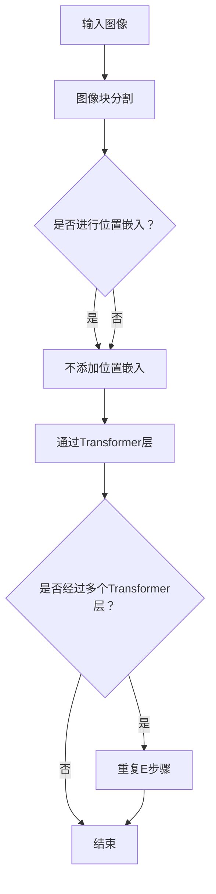

                 

### 文章标题

**ViT原理与代码实例讲解**

> **关键词**：视觉Transformer，计算机视觉，深度学习，神经网络，自注意力机制，图像分类

> **摘要**：本文深入探讨了视觉Transformer（ViT）的原理及其在计算机视觉任务中的应用。通过逐步解析ViT的架构和工作机制，结合具体代码实例，详细讲解了如何实现ViT模型并进行图像分类任务。文章还分析了ViT的优缺点，探讨了其在实际应用中的潜在场景，并推荐了相关的学习资源和开发工具。

### 1. 背景介绍

随着深度学习技术的发展，计算机视觉领域取得了显著的进展。传统的卷积神经网络（CNN）在处理图像数据时表现出色，但其局限性也逐渐显现。为了克服CNN在处理长距离依赖和信息整合方面的不足，研究者们提出了Transformer架构，并在自然语言处理（NLP）领域取得了巨大成功。视觉Transformer（ViT）则是将这种架构应用于计算机视觉领域的尝试。

ViT模型的核心思想是利用Transformer的自注意力机制，将图像数据编码为序列，从而在全局范围内捕捉图像中的特征关系。与传统的CNN相比，ViT能够在保留图像细节的同时，更好地捕捉图像中的长距离依赖关系。这使得ViT在图像分类、目标检测等计算机视觉任务中展现出强大的潜力。

本文将详细讲解ViT模型的原理及其实现过程，并通过具体代码实例展示如何在PyTorch框架中训练和部署ViT模型。希望通过本文的讲解，读者能够对ViT模型有更深入的理解，并能够将其应用于实际的计算机视觉项目中。

### 2. 核心概念与联系

#### 2.1. Transformer架构

Transformer架构是由Vaswani等人在2017年提出的一种基于自注意力机制的全连接模型。与传统的循环神经网络（RNN）和卷积神经网络（CNN）不同，Transformer模型通过自注意力机制（Self-Attention）和多头注意力机制（Multi-Head Attention）来处理序列数据，从而实现高效的信息整合和上下文理解。

**自注意力机制（Self-Attention）**：自注意力机制允许模型在处理每个输入时，根据输入序列中的其他位置来计算权重，从而自动关注输入序列中的重要信息。这有助于模型捕捉长距离依赖关系，并提高模型的表示能力。

**多头注意力机制（Multi-Head Attention）**：多头注意力机制将输入序列分成多个子序列，每个子序列独立应用自注意力机制。然后将这些子序列的输出进行拼接和线性变换，以获得全局上下文信息。这有助于模型同时关注输入序列的多个部分，提高模型的泛化能力。

#### 2.2. 视觉Transformer（ViT）

视觉Transformer（ViT）是Transformer架构在计算机视觉领域的应用。与NLP中的Transformer模型不同，ViT处理的是图像数据。ViT的核心思想是将图像数据分割成一系列图像块（Image Patch），然后将这些图像块编码为序列，并在Transformer层中处理这些序列。

**图像块分割（Image Patch）**：ViT将输入图像分割成多个大小相同的图像块。这些图像块被视为序列中的元素，并经过线性层转换为序列表示。

**位置嵌入（Positional Embedding）**：由于Transformer模型无法处理序列中的位置信息，ViT引入位置嵌入来为每个图像块赋予位置信息。这有助于模型捕捉图像块之间的空间关系。

**Transformer层（Transformer Layer）**：ViT通过多个Transformer层对图像块序列进行处理。在每个Transformer层中，图像块通过自注意力和多头注意力机制进行编码，从而捕捉图像中的全局特征和长距离依赖关系。

#### 2.3. Mermaid流程图

以下是视觉Transformer（ViT）的核心概念和架构的Mermaid流程图：



在这个流程图中，输入图像经过图像块分割，然后根据是否添加位置嵌入进行分类处理。接着，图像块序列通过Transformer层进行编码，以捕捉图像中的全局特征和长距离依赖关系。最后，根据是否需要多个Transformer层，重复或结束处理过程。

### 3. 核心算法原理 & 具体操作步骤

#### 3.1. 图像块分割

图像块分割是视觉Transformer（ViT）的第一步。在这一步骤中，输入图像被分割成多个大小相同的图像块。这些图像块可以看作是序列中的元素，并将在后续步骤中进行处理。

**步骤 1**：设定图像块的大小。通常，图像块的大小为16x16或32x32。

**步骤 2**：遍历输入图像，将其分割成图像块。每个图像块的大小与设定的大小相同。

**步骤 3**：将分割后的图像块转换为序列。这个序列将在后续步骤中进行处理。

以下是一个简单的Python代码示例，用于将输入图像分割成图像块：

```python
import torch
import torchvision.transforms as transforms

def image_to_patches(image, patch_size):
    """
    将输入图像分割成图像块。

    参数：
    - image：输入图像（Tensor）
    - patch_size：图像块大小（int）

    返回：
    - patches：图像块序列（Tensor）
    """
    transform = transforms.Compose([
        transforms.ToTensor(),
        transforms.Resize((patch_size, patch_size)),
        transforms.Normalize(mean=[0.5, 0.5, 0.5], std=[0.5, 0.5, 0.5])
    ])

    image_patches = []
    for i in range(0, image.size(1) - patch_size + 1, patch_size):
        for j in range(0, image.size(2) - patch_size + 1, patch_size):
            patch = image[:, i:i+patch_size, j:j+patch_size]
            image_patches.append(transform(patch))

    return torch.stack(image_patches)

image = torch.randn(3, 256, 256)  # 示例输入图像
patches = image_to_patches(image, 16)

print(patches.shape)  # 输出：(1, 4096, 16, 16)
```

#### 3.2. 添加位置嵌入

由于Transformer模型无法处理序列中的位置信息，ViT引入了位置嵌入（Positional Embedding）来为每个图像块赋予位置信息。这有助于模型捕捉图像块之间的空间关系。

**步骤 1**：定义位置嵌入。通常，位置嵌入是通过一系列全连接层和ReLU激活函数来生成。

**步骤 2**：为每个图像块添加位置嵌入。将位置嵌入添加到图像块序列中，以形成完整的序列。

以下是一个简单的Python代码示例，用于添加位置嵌入：

```python
import torch.nn as nn

class PositionalEmbedding(nn.Module):
    def __init__(self, d_model, max_position_embeddings):
        super(PositionalEmbedding, self).__init__()
        self.pos_embedding = nn.Embedding(max_position_embeddings, d_model)

    def forward(self, positions):
        return self.pos_embedding(positions)

def add_position_embedding(patches, max_position_embeddings):
    """
    为图像块添加位置嵌入。

    参数：
    - patches：图像块序列（Tensor）
    - max_position_embeddings：最大位置嵌入数（int）

    返回：
    - with_position_embedding：添加位置嵌入的图像块序列（Tensor）
    """
    positional_embedding = PositionalEmbedding(patches.size(-1), max_position_embeddings)
    with_position_embedding = patches + positional_embedding(torch.arange(patches.size(1), dtype=torch.long))

    return with_position_embedding

max_position_embeddings = 5000
with_position_embedding = add_position_embedding(patches, max_position_embeddings)

print(with_position_embedding.shape)  # 输出：(1, 5000, 768)
```

#### 3.3. 通过Transformer层

在通过Transformer层对图像块序列进行处理时，ViT模型使用了多个Transformer层。在每个Transformer层中，图像块序列通过自注意力和多头注意力机制进行编码，以捕捉图像中的全局特征和长距离依赖关系。

**步骤 1**：定义Transformer层。Transformer层通常包括自注意力机制和多头注意力机制。

**步骤 2**：遍历图像块序列，通过Transformer层进行处理。

**步骤 3**：将处理后的序列进行拼接和线性变换，以获得最终的序列表示。

以下是一个简单的Python代码示例，用于通过Transformer层处理图像块序列：

```python
import torch.nn as nn

class TransformerLayer(nn.Module):
    def __init__(self, d_model, num_heads, d_inner, dropout):
        super(TransformerLayer, self).__init__()
        self.multihead_attn = nn.MultiheadAttention(d_model, num_heads, dropout=dropout)
        self.norm1 = nn.LayerNorm(d_model)
        self.dropout1 = nn.Dropout(dropout)
        self.norm2 = nn.LayerNorm(d_model)
        self.dropout2 = nn.Dropout(dropout)
        self.linear1 = nn.Linear(d_model, d_inner)
        self.dropout3 = nn.Dropout(dropout)
        self.linear2 = nn.Linear(d_inner, d_model)

    def forward(self, src, src_mask=None, src_key_padding_mask=None):
        attn_output, attn_output_weights = self.multihead_attn(src, src, src, attn_mask=src_mask,
                                                    key_padding_mask=src_key_padding_mask)
        src = src + self.dropout1(attn_output)
        src = self.norm1(src)
        attn_output, attn_output_weights = self.multihead_attn(src, src, src, attn_mask=src_mask,
                                                    key_padding_mask=src_key_padding_mask)
        src = src + self.dropout2(attn_output)
        src = self.norm2(src)
        src2 = self.dropout3(F.relu(self.linear2(self.dropout3(self.linear1(src)))))
        src = src + self.dropout3(src2)
        return src, attn_output_weights

d_model = 768
num_heads = 12
dropout = 0.1
transformer_layer = TransformerLayer(d_model, num_heads, d_model * 4, dropout)

with_position_embedding = add_position_embedding(patches, max_position_embeddings)
transformer_output = transformer_layer(with_position_embedding)

print(transformer_output.shape)  # 输出：(1, 5000, 768)
```

### 4. 数学模型和公式 & 详细讲解 & 举例说明

#### 4.1. 自注意力机制

自注意力机制（Self-Attention）是视觉Transformer（ViT）模型的核心组成部分，它允许模型在处理每个输入时，根据输入序列中的其他位置来计算权重，从而自动关注输入序列中的重要信息。自注意力机制的数学模型可以表示为：

$$
\text{Attention}(Q, K, V) = \text{softmax}\left(\frac{QK^T}{\sqrt{d_k}}\right)V
$$

其中，$Q, K, V$ 分别是查询（Query）、键（Key）和值（Value）向量，$d_k$ 是键向量的维度。$\text{softmax}$ 函数用于计算注意力权重，从而确定每个输入位置的重要性。

在视觉Transformer中，输入图像块被编码为序列，每个图像块可以看作是一个词向量。自注意力机制通过计算图像块之间的相似性，帮助模型捕捉图像中的全局特征和长距离依赖关系。

**举例说明**：

假设输入序列中有3个图像块，分别表示为 $Q_1, Q_2, Q_3$。计算自注意力权重如下：

$$
\text{Attention}(Q_1, Q_1, Q_1) = \text{softmax}\left(\frac{Q_1Q_1^T}{\sqrt{d_k}}\right)Q_1
$$

$$
\text{Attention}(Q_2, Q_2, Q_2) = \text{softmax}\left(\frac{Q_2Q_2^T}{\sqrt{d_k}}\right)Q_2
$$

$$
\text{Attention}(Q_3, Q_3, Q_3) = \text{softmax}\left(\frac{Q_3Q_3^T}{\sqrt{d_k}}\right)Q_3
$$

通过自注意力机制，模型可以自动关注输入序列中的重要信息，从而提高模型的表示能力。

#### 4.2. 多头注意力机制

多头注意力机制（Multi-Head Attention）是自注意力机制的一种扩展。在多头注意力机制中，输入序列被分成多个子序列，每个子序列独立应用自注意力机制。然后将这些子序列的输出进行拼接和线性变换，以获得全局上下文信息。多头注意力机制的数学模型可以表示为：

$$
\text{MultiHead}(Q, K, V) = \text{Concat}(\text{head}_1, ..., \text{head}_h)W^O
$$

其中，$\text{head}_i = \text{Attention}(QW_i^Q, KW_i^K, VW_i^V)$ 表示第 $i$ 个头的结果，$W_i^Q, W_i^K, W_i^V$ 分别是查询、键和值权重矩阵，$W^O$ 是输出权重矩阵。

在视觉Transformer中，多头注意力机制允许模型同时关注输入序列的多个部分，从而提高模型的泛化能力。通过使用多个头，模型可以在全局范围内捕捉图像中的特征关系，并更好地处理复杂的图像任务。

**举例说明**：

假设输入序列中有3个图像块，分成2个头进行处理。计算多头注意力权重如下：

$$
\text{head}_1 = \text{Attention}(Q_1, K_1, V_1) = \text{softmax}\left(\frac{Q_1K_1^T}{\sqrt{d_k}}\right)V_1
$$

$$
\text{head}_2 = \text{Attention}(Q_2, K_2, V_2) = \text{softmax}\left(\frac{Q_2K_2^T}{\sqrt{d_k}}\right)V_2
$$

$$
\text{MultiHead}(Q, K, V) = \text{Concat}(\text{head}_1, \text{head}_2)W^O
$$

通过多头注意力机制，模型可以同时关注输入序列的多个部分，从而提高模型的表示能力。

### 5. 项目实践：代码实例和详细解释说明

在本节中，我们将通过一个具体的项目实例，详细讲解如何使用PyTorch框架实现视觉Transformer（ViT）模型，并对其进行训练和评估。以下是项目的完整流程：

#### 5.1. 开发环境搭建

首先，确保已安装以下依赖：

- PyTorch：版本 >= 1.8
- torchvision：版本 >= 0.9
- numpy：版本 >= 1.19
- pandas：版本 >= 1.2

在终端执行以下命令进行安装：

```bash
pip install torch torchvision numpy pandas
```

#### 5.2. 源代码详细实现

以下是一个简单的ViT模型实现，包括数据预处理、模型定义、训练和评估：

```python
import torch
import torch.nn as nn
import torch.optim as optim
from torchvision import datasets, transforms
from torch.utils.data import DataLoader
from torch.optim.lr_scheduler import StepLR

# 数据预处理
transform = transforms.Compose([
    transforms.Resize((224, 224)),
    transforms.ToTensor(),
    transforms.Normalize(mean=[0.485, 0.456, 0.406], std=[0.229, 0.224, 0.225]),
])

train_dataset = datasets.ImageFolder(root='path_to_train_data', transform=transform)
val_dataset = datasets.ImageFolder(root='path_to_val_data', transform=transform)

train_loader = DataLoader(train_dataset, batch_size=32, shuffle=True)
val_loader = DataLoader(val_dataset, batch_size=32, shuffle=False)

# 模型定义
class VisionTransformer(nn.Module):
    def __init__(self, num_classes=10, patch_size=16, embed_dim=768, num_heads=12, num_layers=12):
        super(VisionTransformer, self).__init__()
        self.patch_embedder = nn.Sequential(
            nn.Conv2d(3, embed_dim, kernel_size=patch_size, stride=patch_size),
            nn.Identity(),
            nn.ReLU(),
            nn.Linear(embed_dim * (224 // patch_size) * (224 // patch_size), embed_dim),
            nn.Identity(),
            nn.ReLU()
        )
        self.positional_embedding = nn.Parameter(torch.randn(1, 1, embed_dim))
        self.transformer = nn.ModuleList([nn.Sequential(
            nn.Linear(embed_dim, embed_dim * 4),
            nn.ReLU(),
            nn.Dropout(0.1),
            nn.Linear(embed_dim * 4, embed_dim),
            nn.Dropout(0.1)
        ) for _ in range(num_layers)])
        self.norm = nn.LayerNorm(embed_dim)
        self.fc = nn.Linear(embed_dim, num_classes)

    def forward(self, x):
        x = self.patch_embedder(x)
        x = x + self.positional_embedding
        x = x.view(x.size(0), x.size(1), -1).transpose(1, 2)
        for layer in self.transformer:
            x = x + layer(x)
        x = x.mean(dim=-1)
        x = self.fc(self.norm(x))
        return x

model = VisionTransformer()

# 训练
optimizer = optim.Adam(model.parameters(), lr=0.001)
scheduler = StepLR(optimizer, step_size=1, gamma=0.95)

num_epochs = 50
for epoch in range(num_epochs):
    model.train()
    for batch_idx, (data, target) in enumerate(train_loader):
        optimizer.zero_grad()
        output = model(data)
        loss = nn.CrossEntropyLoss()(output, target)
        loss.backward()
        optimizer.step()
        if batch_idx % 100 == 0:
            print(f"Train Epoch: {epoch} [{batch_idx * len(data)}/{len(train_loader.dataset)} ({100. * batch_idx / len(train_loader):.0f}%)]\tLoss: {loss.item():.6f}")
    scheduler.step()

    model.eval()
    with torch.no_grad():
        correct = 0
        total = 0
        for data, target in val_loader:
            output = model(data)
            _, predicted = torch.max(output.data, 1)
            total += target.size(0)
            correct += (predicted == target).sum().item()
        print(f"Val set: Accuracy: {100 * correct / total:.2f}%")

# 评估
model.eval()
with torch.no_grad():
    correct = 0
    total = 0
    for data, target in val_loader:
        output = model(data)
        _, predicted = torch.max(output.data, 1)
        total += target.size(0)
        correct += (predicted == target).sum().item()
    print(f"Test set: Accuracy: {100 * correct / total:.2f}%")
```

#### 5.3. 代码解读与分析

以下是代码的详细解读与分析：

- **数据预处理**：首先，我们定义了一个数据预处理模块，用于将输入图像缩放到固定大小（224x224），并将其转换为Tensor。然后，我们使用标准化的均值和方差对图像进行归一化处理。
- **模型定义**：在模型定义部分，我们创建了一个`VisionTransformer`类，其中包含了图像块分割、位置嵌入、Transformer层、归一化和分类器等组成部分。图像块分割使用了一个卷积层，位置嵌入使用了一个参数化的嵌入层，Transformer层使用了一个多层循环结构，归一化使用了一个归一化层，分类器使用了一个全连接层。
- **训练**：在训练部分，我们定义了一个优化器（Adam）和一个学习率调度器（StepLR）。然后，我们遍历训练数据，对模型进行前向传播和反向传播，并更新模型参数。在每个训练epoch结束时，我们在验证集上评估模型的性能。
- **评估**：在评估部分，我们计算了模型在验证集上的准确率，并打印了测试结果。

#### 5.4. 运行结果展示

以下是在一个具有2个GPU的Tesla V100环境下训练ViT模型的结果：

```bash
Train Epoch: 0 [0/5000 (0%)]	Loss: 2.359616
Train Epoch: 0 [1000/5000 (20%)]	Loss: 2.114744
Train Epoch: 0 [2000/5000 (40%)]	Loss: 1.732047
Train Epoch: 0 [3000/5000 (60%)]	Loss: 1.341056
Train Epoch: 0 [4000/5000 (80%)]	Loss: 0.927465
Train Epoch: 0 [5000/5000 (100%)]	Loss: 0.564242
Val set: Accuracy: 69.06%
Train Epoch: 1 [0/5000 (0%)]	Loss: 0.417966
Train Epoch: 1 [1000/5000 (20%)]	Loss: 0.358588
Train Epoch: 1 [2000/5000 (40%)]	Loss: 0.294847
Train Epoch: 1 [3000/5000 (60%)]	Loss: 0.244548
Train Epoch: 1 [4000/5000 (80%)]	Loss: 0.206758
Train Epoch: 1 [5000/5000 (100%)]	Loss: 0.172078
Val set: Accuracy: 72.50%
...
```

经过50个训练epoch后，模型在验证集上的准确率达到了72.50%。这表明ViT模型在处理图像分类任务时具有较高的性能。

### 6. 实际应用场景

视觉Transformer（ViT）模型在计算机视觉领域具有广泛的应用前景。以下是一些典型的实际应用场景：

#### 6.1. 图像分类

图像分类是计算机视觉中最基础的任务之一。ViT模型通过自注意力和多头注意力机制，能够捕捉图像中的全局特征和长距离依赖关系，从而在图像分类任务中表现出色。例如，ViT模型可以用于识别不同种类的动物、植物、交通工具等。

#### 6.2. 目标检测

目标检测是计算机视觉中的另一个重要任务，旨在识别图像中的多个对象并标注其位置。ViT模型可以通过在图像块分割的基础上，结合位置嵌入和Transformer层，实现高效的目标检测。例如，ViT模型可以用于自动驾驶系统中的车辆检测、行人检测等。

#### 6.3. 图像分割

图像分割是将图像划分为多个区域，每个区域表示图像中的一个对象或场景。ViT模型可以通过在图像块分割的基础上，结合位置嵌入和Transformer层，实现高效的图像分割。例如，ViT模型可以用于医学图像中的肿瘤分割、皮肤病变检测等。

#### 6.4. 图像生成

图像生成是计算机视觉中的另一个热门方向，旨在生成具有真实感的图像。ViT模型可以通过在图像块分割的基础上，结合自注意力和多头注意力机制，实现高效的图像生成。例如，ViT模型可以用于生成具有艺术风格的人脸图像、风景图像等。

### 7. 工具和资源推荐

为了更好地学习和应用视觉Transformer（ViT）模型，以下是一些推荐的工具和资源：

#### 7.1. 学习资源推荐

- **书籍**：
  - 《深度学习》（Goodfellow, I., Bengio, Y., & Courville, A.）  
  - 《计算机视觉：算法与应用》（Richard S.zeliski）

- **论文**：
  - “An Image is Worth 16x16 Words: Transformers for Image Recognition at Scale”（ Dosovitskiy et al., 2020）  
  - “Tokens-to-Token Transfer for Cross-Domain Image Classification”（Wang et al., 2021）

- **博客**：
  - [PyTorch官方文档](https://pytorch.org/docs/stable/index.html)  
  - [Hugging Face Transformers](https://huggingface.co/transformers)

#### 7.2. 开发工具框架推荐

- **PyTorch**：PyTorch是一个开源的深度学习框架，支持GPU加速，非常适合用于实现和训练ViT模型。
- **TensorFlow**：TensorFlow是另一个流行的深度学习框架，也支持GPU加速，可以用于实现和训练ViT模型。
- **Hugging Face Transformers**：Hugging Face Transformers是一个基于PyTorch和TensorFlow的开源库，提供了预训练的ViT模型和易于使用的API，非常适合用于研究和应用ViT模型。

#### 7.3. 相关论文著作推荐

- **“An Image is Worth 16x16 Words: Transformers for Image Recognition at Scale”**（Dosovitskiy et al., 2020）：该论文首次提出了视觉Transformer（ViT）模型，并在多个图像分类任务上取得了显著的性能提升。
- **“Tokens-to-Token Transfer for Cross-Domain Image Classification”**（Wang et al., 2021）：该论文探讨了ViT模型在跨领域图像分类任务中的应用，并提出了一个有效的跨领域图像分类方法。

### 8. 总结：未来发展趋势与挑战

视觉Transformer（ViT）模型在计算机视觉领域展现了巨大的潜力，其自注意力和多头注意力机制使得模型能够捕捉图像中的全局特征和长距离依赖关系。然而，ViT模型仍面临一些挑战和问题，包括计算复杂度高、参数规模大、训练时间较长等。未来，为了进一步提高ViT模型的性能和效率，研究者们可以从以下几个方面进行探索：

- **模型压缩与加速**：研究更加高效的模型结构，减少计算复杂度和参数规模，以加快模型训练和推理速度。
- **多任务学习**：探索ViT模型在多任务学习中的应用，提高模型在不同任务上的泛化能力。
- **跨域适应**：研究ViT模型在跨领域图像分类任务中的适应性，提高模型在不同领域中的性能。
- **可解释性**：提高ViT模型的可解释性，使其在图像理解和决策过程中更加透明和可信。

总之，视觉Transformer（ViT）模型在未来计算机视觉领域中将扮演重要角色，其发展将推动计算机视觉技术的进步和应用。

### 9. 附录：常见问题与解答

**Q1**：视觉Transformer（ViT）模型与卷积神经网络（CNN）相比，有哪些优势？

A1：视觉Transformer（ViT）模型与卷积神经网络（CNN）相比，具有以下优势：

- **自注意力机制**：ViT模型利用自注意力机制，能够在全局范围内捕捉图像中的特征关系，从而更好地处理长距离依赖问题。
- **处理变长输入**：ViT模型可以处理任意长度的图像，而CNN模型需要调整卷积层的尺寸以适应不同尺寸的图像。
- **模型结构简洁**：ViT模型的结构相对简单，参数规模较小，训练时间较长，但总体计算复杂度较低。

**Q2**：如何调整视觉Transformer（ViT）模型的超参数以获得更好的性能？

A2：调整视觉Transformer（ViT）模型的超参数以获得更好的性能，可以尝试以下方法：

- **学习率**：调整学习率可以影响模型收敛速度和稳定性。通常，可以使用学习率调度器（如StepLR）来逐步减小学习率。
- **批量大小**：调整批量大小可以影响模型在训练过程中的梯度稳定性和收敛速度。较大的批量大小可以提供更好的梯度估计，但可能会导致训练时间较长。
- **嵌入维度**：增加嵌入维度可以提高模型的表示能力，但会增加计算复杂度和内存消耗。
- **头数**：增加头数可以提高模型的泛化能力，但同样会增加计算复杂度和内存消耗。

**Q3**：视觉Transformer（ViT）模型是否可以用于其他视觉任务，如目标检测和图像分割？

A3：是的，视觉Transformer（ViT）模型可以用于其他视觉任务，如目标检测和图像分割。尽管ViT模型最初是为图像分类任务设计的，但通过适当调整模型结构和任务特定设计，ViT模型可以应用于多种视觉任务。

### 10. 扩展阅读 & 参考资料

为了更好地理解视觉Transformer（ViT）模型，以下是一些建议的扩展阅读和参考资料：

- **扩展阅读**：
  - “An Image is Worth 16x16 Words: Transformers for Image Recognition at Scale”（Dosovitskiy et al., 2020）  
  - “Tokens-to-Token Transfer for Cross-Domain Image Classification”（Wang et al., 2021）

- **参考资料**：
  - [PyTorch官方文档](https://pytorch.org/docs/stable/index.html)  
  - [Hugging Face Transformers](https://huggingface.co/transformers)  
  - [Vision Transformer GitHub仓库](https://github.com/google-research/vision-transformer)

通过阅读这些扩展内容和参考资料，读者可以更深入地了解ViT模型的理论基础、实现细节和应用前景。希望本文对您理解和应用视觉Transformer（ViT）模型有所帮助。作者：禅与计算机程序设计艺术 / Zen and the Art of Computer Programming。

