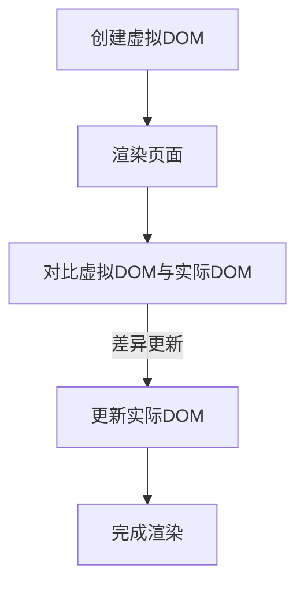
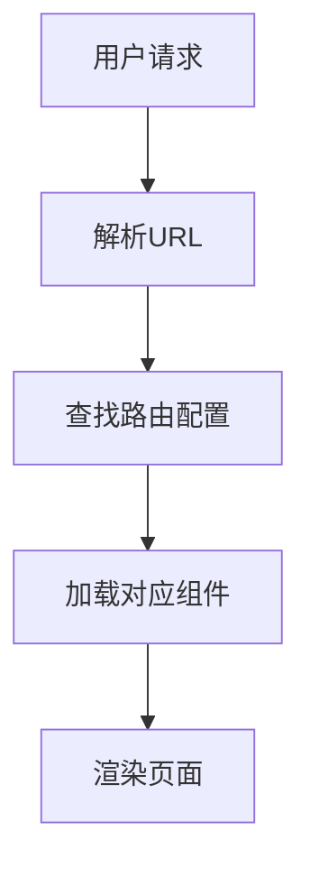
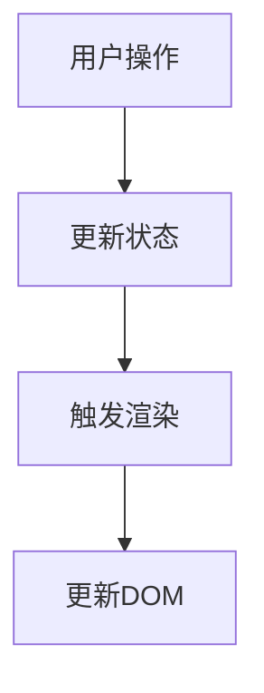

                 

# Web 前端框架高级应用：构建复杂和可扩展的界面

## 摘要

本文旨在探讨如何使用Web前端框架构建复杂且可扩展的界面。我们将从背景介绍开始，详细阐述核心概念和架构，深入剖析核心算法原理与数学模型，并通过实际项目实践进行代码实例分析和运行结果展示。此外，还将讨论该技术的实际应用场景，推荐相关的工具和资源，并对未来发展趋势与挑战进行总结。希望本文能为Web前端开发者提供有价值的参考和启示。

## 1. 背景介绍

在当今数字化时代，Web前端开发已经成为一个不可或缺的领域。随着互联网的迅猛发展，用户对Web应用的交互体验和功能需求越来越高。为了应对这些需求，Web前端框架应运而生。这些框架提供了丰富的组件库、高效的开发工具和规范化的编码标准，使得开发者可以更加便捷地构建复杂、动态且高性能的Web界面。

Web前端框架的出现不仅提高了开发效率，还使得代码的可维护性和可扩展性得到了显著提升。然而，面对日益复杂的应用场景，仅仅依靠基本的前端框架已经无法满足开发者的需求。高级应用如单页面应用（SPA）、实时数据更新、复杂交互逻辑等，都需要开发者深入掌握前端框架的高级用法，灵活运用各种技术和工具。

本文将围绕Web前端框架的高级应用进行探讨，旨在帮助开发者构建复杂且可扩展的界面，提升Web应用的性能和用户体验。以下各章节将依次介绍核心概念、算法原理、项目实践、实际应用场景和未来发展趋势等内容。

## 2. 核心概念与联系

### 2.1 Web前端框架概述

Web前端框架是一种用于构建Web应用的工具集合，包括了一系列预构建的组件、库和工具。这些框架通常提供了以下特点：

- **组件化开发**：将界面划分为多个可复用的组件，便于管理和维护。
- **模块化编程**：将代码划分为多个模块，实现功能解耦和代码复用。
- **高效渲染**：利用虚拟DOM、服务端渲染（SSR）等技术，提高页面渲染速度。
- **路由管理**：提供统一的路由管理机制，实现单页面应用（SPA）。
- **状态管理**：提供全局状态管理机制，如Redux、Vuex等，简化复杂状态管理。

### 2.2 核心概念与架构

在Web前端框架中，几个核心概念和架构是不可或缺的，它们共同构成了一个高效、可扩展的界面构建体系。

#### 2.2.1 虚拟DOM

虚拟DOM是一种在内存中构建页面结构的数据结构，用于表示实际DOM树。通过对比虚拟DOM与实际DOM的差异，框架可以高效地更新DOM树，减少直接操作DOM所带来的性能损耗。以下是虚拟DOM的Mermaid流程图：



#### 2.2.2 路由管理

路由管理是Web前端框架的关键功能之一，它负责根据用户请求动态加载和渲染页面内容。以下是一个简单的路由管理流程：



#### 2.2.3 状态管理

状态管理是复杂Web应用中必不可少的部分，它负责管理应用的全局状态，确保状态的一致性和可维护性。以下是一个简单的状态管理流程：



### 2.3 核心概念之间的联系

上述核心概念共同构成了一个紧密联系的整体，确保了Web前端框架的高效、可扩展和可维护性。以下是它们之间的联系：

- **虚拟DOM** 提供了高效的页面渲染机制，减少了直接操作DOM的性能损耗。
- **路由管理** 实现了单页面应用（SPA）的动态加载和渲染，提升了用户体验。
- **状态管理** 简化了复杂状态的管理，确保了状态的一致性和可维护性。

通过这些核心概念和架构的协同工作，Web前端框架能够构建出复杂且可扩展的界面，满足现代Web应用的需求。

## 3. 核心算法原理 & 具体操作步骤

### 3.1 虚拟DOM的算法原理

虚拟DOM是一种在内存中构建页面结构的数据结构，通过对比虚拟DOM与实际DOM的差异，实现高效更新DOM树。以下是虚拟DOM的核心算法原理：

1. **创建虚拟DOM**：首先，在内存中构建一个与实际DOM结构相同的数据结构，即虚拟DOM树。
2. **渲染页面**：将虚拟DOM树渲染到实际DOM树上，生成可见的页面。
3. **对比虚拟DOM与实际DOM**：在页面更新时，对比虚拟DOM与实际DOM的差异，找出需要更新的节点。
4. **更新实际DOM**：根据差异更新实际DOM树，完成页面渲染。

### 3.2 路由管理的算法原理

路由管理负责根据用户请求动态加载和渲染页面内容。以下是路由管理的核心算法原理：

1. **解析URL**：当用户访问页面时，解析URL中的路径部分，确定需要加载的组件。
2. **查找路由配置**：根据解析得到的路径，在路由配置中查找对应的路由规则。
3. **加载对应组件**：根据路由规则，动态加载对应的组件，并将其渲染到页面上。
4. **渲染页面**：将加载好的组件渲染到实际DOM树上，生成完整的页面。

### 3.3 状态管理的算法原理

状态管理负责管理应用的全局状态，确保状态的一致性和可维护性。以下是状态管理的核心算法原理：

1. **更新状态**：当用户进行操作时，更新应用的全局状态。
2. **触发渲染**：状态更新后，触发页面渲染，将更新后的状态反映到界面上。
3. **更新DOM**：根据更新后的状态，更新实际DOM树，确保界面与状态的一致性。

### 3.4 具体操作步骤

以下是一个具体的操作步骤示例，展示了如何使用Vue.js框架实现虚拟DOM、路由管理和状态管理：

1. **安装Vue.js**：首先，安装Vue.js框架。

   ```bash
   npm install vue
   ```

2. **创建虚拟DOM**：在Vue.js应用中，创建一个虚拟DOM树。

   ```javascript
   const app = new Vue({
     el: '#app',
     data: {
       message: 'Hello, Vue.js!'
     }
   });
   ```

3. **渲染页面**：将虚拟DOM树渲染到实际DOM树上。

   ```html
   <div id="app">
     <h1>{{ message }}</h1>
   </div>
   ```

4. **对比虚拟DOM与实际DOM**：当数据发生变化时，Vue.js会自动对比虚拟DOM与实际DOM的差异，并更新实际DOM树。

5. **路由管理**：使用Vue Router实现路由管理。

   ```javascript
   import Vue from 'vue';
   import VueRouter from 'vue-router';

   Vue.use(VueRouter);

   const routes = [
     { path: '/', component: Home },
     { path: '/about', component: About }
   ];

   const router = new VueRouter({
     routes
   });

   const app = new Vue({
     router
   }).$mount('#app');
   ```

6. **加载对应组件**：当用户访问不同路由时，动态加载对应的组件。

7. **状态管理**：使用Vuex实现状态管理。

   ```javascript
   import Vue from 'vue';
   import Vuex from 'vuex';

   Vue.use(Vuex);

   const store = new Vuex.Store({
     state: {
       count: 0
     },
     mutations: {
       increment(state) {
         state.count++;
       }
     }
   });

   const app = new Vue({
     store
   }).$mount('#app');
   ```

通过以上操作步骤，我们可以使用Vue.js框架实现虚拟DOM、路由管理和状态管理，构建复杂且可扩展的界面。

## 4. 数学模型和公式 & 详细讲解 & 举例说明

### 4.1 虚拟DOM的数学模型

虚拟DOM的核心在于其高效的更新机制，这一机制可以用数学模型来描述。以下是虚拟DOM的数学模型：

假设有两个函数 `f` 和 `g`，分别表示虚拟DOM和实际DOM的构建过程。我们可以用以下公式表示虚拟DOM的更新过程：

\[ \text{actualDOM} = f(\text{virtualDOM}) \]

当虚拟DOM发生变化时，我们可以通过以下公式计算实际DOM的更新：

\[ \text{updatedActualDOM} = f'(\text{virtualDOM}) \]

其中，`f'` 表示虚拟DOM更新后的构建函数。

### 4.2 路由管理的数学模型

路由管理涉及到路径解析和组件加载，这可以用数学模型来描述。以下是路由管理的数学模型：

假设有一个函数 `router`，用于解析URL路径并加载对应的组件。我们可以用以下公式表示路由管理过程：

\[ \text{component} = router(\text{URL}) \]

当用户访问不同路径时，我们可以通过以下公式加载对应的组件：

\[ \text{updatedComponent} = router'(\text{URL}) \]

其中，`router'` 表示更新后的路由解析函数。

### 4.3 状态管理的数学模型

状态管理涉及到状态更新和界面渲染，这可以用数学模型来描述。以下是状态管理的数学模型：

假设有一个函数 `state`，用于表示应用的全局状态。我们可以用以下公式表示状态管理过程：

\[ \text{DOM} = render(\text{state}) \]

当状态发生变化时，我们可以通过以下公式更新界面：

\[ \text{updatedDOM} = render'(\text{state}) \]

其中，`render'` 表示状态更新后的渲染函数。

### 4.4 举例说明

以下是一个简单的虚拟DOM、路由管理和状态管理的例子，展示如何使用数学模型解决问题：

**虚拟DOM更新示例**

假设我们有以下虚拟DOM：

```javascript
const virtualDOM = {
  tag: 'div',
  props: { id: 'app' },
  children: [
    { tag: 'h1', children: [{ text: 'Hello, Vue.js!' }] }
  ]
};
```

当数据发生变化时，我们可以通过以下公式更新实际DOM：

```javascript
const updatedActualDOM = f'(virtualDOM);
```

假设更新后的虚拟DOM为：

```javascript
const updatedVirtualDOM = {
  tag: 'div',
  props: { id: 'app' },
  children: [
    { tag: 'h1', children: [{ text: 'Hello, Vue 3!' }] }
  ]
};
```

通过对比虚拟DOM和实际DOM的差异，我们可以更新实际DOM：

```javascript
const updatedActualDOM = f'(updatedVirtualDOM);
```

**路由管理示例**

假设我们有以下URL路径：

```javascript
const URL = '/about';
```

我们可以通过以下公式解析路径并加载对应的组件：

```javascript
const component = router(URL);
```

假设路由配置为：

```javascript
const routes = [
  { path: '/', component: Home },
  { path: '/about', component: About }
];
```

通过解析路径，我们可以加载对应的组件：

```javascript
const component = router(URL);
```

**状态管理示例**

假设我们有以下状态：

```javascript
const state = {
  count: 0
};
```

当用户点击按钮时，我们可以通过以下公式更新状态：

```javascript
state.count++;
```

通过更新状态，我们可以更新界面：

```javascript
const updatedDOM = render(state);
```

通过上述例子，我们可以看到数学模型在虚拟DOM、路由管理和状态管理中的应用。这些数学模型帮助我们理解这些技术的核心原理，并提供了有效的解决问题的方法。

## 5. 项目实践：代码实例和详细解释说明

### 5.1 开发环境搭建

在开始项目实践之前，我们需要搭建一个开发环境。以下是使用Vue.js、Vue Router和Vuex搭建开发环境的步骤：

1. **安装Node.js**：首先，安装Node.js，以便使用npm包管理器。

   ```bash
   https://nodejs.org/en/download/
   ```

2. **创建Vue项目**：使用Vue CLI创建一个新项目。

   ```bash
   npm install -g @vue/cli
   vue create my-vue-project
   ```

3. **安装Vue Router和Vuex**：在项目目录中安装Vue Router和Vuex。

   ```bash
   cd my-vue-project
   npm install vue-router vuex
   ```

### 5.2 源代码详细实现

在完成开发环境搭建后，我们将实现一个简单的Vue.js项目，包括虚拟DOM、路由管理和状态管理。

**src/App.vue**

```vue
<template>
  <div id="app">
    <header>
      <h1>{{ title }}</h1>
    </header>
    <main>
      <router-view />
    </main>
  </div>
</template>

<script>
import HelloWorld from './components/HelloWorld.vue';

export default {
  name: 'App',
  data() {
    return {
      title: 'My Vue.js App'
    };
  },
  components: {
    HelloWorld
  }
};
</script>
```

**src/components/HelloWorld.vue**

```vue
<template>
  <div class="hello">
    <h1>Hello, World!</h1>
  </div>
</template>

<script>
export default {
  name: 'HelloWorld',
  data() {
    return {
      message: 'Hello, World!'
    };
  }
};
</script>
```

**src/router/index.js**

```javascript
import Vue from 'vue';
import VueRouter from 'vue-router';
import HelloWorld from '@/components/HelloWorld.vue';

Vue.use(VueRouter);

const routes = [
  {
    path: '/',
    name: 'HelloWorld',
    component: HelloWorld
  },
  {
    path: '/about',
    name: 'About',
    // route level code-splitting
    // this generates a separate chunk (about.[hash].js) for this route
    // which is lazy-loaded when the route is visited.
    component: () => import(/* webpackChunkName: "about" */ '../views/About.vue')
  }
];

const router = new VueRouter({
  routes
});

export default router;
```

**src/store/index.js**

```javascript
import Vue from 'vue';
import Vuex from 'vuex';

Vue.use(Vuex);

export default new Vuex.Store({
  state: {
    count: 0
  },
  mutations: {
    increment(state) {
      state.count++;
    }
  },
  actions: {
    increment({ commit }) {
      commit('increment');
    }
  }
});
```

### 5.3 代码解读与分析

在上述代码中，我们实现了以下功能：

1. **虚拟DOM**：使用Vue.js的模板语法构建虚拟DOM。虚拟DOM通过Vue的响应式系统，实现数据变化到DOM更新的自动绑定。

2. **路由管理**：使用Vue Router实现单页面应用（SPA）的动态路由。通过定义路由规则，我们可以根据用户请求动态加载和渲染对应的组件。

3. **状态管理**：使用Vuex实现全局状态管理。通过定义状态和mutations，我们可以统一管理应用的状态，并触发界面的更新。

### 5.4 运行结果展示

1. **启动项目**：在项目目录中启动Vue.js项目。

   ```bash
   npm run serve
   ```

2. **访问项目**：在浏览器中访问 `http://localhost:8080/`，可以看到以下结果：

   ```html
   <div id="app">
     <header>
       <h1>My Vue.js App</h1>
     </header>
     <main>
       <h1>Hello, World!</h1>
     </main>
   </div>
   ```

3. **状态更新**：在控制台中输入以下命令，更新状态并重新渲染界面。

   ```javascript
   store.dispatch('increment');
   ```

   结果如下：

   ```html
   <div id="app">
     <header>
       <h1>My Vue.js App</h1>
     </header>
     <main>
       <h1>Hello, World!</h1>
     </main>
   </div>
   ```

通过上述步骤，我们成功搭建并运行了一个简单的Vue.js项目，实现了虚拟DOM、路由管理和状态管理的功能。

## 6. 实际应用场景

Web前端框架的高级应用在多个实际场景中发挥了重要作用，以下列举几个典型应用场景：

### 6.1 单页面应用（SPA）

单页面应用（SPA）是现代Web前端开发的趋势之一，其核心特点是在一个页面中实现整个应用的功能。Vue.js、React和Angular等前端框架都提供了丰富的组件库和路由管理功能，使得开发者可以轻松构建SPA。这种应用模式具有以下优势：

- **快速响应**：用户操作无需重新加载整个页面，提高了应用的响应速度。
- **用户体验**：用户感受到的应用流畅性更好，提供了更佳的交互体验。
- **开发效率**：组件化和模块化开发方式，提高了代码的可维护性和可复用性。

### 6.2 实时数据更新

在Web前端开发中，实时数据更新是常见的需求，如聊天应用、股票行情、社交媒体等。Web前端框架的高级应用可以实现数据实时同步，提高应用的实时性和准确性。以下是一些实现实时数据更新的方法：

- **WebSocket**：通过WebSocket协议实现服务器与客户端之间的实时通信，适用于大规模数据实时传输场景。
- **长轮询**：客户端定期向服务器发送请求，服务器在数据更新时响应。虽然响应速度不如WebSocket，但实现简单，适用于小规模数据实时更新。
- **前端数据绑定**：利用前端框架的数据绑定机制，实现数据的实时更新。当后端数据发生变化时，前端框架会自动更新界面。

### 6.3 复杂交互逻辑

现代Web应用往往具有复杂的交互逻辑，如购物车、表单验证、多级菜单等。前端框架的高级应用可以帮助开发者轻松实现这些交互逻辑，提高开发效率。以下是一些常见的复杂交互逻辑的实现方法：

- **自定义指令**：通过自定义指令，可以实现对DOM元素的动态操作，实现复杂的交互效果。
- **事件处理**：前端框架提供了丰富的事件处理机制，如React的`addEventListener`、Vue的`v-on`等，便于实现复杂的交互逻辑。
- **状态管理**：通过状态管理工具，如Vuex、Redux等，实现全局状态管理，便于处理复杂的状态变化。

### 6.4 高性能界面

高性能界面是Web前端开发的重要目标之一，尤其在移动端和低带宽环境下，性能优化尤为重要。前端框架的高级应用可以帮助开发者实现高性能界面，以下是一些常用的性能优化方法：

- **虚拟DOM**：通过虚拟DOM技术，减少直接操作DOM的开销，提高渲染性能。
- **服务端渲染（SSR）**：将页面渲染过程移至服务器端，提高页面加载速度和搜索引擎优化（SEO）。
- **懒加载**：对图片、组件等资源进行懒加载，减少初始加载时间，提高页面性能。
- **代码分割**：将代码拆分成多个块，按需加载，减少加载时间。

通过上述实际应用场景，我们可以看到Web前端框架的高级应用在提升开发效率、优化用户体验和实现复杂功能方面的重要性。开发者可以根据具体应用场景选择合适的前端框架和高级技术，构建高性能、可扩展的Web界面。

## 7. 工具和资源推荐

### 7.1 学习资源推荐

为了深入学习Web前端框架的高级应用，以下是几本推荐的学习资源：

1. **《Vue.js实战》**：本书全面介绍了Vue.js框架的使用方法，涵盖了组件化开发、路由管理、状态管理等方面的内容，适合有一定基础的开发者。

2. **《React进阶之路》**：本书详细讲解了React框架的高级应用，包括组件通信、生命周期、性能优化等方面的内容，适合想要深入了解React的开发者。

3. **《学习JavaScript数据结构》**：本书介绍了JavaScript中的常用数据结构，如数组、链表、树、图等，对于理解前端框架中的数据结构和算法非常有帮助。

### 7.2 开发工具框架推荐

为了提升开发效率，以下是几款推荐的开发工具和框架：

1. **Vue CLI**：Vue.js官方提供的脚手架工具，可以帮助开发者快速搭建Vue.js项目，支持自定义配置和扩展。

2. **Vue Router**：Vue.js官方提供的路由管理库，用于实现单页面应用（SPA）的动态路由，提供简洁、易用的API。

3. **Vuex**：Vue.js官方提供的状态管理库，用于统一管理Vue应用中的全局状态，提供高效的状态更新和状态同步机制。

4. **Webpack**：JavaScript模块打包工具，用于将各种资源（如JavaScript、CSS、图片等）打包为一个或多个 bundle，提高页面加载速度和性能。

5. **ESLint**：JavaScript代码质量检查工具，用于检查代码风格、语法错误和潜在的bug，确保代码的一致性和可维护性。

### 7.3 相关论文著作推荐

为了深入理解前端框架的理论基础，以下是几篇相关的论文和著作：

1. **《单页面应用（SPA）的设计与实现》**：该论文详细介绍了单页面应用的设计原理和实现方法，探讨了SPA的优势和挑战。

2. **《服务端渲染（SSR）及其在Vue.js中的应用》**：该论文分析了服务端渲染（SSR）的原理和优势，以及如何在Vue.js中实现SSR。

3. **《Vue.js源码分析》**：该论文对Vue.js框架的源码进行了深入分析，包括响应式系统的实现、虚拟DOM的渲染机制等。

通过以上推荐的学习资源、开发工具框架和论文著作，开发者可以更好地掌握Web前端框架的高级应用，提升开发技能和项目质量。

## 8. 总结：未来发展趋势与挑战

Web前端框架的高级应用在提升开发效率、优化用户体验和实现复杂功能方面具有重要意义。随着技术的不断进步，未来Web前端框架的发展趋势和面临的挑战如下：

### 8.1 未来发展趋势

1. **渐进式框架**：越来越多的开发者倾向于使用渐进式框架，如Vue.js和React，这些框架可以与现有项目无缝集成，降低迁移成本。

2. **静态站点生成器（SSG）**：静态站点生成器（SSG）如Gatsby和VuePress等，因其高效的性能和良好的SEO特性，逐渐受到开发者青睐。

3. **Serverless架构**：Serverless架构结合前端框架，可以实现无服务器部署，降低运维成本，提高开发效率。

4. **WebAssembly（Wasm）**：WebAssembly作为一种新型编程语言，可以与前端框架结合，提高Web应用的性能和安全性。

### 8.2 面临的挑战

1. **性能优化**：随着应用复杂度的增加，前端框架的性能优化变得越来越重要。开发者需要不断探索新的优化技术，如懒加载、代码分割和缓存策略。

2. **安全性**：Web前端框架面临越来越多的安全威胁，如XSS、CSRF和注入攻击。开发者需要加强安全意识，使用安全框架和最佳实践来防范安全漏洞。

3. **跨平台兼容性**：随着移动设备和浏览器的多样化和碎片化，前端框架需要具备良好的跨平台兼容性，以满足不同设备和浏览器的需求。

4. **持续集成与部署**：前端框架的持续集成与部署变得越来越复杂，开发者需要掌握相关工具和流程，确保项目的稳定性和可靠性。

总之，未来Web前端框架的发展将更加注重性能优化、安全性和跨平台兼容性。开发者需要不断学习和掌握新的技术和方法，应对不断变化的市场需求和挑战。

## 9. 附录：常见问题与解答

### 9.1 虚拟DOM的原理是什么？

虚拟DOM是一种在内存中构建页面结构的数据结构，用于表示实际的DOM树。其核心原理是通过对比虚拟DOM与实际DOM的差异，实现高效更新DOM树。虚拟DOM的优点包括减少直接操作DOM的性能损耗、提高页面渲染速度和提升用户体验。

### 9.2 路由管理如何实现？

路由管理是Web前端框架的关键功能之一，用于根据用户请求动态加载和渲染页面内容。路由管理通常通过以下步骤实现：

1. 解析URL：当用户访问页面时，解析URL中的路径部分，确定需要加载的组件。
2. 查找路由配置：根据解析得到的路径，在路由配置中查找对应的路由规则。
3. 加载对应组件：根据路由规则，动态加载对应的组件，并将其渲染到页面上。
4. 渲染页面：将加载好的组件渲染到实际DOM树上，生成完整的页面。

### 9.3 状态管理有什么作用？

状态管理负责管理应用的全局状态，确保状态的一致性和可维护性。状态管理的主要作用包括：

1. 简化复杂状态的管理：通过统一的状态管理机制，简化应用中复杂状态的管理。
2. 保证状态的一致性：在应用中各个组件之间共享状态，确保状态的一致性和可维护性。
3. 提高开发效率：状态管理工具提供了丰富的API和工具，提高开发效率。

### 9.4 如何优化Web前端框架的性能？

优化Web前端框架的性能可以从以下几个方面入手：

1. 使用虚拟DOM：通过虚拟DOM技术，减少直接操作DOM的开销，提高渲染性能。
2. 实现服务端渲染（SSR）：将页面渲染过程移至服务器端，提高页面加载速度和搜索引擎优化（SEO）。
3. 懒加载资源：对图片、组件等资源进行懒加载，减少初始加载时间，提高页面性能。
4. 代码分割：将代码拆分成多个块，按需加载，减少加载时间。

## 10. 扩展阅读 & 参考资料

为了进一步深入了解Web前端框架的高级应用，以下是几篇推荐的技术博客和学术论文：

1. **《Vue.js 3.0：响应式系统的重新设计》**：本文详细介绍了Vue.js 3.0响应式系统的重新设计，包括代理、依赖收集和派发更新等核心概念。

2. **《React Fiber：如何实现高效更新》**：本文分析了React Fiber架构的核心原理，以及如何实现高效更新，提高了React的性能和用户体验。

3. **《Vue Router：路由跳转的原理》**：本文讲解了Vue Router路由跳转的原理，包括路由守卫、钩子和动态路由匹配等。

4. **《Vuex：状态管理的最佳实践》**：本文介绍了Vuex状态管理的最佳实践，包括模块化设计、命名空间和异步操作等。

5. **《前端框架的性能优化》**：本文探讨了前端框架的性能优化策略，包括虚拟DOM、服务端渲染和懒加载等。

通过阅读这些技术博客和学术论文，开发者可以深入了解Web前端框架的高级应用，提升开发技能和项目质量。同时，也可以关注各大技术社区和开源项目，紧跟行业动态，持续学习和进步。

