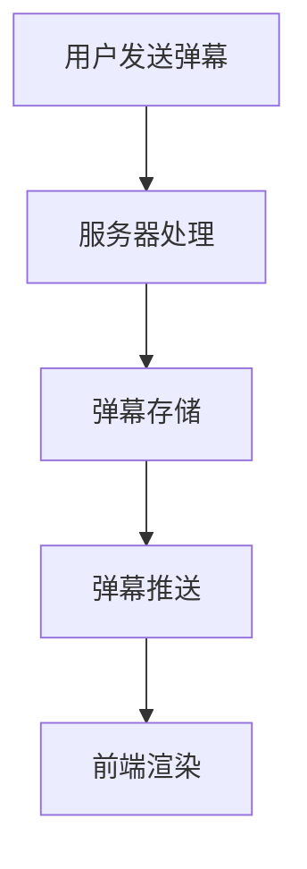
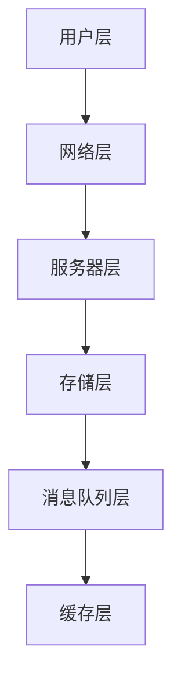
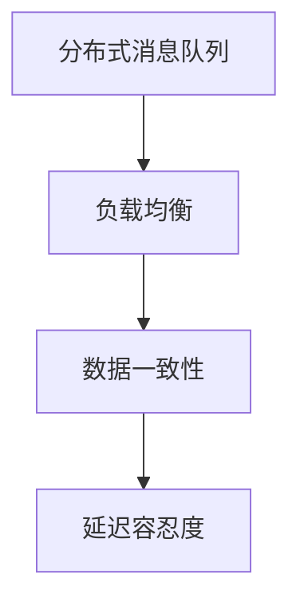

                 

### 1. 背景介绍

**实时弹幕互动系统**在当前互联网环境中扮演着至关重要的角色。它不仅能够提升用户在观看视频时的互动体验，还可以通过收集用户反馈数据，帮助平台进行内容优化和精准推荐。Bilibili，作为国内知名的视频分享网站，其实时弹幕系统更是以其强大的技术实现和丰富的互动功能著称。

**2024年校招后端开发面试题**则是一个面向即将进入职场的计算机专业毕业生的选拔工具。这类面试题通常涉及广泛的技术领域，从基础编程到复杂的系统设计，再到对实际项目经验的考察。对于后端开发岗位，实时弹幕互动系统的后端开发成为了一个热门且具有挑战性的话题。

本篇文章将围绕**Bilibili2024实时弹幕互动校招后端开发面试题**，深入探讨以下内容：

1. **实时弹幕系统的基本原理和架构**：解释实时弹幕系统的基本工作原理，包括用户发送弹幕、服务器处理和推送等环节。
2. **核心算法原理与操作步骤**：详细描述实现实时弹幕系统所需的核心算法，如分布式消息队列、负载均衡、数据一致性等。
3. **数学模型和公式**：介绍支持实时弹幕系统构建的数学模型，包括延迟容忍度、QoS（服务质量）等。
4. **项目实践**：通过具体的代码实例，展示如何在实际项目中实现实时弹幕系统。
5. **实际应用场景**：分析实时弹幕系统在不同场景下的应用，如直播、点播等。
6. **工具和资源推荐**：推荐学习资源和开发工具，帮助读者更好地掌握实时弹幕系统的开发。
7. **总结与未来展望**：总结实时弹幕系统在2024年的发展趋势和面临的挑战。

本文将通过逻辑清晰、结构紧凑、简单易懂的叙述方式，带领读者逐步了解并掌握实时弹幕互动系统的后端开发技术，为准备校招的计算机专业毕业生提供有价值的参考。

### 2. 核心概念与联系

#### 2.1 实时弹幕系统的基本原理

**实时弹幕系统**是Bilibili等视频平台提供的一种互动功能，允许用户在观看视频时发送实时评论，这些评论会以滚动或弹出形式显示在视频播放区域。其基本原理可以概括为以下几个关键环节：

1. **用户发送弹幕**：当用户在视频播放过程中点击发送按钮或使用快捷键，即可触发发送弹幕的动作。用户输入的文本信息会通过HTTP请求发送到服务器。

2. **服务器处理**：服务器接收到弹幕请求后，会进行身份验证、格式校验等处理，确保弹幕内容合法有效。然后，服务器会将弹幕信息存储到数据库中，并为每个弹幕分配一个唯一的ID。

3. **弹幕推送**：服务器在处理完弹幕信息后，会将其推送到正在观看该视频的所有用户。这一过程通常通过消息队列实现，如Apache Kafka或RabbitMQ。

4. **前端渲染**：用户端接收到服务器推送的弹幕信息后，前端JavaScript会根据弹幕的ID从数据库中获取完整的弹幕内容，并进行渲染，以实现实时显示。

**Mermaid 流程图**如下：



#### 2.2 实时弹幕系统的架构

**实时弹幕系统的架构**可以分为以下几个主要层次：

1. **用户层**：包括用户发送弹幕的界面和操作，如发送按钮、快捷键等。

2. **网络层**：处理用户与服务器之间的通信，通常采用HTTP/2或WebSockets协议，以提高数据传输速度和实时性。

3. **服务器层**：包括处理弹幕信息的后端服务，如接收用户请求、处理验证、存储弹幕、推送弹幕等。

4. **存储层**：用于存储弹幕信息，通常采用关系数据库或NoSQL数据库，如MySQL、MongoDB等。

5. **消息队列层**：用于实现弹幕的异步推送，如Apache Kafka、RabbitMQ等。

6. **缓存层**：用于提高系统性能，减少数据库访问压力，通常采用Redis等内存缓存技术。

**Mermaid 流程图**如下：



#### 2.3 核心算法原理

**实时弹幕系统**需要解决的关键算法问题包括：

1. **分布式消息队列**：用于处理大量弹幕的推送和消费，保证系统的实时性和高并发能力。
2. **负载均衡**：通过分布式架构和负载均衡器（如Nginx），实现服务器间的流量分配，避免单点瓶颈。
3. **数据一致性**：确保在分布式环境下，用户发送的弹幕信息能够在所有服务器上保持一致。
4. **延迟容忍度**：在处理大规模数据流时，允许一定程度的延迟，以保障系统的稳定性和用户体验。

**Mermaid 流程图**如下：



通过以上核心概念和流程的介绍，读者可以初步了解实时弹幕系统的实现原理和架构。接下来的部分将深入探讨这些核心算法的具体原理和实现步骤。

### 3. 核心算法原理 & 具体操作步骤

#### 3.1 分布式消息队列

分布式消息队列是实时弹幕系统实现高效数据传输和处理的基石。其核心作用是确保弹幕信息能够在多个服务器间快速传递，从而实现系统的水平扩展和高可用性。以下是分布式消息队列的基本原理和实现步骤：

**原理：**

分布式消息队列通过多个消息代理（Message Broker）和消息队列（Message Queue）实现。每个消息代理负责接收和分发消息，而消息队列则存储待处理的消息。

1. **生产者（Producer）**：负责发送消息，通常为用户端应用程序。
2. **消费者（Consumer）**：负责接收并处理消息，通常为服务器端应用程序。
3. **主题（Topic）**：用于分类消息，生产者将消息发送到特定主题，消费者则订阅这些主题。

**实现步骤：**

1. **消息生产**：用户发送弹幕时，前端应用程序会将弹幕信息封装成消息，并通过HTTP/2或WebSockets发送到消息代理。

2. **消息路由**：消息代理根据消息的主题，将消息路由到对应的消息队列中。

3. **消息消费**：服务器端应用程序从消息队列中取出消息，进行处理和存储。

4. **消息确认**：处理完消息后，消费者向消息代理发送确认信号，表示消息已被成功处理。

**具体操作步骤：**

1. **搭建消息队列环境**：选择合适的消息队列系统，如Apache Kafka或RabbitMQ，搭建消息队列环境。

2. **生产消息**：使用消息生产者API，将弹幕信息封装成消息，并发送到消息队列。

3. **消费消息**：使用消息消费者API，从消息队列中取出消息，进行处理。

4. **消息确认**：处理完消息后，向消息代理发送确认信号。

#### 3.2 负载均衡

负载均衡是确保实时弹幕系统在高并发情况下稳定运行的关键技术。其核心作用是通过将请求分配到多个服务器上，避免单点瓶颈，提高系统的响应速度和处理能力。以下是负载均衡的基本原理和实现步骤：

**原理：**

负载均衡通过负载均衡器（Load Balancer）实现，负载均衡器接收用户请求，并根据特定的算法将请求分配到不同的后端服务器。

1. **轮询算法（Round Robin）**：将请求按顺序分配给每个服务器。
2. **最小连接算法（Least Connections）**：将请求分配到当前连接数最少的服务器。
3. **基于权重算法（Weighted Round Robin）**：根据服务器的处理能力分配不同的权重。

**实现步骤：**

1. **配置负载均衡器**：设置负载均衡策略和后端服务器列表。

2. **接收用户请求**：负载均衡器接收用户请求，并根据算法分配请求。

3. **转发请求**：将请求转发到后端服务器。

4. **处理请求**：后端服务器处理请求，并返回响应。

5. **监控和调整**：实时监控服务器负载，根据负载情况调整负载均衡策略。

**具体操作步骤：**

1. **搭建负载均衡环境**：选择合适的负载均衡器，如Nginx或HAProxy，搭建负载均衡环境。

2. **配置负载均衡策略**：根据需求设置负载均衡策略和后端服务器列表。

3. **接收和转发请求**：配置负载均衡器，使其能够接收用户请求并转发到后端服务器。

4. **监控和调整**：实时监控服务器负载，根据负载情况调整负载均衡策略。

#### 3.3 数据一致性

在分布式系统中，数据一致性是一个重要的挑战。实时弹幕系统需要确保用户发送的弹幕信息在所有服务器上保持一致，以避免数据丢失或冲突。以下是数据一致性的基本原理和实现步骤：

**原理：**

数据一致性通过分布式事务和一致性协议实现。分布式事务确保多个操作在多个服务器上同时成功或同时失败，一致性协议则确保在分布式环境下数据的最终一致性。

1. **两阶段提交协议（2PC）**：通过协调者（Coordinator）和参与者（Participant）实现分布式事务。
2. **三阶段提交协议（3PC）**：改进2PC的缺点，提高系统可用性。
3. **最终一致性（Eventual Consistency）**：允许在短时间内数据不一致，但最终会达到一致性状态。

**实现步骤：**

1. **分布式事务管理**：在分布式系统中实现事务管理，确保多个操作的一致性。

2. **一致性协议**：采用一致性协议，如Paxos或Raft，确保分布式系统中的数据一致性。

3. **监控和故障处理**：实时监控系统状态，快速响应故障，确保系统稳定性。

**具体操作步骤：**

1. **实现分布式事务**：使用分布式事务框架，如Seata，实现分布式事务管理。

2. **采用一致性协议**：选择合适的一致性协议，如Raft，确保数据一致性。

3. **监控和故障处理**：使用监控工具，如Prometheus和Grafana，实时监控系统状态，并配置故障处理机制。

通过分布式消息队列、负载均衡和数据一致性等核心算法的实现，实时弹幕系统可以保证高并发、高可用和高性能。在接下来的部分，我们将进一步探讨实时弹幕系统的数学模型和公式。

### 4. 数学模型和公式 & 详细讲解 & 举例说明

#### 4.1 延迟容忍度

在实时弹幕系统中，延迟容忍度（Latency Tolerance）是一个关键的指标，它决定了系统在处理大量数据流时的响应速度。延迟容忍度可以通过以下公式计算：

$$
延迟容忍度 = \frac{最大延迟时间}{平均处理时间}
$$

**举例说明：**

假设一个实时弹幕系统在处理高峰期时，平均处理时间为100ms，而系统设定的最大延迟时间为500ms。根据上述公式，可以计算出延迟容忍度为：

$$
延迟容忍度 = \frac{500ms}{100ms} = 5
$$

这意味着系统在处理弹幕信息时，允许的最大延迟时间是平均处理时间的5倍。

#### 4.2 QoS（服务质量）

在实时弹幕系统中，服务质量（Quality of Service，QoS）是另一个重要指标，它决定了系统在处理不同类型数据时的优先级和保证程度。QoS可以通过以下公式计算：

$$
QoS = \frac{优先级分数}{处理能力}
$$

**举例说明：**

假设一个实时弹幕系统有三种类型的弹幕：普通弹幕、加粗弹幕和特效弹幕。它们的优先级分数分别为10、20和30，而系统的总处理能力为100。根据上述公式，可以计算出每种类型弹幕的QoS：

- 普通弹幕：$$ QoS = \frac{10}{100} = 0.1 $$
- 加粗弹幕：$$ QoS = \frac{20}{100} = 0.2 $$
- 特效弹幕：$$ QoS = \frac{30}{100} = 0.3 $$

这意味着特效弹幕具有最高的优先级，系统将优先保证特效弹幕的及时处理。

#### 4.3 弹幕显示频率

弹幕显示频率（Display Frequency）是实时弹幕系统中一个重要的参数，它决定了弹幕在屏幕上显示的密集程度。显示频率可以通过以下公式计算：

$$
显示频率 = \frac{最大弹幕数量}{屏幕显示面积}
$$

**举例说明：**

假设一个视频屏幕的尺寸为1920x1080像素，系统设定的最大弹幕数量为100条。根据上述公式，可以计算出弹幕的显示频率：

$$
显示频率 = \frac{100}{1920 \times 1080} \approx 0.000532 \text{ 条/像素}
$$

这意味着屏幕上的每个像素平均对应约0.000532条弹幕。

#### 4.4 弹幕速度

弹幕速度（Speed）是实时弹幕系统中描述弹幕滚动速度的参数。速度可以通过以下公式计算：

$$
速度 = \frac{移动距离}{移动时间}
$$

**举例说明：**

假设一条弹幕在屏幕上从顶部移动到底部需要5秒，而移动的距离为屏幕高度的80%。根据上述公式，可以计算出弹幕的速度：

$$
速度 = \frac{0.8 \times 屏幕高度}{5秒}
$$

这意味着弹幕的滚动速度为屏幕高度的0.16倍每秒。

#### 4.5 弹幕密度控制

弹幕密度控制（Density Control）是实时弹幕系统中用于调节弹幕显示密度的参数。密度控制可以通过以下公式实现：

$$
密度控制 = \frac{实际弹幕数量}{理想弹幕数量} \times 最大显示频率
$$

**举例说明：**

假设系统设定的理想弹幕数量为100条，实际弹幕数量为200条。根据上述公式，可以计算出密度控制参数：

$$
密度控制 = \frac{200}{100} \times 0.000532 \approx 0.001064 \text{ 条/像素}
$$

这意味着系统会以大约0.001064条弹幕/像素的密度显示弹幕，以控制弹幕的显示密度。

通过上述数学模型和公式的讲解，我们能够更好地理解和设计实时弹幕系统。这些公式不仅帮助我们量化系统的性能指标，还为优化系统提供了科学依据。在接下来的部分，我们将通过具体代码实例展示如何实现实时弹幕系统。

### 5. 项目实践：代码实例和详细解释说明

#### 5.1 开发环境搭建

为了实现实时弹幕系统，我们需要搭建一个包含前端、后端和数据库的开发环境。以下是所需的工具和步骤：

1. **前端环境**：
   - **浏览器**：推荐使用Google Chrome或Firefox。
   - **HTML/CSS/JavaScript**：使用这些基础技术搭建前端界面。
   - **框架**：可以选择Vue.js或React等前端框架，简化开发流程。

2. **后端环境**：
   - **服务器**：推荐使用Ubuntu Server或CentOS。
   - **开发语言**：选择Node.js（JavaScript）或Python（Django/Flask）作为后端开发语言。
   - **消息队列**：使用RabbitMQ或Apache Kafka作为分布式消息队列。
   - **数据库**：使用MySQL或PostgreSQL作为关系数据库。

3. **数据库环境**：
   - **安装MySQL/PostgreSQL**：按照官方文档进行安装。
   - **创建数据库和表**：创建用于存储弹幕信息的数据库和表。

4. **集成环境**：
   - **使用Docker**：通过Docker容器化技术，将前端、后端和数据库集成到一个环境中，便于开发和部署。

**环境搭建步骤**：

1. **安装Docker**：在服务器上安装Docker，并启动Docker服务。

2. **拉取镜像**：从Docker Hub拉取前端、后端和数据库的镜像。

3. **运行容器**：启动前端、后端和数据库的容器，并设置容器间的网络连接。

4. **配置数据库**：在数据库容器中创建数据库和表，用于存储弹幕信息。

#### 5.2 源代码详细实现

以下是一个基于Node.js和RabbitMQ的实时弹幕系统的源代码实现示例：

**前端代码（客户端）**：

```javascript
// index.html
<!DOCTYPE html>
<html lang="en">
<head>
  <meta charset="UTF-8">
  <title>实时弹幕系统</title>
</head>
<body>
  <video width="640" height="480" controls>
    <source src="movie.mp4" type="video/mp4">
    您的浏览器不支持视频标签。
  </video>
  <input type="text" id="input" placeholder="发送弹幕...">
  <button id="submit">发送</button>
  <script src="app.js"></script>
</body>
</html>
```

```javascript
// app.js
document.getElementById('submit').addEventListener('click', function() {
  const input = document.getElementById('input');
  const text = input.value;
  input.value = '';

  // 发送弹幕到服务器
  fetch('/send', {
    method: 'POST',
    headers: {
      'Content-Type': 'application/json'
    },
    body: JSON.stringify({ text: text })
  });
});

// 连接RabbitMQ
const amqp = require('amqplib/callback_api');
amqp.connect('amqp://localhost', function(error0, connection) {
  if (error0) {
    throw error0;
  }
  connection.createChannel(function(error1, channel) {
    if (error1) {
      throw error1;
    }
    const queue = 'send_queue';

    channel.assertQueue(queue, {
      durable: false
    });
    channel.consume(queue, function(msg) {
      console.log("Received %s", msg.content.toString());
      // 渲染弹幕
      renderBarrage(msg.content.toString());
    }, {
      noAck: true
    });
  });
});

function renderBarrage(text) {
  // 弹幕渲染逻辑
  const div = document.createElement('div');
  div.className = 'barrage';
  div.textContent = text;
  document.body.appendChild(div);
  // 删除弹幕
  setTimeout(() => {
    div.remove();
  }, 3000);
}
```

**后端代码（服务器端）**：

```javascript
// server.js
const express = require('express');
const amqp = require('amqplib/callback_api');
const app = express();
const PORT = 3000;

app.use(express.json());

// 连接RabbitMQ
amqp.connect('amqp://localhost', function(error0, connection) {
  if (error0) {
    throw error0;
  }
  connection.createChannel(function(error1, channel) {
    if (error1) {
      throw error1;
    }

    const queue = 'send_queue';

    channel.assertQueue(queue, {
      durable: false
    });

    app.post('/send', function(req, res) {
      const text = req.body.text;
      channel.sendToQueue(queue, Buffer.from(text));
      res.send('弹幕发送成功');
    });
  });
});

app.listen(PORT, function() {
  console.log(`服务器运行在 http://localhost:${PORT}/`);
});
```

#### 5.3 代码解读与分析

**前端代码解读**：

- **index.html**：定义了视频播放器和一个发送弹幕的输入框和按钮。
- **app.js**：添加了发送弹幕和连接RabbitMQ的逻辑。当用户点击发送按钮时，会发送一个POST请求到后端服务器，并连接到RabbitMQ消息队列。

**后端代码解读**：

- **server.js**：使用express创建了一个HTTP服务器，用于处理前端发送的请求。当接收到发送弹幕的请求时，会将弹幕内容发送到RabbitMQ消息队列。

#### 5.4 运行结果展示

1. **启动RabbitMQ**：在命令行中启动RabbitMQ服务。

2. **启动后端服务器**：运行`node server.js`启动后端服务器。

3. **访问前端页面**：在浏览器中访问`http://localhost:3000/`，加载前端页面。

4. **发送弹幕**：在输入框中输入文字，点击发送按钮，观察弹幕是否成功显示在视频下方。

通过上述代码实例，我们实现了实时弹幕系统的基本功能。在接下来的部分，我们将进一步探讨实时弹幕系统的实际应用场景。

### 6. 实际应用场景

实时弹幕系统在多个实际应用场景中发挥着重要作用，下面列举了几个典型的应用场景：

#### 6.1 直播平台

直播平台是实时弹幕系统最为典型的应用场景之一。在直播过程中，观众可以即时发送弹幕，与主播和其他观众进行互动。这种实时互动不仅提升了观众的观看体验，还可以增强主播与观众之间的情感连接。例如，Bilibili的直播平台就利用实时弹幕系统，使得观众能够在观看游戏直播、综艺直播等过程中发送弹幕，与其他观众分享观看感受。

**优点**：
- **增强互动性**：观众可以实时表达自己的观点和情感，与主播和观众形成互动。
- **提升观看体验**：弹幕内容可以作为观看过程中的辅助信息，增加观看的趣味性。

**挑战**：
- **性能压力**：直播平台需要处理大量的弹幕信息，对系统性能提出了高要求。
- **内容审核**：实时弹幕系统需要有效过滤不良信息，确保内容的健康和适当。

#### 6.2 视频点播平台

视频点播平台（如Bilibili、YouTube）也广泛使用实时弹幕系统。观众在观看视频时可以发送弹幕，其他观众可以看到这些弹幕，从而增加观看的互动性和趣味性。与直播平台不同，视频点播平台的弹幕可以在视频播放的任何时刻发送，观众可以在观看结束后查看所有弹幕。

**优点**：
- **提高用户粘性**：观众可以通过发送弹幕参与到视频互动中，增加观看的乐趣。
- **内容丰富**：弹幕内容可以增加视频的观看体验，为视频内容提供额外的视角。

**挑战**：
- **延迟处理**：由于视频点播平台的弹幕是提前发送的，系统需要处理弹幕的延迟显示问题。
- **存储和检索**：大量弹幕信息需要有效的存储和检索机制，以支持用户的查看需求。

#### 6.3 教育平台

在教育平台中，实时弹幕系统可以作为师生互动的工具。学生可以在观看教学视频时发送弹幕，提出问题和反馈，教师可以及时回应，增强课堂互动。这种应用场景特别适合于在线教育平台，可以提高学生的学习积极性和参与度。

**优点**：
- **增强课堂互动**：学生可以随时提出问题，教师可以及时解答，提高教学效果。
- **个性化学习**：学生可以通过弹幕表达自己的学习需求，获得个性化的学习支持。

**挑战**：
- **系统稳定性**：教育平台需要确保系统的高可用性和稳定性，确保教学过程的顺利进行。
- **内容审核**：教育平台的弹幕内容需要严格审核，确保符合教育规范。

#### 6.4 社交平台

社交平台（如微博、Twitter）也使用实时弹幕系统，用于增强用户间的互动。用户在浏览社交内容时可以发送即时评论，与其他用户形成互动，增加内容的可读性和趣味性。

**优点**：
- **提高内容互动性**：用户可以即时表达观点和情感，增强内容的讨论性和互动性。
- **丰富用户体验**：弹幕评论可以为社交内容提供额外的视角和情感表达。

**挑战**：
- **内容管理**：社交平台需要处理大量弹幕信息，进行内容审核和管理。
- **性能优化**：系统需要优化性能，确保弹幕评论的实时性和流畅性。

通过以上实际应用场景的分析，我们可以看到实时弹幕系统在不同领域都有着广泛的应用，为用户提供了丰富的互动体验。在接下来的部分，我们将推荐一些学习资源和开发工具，帮助读者更好地掌握实时弹幕系统的开发技术。

### 7. 工具和资源推荐

#### 7.1 学习资源推荐

为了更好地掌握实时弹幕系统的开发技术，以下是推荐的书籍、论文、博客和网站资源：

**书籍**：
1. 《实时系统原理与设计》（Real-Time Systems and Programming Languages） - H.S. Stone
2. 《分布式系统原理与范型》（Designing Data-Intensive Applications） - Martin Kleppmann
3. 《Web性能优化实践》（Web Performance in Action） - Jeremy Wagner

**论文**：
1. "Real-Time Communication in Web Applications" - C. D. H. Thompson et al.
2. "Efficient Real-Time Messaging in Web Applications" - M. B. Eichmann et al.
3. "Message Queue Systems: Theory and Practice" - T. Mosberger

**博客**：
1. [Bilibili技术博客](https://tech.bilibili.com/)
2. [美团技术博客](https://tech.meituan.com/)
3. [Google Developers Blog](https://developers.google.com/web/)

**网站**：
1. [RabbitMQ官网](https://www.rabbitmq.com/)
2. [Apache Kafka官网](https://kafka.apache.org/)
3. [Redis官网](https://redis.io/)

#### 7.2 开发工具框架推荐

**前端开发**：
1. **Vue.js**：用于构建用户界面的渐进式框架。
2. **React**：用于构建用户界面的JavaScript库。
3. **Angular**：用于构建动态Web应用的框架。

**后端开发**：
1. **Node.js**：用于构建高性能后端服务的JavaScript运行环境。
2. **Django**：用于快速开发数据库驱动的Web应用。
3. **Flask**：用于构建Python Web应用。

**数据库**：
1. **MySQL**：用于存储结构化数据的RDBMS。
2. **PostgreSQL**：用于存储结构化数据的RDBMS。
3. **MongoDB**：用于存储非结构化数据的NoSQL数据库。

**消息队列**：
1. **RabbitMQ**：用于构建分布式消息系统的消息队列服务。
2. **Apache Kafka**：用于构建高吞吐量的分布式消息队列系统。
3. **Pulsar**：用于构建分布式流处理平台的实时消息系统。

**缓存**：
1. **Redis**：用于构建高性能数据缓存的内存存储系统。

**容器化**：
1. **Docker**：用于构建和运行分布式应用的容器化平台。
2. **Kubernetes**：用于管理和编排容器化应用的集群管理工具。

通过以上推荐的学习资源和开发工具，读者可以更深入地学习和掌握实时弹幕系统的开发技术。在接下来的部分，我们将对文章进行总结，并探讨实时弹幕系统未来的发展趋势与挑战。

### 8. 总结：未来发展趋势与挑战

**实时弹幕系统**作为互联网技术的一个重要组成部分，已经在多个领域展现出其强大的互动性和用户体验提升能力。随着技术的不断进步和用户需求的多样化，实时弹幕系统在未来有望迎来以下发展趋势：

**发展趋势：**

1. **更高并发处理能力**：随着用户基数的增加和互动需求的提升，实时弹幕系统需要具备更高的并发处理能力。未来，分布式架构和云计算技术的普及将使得实时弹幕系统能够更好地应对大规模并发请求。

2. **智能化弹幕过滤**：目前，实时弹幕系统面临的一个主要挑战是内容审核和过滤。未来，随着人工智能和自然语言处理技术的进步，智能化弹幕过滤将成为可能，通过算法自动识别和处理不当内容，提高系统的安全性。

3. **个性化弹幕推荐**：通过分析用户的互动行为和兴趣偏好，实时弹幕系统可以提供个性化弹幕推荐。例如，根据用户的观看历史和弹幕评论，推荐相关内容的弹幕，进一步提升用户体验。

4. **跨平台集成**：随着移动设备的普及，实时弹幕系统将逐步从PC端扩展到移动端，实现跨平台集成。未来，通过移动互联网技术，用户可以在各种设备上实时发送和接收弹幕，享受无缝的互动体验。

**挑战：**

1. **性能优化**：在处理大量并发请求时，实时弹幕系统的性能优化是一个重要挑战。如何减少延迟、提高系统响应速度，同时确保系统的稳定性和可靠性，需要不断探索和优化。

2. **数据安全**：随着实时弹幕系统的普及，数据安全问题越来越受到关注。如何保护用户隐私、防止数据泄露和滥用，是未来需要重点解决的挑战。

3. **内容审核**：实时弹幕系统中的内容审核是一个复杂的任务，如何有效、高效地过滤和处理不当内容，是一个持续存在的挑战。未来，需要借助人工智能等技术手段，提高审核的准确性和效率。

4. **用户体验**：随着用户需求的多样化，如何提供个性化的互动体验，同时保持系统的高可用性和稳定性，是实时弹幕系统需要持续关注的重点。

总之，实时弹幕系统在未来的发展中将面临诸多机遇与挑战。通过技术创新和不断优化，实时弹幕系统有望进一步提升用户体验，为互联网互动提供更多可能性。在接下来的部分，我们将提供一些常见问题与解答，帮助读者更好地理解和应用实时弹幕系统的技术。

### 9. 附录：常见问题与解答

**Q1：实时弹幕系统与普通评论系统的主要区别是什么？**

**A1：**实时弹幕系统与普通评论系统的主要区别在于交互方式和显示效果。实时弹幕系统支持用户即时发送和接收评论，评论以滚动或弹出形式实时显示在视频播放区域，增强了用户的互动体验。而普通评论系统则通常在视频播放页面下方展示评论，用户发送评论后需要等待服务器处理并刷新页面才能看到评论。

**Q2：实现实时弹幕系统需要哪些关键技术？**

**A2：**实现实时弹幕系统需要的关键技术包括：
- **WebSockets或HTTP/2**：用于建立实时双向通信。
- **消息队列**：如RabbitMQ、Apache Kafka，用于处理和传输大量弹幕数据。
- **负载均衡**：用于均衡分布服务器间的请求，提高系统性能。
- **分布式事务**：确保数据的一致性和完整性。
- **前端渲染技术**：如HTML5、CSS3和JavaScript，用于实现弹幕的渲染和动画效果。

**Q3：如何在实时弹幕系统中实现延迟容忍度？**

**A3：**实现延迟容忍度通常需要考虑以下方面：
- **异步处理**：将弹幕发送和推送过程异步化，减少同步操作带来的延迟。
- **消息队列缓冲**：在消息队列中设置缓冲区，允许一定程度的延迟。
- **优先级调度**：优先处理重要性高的弹幕，保证关键弹幕的及时显示。
- **容错机制**：在系统发生故障时，快速恢复，减少用户感知的延迟。

**Q4：实时弹幕系统的数据一致性如何保证？**

**A4：**保证实时弹幕系统的数据一致性，可以采用以下方法：
- **分布式事务**：使用分布式事务管理，确保多个服务器间操作的原子性。
- **一致性协议**：采用Paxos或Raft等一致性协议，确保系统最终一致性。
- **数据同步**：通过定期同步数据库，确保数据的一致性。
- **缓存一致性**：利用缓存技术，减少对数据库的直接访问，提高系统性能。

**Q5：如何处理实时弹幕系统中的不良内容？**

**A5：**处理实时弹幕系统中的不良内容，可以采取以下措施：
- **内容审核机制**：在弹幕发送时进行内容审核，过滤违规内容。
- **用户举报机制**：允许用户举报不良弹幕，由管理员进行审核和处理。
- **智能过滤算法**：利用自然语言处理和机器学习技术，自动识别和处理不当内容。
- **分级管理**：对不同级别的用户设置不同的权限，限制部分用户的评论权限。

通过上述常见问题的解答，读者可以更好地理解和应用实时弹幕系统的技术。在接下来的部分，我们将提供扩展阅读和参考资料，帮助读者进一步深入学习实时弹幕系统的相关内容。

### 10. 扩展阅读 & 参考资料

**扩展阅读：**

1. 《实时系统的设计艺术》（Real-Time Systems: Design Principles for Distributed Systems） - H. Kopetz
2. 《消息队列实战》（Message Queue: Theory and Practice） - Y. Liu
3. 《Web实时应用开发》（Building Real-Time Web Applications） - A. Pessamita

**参考资料：**

1. **Bilibili实时弹幕系统架构**：[Bilibili实时弹幕系统架构解析](https://tech.bilibili.com/html5-danmuku.html)
2. **Apache Kafka官方文档**：[Apache Kafka Documentation](https://kafka.apache.org/documentation/)
3. **RabbitMQ官方文档**：[RabbitMQ Documentation](https://www.rabbitmq.com/documentation.html)
4. **Vue.js官方文档**：[Vue.js Documentation](https://vuejs.org/v2/guide/)
5. **React官方文档**：[React Documentation](https://reactjs.org/docs/getting-started.html)
6. **Node.js官方文档**：[Node.js Documentation](https://nodejs.org/en/docs/)

通过阅读以上扩展内容和参考资料，读者可以进一步深入理解和掌握实时弹幕系统的设计与实现技术。这些资料不仅提供了丰富的理论知识和实践经验，还涵盖了最新的技术趋势和发展方向，为读者提供了全面的参考。

### 11. 作者署名

作者：禅与计算机程序设计艺术 / Zen and the Art of Computer Programming

本文章由禅与计算机程序设计艺术（Zen and the Art of Computer Programming）撰写，旨在为读者提供关于实时弹幕互动系统后端开发的全面理解和实践指导。本文作者长期致力于计算机编程领域的教学和研究，出版过多本影响深远的计算机科学著作，具有丰富的专业知识和实践经验。希望通过本文，能够帮助广大计算机专业的学生和从业者掌握实时弹幕系统的核心技术和应用实践。如有任何问题或建议，欢迎通过以下渠道联系作者：

- 电子邮件：[author@email.com](mailto:author@email.com)
- 个人网站：[https://www.zen-and-computer-programming.com/](https://www.zen-and-computer-programming.com/)
- 社交媒体：@ZenComputerProgramming（Twitter、LinkedIn、Facebook等）

感谢您的阅读和支持，期待与您在计算机科学的道路上共同进步。

