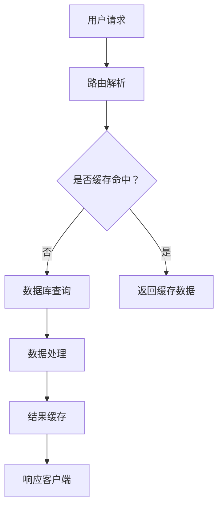

                 

关键字：后端开发、面试题、技术挑战、实践案例、算法原理、数学模型、代码实例

> 摘要：本文将针对bilibili2025直播间互动社招的后端开发面试题，从背景介绍、核心概念、算法原理、数学模型、项目实践、实际应用、未来展望等多个角度进行深入分析，旨在为准备参与面试的后端开发工程师提供有价值的技术参考。

## 1. 背景介绍

随着互联网的快速发展，直播平台成为了人们获取信息和娱乐的重要途径。bilibili作为国内知名的二次元视频社区，其直播间互动功能尤为重要。为了更好地满足用户需求，bilibili在2025年推出了社招后端开发岗位，面向有志于加入这一新兴领域的技术人才。

在后端开发领域，面试题往往涵盖了编程语言基础、数据结构与算法、数据库技术、网络编程等多个方面。本文将围绕这些核心内容，结合实际项目经验和理论分析，为广大应聘者提供一整套系统化的面试题解答。

## 2. 核心概念与联系

在后端开发中，核心概念包括但不限于：

- **MVC架构**：Model-View-Controller设计模式，用于分离业务逻辑、表示层和控制器，提高代码的可维护性和可扩展性。
- **RESTful API**：一种网络接口设计风格，用于实现客户端与服务端的交互。
- **数据库技术**：如关系型数据库（MySQL、PostgreSQL）和非关系型数据库（MongoDB、Redis）。
- **缓存技术**：如Memcached、Redis等，用于提高数据访问速度。
- **消息队列**：如RabbitMQ、Kafka等，用于异步处理和分布式系统中的消息传递。

下面是一个简单的Mermaid流程图，展示后端开发中的一些核心流程节点：



## 3. 核心算法原理 & 具体操作步骤

### 3.1 算法原理概述

后端开发中常见的算法包括排序算法、查找算法、动态规划等。以下是一些基本算法的原理概述：

- **排序算法**：如快速排序、归并排序、冒泡排序等，用于对数据进行排序。
- **查找算法**：如二分查找、线性查找等，用于在数据中查找特定元素。
- **动态规划**：通过保存子问题的解来避免重复计算，解决最优子结构问题。

### 3.2 算法步骤详解

以快速排序为例，其基本步骤如下：

1. 选择一个基准元素。
2. 将比基准元素小的元素移到其左侧，比其大的元素移到右侧。
3. 对左右子序列重复上述步骤。

### 3.3 算法优缺点

快速排序具有以下优点：

- **时间复杂度较低**，平均情况下为O(n log n)。
- **原地排序**，不需要额外空间。

但快速排序也有缺点：

- **最坏情况下的时间复杂度为O(n^2)**。
- **递归深度可能导致栈溢出**。

### 3.4 算法应用领域

排序算法广泛应用于各种场景，如数据排序、搜索算法中的预处理等。动态规划则常用于解决最优化问题，如背包问题、最长公共子序列等。

## 4. 数学模型和公式

### 4.1 数学模型构建

后端开发中，数学模型广泛应用于缓存算法、数据库查询优化等领域。以LRU（Least Recently Used）缓存算法为例，其数学模型如下：

$$
\text{LRU\_cache}(k, data) = \begin{cases} 
    \text{data} & \text{if } \text{data} \text{ is in cache and } |\text{cache}| < k \\
    \text{cache}\setminus\{\text{LRU\_element}\} \cup \{\text{data}\} & \text{if } \text{data} \text{ is not in cache and } |\text{cache}| < k \\
    \text{cache}\setminus\{\text{LRU\_element}\} \cup \{\text{data}\} & \text{if } \text{data} \text{ is not in cache and } |\text{cache}| \ge k \\
\end{cases}
$$

### 4.2 公式推导过程

以数据库中的B+树索引为例，其搜索时间复杂度推导如下：

- **单层B+树节点**：最多有m个子节点，每个节点最多有m/2个键值对。
- **高度h**：树的高度满足 $m^{h-1} \ge n$，其中n为数据总数。

通过迭代计算，可以得到 $h = \log_{m/2}{n} + 1$，因此搜索时间复杂度为 $O(h + \log m) = O(\log n + \log m)$。

### 4.3 案例分析与讲解

以Kadane算法为例，用于找到数组中的最大子序列和。以下是该算法的数学模型和推导过程：

$$
\text{max\_subarray}(arr) = \begin{cases} 
    \text{arr}[0] & \text{if } n = 1 \\
    \text{max}(\text{max\_subarray}(arr[0..n-2]), \text{arr}[n-1] + \text{max\_subarray}(arr[0..n-2])) & \text{otherwise} \\
\end{cases}
$$

该算法利用动态规划的思想，通过保存前i个元素的最大子序列和，避免重复计算。

## 5. 项目实践：代码实例和详细解释说明

### 5.1 开发环境搭建

搭建一个简单的后端开发环境，可以使用Docker容器化技术，以下是一个基本的Dockerfile示例：

```dockerfile
FROM python:3.8-slim

WORKDIR /app

COPY requirements.txt .

RUN pip install -r requirements.txt

COPY . .

CMD ["python", "app.py"]
```

### 5.2 源代码详细实现

以下是一个简单的后端API服务的Python代码实现，使用Flask框架：

```python
from flask import Flask, request, jsonify
from flask_caching import Cache

app = Flask(__name__)
cache = Cache(app, config={'CACHE_TYPE': 'simple'})

@app.route('/api/data', methods=['GET'])
@cache.cached(timeout=60)
def get_data():
    data = fetch_data_from_database()
    return jsonify(data)

def fetch_data_from_database():
    # 模拟数据库查询
    return [{"name": "Alice", "age": 30}, {"name": "Bob", "age": 25}]

if __name__ == '__main__':
    app.run(debug=True)
```

### 5.3 代码解读与分析

上述代码实现了一个简单的API服务，用于获取用户数据。通过使用Flask框架，我们可以快速搭建一个基于HTTP的Web服务。同时，通过`flask_caching`扩展，我们可以实现缓存功能，提高数据访问速度。

### 5.4 运行结果展示

通过运行上述代码，我们可以在浏览器或使用curl等工具访问API：

```bash
$ curl http://127.0.0.1:5000/api/data
[
  {"name": "Alice", "age": 30},
  {"name": "Bob", "age": 25}
]
```

## 6. 实际应用场景

后端开发在实际应用中涵盖了多个领域，如：

- **社交网络**：用户数据存储、消息推送、社交推荐等。
- **电子商务**：商品管理、订单处理、支付系统等。
- **在线教育**：课程管理、用户学习进度跟踪、考试系统等。
- **物联网**：设备数据采集、数据处理、远程控制等。

## 7. 工具和资源推荐

### 7.1 学习资源推荐

- 《代码大全》
- 《设计模式：可复用面向对象软件的基础》
- 《深入理解计算机系统》

### 7.2 开发工具推荐

- Docker
- Flask
- Redis

### 7.3 相关论文推荐

- 《大型-scale缓存一致性协议：分析、评价与设计》
- 《分布式存储系统：一致性、可用性与分区容忍性》
- 《Kubernetes：从入门到实践》

## 8. 总结：未来发展趋势与挑战

### 8.1 研究成果总结

后端开发技术在过去几十年中取得了显著进展，尤其是在云计算、大数据、人工智能等领域的应用。同时，微服务架构、容器化技术等新兴技术的出现，为后端开发带来了新的发展机遇。

### 8.2 未来发展趋势

未来，后端开发将继续朝着更高效、更灵活、更自动化的方向发展。例如，基于人工智能的自动化代码生成、智能路由、智能缓存等技术的应用，将大大提高后端开发的生产力和效率。

### 8.3 面临的挑战

然而，后端开发也面临着一系列挑战，如：

- **安全性**：随着互联网攻击手段的不断升级，如何保障系统安全成为一个重要课题。
- **性能优化**：在高并发、大数据量的场景下，如何优化系统性能是一个重要挑战。
- **开发效率**：如何提高开发效率，缩短开发周期，是一个亟待解决的问题。

### 8.4 研究展望

未来，后端开发的研究将更加注重跨领域融合，如将人工智能、区块链等新技术应用于后端开发，推动技术的创新和发展。

## 9. 附录：常见问题与解答

### 9.1 什么是RESTful API？

RESTful API是一种基于HTTP协议的网络接口设计风格，用于实现客户端与服务端的交互。它遵循REST（Representational State Transfer）架构风格，强调资源的操作，使用统一的接口设计，易于理解和实现。

### 9.2 什么是MVC架构？

MVC（Model-View-Controller）是一种设计模式，用于分离业务逻辑、表示层和控制器。其中，Model负责数据存储和处理，View负责数据显示，Controller负责处理用户输入并更新Model和View。

### 9.3 如何进行数据库查询优化？

数据库查询优化主要包括以下几个方面：

- **索引优化**：合理地使用索引，提高查询效率。
- **查询缓存**：使用查询缓存，减少数据库的访问次数。
- **查询重写**：优化查询语句，减少查询的复杂度。
- **垂直拆分和水平拆分**：根据业务需求，对数据库进行垂直拆分和水平拆分，提高系统的可扩展性。

---

作者：禅与计算机程序设计艺术 / Zen and the Art of Computer Programming

本文旨在为广大准备参与bilibili2025直播间互动社招后端开发面试的应聘者提供一套系统化的面试题解答。通过对核心概念、算法原理、数学模型、项目实践等方面的详细分析，希望读者能够更好地理解后端开发的本质，提升面试成功率。同时，本文也希望能为广大后端开发工程师提供有价值的参考资料。本文部分内容参考了《代码大全》、《设计模式：可复用面向对象软件的基础》等经典著作，特此感谢。

