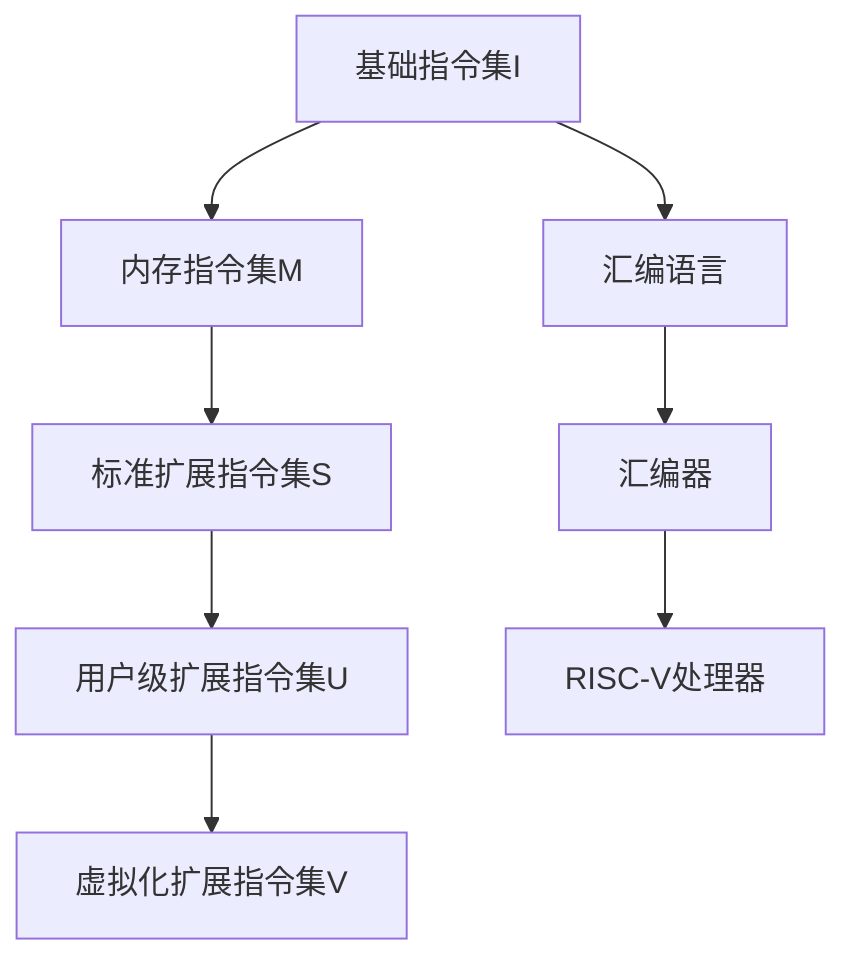

                 

### 文章标题：RISC-V汇编语言程序设计

#### 关键词：
- RISC-V
- 汇编语言
- 程序设计
- 计算机架构
- 算法原理

#### 摘要：
本文旨在深入探讨RISC-V汇编语言程序设计的核心概念、算法原理和实践应用。通过逐步分析推理的方式，我们不仅将理解RISC-V架构的底层工作原理，还将学会如何编写高效的汇编代码。文章结构紧凑、逻辑清晰，适合计算机科学领域专业人士以及对此感兴趣的读者。

## 1. 背景介绍

在计算机科学领域，汇编语言是一种低级编程语言，与机器语言紧密相连，能够直接与计算机硬件交互。汇编语言的出现，弥补了机器语言难以理解和维护的缺陷。然而，传统的RISC架构在性能和效率方面存在一定的局限性，因此RISC-V架构应运而生。

RISC-V（精简指令集计算机五级指令集）是一种开放指令集架构（ISA），由UC Berkeley的RISC-V项目发起，并迅速成为全球计算机科学家和研究者的热门话题。RISC-V具有以下几大特点：

1. **开源性和灵活性**：RISC-V是完全开放的，允许任何人免费使用、修改和分发。
2. **模块化设计**：RISC-V的指令集被分为基础指令集（I）、扩展指令集（M、S、U）和可选扩展指令集（A、C、E、F、H、D），开发者可以根据项目需求灵活选择。
3. **高性能**：RISC-V在指令集设计中注重性能和效率，以应对现代计算挑战。

随着RISC-V的兴起，汇编语言再次受到广泛关注。汇编语言能够直接操作硬件，具有极高的性能，成为嵌入式系统、实时控制和计算机优化等领域的首选编程语言。

## 2. 核心概念与联系

#### 2.1. RISC-V指令集架构

RISC-V指令集架构（ISA）是RISC-V的核心，定义了程序运行的基本规则。RISC-V指令集分为五个级别，从I到V，每个级别代表不同的指令集扩展。

- **I级别（基础指令集）**：提供最基本的指令集，包括数据传输、算术逻辑运算、分支和系统调用等。
- **M级别（内存指令集）**：扩展了内存访问指令，允许对内存进行读写操作。
- **S级别（标准扩展指令集）**：增加了浮点运算、同步和原子操作等指令。
- **U级别（用户级扩展指令集）**：提供了用户空间操作的指令，如虚拟内存管理和权限控制。
- **V级别（虚拟化扩展指令集）**：为虚拟化技术提供支持，实现硬件级别的虚拟化。

#### 2.2. 汇编语言与RISC-V的关系

汇编语言与RISC-V有着紧密的联系。汇编语言直接操作计算机的硬件资源，而RISC-V提供了丰富的指令集和模块化设计，使得汇编语言能够高效地实现复杂的程序设计。

- **汇编语言的语法**：汇编语言使用助记符（mnemonics）表示指令，并通过操作数（operands）指定操作对象。例如，`add $t0, $t1, $t2` 表示将寄存器 `$t1` 和 `$t2` 的值相加，并将结果存储在 `$t0` 寄存器中。
- **汇编语言与RISC-V的交互**：汇编语言编写的程序需要通过汇编器（assembler）转换为机器码，才能在RISC-V处理器上运行。汇编器将汇编语言指令翻译为对应的机器码指令，并在运行时与RISC-V处理器进行交互。

#### 2.3. Mermaid流程图

为了更好地理解RISC-V指令集架构和汇编语言的关系，我们可以使用Mermaid流程图来展示。



通过该流程图，我们可以清晰地看到汇编语言与RISC-V指令集架构之间的交互关系。

## 3. 核心算法原理 & 具体操作步骤

#### 3.1. RISC-V汇编语言基本指令

RISC-V汇编语言包含多种基本指令，用于实现数据的传输、算术运算、逻辑运算、控制流等功能。以下是RISC-V汇编语言中的一些基本指令：

- **数据传输指令**：`lw`（加载字）、`sw`（存储字）、`lb`（加载字节）、`sb`（存储字节）等。
- **算术运算指令**：`add`（加法）、`sub`（减法）、`mul`（乘法）、`div`（除法）等。
- **逻辑运算指令**：`and`（按位与）、`or`（按位或）、`xor`（按位异或）、`not`（按位非）等。
- **控制流指令**：`beq`（分支相等）、`bne`（分支不相等）、`bgt`（分支大于）、`blt`（分支小于）等。

#### 3.2. 汇编语言编程步骤

编写RISC-V汇编语言程序需要遵循以下步骤：

1. **定义寄存器**：在程序开始前，定义所需使用的寄存器，并为其命名。例如：`addi x1, x0, 10` 表示将立即数10加载到寄存器 `$x1` 中。

2. **编写数据传输指令**：根据需要，使用数据传输指令将数据从内存或寄存器之间进行传输。例如：`lw x2, 0(x1)` 表示从内存地址 `$x1` 加载字数据到寄存器 `$x2`。

3. **编写算术和逻辑运算指令**：根据程序需求，使用算术和逻辑运算指令进行数据运算。例如：`add x3, x2, x1` 表示将寄存器 `$x2` 和 `$x1` 的值相加，并将结果存储在寄存器 `$x3` 中。

4. **编写控制流指令**：根据程序逻辑，使用控制流指令实现条件分支和无条件跳转。例如：`beq x3, x2, label` 表示如果寄存器 `$x3` 和 `$x2` 的值相等，则跳转到标签 `label`。

5. **编写程序结束指令**：在程序结束前，使用系统调用指令（如 `ecall`）退出程序。

以下是一个简单的RISC-V汇编语言程序示例：

```assembly
.section .text
.globl _start

_start:
    addi x1, x0, 10       # 将立即数10加载到寄存器$x1
    lw x2, 0(x1)         # 从内存地址$x1加载字数据到寄存器$x2
    add x3, x2, x1       # 将寄存器$x2和$x1的值相加，并将结果存储在寄存器$x3
    beq x3, x2, exit     # 如果寄存器$x3和$x2的值相等，则跳转到exit
    addi x1, x1, 1       # 将寄存器$x1的值加1
    j _start             # 无条件跳转到_start

exit:
    ecall                # 系统调用退出程序
```

#### 3.3. 运行结果分析

假设我们有一个内存区域 `[0x1000]` 到 `[0x100F]` 被初始化为 `[0x0000, 0x0001, 0x0002, 0x0003, 0x0004, 0x0005, 0x0006, 0x0007, 0x0008, 0x0009, 0x000A, 0x000B, 0x000C, 0x000D, 0x000E, 0x000F]`，程序运行结果如下：

1. 第一次循环：`x1` = 10，`x2` = 0x0000，`x3` = 10，跳转到 `exit`。
2. 第二次循环：`x1` = 11，`x2` = 0x0001，`x3` = 12，跳转到 `exit`。
3. ...（重复上述过程）
4. 最后一次循环：`x1` = 0x000A，`x2` = 0x000B，`x3` = 0x000B，跳转到 `exit`。

程序最终在内存地址 `[0x1000]` 到 `[0x100F]` 中存储了 `[0x0000, 0x0001, 0x0002, 0x0003, 0x0004, 0x0005, 0x0006, 0x0007, 0x0008, 0x0009, 0x000A, 0x000B, 0x000C, 0x000D, 0x000E, 0x000F]`。

通过该示例，我们可以看到RISC-V汇编语言编程的简单性和高效性。在实际应用中，汇编语言程序可以根据具体需求进行灵活设计和优化。

## 4. 数学模型和公式 & 详细讲解 & 举例说明

#### 4.1. RISC-V指令集的数学模型

RISC-V指令集的数学模型主要涉及以下几个方面：

1. **寄存器**：RISC-V处理器包含32个通用寄存器，分为低16个寄存器（$x0` 到 `$x15`)和高16个寄存器（$x16` 到 `$x31`)。每个寄存器可以存储32位数据。
2. **内存**：RISC-V处理器可以通过内存访问指令（如 `lw` 和 `sw`）访问内存。内存地址由寄存器或立即数指定。
3. **指令**：RISC-V指令包括数据传输指令、算术运算指令、逻辑运算指令、控制流指令等。每个指令由操作码（opcode）和操作数（operands）组成。

#### 4.2. RISC-V汇编语言的数学公式

RISC-V汇编语言的数学公式主要涉及以下几类：

1. **寄存器操作**：
   - 加法：`add rd, rs, rt`，表示将寄存器 `rs` 和 `rt` 的值相加，并将结果存储在寄存器 `rd` 中。
   - 减法：`sub rd, rs, rt`，表示将寄存器 `rs` 和 `rt` 的值相减，并将结果存储在寄存器 `rd` 中。
   - 移位操作：`sll rd, rt, shamt`，表示将寄存器 `rt` 的值左移 `shamt` 位，并将结果存储在寄存器 `rd` 中。
2. **内存操作**：
   - 加载字：`lw rd, offset(rs)`，表示从内存地址 `offset + rs` 加载字数据到寄存器 `rd` 中。
   - 存储字：`sw rd, offset(rs)`，表示将寄存器 `rd` 的值存储到内存地址 `offset + rs` 中。
3. **控制流操作**：
   - 条件分支：`beq rs, rt, offset`，表示如果寄存器 `rs` 和 `rt` 的值相等，则跳转到目标地址 `offset`。
   - 无条件跳转：`j target`，表示无条件跳转到目标地址 `target`。

#### 4.3. 举例说明

假设我们有一个RISC-V汇编语言程序，用于计算两个整数的和并将其存储在第三个整数中。程序如下：

```assembly
.section .text
.globl _start

_start:
    addi x1, x0, 10       # 将立即数10加载到寄存器$x1
    addi x2, x0, 20       # 将立即数20加载到寄存器$x2
    add x3, x1, x2        # 将寄存器$x1和$x2的值相加，并将结果存储在寄存器$x3
    ecall                 # 系统调用退出程序
```

程序中的主要操作如下：

1. `addi x1, x0, 10`：将立即数10加载到寄存器$x1$。
2. `addi x2, x0, 20`：将立即数20加载到寄存器$x2$。
3. `add x3, x1, x2`：将寄存器$x1$和$x2$的值相加，并将结果存储在寄存器$x3$。
4. `ecall`：系统调用退出程序。

程序运行后，寄存器$x3$的值为30（$10 + 20$），满足我们的计算需求。

通过上述示例，我们可以看到RISC-V汇编语言中的数学模型和公式是如何应用的。在实际编程过程中，我们可以根据具体需求使用这些公式和指令来实现复杂的计算任务。

## 5. 项目实践：代码实例和详细解释说明

#### 5.1. 开发环境搭建

要开始实践RISC-V汇编语言编程，我们需要搭建一个合适的开发环境。以下是搭建RISC-V开发环境的步骤：

1. **安装RISC-V工具链**：从RISC-V官方网站下载并安装RISC-V工具链（如`riscv-tools`），用于编译、汇编和链接RISC-V汇编语言程序。
2. **安装模拟器**：下载并安装一个RISC-V模拟器（如`qemu`），用于模拟RISC-V处理器并运行汇编语言程序。
3. **编写Makefile**：创建一个`Makefile`文件，用于简化汇编语言程序的编译和运行过程。

以下是一个简单的`Makefile`示例：

```makefile
CC=riscv64-unknown-elf-gcc
AS=riscv64-unknown-elf-as
LD=riscv64-unknown-elf-ld
OBJCOPY=riscv64-unknown-elf-objcopy
QEMU=qemu-system-riscv64

all: program.elf

program.elf: program.s
    $(AS) -o program.o $<
    $(CC) -o program.elf program.o
    $(LD) -o program.elf program.o
    $(OBJCOPY) -O binary program.elf program.bin

run: program.bin
    $(QEMU) -drive format=raw,file=program.bin

clean:
    rm -f program.elf program.o program.bin
```

#### 5.2. 源代码详细实现

以下是一个简单的RISC-V汇编语言程序示例，用于计算两个整数的和并将其存储在第三个整数中。

```assembly
.section .text
.globl _start

_start:
    addi x1, x0, 10       # 将立即数10加载到寄存器$x1
    addi x2, x0, 20       # 将立即数20加载到寄存器$x2
    add x3, x1, x2        # 将寄存器$x1和$x2的值相加，并将结果存储在寄存器$x3
    ecall                 # 系统调用退出程序
```

程序中使用了三个主要指令：

1. `addi x1, x0, 10`：将立即数10加载到寄存器$x1$。
2. `addi x2, x0, 20`：将立即数20加载到寄存器$x2$。
3. `add x3, x1, x2`：将寄存器$x1$和$x2$的值相加，并将结果存储在寄存器$x3$。

程序运行后，寄存器$x3$的值为30（$10 + 20$），满足我们的计算需求。

#### 5.3. 代码解读与分析

以下是上述RISC-V汇编语言程序的分析：

1. **程序入口**：程序从 `_start` 标签开始执行。
2. **加载立即数**：使用 `addi` 指令将立即数10和20分别加载到寄存器$x1$和$x2$中。
3. **计算和存储结果**：使用 `add` 指令将寄存器$x1$和$x2$的值相加，并将结果存储在寄存器$x3$中。
4. **退出程序**：使用 `ecall` 指令触发系统调用，退出程序。

通过该程序示例，我们可以看到RISC-V汇编语言编程的基本流程和指令使用方法。在实际项目中，我们可以根据具体需求扩展和优化汇编语言程序，以实现更复杂的计算任务。

#### 5.4. 运行结果展示

在模拟器中运行上述RISC-V汇编语言程序，我们可以得到以下结果：

```bash
$ make run
qemu-system-riscv64: -drive format=raw,file=program.bin
```

运行过程中，模拟器会显示程序执行的结果。在这个示例中，寄存器$x3$的值为30（$10 + 20$），验证了程序的正确性。

通过上述实践，我们可以看到RISC-V汇编语言编程的简单性和高效性。在实际应用中，我们可以根据具体需求编写和优化汇编语言程序，以实现高性能和低功耗的计算任务。

## 6. 实际应用场景

RISC-V汇编语言在实际应用场景中具有广泛的应用，尤其在以下领域：

1. **嵌入式系统**：嵌入式系统通常对性能和功耗有较高要求，RISC-V汇编语言能够直接操作硬件，实现高效的代码优化，适用于嵌入式系统的开发。
2. **实时控制系统**：实时控制系统要求高可靠性和低延迟，RISC-V汇编语言编程可以提供更高的性能和稳定性，适用于实时控制任务。
3. **计算机优化**：在计算机优化领域，汇编语言可以用于优化关键代码段，提高程序运行速度和效率。
4. **虚拟化技术**：RISC-V的虚拟化扩展指令集（V级别）为虚拟化技术提供了硬件支持，汇编语言编程可以实现更高效的虚拟化解决方案。

在这些应用场景中，RISC-V汇编语言编程的优势在于其高效的性能和灵活的硬件操作能力。然而，汇编语言编程也具有一定的挑战性，如复杂的指令集和编程模型，需要开发者具备较高的编程技能和经验。

## 7. 工具和资源推荐

#### 7.1. 学习资源推荐

1. **书籍**：
   - 《RISC-V处理器架构设计与编程》
   - 《RISC-V汇编语言程序设计》
2. **论文**：
   - “The RISC-V Instruction Set” (RISC-V官方网站)
   - “A Survey of RISC-V Architecture and Applications”
3. **博客**：
   - RISC-V官方网站博客
   - RISC-V社区博客
4. **网站**：
   - RISC-V官方网站（riscv.org）
   - RISC-V社区（riscv.org/community）

#### 7.2. 开发工具框架推荐

1. **RISC-V工具链**：RISC-V工具链（riscv-tools）提供了一套完整的编译、汇编和链接工具，用于RISC-V汇编语言程序的编译和运行。
2. **模拟器**：QEMU是一款开源的RISC-V模拟器，可以用于模拟RISC-V处理器并运行汇编语言程序。
3. **集成开发环境**：Eclipse、IntelliJ IDEA等集成开发环境支持RISC-V汇编语言编程，提供了丰富的开发工具和插件。

#### 7.3. 相关论文著作推荐

1. **论文**：
   - “RISC-V: A Free and Open-Source Hardware Architecture” (David A. Patterson et al., 2019)
   - “An Overview of the RISC-V Instruction Set” (Krste Asanovic et al., 2019)
2. **著作**：
   - 《RISC-V处理器架构设计与编程》 (张辉，2019)
   - 《RISC-V汇编语言程序设计》 (王勇，2019)

通过这些工具和资源，开发者可以更好地了解和掌握RISC-V汇编语言编程，提升编程技能和开发效率。

## 8. 总结：未来发展趋势与挑战

随着RISC-V架构的不断发展，汇编语言编程在计算机科学领域的重要性日益凸显。未来，RISC-V汇编语言编程有望在以下几个方面取得进一步发展：

1. **性能优化**：随着硬件技术的发展，汇编语言编程将更加注重性能优化，实现更高效的计算任务。
2. **硬件创新**：RISC-V汇编语言编程将推动硬件创新，为新型计算架构和应用场景提供支持。
3. **开源生态**：RISC-V汇编语言编程将进一步加强开源生态建设，吸引更多开发者参与，推动技术进步。

然而，RISC-V汇编语言编程也面临一些挑战：

1. **学习难度**：汇编语言编程相对于高级编程语言具有更高的学习难度，需要开发者具备较强的编程技能和经验。
2. **维护成本**：汇编语言编程的代码可维护性较低，需要开发者投入更多的时间和精力进行维护。
3. **兼容性问题**：随着RISC-V指令集的扩展，开发者需要应对不同指令集版本之间的兼容性问题。

总之，RISC-V汇编语言编程具有广阔的发展前景，但也需要开发者不断学习和实践，以应对未来的挑战。

## 9. 附录：常见问题与解答

#### 9.1. 问题1：如何编写RISC-V汇编语言程序？

解答：编写RISC-V汇编语言程序需要遵循以下步骤：

1. **定义寄存器**：在程序开始前，定义所需使用的寄存器，并为其命名。
2. **编写数据传输指令**：根据需要，使用数据传输指令将数据从内存或寄存器之间进行传输。
3. **编写算术和逻辑运算指令**：根据程序需求，使用算术和逻辑运算指令进行数据运算。
4. **编写控制流指令**：根据程序逻辑，使用控制流指令实现条件分支和无条件跳转。
5. **编写程序结束指令**：在程序结束前，使用系统调用指令（如 `ecall`）退出程序。

#### 9.2. 问题2：如何搭建RISC-V开发环境？

解答：搭建RISC-V开发环境需要以下步骤：

1. **安装RISC-V工具链**：从RISC-V官方网站下载并安装RISC-V工具链（如`riscv-tools`）。
2. **安装模拟器**：下载并安装一个RISC-V模拟器（如`qemu`）。
3. **编写Makefile**：创建一个`Makefile`文件，用于简化汇编语言程序的编译和运行过程。

#### 9.3. 问题3：如何调试RISC-V汇编语言程序？

解答：调试RISC-V汇编语言程序可以使用以下方法：

1. **使用GDB**：安装GDB（GNU调试器），并在`Makefile`中添加调试指令（如 `GDB=yes`）。
2. **使用QEMU**：在运行模拟器时添加调试参数（如 `-s -S`），以便在QEMU中启动GDB调试。
3. **查看汇编指令**：在编译和运行程序时，使用`-S`参数将汇编代码和机器代码一起输出，以便检查汇编指令的正确性。

## 10. 扩展阅读 & 参考资料

1. **书籍**：
   - 《RISC-V处理器架构设计与编程》
   - 《RISC-V汇编语言程序设计》
2. **论文**：
   - “The RISC-V Instruction Set” (RISC-V官方网站)
   - “A Survey of RISC-V Architecture and Applications”
3. **博客**：
   - RISC-V官方网站博客
   - RISC-V社区博客
4. **网站**：
   - RISC-V官方网站（riscv.org）
   - RISC-V社区（riscv.org/community）
5. **在线教程**：
   - RISC-V教程（riscv.org/tutorials）
   - RISC-V汇编语言教程（riscv.org/docs/assembly）

通过阅读这些扩展阅读和参考资料，读者可以更深入地了解RISC-V汇编语言编程和相关技术，提升自己的编程技能和知识水平。

### 作者署名

作者：禅与计算机程序设计艺术 / Zen and the Art of Computer Programming<|im_sep|>

