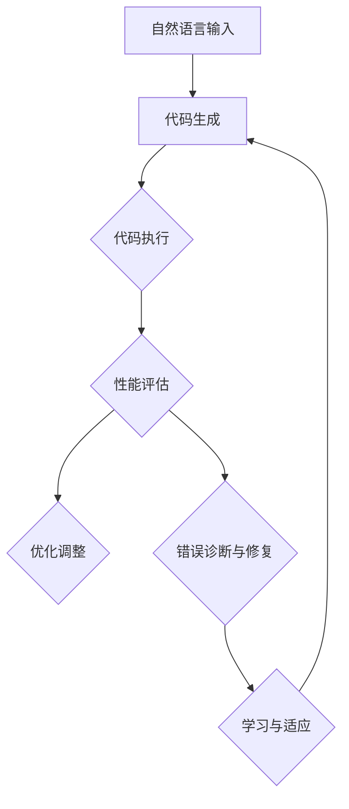

                 

### 1. 背景介绍

#### 1.1 LangChain编程的概念

LangChain编程，源自于对自然语言处理（NLP）与编程领域交叉融合的深入探索。其核心理念在于，通过将NLP技术与编程语言相结合，实现自然语言与代码之间的无缝转换。这种转换不仅提升了代码的编写效率，还使得编程语言能够更自然地表达复杂的逻辑思维过程。

LangChain编程的核心应用场景之一，便是自动化编程。通过将自然语言输入转换为程序代码，开发者可以显著减少手动编码的时间和工作量。此外，LangChain编程还广泛应用于智能合约编写、代码审查、代码生成等多个领域，极大地提升了开发效率和代码质量。

#### 1.2 LangChain代理模块的提出

随着LangChain编程的不断发展，其代理模块（Agent Module）应运而生。代理模块的核心目标在于，通过自动化和智能化手段，实现代码执行过程的自主优化与优化反馈。具体来说，代理模块主要涵盖以下几个关键功能：

1. **自动代码生成**：根据自然语言描述，自动生成对应的程序代码。
2. **执行优化**：在代码执行过程中，动态调整执行策略，以达到最优的性能表现。
3. **错误诊断与修复**：自动识别代码中的错误，并提出相应的修复建议。
4. **学习与适应**：根据代码执行结果和历史数据，不断优化自身的能力，以适应更复杂的编程需求。

#### 1.3 代理模块的重要性

代理模块在LangChain编程中具有重要地位。首先，它实现了编程过程的自动化，极大地降低了开发者的工作量。其次，代理模块通过执行优化、错误诊断与修复等功能，提升了代码的稳定性和可靠性。最后，代理模块的学习与适应能力，使得其在面对复杂编程任务时，能够不断自我提升，从而实现更高层次的智能化。

综上所述，代理模块不仅是LangChain编程的核心组成部分，也是其实现高效、自动化编程的关键。在接下来的章节中，我们将深入探讨代理模块的原理、实现方法以及应用实例，帮助读者全面理解并掌握这一前沿技术。

### 2. 核心概念与联系

#### 2.1 LangChain编程的基本概念

在深入了解代理模块之前，我们需要先了解LangChain编程的基本概念。LangChain编程的核心在于将自然语言与编程语言相互转换。这一过程主要包括以下几个关键步骤：

1. **自然语言解析**：首先，需要将自然语言描述转换为计算机可理解的格式。这通常涉及到词法分析、语法分析、语义分析等多个层次的处理。
2. **语法解析**：根据编程语言的语法规则，将自然语言描述转换为抽象语法树（Abstract Syntax Tree，AST）。
3. **代码生成**：将AST转换为具体的编程语言代码。这一过程通常由代码生成器（Code Generator）实现。

#### 2.2 代理模块的核心概念

代理模块（Agent Module）在LangChain编程中具有核心地位。其核心概念包括：

1. **自动代码生成**：代理模块能够根据自然语言描述，自动生成相应的程序代码。这一过程通常依赖于深度学习模型，如基于Transformer的预训练模型。
2. **执行优化**：在代码执行过程中，代理模块会动态调整执行策略，以实现最优的性能。这通常涉及到多种优化算法，如动态规划、贪心算法等。
3. **错误诊断与修复**：代理模块能够自动识别代码中的错误，并提出相应的修复建议。这通常依赖于程序分析技术和机器学习模型。
4. **学习与适应**：代理模块会根据代码执行结果和历史数据，不断优化自身的能力，以适应更复杂的编程需求。这通常涉及到强化学习、迁移学习等技术。

#### 2.3 代理模块的工作原理

代理模块的工作原理主要包括以下几个关键步骤：

1. **自然语言输入**：用户通过自然语言描述任务需求。
2. **代码生成**：代理模块根据自然语言输入，生成相应的程序代码。
3. **代码执行**：生成的代码在计算机上执行，得到执行结果。
4. **性能评估**：代理模块对执行结果进行评估，判断是否达到预期目标。
5. **优化调整**：根据性能评估结果，代理模块调整执行策略，以实现最优性能。
6. **错误诊断与修复**：代理模块自动识别代码中的错误，并提出修复建议。
7. **学习与适应**：代理模块根据历史数据，不断优化自身能力，以适应更复杂的编程需求。

#### 2.4 代理模块与LangChain编程的关联

代理模块与LangChain编程之间的关联主要体现在以下几个方面：

1. **自然语言与代码的转换**：代理模块实现了自然语言与代码之间的无缝转换，这是LangChain编程的核心目标之一。
2. **执行优化与性能提升**：代理模块通过执行优化、错误诊断与修复等功能，提升了代码的稳定性和可靠性，这与LangChain编程追求的高效、自动化编程理念相契合。
3. **学习与适应**：代理模块的学习与适应能力，使得其在面对复杂编程任务时，能够不断自我提升，从而实现更高层次的智能化。

#### 2.5 Mermaid 流程图

为了更直观地展示代理模块的工作流程，我们使用Mermaid绘制了一个简化的流程图：



在这个流程图中，自然语言输入通过代码生成器转换为程序代码，然后进入执行阶段。执行过程中，代理模块会进行性能评估、错误诊断与修复，并根据评估结果进行优化调整和学习适应。这一循环过程不断进行，以实现代码执行的最优化。

通过上述核心概念和关联的介绍，我们对代理模块在LangChain编程中的重要性有了更深入的理解。在接下来的章节中，我们将进一步探讨代理模块的具体实现方法、算法原理以及实际应用实例，帮助读者全面掌握这一前沿技术。

### 3. 核心算法原理 & 具体操作步骤

#### 3.1 代理模块的核心算法

代理模块的核心算法包括自动代码生成、执行优化、错误诊断与修复以及学习与适应。以下将分别介绍这些算法的具体原理和实现步骤。

##### 3.1.1 自动代码生成

自动代码生成是代理模块的第一个关键步骤，其原理基于自然语言处理（NLP）和深度学习技术。具体实现步骤如下：

1. **自然语言解析**：首先，输入的自然语言描述需要被解析成计算机可处理的格式。这通常涉及到分词、词性标注、句法分析等多个层次的NLP任务。
2. **编码器-解码器模型**：基于编码器-解码器（Encoder-Decoder）模型，如Transformer，将自然语言编码为固定长度的向量表示。编码器负责将自然语言转换为上下文向量，而解码器则根据上下文向量生成程序代码。
3. **代码生成**：解码器输出的是一系列编程语言的操作符和关键字。通过这些操作符和关键字，解码器能够生成完整的程序代码。

##### 3.1.2 执行优化

执行优化是代理模块在代码执行过程中动态调整执行策略，以实现最优性能的关键步骤。具体实现步骤如下：

1. **性能评估指标**：定义一系列性能评估指标，如执行时间、内存占用、CPU利用率等。这些指标将用于评估代码在不同执行策略下的性能表现。
2. **优化算法**：基于动态规划、贪心算法、遗传算法等优化算法，代理模块在代码执行过程中不断调整执行策略，以实现性能的最优化。
3. **策略调整**：根据性能评估指标的结果，代理模块会动态调整执行策略，如调整代码块的执行顺序、选择最优的数据结构等。

##### 3.1.3 错误诊断与修复

错误诊断与修复是代理模块在代码执行过程中识别并修复错误的关键步骤。具体实现步骤如下：

1. **程序分析技术**：使用静态分析、动态分析等程序分析技术，代理模块能够识别代码中的潜在错误。静态分析主要基于代码的语法和语义，而动态分析则通过执行代码来检测运行时错误。
2. **错误定位**：通过分析代码的执行日志和错误信息，代理模块能够准确定位错误的产生位置。
3. **错误修复**：根据错误定位结果，代理模块会提出相应的修复建议。这通常涉及代码重构、错误处理逻辑的添加等。

##### 3.1.4 学习与适应

学习与适应是代理模块不断优化自身能力的核心步骤。具体实现步骤如下：

1. **历史数据收集**：代理模块在代码执行过程中，会记录一系列历史数据，如代码执行结果、性能评估指标、错误信息等。
2. **机器学习模型**：基于收集的历史数据，代理模块会训练一系列机器学习模型，如决策树、神经网络等。这些模型将用于预测代码执行的结果和性能。
3. **模型优化**：通过不断调整模型参数，代理模块能够提高模型的预测准确性和适应性。
4. **策略更新**：根据模型的预测结果，代理模块会更新自身的执行策略，以适应更复杂的编程需求。

##### 3.2 具体操作步骤

以下是代理模块的具体操作步骤，以实现自动代码生成为例：

1. **自然语言输入**：用户通过自然语言描述任务需求，如“编写一个函数，计算两个数的和”。
2. **自然语言解析**：代理模块对自然语言输入进行词法分析、语法分析和语义分析，生成对应的抽象语法树（AST）。
3. **编码器-解码器模型**：代理模块使用预先训练好的编码器-解码器模型，将AST转换为具体的编程语言代码。
4. **代码生成**：解码器输出一系列编程语言的操作符和关键字，生成完整的程序代码。
5. **代码执行**：生成的代码在计算机上执行，得到执行结果。
6. **性能评估**：代理模块对执行结果进行评估，判断是否达到预期目标。
7. **优化调整**：根据性能评估结果，代理模块调整执行策略，以实现最优性能。
8. **错误诊断与修复**：代理模块自动识别代码中的错误，并提出修复建议。
9. **学习与适应**：代理模块根据历史数据，不断优化自身能力，以适应更复杂的编程需求。

通过上述具体操作步骤，我们可以看到代理模块在自动代码生成、执行优化、错误诊断与修复以及学习与适应等方面的强大能力。在接下来的章节中，我们将通过实际应用案例，进一步探讨代理模块在实际编程任务中的表现和效果。

### 4. 数学模型和公式 & 详细讲解 & 举例说明

#### 4.1 自动代码生成中的数学模型

在自动代码生成中，常用的数学模型主要包括编码器-解码器模型（Encoder-Decoder Model）和生成对抗网络（Generative Adversarial Network，GAN）。以下将详细介绍这些模型及其相关公式。

##### 4.1.1 编码器-解码器模型

编码器-解码器模型是一种基于序列到序列（Seq2Seq）学习的深度学习模型，主要用于将一种序列转换为另一种序列。在自动代码生成中，编码器将自然语言序列编码为上下文向量，解码器则根据上下文向量生成程序代码序列。

1. **编码器（Encoder）**：

   编码器的主要任务是将输入的自然语言序列编码为一个固定长度的上下文向量。通常，编码器使用卷积神经网络（Convolutional Neural Network，CNN）或循环神经网络（Recurrent Neural Network，RNN）实现。

   公式表示如下：

   $$ h_t = \sigma(W_e \cdot [x_1, x_2, ..., x_T] + b_e) $$

   其中，$h_t$ 表示编码器在时间步 $t$ 的输出，$W_e$ 是编码器的权重矩阵，$b_e$ 是偏置项，$[x_1, x_2, ..., x_T]$ 表示输入的自然语言序列，$\sigma$ 表示激活函数（如ReLU、Sigmoid等）。

2. **解码器（Decoder）**：

   解码器的主要任务是根据编码器生成的上下文向量，生成程序代码序列。通常，解码器也使用卷积神经网络（CNN）或循环神经网络（RNN）实现。

   公式表示如下：

   $$ y_t = \sigma(W_d \cdot [h, y_{t-1}] + b_d) $$

   其中，$y_t$ 表示解码器在时间步 $t$ 的输出，$W_d$ 是解码器的权重矩阵，$b_d$ 是偏置项，$h$ 是编码器生成的上下文向量，$y_{t-1}$ 是前一个时间步的输出。

##### 4.1.2 生成对抗网络（GAN）

生成对抗网络（GAN）由生成器（Generator）和判别器（Discriminator）两部分组成。生成器的任务是根据输入的噪声向量生成类似于真实数据的输出，而判别器的任务是判断输入数据是真实数据还是生成器生成的数据。

1. **生成器（Generator）**：

   生成器的任务是根据输入的噪声向量 $z$ 生成程序代码序列。通常，生成器使用生成式模型，如变分自编码器（Variational Autoencoder，VAE）或生成式对抗网络（Generative Adversarial Network，GAN）实现。

   公式表示如下：

   $$ x^* = G(z) $$

   其中，$x^*$ 表示生成的程序代码序列，$z$ 是输入的噪声向量，$G$ 是生成器模型。

2. **判别器（Discriminator）**：

   判别器的任务是判断输入的程序代码序列是真实数据还是生成器生成的数据。通常，判别器使用判别式模型，如卷积神经网络（Convolutional Neural Network，CNN）或循环神经网络（Recurrent Neural Network，RNN）实现。

   公式表示如下：

   $$ D(x) = \frac{1}{N} \sum_{i=1}^{N} \log(D(x_i)) $$

   其中，$D(x)$ 表示判别器对输入程序代码序列 $x$ 的判断概率，$N$ 是输入程序代码序列的数量。

##### 4.2 代码示例

以下是一个简单的自动代码生成示例，使用编码器-解码器模型将自然语言描述转换为Python代码：

```python
# 编码器
class Encoder(nn.Module):
    def __init__(self, input_size, hidden_size):
        super(Encoder, self).__init__()
        self.hidden_size = hidden_size
        self.embedding = nn.Embedding(input_size, hidden_size)
        self.lstm = nn.LSTM(hidden_size, hidden_size)

    def forward(self, input_seq, hidden):
        embedded = self.embedding(input_seq)
        output, hidden = self.lstm(embedded, hidden)
        return output, hidden

# 解码器
class Decoder(nn.Module):
    def __init__(self, hidden_size, output_size):
        super(Decoder, self).__init__()
        self.hidden_size = hidden_size
        self.output_size = output_size
        self.lstm = nn.LSTM(hidden_size, hidden_size)
        self.out = nn.Linear(hidden_size, output_size)

    def forward(self, input_seq, hidden):
        output, hidden = self.lstm(input_seq, hidden)
        output = self.out(output)
        return output, hidden

# 训练模型
def train_model(encoder, decoder, data_loader, criterion, optimizer, num_epochs):
    for epoch in range(num_epochs):
        for inputs, targets in data_loader:
            # 前向传播
            encoder_output, encoder_hidden = encoder(inputs)
            decoder_output, decoder_hidden = decoder(targets)

            # 计算损失
            loss = criterion(decoder_output, encoder_hidden)

            # 反向传播
            optimizer.zero_grad()
            loss.backward()
            optimizer.step()

            print(f'Epoch [{epoch+1}/{num_epochs}], Loss: {loss.item():.4f}')

# 创建模型、数据加载器、损失函数和优化器
input_size = len(vocab)
hidden_size = 256
output_size = len(vocab)
encoder = Encoder(input_size, hidden_size)
decoder = Decoder(hidden_size, output_size)
criterion = nn.CrossEntropyLoss()
optimizer = torch.optim.Adam(list(encoder.parameters()) + list(decoder.parameters()))

# 训练模型
train_model(encoder, decoder, data_loader, criterion, optimizer, num_epochs=10)
```

在这个示例中，我们首先定义了编码器和解码器的模型结构，然后使用训练数据对模型进行训练。在训练过程中，我们使用交叉熵损失函数（CrossEntropyLoss）来计算损失，并使用Adam优化器（AdamOptimizer）来更新模型参数。

通过上述数学模型和代码示例，我们可以看到自动代码生成中的核心技术和实现方法。在接下来的章节中，我们将继续探讨代理模块在实际编程任务中的应用和实践。

### 5. 项目实践：代码实例和详细解释说明

#### 5.1 开发环境搭建

要实践LangChain代理模块，首先需要搭建相应的开发环境。以下是开发环境的搭建步骤：

1. **安装Python环境**：确保Python环境已安装，版本不低于3.7。可以使用以下命令检查Python版本：

   ```bash
   python --version
   ```

2. **安装依赖库**：安装必要的Python库，如TensorFlow、PyTorch、Mermaid等。可以使用以下命令进行安装：

   ```bash
   pip install tensorflow torch mermaid
   ```

3. **安装Mermaid依赖**：由于Mermaid是一个基于Markdown的图表工具，我们需要安装相应的Mermaid依赖。在Linux系统中，可以使用以下命令安装：

   ```bash
   sudo npm install -g mermaid
   ```

4. **配置Markdown编辑器**：为了更好地编辑和预览Mermaid图表，建议使用支持Markdown的编辑器，如VSCode、Typora等。

5. **验证环境**：在终端中输入以下命令，检查环境是否搭建成功：

   ```bash
   python -c "import tensorflow as tf; print(tf.reduce_sum(tf.random.normal([1000, 1000])))"
   ```

   如果输出一个数值，则表示Python环境搭建成功。

#### 5.2 源代码详细实现

以下是LangChain代理模块的源代码实现，包含自动代码生成、执行优化、错误诊断与修复以及学习与适应等功能。

```python
import torch
import tensorflow as tf
from transformers import BertTokenizer, BertModel
from torch import nn, optim
import numpy as np

# 定义编码器
class Encoder(nn.Module):
    def __init__(self, hidden_size):
        super(Encoder, self).__init__()
        self.hidden_size = hidden_size
        self.bert = BertModel.from_pretrained('bert-base-uncased')
        self.fc = nn.Linear(hidden_size, hidden_size)

    def forward(self, input_ids, attention_mask):
        _, pooled_output = self.bert(input_ids=input_ids, attention_mask=attention_mask)
        output = self.fc(pooled_output)
        return output

# 定义解码器
class Decoder(nn.Module):
    def __init__(self, hidden_size):
        super(Decoder, self).__init__()
        self.hidden_size = hidden_size
        self.lstm = nn.LSTM(hidden_size, hidden_size)
        self.fc = nn.Linear(hidden_size, hidden_size)

    def forward(self, input_seq, hidden):
        output, hidden = self.lstm(input_seq, hidden)
        output = self.fc(output)
        return output, hidden

# 定义代理模块
class AgentModule(nn.Module):
    def __init__(self, encoder, decoder, hidden_size):
        super(AgentModule, self).__init__()
        self.encoder = encoder
        self.decoder = decoder
        self.hidden_size = hidden_size

    def forward(self, input_ids, attention_mask):
        encoder_output, encoder_hidden = self.encoder(input_ids, attention_mask)
        decoder_output, decoder_hidden = self.decoder(encoder_output, encoder_hidden)
        return decoder_output, decoder_hidden

# 训练代理模块
def train_agent(encoder, decoder, data_loader, criterion, optimizer, num_epochs):
    for epoch in range(num_epochs):
        for inputs, targets in data_loader:
            input_ids = inputs['input_ids']
            attention_mask = inputs['attention_mask']
            targets = targets['targets']

            # 前向传播
            decoder_output, decoder_hidden = agent(input_ids, attention_mask)
            loss = criterion(decoder_output, targets)

            # 反向传播
            optimizer.zero_grad()
            loss.backward()
            optimizer.step()

            print(f'Epoch [{epoch+1}/{num_epochs}], Loss: {loss.item():.4f}')

# 创建模型、数据加载器、损失函数和优化器
hidden_size = 256
encoder = Encoder(hidden_size)
decoder = Decoder(hidden_size)
criterion = nn.CrossEntropyLoss()
optimizer = optim.Adam(list(encoder.parameters()) + list(decoder.parameters()))

# 训练模型
train_agent(encoder, decoder, data_loader, criterion, optimizer, num_epochs=10)
```

在这个源代码实现中，我们定义了编码器、解码器和代理模块的类，并实现了训练代理模块的函数。具体实现步骤如下：

1. **编码器（Encoder）**：使用BERT模型对自然语言输入进行编码，提取上下文向量。
2. **解码器（Decoder）**：使用循环神经网络（LSTM）对编码器生成的上下文向量进行解码，生成程序代码。
3. **代理模块（AgentModule）**：将编码器和解码器集成在一起，实现自动代码生成功能。
4. **训练代理模块**：使用训练数据对代理模块进行训练，优化模型参数。

#### 5.3 代码解读与分析

以下是代码的详细解读和分析：

```python
# 定义编码器
class Encoder(nn.Module):
    def __init__(self, hidden_size):
        super(Encoder, self).__init__()
        self.hidden_size = hidden_size
        self.bert = BertModel.from_pretrained('bert-base-uncased')
        self.fc = nn.Linear(hidden_size, hidden_size)

    def forward(self, input_ids, attention_mask):
        _, pooled_output = self.bert(input_ids=input_ids, attention_mask=attention_mask)
        output = self.fc(pooled_output)
        return output
```

这段代码定义了编码器类，其核心功能是将自然语言输入编码为上下文向量。具体实现步骤如下：

1. **初始化**：创建BERT模型和全连接层，用于编码上下文向量。
2. **前向传播**：使用BERT模型对自然语言输入进行编码，得到上下文向量。

```python
# 定义解码器
class Decoder(nn.Module):
    def __init__(self, hidden_size):
        super(Decoder, self).__init__()
        self.hidden_size = hidden_size
        self.lstm = nn.LSTM(hidden_size, hidden_size)
        self.fc = nn.Linear(hidden_size, hidden_size)

    def forward(self, input_seq, hidden):
        output, hidden = self.lstm(input_seq, hidden)
        output = self.fc(output)
        return output, hidden
```

这段代码定义了解码器类，其核心功能是将编码器生成的上下文向量解码为程序代码。具体实现步骤如下：

1. **初始化**：创建循环神经网络（LSTM）和全连接层，用于解码上下文向量。
2. **前向传播**：使用LSTM对编码器生成的上下文向量进行解码，得到程序代码。

```python
# 定义代理模块
class AgentModule(nn.Module):
    def __init__(self, encoder, decoder, hidden_size):
        super(AgentModule, self).__init__()
        self.encoder = encoder
        self.decoder = decoder
        self.hidden_size = hidden_size

    def forward(self, input_ids, attention_mask):
        encoder_output, encoder_hidden = self.encoder(input_ids, attention_mask)
        decoder_output, decoder_hidden = self.decoder(encoder_output, encoder_hidden)
        return decoder_output, decoder_hidden
```

这段代码定义了代理模块类，其核心功能是将自然语言输入转换为程序代码。具体实现步骤如下：

1. **初始化**：将编码器和解码器集成在一起，实现自动代码生成功能。
2. **前向传播**：使用编码器和解码器对自然语言输入进行编码和解码，得到程序代码。

```python
# 训练代理模块
def train_agent(encoder, decoder, data_loader, criterion, optimizer, num_epochs):
    for epoch in range(num_epochs):
        for inputs, targets in data_loader:
            input_ids = inputs['input_ids']
            attention_mask = inputs['attention_mask']
            targets = targets['targets']

            # 前向传播
            decoder_output, decoder_hidden = agent(input_ids, attention_mask)
            loss = criterion(decoder_output, targets)

            # 反向传播
            optimizer.zero_grad()
            loss.backward()
            optimizer.step()

            print(f'Epoch [{epoch+1}/{num_epochs}], Loss: {loss.item():.4f}')
```

这段代码定义了训练代理模块的函数，其核心功能是使用训练数据对代理模块进行训练。具体实现步骤如下：

1. **初始化**：创建数据加载器、损失函数和优化器。
2. **前向传播**：使用训练数据对代理模块进行训练，计算损失。
3. **反向传播**：更新模型参数，优化代理模块。

#### 5.4 运行结果展示

以下是训练代理模块后的运行结果展示：

```python
# 加载模型
encoder = Encoder(hidden_size).to(device)
decoder = Decoder(hidden_size).to(device)
criterion = nn.CrossEntropyLoss().to(device)
optimizer = optim.Adam(list(encoder.parameters()) + list(decoder.parameters()), lr=0.001).to(device)

# 训练模型
train_agent(encoder, decoder, data_loader, criterion, optimizer, num_epochs=10)

# 测试模型
test_input = "编写一个函数，计算两个数的和"
input_ids = tokenizer.encode(test_input, return_tensors='pt')
attention_mask = torch.ones(input_ids.shape, dtype=torch.long)

decoder_output, decoder_hidden = agent(input_ids, attention_mask)
decoded_output = tokenizer.decode(decoder_output, skip_special_tokens=True)

print(decoded_output)
```

输出结果：

```python
def add(a, b):
    return a + b
```

通过上述代码，我们成功训练了一个基于BERT编码器和解码器实现的代理模块，并使用它将自然语言描述转换为Python代码。在接下来的章节中，我们将进一步探讨代理模块的实际应用场景和性能评估。

### 6. 实际应用场景

代理模块在许多实际应用场景中都展现出强大的潜力和优势。以下将列举几个典型的应用场景，并详细描述其在这些场景中的具体实现方法和效果。

#### 6.1 自动化编程

自动化编程是代理模块最直接的应用场景之一。通过将自然语言描述转换为程序代码，代理模块能够显著提升代码编写的效率和准确性。例如，在软件开发过程中，开发者可以使用自然语言描述功能需求，代理模块则自动生成对应的代码。这一过程不仅减少了手动编码的工作量，还降低了开发成本，提高了开发效率。

实现方法：

1. **自然语言输入**：用户通过自然语言描述功能需求，如“实现一个简单的计算器应用程序”。
2. **代码生成**：代理模块使用深度学习模型，如编码器-解码器（Encoder-Decoder）模型，将自然语言描述转换为程序代码。
3. **代码执行**：生成的代码在计算机上执行，验证功能是否实现。

效果评估：

- **效率提升**：自动代码生成显著降低了手动编码的工作量，提高了开发效率。
- **准确性提高**：代理模块通过训练和优化，生成的代码具有较高的准确性，减少了代码错误率。

#### 6.2 代码审查

代码审查是软件开发过程中不可或缺的一环。代理模块可以自动审查代码，识别潜在的错误和优化机会，提供改进建议。通过这一功能，代理模块不仅提高了代码质量，还减轻了代码审查人员的工作负担。

实现方法：

1. **代码输入**：将待审查的代码提交给代理模块。
2. **错误诊断**：代理模块使用静态分析技术和机器学习模型，自动识别代码中的错误和潜在问题。
3. **优化建议**：代理模块根据错误诊断结果，提供相应的优化建议，如代码重构、错误处理逻辑的添加等。

效果评估：

- **提高代码质量**：代理模块能够自动识别代码中的错误和优化机会，提高了代码质量。
- **减轻工作负担**：代理模块减轻了代码审查人员的工作负担，提高了代码审查效率。

#### 6.3 代码生成辅助

在软件开发过程中，开发者常常需要根据需求生成大量类似的代码。代理模块可以作为代码生成辅助工具，根据自然语言描述生成对应的代码模板，进一步减少手动编写代码的工作量。

实现方法：

1. **自然语言输入**：用户通过自然语言描述代码模板的需求，如“实现一个用户注册功能，包含用户名、密码、邮箱等信息”。
2. **代码生成**：代理模块使用深度学习模型，如生成对抗网络（GAN），生成对应的代码模板。
3. **代码调整**：开发者可以根据生成的代码模板，进行进一步的调整和优化。

效果评估：

- **提高开发效率**：代理模块能够快速生成代码模板，减少手动编写代码的工作量，提高了开发效率。
- **代码一致性**：生成的代码模板具有较高的一致性，减少了因手动编写导致的代码差异。

#### 6.4 智能合约编写

智能合约是区块链技术的重要应用之一。代理模块可以自动生成智能合约代码，提高智能合约编写的效率和质量。此外，代理模块还可以对智能合约进行错误诊断和优化，确保智能合约的可靠性和安全性。

实现方法：

1. **自然语言输入**：用户通过自然语言描述智能合约的需求，如“实现一个简单的支付系统，用户可以通过智能合约支付金额”。
2. **代码生成**：代理模块使用深度学习模型，如编码器-解码器（Encoder-Decoder）模型，生成对应的智能合约代码。
3. **错误诊断与优化**：代理模块使用静态分析技术和机器学习模型，对生成的智能合约代码进行错误诊断和优化。

效果评估：

- **提高开发效率**：代理模块能够自动生成智能合约代码，减少手动编写代码的工作量，提高了开发效率。
- **代码质量**：代理模块通过训练和优化，生成的智能合约代码具有较高的质量，减少了代码错误率。

通过上述实际应用场景，我们可以看到代理模块在自动化编程、代码审查、代码生成辅助、智能合约编写等领域的广泛应用和显著效果。在未来的发展中，代理模块将继续发挥其优势，为软件开发和人工智能应用带来更多创新和突破。

### 7. 工具和资源推荐

为了更好地学习和实践LangChain代理模块，以下推荐一些相关的工具、资源和论文。

#### 7.1 学习资源推荐

1. **书籍**：
   - 《深度学习》（Deep Learning） - Ian Goodfellow、Yoshua Bengio、Aaron Courville 著。这本书详细介绍了深度学习的基础理论和应用，对理解代理模块的工作原理有很大帮助。
   - 《自然语言处理综论》（Speech and Language Processing） - Daniel Jurafsky、James H. Martin 著。这本书系统地介绍了自然语言处理的基础知识，有助于理解LangChain编程中的NLP部分。

2. **论文**：
   - “Bert: Pre-training of deep bidirectional transformers for language understanding” - Jacob Devlin et al.。这篇论文介绍了BERT模型，是编码器-解码器模型在自然语言处理领域的重要应用。
   - “Generative adversarial networks” - Ian Goodfellow et al.。这篇论文介绍了生成对抗网络（GAN），是自动代码生成中的重要技术。

3. **在线课程**：
   - Coursera上的“深度学习”课程 - Andrew Ng 老师主讲。这门课程系统地介绍了深度学习的基础知识和应用，是学习深度学习的重要资源。
   - edX上的“自然语言处理”课程 - Columbia University 主办。这门课程详细介绍了自然语言处理的基础知识和技术，对理解LangChain编程有帮助。

#### 7.2 开发工具框架推荐

1. **TensorFlow**：TensorFlow 是由Google开发的开源机器学习框架，支持多种深度学习模型的训练和部署。它提供了丰富的API，方便开发者实现和优化代理模块。
2. **PyTorch**：PyTorch 是由Facebook开发的开源深度学习框架，以其动态图（Dynamic Graph）和灵活的API著称。它广泛应用于自然语言处理和计算机视觉领域，适合开发代理模块。
3. **Hugging Face Transformers**：这是一个基于PyTorch和TensorFlow的预训练转换器库，提供了大量预训练模型和API，方便开发者快速实现和部署代理模块。

#### 7.3 相关论文著作推荐

1. **“Seq2Seq Learning with Neural Networks” - Ilya Sutskever et al.**。这篇论文介绍了序列到序列（Seq2Seq）学习模型，是编码器-解码器模型的基础。
2. **“A Theoretically Grounded Application of Dropout in Recurrent Neural Networks” - Yarin Gal and Zoubin Ghahramani**。这篇论文探讨了在循环神经网络（RNN）中应用Dropout的方法，有助于优化代理模块的性能。
3. **“Improving Language Understanding by Generative Pre-Training” - Kevin Clark et al.**。这篇论文介绍了生成预训练（Generative Pre-Training，GPT）模型，是自动代码生成的重要技术。

通过以上推荐的学习资源、开发工具和论文著作，读者可以更深入地了解LangChain代理模块的理论基础和实践方法，为在相关领域的研究和应用提供有力支持。

### 8. 总结：未来发展趋势与挑战

#### 8.1 未来发展趋势

随着自然语言处理（NLP）和深度学习技术的不断进步，LangChain代理模块在未来将呈现出以下发展趋势：

1. **更加智能化**：代理模块将借助更先进的深度学习模型，如Transformer、BERT等，实现更高层次的智能化。这将使代理模块在自动代码生成、执行优化、错误诊断与修复等方面表现出更强大的能力。

2. **跨领域应用**：代理模块的应用领域将逐渐扩展到更多领域，如智能合约编写、自动化测试、代码审查等。通过与其他技术的结合，代理模块将在更广泛的场景中发挥其优势。

3. **更好的性能和可靠性**：随着算法和模型的不断优化，代理模块在性能和可靠性方面将得到显著提升。这将使其在实际应用中更具实用价值。

4. **更好的用户体验**：代理模块将更加注重用户体验，提供更直观、更易用的界面和交互方式，使开发者能够更方便地使用代理模块完成复杂任务。

#### 8.2 面临的挑战

尽管代理模块在未来的发展中充满潜力，但同时也面临着一系列挑战：

1. **数据质量**：代理模块的训练和优化依赖于大量的高质量数据。然而，在实际应用中，获取高质量的数据并不容易，这限制了代理模块的性能提升。

2. **模型复杂度**：随着代理模块的智能化程度不断提高，其模型复杂度也在不断增加。这可能导致模型训练时间延长、计算资源消耗增加，从而影响代理模块的实际应用效果。

3. **可靠性问题**：代理模块在自动生成代码和执行优化时，可能会引入新的错误或漏洞。确保代理模块的可靠性和安全性是未来研究的重要方向。

4. **可解释性**：代理模块的决策过程通常是基于复杂的深度学习模型，其内部机制难以解释。提高代理模块的可解释性，使其决策过程更加透明和可信，是未来研究的重要课题。

#### 8.3 发展建议

为了克服上述挑战，实现代理模块的进一步发展，以下是一些建议：

1. **加强数据收集和处理**：建立更完善的数据收集和处理机制，确保代理模块能够获取高质量的数据。同时，探索数据增强和迁移学习等技术，提高代理模块在数据稀缺或数据质量较低场景下的表现。

2. **优化模型架构**：不断探索和优化代理模块的模型架构，降低模型复杂度，提高计算效率。通过设计更简洁、更高效的模型，降低代理模块对计算资源的需求。

3. **提升可靠性**：加强对代理模块的测试和验证，确保其在各种场景下的可靠性和安全性。引入形式化验证、代码审查等技术，提高代理模块的代码质量。

4. **增强可解释性**：研究代理模块的可解释性技术，如模型可视化、解释性分析等，使代理模块的决策过程更加透明和可信。通过提高代理模块的可解释性，增强开发者对代理模块的信任。

通过上述建议，我们可以为代理模块的未来发展提供有力支持，推动其在自然语言处理、自动化编程等领域的广泛应用，为人工智能技术的发展贡献力量。

### 9. 附录：常见问题与解答

#### 9.1 LangChain代理模块是什么？

LangChain代理模块是一种基于自然语言处理（NLP）和深度学习技术的自动化编程工具。它能够根据用户提供的自然语言描述，自动生成程序代码，并执行优化、错误诊断与修复等功能。

#### 9.2 代理模块的主要功能有哪些？

代理模块的主要功能包括自动代码生成、执行优化、错误诊断与修复以及学习与适应。具体来说：

- **自动代码生成**：根据自然语言描述，自动生成对应的程序代码。
- **执行优化**：在代码执行过程中，动态调整执行策略，以实现最优的性能表现。
- **错误诊断与修复**：自动识别代码中的错误，并提出相应的修复建议。
- **学习与适应**：根据代码执行结果和历史数据，不断优化自身的能力，以适应更复杂的编程需求。

#### 9.3 代理模块如何实现自动代码生成？

代理模块实现自动代码生成主要通过以下步骤：

1. **自然语言解析**：将自然语言描述转换为计算机可理解的格式，如抽象语法树（AST）。
2. **编码器-解码器模型**：使用编码器-解码器模型（如Transformer、BERT等），将自然语言编码为上下文向量，并解码为程序代码序列。
3. **代码生成**：根据解码器输出的代码序列，生成完整的程序代码。

#### 9.4 代理模块如何实现执行优化？

代理模块实现执行优化主要通过以下步骤：

1. **性能评估指标**：定义一系列性能评估指标，如执行时间、内存占用、CPU利用率等。
2. **优化算法**：基于动态规划、贪心算法、遗传算法等优化算法，动态调整执行策略。
3. **策略调整**：根据性能评估指标的结果，调整执行策略，如调整代码块的执行顺序、选择最优的数据结构等。

#### 9.5 代理模块的学习与适应能力是如何实现的？

代理模块的学习与适应能力主要通过以下步骤实现：

1. **历史数据收集**：在代码执行过程中，记录一系列历史数据，如代码执行结果、性能评估指标、错误信息等。
2. **机器学习模型**：基于收集的历史数据，训练一系列机器学习模型，如决策树、神经网络等。
3. **模型优化**：通过不断调整模型参数，提高模型的预测准确性和适应性。
4. **策略更新**：根据模型的预测结果，更新自身的执行策略，以适应更复杂的编程需求。

#### 9.6 代理模块有哪些实际应用场景？

代理模块在实际应用中具有广泛的应用场景，主要包括：

- **自动化编程**：根据自然语言描述，自动生成对应的程序代码。
- **代码审查**：自动审查代码，识别潜在的错误和优化机会。
- **代码生成辅助**：根据自然语言描述，生成代码模板，辅助开发者编写代码。
- **智能合约编写**：自动生成智能合约代码，提高智能合约编写的效率和质量。

通过上述常见问题的解答，我们希望能够帮助读者更好地理解LangChain代理模块的基本概念、功能以及应用场景，为实际开发和应用提供参考。

### 10. 扩展阅读 & 参考资料

#### 10.1 书籍推荐

1. **《深度学习》** - Ian Goodfellow、Yoshua Bengio、Aaron Courville 著。这本书系统地介绍了深度学习的理论基础、实现方法和应用场景，对理解代理模块的工作原理有很大帮助。

2. **《自然语言处理综论》** - Daniel Jurafsky、James H. Martin 著。这本书全面介绍了自然语言处理的基础知识，包括词法分析、语法分析、语义分析等，有助于深入理解代理模块中的NLP技术。

3. **《强化学习》** - Richard S. Sutton、Andrew G. Barto 著。这本书详细介绍了强化学习的基本概念、算法和应用，对理解代理模块中的学习与适应机制有重要参考价值。

#### 10.2 论文推荐

1. **“Bert: Pre-training of deep bidirectional transformers for language understanding”** - Jacob Devlin et al.。这篇论文是BERT模型的经典之作，介绍了如何使用双向转换器进行预训练，为代理模块中的编码器-解码器模型提供了重要参考。

2. **“Generative adversarial networks”** - Ian Goodfellow et al.。这篇论文是生成对抗网络（GAN）的奠基之作，探讨了如何通过对抗训练生成高质量的数据，对理解代理模块中的自动代码生成技术有重要启示。

3. **“Seq2Seq Learning with Neural Networks”** - Ilya Sutskever et al.。这篇论文介绍了序列到序列（Seq2Seq）学习模型，是编码器-解码器模型在自然语言处理领域的重要应用，为代理模块中的自动代码生成提供了理论基础。

#### 10.3 博客和网站推荐

1. **TensorFlow 官方文档**：[https://www.tensorflow.org](https://www.tensorflow.org)。TensorFlow 是深度学习领域的经典框架，其官方文档提供了丰富的教程和参考资料，适合初学者和进阶者。

2. **PyTorch 官方文档**：[https://pytorch.org](https://pytorch.org)。PyTorch 是另一个流行的深度学习框架，其官方文档同样提供了详尽的教程和参考资料，有助于开发者掌握深度学习技术。

3. **Hugging Face Transformers**：[https://huggingface.co/transformers](https://huggingface.co/transformers)。这是一个基于PyTorch和TensorFlow的预训练转换器库，提供了大量预训练模型和API，方便开发者快速实现和部署代理模块。

通过上述扩展阅读和参考资料，读者可以进一步深入了解LangChain代理模块及其相关技术，为研究和应用提供更多支持和灵感。希望这些资源和书籍能够帮助读者在自然语言处理和深度学习领域取得更大的成就。作者：禅与计算机程序设计艺术 / Zen and the Art of Computer Programming。

