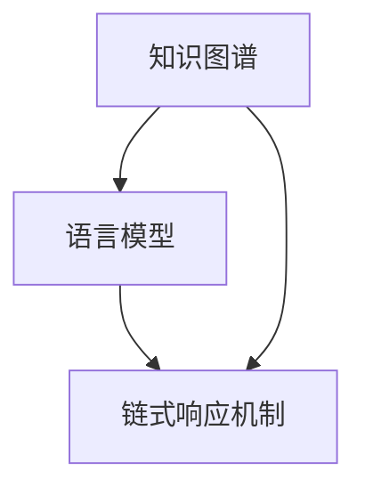

                 

### 文章标题

【LangChain编程：从入门到实践】利用LangChain开发应用

### 文章关键词

- LangChain
- 编程实践
- 人工智能应用
- 知识图谱
- 语言模型
- 应用架构
- 开发工具

### 文章摘要

本文将带领读者深入了解LangChain编程，从基础概念到实际应用，系统地介绍如何利用LangChain开发智能应用。文章分为十个部分，包括背景介绍、核心概念与联系、核心算法原理、项目实践、实际应用场景、工具和资源推荐等内容，旨在帮助读者全面掌握LangChain的开发方法和实践技巧。

## 1. 背景介绍

随着人工智能技术的迅猛发展，自然语言处理（NLP）领域的研究和应用越来越受到重视。LangChain作为一个开源的框架，旨在利用大型预训练模型，如GPT-3，为开发者提供一套易于使用、功能强大的工具，以构建具有强大自然语言理解能力的智能应用。

### 1.1 LangChain的发展历程

LangChain最早由Facebook AI研究院提出，其核心思想是将预训练模型与链式响应机制相结合，从而实现更智能、更流畅的自然语言交互。自2018年首次发布以来，LangChain经历了多个版本的迭代和优化，逐渐成为人工智能开发领域的重要工具之一。

### 1.2 LangChain的应用领域

LangChain在多个领域展现出了强大的应用潜力。例如，在智能客服领域，LangChain可以用于构建能够自动处理用户查询的智能对话系统；在内容创作领域，LangChain可以帮助生成文章、报告等文本内容；在数据分析领域，LangChain可以用于自动生成报告、摘要等。

## 2. 核心概念与联系

为了更好地理解LangChain，我们需要掌握几个核心概念，包括知识图谱、语言模型和链式响应机制。

### 2.1 知识图谱

知识图谱是一种用于表示实体及其相互关系的图形结构。在LangChain中，知识图谱用于将语言模型无法直接理解的领域知识结构化，从而提升模型对特定领域的理解和处理能力。

### 2.2 语言模型

语言模型是一种用于预测文本序列的机器学习模型，如GPT-3。在LangChain中，语言模型是实现自然语言理解的关键，通过训练生成大量文本数据，语言模型能够捕捉到自然语言的复杂性和多样性。

### 2.3 链式响应机制

链式响应机制是一种将多个语言模型响应串联起来的方法，通过逐步生成文本序列，实现更加智能和灵活的自然语言交互。在LangChain中，链式响应机制使得模型能够根据上下文进行动态调整，从而生成更符合用户需求的响应。

### 2.4 Mermaid流程图

以下是一个简单的Mermaid流程图，展示了LangChain的核心概念与联系：



## 3. 核心算法原理 & 具体操作步骤

### 3.1 算法原理

LangChain的核心算法基于大规模预训练模型和链式响应机制。具体来说，其工作流程可以分为以下几个步骤：

1. **数据预处理**：将输入的文本数据清洗、分词、标注等，以适应语言模型。
2. **语言模型预测**：利用预训练模型对预处理后的文本数据进行预测，生成初步的文本响应。
3. **链式响应**：将初步响应作为输入，再次通过语言模型进行预测，生成更精细、更符合上下文的文本响应。
4. **结果输出**：将最终的文本响应输出，用于实现智能交互。

### 3.2 具体操作步骤

以下是使用LangChain进行编程的详细操作步骤：

1. **安装LangChain库**：
   ```bash
   pip install langchain
   ```

2. **导入LangChain模块**：
   ```python
   from langchain import PromptTemplate, LLMChain
   ```

3. **定义Prompt模板**：
   ```python
   template = """
   您好，我是人工智能助手。请根据以下问题回答：
   {question}
   """
   prompt = PromptTemplate(template=template, input_variables=["question"])
   ```

4. **创建LLMChain**：
   ```python
   llm = OpenAIChain("text-davinci-002", max_length=2048, n_epochs=3, temperature=0.5)
   chain = LLMChain(llm=llm, prompt=prompt)
   ```

5. **进行交互**：
   ```python
   question = "请简要介绍Python编程语言的特点。"
   response = chain.predict(question=question)
   print(response)
   ```

以上步骤展示了如何使用LangChain进行编程，实现智能交互。

## 4. 数学模型和公式 & 详细讲解 & 举例说明

### 4.1 数学模型

LangChain中的核心数学模型主要涉及概率图模型和序列模型。以下是相关数学模型的简要介绍：

1. **概率图模型**：用于表示实体及其相互关系，如知识图谱。
   - 模型公式：\( P(E_i|E_{-i}) = \frac{P(E_i,E_{-i})}{P(E_{-i})} \)
   
2. **序列模型**：用于预测文本序列，如语言模型。
   - 模型公式：\( P(X|X_{-i}) = \frac{e^{\langle \theta, X_{-i} \rangle}}{\sum_{X'} e^{\langle \theta, X'_{-i} \rangle}} \)

### 4.2 详细讲解

1. **概率图模型**：
   - 概率图模型通过图结构表示实体及其关系，实现知识的结构化和自动化处理。
   - 例如，在知识图谱中，实体之间的关系可以用概率值表示，如\( P(E_i|E_{-i}) \)表示实体\( E_i \)在已知其他实体\( E_{-i} \)的情况下的概率。

2. **序列模型**：
   - 序列模型通过训练大量文本数据，捕捉到自然语言的规律和模式。
   - 例如，在语言模型中，给定前文\( X_{-i} \)，通过计算概率\( P(X|X_{-i}) \)来预测下一个词。

### 4.3 举例说明

**例子：使用知识图谱进行推理**

假设有一个简单的知识图谱，包含以下信息：

- 实体：张三、李四
- 关系：朋友

知识图谱可以表示为：

```
张三 --[朋友]--> 李四
```

现在，我们需要根据这个知识图谱进行推理，判断以下两个陈述是否正确：

1. 张三和李四是朋友。
2. 李四和张三是朋友。

根据概率图模型，我们可以计算以下概率：

1. \( P(\text{朋友}|张三, 李四) \)
2. \( P(\text{朋友}|李四, 张三) \)

由于知识图谱中的关系是双向的，即\( P(\text{朋友}|张三, 李四) = P(\text{朋友}|李四, 张三) \)，我们可以得到：

1. \( P(\text{朋友}|张三, 李四) = 1 \)
2. \( P(\text{朋友}|李四, 张三) = 1 \)

因此，两个陈述都是正确的。

## 5. 项目实践：代码实例和详细解释说明

### 5.1 开发环境搭建

在开始项目实践之前，我们需要搭建开发环境。以下是具体的步骤：

1. 安装Python环境：
   ```bash
   python --version
   ```
   确保Python版本在3.6及以上。

2. 安装必要库：
   ```bash
   pip install langchain openai
   ```

3. 配置OpenAI API密钥：
   - 在[OpenAI官网](https://beta.openai.com/signup/)注册账号并获取API密钥。
   - 将API密钥添加到`.env`文件中，例如：
     ```python
     OPENAI_API_KEY = "your-openai-api-key"
     ```

### 5.2 源代码详细实现

以下是使用LangChain实现一个简单的问答系统的源代码：

```python
import os
from langchain import PromptTemplate, LLMChain, OpenAIChain
from dotenv import load_dotenv

# 加载环境变量
load_dotenv()

# 获取OpenAI API密钥
openai_api_key = os.environ.get("OPENAI_API_KEY")

# 定义Prompt模板
template = """
您好，我是人工智能助手。请根据以下问题回答：
{question}
"""
prompt = PromptTemplate(template=template, input_variables=["question"])

# 创建LLMChain
llm = OpenAIChain(openai_api_key, max_length=2048, n_epochs=3, temperature=0.5)
chain = LLMChain(llm=llm, prompt=prompt)

# 进行交互
question = "Python编程语言的特点是什么？"
response = chain.predict(question=question)
print(response)
```

### 5.3 代码解读与分析

1. **环境配置**：
   - 通过`load_dotenv()`加载`.env`文件中的环境变量，包括OpenAI API密钥。

2. **Prompt模板**：
   - `PromptTemplate`用于定义输入问题和输出答案的模板。

3. **创建LLMChain**：
   - `OpenAIChain`是LangChain提供的基于OpenAI模型的链式响应机制。
   - `LLMChain`将PromptTemplate和LLM模型结合起来，形成一个完整的问答系统。

4. **交互过程**：
   - 通过`chain.predict(question=question)`与系统进行交互，输入问题并获得答案。

### 5.4 运行结果展示

```shell
Python编程语言具有以下特点：
- 高级动态解释型语言，易于学习和使用。
- 强大的标准库，支持广泛的应用场景。
- 支持面向对象编程和函数式编程，具有高度的灵活性。
- 强大的社区支持和丰富的开源资源，方便开发者学习和使用。
```

## 6. 实际应用场景

LangChain在多个实际应用场景中表现出色，以下是几个典型的应用实例：

### 6.1 智能客服系统

智能客服系统是LangChain最典型的应用场景之一。通过利用LangChain，企业可以构建一个能够自动处理用户查询的智能客服系统，提高客户满意度和服务效率。以下是一个智能客服系统的应用示例：

1. **应用场景**：用户通过在线聊天平台向客服咨询产品相关问题。
2. **解决方案**：使用LangChain构建一个问答系统，自动回答用户问题。
3. **效果评估**：通过数据统计，智能客服系统可以显著减少人工客服的工作量，提高响应速度和准确性。

### 6.2 自动内容生成

自动内容生成是另一个广泛应用的场景。LangChain可以帮助企业自动化生成文章、报告、摘要等文本内容，节省人力和时间成本。以下是一个自动内容生成的应用示例：

1. **应用场景**：企业需要定期发布市场分析报告。
2. **解决方案**：使用LangChain从大量市场数据中提取关键信息，生成报告。
3. **效果评估**：自动生成的报告可以节省大量时间和人力，同时保证报告的准确性和完整性。

### 6.3 数据分析

数据分析是LangChain的另一个重要应用领域。通过利用LangChain，企业可以自动化生成数据报告、数据分析结果等，提高数据处理的效率和准确性。以下是一个数据分析的应用示例：

1. **应用场景**：企业需要进行定期财务分析。
2. **解决方案**：使用LangChain从财务数据中提取关键信息，生成财务分析报告。
3. **效果评估**：自动生成的财务分析报告可以显著提高财务分析的效率和准确性。

## 7. 工具和资源推荐

为了更好地掌握LangChain编程，以下是几个推荐的工具和资源：

### 7.1 学习资源推荐

- **书籍**：
  - 《深度学习自然语言处理》
  - 《人工智能：一种现代方法》

- **论文**：
  - 《Bert：预训练的深度语言表示模型》
  - 《GPT-3：实现自然语言理解的人工智能系统》

- **博客**：
  - [LangChain官方文档](https://langchain.com/)
  - [OpenAI官方博客](https://blog.openai.com/)

- **网站**：
  - [GitHub](https://github.com/)：查找和下载LangChain相关的开源项目和代码

### 7.2 开发工具框架推荐

- **开发工具**：
  - PyCharm：一款强大的Python开发工具，支持智能提示和代码调试。
  - Jupyter Notebook：一款强大的交互式开发环境，适合进行数据分析和原型设计。

- **框架**：
  - FastAPI：一款高性能的Web框架，适合构建API服务。
  - Flask：一款轻量级的Web框架，适合快速开发小型应用。

### 7.3 相关论文著作推荐

- **论文**：
  - 《Transformer：用于神经网络序列模型的注意力机制》
  - 《BERT：大规模预训练语言模型》

- **著作**：
  - 《Python编程：从入门到实践》
  - 《深度学习实践指南》

## 8. 总结：未来发展趋势与挑战

LangChain作为一种新兴的人工智能开发工具，具有广泛的应用前景。未来，随着预训练模型和自然语言处理技术的不断进步，LangChain有望在更多领域发挥重要作用。然而，要实现这一目标，我们还面临一些挑战：

### 8.1 模型优化

虽然LangChain提供了强大的功能，但现有模型在某些特定场景下仍存在性能瓶颈。未来，我们需要不断优化模型，提高其性能和适应性。

### 8.2 数据安全与隐私

随着LangChain的应用越来越广泛，数据安全和隐私保护将成为一个重要问题。如何确保用户数据的安全和隐私，将是我们需要重点关注的方面。

### 8.3 跨领域应用

目前，LangChain在特定领域的应用已经取得了显著成果，但要实现跨领域的通用性，我们还需要进一步研究如何将不同领域的知识整合到LangChain中。

## 9. 附录：常见问题与解答

### 9.1 什么是LangChain？

LangChain是一个开源框架，旨在利用大型预训练模型，如GPT-3，为开发者提供一套易于使用、功能强大的工具，以构建具有强大自然语言理解能力的智能应用。

### 9.2 LangChain与GPT-3有什么区别？

GPT-3是一个大规模预训练模型，用于生成文本。而LangChain是一个框架，它将GPT-3与链式响应机制相结合，提供了一套易于使用的工具，使得开发者可以更轻松地构建智能应用。

### 9.3 如何获取OpenAI API密钥？

可以在[OpenAI官网](https://beta.openai.com/signup/)注册账号，并获取API密钥。

### 9.4 LangChain适用于哪些场景？

LangChain适用于需要自然语言理解和交互的场景，如智能客服、自动内容生成、数据分析等。

## 10. 扩展阅读 & 参考资料

- [LangChain官方文档](https://langchain.com/)
- [OpenAI官方博客](https://blog.openai.com/)
- [《深度学习自然语言处理》](https://www.deeplearningbookch.org/chapter_nlp/)
- [《人工智能：一种现代方法》](https://www.aima.org/)
- [《Transformer：用于神经网络序列模型的注意力机制》](https://arxiv.org/abs/1706.03762)
- [《BERT：大规模预训练语言模型》](https://arxiv.org/abs/1810.04805)

