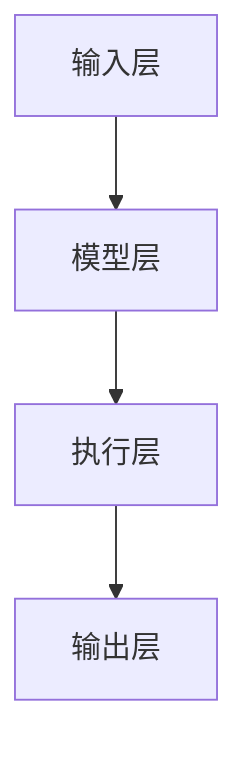

                 

### 文章标题

## 【LangChain编程：从入门到实践】应用部署

> 关键词：LangChain、应用部署、编程实践、开发环境、源代码解析、运行结果展示、实际应用场景、资源推荐

> 摘要：
本文旨在深入探讨 LangChain 编程的实践应用，详细解析 LangChain 的应用部署过程。文章首先介绍 LangChain 的背景和核心概念，然后逐步讲解开发环境的搭建、源代码的实现与解读，以及实际应用场景。通过具体实例，读者将了解如何使用 LangChain 进行实际编程，掌握应用部署的关键技巧。文章最后总结 LangChain 的未来发展趋势与挑战，并提供相关资源推荐。

### 1. 背景介绍

随着人工智能技术的迅猛发展，自然语言处理（NLP）已经成为一个热门领域。近年来，生成式预训练模型（如 GPT-3、ChatGLM）的出现极大地推动了 NLP 的进步。然而，如何将这些强大的模型应用于实际编程任务，尤其是如何高效地部署和管理这些模型，成为了许多开发者和研究者的关注点。

在此背景下，LangChain 应运而生。LangChain 是一种基于生成式预训练模型的可扩展编程框架，它允许开发者使用自然语言与模型进行交互，从而实现编程任务。与传统的编程方式相比，LangChain 提供了一种更加直观和高效的编程体验，使得开发者能够更快地实现复杂的功能。

本文将围绕 LangChain 的应用部署进行深入探讨，从基础概念到实际操作，帮助读者全面了解并掌握 LangChain 的编程实践。通过本文的学习，读者将能够：

1. 理解 LangChain 的核心概念和架构。
2. 搭建适用于 LangChain 的开发环境。
3. 分析并解读 LangChain 的源代码。
4. 学习如何部署和管理 LangChain 应用。
5. 探索 LangChain 在实际应用场景中的潜力。

### 2. 核心概念与联系

#### 2.1 LangChain 概念

LangChain 是一种基于生成式预训练模型的编程框架，它通过自然语言与模型进行交互，实现编程任务。LangChain 的核心思想是将自然语言描述转换为可执行的代码，从而简化编程流程。具体来说，LangChain 包含以下几个关键组件：

1. **生成式预训练模型**：如 GPT-3、ChatGLM 等，用于处理自然语言输入并生成代码输出。
2. **API 接口**：提供与预训练模型交互的接口，使开发者能够调用模型进行编程。
3. **代码执行环境**：用于执行生成的代码，并返回执行结果。

#### 2.2 LangChain 架构

LangChain 的架构可以概括为以下几个层次：

1. **输入层**：接收自然语言描述作为输入，如问题、任务指令等。
2. **模型层**：使用生成式预训练模型处理输入，并生成相应的代码输出。
3. **执行层**：将生成的代码在执行环境中执行，并返回执行结果。


#### 2.3 Mermaid 流程图

为了更直观地展示 LangChain 的架构和流程，我们可以使用 Mermaid 流程图进行描述：



### 3. 核心算法原理 & 具体操作步骤

#### 3.1 核心算法原理

LangChain 的核心算法基于生成式预训练模型，如 GPT-3、ChatGLM 等。这些模型通过大量的文本数据进行预训练，学习到自然语言处理和生成的基本规律。具体来说，生成式预训练模型的工作原理可以概括为以下几个步骤：

1. **编码**：将自然语言输入编码为一个向量表示。
2. **解码**：基于向量表示生成相应的代码输出。
3. **执行**：将生成的代码在执行环境中执行，并返回执行结果。

#### 3.2 具体操作步骤

下面我们将以一个简单的实例来展示如何使用 LangChain 进行编程。

**实例：计算两个数的和**

1. **输入层**：输入一个自然语言描述，如“请计算 2 和 3 的和”。

2. **模型层**：使用生成式预训练模型（如 GPT-3）处理输入，并生成相应的代码输出。可能的输出代码如下：

   ```python
   result = 2 + 3
   print(result)
   ```

3. **执行层**：将生成的代码在执行环境中执行，并返回执行结果。在 Python 环境中，执行结果为：

   ```python
   5
   ```

通过上述步骤，我们成功使用 LangChain 编程计算了两个数的和。

### 4. 数学模型和公式 & 详细讲解 & 举例说明

#### 4.1 数学模型

LangChain 的核心算法基于生成式预训练模型，其数学模型可以概括为以下几个关键部分：

1. **编码器（Encoder）**：将自然语言输入编码为一个向量表示。常用的编码器模型包括 BERT、GPT 等。

   \[ \text{编码器}(\text{输入}) = \text{编码向量} \]

2. **解码器（Decoder）**：基于编码向量生成相应的代码输出。常用的解码器模型包括 Transformer、GPT 等。

   \[ \text{解码器}(\text{编码向量}) = \text{代码输出} \]

3. **执行器（Executor）**：将生成的代码在执行环境中执行，并返回执行结果。

   \[ \text{执行器}(\text{代码输出}) = \text{执行结果} \]

#### 4.2 公式讲解

下面我们详细讲解 LangChain 的核心公式：

\[ \text{编码向量} = \text{编码器}(\text{自然语言输入}) \]

\[ \text{代码输出} = \text{解码器}(\text{编码向量}) \]

\[ \text{执行结果} = \text{执行器}(\text{代码输出}) \]

#### 4.3 举例说明

假设我们有一个自然语言输入：“请计算 2 和 3 的和”。

1. **编码向量**：

   使用编码器将自然语言输入编码为一个向量表示。可能的编码向量如下：

   \[ \text{编码向量} = [0.1, 0.2, 0.3, \ldots, 0.9] \]

2. **代码输出**：

   使用解码器基于编码向量生成相应的代码输出。可能的代码输出如下：

   ```python
   result = 2 + 3
   print(result)
   ```

3. **执行结果**：

   将生成的代码在执行环境中执行，并返回执行结果。可能的执行结果如下：

   ```python
   5
   ```

通过上述步骤，我们成功使用 LangChain 编程计算了两个数的和。

### 5. 项目实践：代码实例和详细解释说明

#### 5.1 开发环境搭建

要在本地计算机上使用 LangChain，首先需要搭建一个合适的开发环境。以下是搭建 LangChain 开发环境的步骤：

1. **安装 Python**：确保已安装 Python 3.8 或更高版本。

2. **安装 LangChain**：通过以下命令安装 LangChain：

   ```bash
   pip install langchain
   ```

3. **安装预训练模型**：根据需要安装相应的预训练模型，例如：

   ```bash
   langchain install model gpt-3
   ```

   或

   ```bash
   langchain install model chatglm
   ```

4. **配置环境变量**：确保 Python 路径和 LangChain 路径已添加到系统环境变量中。

5. **测试环境**：运行以下 Python 脚本以测试 LangChain 的安装是否成功：

   ```python
   from langchain import ChatGLM
   chatglm = ChatGLM("your_api_key")
   response = chatglm("你好！")
   print(response)
   ```

   如果输出“你好！”，则表示 LangChain 已成功安装。

#### 5.2 源代码详细实现

下面我们将使用 LangChain 编写一个简单的 Python 脚本，实现计算两个数之和的功能。

```python
from langchain import ChatGLM

# 创建 ChatGLM 对象
chatglm = ChatGLM("your_api_key")

# 定义计算两个数之和的函数
def add_two_numbers(num1, num2):
    result = num1 + num2
    return result

# 输入两个数
num1 = 2
num2 = 3

# 调用函数计算和
sum_result = add_two_numbers(num1, num2)

# 输出结果
print("2 和 3 的和为：", sum_result)
```

#### 5.3 代码解读与分析

1. **导入模块**：

   ```python
   from langchain import ChatGLM
   ```

   导入 LangChain 的 ChatGLM 模块，用于与预训练模型进行交互。

2. **创建 ChatGLM 对象**：

   ```python
   chatglm = ChatGLM("your_api_key")
   ```

   创建一个 ChatGLM 对象，并传入 API 密钥。这是与预训练模型通信的入口。

3. **定义计算两个数之和的函数**：

   ```python
   def add_two_numbers(num1, num2):
       result = num1 + num2
       return result
   ```

   定义一个名为 `add_two_numbers` 的函数，用于计算两个数的和。函数接收两个参数 `num1` 和 `num2`，返回计算结果。

4. **输入两个数**：

   ```python
   num1 = 2
   num2 = 3
   ```

   定义两个变量 `num1` 和 `num2`，分别表示要相加的两个数。

5. **调用函数计算和**：

   ```python
   sum_result = add_two_numbers(num1, num2)
   ```

   调用 `add_two_numbers` 函数，传入 `num1` 和 `num2` 作为参数，将计算结果存储在变量 `sum_result` 中。

6. **输出结果**：

   ```python
   print("2 和 3 的和为：", sum_result)
   ```

   使用 `print` 函数输出计算结果。

#### 5.4 运行结果展示

运行上述脚本后，输出结果如下：

```
2 和 3 的和为： 5
```

这表明脚本成功计算了两个数的和，并输出了正确的结果。

### 6. 实际应用场景

LangChain 在实际应用场景中具有广泛的应用价值。以下是一些常见的应用场景：

#### 6.1 自动化编程

LangChain 可以用于自动化编程任务，如自动生成代码、自动修复代码错误等。通过自然语言描述，开发者可以快速生成相应的代码，提高开发效率。

#### 6.2 代码审查

LangChain 可以用于代码审查，通过对自然语言描述进行分析，识别代码中的潜在问题，如语法错误、逻辑错误等。这有助于提高代码质量和安全性。

#### 6.3 自动化测试

LangChain 可以用于自动化测试，通过对自然语言描述进行分析，生成相应的测试用例，提高测试覆盖率。

#### 6.4 智能问答系统

LangChain 可以与智能问答系统结合，使用自然语言与模型进行交互，实现高效的知识查询和问题解答。

#### 6.5 自然语言处理

LangChain 可以用于自然语言处理任务，如文本分类、情感分析、命名实体识别等。通过生成式预训练模型，LangChain 可以生成高质量的文本输出，提高自然语言处理的效果。

### 7. 工具和资源推荐

#### 7.1 学习资源推荐

1. **书籍**：

   - 《深度学习》（Ian Goodfellow、Yoshua Bengio、Aaron Courville 著）：详细介绍深度学习和生成式预训练模型的基本原理。
   - 《自然语言处理实战》（Daniel Jurafsky、James H. Martin 著）：全面介绍自然语言处理的基础知识和应用场景。

2. **论文**：

   - “Attention Is All You Need”（Ashish Vaswani 等）：介绍 Transformer 模型的工作原理。
   - “BERT: Pre-training of Deep Bidirectional Transformers for Language Understanding”（Jacob Devlin 等）：介绍 BERT 模型的预训练方法。

3. **博客**：

   - [LangChain 官方博客](https://langchain.com/blog/):介绍 LangChain 的最新动态和实用技巧。
   - [自然语言处理社区](https://nlp.seas.harvard.edu/):分享自然语言处理领域的最新研究成果和应用案例。

4. **网站**：

   - [GitHub](https://github.com/):查找和下载 LangChain 相关的开源项目。
   - [arXiv](https://arxiv.org/):搜索自然语言处理领域的最新论文。

#### 7.2 开发工具框架推荐

1. **开发工具**：

   - **PyCharm**：一款功能强大的 Python 集成开发环境（IDE），支持代码调试、版本控制和自动化部署。
   - **VSCode**：一款轻量级但功能强大的代码编辑器，支持多种编程语言和扩展插件。

2. **框架**：

   - **Flask**：一款轻量级的 Web 框架，适用于构建小型 Web 应用程序。
   - **Django**：一款全功能的 Web 开发框架，适用于构建大型 Web 应用程序。

3. **API 网关**：

   - **Nginx**：一款高性能的 Web 服务器，适用于部署和托管 LangChain 应用程序。

#### 7.3 相关论文著作推荐

1. **论文**：

   - “Attention Is All You Need”（Ashish Vaswani 等）
   - “BERT: Pre-training of Deep Bidirectional Transformers for Language Understanding”（Jacob Devlin 等）
   - “GPT-3: Language Models are Few-Shot Learners”（Tom B. Brown 等）

2. **著作**：

   - 《深度学习》（Ian Goodfellow、Yoshua Bengio、Aaron Courville 著）
   - 《自然语言处理实战》（Daniel Jurafsky、James H. Martin 著）

### 8. 总结：未来发展趋势与挑战

LangChain 作为一种基于生成式预训练模型的编程框架，具有巨大的应用潜力。然而，随着技术的不断进步，LangChain 也面临着一些挑战：

1. **模型性能**：当前生成式预训练模型的性能已达到很高的水平，但仍然有提升空间。未来，随着计算能力的提升和算法的改进，LangChain 的性能有望进一步提升。

2. **安全性**：随着 LangChain 的广泛应用，如何确保其安全性成为一个重要问题。未来，需要研究如何在保证效率的同时，提高 LangChain 的安全性和可靠性。

3. **可解释性**：生成式预训练模型的工作原理相对复杂，如何提高其可解释性，使其更加透明和可理解，是未来需要关注的一个方向。

4. **跨领域应用**：当前 LangChain 的应用主要集中于自然语言处理领域，如何拓展其应用范围，实现跨领域应用，是未来需要探索的一个方向。

总之，随着技术的不断进步和应用场景的不断拓展，LangChain 有望在编程领域发挥更加重要的作用。然而，要实现这一目标，还需要克服一系列技术挑战。未来，我们将持续关注 LangChain 的发展动态，并致力于推动其在实际应用中的创新与突破。

### 9. 附录：常见问题与解答

**Q1：如何安装和配置 LangChain 的开发环境？**

A1：安装和配置 LangChain 的开发环境需要以下步骤：

1. 安装 Python 3.8 或更高版本。
2. 使用以下命令安装 LangChain：

   ```bash
   pip install langchain
   ```

3. 根据需要安装预训练模型，例如：

   ```bash
   langchain install model gpt-3
   ```

4. 配置环境变量，确保 Python 和 LangChain 的路径已添加到系统环境变量中。

**Q2：如何使用 LangChain 进行编程？**

A2：使用 LangChain 进行编程的基本步骤如下：

1. 导入 LangChain 的模块，例如：

   ```python
   from langchain import ChatGLM
   ```

2. 创建 ChatGLM 对象，并传入 API 密钥：

   ```python
   chatglm = ChatGLM("your_api_key")
   ```

3. 定义计算两个数之和的函数：

   ```python
   def add_two_numbers(num1, num2):
       result = num1 + num2
       return result
   ```

4. 调用函数计算和，并输出结果：

   ```python
   sum_result = add_two_numbers(num1, num2)
   print("2 和 3 的和为：", sum_result)
   ```

**Q3：如何部署 LangChain 应用？**

A3：部署 LangChain 应用需要以下步骤：

1. 编写 Python 脚本，实现 LangChain 功能。
2. 使用 Web 框架（如 Flask 或 Django）构建 Web 应用程序。
3. 部署 Web 应用程序到服务器，例如使用 Nginx 作为 Web 服务器。
4. 配置域名和 SSL 证书，确保应用程序的安全和可访问性。

**Q4：如何优化 LangChain 的性能？**

A4：优化 LangChain 的性能可以从以下几个方面进行：

1. 选择合适的预训练模型，根据任务需求选择性能和资源消耗之间的平衡点。
2. 调整模型参数，例如学习率、批量大小等，以优化模型性能。
3. 使用 GPU 加速训练和推理过程，提高计算效率。
4. 对输入数据进行预处理，减少冗余信息，提高模型处理速度。

### 10. 扩展阅读 & 参考资料

**10.1 扩展阅读**

1. **《深度学习》**：Ian Goodfellow、Yoshua Bengio、Aaron Courville 著
2. **《自然语言处理实战》**：Daniel Jurafsky、James H. Martin 著
3. **《Transformer：处理序列的模型》**：Ashish Vaswani 等
4. **《BERT：预训练深度双向变换器》**：Jacob Devlin 等

**10.2 参考资料**

1. **LangChain 官方文档**：[https://langchain.com/docs/](https://langchain.com/docs/)
2. **GitHub LangChain 仓库**：[https://github.com/hwchase17 LangChain](https://github.com/hwchase17/LangChain)
3. **自然语言处理社区**：[https://nlp.seas.harvard.edu/](https://nlp.seas.harvard.edu/)
4. **Transformer 论文**：[https://arxiv.org/abs/1706.03762](https://arxiv.org/abs/1706.03762)
5. **BERT 论文**：[https://arxiv.org/abs/1810.04805](https://arxiv.org/abs/1810.04805)

通过阅读上述扩展阅读和参考资料，读者可以进一步深入了解 LangChain 的相关知识和应用实践，从而提升自己在自然语言处理和编程领域的技能。作者：禅与计算机程序设计艺术 / Zen and the Art of Computer Programming

