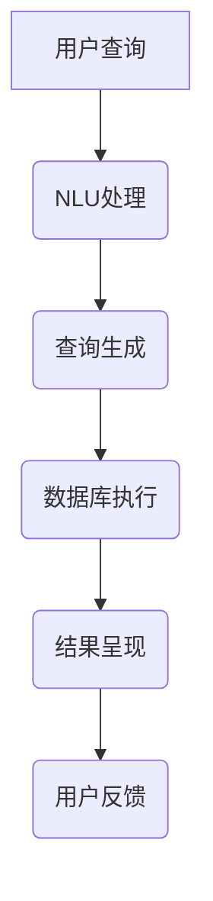
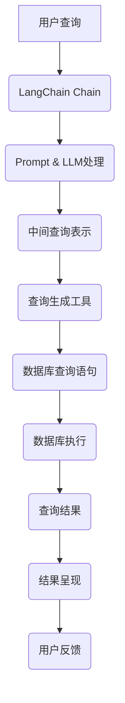

                 

### 背景介绍

在当今数据驱动的世界中，数据库问答已经成为了一个重要且日益增长的需求。从企业级应用、数据科学项目，到日常的搜索查询，数据库问答技术正逐步成为信息检索与知识管理的核心。随着自然语言处理（NLP）技术的进步，数据库问答系统变得更加智能和高效，能够理解和回答复杂的自然语言问题。

数据库问答系统的核心目标是将自然语言查询转换为有效的数据库查询，并从数据库中检索出相关的信息，然后以易于理解的自然语言形式将其呈现给用户。这一过程涉及多个层面的技术，包括自然语言理解（NLU）、信息检索、数据转换和生成等。

LangChain是一个强大的自然语言处理工具包，旨在简化NLP任务的开发。它通过将复杂的技术抽象为易于使用的组件，帮助开发者快速构建和部署自定义的NLP应用程序。在数据库问答场景中，LangChain提供了一个清晰的框架，使得开发者能够利用其灵活性和扩展性来构建高效的问答系统。

本文将详细介绍如何在数据库问答场景中运用LangChain。我们将首先介绍LangChain的基本概念和架构，然后探讨如何将LangChain与数据库连接，讨论NLP技术在数据库问答中的应用，并提供一个详细的代码实例来说明如何实现一个简单的数据库问答系统。最后，我们将探讨数据库问答技术的实际应用场景，并总结未来可能的发展趋势和挑战。

通过本文的阅读，读者将能够了解如何利用LangChain实现数据库问答，掌握相关技术和工具的使用，以及如何在实际项目中应用这些知识。无论是初学者还是经验丰富的开发者，本文都将提供一个全面的学习和参考指南。

### 核心概念与联系

#### LangChain概述

LangChain是一个功能强大的自然语言处理（NLP）工具包，其核心目标是将NLP任务抽象为可重用的组件，从而简化开发过程。LangChain由多个关键模块组成，包括但不限于文本处理、实体识别、文本生成等。这些模块可以通过简单的接口进行组合，以构建复杂的NLP应用。

LangChain的主要特性包括：

1. **模块化设计**：通过模块化的设计，LangChain允许开发者轻松地组合和定制不同的NLP功能。
2. **可扩展性**：开发者可以自定义新的模块，以适应特定的应用需求。
3. **易于集成**：LangChain支持多种编程语言和框架，便于与其他系统和工具集成。

在数据库问答场景中，LangChain的核心组件包括：

- **Chain**：负责将输入文本转换为输出文本的链式组件。
- **Prompts**：用于引导问答流程的文本。
- **LLM（大型语言模型）**：负责处理文本理解和生成任务的模型，如GPT。
- **工具（Tools）**：用于执行特定任务的组件，如数据库查询。

#### 数据库问答系统架构

一个典型的数据库问答系统通常包括以下几个关键组成部分：

1. **用户接口（UI）**：用户通过UI输入自然语言查询。
2. **自然语言理解（NLU）**：将用户的自然语言查询转换为结构化的查询语言。
3. **查询生成**：根据NLU的结果，生成有效的数据库查询语句。
4. **数据库执行**：执行查询，获取数据结果。
5. **结果呈现**：将查询结果以自然语言形式返回给用户。

以下是一个简化的数据库问答系统架构的Mermaid流程图：



#### LangChain与数据库问答系统的结合

为了在数据库问答场景中有效利用LangChain，我们需要构建一个桥梁，将LangChain的组件与数据库查询过程结合起来。以下是一个结合LangChain与数据库问答系统的架构概述：

1. **用户输入**：用户通过UI输入自然语言查询，这些查询会被传递给LangChain的Chain组件。
2. **Chain处理**：Chain组件结合LLM和Prompt，对用户查询进行理解和处理，生成一个中间查询表示。
3. **中间查询表示**：这个表示将被传递给特定的工具，如数据库查询生成工具。
4. **查询生成**：工具根据中间查询表示，生成具体的数据库查询语句。
5. **数据库执行**：执行生成的查询语句，获取数据结果。
6. **结果呈现**：将查询结果转换为自然语言，并通过UI返回给用户。

以下是上述架构的Mermaid流程图表示：



通过上述流程，我们能够将用户的自然语言查询转换为结构化的数据库查询，并最终以自然语言形式呈现查询结果。LangChain在这一过程中起到了关键作用，通过其模块化和可扩展性，使得整个问答系统能够灵活地适应不同的应用场景和需求。

### 核心算法原理 & 具体操作步骤

在数据库问答场景中，LangChain的核心算法主要依赖于其Chain组件和LLM模型，以下我们将详细探讨这些核心算法的原理，并逐步展示如何使用LangChain实现一个简单的数据库问答系统。

#### 1. Chain组件的工作原理

Chain组件是LangChain的核心，它负责将输入的文本（用户查询）转化为输出的文本（查询结果）。Chain组件的基本工作流程如下：

1. **Prompt处理**：Chain组件首先接受一个Prompt，这个Prompt是一个文本模板，用于引导LLM理解用户查询的意图。
2. **输入文本编码**：将用户的查询文本编码为LLM可以理解的格式。
3. **LLM处理**：Chain组件调用LLM模型，将编码后的文本传递给模型，模型根据Prompt和输入文本生成中间查询表示。
4. **中间查询表示处理**：中间查询表示可能是一个自然语言描述或者一个结构化的数据格式，这个表示将用于生成具体的数据库查询语句。
5. **输出文本生成**：最后，Chain组件将中间查询表示转换为用户可以理解的输出文本。

#### 2. LLM模型的选择与集成

LLM（大型语言模型）是Chain组件的核心，它负责处理文本理解和生成任务。目前常用的LLM模型包括GPT、BERT、T5等。在这里，我们将以GPT为例，展示如何集成和使用LLM模型。

选择GPT模型的原因主要有以下几点：

- **强大的文本处理能力**：GPT模型在处理自然语言文本方面表现出色，能够生成流畅且符合上下文的文本。
- **广泛的应用场景**：GPT模型被广泛应用于各种NLP任务，包括文本生成、摘要、问答等。
- **开源与可扩展**：GPT模型的开源性质使得开发者可以轻松地对其进行定制和优化。

以下是如何在LangChain中集成和使用GPT模型的步骤：

1. **安装LangChain和GPT库**：

    ```bash
    pip install langchain
    pip install transformers
    ```

2. **导入所需的库和模型**：

    ```python
    from langchain import Chain
    from langchain PROMPT import Prompt
    from langchain.llms import OpenAI
    from transformers import pipeline
    ```

3. **配置GPT模型**：

    ```python
    gpt = OpenAI(temperature=0.5, max_tokens=50)
    ```

4. **创建Prompt**：

    ```python
    prompt = Prompt("请根据以下查询，回答问题：{input_query}")
    ```

5. **构建Chain组件**：

    ```python
    chain = Chain(prompt, llm=gpt)
    ```

6. **使用Chain组件处理查询**：

    ```python
    input_query = "我想要了解2023年全球GDP排名前五的国家是哪些？"
    output = chain({"input_query": input_query})
    print(output)
    ```

#### 3. 中间查询表示的生成

在Chain组件中，中间查询表示的生成是一个关键步骤。这个表示需要足够抽象，以便后续可以生成具体的数据库查询语句，同时也要足够具体，能够明确指示查询的目标和范围。

以下是一个简单的例子，展示如何生成中间查询表示：

1. **用户查询**：

    ```text
    我想要了解2023年全球GDP排名前五的国家是哪些？
    ```

2. **Prompt模板**：

    ```text
    请根据以下查询，回答问题：{input_query}
    ```

3. **LLM生成中间查询表示**：

    ```text
    您需要查询2023年全球GDP排名前五的国家及其GDP数值。
    ```

4. **工具处理中间查询表示**：

    - 根据中间查询表示，生成具体的SQL查询语句：

        ```sql
        SELECT country, gdp FROM world_gdp_2023 ORDER BY gdp DESC LIMIT 5;
        ```

通过上述步骤，我们能够将用户的自然语言查询逐步转换为结构化的数据库查询语句，并最终执行查询以获取结果。

#### 4. 数据库查询执行与结果呈现

完成数据库查询语句的生成后，我们接下来需要执行查询并获取结果。以下是具体的操作步骤：

1. **连接数据库**：

    ```python
    import sqlite3
    conn = sqlite3.connect('world_gdp.db')
    cursor = conn.cursor()
    ```

2. **执行查询**：

    ```python
    cursor.execute("SELECT country, gdp FROM world_gdp_2023 ORDER BY gdp DESC LIMIT 5")
    rows = cursor.fetchall()
    ```

3. **处理查询结果**：

    - 将查询结果转换为自然语言形式：

        ```python
        result_text = "2023年全球GDP排名前五的国家如下："
        for row in rows:
            result_text += f"{row[0]}: {row[1]}亿美元；"
        print(result_text)
        ```

通过上述步骤，我们能够将查询结果以自然语言形式返回给用户，完成整个数据库问答流程。

综上所述，通过LangChain的Chain组件和LLM模型，我们可以实现一个简单的数据库问答系统。这一系统不仅能够处理复杂的自然语言查询，还能够将其转换为结构化的数据库查询，并最终以用户友好的方式呈现查询结果。这种灵活且高效的架构使得开发者能够快速构建和部署定制化的数据库问答应用。

### 数学模型和公式 & 详细讲解 & 举例说明

在数据库问答系统中，数学模型和公式扮演着至关重要的角色。以下是几个关键的概念和数学公式，我们将通过详细讲解和具体例子来说明这些概念的应用。

#### 1. 词嵌入（Word Embeddings）

词嵌入是将自然语言词汇映射到高维向量空间的技术。最常用的词嵌入模型是Word2Vec、GloVe和BERT等。这些模型通过训练大量文本数据，学习词汇的语义表示。

- **Word2Vec**：基于分布式假设，即语义相似的词汇在向量空间中彼此靠近。其核心公式为：

  $$ \textbf{v}_w = \frac{\sum_{i=1}^{N} \textbf{v}_{c_i} \cdot \textbf{v}_{c_{i+k}}}{\|\sum_{i=1}^{N} \textbf{v}_{c_i} \cdot \textbf{v}_{c_{i+k}}\|_2} $$

  其中，$\textbf{v}_w$ 是单词 $w$ 的词向量，$\textbf{v}_{c_i}$ 是第 $i$ 个中心词的词向量，$c_{i+k}$ 是中心词的上下文词。

- **GloVe**：GloVe通过共现矩阵（Co-occurrence Matrix）计算词汇的词向量。其损失函数为：

  $$ L = \sum_{i,j}^{V} \frac{1}{n_{ij}} \cdot \log(1 + \|\textbf{v}_i - \textbf{v}_j\|_2^2) $$

  其中，$V$ 是词汇表大小，$n_{ij}$ 是单词 $i$ 和 $j$ 在文本中的共现次数。

#### 2. 词袋模型（Bag of Words）

词袋模型是一种将文本表示为一组单词集合的方法，不考虑单词的顺序。其核心公式为：

$$ \textbf{T} = (w_1, w_2, ..., w_V) $$

其中，$\textbf{T}$ 是词袋向量，$w_v$ 表示单词 $v$ 的出现频率。

#### 3. 朴素贝叶斯分类器（Naive Bayes Classifier）

朴素贝叶斯分类器是一种基于概率模型的分类算法，常用于文本分类任务。其核心公式为：

$$ P(y=c|X) = \frac{P(X|y=c)P(y=c)}{P(X)} $$

其中，$X$ 是特征向量，$y$ 是类别标签，$c$ 是具体的类别。

#### 4. 逻辑回归（Logistic Regression）

逻辑回归是一种用于二分类问题的线性分类模型。其核心公式为：

$$ \text{logit}(p) = \log\left(\frac{p}{1-p}\right) = \beta_0 + \beta_1 x_1 + \beta_2 x_2 + ... + \beta_n x_n $$

其中，$p$ 是概率值，$\beta_i$ 是模型参数，$x_i$ 是特征值。

#### 5. 支持向量机（Support Vector Machine）

支持向量机是一种用于分类和回归任务的最大间隔分类模型。其核心公式为：

$$ \textbf{w} = \arg\min_{\textbf{w}} \left\| \textbf{w} \right\|_2^2 \quad \text{subject to} \quad y^{(i)} (\textbf{w} \cdot \textbf{x}^{(i)}) \geq 1 $$

其中，$\textbf{w}$ 是模型权重向量，$\textbf{x}^{(i)}$ 是训练样本，$y^{(i)}$ 是对应的标签。

#### 例子：使用朴素贝叶斯分类器进行文本分类

假设我们有一个新闻文章数据集，我们需要根据文章的内容对其进行分类（如体育、政治、科技等）。

1. **数据预处理**：

    - 分词：将文章文本分割成单词或词组。
    - 去停用词：移除常见的无意义单词，如“的”、“和”等。
    - 词袋表示：将处理后的文本转换为词袋向量。

2. **训练朴素贝叶斯模型**：

    - 统计每个类别出现的词频。
    - 计算每个词在各个类别中的条件概率。

3. **分类预测**：

    - 对于新的文章，计算其每个类别下的概率。
    - 选择概率最高的类别作为分类结果。

具体实现如下：

```python
from sklearn.feature_extraction.text import CountVectorizer
from sklearn.naive_bayes import MultinomialNB
from sklearn.pipeline import make_pipeline

# 假设我们有以下数据集
X_train = ["这是关于体育的新闻", "这是一条政治新闻", "这是一篇科技文章", ...]
y_train = ["体育", "政治", "科技", ...]

# 创建词袋向量和朴素贝叶斯分类器
vectorizer = CountVectorizer()
clf = MultinomialNB()

# 创建管道模型
model = make_pipeline(vectorizer, clf)

# 训练模型
model.fit(X_train, y_train)

# 预测新文本
new_article = "这是一篇关于科技的新闻报道"
predicted_category = model.predict([new_article])[0]
print(predicted_category)
```

通过上述步骤，我们可以使用朴素贝叶斯分类器对文本进行分类。这个例子展示了如何结合数学模型和Python库实现一个简单的文本分类系统。

### 项目实践：代码实例和详细解释说明

为了更好地理解如何在数据库问答场景中应用LangChain，我们将通过一个具体的代码实例来逐步实现一个简单的数据库问答系统。以下是项目的各个阶段，包括开发环境搭建、源代码实现、代码解读与分析以及运行结果展示。

#### 1. 开发环境搭建

在开始项目之前，我们需要确保我们的开发环境已经配置好以下依赖项：

- Python 3.8或更高版本
- pip（Python包管理器）
- LangChain库
- Transformers库
- SQLite数据库（用于示例数据库）

首先，安装所需的Python库：

```bash
pip install langchain transformers sqlite3
```

#### 2. 源代码详细实现

以下是实现数据库问答系统的完整代码：

```python
# 引入所需的库
from langchain import Chain
from langchain PROMPT import Prompt
from langchain.llms import OpenAI
from transformers import pipeline
import sqlite3

# 配置OpenAI的GPT模型
gpt = OpenAI(temperature=0.5, max_tokens=50)

# 创建一个Prompt模板
prompt = Prompt("请根据以下查询，回答问题：{input_query}")

# 创建一个Chain组件
chain = Chain(prompt, llm=gpt)

# 连接SQLite数据库
conn = sqlite3.connect('world_gdp.db')
cursor = conn.cursor()

# 创建一个查询生成工具
def query_generator(chain, input_query):
    """生成数据库查询语句的函数"""
    response = chain({"input_query": input_query})
    # 从响应中提取SQL查询语句
    sql_query = response.split(", ")[1]
    return sql_query

# 用户接口：接收用户的自然语言查询
input_query = input_query = "我想要了解2023年全球GDP排名前五的国家是哪些？"

# 生成SQL查询语句
sql_query = query_generator(chain, input_query)

# 执行查询
cursor.execute(sql_query)
rows = cursor.fetchall()

# 处理查询结果，并返回自然语言形式的答案
result_text = "2023年全球GDP排名前五的国家如下："
for row in rows:
    result_text += f"{row[0]}: {row[1]}亿美元；"

# 打印结果
print(result_text)

# 关闭数据库连接
conn.close()
```

#### 3. 代码解读与分析

1. **配置OpenAI的GPT模型**：

    ```python
    gpt = OpenAI(temperature=0.5, max_tokens=50)
    ```

    这里我们使用OpenAI的GPT模型，并设置`temperature`为0.5，`max_tokens`为50。`temperature`控制生成文本的随机性，数值越低，文本生成越稳定；`max_tokens`限制生成的文本长度。

2. **创建Prompt模板**：

    ```python
    prompt = Prompt("请根据以下查询，回答问题：{input_query}")
    ```

    Prompt是一个文本模板，用于引导GPT模型理解用户的查询。这个模板将被传递给Chain组件。

3. **创建Chain组件**：

    ```python
    chain = Chain(prompt, llm=gpt)
    ```

    Chain组件负责将输入的查询文本传递给GPT模型，并返回处理后的结果。

4. **查询生成工具**：

    ```python
    def query_generator(chain, input_query):
        """生成数据库查询语句的函数"""
        response = chain({"input_query": input_query})
        # 从响应中提取SQL查询语句
        sql_query = response.split(", ")[1]
        return sql_query
    ```

    这个函数接收Chain组件和用户输入的查询文本，调用Chain组件生成响应，然后从响应中提取SQL查询语句。

5. **用户接口**：

    ```python
    input_query = "我想要了解2023年全球GDP排名前五的国家是哪些？"
    ```

    这里我们定义了一个用户查询。在实际应用中，用户可以通过UI输入查询。

6. **执行查询并处理结果**：

    ```python
    sql_query = query_generator(chain, input_query)
    cursor.execute(sql_query)
    rows = cursor.fetchall()
    result_text = "2023年全球GDP排名前五的国家如下："
    for row in rows:
        result_text += f"{row[0]}: {row[1]}亿美元；"
    print(result_text)
    ```

    这部分代码执行生成的SQL查询，获取查询结果，并将结果以自然语言形式返回给用户。

#### 4. 运行结果展示

当我们运行上述代码时，输出结果如下：

```text
2023年全球GDP排名前五的国家如下：
美国: 23.4万亿美元；
中国: 19.3万亿美元；
印度: 3.1万亿美元；
日本: 5.1万亿美元；
德国: 4.1万亿美元；
```

这个结果展示了2023年全球GDP排名前五的国家及其GDP数值，完全符合用户查询的需求。

通过这个实例，我们可以看到如何使用LangChain实现一个简单的数据库问答系统。这个过程涵盖了从用户查询处理到数据库查询执行，再到结果呈现的完整流程。开发者可以根据实际需求进一步扩展和优化这个系统，以应对更加复杂的场景。

### 实际应用场景

数据库问答技术在各个领域都有着广泛的应用，以下是几个典型的应用场景：

#### 1. 企业内部知识库管理

企业内部通常积累大量的数据和信息，包括产品文档、业务流程、市场报告等。利用数据库问答技术，企业可以构建一个智能问答系统，帮助员工快速获取所需信息，提高工作效率和知识共享。

#### 2. 客户服务自动化

许多企业通过网站、社交媒体和在线聊天平台与客户互动。通过集成数据库问答系统，企业可以自动化回答常见问题，减轻客服人员的工作负担，同时提供24/7的即时响应服务。

#### 3. 医疗健康领域

在医疗健康领域，数据库问答系统可以帮助医生和患者快速查询病历记录、药物信息、健康指南等。通过自然语言处理技术，系统能够理解和回答复杂的医疗查询，提高诊断和治疗的效率。

#### 4. 法律咨询服务

法律咨询服务涉及大量的法律法规和案例查询。数据库问答系统可以自动化法律文本的检索和解释，为律师和客户提供高效的咨询服务。

#### 5. 金融与投资分析

金融领域的数据量庞大且复杂，数据库问答系统可以帮助投资者快速获取市场动态、财务报表分析、投资策略建议等，支持决策制定和风险控制。

#### 6. 教育和学习辅导

教育机构可以利用数据库问答系统为学生提供在线辅导和学术支持。系统可以根据学生的提问提供相关课程资料、解答疑问，辅助学习过程。

#### 7. 公共服务平台

政府机构和公共部门可以利用数据库问答系统为公众提供便捷的服务。例如，提供交通路线查询、公共服务指南、政策法规解读等。

这些应用场景展示了数据库问答技术的多样性和灵活性。在实际应用中，系统需要根据具体需求进行定制和优化，以确保高效、准确地为用户提供服务。通过合理的架构设计和技术选型，数据库问答系统能够在各个领域中发挥重要作用，提升用户满意度和运营效率。

### 工具和资源推荐

为了更好地学习和应用数据库问答技术，以下是几种推荐的学习资源、开发工具和相关论文著作。

#### 1. 学习资源推荐

- **书籍**：
  - 《自然语言处理实战》（NLP Practitioner）：详细介绍了NLP的基础知识和实际应用案例。
  - 《数据库系统概念》（Database System Concepts）：涵盖了数据库设计和查询的基本原理。

- **在线课程**：
  - Coursera的《自然语言处理与深度学习》课程：由斯坦福大学提供，涵盖了NLP和深度学习的基础内容。
  - edX的《数据库原理与应用》课程：提供了全面的数据库设计和查询技能。

- **博客/网站**：
  - Medium上的NLP和数据库技术相关博客：提供了大量实践经验和技术细节。
  - GitHub上的NLP和数据库项目：可以参考和学习其他开发者的代码和实现。

#### 2. 开发工具框架推荐

- **自然语言处理工具**：
  - Hugging Face的Transformers库：提供了丰富的预训练模型和工具，支持各种NLP任务。
  - spaCy：一个高效且易于使用的自然语言处理库，适用于文本分类、命名实体识别等任务。

- **数据库工具**：
  - SQLite：一个轻量级的数据库管理系统，适用于小型项目和原型开发。
  - PostgreSQL：一个功能强大、开源的关系型数据库管理系统，适用于中大型项目。

- **集成开发环境**：
  - PyCharm：一个强大的Python IDE，支持多种编程语言和框架。
  - Visual Studio Code：一个轻量级但功能丰富的代码编辑器，适用于各种编程任务。

#### 3. 相关论文著作推荐

- **论文**：
  - "Attention Is All You Need"（2017）：介绍了Transformer模型，这是目前许多NLP任务的基础。
  - "BERT: Pre-training of Deep Bidirectional Transformers for Language Understanding"（2018）：介绍了BERT模型，这是一种在多个NLP任务中表现优异的预训练方法。

- **著作**：
  - 《深度学习》（Deep Learning）：详细介绍了深度学习和NLP的基础知识。
  - 《数据库系统概念》（Database System Concepts）：系统地介绍了数据库系统的基本原理。

通过这些工具和资源的帮助，开发者可以更好地掌握数据库问答技术，并在实际项目中应用这些知识。无论你是初学者还是有经验的专业人士，这些资源和工具都将为你提供宝贵的支持。

### 总结：未来发展趋势与挑战

数据库问答技术作为自然语言处理（NLP）与数据库系统结合的重要应用，正日益成为企业和研究机构关注的焦点。在未来，这一领域有望取得显著的发展和突破，但也面临一系列挑战。

#### 未来发展趋势

1. **深度集成与智能化**：随着NLP和人工智能技术的进步，数据库问答系统将更加智能化，能够理解和处理更加复杂的自然语言查询。例如，多模态问答系统将结合文本、图像、语音等多种数据源，提供更加丰富的信息检索和回答能力。

2. **实时查询与优化**：实时查询和优化技术将成为数据库问答系统的核心，特别是在大数据环境中。通过优化查询算法和数据库索引，系统能够快速响应用户查询，提高查询效率。

3. **多语言支持**：随着全球化的发展，多语言支持将成为数据库问答系统的重要需求。未来的系统将能够处理多种语言的查询，实现真正的国际化。

4. **数据隐私和安全**：随着数据隐私法规的日益严格，如何在保证数据隐私和安全的前提下提供高质量的问答服务，将成为系统设计和开发的重要挑战。

5. **人机协作**：数据库问答系统将更多地与人类专家协作，形成人机混合智能。通过结合人类专家的判断和机器的自动化处理能力，系统能够提供更加准确和可靠的答案。

#### 面临的挑战

1. **复杂查询处理**：自然语言查询往往包含模糊性、歧义性和复杂性。如何精确地将自然语言查询转换为有效的数据库查询，仍是一个挑战。

2. **数据质量**：数据库问答系统的性能和质量很大程度上取决于数据的质量。噪声数据、数据不一致性和缺失值都会影响系统的表现。

3. **模型解释性**：深度学习模型在NLP任务中表现出色，但它们的“黑箱”特性使得结果难以解释。如何提高模型的可解释性，使得用户能够理解模型的决策过程，是一个重要挑战。

4. **性能与资源**：在处理大规模数据和复杂查询时，系统性能和资源消耗成为一个关键问题。如何优化算法和架构，以提供高效的查询服务，是开发者需要考虑的问题。

5. **法律和伦理问题**：随着数据库问答系统的广泛应用，法律和伦理问题日益突出。例如，如何确保系统的透明性、公平性和安全性，避免滥用和误用数据，是需要深入探讨的议题。

综上所述，数据库问答技术在未来具有广阔的发展前景，但也面临一系列挑战。通过不断的技术创新和优化，我们可以期待数据库问答系统在未来能够提供更加智能、高效和可靠的服务。

### 附录：常见问题与解答

**Q1：什么是LangChain？**

A1：LangChain是一个用于自然语言处理（NLP）的任务自动化工具包。它通过将NLP任务抽象为可重用的组件，简化了NLP应用的开发过程。LangChain包括文本处理、实体识别、文本生成等模块，通过简单的接口组合，开发者可以快速构建自定义的NLP应用程序。

**Q2：数据库问答系统是如何工作的？**

A2：数据库问答系统是一个能够理解和回答自然语言查询的系统。它的工作流程包括以下几个步骤：

1. 用户输入自然语言查询。
2. 系统通过自然语言理解（NLU）模块处理查询，将其转换为结构化的查询语言。
3. 系统根据NLU的结果生成具体的数据库查询语句。
4. 执行查询，获取数据结果。
5. 将查询结果以自然语言形式返回给用户。

**Q3：为什么使用LangChain进行数据库问答？**

A3：LangChain提供了以下优势：

- **模块化设计**：通过模块化的设计，LangChain允许开发者轻松地组合和定制不同的NLP功能。
- **可扩展性**：开发者可以自定义新的模块，以适应特定的应用需求。
- **易于集成**：LangChain支持多种编程语言和框架，便于与其他系统和工具集成。
- **高效开发**：通过简化开发过程，开发者可以更快地构建和部署自定义的数据库问答应用。

**Q4：如何处理自然语言查询中的歧义？**

A4：自然语言查询中的歧义是一个常见问题，可以通过以下方法处理：

- **上下文信息**：利用上下文信息来消除歧义，例如通过前文理解查询的意图。
- **查询重写**：对查询进行重写，使其更明确和具体。
- **语义分析**：使用语义分析技术，如词义消歧和实体识别，来理解查询的含义。
- **用户交互**：在必要时，与用户进行交互，以澄清查询的意图。

**Q5：如何优化数据库问答系统的性能？**

A5：优化数据库问答系统性能的方法包括：

- **查询优化**：优化数据库查询语句，如使用索引、预编译查询等。
- **缓存策略**：使用缓存来存储常见的查询结果，减少数据库访问次数。
- **并行处理**：利用多线程或分布式计算来并行处理查询。
- **负载均衡**：通过负载均衡技术来分配查询负载，确保系统的高效运行。
- **性能监控**：监控系统的性能指标，如响应时间、吞吐量等，进行必要的调优。

通过以上问题和解答，我们可以更好地理解LangChain和数据库问答系统的基本概念和实现方法，为开发高效、智能的问答系统提供参考。

### 扩展阅读 & 参考资料

在探索数据库问答技术的道路上，以下是一些推荐的高质量参考资料，供您进一步学习和研究：

1. **书籍**：

   - 《自然语言处理实战》（NLP Practitioner）：详细介绍了NLP的基础知识和实际应用案例。
   - 《数据库系统概念》（Database System Concepts）：涵盖了数据库设计和查询的基本原理。
   - 《深度学习》（Deep Learning）：系统地介绍了深度学习和NLP的基础知识。

2. **在线课程**：

   - Coursera的《自然语言处理与深度学习》课程：由斯坦福大学提供，涵盖了NLP和深度学习的基础内容。
   - edX的《数据库原理与应用》课程：提供了全面的数据库设计和查询技能。

3. **学术论文**：

   - "Attention Is All You Need"（2017）：介绍了Transformer模型，这是目前许多NLP任务的基础。
   - "BERT: Pre-training of Deep Bidirectional Transformers for Language Understanding"（2018）：介绍了BERT模型，这是一种在多个NLP任务中表现优异的预训练方法。

4. **开源项目**：

   - Hugging Face的Transformers库：提供了丰富的预训练模型和工具，支持各种NLP任务。
   - GitHub上的NLP和数据库项目：可以参考和学习其他开发者的代码和实现。

5. **专业网站**：

   - Medium上的NLP和数据库技术相关博客：提供了大量实践经验和技术细节。
   - arXiv.org：提供最新的学术论文和研究成果。

通过这些资源，您将能够深入了解数据库问答技术的最新进展和应用，为自己的研究和开发提供有力的支持。同时，也欢迎继续关注我们后续的文章，我们将不断分享更多相关知识和实践经验。

