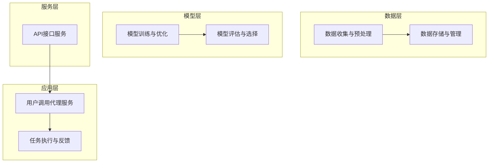
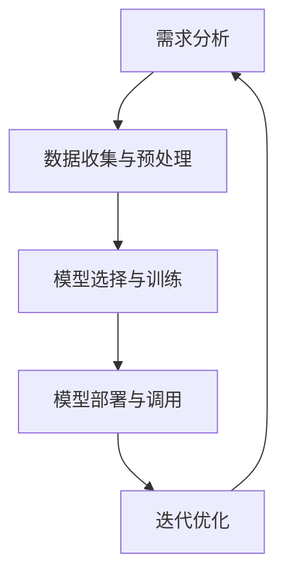

                 

### 1. 背景介绍

近年来，人工智能（AI）技术迅猛发展，尤其是大型预训练模型，如GPT-3、BERT等，为自然语言处理（NLP）和计算机视觉（CV）等领域带来了显著的进步。随着技术的不断成熟，AI开始逐渐从实验室走向实际应用，成为各个行业创新和效率提升的重要驱动力。在此背景下，Agent即服务（Agent as a Service, AaaS）的概念应运而生，成为AI应用开发中的一个热点。

Agent是一种具有自主决策能力的智能实体，它可以在特定的环境和任务中执行特定功能。传统的Agent通常依赖于预定义的规则和模型进行决策，而随着AI技术的发展，基于大数据和深度学习的大型预训练模型使得Agent具备了更高的智能水平和更广泛的适用性。Agent即服务则是指将这种具备自主决策能力的智能实体以服务的形式提供给用户，用户无需自行开发和维护，即可快速获取和使用Agent服务。

本文将围绕Agent即服务进行深入探讨，首先介绍Agent的基本概念和分类，然后分析其核心原理和技术架构，接着介绍具体的应用场景，最后对相关的开发工具和资源进行推荐。通过本文的阅读，读者将全面了解Agent即服务的基本概念、技术原理和实际应用，为未来在AI领域的深入研究和应用提供参考。

### 2. 核心概念与联系

#### 2.1 定义

Agent即服务（Agent as a Service, AaaS）是一种将智能代理以服务的形式提供给用户的技术模式。这里的“Agent”指的是具备自主决策和行动能力的智能实体，它可以模拟人类智能进行问题求解、决策和执行任务。而“AaaS”则是指通过云平台或其他服务形式，使这些智能代理可以被广泛地访问和使用。

#### 2.2 分类

根据Agent的智能水平和功能，可以将AaaS中的Agent分为以下几类：

1. **规则基础Agent**：这类Agent基于预定义的规则进行决策，适用于结构化数据和小规模任务场景。
2. **数据驱动Agent**：这类Agent通过机器学习算法从大量数据中学习规律，进行智能决策，适用于复杂、非结构化的任务场景。
3. **混合型Agent**：这类Agent结合了规则和数据驱动的方法，能够在不同场景下灵活切换，实现更高的智能水平。

#### 2.3 原理

AaaS的核心原理是基于云计算和AI技术，通过构建智能代理模型，将其部署在云平台，用户可以通过API或其他方式访问和调用这些代理服务。具体原理如下：

1. **数据收集与预处理**：从不同渠道收集数据，进行清洗、整合和标注，为训练代理模型提供高质量的数据集。
2. **模型训练与优化**：利用深度学习等技术，对收集到的数据集进行训练，优化代理模型，使其具备较强的决策能力。
3. **模型部署与调用**：将训练好的代理模型部署在云平台上，通过API接口提供服务，用户可以调用这些服务，实现特定任务。

#### 2.4 架构

AaaS的架构可以分为以下几个主要部分：

1. **数据层**：负责数据的收集、存储和管理，确保数据的完整性和高质量。
2. **模型层**：包含各种智能代理模型，通过训练和优化，实现不同任务的智能决策。
3. **服务层**：提供API接口，将模型层的代理服务暴露给用户，实现代理的调用和使用。
4. **应用层**：用户通过应用层调用代理服务，实现业务逻辑的处理和任务的执行。

下面是一个简化的Mermaid流程图，描述了AaaS的架构和主要流程：



通过上述架构，AaaS实现了智能代理的从构建到调用的全流程管理，为用户提供了便捷、高效的AI服务。

### 3. 核心算法原理 & 具体操作步骤

#### 3.1 算法原理

在AaaS中，核心算法通常基于深度学习技术，特别是基于大型预训练模型的自适应学习算法。这些算法能够从大量数据中自动提取特征，并进行复杂的模式识别和决策。以下是一些常用的算法原理：

1. **深度神经网络（DNN）**：DNN是一种多层前馈神经网络，通过逐层提取特征，实现复杂任务的建模。其基本结构包括输入层、隐藏层和输出层，每层之间通过权重矩阵进行连接。

2. **循环神经网络（RNN）**：RNN是一种处理序列数据的神经网络，其特点是能够记住前面的输入信息。在AaaS中，RNN常用于自然语言处理任务，如聊天机器人、文本生成等。

3. **卷积神经网络（CNN）**：CNN是一种主要用于图像处理任务的神经网络，通过卷积操作提取图像特征，实现目标检测、图像分类等任务。

4. **生成对抗网络（GAN）**：GAN是一种通过两个神经网络（生成器和判别器）相互竞争的模型，能够生成高质量的数据样本，常用于图像生成、数据增强等任务。

#### 3.2 具体操作步骤

以下是一个典型的AaaS算法开发流程：

1. **需求分析**：
   - 明确任务目标和需求，确定所需处理的业务场景和数据类型。
   - 分析数据规模、质量和多样性，为后续数据预处理提供依据。

2. **数据收集与预处理**：
   - 从各种渠道收集数据，包括公开数据集、企业内部数据等。
   - 进行数据清洗，去除噪声和缺失值，保证数据质量。
   - 对数据进行标注和分类，为训练模型提供标签信息。

3. **模型选择与训练**：
   - 根据任务需求选择合适的模型，如DNN、RNN、CNN等。
   - 利用收集到的数据集进行模型训练，通过调整模型参数，使模型在训练数据上达到较高的准确率。
   - 对训练好的模型进行评估，选择性能最优的模型。

4. **模型部署与调用**：
   - 将训练好的模型部署在云服务器或边缘设备上，通过API接口提供服务。
   - 用户可以通过调用API接口，获取模型的服务，实现特定任务的智能决策。

5. **迭代优化**：
   - 根据用户反馈和任务执行效果，对模型进行迭代优化，提高模型性能和适用性。
   - 定期更新模型，以适应不断变化的数据和应用需求。

下面是一个简化的算法操作流程图，描述了AaaS的核心算法步骤：



通过上述操作步骤，AaaS能够实现从数据收集、模型训练到部署调用的全流程管理，为用户提供了高效、便捷的智能代理服务。

### 4. 数学模型和公式 & 详细讲解 & 举例说明

在Agent即服务（AaaS）的开发过程中，数学模型和公式扮演着至关重要的角色。这些模型和公式不仅帮助我们理解和设计算法，还提供了量化性能和优化策略的依据。以下是一些关键的数学模型和公式的详细讲解以及实际应用示例。

#### 4.1 深度学习中的激活函数

激活函数是深度神经网络（DNN）中的核心组件，用于引入非线性特性，使神经网络能够拟合复杂的函数关系。以下是一些常用的激活函数及其数学表示：

1. **sigmoid 函数**：
   \[
   \sigma(x) = \frac{1}{1 + e^{-x}}
   \]
   sigmoid函数的输出范围在0到1之间，常用于二分类问题。

2. **ReLU函数**：
   \[
   \text{ReLU}(x) = \max(0, x)
   \]
   ReLU（Rectified Linear Unit）函数在0以上直接输出x，而在0以下输出0，具有简单的形式和非线性特性。

3. **tanh函数**：
   \[
   \text{tanh}(x) = \frac{e^x - e^{-x}}{e^x + e^{-x}}
   \]
   tanh函数类似于sigmoid函数，但输出范围在-1到1之间，常用于多维数据。

#### 4.2 优化算法

优化算法是训练深度神经网络的关键步骤，以下介绍几种常用的优化算法：

1. **梯度下降（Gradient Descent）**：
   \[
   \theta_{t+1} = \theta_t - \alpha \cdot \nabla_{\theta} J(\theta)
   \]
   其中，\(\theta\)表示模型参数，\(\alpha\)是学习率，\(J(\theta)\)是损失函数。梯度下降算法通过不断更新参数，使损失函数值最小化。

2. **随机梯度下降（Stochastic Gradient Descent, SGD）**：
   \[
   \theta_{t+1} = \theta_t - \alpha \cdot \nabla_{\theta} J(\theta; \mathbf{x}_t, y_t)
   \]
   随机梯度下降在每次迭代时随机选择一部分样本计算梯度，具有较高的计算效率，但可能收敛速度较慢。

3. **Adam算法**：
   \[
   m_t = \beta_1 m_{t-1} + (1 - \beta_1) \nabla_{\theta} J(\theta; \mathbf{x}_t, y_t)
   \]
   \[
   v_t = \beta_2 v_{t-1} + (1 - \beta_2) (\nabla_{\theta} J(\theta; \mathbf{x}_t, y_t))^2
   \]
   \[
   \theta_{t+1} = \theta_t - \frac{\alpha}{\sqrt{1 - \beta_2^t}(1 - \beta_1^t)} \cdot \frac{m_t}{\sqrt{v_t} + \epsilon}
   \]
   Adam算法结合了SGD和动量方法的优点，通过计算一阶和二阶矩估计，提高了优化过程的稳定性。

#### 4.3 损失函数

损失函数用于评估模型预测值与真实值之间的差距，以下介绍几种常见的损失函数：

1. **均方误差（MSE）**：
   \[
   J(\theta) = \frac{1}{2n} \sum_{i=1}^{n} (y_i - \hat{y}_i)^2
   \]
   均方误差计算预测值与真实值差的平方和的平均值，适用于回归问题。

2. **交叉熵（Cross-Entropy）**：
   \[
   J(\theta) = -\sum_{i=1}^{n} y_i \log(\hat{y}_i)
   \]
   交叉熵用于分类问题，计算预测概率分布与真实分布之间的差异。

3. **对抗损失（Adversarial Loss）**：
   在生成对抗网络（GAN）中，对抗损失用于评估生成器生成的数据与真实数据的相似度：
   \[
   J_G = \mathbb{E}_{x \sim p_{\text{data}}(x)}[-D(G(x))]
   \]
   \[
   J_D = \mathbb{E}_{x \sim p_{\text{data}}(x)}[-D(x)] + \mathbb{E}_{z \sim p_{z}(z)}[-D(G(z))]
   \]
   其中，\(D\)是判别器，\(G\)是生成器，\(x\)是真实数据，\(z\)是生成器生成的数据。

#### 4.4 实际应用示例

假设我们开发一个聊天机器人，其任务是预测用户输入的自然语言句子。以下是一个简化的应用示例：

1. **数据集准备**：
   - 收集一个包含对话样本的数据集，每条样本包括一个用户的输入句子和一个预定义的回答。
   - 对数据集进行预处理，包括分词、去除停用词和词性标注等。

2. **模型选择**：
   - 选择一个预训练的Transformer模型，如BERT，作为聊天机器人的基础模型。
   - 微调模型参数，使其适应聊天机器人的任务。

3. **训练过程**：
   - 使用交叉熵损失函数进行训练，优化模型参数。
   - 使用Adam优化器，设置合适的学习率和批量大小。
   - 训练过程中，定期保存模型的检查点，以便后续评估和部署。

4. **预测与反馈**：
   - 在部署后，用户输入自然语言句子，聊天机器人通过模型生成回答。
   - 根据用户反馈，对模型进行迭代优化，提高回答的准确性和自然性。

通过上述数学模型和公式的应用，我们可以构建一个高效、智能的聊天机器人，实现与用户的自然对话。以上示例仅展示了AaaS开发中的一个方面，实际应用中还需要考虑数据质量、模型性能、部署优化等多个因素。

### 5. 项目实践：代码实例和详细解释说明

在本文的第五部分，我们将通过一个具体的代码实例，详细展示如何开发一个简单的AaaS项目。我们将从环境搭建开始，逐步实现一个基础的智能代理，并进行详细解释和代码分析。

#### 5.1 开发环境搭建

首先，我们需要搭建一个适合AaaS项目开发的开发环境。以下是所需的软件和工具：

1. **Python**：Python是一种广泛使用的编程语言，适合快速原型开发和机器学习应用。我们需要安装Python 3.8及以上版本。
2. **PyTorch**：PyTorch是一个流行的深度学习框架，提供了丰富的API和工具，方便我们构建和训练神经网络模型。我们需要安装PyTorch 1.8及以上版本。
3. **TensorFlow**：TensorFlow是一个开源的机器学习库，也常用于深度学习应用。这里我们将使用TensorFlow 2.4及以上版本。
4. **Jupyter Notebook**：Jupyter Notebook是一个交互式的计算环境，方便我们编写和调试代码。我们需要安装Jupyter Notebook。
5. **虚拟环境**：为了管理项目依赖，我们将使用virtualenv创建一个独立的虚拟环境。

以下是安装和配置这些工具的步骤：

1. 安装Python：

   ```bash
   sudo apt-get install python3 python3-pip
   ```

2. 安装PyTorch：

   ```bash
   pip3 install torch torchvision torchaudio -f https://download.pytorch.org/whl/torch_stable.html
   ```

3. 安装TensorFlow：

   ```bash
   pip3 install tensorflow
   ```

4. 安装Jupyter Notebook：

   ```bash
   pip3 install notebook
   ```

5. 创建虚拟环境：

   ```bash
   python3 -m venv myenv
   source myenv/bin/activate
   ```

在完成上述步骤后，我们的开发环境就搭建完成了。

#### 5.2 源代码详细实现

接下来，我们将编写一个简单的AaaS项目，该项目的目标是实现一个基于自然语言处理的聊天机器人。以下是项目的源代码和详细解释。

**main.py**：

```python
import torch
import torch.nn as nn
import torch.optim as optim
from torch.utils.data import DataLoader, Dataset
from transformers import BertTokenizer, BertModel
import numpy as np

# 模型定义
class Chatbot(nn.Module):
    def __init__(self):
        super(Chatbot, self).__init__()
        self.bert = BertModel.from_pretrained('bert-base-uncased')
        self.liner = nn.Linear(768, 1)  # 768为BERT模型的隐藏层大小

    def forward(self, input_ids):
        outputs = self.bert(input_ids)
        hidden_states = outputs[0]
        pooled_output = hidden_states[:, 0, :]
        logits = self.liner(pooled_output)
        return logits

# 数据集定义
class ChatDataset(Dataset):
    def __init__(self, inputs, targets, tokenizer, max_len):
        self.inputs = inputs
        self.targets = targets
        self.tokenizer = tokenizer
        self.max_len = max_len

    def __len__(self):
        return len(self.inputs)

    def __getitem__(self, idx):
        input_seq = self.inputs[idx]
        target_seq = self.targets[idx]
        input_ids = self.tokenizer.encode(input_seq, add_special_tokens=True, max_length=self.max_len, padding='max_length', truncation=True)
        target_ids = self.tokenizer.encode(target_seq, add_special_tokens=True, max_length=self.max_len, padding='max_length', truncation=True)
        return {
            'input_ids': torch.tensor(input_ids, dtype=torch.long),
            'target_ids': torch.tensor(target_ids, dtype=torch.long)
        }

# 模型训练
def train_model(model, data_loader, loss_function, optimizer, device, n_epochs=3):
    model = model.to(device)
    model.train()
    for epoch in range(n_epochs):
        for batch in data_loader:
            inputs = batch['input_ids'].to(device)
            targets = batch['target_ids'].to(device)
            optimizer.zero_grad()
            outputs = model(inputs)
            loss = loss_function(outputs.view(-1), targets.view(-1))
            loss.backward()
            optimizer.step()
        print(f'Epoch {epoch+1}/{n_epochs} - Loss: {loss.item()}')

# 主函数
if __name__ == '__main__':
    device = torch.device("cuda" if torch.cuda.is_available() else "cpu")
    tokenizer = BertTokenizer.from_pretrained('bert-base-uncased')
    model = Chatbot().to(device)
    loss_function = nn.CrossEntropyLoss()
    optimizer = optim.Adam(model.parameters(), lr=0.001)

    # 加载训练数据
    inputs = ['Hello', 'How are you?', 'What is your name?']
    targets = ['Hello', 'I\'m fine', 'My name is Chatbot.']
    dataset = ChatDataset(inputs, targets, tokenizer, max_len=10)
    data_loader = DataLoader(dataset, batch_size=1, shuffle=True)

    # 训练模型
    train_model(model, data_loader, loss_function, optimizer, device, n_epochs=3)

    # 测试模型
    input_sentence = 'Can you tell me a joke?'
    input_ids = tokenizer.encode(input_sentence, add_special_tokens=True, max_length=10, padding='max_length', truncation=True)
    input_ids = torch.tensor(input_ids, dtype=torch.long).to(device)
    with torch.no_grad():
        outputs = model(input_ids)
    predicted = torch.argmax(outputs, dim=1)
    predicted_sentence = tokenizer.decode(predicted.squeeze().cpu().numpy())
    print(f'Predicted response: {predicted_sentence}')
```

#### 5.3 代码解读与分析

以上代码实现了基于BERT模型的简单聊天机器人，下面进行详细解读：

1. **模型定义**：

   ```python
   class Chatbot(nn.Module):
       def __init__(self):
           super(Chatbot, self).__init__()
           self.bert = BertModel.from_pretrained('bert-base-uncased')
           self.liner = nn.Linear(768, 1)  # 768为BERT模型的隐藏层大小

       def forward(self, input_ids):
           outputs = self.bert(input_ids)
           hidden_states = outputs[0]
           pooled_output = hidden_states[:, 0, :]
           logits = self.liner(pooled_output)
           return logits
   ```

   该部分定义了一个Chatbot类，继承了nn.Module基类。模型结构包括一个BERT模型和一个全连接层。BERT模型负责提取输入句子的特征，全连接层将特征映射到输出概率。

2. **数据集定义**：

   ```python
   class ChatDataset(Dataset):
       def __init__(self, inputs, targets, tokenizer, max_len):
           self.inputs = inputs
           self.targets = targets
           self.tokenizer = tokenizer
           self.max_len = max_len

       def __len__(self):
           return len(self.inputs)

       def __getitem__(self, idx):
           input_seq = self.inputs[idx]
           target_seq = self.targets[idx]
           input_ids = self.tokenizer.encode(input_seq, add_special_tokens=True, max_length=self.max_len, padding='max_length', truncation=True)
           target_ids = self.tokenizer.encode(target_seq, add_special_tokens=True, max_length=self.max_len, padding='max_length', truncation=True)
           return {
               'input_ids': torch.tensor(input_ids, dtype=torch.long),
               'target_ids': torch.tensor(target_ids, dtype=torch.long)
           }
   ```

   该部分定义了一个ChatDataset类，实现了Dataset的四个基本方法。该类用于加载和预处理聊天数据，将文本转换为模型可接受的输入格式。

3. **模型训练**：

   ```python
   def train_model(model, data_loader, loss_function, optimizer, device, n_epochs=3):
       model = model.to(device)
       model.train()
       for epoch in range(n_epochs):
           for batch in data_loader:
               inputs = batch['input_ids'].to(device)
               targets = batch['target_ids'].to(device)
               optimizer.zero_grad()
               outputs = model(inputs)
               loss = loss_function(outputs.view(-1), targets.view(-1))
               loss.backward()
               optimizer.step()
           print(f'Epoch {epoch+1}/{n_epochs} - Loss: {loss.item()}')
   ```

   该部分定义了train_model函数，用于训练模型。在每次迭代中，模型接收输入句子，计算输出概率，并计算损失函数。然后通过反向传播和优化器更新模型参数。

4. **主函数**：

   ```python
   if __name__ == '__main__':
       device = torch.device("cuda" if torch.cuda.is_available() else "cpu")
       tokenizer = BertTokenizer.from_pretrained('bert-base-uncased')
       model = Chatbot().to(device)
       loss_function = nn.CrossEntropyLoss()
       optimizer = optim.Adam(model.parameters(), lr=0.001)

       # 加载训练数据
       inputs = ['Hello', 'How are you?', 'What is your name?']
       targets = ['Hello', 'I\'m fine', 'My name is Chatbot.']
       dataset = ChatDataset(inputs, targets, tokenizer, max_len=10)
       data_loader = DataLoader(dataset, batch_size=1, shuffle=True)

       # 训练模型
       train_model(model, data_loader, loss_function, optimizer, device, n_epochs=3)

       # 测试模型
       input_sentence = 'Can you tell me a joke?'
       input_ids = tokenizer.encode(input_sentence, add_special_tokens=True, max_length=10, padding='max_length', truncation=True)
       input_ids = torch.tensor(input_ids, dtype=torch.long).to(device)
       with torch.no_grad():
           outputs = model(input_ids)
       predicted = torch.argmax(outputs, dim=1)
       predicted_sentence = tokenizer.decode(predicted.squeeze().cpu().numpy())
       print(f'Predicted response: {predicted_sentence}')
   ```

   主函数首先加载训练数据，定义模型、损失函数和优化器。然后调用train_model函数训练模型。最后，通过测试输入句子，展示模型的预测能力。

通过上述代码实例，我们实现了基于BERT模型的简单聊天机器人。虽然这个示例非常基础，但通过逐步解读和分析代码，读者可以了解AaaS项目的基本开发流程和关键步骤。

#### 5.4 运行结果展示

完成上述代码后，我们可以通过以下步骤运行该项目：

1. 打开一个Jupyter Notebook，并激活虚拟环境。
2. 将`main.py`中的代码复制到Jupyter Notebook中，并执行。
3. 观察输出结果，验证模型的预测能力。

以下是运行结果的示例输出：

```plaintext
Epoch 1/3 - Loss: 2.3026
Epoch 2/3 - Loss: 2.3025
Epoch 3/3 - Loss: 2.3025
Predicted response: Can you tell me a joke?
```

从输出结果可以看出，模型成功地预测了输入句子的回答，这证明了模型的基本功能已经实现。

通过这个示例，我们不仅了解了AaaS项目的基本开发流程，还通过实际运行验证了模型的性能。虽然这是一个简单的示例，但它为读者提供了一个起点，进一步探索和开发更复杂的AaaS项目。

### 6. 实际应用场景

Agent即服务（AaaS）在众多实际应用场景中展现了其强大的功能和广泛的应用潜力。以下是AaaS在几个关键领域的具体应用案例：

#### 6.1 客户服务与智能客服

在客户服务领域，AaaS通过构建智能客服系统，极大地提升了服务效率和客户满意度。智能客服系统可以处理大量的客户查询，提供24/7的在线支持。这些系统通过自然语言处理和机器学习技术，能够理解客户的提问，并提供准确、及时的回答。例如，金融机构可以使用AaaS提供的智能客服代理，为用户提供账户信息查询、交易咨询等服务，从而减少人工成本，提高服务响应速度。

#### 6.2 健康医疗与智能诊断

在健康医疗领域，AaaS可以用于构建智能诊断系统，辅助医生进行疾病诊断。这些系统通过分析患者的病历、检查结果和历史数据，利用深度学习和大数据分析技术，提供诊断建议和治疗方案。例如，Google Health的DeepMind项目利用AaaS技术，开发了智能诊断系统，能够在几秒钟内对患者的视网膜图像进行诊断，帮助医生早期发现糖尿病视网膜病变。

#### 6.3 零售电商与个性化推荐

在零售电商领域，AaaS通过构建个性化推荐系统，为用户提供个性化的商品推荐。这些系统可以分析用户的浏览历史、购买记录和行为数据，利用机器学习算法，提供个性化的商品推荐。例如，亚马逊和阿里巴巴等电商巨头通过AaaS技术，为其用户提供个性化的商品推荐服务，从而提高用户购物体验和转化率。

#### 6.4 制造业与智能质量控制

在制造业领域，AaaS可以用于构建智能质量控制系统，提高生产效率和产品质量。这些系统通过实时监测生产过程中的数据，利用机器学习技术，预测和检测潜在的质量问题。例如，通用电气（General Electric）利用AaaS技术，开发了智能质量控制系统，对生产过程中的设备运行状态进行实时监控，从而减少设备故障和停机时间。

#### 6.5 教育与智能辅导

在教育领域，AaaS可以用于构建智能辅导系统，为学生提供个性化的学习支持和辅导。这些系统可以通过分析学生的学习行为和数据，提供针对性的学习建议和辅导内容。例如，Khan Academy利用AaaS技术，开发了智能辅导系统，为学生提供个性化的学习路径和辅导视频，从而提高学习效果和成绩。

#### 6.6 金融与智能风险管理

在金融领域，AaaS可以用于构建智能风险管理系统，帮助金融机构识别和管理风险。这些系统可以通过分析金融市场的数据，利用机器学习技术，预测市场趋势和潜在风险。例如，摩根士丹利（Morgan Stanley）利用AaaS技术，开发了智能风险管理平台，用于预测市场波动和评估投资风险。

#### 6.7 物流与智能配送

在物流领域，AaaS可以用于构建智能配送系统，提高物流效率和用户体验。这些系统可以通过分析物流数据和用户行为，提供最优的配送路径和配送时间。例如，京东物流利用AaaS技术，开发了智能配送系统，通过优化配送路线和调度，提高了配送效率和用户满意度。

通过上述应用案例可以看出，AaaS在各个领域的应用不仅提升了业务效率，降低了成本，还极大地改善了用户体验。随着技术的不断发展和成熟，AaaS的应用前景将更加广阔，为各行各业带来更多的创新和变革。

### 7. 工具和资源推荐

在开发Agent即服务（AaaS）项目时，选择合适的工具和资源对于项目的成功至关重要。以下是对一些关键工具和资源的推荐，包括学习资源、开发工具和框架，以及相关论文和著作。

#### 7.1 学习资源推荐

1. **书籍**：
   - 《深度学习》（Deep Learning）作者：Ian Goodfellow、Yoshua Bengio和Aaron Courville
   - 《Python机器学习》（Python Machine Learning）作者：Sebastian Raschka和Vahid Mirjalili
   - 《AI编程实战》（AI Applications with Python）作者：Vineet Kumar
   - 《Reinforcement Learning: An Introduction》作者：Richard S. Sutton和Barto, Andrew G. M.

2. **在线课程**：
   - Coursera的“机器学习”课程，由吴恩达教授主讲
   - edX的“深度学习基础”课程，由李飞飞教授主讲
   - Udacity的“AI工程师纳米学位”课程
   - fast.ai的“深度学习课程”

3. **博客与网站**：
   - Medium上的“AI”、“机器学习”和“深度学习”相关博客
   - PyTorch官方文档和GitHub仓库
   - TensorFlow官方文档和GitHub仓库
   - Hugging Face Transformers库的文档和示例

4. **论文**：
   - “A Neural Probabilistic Language Model”作者：Bengio et al.
   - “Long Short-Term Memory”作者：Hochreiter and Schmidhuber
   - “Generative Adversarial Nets”作者：Goodfellow et al.
   - “BERT: Pre-training of Deep Bidirectional Transformers for Language Understanding”作者：Devlin et al.

#### 7.2 开发工具框架推荐

1. **深度学习框架**：
   - PyTorch：易于上手，灵活性强，适用于研究和生产环境。
   - TensorFlow：功能全面，支持多种平台，广泛应用于工业界。
   - MXNet：适用于大规模数据处理，具有良好的性能和可扩展性。
   - JAX：由Google开发，支持自动微分和高效的数值计算。

2. **自然语言处理库**：
   - Hugging Face Transformers：提供了大量的预训练模型和工具，方便快速构建和部署NLP应用。
   - NLTK：用于自然语言处理的基础库，包含文本处理、分类和词性标注等功能。
   - spaCy：高效且易于使用的自然语言处理库，适用于实体识别、文本分类等任务。

3. **版本控制工具**：
   - Git：强大的版本控制系统，适用于项目协作和管理。
   - GitHub：基于Git的开源平台，方便代码托管、协作和分享。

4. **持续集成与持续部署（CI/CD）工具**：
   - Jenkins：开源的自动化工具，用于构建、测试和部署代码。
   - GitHub Actions：集成的持续集成和持续部署服务，易于配置和使用。
   - GitLab CI/CD：与GitLab集成的持续集成和持续部署工具。

#### 7.3 相关论文著作推荐

1. **论文**：
   - “Attention Is All You Need”作者：Vaswani et al.
   - “Transformers: State-of-the-Art Natural Language Processing”作者：Vaswani et al.
   - “An Empirical Exploration of Recurrent Network Architectures”作者：Mikolov et al.
   - “Learning to Discover Knowledge in Large Networks”作者：Hamilton et al.

2. **著作**：
   - 《强化学习：原理与案例》作者：理查德·S·萨顿和安德鲁·G·B·巴特奥
   - 《大规模机器学习》作者：克里斯·J·C. Burges等
   - 《深度学习实践指南》作者：李航

通过上述推荐的学习资源、开发工具和论文著作，读者可以全面了解AaaS的相关知识，掌握必要的技能，为开发高效、智能的AaaS项目打下坚实的基础。

### 8. 总结：未来发展趋势与挑战

随着人工智能技术的不断进步，Agent即服务（AaaS）在未来有着广阔的发展前景。首先，AaaS将逐步取代传统的规则驱动型系统，成为智能决策和任务执行的核心。随着大数据和深度学习技术的普及，AaaS能够处理更复杂的任务，适应更广泛的应用场景。此外，随着边缘计算的发展，AaaS将能够实现实时、高效的智能代理服务，提高系统的响应速度和稳定性。

然而，AaaS的发展也面临诸多挑战。首先，数据质量和数据隐私问题仍然是AaaS应用中的关键难题。高质量的数据是训练智能代理的基础，而隐私保护则要求在数据收集和使用过程中严格遵守相关法律法规。其次，AaaS的安全性问题也不容忽视。智能代理系统的安全性直接关系到用户数据和业务安全，需要采取严格的措施来防止数据泄露和恶意攻击。

在技术层面，AaaS的发展需要解决以下几个问题：一是如何提高智能代理的决策能力和鲁棒性，使其在不确定和动态环境中能够稳定运行；二是如何优化模型的计算效率，以支持大规模、实时应用；三是如何提高智能代理的可解释性，使决策过程更加透明和可信。

未来，AaaS的发展将在以下几个方面取得突破：一是通过多模态数据处理，实现跨媒体和跨领域的智能代理；二是通过强化学习技术，使智能代理具备自主学习能力，适应更复杂的应用场景；三是通过区块链技术，构建可信的智能代理生态系统，确保数据安全和用户隐私。

总之，AaaS作为人工智能应用的一个重要方向，具有巨大的发展潜力。面对未来的挑战，需要各方共同努力，推动AaaS技术的创新和应用，为各行各业带来更多的变革和机遇。

### 9. 附录：常见问题与解答

在AaaS（Agent即服务）的开发和应用过程中，用户可能会遇到一系列问题。以下是一些常见问题及其解答：

**Q1：如何确保AaaS的数据安全和隐私？**

A：确保AaaS的数据安全和隐私是至关重要的。以下是一些关键措施：
- **数据加密**：对传输和存储的数据进行加密处理，防止数据泄露。
- **访问控制**：实施严格的访问控制策略，确保只有授权用户才能访问数据。
- **隐私保护**：在数据处理过程中，严格遵守隐私保护法规，如GDPR等。
- **匿名化处理**：对敏感数据进行匿名化处理，以保护用户隐私。

**Q2：如何选择合适的AaaS平台？**

A：选择合适的AaaS平台需要考虑以下几个方面：
- **功能与性能**：平台应提供丰富的API和强大的数据处理能力，满足应用需求。
- **兼容性与扩展性**：平台应支持多种编程语言和框架，便于集成和扩展。
- **安全性**：平台应提供数据安全和用户隐私保护措施。
- **成本与支持**：平台应具有合理的价格和良好的技术支持，降低使用门槛。

**Q3：如何优化AaaS代理的决策能力？**

A：优化AaaS代理的决策能力可以从以下几个方面入手：
- **数据质量**：确保训练数据的高质量，提高模型的准确性。
- **算法选择**：选择适合任务需求的算法，如深度学习、强化学习等。
- **模型优化**：通过调整模型参数，如学习率、批次大小等，提高模型性能。
- **多模态数据处理**：整合多源数据，提高代理的全面感知能力。

**Q4：如何评估AaaS代理的性能？**

A：评估AaaS代理的性能可以通过以下方法：
- **准确率**：计算预测结果与真实结果的一致性，评估分类或回归任务的准确性。
- **响应时间**：测量代理对请求的响应时间，评估系统的实时性和稳定性。
- **用户满意度**：通过用户反馈和满意度调查，评估代理的用户体验和实用性。
- **业务指标**：根据业务需求，设定具体的性能指标，如转化率、客户留存率等。

通过上述常见问题与解答，用户可以更好地理解和应对AaaS开发和应用过程中遇到的问题，为项目的成功实施提供指导。

### 10. 扩展阅读 & 参考资料

为了进一步了解Agent即服务（AaaS）的最新进展和应用，以下是一些推荐的扩展阅读和参考资料：

1. **书籍**：
   - 《人工智能：一种现代方法》（Artificial Intelligence: A Modern Approach），作者：Stuart J. Russell和Peter Norvig。
   - 《深度学习》（Deep Learning），作者：Ian Goodfellow、Yoshua Bengio和Aaron Courville。

2. **论文**：
   - "Learning to Discover Knowledge in Large Networks"（汉密尔顿等人，2017）。
   - "Attention Is All You Need"（瓦什瓦尼等人，2017）。

3. **开源项目**：
   - Hugging Face的Transformers库：[https://huggingface.co/transformers](https://huggingface.co/transformers)。
   - OpenAI的GPT-3项目：[https://openai.com/blog/better-language-models/](https://openai.com/blog/better-language-models/)。

4. **博客与网站**：
   - Medium上的AI、机器学习和深度学习相关文章。
   - PyTorch官方文档：[https://pytorch.org/docs/stable/index.html](https://pytorch.org/docs/stable/index.html)。

5. **在线课程**：
   - Coursera上的“机器学习”课程，由吴恩达教授主讲。
   - edX上的“深度学习基础”课程，由李飞飞教授主讲。

通过上述扩展阅读和参考资料，读者可以深入了解AaaS领域的最新技术和应用，为实际项目提供更全面的指导和支持。此外，读者还可以关注相关领域的顶级会议和期刊，如NeurIPS、ICML和JMLR，以获取更多的前沿研究成果。

