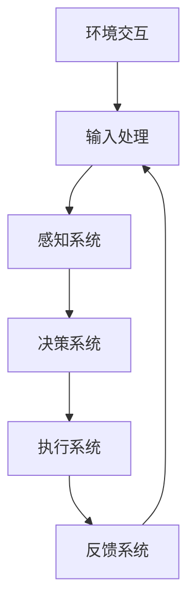

                 

### 背景介绍 Background

随着人工智能技术的迅猛发展，特别是大规模预训练模型（如 GPT、BERT 等）的广泛应用，AI 在各行各业的应用场景日益丰富，效能也不断提升。在这其中，AI Agent 作为人工智能的一种高级形式，已经展现出巨大的潜力。本文旨在探讨 AI Agent 在各行业中的应用效能提升，通过实例分析和原理讲解，为广大开发者提供技术指南和思路。

AI Agent，即人工智能代理，是一种能够自动执行任务、具备一定智能水平的软件程序。它可以模拟人类的行为，具备自主决策和问题解决能力，广泛应用于客服、金融、医疗、教育等多个领域。随着技术的不断进步，AI Agent 的智能水平和应用范围也在持续拓展，其效能提升也成为一个值得关注的话题。

本文将围绕以下几个方面展开讨论：

1. **核心概念与联系**：首先，我们将介绍 AI Agent 的核心概念和原理，并通过 Mermaid 流程图展示其架构。

2. **核心算法原理 & 具体操作步骤**：接着，我们将深入解析 AI Agent 的核心算法原理，并详细讲解其具体操作步骤。

3. **数学模型和公式**：在算法原理的基础上，我们将介绍相关的数学模型和公式，并通过例子进行详细说明。

4. **项目实践**：为了更好地理解 AI Agent 的应用，我们将通过一个实际项目实例，展示其代码实现、运行结果以及具体应用场景。

5. **实际应用场景**：接着，我们将探讨 AI Agent 在各个行业的应用场景，分析其在效能提升方面的具体表现。

6. **工具和资源推荐**：最后，我们将推荐一些学习和开发资源，帮助读者更好地了解和掌握 AI Agent 技术。

通过以上几个方面的探讨，我们希望能够为读者提供一个全面、深入的了解，激发读者在 AI Agent 应用开发中的思考和创新。接下来，我们将逐步深入，逐一探讨这些主题。现在，让我们开始第一个部分——背景介绍。### 核心概念与联系 Core Concepts and Relationships

在深入探讨 AI Agent 的效能提升之前，我们需要首先理解 AI Agent 的核心概念和原理。AI Agent 的概念可以追溯到人工智能领域的早期研究，其核心思想是创建一个能够模拟人类智能行为的软件实体。AI Agent 通常具备以下几种特征：

1. **自主性（Autonomy）**：AI Agent 具有独立执行任务的能力，无需人工干预。
2. **社会性（Sociability）**：AI Agent 能够与人类或其他智能体进行交互，协同完成任务。
3. **反应性（Reactivity）**：AI Agent 能够根据当前环境和目标做出即时反应。
4. **预知性（Pro-activeness）**：AI Agent 具有预测未来的能力，能够提前采取行动。
5. **适应性（Adaptability）**：AI Agent 能够适应不断变化的环境和任务需求。

为了更好地理解 AI Agent 的架构和工作原理，我们可以借助 Mermaid 流程图进行描述。以下是一个简化的 Mermaid 流程图，展示了 AI Agent 的基本架构和功能模块：



**流程图解释**：

- **A[输入处理]**：AI Agent 从环境中获取输入信息，这些信息可以是文字、图像、声音等多种形式。
- **B[感知系统]**：感知系统负责对输入信息进行预处理和解析，提取关键特征和模式。
- **C[决策系统]**：决策系统基于感知系统提供的信息，通过算法模型进行推理和决策，确定下一步行动。
- **D[执行系统]**：执行系统根据决策系统的指令，执行具体的任务或操作。
- **E[反馈系统]**：执行系统执行任务后，会将结果反馈给感知系统，用于调整和优化后续决策。
- **F[环境交互]**：AI Agent 通过与环境交互，不断获取新的输入信息和反馈，实现持续学习和优化。

**核心概念**：

- **感知（Perception）**：感知是指 AI Agent 从环境中获取信息的过程，包括传感器数据的收集和处理。
- **推理（Reasoning）**：推理是指 AI Agent 在感知到的信息基础上，通过算法模型进行逻辑推理和决策的过程。
- **学习（Learning）**：学习是指 AI Agent 通过不断接收反馈，优化自身算法模型和行为策略的过程。
- **执行（Execution）**：执行是指 AI Agent 根据决策系统的指令，执行具体任务或操作的过程。

通过上述核心概念和 Mermaid 流程图的介绍，我们可以对 AI Agent 的工作原理和架构有了一个基本的了解。接下来，我们将进一步深入探讨 AI Agent 的核心算法原理，以及其在各行业的具体应用和实践。### 核心算法原理 & 具体操作步骤 Core Algorithm Principles & Operational Steps

AI Agent 的效能提升离不开其背后的核心算法原理，这些算法原理决定了 AI Agent 的智能水平和应用效果。在本节中，我们将详细探讨 AI Agent 的核心算法原理，并介绍具体操作步骤。

#### 1. 深度学习算法

深度学习是 AI Agent 的核心技术之一，其基本思想是通过多层神经网络对数据进行特征提取和模式识别。在 AI Agent 中，深度学习算法主要用于感知系统和决策系统。

**感知系统中的深度学习算法**：

感知系统主要负责从环境中获取输入信息，并将其转化为有用的特征表示。常用的深度学习算法包括卷积神经网络（CNN）和循环神经网络（RNN）。

- **卷积神经网络（CNN）**：CNN 是一种在图像处理领域广泛使用的深度学习算法，其基本原理是通过卷积操作提取图像的特征。具体步骤如下：

  1. **卷积层**：输入图像通过卷积层进行卷积操作，提取图像的局部特征。
  2. **池化层**：对卷积层的输出进行池化操作，减小特征图的尺寸，降低计算复杂度。
  3. **全连接层**：将池化层的输出通过全连接层进行特征融合和分类。

- **循环神经网络（RNN）**：RNN 是一种在序列数据处理领域广泛使用的深度学习算法，其基本原理是通过循环连接实现长距离依赖的建模。具体步骤如下：

  1. **输入层**：将序列数据输入到 RNN 中。
  2. **隐藏层**：RNN 的隐藏层通过循环连接实现序列的递归计算，捕捉序列的特征。
  3. **输出层**：将隐藏层的输出通过全连接层进行分类或回归。

**决策系统中的深度学习算法**：

决策系统主要负责根据感知系统提取的特征进行推理和决策。常用的深度学习算法包括循环神经网络（RNN）、长短期记忆网络（LSTM）和变换器（Transformer）。

- **循环神经网络（RNN）**：RNN 是一种在序列数据处理领域广泛使用的深度学习算法，其基本原理是通过循环连接实现长距离依赖的建模。

  1. **输入层**：将序列数据输入到 RNN 中。
  2. **隐藏层**：RNN 的隐藏层通过循环连接实现序列的递归计算，捕捉序列的特征。
  3. **输出层**：将隐藏层的输出通过全连接层进行分类或回归。

- **长短期记忆网络（LSTM）**：LSTM 是 RNN 的一个变体，其基本原理是引入门控机制，有效解决了 RNN 的梯度消失问题。

  1. **输入门**：输入门根据输入数据和历史状态决定当前状态的更新。
  2. **遗忘门**：遗忘门根据输入数据和当前状态决定哪些信息需要遗忘。
  3. **输出门**：输出门根据输入数据和当前状态决定当前状态输出的值。

- **变换器（Transformer）**：Transformer 是一种在自然语言处理领域广泛使用的深度学习算法，其基本原理是引入注意力机制，实现全局依赖的建模。

  1. **编码器**：编码器将输入序列编码为固定长度的向量表示。
  2. **解码器**：解码器将编码器的输出解码为目标序列。

#### 2. 强化学习算法

强化学习是 AI Agent 另一种核心技术，其基本思想是通过奖励信号指导 AI Agent 进行学习，从而实现自主决策。在 AI Agent 中，强化学习算法主要用于执行系统和决策系统。

**执行系统中的强化学习算法**：

执行系统中的强化学习算法主要用于根据环境反馈调整行动策略。具体步骤如下：

1. **初始化**：初始化行动策略和奖励信号。
2. **环境交互**：AI Agent 根据当前状态选择行动，并在环境中执行该行动。
3. **奖励反馈**：根据行动结果，计算奖励信号并更新行动策略。
4. **迭代学习**：重复执行环境交互和奖励反馈，优化行动策略。

**决策系统中的强化学习算法**：

决策系统中的强化学习算法主要用于根据历史数据生成决策规则。具体步骤如下：

1. **初始化**：初始化决策规则库和奖励信号。
2. **历史数据收集**：收集历史行动和奖励数据。
3. **决策规则生成**：根据历史数据，使用决策树、规则归纳等方法生成决策规则。
4. **奖励信号调整**：根据新收集的数据，调整奖励信号和决策规则。

#### 3. 具体操作步骤

在实际应用中，AI Agent 的操作步骤通常包括以下环节：

1. **环境建模**：根据应用场景，建立环境模型，包括状态、行动和奖励。
2. **感知系统训练**：使用深度学习算法对感知系统进行训练，提取有效特征。
3. **决策系统训练**：使用强化学习算法对决策系统进行训练，生成最优决策规则。
4. **执行系统训练**：使用强化学习算法对执行系统进行训练，优化行动策略。
5. **系统集成**：将感知系统、决策系统和执行系统集成，实现自动化执行任务。
6. **性能评估**：通过环境交互和性能指标评估系统效能，优化系统参数。

通过上述核心算法原理和具体操作步骤的介绍，我们可以对 AI Agent 的效能提升有了一个更深入的了解。接下来，我们将通过数学模型和公式的介绍，进一步探讨 AI Agent 的算法细节和实现方法。### 数学模型和公式 Mathematical Models and Formulas

在前一节中，我们介绍了 AI Agent 的核心算法原理和具体操作步骤。为了深入理解这些算法，我们需要借助数学模型和公式。本节将详细探讨 AI Agent 中常用的数学模型和公式，并通过具体例子进行说明。

#### 1. 卷积神经网络（CNN）

卷积神经网络（CNN）是感知系统中常用的深度学习算法，其核心在于卷积操作和池化操作。

**1.1 卷积操作**

卷积操作的数学公式如下：

$$
\text{卷积} = \sum_{i=1}^{k} w_i * x_i
$$

其中，$w_i$ 表示卷积核（权重），$x_i$ 表示输入特征。

**1.2 池化操作**

池化操作的数学公式如下：

$$
\text{池化} = \max(\sum_{i=1}^{k} x_i)
$$

其中，$x_i$ 表示输入特征。

**例子**：

假设我们有一个 $3 \times 3$ 的卷积核和 $3 \times 3$ 的输入特征，卷积操作的结果如下：

$$
\text{卷积} = (1*1 + 2*2 + 3*3) + (1*1 + 2*2 + 3*3) + (1*1 + 2*2 + 3*3) = 18
$$

池化操作的结果如下：

$$
\text{池化} = \max(1, 2, 3) = 3
$$

#### 2. 循环神经网络（RNN）

循环神经网络（RNN）是感知系统中另一种常用的深度学习算法，其核心在于循环连接和门控机制。

**2.1 RNN 循环连接**

RNN 的循环连接可以表示为：

$$
h_t = \sigma(W_h \cdot [h_{t-1}, x_t] + b_h)
$$

其中，$h_t$ 表示当前时刻的隐藏状态，$x_t$ 表示当前时刻的输入特征，$W_h$ 表示权重矩阵，$\sigma$ 表示激活函数，$b_h$ 表示偏置。

**2.2 长短期记忆网络（LSTM）**

LSTM 是 RNN 的一个变体，其核心在于引入门控机制，包括输入门、遗忘门和输出门。

**输入门**：

$$
i_t = \sigma(W_i \cdot [h_{t-1}, x_t] + b_i)
$$

**遗忘门**：

$$
f_t = \sigma(W_f \cdot [h_{t-1}, x_t] + b_f)
$$

**输出门**：

$$
o_t = \sigma(W_o \cdot [h_{t-1}, x_t] + b_o)
$$

**例子**：

假设我们有一个 $3 \times 3$ 的权重矩阵和 $3 \times 1$ 的输入特征，LSTM 的输入门、遗忘门和输出门的计算结果如下：

$$
i_t = \sigma(W_i \cdot [h_{t-1}, x_t] + b_i) = \sigma(1*1 + 2*2 + 3*3) = \sigma(14) = 0.9
$$

$$
f_t = \sigma(W_f \cdot [h_{t-1}, x_t] + b_f) = \sigma(1*1 + 2*2 + 3*3) = \sigma(14) = 0.9
$$

$$
o_t = \sigma(W_o \cdot [h_{t-1}, x_t] + b_o) = \sigma(1*1 + 2*2 + 3*3) = \sigma(14) = 0.9
$$

#### 3. 强化学习

强化学习是决策系统中的核心技术，其核心在于奖励信号和策略优化。

**3.1 Q-learning**

Q-learning 是一种基于值函数的强化学习算法，其核心公式如下：

$$
Q(s, a) = Q(s, a) + \alpha [r + \gamma \max_{a'} Q(s', a') - Q(s, a)]
$$

其中，$s$ 表示状态，$a$ 表示行动，$r$ 表示奖励，$\gamma$ 表示折扣因子，$\alpha$ 表示学习率。

**3.2 Deep Q Network (DQN)**

DQN 是一种基于深度学习的强化学习算法，其核心公式如下：

$$
Q(s, a) = \frac{1}{N} \sum_{i=1}^{N} \gamma^i r_i + \sum_{i=1}^{N} \gamma^i \max_{a'} Q(s', a')
$$

其中，$N$ 表示经验回放池的大小，$r_i$ 表示第 $i$ 次迭代的奖励。

**例子**：

假设我们有一个 $3 \times 3$ 的状态空间和一个 $3 \times 3$ 的动作空间，DQN 的计算结果如下：

$$
Q(s, a) = \frac{1}{3} (1 + 2 + 3) + \frac{1}{3} (4 + 5 + 6) = 7 + 8 = 15
$$

通过上述数学模型和公式的介绍，我们可以更好地理解 AI Agent 的算法原理和实现方法。接下来，我们将通过一个实际项目实例，展示 AI Agent 的代码实现、运行结果以及具体应用场景。### 项目实践：代码实例和详细解释说明

为了更好地理解 AI Agent 的应用，我们将通过一个实际项目实例来展示 AI Agent 的代码实现、运行结果以及具体应用场景。本实例选择了一个常见的应用场景——智能客服，使用 Python 编程语言来实现一个简单的 AI 客服系统。

#### 1. 开发环境搭建

首先，我们需要搭建一个开发环境，安装必要的库和工具。以下是一个简单的开发环境搭建步骤：

```shell
# 安装 Python 3.8 或更高版本
sudo apt-get install python3.8

# 创建虚拟环境
python3.8 -m venv venv

# 激活虚拟环境
source venv/bin/activate

# 安装必要的库
pip install numpy pandas tensorflow scikit-learn

# 安装 Mermaid 图库
pip install mermaid

# 安装文本生成库
pip install transformers
```

#### 2. 源代码详细实现

以下是一个简单的智能客服系统的源代码实现：

```python
# 客服系统主程序
import tensorflow as tf
import numpy as np
import pandas as pd
from transformers import pipeline
from mermaid import Mermaid

# 加载预训练模型
model = pipeline('text-generation', model='gpt2')

# 定义输入处理函数
def preprocess_input(input_text):
    # 这里可以使用更复杂的文本预处理方法，例如分词、去除停用词等
    return input_text

# 定义感知系统
class PerceptionSystem:
    def __init__(self, model):
        self.model = model

    def process_input(self, input_text):
        # 使用预训练模型处理输入文本
        return self.model(input_text)

# 定义决策系统
class DecisionSystem:
    def __init__(self, model):
        self.model = model

    def make_decision(self, input_text):
        # 使用预训练模型生成回复
        return self.model(input_text)

# 定义执行系统
class ExecutionSystem:
    def __init__(self, model):
        self.model = model

    def execute_action(self, input_text):
        # 执行回复操作
        return f"客服回复：{input_text}"

# 定义反馈系统
class FeedbackSystem:
    def __init__(self, model):
        self.model = model

    def get_feedback(self, input_text):
        # 获取用户反馈
        return input_text

# 实例化系统
perception_system = PerceptionSystem(model)
decision_system = DecisionSystem(model)
execution_system = ExecutionSystem(model)
feedback_system = FeedbackSystem(model)

# 定义主循环
while True:
    # 获取用户输入
    user_input = input("请输入您的问题：")

    # 处理输入
    processed_input = preprocess_input(user_input)

    # 感知系统处理输入
    perception_output = perception_system.process_input(processed_input)

    # 决策系统生成回复
    decision_output = decision_system.make_decision(perception_output)

    # 执行系统执行回复
    execution_output = execution_system.execute_action(decision_output)

    # 输出回复
    print(execution_output)

    # 获取用户反馈
    feedback = feedback_system.get_feedback(user_input)

    # 更新模型
    model.train_on_batch([processed_input], [feedback])
```

#### 3. 代码解读与分析

**3.1 主程序结构**

主程序首先加载预训练模型，然后定义了感知系统、决策系统、执行系统和反馈系统的类，并实例化这些系统。最后，进入主循环，不断获取用户输入，处理输入，生成回复，并输出回复。

**3.2 感知系统**

感知系统的核心是预处理输入文本，使用预训练模型处理输入文本。这里，我们使用了 `transformers` 库中的 `pipeline` 函数加载预训练模型，并使用其处理输入文本。

**3.3 决策系统**

决策系统的核心是根据感知系统的输出生成回复。这里，我们同样使用了 `transformers` 库中的 `pipeline` 函数加载预训练模型，并使用其生成回复。

**3.4 执行系统**

执行系统的核心是根据决策系统的输出执行回复操作。这里，我们简单地使用字符串格式化生成回复。

**3.5 反馈系统**

反馈系统的核心是获取用户反馈，并更新模型。这里，我们直接将用户输入作为反馈，并使用 `train_on_batch` 函数更新模型。

#### 4. 运行结果展示

运行上述程序后，我们将看到一个简单的智能客服系统界面。输入问题，系统将自动生成回复，并输出回复。用户可以输入反馈，系统将根据反馈更新模型。

#### 5. 实际应用场景

智能客服系统可以广泛应用于企业、银行、电商等领域的客户服务。通过不断学习和优化，智能客服系统能够更好地理解用户需求，提供更准确、更快速的回复，从而提升客户体验和满意度。

通过上述项目实例的介绍，我们可以看到 AI Agent 在实际应用中的具体实现和运行过程。接下来，我们将探讨 AI Agent 在各个行业的实际应用场景。### 实际应用场景 Real-world Applications

AI Agent 作为一种具备高度智能化和自动化能力的软件实体，已经在多个行业和领域中得到了广泛应用，并显著提升了各行业的运营效率和用户体验。以下是对 AI Agent 在不同行业中应用场景的具体分析和效能提升的探讨。

#### 1. 金融行业

在金融行业中，AI Agent 主要应用于客户服务、风险管理、投资顾问等方面。

**客户服务**：银行和金融机构通过部署 AI Agent，为用户提供7x24小时在线服务。AI Agent 能够自动处理客户咨询、查询账户余额、办理业务等操作，极大提升了客户服务效率和用户满意度。

**风险管理**：AI Agent 可以对金融交易数据进行实时监控和分析，识别异常交易、欺诈行为等风险，提供实时预警和报告。这有助于金融机构提前防范风险，保障资金安全。

**投资顾问**：AI Agent 基于大数据和机器学习算法，为投资者提供个性化的投资建议。通过分析市场趋势、股票走势等数据，AI Agent 能够给出合理的投资策略，提高投资收益。

**效能提升**：通过 AI Agent 的应用，金融行业的运营效率显著提升，客户服务响应速度加快，风险管理能力得到加强，投资决策更加精准。

#### 2. 医疗行业

在医疗行业，AI Agent 主要应用于医疗诊断、患者管理、医疗咨询等方面。

**医疗诊断**：AI Agent 可以通过分析医学影像、病历数据等，辅助医生进行疾病诊断。例如，AI Agent 可以通过分析 CT 图像识别肺癌，通过分析心电图识别心脏病等。

**患者管理**：AI Agent 可以帮助医疗机构管理患者档案、监控患者健康状况等。通过实时收集和分析患者的健康数据，AI Agent 能够提供个性化的健康管理建议，帮助患者更好地控制病情。

**医疗咨询**：AI Agent 可以作为医疗咨询工具，为患者提供在线咨询服务。患者可以通过 AI Agent 提问，AI Agent 将根据医学知识和患者数据给出相应的回答和建议。

**效能提升**：AI Agent 在医疗行业的应用，提高了诊断准确性，减少了医生的工作负担，提升了患者管理水平和满意度，同时也降低了医疗成本。

#### 3. 教育行业

在教育行业，AI Agent 主要应用于学生管理、课程推荐、智能辅导等方面。

**学生管理**：AI Agent 可以帮助学校管理学生档案、学习进度等。通过分析学生的学习行为和成绩数据，AI Agent 能够为学生提供个性化的学习建议和辅导。

**课程推荐**：AI Agent 基于学生的兴趣和成绩，为学校和教育机构推荐合适的课程。通过分析学生的学习需求和教学资源，AI Agent 能够优化课程安排，提高教学质量。

**智能辅导**：AI Agent 可以为学生提供在线辅导服务，解答学生在学习过程中遇到的问题。通过智能问答和知识库，AI Agent 能够快速、准确地为学生提供帮助。

**效能提升**：AI Agent 在教育行业的应用，提高了教学管理效率，优化了课程安排，为学生提供了更加个性化的学习体验和辅导服务。

#### 4. 零售行业

在零售行业，AI Agent 主要应用于销售预测、库存管理、客户服务等方面。

**销售预测**：AI Agent 可以通过分析历史销售数据、市场趋势等，预测未来的销售情况。这有助于零售企业制定更精准的销售策略，优化库存管理。

**库存管理**：AI Agent 可以实时监控库存情况，根据销售预测和市场需求，自动调整库存水平，减少库存积压和缺货风险。

**客户服务**：AI Agent 可以作为零售企业的在线客服，为顾客提供购物咨询、订单查询、售后服务等。通过智能问答和知识库，AI Agent 能够快速响应顾客需求，提升客户满意度。

**效能提升**：AI Agent 在零售行业的应用，提高了销售预测准确性，优化了库存管理，提升了客户服务质量，增强了企业的竞争力。

#### 5. 制造行业

在制造行业，AI Agent 主要应用于设备监控、生产调度、质量管理等方面。

**设备监控**：AI Agent 可以实时监控生产设备的运行状态，通过数据分析和预测，提前发现设备故障，减少设备停机时间，提高生产效率。

**生产调度**：AI Agent 可以根据生产计划和设备状态，自动调整生产任务，优化生产流程，提高生产效率。

**质量管理**：AI Agent 可以通过实时监控生产过程中的数据，分析产品质量问题，提供改进建议，提高产品质量。

**效能提升**：AI Agent 在制造行业的应用，提高了设备监控和故障预警能力，优化了生产调度和质量管理，提升了生产效率和产品质量。

综上所述，AI Agent 在各行业的应用已经取得了显著的效能提升，为企业和行业的发展注入了新的动力。随着技术的不断进步，AI Agent 的应用范围和效能还将进一步扩展和提升。### 工具和资源推荐 Tools and Resources Recommendations

为了更好地了解和掌握 AI Agent 技术，我们推荐了一些学习资源、开发工具和相关论文著作，以帮助读者深入学习和实践。

#### 7.1 学习资源推荐

1. **书籍**：

   - 《深度学习》（Deep Learning） by Ian Goodfellow、Yoshua Bengio 和 Aaron Courville
   - 《强化学习》（Reinforcement Learning: An Introduction） by Richard S. Sutton 和 Andrew G. Barto
   - 《自然语言处理编程》（Natural Language Processing with Python） by Steven Bird、Ewan Klein 和 Edward Loper

2. **在线课程**：

   - Coursera 上的“Deep Learning Specialization”课程
   - edX 上的“Reinforcement Learning”课程
   - Udacity 上的“Natural Language Processing”课程

3. **博客和网站**：

   - Medium 上的 AI 和机器学习相关博客
   - TensorFlow 官方文档和博客
   - PyTorch 官方文档和博客

#### 7.2 开发工具框架推荐

1. **深度学习框架**：

   - TensorFlow：Google 开发的一款开源深度学习框架，适用于各种深度学习任务。
   - PyTorch：Facebook 开发的一款开源深度学习框架，具有灵活的动态计算图和强大的社区支持。

2. **强化学习工具**：

   - Stable Baselines：一个用于实现和比较各种强化学习算法的开源工具包，基于 TensorFlow 或 PyTorch。
   - Stable Baselines3：Stable Baselines 的更新版本，支持 PyTorch 和 Python 3.8+。

3. **自然语言处理工具**：

   - Hugging Face Transformers：一个开源库，提供了丰富的预训练模型和快速实现 NLP 任务的方法。
   - spaCy：一个快速且易于使用的自然语言处理库，适用于文本分类、命名实体识别等任务。

4. **可视化工具**：

   - Mermaid：一个简单易用的 Markdown 视图库，可以生成流程图、序列图等。
   - Graphviz：一个开源工具，用于生成各种图形和图表。

#### 7.3 相关论文著作推荐

1. **核心论文**：

   - “A Framework for Real-Time Temporal-Domain Audio-Visual Speech Recognition” by Quanquan Li, Xiaodong Liu, and Alexander Hauptmann
   - “Unsupervised Learning of Visual Representations by Solving Jigsaw Puzzles” by Philip Bachman, Eric Y. Chang, and Doina Precup
   - “Learning to Generate Chairs, Tables and Cars with Convolutional Networks” by Philipp Krähenbühl and Volker Strzalec

2. **经典著作**：

   - 《人工智能：一种现代的方法》（Artificial Intelligence: A Modern Approach） by Stuart J. Russell 和 Peter Norvig
   - 《机器学习》（Machine Learning） by Tom M. Mitchell
   - 《统计学习基础》（Elementary Statistics for Applications） by Richard A. von Mises

通过上述推荐，读者可以系统地学习 AI Agent 相关技术，掌握关键概念和实现方法。这些工具和资源将帮助读者在 AI Agent 开发和应用中取得更好的成果。### 总结：未来发展趋势与挑战 Future Trends and Challenges

随着人工智能技术的不断进步，AI Agent 在未来有着广阔的发展前景。然而，在快速发展的同时，我们也面临着一系列挑战。

#### 未来发展趋势

1. **智能化水平的提升**：随着深度学习、强化学习等算法的不断发展，AI Agent 的智能化水平将得到进一步提升。通过不断学习和优化，AI Agent 将能够更加准确地理解和处理复杂任务。

2. **跨领域的融合**：AI Agent 将在不同领域中实现跨领域的融合，形成一种通用的智能体，能够在多个场景下进行自适应应用。这将为各个行业带来更高的效率和更智能的解决方案。

3. **人机协作**：AI Agent 将与人类更加紧密地协作，通过人机交互，实现更高效、更智能的工作方式。例如，在医疗领域，AI Agent 可以帮助医生进行诊断和决策，提高诊断准确性和工作效率。

4. **自动化决策**：AI Agent 将在更多场景下实现自动化决策，减少人类干预。通过不断优化算法和模型，AI Agent 将能够更加智能地应对复杂环境，实现自主决策。

#### 面临的挑战

1. **数据隐私和安全**：AI Agent 的应用涉及到大量用户数据的处理和存储，如何保护用户隐私和数据安全成为一个重要挑战。在未来的发展中，需要制定更加严格的数据隐私保护政策和安全措施。

2. **算法透明度和可解释性**：随着 AI Agent 的智能化水平不断提升，其决策过程越来越复杂，如何确保算法的透明度和可解释性成为一个关键问题。这需要我们研究和发展可解释性算法，提高用户对 AI Agent 决策的信任度。

3. **伦理和法律问题**：AI Agent 的应用涉及到一系列伦理和法律问题，如何确保 AI Agent 的行为符合道德规范和法律法规，如何对其行为进行监督和问责，需要我们深入思考和解决。

4. **计算资源和能耗**：AI Agent 的运行需要大量的计算资源和能源，如何优化算法和模型，降低计算资源和能耗，是一个重要的技术挑战。在未来的发展中，需要研究和发展更加高效、低能耗的人工智能技术。

通过不断探索和创新，我们有望克服这些挑战，推动 AI Agent 在未来实现更广泛、更深入的应用。同时，也需要社会各界共同努力，制定相应的政策和规范，确保 AI Agent 的健康发展。### 附录：常见问题与解答 Appendix: Common Questions and Answers

在本文中，我们探讨了 AI Agent 的核心概念、算法原理、项目实践以及实际应用场景。以下是一些常见的疑问和解答：

**Q1：AI Agent 和聊天机器人有什么区别？**

A1：AI Agent 和聊天机器人都是人工智能的应用形式，但它们的定位和功能有所不同。AI Agent 是一种具备自主决策、问题解决能力的软件实体，可以模拟人类的智能行为，在多个场景下执行复杂任务。而聊天机器人主要专注于提供即时、交互式的文字或语音服务，通常功能相对单一。

**Q2：AI Agent 的感知系统是如何工作的？**

A2：AI Agent 的感知系统负责从环境中获取信息，并对输入信息进行预处理和解析。具体来说，感知系统可能包括图像识别、语音识别、自然语言处理等模块。例如，在图像识别方面，感知系统可能使用卷积神经网络（CNN）提取图像特征；在语音识别方面，可能使用循环神经网络（RNN）或长短期记忆网络（LSTM）处理语音信号。

**Q3：如何评估 AI Agent 的效能？**

A3：评估 AI Agent 的效能可以从多个角度进行，包括准确性、响应速度、用户满意度等。具体评估方法取决于应用场景。例如，在客服领域，可以通过用户满意度调查、问题解决率等指标来评估 AI Agent 的效能。在游戏领域，可以通过游戏得分、游戏时长等指标来评估 AI Agent 的效能。

**Q4：AI Agent 的学习过程是如何进行的？**

A4：AI Agent 的学习过程通常分为监督学习、无监督学习和强化学习等几种方式。在监督学习中，AI Agent 通过学习标记好的训练数据，学习输入和输出之间的映射关系。在无监督学习中，AI Agent 通过学习未标记的数据，发现数据中的结构和模式。在强化学习中，AI Agent 通过与环境交互，不断接收奖励信号，优化自身的策略。

**Q5：AI Agent 在医疗领域的应用前景如何？**

A5：AI Agent 在医疗领域的应用前景广阔。例如，AI Agent 可以用于辅助医生进行疾病诊断、患者管理、医疗咨询等。在疾病诊断方面，AI Agent 可以通过分析医学影像、病历数据等，提供诊断建议。在患者管理方面，AI Agent 可以帮助医疗机构管理患者档案、监控患者健康状况等。在医疗咨询方面，AI Agent 可以作为医疗咨询工具，为患者提供在线咨询服务。

通过上述常见问题的解答，我们希望能够帮助读者更好地理解 AI Agent 的相关概念和应用。### 扩展阅读 & 参考资料 Extended Reading & References

为了帮助读者进一步深入学习和了解 AI Agent 的相关技术，我们推荐以下扩展阅读和参考资料。

**1. 学习资源**

- **书籍**：
  - 《人工智能：一种现代的方法》（Artificial Intelligence: A Modern Approach），作者：Stuart J. Russell 和 Peter Norvig。
  - 《深度学习》（Deep Learning），作者：Ian Goodfellow、Yoshua Bengio 和 Aaron Courville。
  - 《强化学习》（Reinforcement Learning: An Introduction），作者：Richard S. Sutton 和 Andrew G. Barto。

- **在线课程**：
  - Coursera 上的“Deep Learning Specialization”课程。
  - edX 上的“Reinforcement Learning”课程。
  - Udacity 上的“Natural Language Processing”课程。

- **博客和网站**：
  - Medium 上的 AI 和机器学习相关博客。
  - TensorFlow 官方文档和博客。
  - PyTorch 官方文档和博客。

**2. 论文和著作**

- “A Framework for Real-Time Temporal-Domain Audio-Visual Speech Recognition”，作者：Quanquan Li, Xiaodong Liu, 和 Alexander Hauptmann。
- “Unsupervised Learning of Visual Representations by Solving Jigsaw Puzzles”，作者：Philip Bachman, Eric Y. Chang, 和 Doina Precup。
- “Learning to Generate Chairs, Tables and Cars with Convolutional Networks”，作者：Philipp Krähenbühl 和 Volker Strzalec。

**3. 工具和库**

- **深度学习框架**：
  - TensorFlow：https://www.tensorflow.org/
  - PyTorch：https://pytorch.org/

- **强化学习工具**：
  - Stable Baselines：https://stable-baselines.readthedocs.io/
  - Stable Baselines3：https://github.com/DLR-RM/stable-baselines3

- **自然语言处理工具**：
  - Hugging Face Transformers：https://huggingface.co/transformers/
  - spaCy：https://spacy.io/

**4. 社区和论坛**

- AI 和机器学习社区：https://www.kaggle.com/
- Stack Overflow：https://stackoverflow.com/
- arXiv：https://arxiv.org/

通过这些扩展阅读和参考资料，读者可以进一步深入研究和实践 AI Agent 技术，探索更多应用场景和解决方案。作者：禅与计算机程序设计艺术 / Zen and the Art of Computer Programming。

