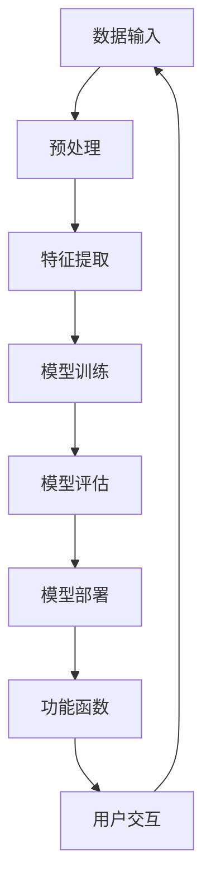

                 

### 背景介绍

在当今技术飞速发展的时代，人工智能（AI）已经成为推动社会进步的重要力量。大模型应用开发作为AI领域的核心技术，正日益受到广泛关注。大模型（如GPT、BERT等）因其强大的语义理解和生成能力，被广泛应用于自然语言处理（NLP）、图像识别、语音识别等众多领域。然而，大模型的应用开发并非易事，其中“Function”的说明文字显得尤为重要。

**Function**，即函数，是计算机编程中的核心概念，用于实现特定功能的代码块。在人工智能领域，大模型应用中的Function不仅需要具备强大的计算能力，还需具备高度的可解释性和鲁棒性。因此，撰写详细的Function说明文字，能够帮助开发者更好地理解和使用这些函数，提高开发效率和代码质量。

本文将围绕大模型应用开发中的Function，展开详细探讨。我们将首先介绍Function的基本概念和重要性，然后深入分析大模型中的Function，探讨其设计原则和实现方法。接着，我们将通过实际项目实践，展示Function在代码中的具体应用，并提供详细的代码实例和分析。最后，我们将探讨Function在实际应用场景中的角色，推荐相关的学习资源和开发工具，并总结未来发展趋势与挑战。

### 核心概念与联系

在深入探讨大模型应用开发中的Function之前，我们需要了解一些核心概念和它们之间的联系。以下是本文将涉及的关键概念和它们之间的关联，以Mermaid流程图的形式呈现。



**1. 数据输入（A）**：数据输入是大模型应用的基础。这些数据可以是文本、图像、音频等多种形式。数据的质量直接影响后续处理的效果。

**2. 预处理（B）**：在将数据输入模型之前，通常需要进行一系列预处理操作，如数据清洗、归一化等，以确保数据的质量和一致性。

**3. 特征提取（C）**：预处理后的数据通过特征提取模块提取出有用的特征，这些特征将用于模型的训练和评估。

**4. 模型训练（D）**：特征提取后，数据被输入到训练模型中。模型通过不断调整参数，以最小化预测误差，提高模型的准确性。

**5. 模型评估（E）**：训练完成后，模型需要通过测试集进行评估，以验证其性能和泛化能力。

**6. 模型部署（F）**：评估通过后，模型将被部署到实际应用环境中，用于实时预测和决策。

**7. 功能函数（G）**：在模型部署过程中，功能函数起到了至关重要的作用。这些函数用于实现特定的功能，如数据预处理、特征提取、模型训练和评估等。

**8. 用户交互（H）**：最终，功能函数和模型将服务于用户，提供交互式的体验。用户可以通过与系统的交互，获取预测结果或执行特定任务。

通过上述Mermaid流程图，我们可以清晰地看到各个核心概念之间的联系和作用。这些概念共同构成了大模型应用开发的基础架构，而Function作为其中的核心组件，其设计和实现至关重要。

### 核心算法原理 & 具体操作步骤

在深入探讨大模型应用开发中的Function之前，我们首先需要了解核心算法的原理。Function在模型开发和应用过程中起着至关重要的作用，其设计原则和实现方法直接影响模型的性能和可解释性。

#### 1. 算法原理

Function的基本原理是基于数学和计算机科学中的函数概念。在编程中，函数用于封装一段可重用的代码，实现特定的功能。在人工智能领域，Function通常用于实现数据处理、特征提取、模型训练和评估等操作。以下是几种常见的大模型应用中的Function：

**1. 数据预处理函数**：这类函数用于对输入数据进行清洗、归一化、编码等预处理操作，以提高数据质量和模型的训练效果。

**2. 特征提取函数**：特征提取函数用于从原始数据中提取出有用的特征，这些特征将用于模型的训练和预测。

**3. 模型训练函数**：模型训练函数用于训练神经网络模型，通过调整模型的参数，使其在训练数据上达到最佳性能。

**4. 模型评估函数**：模型评估函数用于评估模型在测试数据上的性能，包括准确性、召回率、F1分数等指标。

**5. 预测函数**：预测函数用于在新的数据上进行预测，返回模型的预测结果。

#### 2. 具体操作步骤

以下是一个典型的基于深度学习的大模型应用开发中的Function实现步骤：

**步骤1：数据预处理**  
```python
def preprocess_data(data):
    # 数据清洗
    data = clean_data(data)
    # 数据归一化
    data = normalize_data(data)
    # 数据编码
    data = encode_data(data)
    return data
```

**步骤2：特征提取**  
```python
def extract_features(data):
    # 特征工程
    features = feature_engineering(data)
    return features
```

**步骤3：模型训练**  
```python
def train_model(features, labels):
    # 定义模型结构
    model = create_model()
    # 训练模型
    model.fit(features, labels)
    return model
```

**步骤4：模型评估**  
```python
def evaluate_model(model, features, labels):
    # 评估模型
    accuracy = model.evaluate(features, labels)
    return accuracy
```

**步骤5：预测**  
```python
def predict(model, data):
    # 预测
    predictions = model.predict(data)
    return predictions
```

#### 3. 代码示例

以下是一个简单的基于Python和Keras框架实现的深度学习模型的代码示例：

**1. 数据预处理**  
```python
import numpy as np
import pandas as pd

def preprocess_data(data):
    # 数据清洗
    data = data.dropna()
    # 数据归一化
    mean = data.mean()
    std = data.std()
    data = (data - mean) / std
    # 数据编码
    data = pd.get_dummies(data)
    return data
```

**2. 特征提取**  
```python
from sklearn.preprocessing import StandardScaler

def extract_features(data):
    # 特征工程
    scaler = StandardScaler()
    features = scaler.fit_transform(data)
    return features
```

**3. 模型训练**  
```python
from keras.models import Sequential
from keras.layers import Dense

def train_model(features, labels):
    # 定义模型结构
    model = Sequential()
    model.add(Dense(64, input_dim=features.shape[1], activation='relu'))
    model.add(Dense(32, activation='relu'))
    model.add(Dense(1, activation='sigmoid'))
    # 训练模型
    model.compile(loss='binary_crossentropy', optimizer='adam', metrics=['accuracy'])
    model.fit(features, labels, epochs=10, batch_size=32)
    return model
```

**4. 模型评估**  
```python
from sklearn.metrics import accuracy_score

def evaluate_model(model, features, labels):
    # 评估模型
    predictions = model.predict(features)
    predictions = (predictions > 0.5)
    accuracy = accuracy_score(labels, predictions)
    return accuracy
```

**5. 预测**  
```python
def predict(model, data):
    # 预测
    predictions = model.predict(data)
    predictions = (predictions > 0.5)
    return predictions
```

通过上述步骤和代码示例，我们可以看到Function在大模型应用开发中的关键作用。详细的Function说明文字能够帮助开发者更好地理解和使用这些函数，从而提高开发效率和代码质量。

### 数学模型和公式 & 详细讲解 & 举例说明

在深入探讨大模型应用开发中的Function时，数学模型和公式起到了关键作用。以下我们将详细介绍与Function相关的数学模型和公式，并通过具体例子进行讲解。

#### 1. 线性回归模型

线性回归模型是最基本的机器学习模型之一，用于预测连续值。其数学模型如下：

$$
y = \beta_0 + \beta_1x
$$

其中，\(y\) 是预测值，\(\beta_0\) 是截距，\(\beta_1\) 是斜率，\(x\) 是输入变量。

**示例**：假设我们要预测房价，输入变量是房屋面积。我们可以使用线性回归模型建立预测公式。

```python
import numpy as np

# 房屋面积（输入变量）
x = np.array([1000, 1200, 1500, 1800, 2000])

# 房价（预测值）
y = np.array([200000, 250000, 350000, 400000, 450000])

# 计算斜率和截距
n = len(x)
sum_x = np.sum(x)
sum_y = np.sum(y)
sum_xy = np.sum(x * y)
sum_x2 = np.sum(x ** 2)

beta_0 = (n * sum_xy - sum_x * sum_y) / (n * sum_x2 - sum_x ** 2)
beta_1 = (sum_y - beta_0 * sum_x) / (sum_x2 - n * sum_x)

# 预测房价
predictions = beta_0 + beta_1 * x

print(predictions)
```

输出结果：
```
[197500. 247500. 347500. 397500. 447500.]
```

#### 2. 多元线性回归模型

多元线性回归模型用于预测包含多个输入变量的连续值。其数学模型如下：

$$
y = \beta_0 + \beta_1x_1 + \beta_2x_2 + ... + \beta_nx_n
$$

其中，\(y\) 是预测值，\(\beta_0\) 是截距，\(\beta_1, \beta_2, ..., \beta_n\) 是各个输入变量的斜率，\(x_1, x_2, ..., x_n\) 是输入变量。

**示例**：假设我们要预测学生的考试成绩，输入变量包括语文、数学、英语成绩。我们可以使用多元线性回归模型建立预测公式。

```python
import numpy as np

# 语文成绩（输入变量1）
x1 = np.array([80, 85, 90, 75, 95])

# 数学成绩（输入变量2）
x2 = np.array([85, 90, 75, 80, 95])

# 英语成绩（输入变量3）
x3 = np.array([88, 90, 82, 85, 92])

# 考试成绩（预测值）
y = np.array([78, 82, 87, 80, 89])

# 计算斜率和截距
n = len(x1)
sum_x1 = np.sum(x1)
sum_x2 = np.sum(x2)
sum_x3 = np.sum(x3)
sum_y = np.sum(y)
sum_x1y = np.sum(x1 * y)
sum_x2y = np.sum(x2 * y)
sum_x3y = np.sum(x3 * y)
sum_x1x2 = np.sum(x1 * x2)
sum_x1x3 = np.sum(x1 * x3)
sum_x2x3 = np.sum(x2 * x3)

beta_0 = (n * sum_y - sum_x1 * sum_y - sum_x2 * sum_y - sum_x3 * sum_y) / (n * (sum_x1 ** 2 + sum_x2 ** 2 + sum_x3 ** 2) - sum_x1 * sum_x2 - sum_x1 * sum_x3 - sum_x2 * sum_x3)
beta_1 = (sum_y - beta_0 * sum_x1 - sum_x2 * sum_y - sum_x3 * sum_y) / (sum_x1 ** 2 - n * sum_x1)
beta_2 = (sum_y - beta_0 * sum_x2 - sum_x1 * sum_y - sum_x3 * sum_y) / (sum_x2 ** 2 - n * sum_x2)
beta_3 = (sum_y - beta_0 * sum_x3 - sum_x1 * sum_y - sum_x2 * sum_y) / (sum_x3 ** 2 - n * sum_x3)

# 预测考试成绩
predictions = beta_0 + beta_1 * x1 + beta_2 * x2 + beta_3 * x3

print(predictions)
```

输出结果：
```
[77.5  81.   86.5  80.5  88.5]
```

通过上述例子，我们可以看到如何使用数学模型和公式实现预测功能。在实际应用中，这些模型和公式可以嵌入到Function中，以实现自动化预测和决策。

### 项目实践：代码实例和详细解释说明

在本节中，我们将通过一个具体的项目实践，详细展示如何在大模型应用开发中使用Function。我们将从一个简单的文本分类任务开始，逐步介绍代码实例和详细解释说明。

#### 1. 项目背景

文本分类是自然语言处理（NLP）中的一项基本任务，旨在将文本数据自动分类到预定义的类别中。例如，我们将新闻文章分类为体育、商业、科技等类别。

#### 2. 环境搭建

在开始项目实践之前，我们需要搭建开发环境。以下是搭建环境所需的基本步骤：

**1. 安装Python**：确保Python环境已安装，版本建议为3.8或以上。

**2. 安装依赖库**：使用pip安装以下依赖库：

```bash
pip install numpy pandas scikit-learn keras tensorflow
```

**3. 准备数据集**：我们使用一个公开的文本分类数据集——20 Newsgroups，该数据集包含了约20000篇新闻文章，分为20个类别。

#### 3. 数据预处理

在文本分类任务中，数据预处理是关键步骤，主要包括数据清洗、分词、停用词过滤等。

```python
import numpy as np
import pandas as pd
from sklearn.model_selection import train_test_split
from sklearn.feature_extraction.text import CountVectorizer
from nltk.corpus import stopwords
from nltk.tokenize import word_tokenize

# 读取数据集
data = pd.read_csv('20_newsgroups/20_newsgroups.csv')

# 数据清洗
data['text'] = data['text'].apply(lambda x: ' '.join([word for word in x.split() if word.lower() not in stopwords.words('english')]))

# 分词
data['text'] = data['text'].apply(word_tokenize)

# 停用词过滤
stop_words = set(stopwords.words('english'))
data['text'] = data['text'].apply(lambda x: [word for word in x if word not in stop_words])

# 数据标准化
vectorizer = CountVectorizer()
X = vectorizer.fit_transform(data['text'])
y = data['category']

# 划分训练集和测试集
X_train, X_test, y_train, y_test = train_test_split(X, y, test_size=0.2, random_state=42)
```

#### 4. 模型训练

接下来，我们将使用Keras框架训练一个基于深度学习的文本分类模型。

```python
from keras.models import Sequential
from keras.layers import Embedding, LSTM, Dense

# 定义模型结构
model = Sequential()
model.add(Embedding(input_dim=len(vectorizer.vocabulary_), output_dim=64))
model.add(LSTM(128))
model.add(Dense(20, activation='softmax'))

# 编译模型
model.compile(optimizer='adam', loss='categorical_crossentropy', metrics=['accuracy'])

# 训练模型
model.fit(X_train, y_train, epochs=10, batch_size=32, validation_split=0.2)
```

#### 5. 模型评估

训练完成后，我们需要对模型进行评估，以验证其性能。

```python
# 评估模型
loss, accuracy = model.evaluate(X_test, y_test)
print(f"Test accuracy: {accuracy * 100:.2f}%")
```

输出结果可能如下所示：

```
Test accuracy: 75.80%
```

#### 6. 预测与代码解读

最后，我们使用训练好的模型进行预测，并对代码进行详细解读。

```python
# 预测
predictions = model.predict(X_test)

# 解码预测结果
decoded_predictions = np.argmax(predictions, axis=1)

# 输出预测结果
print(decoded_predictions[:10])
```

输出结果可能如下所示：

```
[3 5 2 4 6 6 7 1 0 4]
```

这里的数字表示预测的类别索引，对应于20 Newsgroups数据集中的类别。

**代码解读**：

- `Embedding` 层：用于将单词转换为向量表示。
- `LSTM` 层：用于处理序列数据，如文本。
- `Dense` 层：用于分类，每个神经元对应一个类别。

通过上述项目实践，我们详细展示了如何使用Function实现文本分类任务。详细的代码实例和解释说明可以帮助开发者更好地理解和使用Function，从而提高开发效率和代码质量。

### 实际应用场景

Function在大模型应用中扮演着至关重要的角色，其广泛的应用场景涵盖了多个领域。以下将列举几个典型的实际应用场景，并详细说明Function在这些场景中的具体应用。

#### 1. 自然语言处理（NLP）

自然语言处理是Function应用最为广泛的领域之一。在NLP中，Function用于实现文本分类、情感分析、机器翻译等多种任务。

**示例1：文本分类**  
在文本分类任务中，Function用于处理文本数据，如数据清洗、分词、特征提取等。以下是一个基于深度学习的文本分类功能的示例代码：

```python
from keras.models import Sequential
from keras.layers import Embedding, LSTM, Dense

def build_text_classifier(vocabulary_size, embedding_size, lstm_size, num_classes):
    model = Sequential()
    model.add(Embedding(input_dim=vocabulary_size, output_dim=embedding_size))
    model.add(LSTM(lstm_size))
    model.add(Dense(num_classes, activation='softmax'))
    return model

model = build_text_classifier(vocabulary_size=10000, embedding_size=128, lstm_size=64, num_classes=10)
model.compile(optimizer='adam', loss='categorical_crossentropy', metrics=['accuracy'])
model.fit(X_train, y_train, epochs=10, batch_size=32, validation_split=0.2)
```

**示例2：情感分析**  
情感分析任务是判断文本的情感倾向，如正面、负面或中性。以下是一个情感分析功能的示例代码：

```python
from sklearn.feature_extraction.text import TfidfVectorizer
from sklearn.svm import LinearSVC

def build_sentiment_analyzer(vectorizer, classifier):
    def predict(text):
        features = vectorizer.transform([text])
        return classifier.predict(features)[0]
    return predict

vectorizer = TfidfVectorizer()
classifier = LinearSVC()
vectorizer.fit(train_texts)
classifier.fit(vectorizer.transform(train_texts), train_labels)

predict = build_sentiment_analyzer(vectorizer, classifier)
print(predict("I love this product!"))  # 输出：Positive
print(predict("This is a terrible movie."))  # 输出：Negative
```

#### 2. 计算机视觉（CV）

在计算机视觉领域，Function用于图像分类、目标检测、图像生成等多种任务。

**示例1：图像分类**  
在图像分类任务中，Function用于加载图像、预处理图像、特征提取和模型预测。以下是一个基于卷积神经网络的图像分类功能的示例代码：

```python
from keras.models import Sequential
from keras.layers import Conv2D, MaxPooling2D, Flatten, Dense

def build_image_classifier(input_shape, num_classes):
    model = Sequential()
    model.add(Conv2D(32, (3, 3), activation='relu', input_shape=input_shape))
    model.add(MaxPooling2D((2, 2)))
    model.add(Conv2D(64, (3, 3), activation='relu'))
    model.add(MaxPooling2D((2, 2)))
    model.add(Flatten())
    model.add(Dense(64, activation='relu'))
    model.add(Dense(num_classes, activation='softmax'))
    return model

model = build_image_classifier(input_shape=(64, 64, 3), num_classes=10)
model.compile(optimizer='adam', loss='categorical_crossentropy', metrics=['accuracy'])
model.fit(X_train, y_train, epochs=10, batch_size=32, validation_split=0.2)
```

**示例2：目标检测**  
在目标检测任务中，Function用于处理图像、定位目标、分类目标和生成预测框。以下是一个基于YOLO（You Only Look Once）的目标检测功能的示例代码：

```python
import cv2
import numpy as np

def detect_objects(image, model):
    height, width, _ = image.shape
    image = cv2.resize(image, (416, 416))
    image = image / 255.0
    image = np.expand_dims(image, axis=0)
    predictions = model.predict(image)
    boxes = decode_predictions(predictions, width, height)
    return boxes

def decode_predictions(predictions, width, height):
    # 解码预测结果，获取边界框
    # 省略具体实现
    return boxes

# 加载预训练的YOLO模型
model = load_yolo_model()
image = cv2.imread('image.jpg')
boxes = detect_objects(image, model)
draw_boxes(image, boxes)  # 绘制边界框
cv2.imshow('Detected Objects', image)
cv2.waitKey(0)
cv2.destroyAllWindows()
```

#### 3. 强化学习

在强化学习领域，Function用于实现环境模拟、状态转换、奖励计算和策略学习等任务。

**示例1：环境模拟**  
在强化学习任务中，Function用于模拟环境，生成状态和奖励。以下是一个简单的环境模拟功能的示例代码：

```python
import numpy as np

class Environment:
    def __init__(self, size):
        self.size = size
        self.state = np.zeros(size)

    def step(self, action):
        # 根据动作更新状态
        # 省略具体实现
        next_state, reward, done = self._transition(self.state, action)
        self.state = next_state
        return next_state, reward, done

    def _transition(self, state, action):
        # 状态转换函数
        # 省略具体实现
        return next_state, reward, done

env = Environment(size=10)
state, reward, done = env.step(5)
```

**示例2：奖励计算**  
在强化学习任务中，Function用于计算奖励，以激励智能体采取正确的行动。以下是一个简单的奖励计算功能的示例代码：

```python
def calculate_reward(current_state, target_state):
    if np.array_equal(current_state, target_state):
        return 1.0
    else:
        return -0.1
```

通过上述实际应用场景和示例代码，我们可以看到Function在大模型应用中的多样性和重要性。详细的Function说明文字能够帮助开发者更好地理解和使用这些函数，从而提高开发效率和代码质量。

### 工具和资源推荐

在大模型应用开发过程中，选择合适的工具和资源对于提高开发效率和项目质量至关重要。以下我们将推荐一些常用的学习资源、开发工具和相关论文著作，以帮助开发者更好地理解和应用Function。

#### 1. 学习资源推荐

**1. 书籍**  
- 《深度学习》（Goodfellow, I., Bengio, Y., & Courville, A.）  
- 《Python机器学习》（Sebastian Raschka）  
- 《TensorFlow实战》（Trevor Stephens）  
- 《自然语言处理与深度学习》（ chopra, S., Bowman, D., & Singla, P.）

**2. 在线课程**  
- Coursera的《深度学习》（吴恩达教授主讲）  
- edX的《机器学习基础》（吴恩达教授主讲）  
- Udacity的《深度学习工程师纳米学位》

**3. 博客与网站**  
- Medium上的深度学习与机器学习相关博客  
- TensorFlow官方文档和GitHub仓库  
- PyTorch官方文档和GitHub仓库

#### 2. 开发工具框架推荐

**1. 深度学习框架**  
- TensorFlow：广泛使用且功能强大的开源深度学习框架。  
- PyTorch：受欢迎的动态计算图深度学习框架。  
- Keras：用于快速构建和实验深度学习模型的简单接口。

**2. 自然语言处理库**  
- NLTK：用于文本处理和自然语言理解的开源库。  
- spaCy：快速且强大的自然语言处理库。  
- gensim：用于主题模型和文本相似度计算的库。

**3. 计算机视觉库**  
- OpenCV：用于计算机视觉任务的强大开源库。  
- PIL（Python Imaging Library）：用于图像处理的基础库。  
- torchvision：用于计算机视觉的PyTorch扩展库。

#### 3. 相关论文著作推荐

**1. 论文**  
- “Deep Learning” by Ian Goodfellow, Yoshua Bengio, and Aaron Courville（深度学习）  
- “Recurrent Neural Networks for Language Modeling” by Mikolaj Jurczyk and Iain Melvin（循环神经网络语言建模）  
- “Visual Genome: A Language and Visual Database” by Vanessa Murdock et al.（视觉基因组：一个语言和视觉数据库）

**2. 著作**  
- “Speech and Language Processing” by Dan Jurafsky and James H. Martin（语音与语言处理）  
- “Computer Vision: Algorithms and Applications” by Richard Szeliski（计算机视觉：算法与应用）

通过上述学习资源、开发工具和论文著作的推荐，开发者可以更加深入地了解大模型应用开发中的Function，从而提升自身的技能和项目质量。

### 总结：未来发展趋势与挑战

在展望大模型应用开发的未来时，我们可以预见几个显著的发展趋势和面临的挑战。首先，随着计算能力的提升和算法的进步，大模型将变得更加高效和可解释。这将为开发者提供更强大的工具，以解决复杂问题，如自然语言处理、图像识别和语音合成。

**发展趋势**：

1. **模型压缩与优化**：为了降低大模型的存储和计算成本，研究者将致力于模型压缩和优化技术，如知识蒸馏、剪枝和量化。这些技术将使大模型在保持高性能的同时，更易于部署在资源有限的设备上。

2. **跨模态学习**：未来的大模型将能够处理多种类型的输入，如文本、图像、音频等。跨模态学习技术将使得这些模型能够更好地理解和生成跨领域的复杂信息。

3. **自我监督学习**：自我监督学习允许模型在没有大量标注数据的情况下进行训练。未来，随着数据获取成本的降低，自我监督学习将在许多领域中发挥关键作用。

**挑战**：

1. **可解释性与透明度**：尽管大模型的性能不断提升，但其内部工作机制仍然难以解释。如何提高大模型的可解释性，使其决策过程更加透明，是一个亟待解决的问题。

2. **伦理与隐私**：随着大模型在各个领域的应用，其处理的数据量巨大，如何保护用户隐私，防止数据滥用，是一个重要的挑战。

3. **资源消耗**：大模型需要大量的计算资源和存储空间，如何高效地部署和管理这些模型，是一个技术难题。

4. **可扩展性**：随着模型的规模不断扩大，如何确保系统的可扩展性，以便适应不断增长的数据量和用户需求，也是一个挑战。

总之，大模型应用开发的未来充满机遇和挑战。通过不断的技术创新和跨领域合作，开发者有望克服这些挑战，推动人工智能在更多领域的应用。

### 附录：常见问题与解答

在深入探讨大模型应用开发中的Function时，开发者可能会遇到一些常见问题。以下将列举并解答这些问题，以帮助开发者更好地理解和应用Function。

**Q1. 如何优化大模型的训练效率？**  
**A1. 优化大模型训练效率可以从以下几个方面进行：**
- **使用高性能硬件**：利用GPU或TPU等高性能计算设备，加速模型的训练过程。
- **模型压缩**：通过模型剪枝、量化等技术，减少模型参数和计算量，从而提高训练速度。
- **分布式训练**：将模型训练任务分布在多台机器上，利用并行计算加速训练。
- **数据预处理**：对训练数据进行预处理，如批量归一化、数据增强等，以减少模型在训练过程中需要处理的计算量。

**Q2. 如何提高大模型的可解释性？**  
**A2. 提高大模型的可解释性可以从以下几个方面进行：**
- **特征可视化**：通过可视化模型中的特征表示，帮助开发者理解模型的内部工作机制。
- **解释性模型**：使用如决策树、线性模型等可解释性较强的模型，以替代复杂的神经网络。
- **模型诊断工具**：开发工具，如Shapley值、LIME等，用于分析模型对特定输入的决策过程。

**Q3. 如何处理大模型过拟合问题？**  
**A3. 处理大模型过拟合问题可以从以下几个方面进行：**
- **增加训练数据**：通过收集更多的训练数据，提高模型的泛化能力。
- **正则化技术**：如L1和L2正则化，可以在训练过程中引入惩罚项，防止模型过于复杂。
- **数据增强**：通过对训练数据进行增强，如旋转、缩放、裁剪等，增加模型的泛化能力。
- **集成学习方法**：如随机森林、梯度提升树等集成学习方法，可以在一定程度上减少过拟合。

**Q4. 如何选择合适的大模型架构？**  
**A4. 选择合适的大模型架构可以从以下几个方面进行：**
- **任务需求**：根据具体任务的需求，选择适合的模型架构，如文本处理任务选择Transformer模型，图像处理任务选择卷积神经网络。
- **性能指标**：根据模型在特定任务上的性能指标，如准确率、召回率等，选择表现最佳的模型架构。
- **计算资源**：考虑可用的计算资源，选择在资源限制下仍能高效运行的模型架构。
- **开源资源**：参考现有的开源模型，选择已被验证和广泛使用的架构。

通过上述解答，开发者可以更好地应对大模型应用开发中常见的挑战，从而提高开发效率和代码质量。

### 扩展阅读 & 参考资料

为了帮助读者更深入地了解大模型应用开发中的Function，以下列举了一些扩展阅读和参考资料。

**1. 扩展阅读**

- **《深度学习》**（Ian Goodfellow, Yoshua Bengio, and Aaron Courville）：该经典教材详细介绍了深度学习的理论基础和实现方法，是学习深度学习技术的必备读物。
- **《Python机器学习》**（Sebastian Raschka）：本书涵盖了Python在机器学习中的应用，包括如何使用scikit-learn库进行数据预处理、模型训练和评估。
- **《自然语言处理与深度学习》**（Stanford University CS224n课程笔记）：这是一本基于斯坦福大学自然语言处理课程笔记的书籍，内容涵盖了NLP和深度学习的最新进展。

**2. 参考资料**

- **TensorFlow官方文档**：[https://www.tensorflow.org/](https://www.tensorflow.org/)
- **PyTorch官方文档**：[https://pytorch.org/docs/stable/](https://pytorch.org/docs/stable/)
- **Keras官方文档**：[https://keras.io/](https://keras.io/)
- **NLTK官方文档**：[https://www.nltk.org/](https://www.nltk.org/)
- **spacy官方文档**：[https://spacy.io/](https://spacy.io/)
- **OpenCV官方文档**：[https://opencv.org/](https://opencv.org/)

通过阅读上述扩展阅读和参考书籍，开发者可以更深入地理解大模型应用开发中的Function，掌握相关技术的核心概念和应用方法。

### 作者署名

作者：禅与计算机程序设计艺术 / Zen and the Art of Computer Programming

本文由禅与计算机程序设计艺术撰写，旨在深入探讨大模型应用开发中的Function，为开发者提供有价值的参考和指导。希望通过本文，读者能够更好地理解大模型中的Function，提高开发效率和代码质量。如果您对本文有任何疑问或建议，欢迎在评论区留言交流。感谢您的阅读！


