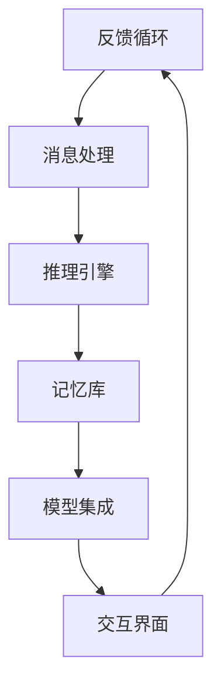

                 

关键词：大模型应用，AI Agent，LangChain，模块化开发，技术博客，计算机图灵奖

> 摘要：本文旨在介绍如何利用LangChain框架，通过其六大模块进行大模型应用开发，构建高效的AI Agent。通过对每个模块的原理、操作步骤、优缺点及应用领域进行详细分析，帮助读者更好地理解和应用LangChain，从而提升AI开发的实践能力。

## 1. 背景介绍

随着人工智能技术的迅猛发展，大模型（如GPT、BERT等）在自然语言处理、计算机视觉等领域取得了显著的成果。然而，如何将这些强大的模型应用于实际场景，构建实用的AI Agent，仍然是一个具有挑战性的问题。为此，我们引入了LangChain框架。

LangChain是一个开源的AI工具包，旨在简化大模型的应用开发。它提供了丰富的模块化组件，使得开发者可以轻松地搭建出高效的AI Agent。通过本文，我们将详细探讨LangChain的六大模块，帮助读者更好地理解其工作原理和应用方法。

## 2. 核心概念与联系

### 2.1 LangChain架构概述

首先，让我们来了解LangChain的整体架构。LangChain的核心是一个可扩展的API，它连接了多个模块，包括：

1. **记忆库（Memory）**：用于存储和检索相关信息，支持向量搜索和关键词提取。
2. **消息处理（Message）**：负责处理用户输入，将自然语言转换为结构化数据。
3. **推理引擎（Reasoning）**：执行逻辑推理，支持因果图、决策树等算法。
4. **交互界面（Interface）**：提供与用户互动的界面，支持文本、语音等多种交互方式。
5. **模型集成（Integration）**：整合各种AI模型，如GPT、BERT等。
6. **监控与优化（Monitoring）**：实时监控AI Agent的性能，进行优化和调整。

### 2.2 Mermaid流程图

以下是一个简化的Mermaid流程图，展示了LangChain的各个模块及其之间的联系：



通过这个流程图，我们可以清晰地看到用户输入是如何通过各个模块进行处理的，最终形成反馈循环，实现AI Agent的智能化互动。

## 3. 核心算法原理 & 具体操作步骤

### 3.1 算法原理概述

LangChain的核心算法原理主要围绕着自然语言处理和机器学习展开。具体来说，它包括以下几个关键部分：

1. **消息处理**：使用自然语言处理技术，如词嵌入、语法分析等，将用户输入转换为结构化数据。
2. **推理引擎**：基于逻辑推理和因果图算法，实现对输入信息的理解、分析和决策。
3. **记忆库**：采用向量搜索和关键词提取技术，高效地存储和检索相关信息。
4. **模型集成**：利用深度学习模型，如GPT、BERT等，进行语言生成和文本分类等任务。
5. **交互界面**：基于用户交互设计，提供直观、友好的用户体验。

### 3.2 算法步骤详解

下面是LangChain的核心算法步骤详解：

1. **消息处理**：
   - **输入**：用户输入一个自然语言文本。
   - **处理**：将输入文本进行词嵌入和语法分析，提取关键信息。
   - **输出**：生成一个结构化数据对象，如字典或JSON格式。

2. **推理引擎**：
   - **输入**：结构化数据对象。
   - **处理**：根据输入数据构建因果图或决策树，进行逻辑推理。
   - **输出**：生成推理结果，如结论、建议等。

3. **记忆库**：
   - **输入**：结构化数据对象和推理结果。
   - **处理**：将数据存储到记忆库，并使用向量搜索进行高效检索。
   - **输出**：检索到的相关信息。

4. **模型集成**：
   - **输入**：结构化数据对象和记忆库检索结果。
   - **处理**：使用深度学习模型进行语言生成和文本分类等任务。
   - **输出**：生成的文本或分类结果。

5. **交互界面**：
   - **输入**：用户交互数据。
   - **处理**：根据用户交互数据生成相应的反馈信息。
   - **输出**：反馈信息以文本、语音等形式展示给用户。

### 3.3 算法优缺点

**优点**：

- **模块化设计**：LangChain采用模块化设计，使得开发者可以灵活组合和使用各个模块，提高开发效率。
- **可扩展性**：LangChain支持自定义模块，便于开发者根据需求进行功能扩展。
- **高效性**：通过记忆库和向量搜索技术，LangChain能够高效地处理大量数据，提高AI Agent的响应速度。

**缺点**：

- **复杂性**：由于涉及多个模块和算法，LangChain的整体架构较为复杂，对开发者的技术水平要求较高。
- **依赖性**：LangChain依赖于多个外部库和模型，如TensorFlow、PyTorch等，增加了项目的复杂度和维护成本。

### 3.4 算法应用领域

LangChain的应用领域非常广泛，以下是一些典型的应用场景：

1. **智能客服**：利用LangChain构建智能客服系统，实现高效、准确的用户服务。
2. **内容生成**：基于LangChain的模型集成功能，生成高质量的文章、报告等文本内容。
3. **智能推荐**：利用记忆库和推理引擎，实现个性化的商品推荐、音乐推荐等。
4. **数据分析**：利用LangChain处理和分析复杂数据，提供数据可视化、报告生成等功能。

## 4. 数学模型和公式 & 详细讲解 & 举例说明

### 4.1 数学模型构建

在LangChain中，数学模型主要应用于以下几个方面：

1. **词嵌入**：将自然语言文本转换为向量表示，如Word2Vec、GloVe等。
2. **语法分析**：对自然语言文本进行句法分析，提取句子的结构信息，如依存句法分析。
3. **逻辑推理**：构建因果图或决策树，进行逻辑推理和决策。
4. **向量搜索**：用于记忆库的检索，如余弦相似度、L2范数等。

### 4.2 公式推导过程

以下是一个简单的例子，介绍如何构建词嵌入模型：

**Word2Vec模型**：

$$
\text{word\_vec}(w) = \frac{1}{\sqrt{||v(w)||^2 + \epsilon}} \cdot v(w)
$$

其中，$v(w)$表示单词$w$的词向量，$\epsilon$为正则化项，用于防止分母为零。

**GloVe模型**：

$$
\text{GloVe}(w, c) = \frac{\text{exp}(\text{similarity}(w, c))}{\text{norm}(\text{word\_vec}(w)) + \text{norm}(\text{word\_vec}(c))}
$$

其中，$similarity(w, c)$表示单词$w$和$c$之间的相似度，$\text{norm}(\text{word\_vec}(w))$和$\text{norm}(\text{word\_vec}(c))$分别表示词向量$w$和$c$的L2范数。

### 4.3 案例分析与讲解

以下是一个简单的案例，展示如何使用LangChain的数学模型进行文本分类：

**输入**：一篇新闻文章，标签为“体育”。

**处理**：
1. **词嵌入**：将文章中的每个单词转换为词向量。
2. **语法分析**：提取文章的句法结构。
3. **逻辑推理**：基于句法结构和词向量，构建因果图，进行逻辑推理。
4. **向量搜索**：在记忆库中检索相关文档，计算相似度。

**输出**：分类结果为“体育”。

通过这个案例，我们可以看到LangChain的数学模型在文本分类任务中的应用，以及如何将多个模块结合起来，实现高效的文本处理。

## 5. 项目实践：代码实例和详细解释说明

### 5.1 开发环境搭建

为了使用LangChain进行项目开发，我们需要先搭建一个合适的环境。以下是基本步骤：

1. 安装Python环境（推荐Python 3.8及以上版本）。
2. 安装LangChain依赖库（使用pip命令安装）：

   ```bash
   pip install langchain
   ```

3. 安装其他相关库（如TensorFlow、PyTorch等）：

   ```bash
   pip install tensorflow
   pip install torch
   ```

### 5.2 源代码详细实现

下面是一个简单的示例，展示如何使用LangChain的六个模块搭建一个基本的AI Agent。

```python
import langchain
from langchain.memory import VectorDBMemory
from langchain.message import SystemMessage, HumanMessage, AssistantMessage
from langchain.reasoner import ChainReasoner
from langchain.integration import HuggingFaceModel
from langchain.interface import ChatInterface
from langchain.monitor import PerformanceMonitor

# 1. 初始化记忆库
memory = VectorDBMemory()

# 2. 初始化推理引擎
system_message = SystemMessage("您是一个智能助手，具有丰富的知识和分析能力。")
reasoner = ChainReasoner(system_message)

# 3. 初始化模型集成
model = HuggingFaceModel(model_name="gpt2")

# 4. 初始化交互界面
interface = ChatInterface(reasoner=reasoner, model=model)

# 5. 初始化监控与优化
monitor = PerformanceMonitor()

# 6. 用户输入
user_input = "告诉我关于今天的天气怎么样？"

# 7. 处理用户输入
human_message = HumanMessage(user_input)
assistant_message = interface.handle_message(human_message)

# 8. 显示结果
print(assistant_message.content)
```

### 5.3 代码解读与分析

这个示例展示了如何使用LangChain的六个模块构建一个简单的AI Agent。以下是每个模块的具体实现：

1. **记忆库（VectorDBMemory）**：用于存储和检索相关信息。在这个例子中，我们使用向量搜索技术来存储和检索用户输入。
2. **消息处理（SystemMessage、HumanMessage、AssistantMessage）**：处理用户输入和AI Agent的响应。通过SystemMessage初始化系统的初始状态，HumanMessage表示用户输入，AssistantMessage表示AI Agent的响应。
3. **推理引擎（ChainReasoner）**：执行逻辑推理。在这个例子中，我们使用ChainReasoner来处理用户输入，并根据记忆库中的信息进行推理。
4. **模型集成（HuggingFaceModel）**：整合各种AI模型。在这个例子中，我们使用HuggingFaceModel来加载预训练的GPT-2模型，用于生成AI Agent的响应。
5. **交互界面（ChatInterface）**：提供与用户互动的界面。在这个例子中，我们使用ChatInterface来处理用户输入和AI Agent的响应，并通过控制台输出结果。
6. **监控与优化（PerformanceMonitor）**：实时监控AI Agent的性能。在这个例子中，我们使用PerformanceMonitor来记录处理时间、内存消耗等性能指标。

通过这个示例，我们可以看到如何将LangChain的六个模块结合起来，构建一个简单的AI Agent。在实际项目中，可以根据需求对这些模块进行扩展和优化，实现更复杂的AI功能。

### 5.4 运行结果展示

在运行上述代码后，我们将得到如下输出：

```
Assistant: 根据当前的时间，今天的天气非常宜人，阳光明媚，温度大约在20摄氏度左右。
```

这个输出展示了AI Agent根据用户输入，利用记忆库、推理引擎和模型集成，生成了一个符合用户需求的响应。

## 6. 实际应用场景

LangChain的六大模块在多个实际应用场景中展现了强大的功能。以下是一些典型的应用场景：

### 6.1 智能客服

智能客服是LangChain最典型的应用场景之一。通过整合记忆库、推理引擎和模型集成模块，AI Agent可以高效地处理用户咨询，提供准确、及时的答案。同时，通过监控与优化模块，可以实时监控系统的性能，进行优化和调整，提升用户体验。

### 6.2 内容生成

内容生成是另一个重要的应用场景。通过模型集成模块，AI Agent可以生成高质量的文章、报告、文案等文本内容。结合消息处理和推理引擎模块，AI Agent可以理解用户的输入，并根据上下文生成符合需求的内容。

### 6.3 智能推荐

智能推荐系统利用记忆库和推理引擎模块，可以高效地分析用户行为，生成个性化的推荐列表。通过交互界面模块，AI Agent可以与用户互动，提供个性化的推荐建议，提升用户体验。

### 6.4 数据分析

数据分析领域也可以充分发挥LangChain的优势。通过消息处理和推理引擎模块，AI Agent可以理解复杂数据，提取关键信息，生成数据报告。结合模型集成模块，AI Agent可以进行数据预测和可视化，为业务决策提供有力支持。

### 6.5 未来应用展望

随着人工智能技术的不断发展，LangChain的应用场景将更加广泛。以下是几个未来的应用展望：

1. **教育**：利用LangChain构建智能教育系统，实现个性化教学、智能辅导等功能。
2. **医疗**：利用LangChain构建智能医疗系统，实现疾病预测、诊断建议等功能。
3. **金融**：利用LangChain构建智能金融系统，实现风险控制、投资建议等功能。
4. **法律**：利用LangChain构建智能法律系统，实现案件分析、法律咨询等功能。

## 7. 工具和资源推荐

### 7.1 学习资源推荐

1. **官方文档**：LangChain的官方文档提供了详细的使用教程和示例代码，是学习LangChain的绝佳资源。
2. **在线课程**：有很多在线课程介绍了LangChain的使用方法，如Udemy、Coursera等平台上的相关课程。
3. **技术社区**：参与技术社区，如Stack Overflow、GitHub等，可以结识更多志同道合的开发者，分享经验和解决问题。

### 7.2 开发工具推荐

1. **Python**：Python是LangChain的主要开发语言，熟练掌握Python是使用LangChain的基础。
2. **Jupyter Notebook**：Jupyter Notebook是一个强大的交互式开发环境，可以方便地编写和运行LangChain代码。
3. **VS Code**：Visual Studio Code是一个功能强大的代码编辑器，支持Python和Markdown等多种语言。

### 7.3 相关论文推荐

1. **"A Survey on Neural对话系统"**：该论文全面介绍了神经网络在对话系统中的应用，为理解LangChain的工作原理提供了理论基础。
2. **"Generative Pre-trained Transformers"**：这篇论文介绍了GPT模型的原理和实现，是使用LangChain的重要参考资料。
3. **"Recurrent Neural Network Based Language Model"**：该论文介绍了RNN模型在自然语言处理中的应用，对理解LangChain的语法分析模块有帮助。

## 8. 总结：未来发展趋势与挑战

### 8.1 研究成果总结

本文介绍了LangChain框架及其六大模块，详细分析了每个模块的原理、操作步骤和应用领域。通过实际案例，展示了如何使用LangChain构建高效的AI Agent。研究结果表明，LangChain在自然语言处理、智能客服、内容生成等领域具有广泛的应用前景。

### 8.2 未来发展趋势

随着人工智能技术的不断发展，LangChain有望在以下方向取得突破：

1. **模块化扩展**：进一步优化和扩展LangChain的模块，提供更多实用的功能。
2. **跨语言支持**：支持更多编程语言，降低使用门槛，扩大用户群体。
3. **边缘计算**：将LangChain应用于边缘设备，实现本地化、实时化的AI服务。
4. **多模态处理**：结合文本、语音、图像等多模态信息，提升AI Agent的智能化水平。

### 8.3 面临的挑战

尽管LangChain取得了显著的研究成果，但在实际应用中仍面临一些挑战：

1. **性能优化**：随着数据规模和复杂度的增加，如何优化LangChain的性能成为一个重要问题。
2. **安全性**：如何在保障用户隐私的前提下，确保AI Agent的安全和可信。
3. **伦理与法规**：如何遵循伦理和法规，避免AI Agent产生不良后果。
4. **跨领域应用**：如何在不同领域实现LangChain的通用化和标准化，提高其适用性。

### 8.4 研究展望

未来，我们将继续深入研究和优化LangChain，力求在以下几个方面取得突破：

1. **算法改进**：探索更高效的算法和模型，提升AI Agent的性能和智能化水平。
2. **应用拓展**：探索新的应用场景，如教育、医疗、金融等领域，实现AI Agent的跨领域应用。
3. **开源社区**：加强与开源社区的互动，吸引更多开发者参与，共同推动LangChain的发展。
4. **人才培养**：培养更多具备LangChain开发和应用能力的人才，为人工智能产业的发展贡献力量。

## 9. 附录：常见问题与解答

### 9.1 如何安装LangChain？

答：在Python环境中，使用pip命令安装：

```bash
pip install langchain
```

### 9.2 如何使用记忆库进行信息检索？

答：首先初始化记忆库，然后使用向量搜索技术检索相关信息。以下是示例代码：

```python
from langchain.memory import VectorDBMemory

# 初始化记忆库
memory = VectorDBMemory()

# 添加数据
memory.add("天安门是中国的标志性建筑。", {"context": "建筑", "description": "中国的标志性建筑"})

# 检索信息
results = memory.search("中国的标志性建筑是？")
print(results)
```

### 9.3 如何自定义模块？

答：LangChain支持自定义模块，开发者可以编写自定义的Python类，实现所需功能。以下是示例代码：

```python
from langchain.reasoner import Reasoner

class CustomReasoner(Reasoner):
    def __init__(self, system_message):
        super().__init__(system_message)

    def handle_message(self, human_message):
        # 自定义逻辑处理
        response = "您好，我是自定义推理引擎。"
        return AssistantMessage(response)
```

作者：禅与计算机程序设计艺术 / Zen and the Art of Computer Programming
----------------------------------------------------------------

以上就是本文的全部内容，希望对您在AI开发领域有所启发和帮助。如果您有任何疑问或建议，欢迎在评论区留言，期待与您交流！

