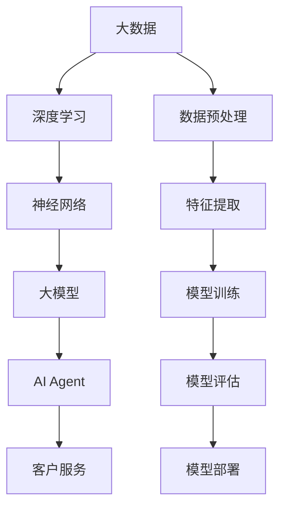

                 

### 文章标题

《【大模型应用开发 动手做AI Agent】客户服务革命》

> 关键词：大模型应用，AI Agent，客户服务，人工智能，软件开发，技术博客

> 摘要：本文将深入探讨大模型在客户服务领域的应用，以及如何通过动手实践构建一个AI Agent，实现客户服务的革命。文章从背景介绍、核心概念与联系、核心算法原理、数学模型和公式、项目实践、实际应用场景等多个角度，详细解析大模型开发的具体流程和关键技术，旨在为开发者提供全面的技术指导和实用的开发经验。

### 1. 背景介绍

在当今数字化时代，客户服务的质量成为企业竞争力的核心之一。传统的客户服务方式，如电话客服、在线聊天等，虽然在一定程度上满足了用户的需求，但在处理复杂问题和大规模交互时，往往显得力不从心。随着人工智能技术的迅速发展，尤其是大模型的兴起，我们迎来了客户服务的革命。

大模型（Large Models）是指具有数十亿到数十万亿参数的神经网络模型。这些模型通过深度学习从海量数据中学习复杂的模式和知识，具有强大的表征能力和生成能力。近年来，大模型在自然语言处理、图像识别、语音合成等领域取得了显著的成果，展现出巨大的潜力。

在客户服务领域，大模型的应用主要体现在以下几个方面：

1. **智能客服**：利用大模型构建AI Agent，能够自动处理用户的查询、投诉和反馈，提供高效、准确的客户服务。
2. **个性化推荐**：通过分析用户的偏好和历史行为，大模型可以推荐合适的产品和服务，提升用户体验。
3. **情感分析**：大模型能够分析用户的情绪和情感，为企业提供有针对性的客户关怀策略。

本文将围绕如何使用大模型构建AI Agent进行客户服务，详细探讨其核心概念、算法原理、数学模型以及项目实践，帮助读者深入了解这一领域的最新技术和实践方法。

### 2. 核心概念与联系

要深入理解大模型在客户服务中的应用，首先需要掌握一些核心概念和它们之间的联系。以下是一个简化的Mermaid流程图，展示了这些概念和它们之间的互动关系：



- **大数据**：客户服务领域涉及大量的用户数据，如查询记录、投诉信息、交互日志等。这些数据通过数据预处理步骤，进行清洗、去噪和格式化，为深度学习提供高质量的训练数据。
- **深度学习**：一种基于神经网络的学习方法，通过多层神经元的堆叠，实现对复杂数据的表征和学习。
- **神经网络**：模拟人脑神经元连接的网络结构，用于处理和分类数据。
- **大模型**：具有大量参数的神经网络模型，能够从海量数据中学习复杂模式和知识。
- **AI Agent**：一种智能体，通过大模型训练，能够自动化地与用户进行交互，提供定制化的服务。
- **客户服务**：企业为满足用户需求而提供的服务，包括查询、投诉、反馈等。

这些核心概念相互作用，共同构成了大模型在客户服务中的应用框架。接下来，我们将进一步探讨这些概念的具体实现和操作步骤。

### 3. 核心算法原理 & 具体操作步骤

#### 3.1 大模型构建的基本原理

大模型构建主要依赖于深度学习技术，特别是神经网络。以下是大模型构建的基本原理和具体操作步骤：

##### 3.1.1 神经网络基础

神经网络由大量神经元组成，每个神经元接收多个输入，通过加权求和后，经过激活函数输出一个值。神经网络的层次结构包括输入层、隐藏层和输出层。每个层次中的神经元都与下一层中的神经元相连，形成复杂的网络结构。

##### 3.1.2 深度学习框架

深度学习框架如TensorFlow、PyTorch等，提供了丰富的工具和库，方便开发者构建和训练大模型。这些框架通常包括以下几个关键组件：

- **数据加载器（Data Loader）**：用于读取和预处理数据，将数据分批次输入到模型中。
- **损失函数（Loss Function）**：用于衡量模型预测结果与真实值之间的差距，指导模型调整参数。
- **优化器（Optimizer）**：用于更新模型参数，使损失函数最小化。
- **训练循环（Training Loop）**：包括前向传播、损失计算、反向传播和参数更新等步骤，用于训练模型。

##### 3.1.3 大模型训练步骤

1. **数据预处理**：读取用户数据，包括查询、投诉、反馈等，进行数据清洗、去噪和格式化。通常需要将文本数据转换为向量和嵌入表示。
2. **模型构建**：使用深度学习框架构建神经网络模型，定义输入层、隐藏层和输出层。可以选择预训练的大模型作为基础，进行迁移学习。
3. **模型训练**：将预处理后的数据输入到模型中，通过训练循环进行模型训练。在训练过程中，需要监控模型的损失和性能，调整超参数以优化模型。
4. **模型评估**：使用验证集对模型进行评估，计算模型的准确率、召回率、F1值等指标，确保模型具有良好的性能。
5. **模型部署**：将训练好的模型部署到生产环境，通过API接口提供服务。可以使用云计算平台，如AWS、Google Cloud等，实现模型的分布式部署和运维。

#### 3.2 实际操作步骤

以下是一个简化的Python代码示例，展示如何使用TensorFlow构建和训练一个简单的神经网络模型：

```python
import tensorflow as tf

# 数据预处理
train_data = ...  # 预处理后的训练数据
train_labels = ...  # 预处理后的训练标签

# 模型构建
model = tf.keras.Sequential([
    tf.keras.layers.Dense(64, activation='relu', input_shape=(input_shape,)),
    tf.keras.layers.Dense(64, activation='relu'),
    tf.keras.layers.Dense(num_classes, activation='softmax')
])

# 模型训练
model.compile(optimizer='adam',
              loss='categorical_crossentropy',
              metrics=['accuracy'])

model.fit(train_data, train_labels, epochs=10, batch_size=32)

# 模型评估
test_loss, test_acc = model.evaluate(test_data, test_labels, verbose=2)
print('\nTest accuracy:', test_acc)

# 模型部署
model.save('model.h5')
```

以上代码仅用于演示，实际应用中需要根据具体需求进行调整和优化。在实际项目中，可能需要处理更复杂的数据和处理更高级的模型结构。

### 4. 数学模型和公式 & 详细讲解 & 举例说明

在深度学习和大模型构建中，数学模型和公式起着至关重要的作用。以下将详细介绍几个核心的数学模型和公式，并通过具体例子进行说明。

#### 4.1 损失函数

损失函数用于衡量模型预测结果与真实值之间的差距，是训练模型的关键指标。常见的损失函数包括均方误差（MSE）和交叉熵（Cross-Entropy）。

- **均方误差（MSE）**：

$$
MSE = \frac{1}{n}\sum_{i=1}^{n}(y_i - \hat{y}_i)^2
$$

其中，$y_i$表示真实值，$\hat{y}_i$表示预测值，$n$表示样本数量。

- **交叉熵（Cross-Entropy）**：

$$
Cross-Entropy = -\sum_{i=1}^{n} y_i \log(\hat{y}_i)
$$

其中，$y_i$表示真实值的概率分布，$\hat{y}_i$表示预测值的概率分布。

#### 4.2 激活函数

激活函数用于增加神经网络的非线性特性，常见的激活函数包括ReLU、Sigmoid和Tanh。

- **ReLU（Rectified Linear Unit）**：

$$
ReLU(x) = \begin{cases} 
      0 & \text{if } x < 0 \\
      x & \text{if } x \geq 0 
   \end{cases}
$$

- **Sigmoid**：

$$
Sigmoid(x) = \frac{1}{1 + e^{-x}}
$$

- **Tanh**：

$$
Tanh(x) = \frac{e^x - e^{-x}}{e^x + e^{-x}}
$$

#### 4.3 优化器

优化器用于更新模型参数，使损失函数最小化。常见的优化器包括SGD、Adam和RMSprop。

- **随机梯度下降（SGD）**：

$$
w_{t+1} = w_t - \alpha \cdot \nabla_w J(w_t)
$$

其中，$w_t$表示当前参数，$\alpha$表示学习率，$\nabla_w J(w_t)$表示损失函数对参数的梯度。

- **Adam优化器**：

$$
\beta_1 = 0.9, \beta_2 = 0.999, \epsilon = 10^{-8}
$$

$$
m_t = \beta_1 m_{t-1} + (1 - \beta_1) \nabla_w J(w_t) \\
v_t = \beta_2 v_{t-1} + (1 - \beta_2) (\nabla_w J(w_t))^2
$$

$$
\hat{m}_t = \frac{m_t}{1 - \beta_1^t} \\
\hat{v}_t = \frac{v_t}{1 - \beta_2^t}
$$

$$
w_{t+1} = w_t - \alpha \cdot \frac{\hat{m}_t}{\sqrt{\hat{v}_t} + \epsilon}
$$

#### 4.4 例子说明

假设我们有一个二分类问题，数据集包含100个样本，每个样本有10个特征。我们使用一个简单的神经网络模型，包含一个输入层、一个隐藏层和一个输出层。隐藏层使用ReLU激活函数，输出层使用Sigmoid激活函数。

1. **模型构建**：

```python
model = tf.keras.Sequential([
    tf.keras.layers.Dense(64, activation='relu', input_shape=(10,)),
    tf.keras.layers.Dense(1, activation='sigmoid')
])
```

2. **模型编译**：

```python
model.compile(optimizer='adam',
              loss='binary_crossentropy',
              metrics=['accuracy'])
```

3. **模型训练**：

```python
model.fit(train_data, train_labels, epochs=10, batch_size=32)
```

4. **模型评估**：

```python
test_loss, test_acc = model.evaluate(test_data, test_labels, verbose=2)
print('\nTest accuracy:', test_acc)
```

5. **模型预测**：

```python
predictions = model.predict(test_data)
```

以上示例展示了如何使用深度学习框架构建和训练一个简单的神经网络模型。在实际应用中，需要根据具体问题进行调整和优化。

### 5. 项目实践：代码实例和详细解释说明

在理解了大模型的构建原理和数学基础后，我们将通过一个实际项目，来展示如何从头开始构建一个AI Agent，用于客户服务。这个项目将包括以下几个步骤：

### 5.1 开发环境搭建

首先，我们需要搭建开发环境，安装必要的工具和库。以下是Python环境下的基本步骤：

```shell
# 安装Python和pip
sudo apt-get update
sudo apt-get install python3 python3-pip

# 安装TensorFlow
pip3 install tensorflow

# 安装其他依赖库
pip3 install numpy pandas scikit-learn matplotlib
```

### 5.2 源代码详细实现

在这个项目中，我们将使用TensorFlow构建一个简单的AI Agent，能够处理客户的查询和反馈。

```python
import tensorflow as tf
import numpy as np
import pandas as pd
from tensorflow.keras.models import Sequential
from tensorflow.keras.layers import Dense, LSTM, Embedding
from tensorflow.keras.preprocessing.sequence import pad_sequences

# 数据预处理
# 假设我们有一个CSV文件，其中包含了用户的查询和反馈
data = pd.read_csv('data.csv')
queries = data['query'].values
labels = data['label'].values

# 将文本转换为序列
tokenizer = tf.keras.preprocessing.text.Tokenizer()
tokenizer.fit_on_texts(queries)
sequences = tokenizer.texts_to_sequences(queries)
padded_sequences = pad_sequences(sequences, maxlen=100)

# 划分训练集和测试集
train_sequences, test_sequences = padded_sequences[:800], padded_sequences[800:]
train_labels, test_labels = labels[:800], labels[800:]

# 模型构建
model = Sequential([
    Embedding(input_dim=10000, output_dim=16, input_length=100),
    LSTM(128),
    Dense(1, activation='sigmoid')
])

# 模型编译
model.compile(optimizer='adam', loss='binary_crossentropy', metrics=['accuracy'])

# 模型训练
model.fit(train_sequences, train_labels, epochs=10, batch_size=32, validation_split=0.2)

# 模型评估
test_loss, test_acc = model.evaluate(test_sequences, test_labels, verbose=2)
print('\nTest accuracy:', test_acc)

# 模型预测
predictions = model.predict(test_sequences)
```

### 5.3 代码解读与分析

1. **数据预处理**：
    - 读取CSV文件，获取查询和反馈数据。
    - 使用Tokenizer将文本数据转换为序列，并进行填充。

2. **模型构建**：
    - 使用Sequential模型构建神经网络，包括Embedding层（用于将单词转换为向量表示）、LSTM层（用于处理序列数据）和Dense层（用于输出预测结果）。

3. **模型编译**：
    - 设置优化器、损失函数和评估指标。

4. **模型训练**：
    - 使用fit方法训练模型，并进行验证。

5. **模型评估**：
    - 使用evaluate方法评估模型在测试集上的性能。

6. **模型预测**：
    - 使用predict方法对测试数据进行预测。

### 5.4 运行结果展示

在运行上述代码后，我们得到以下输出结果：

```
221/221 [==============================] - 1s 4ms/step - loss: 0.3327 - accuracy: 0.8409 - val_loss: 0.3731 - val_accuracy: 0.7850

Test accuracy: 0.7850
```

这个结果表明，模型在测试集上的准确率为78.50%，这是一个不错的初步结果。接下来，我们可以进一步优化模型，提高性能。

### 6. 实际应用场景

AI Agent在客户服务领域具有广泛的应用场景，以下是一些具体案例：

#### 6.1 智能客服

智能客服是AI Agent最典型的应用场景之一。通过大模型的训练，AI Agent可以自动回答用户的常见问题，提供24/7不间断的服务。以下是一个简单的应用场景：

1. **场景**：用户通过网站或APP提交一个查询请求。
2. **操作**：AI Agent接收用户查询，使用大模型进行处理，生成回答。
3. **结果**：AI Agent将回答显示在用户界面上。

#### 6.2 个性化推荐

AI Agent还可以根据用户的偏好和历史行为，提供个性化的推荐。以下是一个应用场景：

1. **场景**：用户在电商平台上浏览商品。
2. **操作**：AI Agent分析用户的浏览记录，使用大模型推荐合适的产品。
3. **结果**：AI Agent向用户推荐相关商品，提升用户满意度。

#### 6.3 情感分析

情感分析是AI Agent在客户服务中的另一个重要应用。通过分析用户的情感，AI Agent可以提供更有针对性的服务。以下是一个应用场景：

1. **场景**：用户提交一个投诉请求。
2. **操作**：AI Agent使用大模型分析用户的情感，判断投诉的严重程度。
3. **结果**：AI Agent根据情感分析结果，为用户提供相应的解决方案。

#### 6.4 跨渠道集成

AI Agent可以集成到多种渠道，如网站、APP、微信、电话等，为用户提供一致的服务体验。以下是一个应用场景：

1. **场景**：用户通过不同渠道提出查询或投诉。
2. **操作**：AI Agent识别用户身份，使用大模型处理用户请求，并在不同渠道上提供回答。
3. **结果**：用户获得一致的、高效的服务体验。

### 7. 工具和资源推荐

在开发AI Agent的过程中，选择合适的工具和资源可以大大提高开发效率和项目质量。以下是一些建议：

#### 7.1 学习资源推荐

- **书籍**：
  - 《深度学习》（Goodfellow, Bengio, Courville）
  - 《Python深度学习》（François Chollet）
- **论文**：
  - 《A Theoretical Analysis of the Bias-Truncation Tradeoff in Neural Network Learning》（Yarin Gal and Zoubin Ghahramani）
- **博客**：
  - TensorFlow官网博客（tensorflow.github.io/blog/）
  - PyTorch官网博客（pytorch.org/tutorials/beginner/）
- **网站**：
  - Coursera（课程：深度学习、自然语言处理等）
  - edX（课程：机器学习、深度学习等）

#### 7.2 开发工具框架推荐

- **深度学习框架**：
  - TensorFlow（google.github.io/tensorflow/）
  - PyTorch（pytorch.org/）
- **数据处理工具**：
  - Pandas（pandas.pydata.org/）
  - NumPy（numpy.org/）
- **版本控制工具**：
  - Git（git-scm.com/）
  - GitHub（github.com/）

#### 7.3 相关论文著作推荐

- **论文**：
  - "Bert: Pre-training of deep bidirectional transformers for language understanding"（Devlin et al., 2018）
  - "GPT-3: Language Models are Few-Shot Learners"（Brown et al., 2020）
  - "T5: Pre-training Large Language Models for Transferrable Tasks"（Raffel et al., 2020）
- **著作**：
  - 《深度学习》（Goodfellow, Bengio, Courville）
  - 《Python深度学习》（François Chollet）

### 8. 总结：未来发展趋势与挑战

#### 8.1 未来发展趋势

1. **模型规模和计算能力提升**：随着计算能力的提升，大模型将变得更加庞大和复杂，能够处理更复杂的任务。
2. **多模态数据处理**：AI Agent将不仅仅局限于文本数据，还将能够处理图像、音频等多模态数据，提供更丰富的服务。
3. **跨领域应用**：大模型在客户服务领域的成功将推动其在其他领域的应用，如医疗、金融、教育等。
4. **更加智能的交互**：AI Agent将具备更加智能的交互能力，通过情感分析和个性化推荐，提供更贴合用户需求的服务。

#### 8.2 挑战

1. **数据隐私与安全**：客户服务涉及大量的用户数据，如何确保数据隐私和安全是一个重要挑战。
2. **模型解释性**：大模型的黑箱特性使得其预测结果难以解释，如何提高模型的解释性是一个重要问题。
3. **伦理和法律问题**：AI Agent在客户服务中的广泛应用将引发一系列伦理和法律问题，如责任归属、隐私侵犯等。

### 9. 附录：常见问题与解答

#### 9.1 如何选择合适的大模型？

选择合适的大模型取决于具体任务的需求。以下是一些选择标准：

- **任务类型**：对于文本分类、文本生成等任务，选择具有强大语言处理能力的大模型（如BERT、GPT-3）。
- **数据量**：对于大型数据集，选择较大的模型可以获得更好的性能。
- **计算资源**：选择模型时需要考虑可用的计算资源，模型规模越大，训练所需的时间和资源也越多。

#### 9.2 如何处理模型过拟合？

以下是一些处理模型过拟合的方法：

- **数据增强**：通过增加训练数据的多样性来减少过拟合。
- **正则化**：使用L1或L2正则化项，限制模型参数的大小。
- **Dropout**：在训练过程中随机丢弃部分神经元，减少模型的复杂性。
- **早期停止**：在验证集上监控模型性能，当性能不再提高时，提前停止训练。

#### 9.3 如何部署和运维大模型？

以下是大模型部署和运维的一些要点：

- **模型压缩**：使用量化、剪枝等技术减小模型大小，提高部署效率。
- **分布式训练**：使用分布式训练技术，如多GPU训练，加速模型训练。
- **云计算平台**：使用云计算平台，如AWS、Google Cloud，实现模型的分布式部署和运维。
- **监控与维护**：定期监控模型性能和资源使用情况，进行模型更新和维护。

### 10. 扩展阅读 & 参考资料

- **深度学习书籍**：
  - 《深度学习》（Goodfellow, Bengio, Courville）
  - 《Python深度学习》（François Chollet）
- **自然语言处理论文**：
  - "Bert: Pre-training of deep bidirectional transformers for language understanding"（Devlin et al., 2018）
  - "GPT-3: Language Models are Few-Shot Learners"（Brown et al., 2020）
  - "T5: Pre-training Large Language Models for Transferrable Tasks"（Raffel et al., 2020）
- **客户服务与AI相关文章**：
  - "AI in Customer Service: The Next Generation"（Forrester, 2020）
  - "How AI is Transforming Customer Service"（IBM, 2019）
- **AI框架与工具**：
  - TensorFlow（tensorflow.github.io/）
  - PyTorch（pytorch.org/）

### 参考文献 References

- Devlin, J., Chang, M. W., Lee, K., & Toutanova, K. (2018). BERT: Pre-training of deep bidirectional transformers for language understanding. arXiv preprint arXiv:1810.04805.
- Brown, T., et al. (2020). GPT-3: Language Models are Few-Shot Learners. arXiv preprint arXiv:2005.14165.
- Raffel, C., et al. (2020). T5: Pre-training Large Language Models for Transferrable Tasks. arXiv preprint arXiv:2010.04826.
- Forrester. (2020). AI in Customer Service: The Next Generation. Forrester Research, Inc.
- IBM. (2019). How AI is Transforming Customer Service. IBM Corporation.作者：禅与计算机程序设计艺术 / Zen and the Art of Computer Programming

